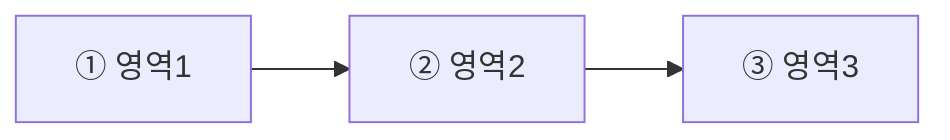
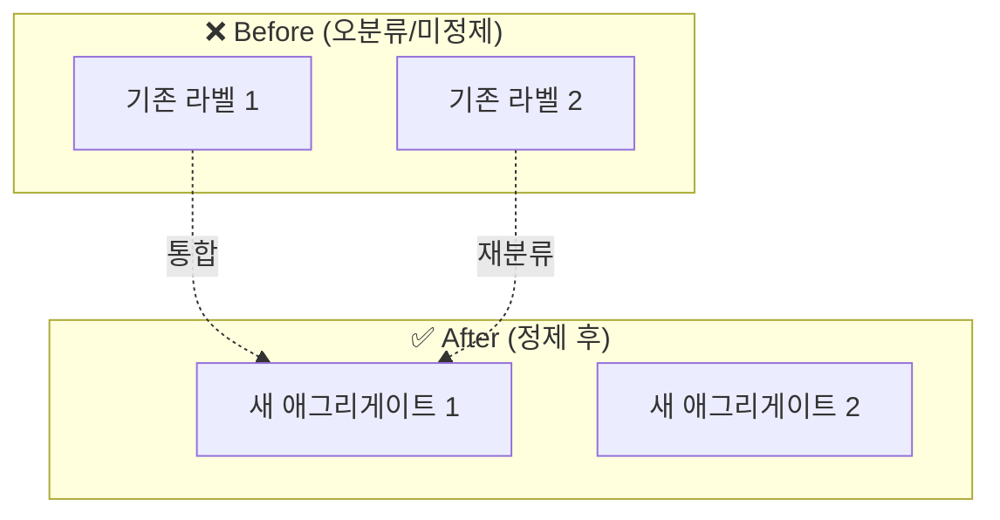
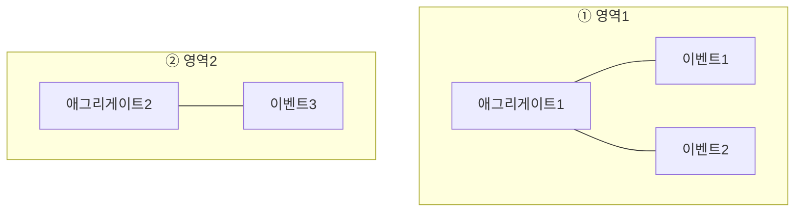
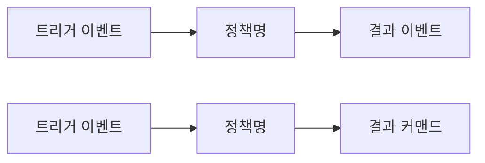
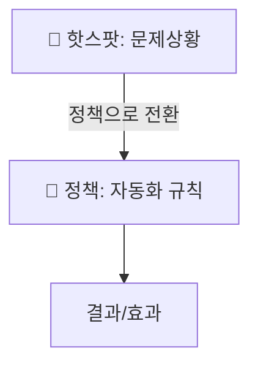
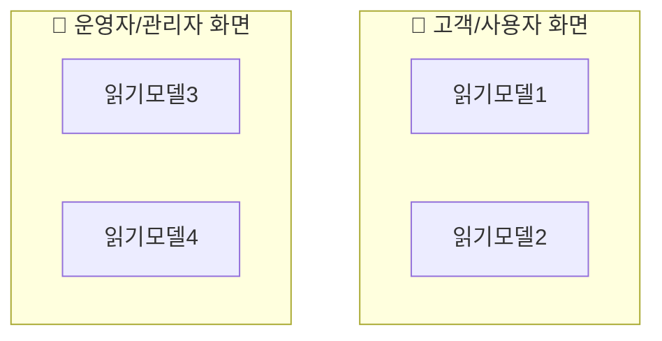
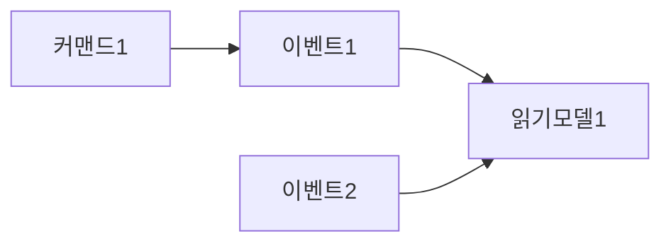
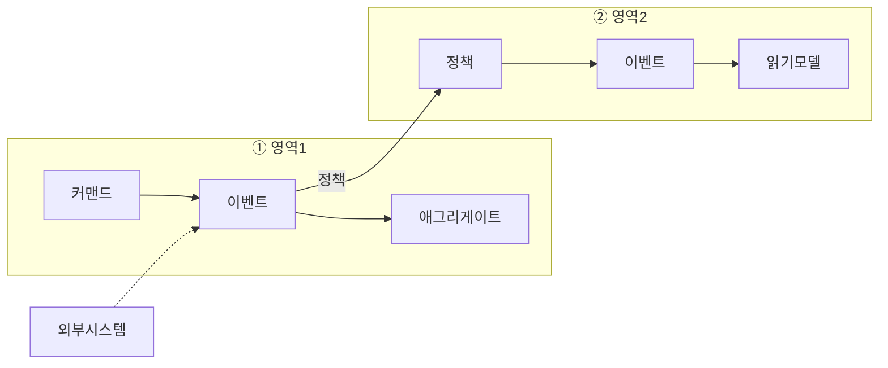

# Mermaid 스타일 및 다이어그램 명세

## classDef 표준 정의

모든 flowchart 다이어그램에서 사용할 classDef 패턴:

```
classDef event fill:#FF9800,color:#000,stroke:#E65100
classDef command fill:#2196F3,color:#fff,stroke:#1565C0
classDef aggregate fill:#FFEB3B,color:#000,stroke:#F9A825
classDef policy fill:#9C27B0,color:#fff,stroke:#6A1B9A
classDef external fill:#4CAF50,color:#fff,stroke:#2E7D32
classDef readmodel fill:#E3F2FD,color:#000,stroke:#1565C0,stroke-width:2px
classDef hotspot fill:#FF69B4,color:#fff,stroke:#C2185B
```

### 변형 classDef (특수 용도)

```
%% 신규 애그리게이트 (점선 테두리)
classDef newAgg fill:#FFEB3B,color:#000,stroke:#F9A825,stroke-width:3px,stroke-dasharray:5 5

%% 오분류 항목 (점선 테두리 + 이벤트 색상에 애그리게이트 테두리)
classDef wrong fill:#FF9800,color:#000,stroke:#F9A825,stroke-width:3px,stroke-dasharray:5 5

%% 읽기모델 용도별 색상
classDef customer fill:#FFF3E0,color:#000,stroke:#FF9800
classDef operator fill:#E8F5E9,color:#000,stroke:#4CAF50

%% 정책 결과
classDef result fill:#E1BEE7,color:#000,stroke:#6A1B9A

%% 강조 애그리게이트 (굵은 테두리)
classDef aggregate fill:#FFEB3B,color:#000,stroke:#F9A825,stroke-width:2px
```

### 노드에 class 적용

```mermaid
%% 방법 1: 인라인 (:::)
E1[이벤트명]:::event
C1[커맨드명]:::command

%% 방법 2: class 선언문
class E1,E2,E3 event
class C1,C2 command
```

## 다이어그램 10종 명세

### 1. 현황 요약 — `pie`


**필수 요소**: 최소 이벤트, 커맨드, 애그리게이트 3개 항목. 값이 0인 항목도 포함.

### 2. 흐름 영역 맵 — `flowchart LR`



**구조**: 각 영역을 노드로, 데이터/프로세스 흐름을 화살표로 연결.
영역 아래에 해당 영역의 대표 이벤트를 서브노드로 배치.

### 3. 타임라인 — `gantt`

```mermaid
gantt
    title {N차} 워크샵 타임라인
    dateFormat HH:mm
    axisFormat %H:%M

    section 준비
    참석자 입장·환경 세팅           :done, 09:00, 10m

    section Phase 1
    이벤트 정제                    :active, 09:10, 20m

    section Phase 2
    애그리게이트 식별               :09:30, 30m

    section 휴식
    Break                         :10:00, 10m

    section Phase 3
    정책 도출                      :10:10, 25m

    section Phase 4
    읽기 모델 도출                  :10:35, 25m

    section 정리
    전체 통합 및 정리               :11:00, 20m
```



**규칙**:
- `dateFormat HH:mm`, `axisFormat %H:%M` 고정
- 각 Phase에 소요 시간 명시
- 휴식 시간 포함
- `done`, `active` 상태는 문맥에 맞게

### 4. 애그리게이트 Before/After — `flowchart TB`



**필수 요소**: before/after subgraph, 오분류→정제 화살표

### 5. 영역별 매핑 — `flowchart TB` + subgraph



**구조**: 영역별 subgraph → 내부에 애그리게이트+이벤트 매핑

### 6. 정책 후보 맵 — `flowchart LR`



**구조**: `이벤트 → 정책 → 이벤트/커맨드` 체인

### 7. 핫스팟/정책 전환 또는 정책-이벤트 연결 — `flowchart TB` 또는 `flowchart LR`

차수에 따라 다이어그램 내용이 달라짐:

**2차 (정책-이벤트 연결):**


**3차+ (핫스팟→정책 전환):**


### 8. 읽기모델 후보 — `flowchart TB`



**구조**: 용도별(고객/운영자) subgraph로 분류

### 9. 읽기모델-이벤트 연결 — `flowchart LR`



**구조**: 이벤트/커맨드 → 읽기모델 데이터 흐름

### 10. 전체 통합 — `flowchart LR` + subgraph



**필수 요소**: 모든 요소 유형(이벤트, 커맨드, 애그리게이트, 정책, 읽기모델, 외부시스템)이 하나 이상 포함

## 렌더링 옵션

mermaid-cli 렌더링 시 표준 옵션:
- **width**: 1200px
- **background**: white
- **quality**: (기본값, -q 플래그로 quiet 모드)

```bash
npx -y @mermaid-js/mermaid-cli -i input.mmd -o output.png -w 1200 -b white -q
```
