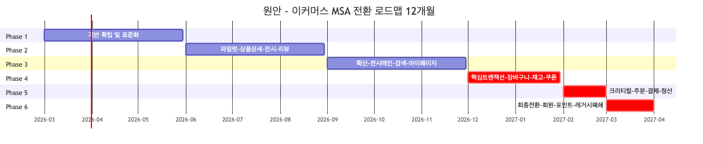
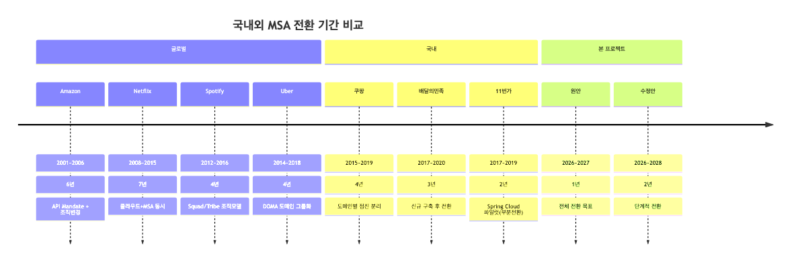
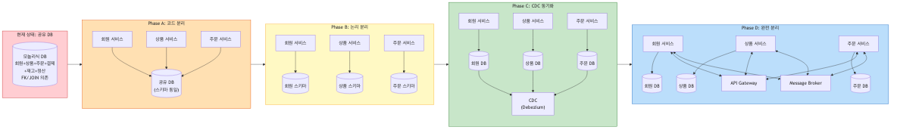
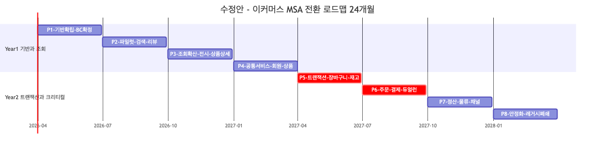
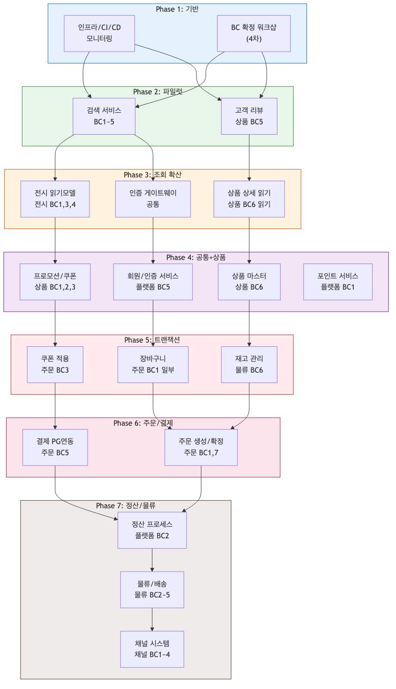
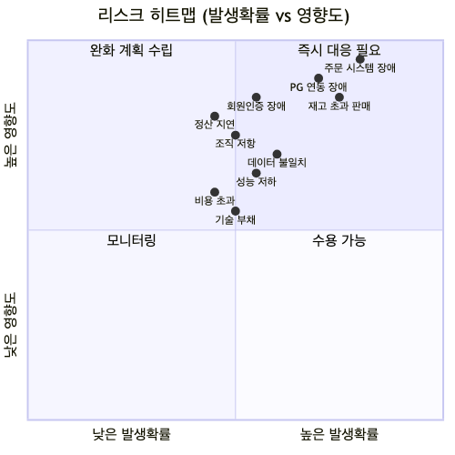

# 이커머스 MSA 전환 통합 로드맵 검토 및 분석

> **작성일**: 2026-03-31
> **기준**: 8개 부서 이벤트스토밍 워크샵 결과 (48개 BC 후보) + 사용자 로드맵 초안
> **목적**: 국내외 MSA 전환 사례와 비교하여 로드맵의 실현 가능성을 검증하고, 리스크를 최소화하는 수정안 제시

---

## 목차

1. [개요 및 분석 목적](#1-개요-및-분석-목적)
2. [현재 로드맵 요약 (원안)](#2-현재-로드맵-요약-원안)
3. [국내외 MSA 전환 사례 비교](#3-국내외-msa-전환-사례-비교)
4. [Phase별 상세 검토](#4-phase별-상세-검토)
5. [이벤트스토밍 결과와의 정합성 분석](#5-이벤트스토밍-결과와의-정합성-분석)
6. [누락 요소 및 보완 권장사항](#6-누락-요소-및-보완-권장사항)
7. [수정 로드맵 제안](#7-수정-로드맵-제안)
8. [리스크 매트릭스 및 완화 전략](#8-리스크-매트릭스-및-완화-전략)
9. [결론 및 핵심 권고](#9-결론-및-핵심-권고)

---

## 1. 개요 및 분석 목적

### 1.1 배경

본 프로젝트는 이커머스 모놀리식 시스템을 MSA로 전환하기 위해 **8개 부서 대상 이벤트스토밍 워크샵**을 진행하고, 그 결과로 도출된 **48개 바운디드 컨텍스트(BC) 후보**를 기반으로 전환 로드맵을 수립하고 있습니다.

### 1.2 분석 목적

| # | 분석 항목 | 핵심 질문 |
|---|---------|---------|
| 1 | **실현 가능성** | 12개월(2026.3~2027.3) 내 완전 전환이 현실적인가? |
| 2 | **Phase 순서** | 도메인 분리 순서가 의존성과 리스크를 적절히 반영하는가? |
| 3 | **사례 비교** | 국내외 유사 규모 전환 대비 일정과 접근법이 적절한가? |
| 4 | **누락 요소** | 데이터 마이그레이션, 조직, 테스트 등 빠진 영역은 없는가? |
| 5 | **BC 매핑** | 48개 BC 후보가 Phase별로 적절히 배치되었는가? |

### 1.3 현재 이벤트스토밍 진행 현황

```
부서              1차    2차    3차    4차(예정)
─────────────────────────────────────────────
검색서비스팀       ✅     ✅     ✅     → BC 경계 확정
상품서비스팀       ✅     ✅     ✅     → BC 통합/분리 검증
주문서비스팀       ✅     ✅     ✅     → BC 경계 확정
플랫폼개발팀       ✅     ✅     ✅     → BC 프리뷰 검증
전시서비스팀       ✅     ✅     -      → 3차 BC 검증
프론트개발팀       ✅     ✅     -      → 3차 프리뷰 검증
물류시스템         ✅     -      -      → 2차부터 시작
채널시스템         ✅     ✅     -      → 3차 서비스별 재배치
```

> **핵심 관찰**: BC 경계가 "확정"된 부서는 아직 **0개**. 4개 부서가 3차까지 진행했으나 모두 "후보 도출" 상태이며, 나머지 4개 부서는 2차 이하로 BC 검증조차 시작하지 않았습니다.

---

## 2. 현재 로드맵 요약 (원안)

### 2.1 전체 타임라인



### 2.2 Phase별 요약

| Phase | 기간 | 대상 | 목표 진척률 | 핵심 전략 |
|-------|------|------|:---------:|---------|
| **P1** | 3~5월 (3개월) | 프레임워크, CI/CD, DDD 설계 | 10→20% | 기반 확립 |
| **P2** | 6~8월 (3개월) | 상품 상세, 전시, 고객 리뷰 | 20→35% | 스트랭글러 패턴, CQRS |
| **P3** | 9~11월 (3개월) | 전시 메인, 검색, 마이페이지 | 35→50% | 공통 서비스 추출 |
| **P4** | 12~1월 (2개월) | 장바구니, 재고, 쿠폰/프로모션 | 50→75% | Saga 패턴, DB 분리 |
| **P5** | 2월 (1개월) | 주문 생성, 결제, 정산 | 75→90% | EDA(이벤트 기반) |
| **P6** | 3월 (1개월) | 회원, 포인트, 잔여 전체 | 90→100% | Full Cut-over |

---

## 3. 국내외 MSA 전환 사례 비교

### 3.1 글로벌 사례

#### Amazon (2001~2006, ~6년)

| 항목 | 내용 |
|------|------|
| **전환 동기** | 개발 팀 간 코드 충돌, 배포 병목, 확장성 한계 |
| **접근법** | Jeff Bezos의 "API Mandate" — 모든 팀은 서비스 인터페이스로만 통신 |
| **전환 기간** | 약 6년 (점진적, 서비스 단위 분리) |
| **핵심 교훈** | 조직 구조 변경이 선행됨 ("Two-Pizza Team"), 기술보다 문화 변화가 먼저 |
| **팀 규모** | 수천 명 개발자 |

**시사점**: Amazon은 기술 전환 이전에 **조직 구조를 먼저 변경**했습니다. 각 서비스를 소유하는 소규모 자율 팀(Two-Pizza Team)을 구성하고, 팀이 서비스의 개발-배포-운영 전체를 책임지는 "You Build It, You Run It" 문화를 정착시켰습니다.

#### Netflix (2008~2015, ~7년)

| 항목 | 내용 |
|------|------|
| **전환 동기** | 2008년 데이터센터 장애로 3일간 서비스 중단 |
| **접근법** | 데이터센터→AWS 클라우드 마이그레이션과 동시에 MSA 전환 |
| **전환 기간** | 약 7년 (2008 시작, 2015 완전 이관) |
| **핵심 교훈** | 카오스 엔지니어링(Chaos Monkey) 도입, 장애 내성 설계 우선 |
| **팀 규모** | ~500명 → 수천 명 (전환 중 성장) |

**시사점**: Netflix는 **클라우드 마이그레이션과 MSA를 동시에 진행**하면서도 7년이 소요되었습니다. 특히 데이터 마이그레이션이 가장 어려운 부분이었으며, Cassandra 등 NoSQL로의 전환에만 수년이 걸렸습니다.

#### Spotify (2012~2016, ~4년)

| 항목 | 내용 |
|------|------|
| **전환 동기** | 빠른 성장에 따른 개발 병목 |
| **접근법** | Squad/Tribe/Chapter/Guild 조직 모델 + 서비스 분리 |
| **전환 기간** | 약 4년 (핵심 서비스 기준) |
| **핵심 교훈** | 조직 모델이 아키텍처를 결정 (Conway's Law 적극 활용) |

#### Uber (2014~2018, ~4년)

| 항목 | 내용 |
|------|------|
| **전환 동기** | 글로벌 확장에 따른 모놀리스 한계 |
| **접근법** | DOMA(Domain-Oriented Microservice Architecture) 프레임워크 |
| **전환 기간** | 약 4년 (2,000+ 서비스로 분리) |
| **핵심 교훈** | 과도한 분리로 복잡성 폭발 → DOMA로 다시 도메인 단위 그룹화 |

**시사점**: Uber는 MSA 전환 후 **너무 많은 마이크로서비스로 인한 복잡성 문제**를 겪고, 도메인 단위로 서비스를 다시 그룹화하는 DOMA 패턴을 도입했습니다. 48개 BC 후보를 모두 독립 서비스로 만들 필요는 없다는 교훈입니다.

---

### 3.2 국내 이커머스 사례

#### 쿠팡 (2015~2019, ~4년)

| 항목 | 내용 |
|------|------|
| **전환 동기** | 하루 수백만 주문 처리를 위한 확장성 |
| **접근법** | 도메인별 점진적 분리, AWS 기반 |
| **전환 기간** | 약 4년 (핵심 서비스 기준, 이후에도 지속 진화) |
| **핵심 교훈** | 대규모 투자(인력+인프라) 병행, 로켓배송 등 물류 서비스를 독립적으로 분리 |
| **팀 규모** | 수천 명 개발자 (대규모 채용 병행) |

**시사점**: 쿠팡은 충분한 **인력 투입**(수천 명 수준)과 **인프라 투자**를 병행했습니다. 기존 서비스를 운영하는 팀과 신규 서비스를 개발하는 팀을 분리하여 병렬로 진행했습니다.

#### 배달의민족 (2017~2020, ~3년)

| 항목 | 내용 |
|------|------|
| **전환 동기** | 주문 폭증(치킨 대전 등 이벤트)에 따른 시스템 장애 |
| **접근법** | "시스템을 갈아엎지 말고, 새로 만들어라" — 신규 구축 후 트래픽 전환 |
| **전환 기간** | 약 3년 (주문 시스템 중심) |
| **분리 순서** | 가게 노출 → 주문 → 결제 → 배달 → 리뷰 |
| **핵심 교훈** | 주문 시스템 하나를 분리하는 데만 1년 이상 소요 |
| **팀 규모** | ~200명 → 500명+ (전환 중 성장) |

**시사점**: 배달의민족은 MSA 전환 중에도 **기존 모놀리스를 안정적으로 운영**하면서 신규 서비스를 병렬 구축했습니다. 주문 도메인 하나를 분리하는 데 1년 이상이 걸렸다는 점은 현 로드맵의 Phase 5(주문+결제+정산을 1개월)와 극명한 대조를 이룹니다.

#### 11번가 (2017~2019, ~2년)

| 항목 | 내용 |
|------|------|
| **전환 동기** | SK 인수 후 시스템 현대화 |
| **접근법** | Spring Cloud 기반, 파일럿(검색) → 확산 |
| **전환 기간** | 약 2년 (파일럿 6개월 + 확산 18개월), 단 전체 전환은 미완 |
| **분리 순서** | 검색(파일럿) → 상품 → 전시 → 주문(부분) |
| **핵심 교훈** | 검색 서비스를 파일럿으로 선정한 이유: 읽기 전용, 독립적, 실패 시 영향 제한적 |

**시사점**: 11번가의 파일럿 대상(검색)은 본 로드맵의 Phase 2 접근법과 일치합니다. 단, 11번가도 2년 내에 **전체 전환을 완료하지는 못했습니다**.

#### 카카오커머스 / 카카오 선물하기

| 항목 | 내용 |
|------|------|
| **접근법** | 선별적 MSA — 모든 것을 MSA로 전환하지 않고, 필요한 도메인만 분리 |
| **핵심 교훈** | "MSA는 목적이 아니라 수단" — 분리가 이득이 되는 서비스만 분리 |

---

### 3.3 사례 비교 종합



| 기업 | 전환 기간 | 개발자 규모 | 접근법 | 완전 전환 여부 |
|------|:--------:|:--------:|-------|:----------:|
| Amazon | ~6년 | 수천 명 | API Mandate + 조직 변경 | O |
| Netflix | ~7년 | 500→수천 명 | 클라우드+MSA 동시 | O |
| 쿠팡 | ~4년 | 수천 명 | 도메인별 점진 분리 | O (핵심) |
| 배달의민족 | ~3년 | 200→500명 | 신규 구축 후 전환 | O (핵심) |
| 11번가 | ~2년 | 수백 명 | Spring Cloud 파일럿 | △ (부분) |
| 카카오커머스 | 2~3년 | 수백 명 | 선별적 MSA | △ (선별적) |
| **본 프로젝트** | **12개월** | **?** | **스트랭글러 패턴** | **?** |

> **핵심 비교**: 국내외 어떤 사례에서도 12개월 내 이커머스 전체 MSA 전환을 달성한 경우는 없습니다. 가장 빠른 사례(11번가)도 2년 소요에 부분 전환이었으며, 유사 규모의 쿠팡/배달의민족은 3~4년이 소요되었습니다.

---

## 4. Phase별 상세 검토

### 4.1 Phase 1: 기반 확립 및 표준화 (2026.3~5, 3개월)

#### 원안
- 프레임워크 배포 및 핸즈온 교육
- CI/CD 파이프라인 및 모니터링(Observability) 구축
- DDD 도메인 분리 설계: BC 경계 확정
- 목표: 10→20%

#### 강점
- 기반 인프라를 먼저 구축하는 것은 올바른 접근
- 교육을 포함한 것은 조직 준비도 측면에서 적절

#### 우려 사항

| # | 우려 | 상세 |
|---|------|------|
| 1 | **과부하** | 프레임워크 + CI/CD + 모니터링 + DDD 설계를 3개월에 동시 추진은 각각이 수개월 소요되는 작업 |
| 2 | **BC 경계 미확정** | 현재 48개 BC 후보 중 "확정"된 것이 0개. 물류(1차), 채널(2차)은 아직 검증도 시작 못함 |
| 3 | **교육 효과** | 핸즈온 교육만으로 DDD/MSA 패러다임 전환은 어려움. 실제 프로젝트 경험이 필요 |
| 4 | **모니터링** | 분산 추적(Distributed Tracing), 중앙 로깅, 메트릭 수집 체계를 3개월 내 구축하는 것은 도전적 |

#### 권장 사항
- **P1을 두 단계로 분리**: P1a(프레임워크+CI/CD, 2개월) → P1b(모니터링+파일럿 준비, 2개월)
- **BC 확정 워크샵 병행**: 이벤트스토밍 4차(BC 경계 확정)를 P1과 병행 진행
- **플랫폼 엔지니어링 팀** 별도 구성: 인프라 기반을 전담할 팀 필요

---

### 4.2 Phase 2: 파일럿 및 조회 도메인 이관 (2026.6~8, 3개월)

#### 원안
- 대상: 상품 상세, 전시(기획전/이벤트), 고객 리뷰
- 스트랭글러 패턴 + API 게이트웨이
- CQRS 도입 검증
- 목표: 20→35%

#### 강점
- **읽기 중심 서비스 우선 분리**는 업계 표준 접근법 (11번가, 배달의민족 모두 동일)
- 스트랭글러 패턴 적용은 리스크 최소화에 효과적
- CQRS 검증을 파일럿 단계에서 수행하는 것은 적절

#### 우려 사항

| # | 우려 | 상세 |
|---|------|------|
| 1 | **상품 상세의 복잡성** | "상품 상세"는 단순 조회가 아님. 가격 계산, 프로모션 적용, 재고 확인, 배송비 계산 등 다수 도메인에 의존. 상품서비스팀 BC6(상품 관리)은 5개 부서가 의존하는 핵심 도메인 |
| 2 | **전시 도메인 미성숙** | 전시서비스팀은 2차까지만 진행. BC 검증(3차)도 안 된 상태에서 이관 대상에 포함 |
| 3 | **데이터 분리 전략 부재** | 상품 데이터의 소유권(Source of Truth) 정리 없이 서비스만 분리하면 분산 모놀리스가 됨 |

#### 권장 사항
- **파일럿 대상 재검토**: 상품 상세 대신 **검색 서비스**를 첫 파일럿으로 권장 (11번가 사례와 동일한 이유)
  - 검색은 CQRS의 자연스러운 적용 대상
  - 검색서비스팀이 3차까지 완료, 가장 높은 성숙도
  - 실패 시 레거시로 즉시 롤백 가능
- **전시는 P3로 이동**: BC 확정 후 이관

**파일럿 적합도 비교:**

| 후보 | BC 성숙도 | 의존성 | 읽기 비중 | 롤백 용이성 | 종합 적합도 |
|------|:--------:|:-----:|:-------:|:---------:|:--------:|
| 검색 | ★★★★ (3차) | 중 (상품 색인) | 99% | 높음 | **최적** |
| 상품 상세 | ★★★ (3차) | 높음 (5개 부서 의존) | 80% | 중간 | 부적합 |
| 전시 | ★★ (2차) | 중 | 90% | 높음 | 시기상조 |
| 고객 리뷰 | ★★★ (3차) | 낮음 | 95% | 높음 | 적합 |

---

### 4.3 Phase 3: 확산 및 가속화 (2026.9~11, 3개월)

#### 원안
- 대상: 전시 메인, 검색, 검색 필터, 마이페이지
- 공통 서비스 추출: 인증/인가, 알림, 공통 코드 관리
- 목표: 35→50%

#### 강점
- 공통 서비스(인증, 알림) 추출 시점이 적절 — 파일럿 경험 이후
- 검색과 전시를 이 단계에 배치한 것은 조회성 서비스 확산 차원에서 합리적

#### 우려 사항

| # | 우려 | 상세 |
|---|------|------|
| 1 | **인증/인가 분리 위험** | 회원/인증은 플랫폼개발팀 BC5로 3개 부서가 의존. 공통 서비스 추출은 맞지만, 이 시점에 분리하면 아직 전환되지 않은 레거시 서비스들도 동시에 영향받음 |
| 2 | **"마이페이지" 모호성** | 마이페이지는 단일 서비스가 아니라 회원, 주문 내역, 포인트, 쿠폰, 배송 추적 등 다수 도메인의 조합. BFF(Backend For Frontend) 패턴 없이는 분리 어려움 |
| 3 | **프론트 팀 미성숙** | 프론트개발팀은 2차까지만 진행. UI/기술 이벤트와 비즈니스 이벤트가 혼재된 상태 |

#### 권장 사항
- **공통 서비스는 "인프라 계층"으로 먼저 추출**: 인증/인가를 마이크로서비스로 분리하기보다, 먼저 **인증 게이트웨이(Auth Gateway)**로 추상화하고 점진적으로 분리
- **BFF 패턴 도입**: 프론트 팀이 백엔드 BC에 직접 의존하지 않도록 BFF 레이어 구성
- **마이페이지 대신 구체적 BC 명시**: "마이페이지" → "주문 조회(읽기 모델)", "배송 추적(읽기 모델)" 등

---

### 4.4 Phase 4: 핵심 트랜잭션 도메인 분리 (2026.12~2027.1, 2개월)

#### 원안
- 대상: 장바구니, 재고 관리, 쿠폰/프로모션 적용
- DB 물리적 분리, 서비스 간 API 참조
- Saga 패턴 적용
- 목표: 50→75%

#### 강점
- 트랜잭션 도메인을 후반부에 배치한 것은 적절
- Saga 패턴 언급은 분산 트랜잭션 관리에 대한 인식을 보여줌
- DB 분리를 명시한 것은 중요한 결정

#### 우려 사항

| # | 우려 | 상세 |
|---|------|------|
| 1 | **2개월은 DB 분리에 부족** | DB 물리적 분리는 MSA 전환에서 가장 어려운 부분. 데이터 마이그레이션, 참조 무결성 전환, 동기화 전략 수립에 최소 3~6개월 소요 |
| 2 | **Saga 패턴 난이도** | Saga는 설계+구현+테스트에 상당한 시간 필요. 보상 트랜잭션(Compensation) 설계만 해도 수주 소요 |
| 3 | **재고의 실시간성** | 재고 관리는 실시간 정합성이 중요. 이벤트 기반 eventual consistency로 전환 시 재고 초과 판매 위험 |
| 4 | **쿠폰/프로모션 중복** | 상품서비스팀 BC1,2,3과 주문서비스팀 BC3에 프로모션/쿠폰이 중복 존재. 소유권 정리 선행 필요 |
| 5 | **진척률 도약** | 50→75%(25% 점프)는 이전 Phase 대비 가장 큰 도약이나, 가장 어려운 영역 |

#### 권장 사항
- **DB 분리를 별도 스트림으로 관리**: 서비스 분리와 DB 분리를 동시에 하지 말고, 단계적으로 진행
  1. 먼저 서비스 코드를 분리하되 **공유 DB 유지** (Database-per-Service는 이후)
  2. API 경계를 안정화한 후 DB 분리
  3. 이중 쓰기(Dual Write) 또는 CDC(Change Data Capture)로 데이터 동기화
- **재고는 별도 관리**: 재고의 실시간 정합성은 이벤트 기반이 아닌 **강한 일관성(Strong Consistency)** 유지 권장
- **P4 기간을 3~4개월로 확대**

---

### 4.5 Phase 5: 크리티컬 도메인 이관 (2027.2, 1개월)

#### 원안
- 대상: 주문 생성, 결제(PG 연동), 정산 프로세스
- EDA(이벤트 기반 아키텍처) 완성
- 목표: 75→90%

#### 우려 사항 — **가장 높은 리스크**

| # | 우려 | 심각도 | 상세 |
|---|------|:-----:|------|
| 1 | **1개월은 극도로 부족** | 🔴 Critical | 배달의민족은 주문 시스템 하나에 1년+, 쿠팡도 주문/결제에 1년+ 소요 |
| 2 | **PG 연동 리스크** | 🔴 Critical | PG사 연동 변경은 금융 규제 대상. 테스트 기간만 수주 필요 |
| 3 | **정산은 별도 도메인** | 🟡 High | 정산은 주문/결제와 다른 생명주기를 가짐. 동시 이관은 위험 |
| 4 | **7개 이상 외부 시스템** | 🟡 High | 주문 생성 시 7+개 외부 시스템 동시 호출. 모두 MSA 환경에서 재검증 필요 |
| 5 | **매출 직결** | 🔴 Critical | 주문/결제 장애 = 직접적 매출 손실. 충분한 검증 기간 필수 |

#### 권장 사항
- **주문/결제를 최소 3개월로 확대**하고, 정산은 별도 Phase로 분리
- **듀얼 런(Dual Run)** 전략 필수: 레거시와 신규를 병행 운영하며 결과 비교
- **카나리 배포**: 전체 트래픽의 1% → 5% → 10% → 50% → 100% 단계적 전환
- **롤백 플랜**: 30초 이내 레거시로 복구 가능한 메커니즘 구축

---

### 4.6 Phase 6: 최종 전환 및 안정화 (2027.3, 1개월)

#### 원안
- 대상: 회원 정보, 포인트/예치금, 잔여 레거시 전체
- Full Cut-over
- 레거시 서버/DB 완전 폐쇄
- 카오스 엔지니어링 테스트
- 목표: 90→100%

#### 우려 사항

| # | 우려 | 심각도 | 상세 |
|---|------|:-----:|------|
| 1 | **회원은 공통 인프라** | 🔴 Critical | 회원/인증은 3개 부서가 의존. P6에서 분리하면 이미 전환된 P2~P5 서비스에도 영향 |
| 2 | **Full Cut-over 리스크** | 🔴 Critical | 1개월 내 레거시 완전 폐쇄는 롤백 불가능한 결정. 최소 3개월 병행 운영 필요 |
| 3 | **카오스 엔지니어링 타이밍** | 🟡 High | 카오스 테스트는 시스템 안정화 이후에 진행해야 하며, 전환 마지막 달에 하는 것은 시기적으로 위험 |
| 4 | **"잔여 전체"의 불확실성** | 🟡 High | 물류, 채널 등 BC 미확정 부서의 잔여 서비스가 포함될 수 있음 |

#### 권장 사항
- **회원/인증을 P3(공통 서비스 추출)로 앞당기기**: 다른 서비스가 의존하므로 먼저 분리
- **레거시 병행 운영 기간 확보**: 최소 3개월 듀얼 런 후 폐쇄 결정
- **카오스 엔지니어링은 P3부터 점진적 도입**: 서비스가 분리될 때마다 해당 서비스에 대해 테스트

---

## 5. 이벤트스토밍 결과와의 정합성 분석

### 5.1 로드맵 Phase ↔ BC 매핑

현재 로드맵의 Phase별 대상을 48개 BC 후보에 매핑하면:

| Phase | 로드맵 대상 | 해당 BC | BC 성숙도 | 정합성 |
|-------|-----------|--------|:--------:|:-----:|
| P2 | 상품 상세 | 상품 BC6, 전시 BC3 | 3차/2차 | ⚠️ |
| P2 | 전시(기획전) | 전시 BC7, 상품 BC2 | 2차/3차 | ❌ |
| P2 | 고객 리뷰 | 상품 BC5 | 3차 | ✅ |
| P3 | 전시 메인 | 전시 BC1, BC4 | 2차 | ❌ |
| P3 | 검색 | 검색 BC1~5 전체 | 3차 | ✅ |
| P3 | 마이페이지 | 프론트 BC3,5,6 (복합) | 2차 | ❌ |
| P4 | 장바구니 | 주문 BC1 (일부) | 3차 | ⚠️ |
| P4 | 재고 관리 | 물류 BC6 | 1차 | ❌ |
| P4 | 쿠폰/프로모션 | 상품 BC1,2,3 | 3차 | ⚠️ |
| P5 | 주문 생성 | 주문 BC1,7 | 3차 | ⚠️ |
| P5 | 결제 | 주문 BC5 | 3차 | ⚠️ |
| P5 | 정산 | 플랫폼 BC2 | 3차 | ⚠️ |
| P6 | 회원 | 플랫폼 BC5 | 3차 | ❌ (순서 문제) |
| P6 | 포인트 | 플랫폼 BC1 | 3차 | ⚠️ |
| P6 | 잔여 전체 | 물류 전체, 채널 전체, 협력사 등 | 1~2차 | ❌ |

**정합성 요약:**
- ✅ 적합: 2개 (고객 리뷰, 검색)
- ⚠️ 조건부 적합: 7개 (BC는 도출되었으나 경계 미확정)
- ❌ 부적합: 6개 (BC 미성숙 또는 순서 문제)

### 5.2 핵심 불일치

#### 불일치 1: 물류 시스템의 위치

물류시스템은 1차 워크샵만 완료(이벤트 66개만 도출)하여 **가장 낮은 성숙도**를 보이고 있으나, 로드맵에서는 P4(재고 관리)와 P6(잔여)에 배치되어 있습니다.

**문제**: 재고 관리(물류 BC6)를 P4에서 분리하려면, 최소 P1 기간 중 물류팀 워크샵 2~3차를 완료하고 BC를 확정해야 합니다.

#### 불일치 2: 회원/인증의 위치

회원/인증(플랫폼 BC5)은 **3개 부서가 의존하는 공통 서비스**인데 P6(마지막)에 배치되어 있습니다.

**문제**: P2~P5에서 분리된 서비스들이 여전히 모놀리스의 회원/인증에 의존하게 되어, 진정한 서비스 독립성을 확보할 수 없습니다.

#### 불일치 3: 전시 서비스의 조기 배치

전시서비스팀은 2차까지만 진행하여 BC 검증이 안 된 상태인데, P2(파일럿)의 대상에 포함되어 있습니다.

---

## 6. 누락 요소 및 보완 권장사항

### 6.1 누락된 핵심 영역

| # | 누락 영역 | 중요도 | 설명 | 권장 대응 |
|---|---------|:-----:|------|---------|
| 1 | **데이터 마이그레이션 전략** | 🔴 | DB 분리 방법, 데이터 동기화, 참조 무결성 전환 계획 없음 | CDC(Change Data Capture) 또는 이중 쓰기 전략 수립 |
| 2 | **조직 구조 전환** | 🔴 | Conway's Law — 아키텍처는 조직 구조를 따름. 현재 8개 부서가 48개 BC를 어떻게 소유할지 미정 | 서비스별 오너십 매핑, Cross-functional 팀 구성 계획 |
| 3 | **테스트 전략** | 🔴 | 분산 환경의 통합 테스트, 컨트랙트 테스트, E2E 테스트 전략 없음 | 테스트 피라미드 정의, Consumer-Driven Contract Test 도입 |
| 4 | **롤백 계획** | 🔴 | 각 Phase에서 문제 발생 시 레거시 복구 절차 없음 | Phase별 롤백 기준(SLA 위반 등)과 자동 롤백 메커니즘 |
| 5 | **인프라 플랫폼** | 🟡 | 컨테이너 오케스트레이션(K8s), 서비스 메시, API Gateway 등 구체적 기술 스택 미정 | P1에서 기술 스택 결정 및 PoC |
| 6 | **서비스 간 통신 전략** | 🟡 | 동기(REST/gRPC) vs 비동기(Kafka/RabbitMQ) 결정 없음 | 도메인별 통신 패턴 매핑 (동기/비동기 결정) |
| 7 | **모니터링/관측성(Observability)** | 🟡 | 분산 추적, 로그 집계, 메트릭 수집의 구체적 계획 없음 | OpenTelemetry + 중앙 로깅 + 대시보드 구축 |
| 8 | **보안** | 🟡 | 서비스 간 인증/인가(mTLS, JWT 전파), 시크릿 관리 전략 없음 | Zero Trust 아키텍처 적용 계획 |
| 9 | **성능 기준선(Baseline)** | 🟡 | 현재 모놀리스의 성능 지표가 없으면 전환 후 비교 불가 | 전환 전 주요 API의 응답 시간, TPS, 에러율 측정 |
| 10 | **비용 분석** | 🟡 | MSA 전환에 따른 인프라 비용 증가 예측 없음 | 클라우드 비용 시뮬레이션 |

### 6.2 데이터 마이그레이션 — 가장 과소평가된 영역

MSA 전환에서 **가장 시간이 많이 소요되고, 가장 실패 확률이 높은 부분**이 데이터 마이그레이션입니다.



**현재 상태 (추정)**:
```
┌─────────────────────────────────────┐
│         모놀리식 공유 DB              │
│                                      │
│  회원  상품  주문  결제  재고  정산   │
│  ├──┤  ├──┤  ├──┤  ├──┤  ├──┤  ├──┤ │
│  │FK│  │FK│  │FK│  │FK│  │FK│  │FK│ │
│  └──┘  └──┘  └──┘  └──┘  └──┘  └──┘ │
│     ↕ JOIN ↕ JOIN ↕ JOIN ↕ JOIN ↕    │
└─────────────────────────────────────┘
```

**목표 상태**:
```
┌──────┐  ┌──────┐  ┌──────┐  ┌──────┐  ┌──────┐  ┌──────┐
│회원DB│  │상품DB│  │주문DB│  │결제DB│  │재고DB│  │정산DB│
└──┬───┘  └──┬───┘  └──┬───┘  └──┬───┘  └──┬───┘  └──┬───┘
   │ API     │ Event   │ API     │ Event   │ API     │ Batch
   ▼         ▼         ▼         ▼         ▼         ▼
┌──────────────────────────────────────────────────────────┐
│                   서비스 간 통신 레이어                    │
│            (API Gateway + Message Broker)                 │
└──────────────────────────────────────────────────────────┘
```

**전환 중간 단계 (필수)**:
```
Phase A: 공유 DB + 서비스 분리 (코드만 분리)
Phase B: 논리적 분리 (스키마 분리, 물리 DB는 공유)
Phase C: 물리적 분리 (CDC로 동기화하며 점진적 분리)
Phase D: 완전 분리 (API/이벤트로만 통신)
```

> **핵심**: 현 로드맵은 Phase C와 D를 P4에서 2개월 만에 달성하려 합니다. 업계에서는 이 과정만 6개월~1년이 소요됩니다.

---

## 7. 수정 로드맵 제안

### 7.1 수정 원칙

1. **BC 확정이 선행**: 이벤트스토밍이 완료되지 않은 도메인은 전환 대상에서 제외
2. **의존 순서 준수**: Upstream(데이터 소유자)을 먼저 분리하고, Downstream(소비자)이 따라감
3. **사례 기반 일정**: 국내 유사 사례(배달의민족 3년, 11번가 2년) 참조
4. **리스크 순차 증가**: 조회 → 공통 인프라 → 비즈니스 로직 → 트랜잭션 → 크리티컬
5. **롤백 가능성 유지**: 각 Phase에서 레거시 복구 가능한 상태 유지

### 7.2 수정 로드맵 — 2년 계획 (2026.3~2028.3)





#### Year 1: 기반 + 파일럿 + 조회 도메인 (2026.3~2027.3)

```
2026
 Q2 (4~6)          Q3 (7~9)           Q4 (10~12)
├── P1: 기반 ──────┤                   │
│  프레임워크       ├── P2: 파일럿 ────┤
│  CI/CD            │  검색 서비스       ├── P3: 조회 확산 ───┤
│  모니터링         │  고객 리뷰         │  전시(읽기 모델)    │
│  BC 확정 워크샵   │  BFF 레이어        │  상품 상세(읽기)    │
│  기술 스택 PoC    │  API Gateway       │  공통: 인증 GW      │
│  성능 Baseline    │  CQRS 검증         │  공통: 알림 서비스   │
│                   │                    │  DB 논리적 분리 시작 │
│                   │                    │                      │
│  [0→10%]          │  [10→25%]          │  [25→40%]            │

2027
 Q1 (1~3)
├── P4: 공통 서비스 + 상품 ──────────┤
│  회원/인증 서비스 분리               │
│  상품 마스터 서비스 분리             │
│  프로모션/쿠폰 서비스 분리           │
│  포인트 서비스 분리                  │
│  DB 물리적 분리 (회원, 상품)         │
│                                      │
│  [40→55%]                            │
```

**Year 1 목표: 55% (조회성 + 공통 인프라 + 상품 마스터)**

#### Year 2: 트랜잭션 + 크리티컬 + 안정화 (2027.4~2028.3)

```
2027
 Q2 (4~6)          Q3 (7~9)           Q4 (10~12)
├── P5: 트랜잭션 ──┤                   │
│  장바구니          ├── P6: 주문/결제 ─┤
│  재고 관리         │  주문 생성         ├── P7: 정산/물류 ──┤
│  쿠폰 적용         │  결제(PG 연동)     │  정산 프로세스      │
│  Saga 설계+구현    │  듀얼 런           │  물류/배송          │
│  DB 분리(주문)     │  카나리 배포       │  협력사 운영        │
│                    │                    │  채널 시스템        │
│  [55→65%]          │  [65→80%]          │  [80→90%]           │

2028
 Q1 (1~3)
├── P8: 안정화 + 레거시 폐쇄 ──────────┤
│  잔여 레거시 전환                      │
│  카오스 엔지니어링                     │
│  성능 최적화                           │
│  레거시 DB 폐쇄 (3개월 병행 후)        │
│  운영 안정화                           │
│                                        │
│  [90→100%]                             │
```

**Year 2 목표: 100% (트랜잭션 + 크리티컬 + 안정화)**

### 7.3 원안 vs 수정안 비교

| 항목 | 원안 | 수정안 | 변경 이유 |
|------|------|--------|---------|
| **총 기간** | 12개월 | 24개월 | 국내외 사례 기반 현실적 일정 |
| **Phase 수** | 6개 | 8개 | 세분화로 리스크 관리 |
| **파일럿 대상** | 상품 상세, 전시 | 검색, 고객 리뷰 | BC 성숙도, 의존성 고려 |
| **회원/인증 위치** | P6 (마지막) | P4 (중반) | 3개 부서 의존 → 선행 분리 필수 |
| **주문/결제 기간** | 1개월 | 3개월 | 배달의민족 사례(1년+) 참조 |
| **DB 분리** | P4에서 일괄 | P3~P7 점진적 | 가장 위험한 작업을 분산 |
| **레거시 폐쇄** | P6 (즉시) | P8 (3개월 병행 후) | 롤백 가능성 확보 |
| **카오스 엔지니어링** | P6 (마지막) | P2부터 점진적 | 서비스 분리 즉시 적용 |

### 7.4 선택지: 12개월 고수 시 스코프 축소안

만약 비즈니스 요구로 12개월을 고수해야 한다면, **전체 전환이 아닌 50% 전환**을 목표로 스코프를 축소해야 합니다.

**12개월 스코프 축소안:**

| Phase | 기간 | 대상 | 목표 |
|-------|------|------|------|
| P1 | 3~5월 | 기반 + BC 확정 | 10% |
| P2 | 6~8월 | 검색 + 리뷰 (파일럿) | 25% |
| P3 | 9~11월 | 상품 상세 + 전시(읽기) + 인증 GW | 40% |
| P4 | 12~2월 | 상품 마스터 + 프로모션 + 회원 | 50% |

**제외 대상 (Year 2로 이관):**
- 주문/결제/정산 (가장 크리티컬)
- 물류/재고 (BC 미확정)
- 채널 시스템 (BC 미확정)
- 레거시 폐쇄 (병행 운영 유지)

> **핵심 메시지**: "12개월에 100%"보다 "12개월에 확실한 50%"가 훨씬 안전하고 지속 가능합니다. 성급한 전환으로 장애가 발생하면, 전체 MSA 프로젝트의 신뢰를 잃을 수 있습니다.

---

## 8. 리스크 매트릭스 및 완화 전략

### 8.1 리스크 히트맵



### 8.2 Top 10 리스크 상세

| # | 리스크 | 발생확률 | 영향도 | Phase | 완화 전략 |
|---|--------|:------:|:-----:|:-----:|---------|
| 1 | **주문 시스템 장애** | 높음 | 높음 | P5~P6 | 듀얼 런 + 카나리 배포 + 30초 롤백 |
| 2 | **PG 연동 장애** | 높음 | 높음 | P5~P6 | Multi-PG 전략 + PG사 사전 협의 + 충분한 UAT |
| 3 | **회원/인증 장애** | 중간 | 높음 | P4 | 인증 게이트웨이 우선 구축 + Circuit Breaker |
| 4 | **정산 데이터 불일치** | 중간 | 높음 | P7 | 이중 정산(레거시+신규) 결과 비교 + 일별 대사 |
| 5 | **재고 초과 판매** | 높음 | 높음 | P5 | 재고는 강한 일관성 유지 + 비관적 잠금(Pessimistic Lock) |
| 6 | **데이터 마이그레이션 실패** | 중간 | 중간 | P3~P7 | CDC(Change Data Capture) + 데이터 대사 자동화 |
| 7 | **조직 저항/변화 관리** | 중간 | 높음 | 전체 | 챔피언 팀 운영 + 성공 사례 공유 + 교육 |
| 8 | **성능 저하** | 중간 | 중간 | P2~ | 성능 Baseline 측정 + APM 도구 + SLA 정의 |
| 9 | **기술 부채 누적** | 중간 | 중간 | 전체 | 스프린트 내 20% 리팩토링 시간 확보 |
| 10 | **인프라 비용 초과** | 중간 | 중간 | P2~ | 클라우드 비용 모니터링 + Reserved Instance |

### 8.3 Phase별 Go/No-Go 기준

각 Phase 전환 시 아래 기준을 충족해야 다음 Phase로 진행:

| Phase 전환 | Go 조건 | No-Go 시 대응 |
|-----------|---------|--------------|
| P1→P2 | BC 확정 완료 (파일럿 대상), CI/CD 동작, 모니터링 구축 | P1 연장 (최대 2개월) |
| P2→P3 | 파일럿 SLA 충족 (응답 시간, 에러율), 롤백 검증 완료 | P2 연장, 이슈 해결 후 재평가 |
| P3→P4 | 조회 서비스 안정 운영 2주+, DB 논리 분리 완료 | P3 연장, DB 분리 전략 재수립 |
| P4→P5 | 공통 서비스 안정 운영 1개월+, 성능 Baseline 대비 90%+ | P4 연장, 성능 튜닝 |
| P5→P6 | Saga 패턴 검증 완료, 재고 정합성 테스트 통과 | P5 연장, Saga 보상 로직 보완 |
| P6→P7 | 주문/결제 듀얼 런 대사 100% 일치, PG 통합 테스트 통과 | P6 연장, 듀얼 런 기간 확대 |
| P7→P8 | 정산 대사 100% 일치, 물류 연동 테스트 통과 | P7 연장 |

---

## 9. 결론 및 핵심 권고

### 9.1 종합 평가

현재 로드맵 원안은 **Phase 순서(조회→확산→트랜잭션→크리티컬)와 핵심 전략(스트랭글러 패턴, CQRS, Saga, EDA)에 대한 이해가 올바르며**, MSA 전환의 방향성 자체는 적절합니다.

그러나 **일정(12개월)은 국내외 어떤 유사 규모 사례와 비교해도 극도로 공격적**이며, 아래 핵심 리스크를 내포하고 있습니다:

### 9.2 5대 핵심 권고

#### 권고 1: 일정을 24개월로 확대하거나, 12개월 시 스코프를 50%로 축소

> "빠른 실패(Fast Fail)"보다 위험한 것은 "빠른 성공을 시도하다가 느린 실패를 맞는 것"입니다.

- 12개월 × 100% 전환: 국내외 사례 대비 **비현실적**
- 24개월 × 100% 전환: 국내 선두 사례(배달의민족 3년) 대비 **도전적이나 가능**
- 12개월 × 50% 전환: **현실적이고 안전한 선택**

#### 권고 2: 파일럿 대상을 검색 서비스로 변경

| 항목 | 상품 상세 (원안) | 검색 서비스 (권장) |
|------|:---------------:|:----------------:|
| BC 성숙도 | 3차 | 3차 |
| 외부 의존성 | 5개 부서 의존 (높음) | 중간 (상품 색인) |
| 읽기 비중 | 80% | 99% |
| CQRS 적합도 | 중간 | 최적 (자연스러운 CQRS) |
| 실패 시 영향 | 매출 직결 | 레거시 폴백 용이 |
| 업계 사례 | - | 11번가 검색 파일럿 성공 |

#### 권고 3: 회원/인증을 Phase 중반으로 앞당기기

회원/인증은 3개 부서가 의존하는 **공통 인프라**입니다. 마지막에 분리하면:
- P2~P5에서 분리된 서비스가 여전히 모놀리스의 회원 DB에 직접 접근
- 진정한 서비스 독립성 불가
- 회원 분리 시 이미 전환된 모든 서비스에 재작업 발생

**권장 순서**: 인증 게이트웨이(P3) → 회원 서비스 분리(P4) → 다른 서비스가 신규 회원 API로 전환

#### 권고 4: 데이터 마이그레이션 전략을 별도 스트림으로 관리

```
서비스 분리 스트림:  코드 분리 → API 경계 안정화 → 독립 배포
                          ↕ (병렬 진행)
데이터 분리 스트림:  스키마 분석 → 논리 분리 → CDC 구축 → 물리 분리 → 대사 검증
```

- 서비스 코드 분리와 DB 분리를 **동시에 하지 않기**
- 먼저 코드를 분리하되 공유 DB 유지 → API 안정화 → DB 분리 순서

#### 권고 5: Phase별 Go/No-Go 게이트 도입

각 Phase 전환 시 **명시적인 검증 기준**을 충족해야만 다음으로 진행:
- SLA 충족 (응답 시간, 에러율, 가용성)
- 데이터 정합성 검증 통과
- 롤백 테스트 완료
- 성능 Baseline 대비 90% 이상

> **"Go/No-Go 게이트 없는 MSA 전환은 브레이크 없는 자동차와 같습니다."**

### 9.3 즉시 실행 항목 (Next Actions)

| # | 항목 | 담당 | 기한 |
|---|------|------|------|
| 1 | 이벤트스토밍 4차 워크샵 일정 확정 (BC 경계 확정) | PM/퍼실리테이터 | 2026년 4월 |
| 2 | 물류시스템/채널시스템 워크샵 가속 (2~3차 병행) | 해당 팀 리더 | 2026년 5월 |
| 3 | 기술 스택 PoC (K8s, API Gateway, Message Broker) | 플랫폼팀 | 2026년 5월 |
| 4 | 현재 모놀리스 성능 Baseline 측정 | DevOps/SRE | 2026년 4월 |
| 5 | 데이터 마이그레이션 전략 수립 (현재 DB 스키마 분석) | DBA/아키텍트 | 2026년 5월 |
| 6 | 서비스 오너십 매핑 (48개 BC → 팀 배정) | 기술 리더 | 2026년 4월 |
| 7 | 12개월 vs 24개월 경영진 의사결정 | PM/CTO | 2026년 4월 |

---

## 부록: 참조 문서

| 문서 | 설명 |
|------|------|
| `이벤트스토밍_부서별_BC후보_종합정리.md` | 8개 부서 48개 BC 후보 현황 |
| `이벤트스토밍_전체부서_외부시스템_의존성_분석.md` | 59개 외부 시스템 의존성 |
| 각 부서별 `*워크샵검토.md` | 부서별 달성률, 미완료 항목, 권장사항 |
| 각 부서별 `*_BC.drawio.xml` | BC 오버레이 다이어그램 |

## 부록: 국내외 사례 참고 자료

| 사례 | 핵심 참고 포인트 |
|------|---------------|
| Amazon API Mandate (2002) | 조직 변경 선행, "You Build It, You Run It" |
| Netflix Cloud Migration (2008~2015) | 데이터 마이그레이션 난이도, 카오스 엔지니어링 |
| Uber DOMA (2020) | 과도한 분리 후 재그룹화 — 48개 BC 전부 독립 서비스로 만들 필요 없음 |
| 배달의민족 MSA (2017~2020) | 주문 시스템 분리에 1년+, 듀얼 런 전략 |
| 11번가 MSA (2017~2019) | 검색 파일럿 성공, Spring Cloud 기반 |
| 카카오커머스 | 선별적 MSA — "MSA는 목적이 아니라 수단" |
