# 검색 서비스팀 이벤트 스토밍 2차 워크샵 검토 및 보완 사항

## 1. 개요

### 1.1 이 문서의 목적

```
┌─────────────────────────────────────────────────────────────┐
│              이 문서의 3가지 목적                              │
├─────────────────────────────────────────────────────────────┤
│                                                             │
│  ✅ 2차 워크샵 수행 결과를 준비 문서 대비 분석              │
│  ✅ draw.io 결과물의 색상 오분류 정리 및 교정안 도출        │
│  ✅ 3차 워크샵 방향 및 타임라인 설정                        │
│                                                             │
└─────────────────────────────────────────────────────────────┘
```

### 1.2 워크샵 기본 정보

| 항목 | 내용 |
|------|------|
| 일시 | 2026년 3월 (2차 워크샵) |
| 참석자 | 검색서비스개발팀 |
| 수행 범위 | ① 검색 진입 ~ ② 검색 수행 영역 집중 |
| 산출물 | draw.io 보드 (포스트잇 43개) |

### 1.3 참조 문서

| 참조 문서 | 활용 시점 |
|----------|----------|
| [이벤트스토밍_검색서비스팀_2차워크샵준비.md](./이벤트스토밍_검색서비스팀_2차워크샵준비.md) | 목표 수치, Phase 구조 — 달성도 비교 기준 |
| [이벤트스토밍_검색서비스팀_가이드.md](./이벤트스토밍_검색서비스팀_가이드.md) | 팀 특화 도전 과제 — 퍼실리테이터 유의 사항 참조 |
| [이벤트스토밍_시각화_가이드.md](./이벤트스토밍_시각화_가이드.md) | 포스트잇 색상·배치 패턴 |

---

## 2. 수행 결과 요약

### 2.1 실제 수행 범위

2차 워크샵에서 실제로 수행된 활동:

1. **① 검색 진입 영역** — 추천/인기 키워드, 검색창 진입, 자동완성 흐름 도출
2. **② 검색 수행 영역** — 검색어 입력 → 검색하기 → 결과 노출 흐름 도출
3. **⑥⑦ 검색 로그·사전 관리 영역 일부** — 로그 수집, 자동완성·연관검색어·인기검색어 생성, 추천·광고 상품 흐름 부분 논의

### 2.2 draw.io 분석 결과 (43개 포스트잇)

| 유형 | 색상 | 수량 | 항목 |
|------|------|------|------|
| 이벤트 🟧 | 오렌지 `#FF8C00` | 14개 | 추천/인기 키워드 목록이 서버로부터, 자동완성 요청됨, 검색창에 검색어가 입력되었다, 검색결과 화면이 노출되었다, 검색어가 로깅되었다, 검색키워드 중 교정되었다, 검색대상 상품데이터가 저장되었다, 자동완성이 생성되었다, 연관검색어가 생성되었다, 인기검색어가 생성되었다, 추천상품 요청 받았다, 추천상품이 노출되었다, 광고상품 요청 되었다, 광고상품이 노출되었다 |
| 커맨드 🟦 | 파랑 `#4A90D9` | 8개 | 검색창 진입, 검색어 입력, 검색하기, 재검색 하기, 전체 수집색인하기, 검색로그 수집하기, 추천상품 요청, 광고상품 요청 |
| 애그리게이트 🟨 | 노랑 `#FFD700` | 12개 | 사용자 옷, 인기/추천 검색어, 자동완성 데이터, 검색결과 데이터, 검색로그 데이터, **배치 시스템 Jenkins** (2개), 상품 데이터, 검색로그정보, 성공검색어 로그데이터, 추천 데이터, 광고 상품 |
| 정책 💜 | 보라 `#9B59B6` | 1개 | 로그검증정책 |
| 핫스팟 🩷 | 핑크 `#FF69B4` | 5개 | **상품정보 통합 DB**, **DW 로그정보**, **실시간 오로라 로그정보**, **추천 API**, **광고 API** |
| 미분류 | 회색 `#CCCCCC` | 3개 | 검색결과 노출정책, 전시 API 호출?, 상품 유효성 검토 정책 |

### 2.3 현황 요약 다이어그램

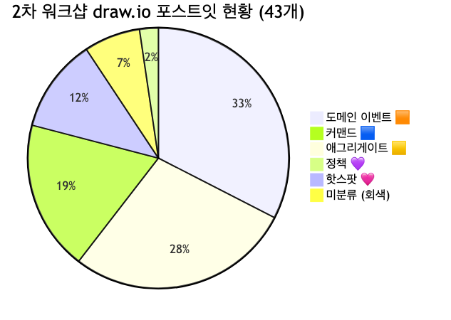

<details>
<summary>📊 원본 Mermaid 코드 보기</summary>

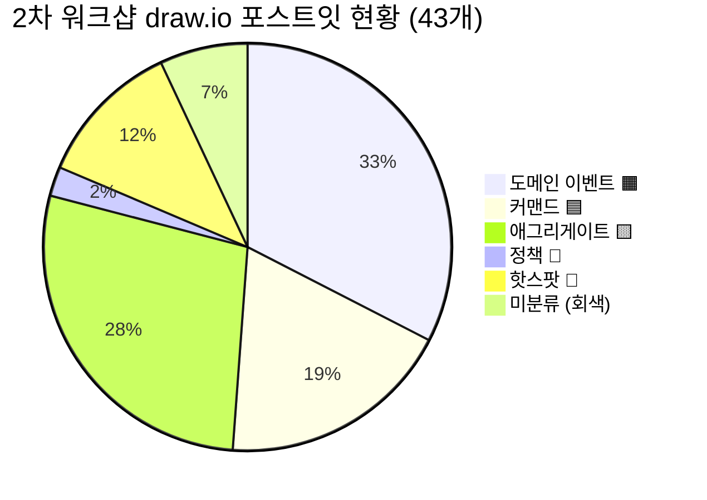

</details>

---

## 3. 준비 문서 대비 달성도

### 3.1 목표 달성 비교표

| 항목 | 2차 준비 문서 목표 | 실제 수행 결과 | 달성 |
|------|-------------------|---------------|------|
| 이벤트 정제 | 40개 → ~30개로 통합 | 미수행 (43개 신규 도출, 1차 정제 미실행) | ⬜ |
| 애그리게이트 식별 | 7개 → 10개 후보 확정 | 12개 도출 (오분류 포함, 미정제) | ⬜ |
| 정책 도출 | 2개 → 6개 후보 | 1개 도출 + 미분류 2개 (실질 3개) | ⬜ |
| 읽기 모델 도출 | 6개 후보 | **미수행** | ⬜ |
| 바운디드 컨텍스트 프리뷰 | 후보 3~5개 | **미수행** | ⬜ |

**분석:** 2차 워크샵은 준비 문서의 Phase 1(이벤트 정제) 이전 단계인 **이벤트·커맨드 추가 도출**에 집중되었습니다. 1차 결과 정제보다는 ①②영역의 새로운 요소 발굴이 주요 활동이었습니다.

### 3.2 Phase별 수행 현황

| Phase | 준비 문서 계획 | 계획 소요 | 실제 수행 | 비고 |
|-------|--------------|----------|----------|------|
| 오프닝 | 1차 리뷰 & 2차 목표 안내 | 10분 | ✅ 수행 | |
| Phase 1 | 이벤트 정제 (재검토·통합) | 20분 | ⬜ 미수행 | 1차 이벤트 정제 대신 신규 도출 |
| Phase 2 | 애그리게이트 식별 | 30분 | ⬜ 부분 수행 | 데이터 레이블 수준, 비즈니스 재정의 미완 |
| Phase 3 | 정책 도출 | 25분 | ⬜ 부분 수행 | 1개 명시 + 2개 미분류 |
| Phase 4 | 읽기 모델 도출 | 25분 | ⬜ 미수행 | |
| 마무리 | 전체 통합 & BC 프리뷰 | 20분 | ⬜ 미수행 | |

### 3.3 7개 흐름 영역 커버리지

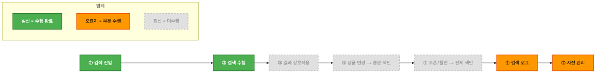

<details>
<summary>📊 원본 Mermaid 코드 보기</summary>

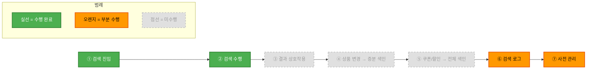

</details>

| 영역 | 상태 | 도출 요소 |
|------|------|----------|
| ① 검색 진입 | ✅ 수행 | 이벤트 2, 커맨드 1, 애그리게이트 2 |
| ② 검색 수행 | ✅ 수행 | 이벤트 4, 커맨드 3, 애그리게이트 3 |
| ③ 결과 상호작용 | ⬜ 미수행 | 이벤트 2개만 간접 언급 (검색결과 노출, 키워드 교정) |
| ④ 상품 변경 → 증분 색인 | ⬜ 미수행 | 전체 수집색인 커맨드만 존재, 상세 흐름 미도출 |
| ⑤ 쿠폰/할인 → 전체 색인 | ⬜ 미수행 | 미논의 |
| ⑥ 검색 로그 | 🟧 부분 | 로그 수집·로그검증정책은 도출, 파생 흐름 불완전 |
| ⑦ 사전 관리 | 🟧 부분 | 자동완성·연관검색어·인기검색어 생성만 도출, 사전·부스팅 미논의 |

---

## 4. draw.io 색상 오분류 정리

### 4.1 오분류 현황 요약

오분류 9건은 3가지 유형으로 분류됩니다:

1. **애그리게이트(🟨) → 외부 시스템(🟩):** 배치 시스템 Jenkins 2건
2. **핫스팟(🩷) → 외부 시스템(🟩):** 상품정보 통합 DB, DW 로그정보, 실시간 오로라 로그정보, 추천 API, 광고 API 5건
3. **미분류(회색) → 정책(💜) 또는 외부 시스템(🟩):** 검색결과 노출정책, 상품 유효성 검토 정책, 전시 API 호출? 3건

### 4.2 오분류 상세 및 교정안

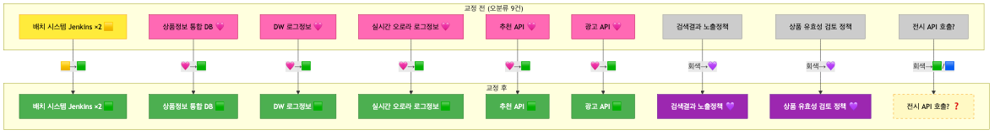

<details>
<summary>📊 원본 Mermaid 코드 보기</summary>

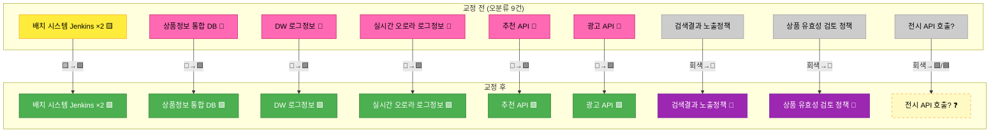

</details>

**오분류 9건 상세:**

| # | 요소명 | 현재 분류 | 교정 분류 | 사유 |
|---|--------|----------|----------|------|
| 1 | 배치 시스템 Jenkins (1) | 🟨 애그리게이트 | 🟩 외부 시스템 | Jenkins는 검색 도메인 외부의 스케줄링 시스템 |
| 2 | 배치 시스템 Jenkins (2) | 🟨 애그리게이트 | 🟩 외부 시스템 | 동일 사유 (중복 포스트잇) |
| 3 | 상품정보 통합 DB | 🩷 핫스팟 | 🟩 외부 시스템 | 검색팀 관할 밖의 데이터 소스 |
| 4 | DW 로그정보 | 🩷 핫스팟 | 🟩 외부 시스템 | 데이터웨어하우스는 외부 인프라 |
| 5 | 실시간 오로라 로그정보 | 🩷 핫스팟 | 🟩 외부 시스템 | Aurora DB는 검색팀 관할 밖 인프라 |
| 6 | 추천 API | 🩷 핫스팟 | 🟩 외부 시스템 | 추천 서비스 API 연동 |
| 7 | 광고 API | 🩷 핫스팟 | 🟩 외부 시스템 | 광고 서비스 API 연동 |
| 8 | 검색결과 노출정책 | 회색 미분류 | 💜 정책 | "검색 수행됨" 이벤트 후 자동 적용되는 비즈니스 규칙 |
| 9 | 상품 유효성 검토 정책 | 회색 미분류 | 💜 정책 | 상품 변경 시 색인 대상 필터링 규칙 |

**미결 1건:**

| # | 요소명 | 현재 분류 | 교정 후보 | 논의 필요 사항 |
|---|--------|----------|----------|---------------|
| 1 | 전시 API 호출? | 회색 미분류 | 🟩 외부 시스템 또는 🟦 커맨드 | 전시팀 API를 검색팀이 호출하는 것이면 🟦 커맨드, 전시팀이 검색 API를 호출하는 것이면 🟩 외부 시스템 |

### 4.3 교정 후 예상 요소 현황

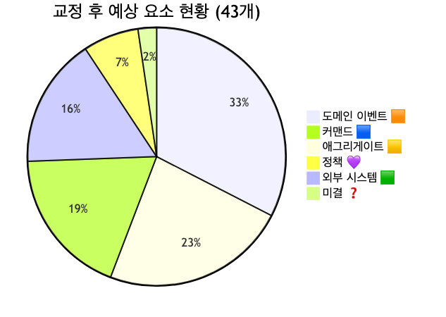

<details>
<summary>📊 원본 Mermaid 코드 보기</summary>

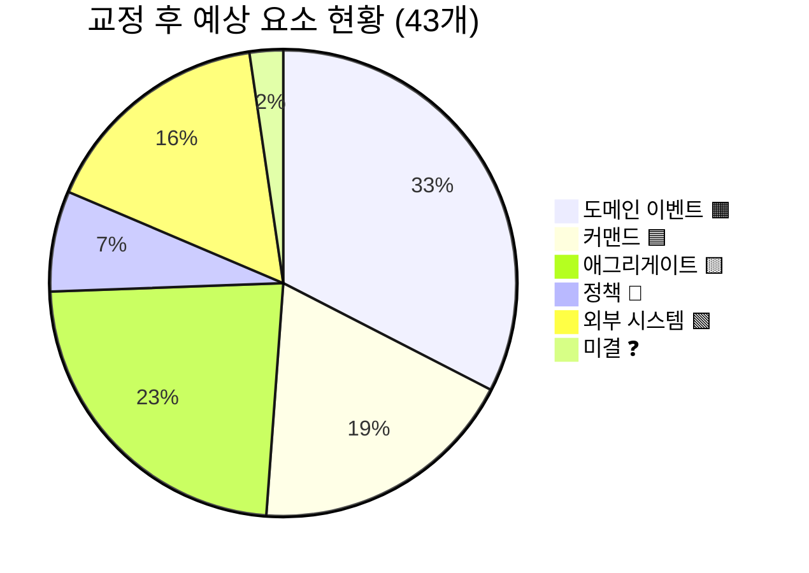

</details>

**교정 전후 수치 비교:**

| 유형 | 교정 전 | 교정 후 | 변동 |
|------|--------|--------|------|
| 이벤트 🟧 | 14 | 14 | 0 |
| 커맨드 🟦 | 8 | 8 | 0 |
| 애그리게이트 🟨 | 12 | 10 | -2 (Jenkins 2건 → 외부 시스템) |
| 정책 💜 | 1 | 3 | +2 (미분류 → 정책) |
| 핫스팟 🩷 | 5 | 0 | -5 (전부 → 외부 시스템) |
| 외부 시스템 🟩 | 0 | 7 | +7 (핫스팟 5 + 애그리게이트 2) |
| 미분류 | 3 | 0~1 | -2~3 |
| **합계** | **43** | **43** | |

---

## 5. 검색 성공/실패 분기 흐름 정리

### 5.1 워크샵에서 논의된 내용

2차 워크샵에서 "검색하기" 커맨드 이후의 분기 처리에 대해 논의가 있었습니다:

- **검색결과 노출정책**(미분류→💜 교정 대상)이 draw.io에 존재하지만, 정책의 분기 조건과 결과가 명시되지 않았음
- **검색키워드 중 교정되었다** 이벤트가 존재하여 키워드 교정 흐름은 인지됨
- 검색 결과 0건 시 처리(추천 상품 노출? 연관 검색어 제안?)는 미결 상태

### 5.2 "검색하기" 커맨드 이후 분기 흐름

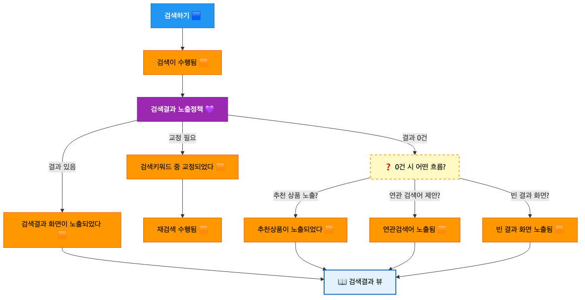

<details>
<summary>📊 원본 Mermaid 코드 보기</summary>

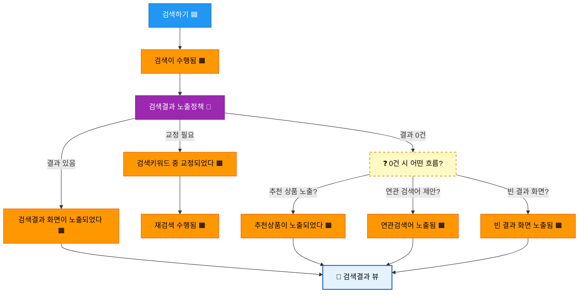

</details>

### 5.3 미결 사항 및 결정 필요 항목

3차 워크샵에서 결정이 필요한 항목:

- [ ] **검색 결과 0건 시 분기 흐름**: 추천 상품 노출 / 연관 검색어 제안 / 빈 결과 화면 중 어떤 조합으로 처리하는지 확인
- [ ] **키워드 교정 후 재검색 흐름**: 자동 재검색인지 사용자 선택인지 확인 (커맨드 vs 정책)
- [ ] **"전시 API 호출?" 포스트잇**: 검색→전시 호출인지, 전시→검색 호출인지 방향 확인

---

## 6. 미완료 항목 정리

### 6.1 미완료 항목 전체 목록

- [ ] 1차 이벤트 40개와 2차 이벤트 14개 간 통합·정제 (중복 확인, UI 이벤트 제외)
- [ ] 애그리게이트 12개 → 비즈니스 관점 재정의 (데이터 레이블 → 도메인 개념)
- [ ] ③ 결과 상호작용, ④ 증분 색인, ⑤ 전체 색인 영역 이벤트·커맨드 도출
- [ ] 읽기 모델 도출 (6개 후보)
- [ ] 바운디드 컨텍스트 후보 프리뷰
- [ ] 오분류 9건 교정 확인 (draw.io 보드 반영)

### 6.2 영역별 미진행 상세

| 영역 | 이벤트 도출 | 커맨드 도출 | 애그리게이트 | 정책 | 읽기 모델 |
|------|-----------|-----------|------------|------|----------|
| ① 검색 진입 | ✅ | ✅ | ✅ | ⬜ | ⬜ |
| ② 검색 수행 | ✅ | ✅ | ✅ | ⬜ 부분 | ⬜ |
| ③ 결과 상호작용 | ⬜ | ⬜ | ⬜ | ⬜ | ⬜ |
| ④ 증분 색인 | ⬜ | ⬜ 부분 | ⬜ | ⬜ | ⬜ |
| ⑤ 전체 색인 | ⬜ | ⬜ | ⬜ | ⬜ | ⬜ |
| ⑥ 검색 로그 | ✅ 부분 | ✅ | ✅ | ✅ 부분 | ⬜ |
| ⑦ 사전 관리 | ✅ 부분 | ⬜ | ⬜ | ⬜ | ⬜ |

### 6.3 읽기 모델 도출 미수행 분석

**미수행 원인:**
- 2차 워크샵이 이벤트·커맨드 도출 단계에 시간을 소요하여 Phase 4(읽기 모델 도출)까지 진행하지 못함
- 준비 문서에서 계획한 Phase 1(이벤트 정제)을 건너뛰고 신규 도출로 전환되면서 타임라인 지연

**영향:**
- 읽기 모델은 바운디드 컨텍스트 경계 설정의 중요 근거 → BC 프리뷰도 함께 미수행
- 3차 워크샵에서 읽기 모델 도출을 반드시 포함해야 함

**준비 문서의 읽기 모델 6개 후보 (여전히 유효):**

| # | 📖 읽기 모델 | 대상 사용자 | 구성 데이터 |
|---|-------------|-----------|-----------|
| 1 | 검색결과 뷰 | 👤 고객 | 상품목록, 필터, 정렬, 총건수, 스폰서상품 |
| 2 | 자동완성 뷰 | 👤 고객 | 후보키워드, 카테고리제안, 인기 하이라이트 |
| 3 | 인기검색어 뷰 | 👤 고객 | 실시간순위, 급상승, 시간대별 추이 |
| 4 | 색인 모니터링 뷰 | 🔧 운영자 | 색인진행률, 최근색인시각, 오류건수 |
| 5 | 검색 분석 대시보드 | 🔧 운영자 | 무결과Top키워드, CTR, 전환율 |
| 6 | 사전/부스팅 관리 뷰 | 🔧 운영자 | 동의어목록, 부스팅규칙, 금칙어 |

---

## 7. 3차 워크샵 권장 사항

### 7.1 3차 워크샵 목표 재설정

2차에서 미완료된 항목을 반영하여 3차 목표를 재설정합니다:

```
┌─────────────────────────────────────────────────────────────┐
│              3차 워크샵에서 달성할 것                          │
├─────────────────────────────────────────────────────────────┤
│                                                             │
│  ✅ 2차 draw.io 오분류 9건 교정 확인                        │
│  ✅ 미수행 영역(③④⑤) 이벤트·커맨드 보완                    │
│  ✅ 읽기 모델 6개 후보 도출                                 │
│  ✅ 애그리게이트 12개 → 비즈니스 관점 재정의·통합            │
│  ✅ 바운디드 컨텍스트 후보 경계 설정                        │
│  ✅ 컨텍스트 맵 초안 및 MSA 전환 우선순위 논의              │
│                                                             │
└─────────────────────────────────────────────────────────────┘
```

### 7.2 권장 타임라인

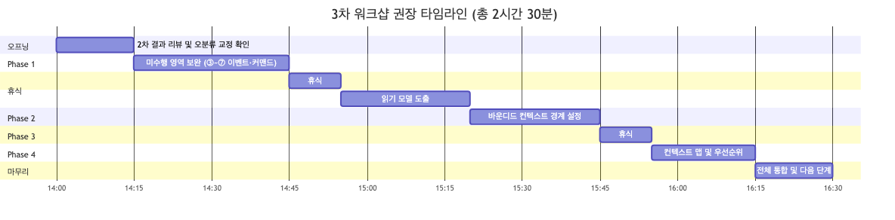

<details>
<summary>📊 원본 Mermaid 코드 보기</summary>

```mermaid
gantt
    title 3차 워크샵 권장 타임라인 (총 2시간 30분)
    dateFormat HH:mm
    axisFormat %H:%M

    section 오프닝
    2차 결과 리뷰 및 오분류 교정 확인    :a1, 14:00, 15m

    section Phase 1
    미수행 영역 보완 (③~⑦ 이벤트·커맨드) :a2, after a1, 30m

    section 휴식
    휴식                                  :a3, after a2, 10m

    section Phase 2
    읽기 모델 도출                        :a4, after a3, 25m

    section Phase 3
    바운디드 컨텍스트 경계 설정           :a5, after a4, 25m

    section 휴식
    휴식                                  :a6, after a5, 10m

    section Phase 4
    컨텍스트 맵 및 우선순위               :a7, after a6, 20m

    section 마무리
    전체 통합 및 다음 단계                :a8, after a7, 15m
```

</details>

| 시간 | 단계 | 소요 | 핵심 활동 |
|------|------|------|----------|
| 14:00 | 오프닝 | 15분 | 2차 결과 리뷰, 오분류 9건 교정 확인, "전시 API 호출?" 방향 결정 |
| 14:15 | Phase 1: 미수행 영역 보완 | 30분 | ③ 결과 상호작용, ④ 증분 색인, ⑤ 전체 색인 이벤트·커맨드 도출 |
| 14:45 | 휴식 | 10분 | |
| 14:55 | Phase 2: 읽기 모델 도출 | 25분 | 고객 접점 3개 + 운영자 접점 3개 = 6개 후보 |
| 15:20 | Phase 3: 바운디드 컨텍스트 경계 | 25분 | 애그리게이트 그룹핑, BC 후보 3~5개 경계선 설정 |
| 15:45 | 휴식 | 10분 | |
| 15:55 | Phase 4: 컨텍스트 맵 | 20분 | BC 간 관계 (공유 커널, ACL 등), MSA 전환 우선순위 |
| 16:15 | 마무리 | 15분 | 전체 통합, 결과 정리, 다음 단계 안내 |
| **16:30** | **종료** | **총 2시간 30분** | |

### 7.3 사전 준비 체크리스트

- [ ] 2차 draw.io 보드에 오분류 9건 색상 교정 반영 (사전 수정하여 3차에서 확인만)
- [ ] "전시 API 호출?" 방향에 대해 팀원과 사전 확인 (슬랙 논의)
- [ ] 2차 준비 문서의 읽기 모델 6개 후보를 하늘색 📖 포스트잇으로 미리 준비
- [ ] ③④⑤ 영역의 1차 이벤트 목록을 draw.io에 미리 배치 (2차에서 미도출된 영역)
- [ ] 바운디드 컨텍스트 프리뷰용 큰 포스트잇 준비 (BC 후보별 경계선 표시)
- [ ] 검색 결과 0건 시 분기 처리에 대해 사전 설문 (추천 노출 / 연관 검색어 / 빈 화면)

### 7.4 퍼실리테이터 유의 사항

2차 워크샵에서 얻은 교훈 3가지:

**1. 신규 도출 vs 정제의 시간 배분**
> 2차에서는 1차 결과 정제(Phase 1) 대신 신규 이벤트·커맨드 도출에 집중되었습니다.
> 3차에서는 **오프닝에서 교정 사항을 확인만 하고**(사전 반영 완료), 바로 미수행 영역 보완으로 넘어가는 것이 효율적입니다.
> 정제와 도출을 같은 세션에서 하면 시간이 부족해지므로 분리합니다.

**2. 외부 시스템 식별 강화**
> 2차에서 핫스팟(🩷)으로 분류된 5건이 모두 외부 시스템(🟩)이었습니다.
> 참석자들이 "문제가 있는 영역"과 "외부 의존성"을 구분하지 못한 것이 원인입니다.
> 3차에서는 포스트잇 색상 가이드를 벽면에 크게 인쇄하여 부착하고,
> 🩷 핫스팟은 **"비즈니스 규칙이 불명확한 곳"** 에만 사용하도록 안내합니다.

**3. 미분류 요소 즉시 처리**
> 2차에서 회색(미분류) 3건이 발생했습니다. 워크샵 중 색상을 결정하지 못한 요소들입니다.
> 3차에서는 미분류 요소가 나오면 **즉시 팀원 투표(거수)**로 분류를 결정하고,
> 그래도 결론이 안 나면 🩷 핫스팟으로 분류하여 별도 논의 대상으로 남깁니다.
