# 검색 서비스팀 이벤트 스토밍 2차 워크샵 준비 가이드

## 1. 개요

### 1.1 이 문서의 목적

검색서비스개발팀 이벤트 스토밍 **2차 워크샵**을 진행하는 퍼실리테이터를 위한 실전 가이드입니다.
1차에서 도출한 결과를 기반으로, **애그리게이트 → 정책 → 읽기 모델**까지 완성하는 것이 목표입니다.

```
┌─────────────────────────────────────────────────────────────┐
│              2차 워크샵에서 달성할 것                         │
├─────────────────────────────────────────────────────────────┤
│                                                             │
│  ✅ 1차 이벤트 재검토 및 정제 (40개 → ~30개)               │
│  ✅ 애그리게이트 식별 (7개 → 10개 후보)                     │
│  ✅ 정책 도출 (2개 → 6개 후보)                              │
│  ✅ 읽기 모델 도출 (6개 후보)                               │
│  ✅ 바운디드 컨텍스트 후보 프리뷰                           │
│                                                             │
└─────────────────────────────────────────────────────────────┘
```

### 1.2 1차 요약 & 2차 목표

| 항목 | 1차 완료 | 2차 목표 |
|------|---------|---------|
| 이벤트 도출 | ✅ 40개 | 정제하여 ~30개로 통합 |
| 타임라인 정렬 | ✅ 7개 흐름 영역 식별 | 유지 |
| 커맨드·액터 식별 | ✅ 커맨드 7개 | 유지 |
| 애그리게이트 | ⬜ 초안 7개 (미정제) | **10개 후보 확정** |
| 정책 | ⬜ 2개만 식별 | **6개 후보 도출** |
| 읽기 모델 | ⬜ 미시작 | **6개 후보 도출** |
| 바운디드 컨텍스트 | ⬜ 미시작 | 후보 프리뷰 (3차에서 확정) |

### 1.3 참조 문서

| 참조 문서 | 활용 시점 |
|----------|----------|
| [이벤트스토밍_검색서비스팀_가이드.md](./이벤트스토밍_검색서비스팀_가이드.md) | 검색팀 특화 상황 대응 |
| [이벤트스토밍_읽기모델_가이드.md](./이벤트스토밍_읽기모델_가이드.md) | 읽기모델 3단계 프로세스 |
| [이벤트스토밍_시각화_가이드.md](./이벤트스토밍_시각화_가이드.md) | 포스트잇 색상·배치 패턴 |
| [이벤트스토밍_단계별_실행가이드.md](./이벤트스토밍_단계별_실행가이드.md) | Phase별 진행 방법 |
| [이벤트스토밍_퀵레퍼런스.md](./이벤트스토밍_퀵레퍼런스.md) | 용어 정의, 대응 스크립트 |

---

## 2. 1차 결과 정리 및 재검토

### 2.1 현재 요소 현황 요약

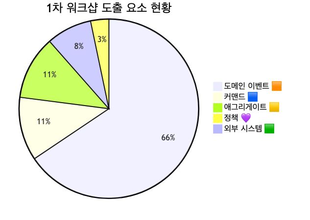

<details>
<summary>📊 원본 Mermaid 코드 보기</summary>

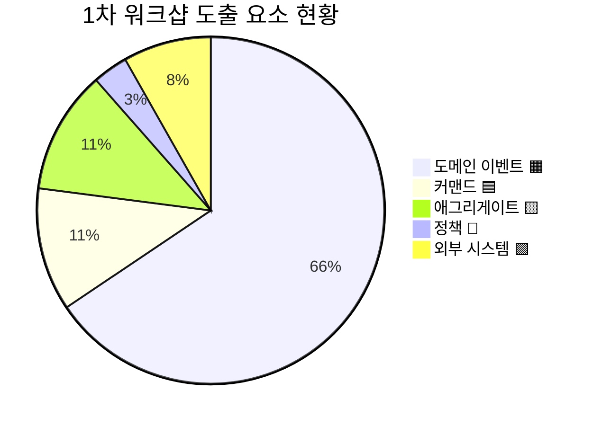

</details>

**현황 분석:**
- 이벤트 40개 중 일부는 중복·유사하거나 UI 이벤트(비즈니스 이벤트가 아님)로 분류되어 정제 필요
- 애그리게이트 7개는 데이터 레이블에 가까워 비즈니스 개념으로 재정의 필요
- 정책 2개만 식별 — 검색 도메인 특성상 자동화 규칙이 더 많을 것으로 예상

### 2.2 7개 흐름 영역 전체 맵

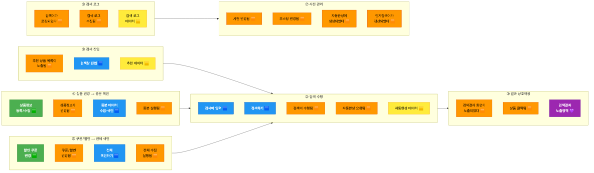

<details>
<summary>📊 원본 Mermaid 코드 보기</summary>

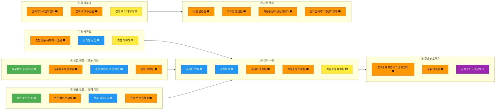

</details>

### 2.3 이벤트 재검토 항목 (8건)

1차에서 도출된 40개 이벤트 중, 2차 정제 시 검토가 필요한 항목입니다.

| # | 원본 이벤트 | 처리 방안 | 사유 |
|---|-----------|----------|------|
| 1 | "검색어 입력됨" + "검색창에 검색어가 입력되었다" | **통합** → "검색어가 입력되었다" | 동일 이벤트 중복 |
| 2 | "상품 클릭됨" + "검색 결과에 상품이 클릭됨" | **통합** → "검색결과에서 상품이 클릭되었다" | 동일 이벤트 중복 |
| 3 | "상품 상세 페이지로 이동한다" | **제외** (UI 네비게이션) | 비즈니스 이벤트 아님 |
| 4 | "상세화면에서 뒤로가기를 누름" | **제외** (UI 네비게이션) | 비즈니스 이벤트 아님 |
| 5 | "인기 검색어가 생성되었다" + "인기 검색어가 갱신되었다" | **통합** → "인기검색어가 갱신되었다" | 생성도 갱신의 일종 |
| 6 | "브랜드관, 전문관 바로가기 노출이 된다" | **재분류** → 읽기 모델 후보 | 화면 노출은 읽기 모델 |
| 7 | "검색 결과가 없어서 추천 상품을 보았다" | **재분류** → 정책 트리거 결과 | 노출정책의 결과 이벤트 |
| 8 | "광고 상품 요청 되었다" + "광고 상품이 노출 되었다" | **통합** → "광고 상품이 노출되었다" | 요청은 내부 단계 |

### 2.4 불명확한 요소 확인 (3건)

| # | 요소 | 유형 | 확인 필요 사항 |
|---|------|------|---------------|
| 1 | "사용자 옷" (애그리게이트) | 🟨 | 의미 불명확 — "사용자 컨텍스트" 또는 "검색 세션"으로 재정의 필요 |
| 2 | "'리뷰'가 재입고 되었다" (이벤트) | 🟧 | "리뷰" 재입고의 의미 확인 — 상품 재입고 시 리뷰 노출 복원? |
| 3 | "검색 실패" (커맨드) | 🟦 | 커맨드가 아닌 이벤트로 재분류 필요 ("검색이 실패하였다" 🟧) |

### 2.5 1차→2차 전환 체크리스트

- [ ] 1차 draw.io 보드를 대형 모니터/프로젝터에 띄워 놓기
- [ ] 재검토 대상 8건을 별도 포스트잇으로 준비
- [ ] 불명확 요소 3건에 대해 팀원과 사전 확인
- [ ] 2차 워크샵 목표를 참석자에게 사전 공유 (슬랙/메일)
- [ ] 새 포스트잇 색상 준비: 💜 보라(정책), 📖 하늘색(읽기 모델)
- [ ] 워크샵 룸 및 화이트보드/벽면 확보 (1차보다 넓은 공간 필요)

---

## 3. 2차 워크샵 타임라인

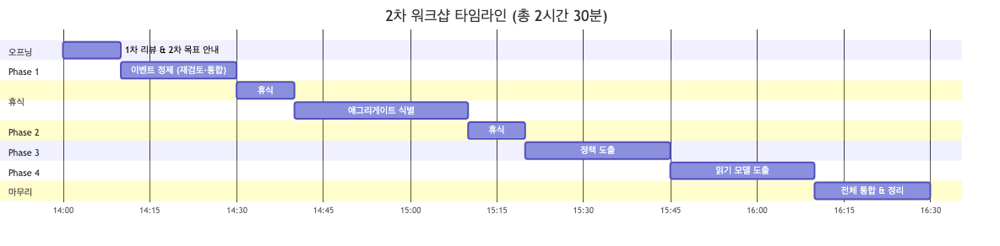

<details>
<summary>📊 원본 Mermaid 코드 보기</summary>

```mermaid
gantt
    title 2차 워크샵 타임라인 (총 2시간 30분)
    dateFormat HH:mm
    axisFormat %H:%M

    section 오프닝
    1차 리뷰 & 2차 목표 안내       :a1, 14:00, 10m

    section Phase 1
    이벤트 정제 (재검토·통합)       :a2, after a1, 20m

    section 휴식
    휴식                            :a3, after a2, 10m

    section Phase 2
    애그리게이트 식별               :a4, after a3, 30m

    section 휴식
    휴식                            :a5, after a4, 10m

    section Phase 3
    정책 도출                       :a6, after a5, 25m

    section Phase 4
    읽기 모델 도출                  :a7, after a6, 25m

    section 마무리
    전체 통합 & 정리                :a8, after a7, 20m
```

</details>

| 시간 | 단계 | 소요 | 핵심 활동 |
|------|------|------|----------|
| 14:00 | 오프닝 | 10분 | 1차 리뷰, 2차 목표 안내 |
| 14:10 | Phase 1: 이벤트 정제 | 20분 | 재검토 8건 처리, 불명확 3건 확인 |
| 14:30 | 휴식 | 10분 | |
| 14:40 | Phase 2: 애그리게이트 식별 | 30분 | 10개 후보 도출 |
| 15:10 | 휴식 | 10분 | |
| 15:20 | Phase 3: 정책 도출 | 25분 | 6개 후보 도출 |
| 15:45 | Phase 4: 읽기 모델 도출 | 25분 | 6개 후보 도출 |
| 16:10 | 마무리 | 20분 | 전체 통합, BC 프리뷰 |
| **16:30** | **종료** | **총 2시간 30분** | |

---

## 4. Phase 1: 이벤트 정제 (20분)

### 퍼실리테이터 스크립트

> "1차에서 40개의 이벤트를 도출했습니다. 오늘 첫 단계로, 중복되거나 비즈니스 이벤트가 아닌 것들을 정리하겠습니다.
> 화면에 재검토 대상 8건을 띄워놓았으니, 각각에 대해 '통합할지, 제외할지, 재분류할지' 빠르게 결정하겠습니다.
> 한 건당 2분을 넘기지 않겠습니다."

### 재검토 대상 처리 가이드

**통합 대상 (4건)** — 두 이벤트를 하나로 합칩니다:
1. "검색어 입력됨" + "검색창에 검색어가 입력되었다" → **"검색어가 입력되었다"**
2. "상품 클릭됨" + "검색 결과에 상품이 클릭됨" → **"검색결과에서 상품이 클릭되었다"**
3. "인기 검색어가 생성되었다" + "인기 검색어가 갱신되었다" → **"인기검색어가 갱신되었다"**
4. "광고 상품 요청 되었다" + "광고 상품이 노출 되었다" → **"광고 상품이 노출되었다"**

**제외 대상 (2건)** — UI 네비게이션이므로 보드에서 제거합니다:
1. "상품 상세 페이지로 이동한다" (→ 상품팀 이벤트)
2. "상세화면에서 뒤로가기를 누름" (→ UI 동작)

**재분류 대상 (2건)** — 이벤트가 아닌 다른 요소로 변환합니다:
1. "브랜드관, 전문관 바로가기 노출이 된다" → 📖 읽기 모델 후보
2. "검색 결과가 없어서 추천 상품을 보았다" → 검색결과 노출정책의 결과

### 정제 후 예상 이벤트 목록 (~30개)

| # | 영역 | 이벤트 |
|---|------|--------|
| 1 | ① 검색 진입 | 추천 상품 목록이 노출됨 |
| 2 | ① 검색 진입 | 전시 목록이 생성되었다 |
| 3 | ② 검색 수행 | 검색어가 입력되었다 |
| 4 | ② 검색 수행 | 자동완성 요청됨 |
| 5 | ② 검색 수행 | 검색이 수행됨 |
| 6 | ③ 결과 상호작용 | 검색결과 화면이 노출되었다 |
| 7 | ③ 결과 상호작용 | 검색 키워드를 교정하였다 |
| 8 | ③ 결과 상호작용 | 대체 키워드 노출됨 |
| 9 | ③ 결과 상호작용 | 검색 결과가 0건이다 |
| 10 | ③ 결과 상호작용 | 검색결과에서 상품이 클릭되었다 |
| 11 | ③ 결과 상호작용 | 광고 상품이 노출되었다 |
| 12 | ④ 증분 색인 | 상품정보가 변경됨 |
| 13 | ④ 증분 색인 | 상품 예약어가 등록됨 |
| 14 | ④ 증분 색인 | 가격 한정시간이 도래함 |
| 15 | ④ 증분 색인 | 상품의 전시 카테고리 정보가 변경됨 |
| 16 | ④ 증분 색인 | 상품이 재입고 되었다 |
| 17 | ④ 증분 색인 | 증분 실행됨 |
| 18 | ④ 증분 색인 | 서빙 대상 상품 배치가 생성되었다 |
| 19 | ⑤ 전체 색인 | 쿠폰/할인 변경됨 |
| 20 | ⑤ 전체 색인 | 할인 쿠폰 적용시간이 도래함 |
| 21 | ⑤ 전체 색인 | 할인 쿠폰 만료시간이 도래함 |
| 22 | ⑤ 전체 색인 | 배송비코드 적용시간이 도래함 |
| 23 | ⑤ 전체 색인 | 배송비코드 만료시간이 도래함 |
| 24 | ⑤ 전체 색인 | 전체 수집 실행됨 |
| 25 | ⑥ 검색 로그 | 검색어가 로깅되었다 |
| 26 | ⑥ 검색 로그 | 검색 로그 수집됨 |
| 27 | ⑦ 사전 관리 | 동의어, 유의어 추가되었다 |
| 28 | ⑦ 사전 관리 | 사전 변경됨 |
| 29 | ⑦ 사전 관리 | 부스팅 변경됨 |
| 30 | ⑦ 사전 관리 | 자동완성이 생성되었다 |
| 31 | ⑦ 사전 관리 | 연관 검색어가 생성되었다 |
| 32 | ⑦ 사전 관리 | 인기검색어가 갱신되었다 |

---

## 5. Phase 2: 애그리게이트 식별 (30분)

### 5.1 검색팀 눈높이 설명

> **애그리게이트 = "함께 변하는 데이터 묶음"**
>
> 검색팀에 친숙한 비유로 설명하면:
>
> - **Elasticsearch 인덱스 하나** = 하나의 애그리게이트와 비슷합니다
> - 인덱스에 들어있는 문서들은 함께 색인되고, 함께 조회되고, 함께 갱신됩니다
> - "이 데이터가 변할 때 같이 변해야 하는 데이터가 뭐가 있지?" → 그게 애그리게이트입니다

```
┌─────────────────────────────────────────────────────────────┐
│         검색팀을 위한 애그리게이트 판단 기준                  │
├─────────────────────────────────────────────────────────────┤
│                                                             │
│  질문 1: "이 데이터가 바뀌면 같이 바뀌어야 하는 건?"        │
│  → 같이 바뀌는 것들 = 하나의 애그리게이트                   │
│                                                             │
│  질문 2: "이 커맨드가 변경하는 대상은?"                     │
│  → 변경 대상 = 애그리게이트                                 │
│                                                             │
│  질문 3: "트랜잭션 경계는 어디까지?"                        │
│  → 한 트랜잭션 안에서 일관성을 보장해야 하는 범위           │
│                                                             │
└─────────────────────────────────────────────────────────────┘
```

### 5.2 현재→정리안 Before/After

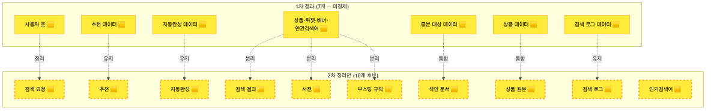

<details>
<summary>📊 원본 Mermaid 코드 보기</summary>

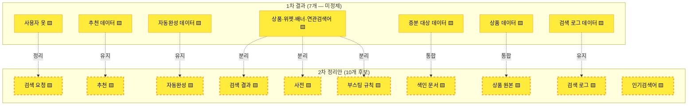

</details>

**변경 포인트 설명:**

| 1차 원본 | 변경 | 2차 후보 | 이유 |
|---------|------|---------|------|
| 사용자 옷 | → 재정의 | **검색 요청** | "사용자 컨텍스트"를 검색 행위 중심으로 재정의 |
| 상품·위젯·배너·연관검색어 | → 분리 | **검색 결과**, **사전**, **부스팅 규칙** | 하나에 너무 많은 개념이 혼합됨 |
| 증분 대상 데이터 + 상품 데이터 | → 통합/분리 | **색인 문서**, **상품 원본** | 색인 대상과 원본 데이터 구분 |
| (신규) | → 추가 | **인기검색어** | 로그에서 파생되지만 독립적 생명주기 |

### 5.3 흐름 영역별 매핑

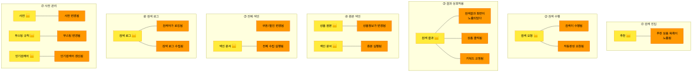

<details>
<summary>📊 원본 Mermaid 코드 보기</summary>

```mermaid
flowchart TB
    classDef event fill:#FF9800,color:#000,stroke:#E65100
    classDef aggregate fill:#FFEB3B,color:#000,stroke:#F9A825

    subgraph S1["① 검색 진입"]
        AG_추천["추천 🟨"]:::aggregate
        E_추천노출["추천 상품 목록이 노출됨"]:::event
        AG_추천 --- E_추천노출
    end

    subgraph S2["② 검색 수행"]
        AG_검색요청["검색 요청 🟨"]:::aggregate
        E_검색수행["검색이 수행됨"]:::event
        E_자동완성요청["자동완성 요청됨"]:::event
        AG_검색요청 --- E_검색수행
        AG_검색요청 --- E_자동완성요청
    end

    subgraph S3["③ 결과 상호작용"]
        AG_검색결과["검색 결과 🟨"]:::aggregate
        E_결과노출["검색결과 화면이 노출되었다"]:::event
        E_상품클릭["상품 클릭됨"]:::event
        E_교정["키워드 교정됨"]:::event
        AG_검색결과 --- E_결과노출
        AG_검색결과 --- E_상품클릭
        AG_검색결과 --- E_교정
    end

    subgraph S4["④ 증분 색인"]
        AG_색인문서["색인 문서 🟨"]:::aggregate
        AG_상품원본["상품 원본 🟨"]:::aggregate
        E_상품변경["상품정보가 변경됨"]:::event
        E_증분["증분 실행됨"]:::event
        AG_상품원본 --- E_상품변경
        AG_색인문서 --- E_증분
    end

    subgraph S5["⑤ 전체 색인"]
        E_쿠폰변경["쿠폰/할인 변경됨"]:::event
        E_전체수집["전체 수집 실행됨"]:::event
        AG_색인문서2["색인 문서 🟨"]:::aggregate
        AG_색인문서2 --- E_전체수집
    end

    subgraph S6["⑥ 검색 로그"]
        AG_로그["검색 로그 🟨"]:::aggregate
        E_로깅["검색어가 로깅됨"]:::event
        E_로그수집["검색 로그 수집됨"]:::event
        AG_로그 --- E_로깅
        AG_로그 --- E_로그수집
    end

    subgraph S7["⑦ 사전 관리"]
        AG_사전["사전 🟨"]:::aggregate
        AG_부스팅["부스팅 규칙 🟨"]:::aggregate
        AG_인기["인기검색어 🟨"]:::aggregate
        E_사전변경["사전 변경됨"]:::event
        E_부스팅["부스팅 변경됨"]:::event
        E_인기갱신["인기검색어 갱신됨"]:::event
        AG_사전 --- E_사전변경
        AG_부스팅 --- E_부스팅
        AG_인기 --- E_인기갱신
    end
```

</details>

### 5.4 식별 질문 리스트

퍼실리테이터가 각 흐름 영역에서 던지는 질문:

| 영역 | 질문 | 기대 답변 |
|------|------|----------|
| ① 검색 진입 | "추천 상품 목록은 어디서 오나요? 추천 데이터만으로 충분한가요?" | 추천 애그리게이트 확인 |
| ② 검색 수행 | "검색어를 입력하면 자동완성과 검색 실행은 같은 데이터를 쓰나요?" | 검색 요청 vs 자동완성 분리 |
| ③ 결과 상호작용 | "검색 결과에 포함되는 데이터는 뭐가 있나요? 위젯, 배너도 같이?" | 검색 결과 애그리게이트 경계 |
| ④ 증분 색인 | "상품 원본과 색인 문서는 구조가 같나요, 다른가요?" | 상품 원본 vs 색인 문서 분리 |
| ⑤ 전체 색인 | "전체 색인과 증분 색인이 다루는 데이터 범위 차이는?" | 색인 문서 애그리게이트 확인 |
| ⑥ 검색 로그 | "검색 로그에서 어떤 데이터가 파생되나요?" | 인기검색어, 자동완성 파생 |
| ⑦ 사전 관리 | "동의어 사전과 부스팅 규칙은 함께 변경되나요, 별도인가요?" | 사전 vs 부스팅 분리 확인 |

### 5.5 퍼실리테이터 스크립트

> "이제 '함께 변하는 데이터 묶음', 즉 애그리게이트를 찾아보겠습니다.
>
> 1차에서 노란 포스트잇으로 붙인 7개가 있는데, 이름이 '데이터'로 끝나는 것들이 많죠?
> 오늘은 이것들을 비즈니스 관점에서 다시 이름 붙여 보겠습니다.
>
> 방법은 간단합니다. 각 커맨드(🟦) 앞에서 물어보세요:
> **'이 커맨드가 변경하는 대상은 뭔가요?'**
>
> 예를 들어, '증분 데이터 수집·색인'이 변경하는 대상은? → '색인 문서'입니다.
> '전체 색인하기'가 변경하는 대상은? → 역시 '색인 문서'입니다.
> 그럼 둘 다 같은 애그리게이트를 건드리는 거죠.
>
> 자, 영역별로 돌아가면서 해봅시다. ①번 검색 진입부터 시작하겠습니다."

---

## 6. Phase 3: 정책 도출 (25분)

### 6.1 검색팀 눈높이 설명

> **정책(Policy) = "이벤트가 발생하면 자동으로 실행되는 비즈니스 규칙"**
>
> 검색팀에 친숙한 비유:
>
> - **"상품정보가 변경되면 → 자동으로 증분 색인이 돌아간다"** — 이것이 정책입니다
> - 사람이 매번 수동으로 하는 게 아니라, **시스템이 자동으로 반응**하는 규칙
> - Elasticsearch의 **index lifecycle policy**와 비슷한 개념입니다

```
┌─────────────────────────────────────────────────────────────┐
│           정책 찾기 핵심 질문                                │
├─────────────────────────────────────────────────────────────┤
│                                                             │
│  "이 이벤트가 발생하면, 자동으로 뭔가 일어나나요?"          │
│                                                             │
│  → "네, 상품이 변경되면 자동으로 증분 색인이 돌아요"       │
│  → 정책 발견! 💜 "상품 변경 시 증분 색인 트리거"           │
│                                                             │
│  → "아니오, 운영자가 수동으로 합니다"                      │
│  → 정책 아님 (커맨드·액터 확인)                            │
│                                                             │
└─────────────────────────────────────────────────────────────┘
```

### 6.2 정책 후보 6개

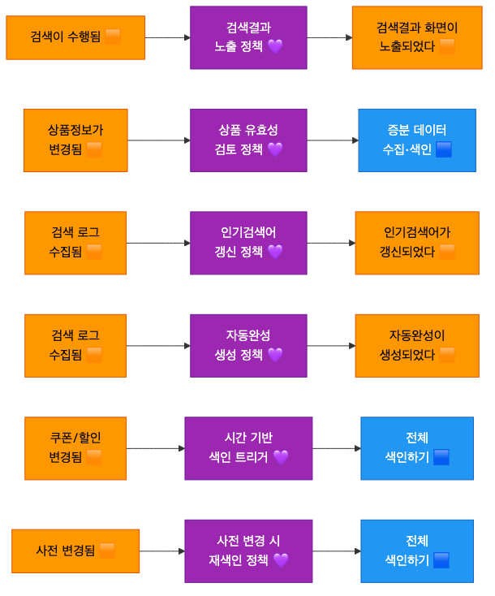

<details>
<summary>📊 원본 Mermaid 코드 보기</summary>

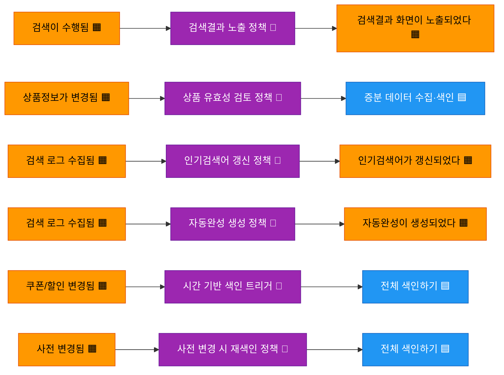

</details>

| # | 정책 💜 | 트리거 이벤트 🟧 | 결과 |
|---|--------|----------------|------|
| 1 | **검색결과 노출 정책** | 검색이 수행됨 | → 검색결과 화면 구성 (교정, 0건 처리, 광고 삽입) |
| 2 | **상품 유효성 검토 정책** | 상품정보가 변경됨 | → 유효한 변경만 증분 색인 대상으로 필터링 |
| 3 | **인기검색어 갱신 정책** | 검색 로그 수집됨 | → 인기검색어 순위 재계산 및 갱신 |
| 4 | **자동완성 생성 정책** | 검색 로그 수집됨 | → 자동완성 후보 키워드 생성/갱신 |
| 5 | **시간 기반 색인 트리거** | 쿠폰/할인 변경됨, 시간 도래 | → 전체 색인 실행 |
| 6 | **사전 변경 시 재색인 정책** | 사전 변경됨 | → 전체 색인 실행 (사전 반영) |

> **참고:** 1차에서 식별된 2개(검색결과 노출정책, 상품 유효성 검토 정책)에 4개를 추가로 도출합니다.

### 6.3 도출 유도 질문

| # | 영역 | 유도 질문 | 기대 답변 |
|---|------|----------|----------|
| 1 | 검색 수행 | "검색 결과를 보여줄 때, 자동으로 적용되는 규칙이 있나요?" | 교정, 0건 시 추천, 광고 삽입 등 |
| 2 | 증분 색인 | "상품이 변경되면 바로 색인하나요? 필터링 조건이 있나요?" | 유효성 검증 후 색인 |
| 3 | 검색 로그 | "로그가 쌓이면 자동으로 뭐가 돌아가나요?" | 인기검색어 갱신, 자동완성 생성 |
| 4 | 전체 색인 | "전체 색인은 누가 언제 트리거하나요? 타이머?" | 시간 기반 자동 실행 |
| 5 | 사전 관리 | "동의어 사전을 바꾸면 자동으로 색인에 반영되나요?" | 사전 변경 → 재색인 |
| 6 | 공통 | "야간에 자동으로 돌아가는 배치 작업이 있나요?" | 배치 = 정책 후보 |

### 6.4 정책-이벤트 연결 맵

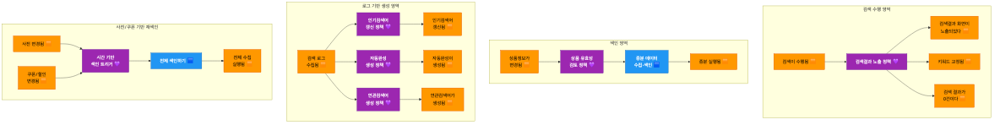

<details>
<summary>📊 원본 Mermaid 코드 보기</summary>

```mermaid
flowchart TB
    classDef event fill:#FF9800,color:#000,stroke:#E65100
    classDef command fill:#2196F3,color:#fff,stroke:#1565C0
    classDef policy fill:#9C27B0,color:#fff,stroke:#6A1B9A

    subgraph SG1["검색 수행 영역"]
        E_검색수행["검색이 수행됨 🟧"]:::event
        P_노출["검색결과 노출 정책 💜"]:::policy
        E_결과노출["검색결과 화면이 노출되었다 🟧"]:::event
        E_교정["키워드 교정됨 🟧"]:::event
        E_0건["검색 결과가 0건이다 🟧"]:::event
        E_검색수행 --> P_노출
        P_노출 --> E_결과노출
        P_노출 --> E_교정
        P_노출 --> E_0건
    end

    subgraph SG2["색인 영역"]
        E_상품변경["상품정보가 변경됨 🟧"]:::event
        P_유효성["상품 유효성 검토 정책 💜"]:::policy
        C_증분["증분 데이터 수집·색인 🟦"]:::command
        E_증분["증분 실행됨 🟧"]:::event
        E_상품변경 --> P_유효성
        P_유효성 --> C_증분
        C_증분 --> E_증분
    end

    subgraph SG3["로그 기반 생성 영역"]
        E_로그["검색 로그 수집됨 🟧"]:::event
        P_인기["인기검색어 갱신 정책 💜"]:::policy
        P_자동["자동완성 생성 정책 💜"]:::policy
        P_연관["연관검색어 생성 정책 💜"]:::policy
        E_인기갱신["인기검색어 갱신됨 🟧"]:::event
        E_자동생성["자동완성이 생성됨 🟧"]:::event
        E_연관생성["연관검색어가 생성됨 🟧"]:::event
        E_로그 --> P_인기
        E_로그 --> P_자동
        E_로그 --> P_연관
        P_인기 --> E_인기갱신
        P_자동 --> E_자동생성
        P_연관 --> E_연관생성
    end

    subgraph SG4["사전/쿠폰 기반 재색인"]
        E_사전변경["사전 변경됨 🟧"]:::event
        E_쿠폰변경["쿠폰/할인 변경됨 🟧"]:::event
        P_재색인["시간 기반 색인 트리거 💜"]:::policy
        C_전체["전체 색인하기 🟦"]:::command
        E_전체수집["전체 수집 실행됨 🟧"]:::event
        E_사전변경 --> P_재색인
        E_쿠폰변경 --> P_재색인
        P_재색인 --> C_전체
        C_전체 --> E_전체수집
    end
```

</details>

### 6.5 퍼실리테이터 스크립트

> "자, 이제 '자동으로 반응하는 규칙'을 찾아보겠습니다.
>
> 1차에서 2개를 찾았었죠? 검색결과 노출정책과 상품 유효성 검토 정책.
> 이번에는 나머지 영역에서도 찾아보겠습니다.
>
> 제가 이벤트(🟧) 하나씩 짚을 테니, 여러분은 이렇게 생각해 보세요:
> **'이 이벤트가 발생하면, 사람 개입 없이 자동으로 뭔가 일어나나요?'**
>
> 예를 들어, '검색 로그 수집됨'이 발생하면? 자동으로 뭐가 돌아가나요?
>
> [참석자 답변 유도]
>
> 맞습니다! 인기검색어 순위가 다시 계산되죠. 그게 바로 정책입니다.
> 💜 보라색 포스트잇에 '인기검색어 갱신 정책'이라고 써서 붙여주세요."

---

## 7. Phase 4: 읽기 모델 도출 (25분)

### 7.1 검색팀 눈높이 설명 (전광판 비유)

> **읽기 모델 = "사용자가 보는 화면/대시보드"**
>
> 식당의 전광판 비유를 검색팀에 맞춰 설명하면:
>
> - 주문서(커맨드) = "검색하기" 🟦
> - 주방에서 조리됨(이벤트) = "검색이 수행됨" 🟧
> - **전광판(읽기 모델)** = **검색결과 화면** 📖
>
> 전광판은 여러 소스에서 데이터를 모아 보여줍니다.
> 검색결과 화면도 마찬가지죠 — 상품, 광고, 위젯, 필터를 조합해서 보여줍니다.

```
┌─────────────────────────────────────────────────────────────┐
│         읽기 모델 도출 핵심 질문                              │
├─────────────────────────────────────────────────────────────┤
│                                                             │
│  Step 1: "사용자(고객/운영자)가 보는 화면이 뭐가 있나요?"   │
│                                                             │
│  Step 2: "이 화면에 어떤 정보가 표시되나요?"                │
│                                                             │
│  Step 3: "어떤 이벤트가 발생하면 이 화면이 갱신되나요?"     │
│                                                             │
└─────────────────────────────────────────────────────────────┘
```

### 7.2 읽기 모델 후보 6개

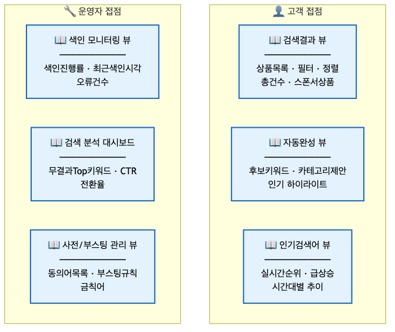

<details>
<summary>📊 원본 Mermaid 코드 보기</summary>

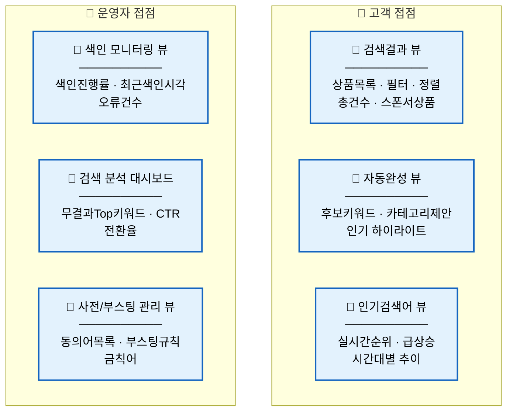

</details>

| # | 📖 읽기 모델 | 대상 사용자 | 구성 데이터 | 갱신 트리거 이벤트 |
|---|-------------|-----------|-----------|------------------|
| 1 | **검색결과 뷰** | 고객 | 상품목록, 필터, 정렬, 총건수, 스폰서상품 | 검색결과 화면이 노출되었다 |
| 2 | **자동완성 뷰** | 고객 | 후보키워드, 카테고리제안, 인기 하이라이트 | 자동완성이 생성되었다 |
| 3 | **인기검색어 뷰** | 고객 | 실시간순위, 급상승, 시간대별 추이 | 인기검색어가 갱신되었다 |
| 4 | **색인 모니터링 뷰** | 운영자 | 색인진행률, 최근색인시각, 오류건수 | 증분 실행됨, 전체 수집 실행됨 |
| 5 | **검색 분석 대시보드** | 운영자 | 무결과Top키워드, CTR, 전환율 | 검색 로그 수집됨 |
| 6 | **사전/부스팅 관리 뷰** | 운영자 | 동의어목록, 부스팅규칙, 금칙어 | 사전 변경됨, 부스팅 변경됨 |

### 7.3 3단계 프로세스 (화면→데이터→트리거)

읽기 모델 도출은 3단계로 진행합니다:

**Step 1: 화면 식별** — "사용자가 보는 화면이 뭐가 있나요?"

```
┌──────────────────────────────────────────────────────────┐
│  고객 화면                    운영자 화면                  │
│  ─────────                   ───────────                 │
│  • 검색결과 페이지            • 색인 모니터링 화면        │
│  • 자동완성 드롭다운          • 검색 분석 대시보드        │
│  • 인기검색어 영역            • 사전/부스팅 관리 화면     │
└──────────────────────────────────────────────────────────┘
```

**Step 2: 데이터 구성** — "이 화면에 어떤 정보가 표시되나요?"

```
┌──────────────────────────────────────────────────────────┐
│  📖 검색결과 뷰 예시                                      │
│  ────────────────                                        │
│  • 상품 목록 (이미지, 이름, 가격)     ← 색인 문서        │
│  • 필터 옵션 (카테고리, 가격대, 브랜드) ← 색인 문서      │
│  • 정렬 옵션                          ← 검색 결과       │
│  • 총 검색 건수                       ← 검색 결과       │
│  • 스폰서 상품 (광고)                 ← 광고 시스템 🟩   │
│  • 연관 검색어                        ← 검색 로그       │
│                                                          │
│  → 4개 소스에서 데이터를 모아 하나의 화면을 구성!         │
└──────────────────────────────────────────────────────────┘
```

**Step 3: 트리거 연결** — "어떤 이벤트가 발생하면 이 화면이 갱신되나요?"

```
  🟧 검색결과 화면이      🟧 광고 상품이
     노출되었다               노출되었다
       │                      │
       └──────────┬───────────┘
                  │
                  ▼
        ┌──────────────────┐
        │  📖 검색결과 뷰   │
        │                  │
        │  상품 + 광고 +   │
        │  필터 + 정렬     │
        └────────┬─────────┘
                 │
                 ▼
         🟦 상품 클릭
            (다음 커맨드)
```

### 7.4 읽기모델-이벤트 연결 맵

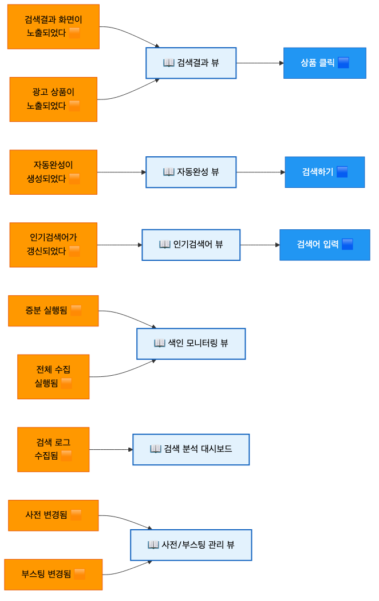

<details>
<summary>📊 원본 Mermaid 코드 보기</summary>

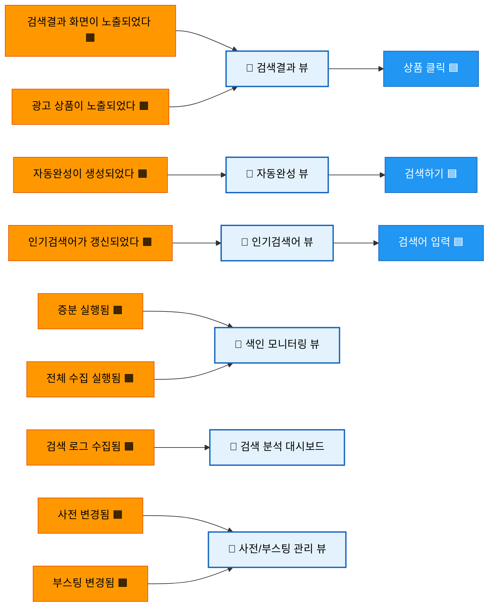

</details>

### 7.5 퍼실리테이터 스크립트

> "마지막으로, '사용자가 보는 화면'을 정리해보겠습니다. 읽기 모델이라고 하는데,
> 쉽게 말하면 **전광판**입니다.
>
> 식당에서 '현재 대기 3팀, 예상 20분'이라고 보여주는 전광판 있죠?
> 우리 검색 서비스에도 이런 전광판이 있습니다.
>
> 두 종류로 나눠볼게요:
>
> **고객이 보는 전광판** — 검색결과 페이지, 자동완성 드롭다운, 인기검색어
> **운영자가 보는 전광판** — 색인 모니터링, 검색 분석 대시보드, 사전 관리 화면
>
> 하나씩 해봅시다. 먼저 검색결과 페이지.
> '검색하기' 커맨드 뒤에 고객이 보는 화면이죠.
> 이 화면에 뭐가 나오나요? 상품 목록, 필터, 정렬, 광고... 맞죠?
>
> 📖 하늘색 포스트잇에 '검색결과 뷰'라고 쓰고, 아래에 포함 데이터를 적어주세요.
> 그리고 어떤 이벤트가 이 화면을 갱신하는지 화살표로 연결합시다."

---

## 8. 전체 통합 및 정리 (20분)

### 8.1 전체 통합 흐름


<details>
<summary>📊 원본 Mermaid 코드 보기</summary>

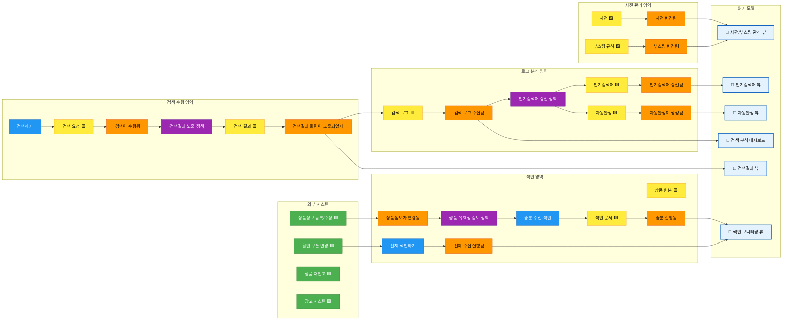

</details>

### 8.2 바운디드 컨텍스트 후보 프리뷰

2차까지의 결과를 바탕으로, 3차 워크샵에서 확정할 바운디드 컨텍스트 후보입니다.

| # | BC 후보 | 포함 애그리게이트 | 핵심 이벤트 | 비고 |
|---|--------|-----------------|-----------|------|
| 1 | **검색 수행** | 검색 요청, 검색 결과 | 검색이 수행됨, 결과 노출 | 핵심 도메인 |
| 2 | **색인 관리** | 색인 문서, 상품 원본 | 증분 실행됨, 전체 수집 실행됨 | 지원 도메인 |
| 3 | **검색 품질** | 사전, 부스팅 규칙, 자동완성, 인기검색어 | 사전 변경됨, 자동완성 생성됨 | 지원 도메인 |
| 4 | **검색 분석** | 검색 로그 | 검색 로그 수집됨 | 일반 도메인 |
| 5 | **추천** | 추천 | 추천 상품 목록이 노출됨 | 별도 or 검색 수행에 포함 |

```
┌─────────────────────────────────────────────────────────────┐
│         3차 워크샵에서 확정할 사항                            │
├─────────────────────────────────────────────────────────────┤
│                                                             │
│  1. BC 경계선 확정 — 후보 5개를 3~4개로 통합/분리           │
│  2. 컨텍스트 맵 작성 — BC 간 관계 (공유 커널, ACL 등)      │
│  3. 팀 매핑 — 각 BC를 어느 팀/스쿼드가 담당할지            │
│  4. 우선순위 — MSA 전환 시 어느 BC부터 분리할지            │
│                                                             │
└─────────────────────────────────────────────────────────────┘
```

### 8.3 다음 단계 안내

> "오늘 2차에서 애그리게이트 10개, 정책 6개, 읽기 모델 6개를 도출했습니다.
>
> 다음 3차 워크샵에서는:
> 1. 오늘 결과를 바탕으로 **바운디드 컨텍스트 경계선**을 확정합니다
> 2. BC 간 **컨텍스트 맵**(관계)을 그립니다
> 3. MSA 전환 시 **분리 우선순위**를 정합니다
>
> 오늘 결과는 draw.io로 정리해서 공유하겠습니다. 수고하셨습니다!"

---

## 9. 퍼실리테이터 비상 대응 카드

### 예상 난항 4가지 & 대응

| # | 난항 상황 | 대응 방법 |
|---|----------|----------|
| 1 | **"애그리게이트가 뭔지 모르겠어요"** | ES 인덱스 비유로 전환. "인덱스 하나 = 애그리게이트 하나. 같이 색인되고 같이 조회되는 데이터 묶음입니다." 그래도 어려우면 "이 커맨드가 변경하는 대상이 뭔가요?"로 우회 |
| 2 | **"정책과 커맨드 차이를 모르겠어요"** | "사람이 직접 실행하면 커맨드, 시스템이 자동으로 실행하면 정책입니다. '야간 배치로 돌아가는 것' = 정책, '운영자가 버튼 클릭' = 커맨드" |
| 3 | **"읽기 모델이 너무 많아질 것 같아요"** | 핵심 6개만 집중. "모든 화면을 다 할 필요 없어요. 가장 복잡하고 중요한 화면 위주로 합시다" |
| 4 | **"기술 구현 논쟁이 시작됨"** | 🩷 핫스팟 포스트잇을 붙이고 넘어감. "좋은 논점인데, 지금은 비즈니스 흐름에 집중합시다. 핑크 포스트잇에 적어두고 나중에 다룹시다" |

### 시간 조절 가이드

| 상황 | 조치 |
|------|------|
| Phase 1(정제)이 10분 이내 완료 | Phase 2에 남은 시간 배분 |
| Phase 2(애그리게이트)가 35분 초과 | 나머지 영역은 퍼실리테이터가 제안 → 빠른 합의 |
| Phase 3+4가 시간 부족 | 정책 4개(1차 2개 + 핵심 2개), 읽기모델 3개(고객 접점만)로 축소 |
| 전체적으로 10분 이상 초과 | 마무리(8장) 시간을 5분으로 단축, BC 프리뷰는 3차로 이월 |

---

## 10. 결과물 템플릿

### 2차 워크샵 결과 정리 양식

```
# 검색서비스팀 이벤트 스토밍 2차 워크샵 결과

## 일시: 2026년 _월 _일 (_) __:__ ~ __:__
## 참석자:

---

## 1. 이벤트 정제 결과
- 정제 전: 40개
- 정제 후: __개
- 통합: __건, 제외: __건, 재분류: __건

## 2. 애그리게이트 (확정 __개)
| # | 애그리게이트 | 포함 이벤트 | 관련 커맨드 |
|---|-------------|-----------|-----------|
| 1 | | | |
| 2 | | | |

## 3. 정책 (확정 __개)
| # | 정책 | 트리거 이벤트 | 결과 |
|---|------|-------------|------|
| 1 | | | |
| 2 | | | |

## 4. 읽기 모델 (확정 __개)
| # | 읽기 모델 | 대상 사용자 | 구성 데이터 | 갱신 트리거 |
|---|----------|-----------|-----------|-----------|
| 1 | | | | |
| 2 | | | | |

## 5. 핫스팟 / 미결 사항
| # | 내용 | 담당 | 기한 |
|---|------|------|------|
| 1 | | | |

## 6. 다음 단계
- [ ] 결과 draw.io 정리 및 공유
- [ ] 3차 워크샵 일정 확정 (바운디드 컨텍스트)
- [ ] 핫스팟 사항 사전 논의
```
