# 검색서비스개발팀 이벤트 스토밍 3차 워크샵 검토 및 보완 사항

## 1. 개요

### 1.1 이 문서의 목적

```
┌─────────────────────────────────────────────────────────────┐
│              이 문서의 3가지 목적                              │
├─────────────────────────────────────────────────────────────┤
│                                                             │
│  ✅ 3차 워크샵 수행 결과를 2차 검토 문서 대비 분석          │
│  ✅ draw.io 결과물의 색상 오분류 정리 및 교정안 도출        │
│  ✅ 4차 워크샵 방향 및 타임라인 설정                        │
│                                                             │
└─────────────────────────────────────────────────────────────┘
```

### 1.2 워크샵 기본 정보

| 항목 | 내용 |
|------|------|
| 일시 | 2026년 3월 (3차 워크샵) |
| 참석자 | 검색서비스개발팀 |
| 수행 범위 | 7개 영역 — ①검색 진입/자동완성, ②검색 수행/결과, ③결과 상호작용, ④상품 변경/증분 색인, ⑤전체 색인, ⑥검색 로그/키워드, ⑦추천/광고 |
| 산출물 | draw.io 보드 (포스트잇 ~79개) |
| 수행 방식 특이점 | 2차에서 미수행이던 **③결과 상호작용, ④상품 변경/증분 색인, ⑦추천/광고 영역이 대폭 확장**됨. 2차 대비 이벤트 14→42개(3배), 커맨드 8→10개, 외부 시스템 0→8개로 증가. 다만 2차 검토 문서의 Phase 구조(정제→애그리게이트→읽기모델→BC)는 미수행 |

### 1.3 참조 문서

| 참조 문서 | 활용 시점 |
|----------|----------|
| [이벤트스토밍_검색서비스팀_2차워크샵검토.md](./이벤트스토밍_검색서비스팀_2차워크샵검토.md) | 2차 분석 결과, 오분류 9건 — 달성도 비교 기준 |
| [이벤트스토밍_검색서비스팀_2차워크샵준비.md](./이벤트스토밍_검색서비스팀_2차워크샵준비.md) | 목표 수치, Phase 구조 |
| [이벤트스토밍_검색서비스팀_가이드.md](./이벤트스토밍_검색서비스팀_가이드.md) | 검색팀 특화 판단 기준, TOP 7 실수 |

---

## 2. 수행 결과 요약

### 2.1 실제 수행 범위 및 방식

3차 워크샵에서 실제로 수행된 활동:

1. **③ 결과 상호작용 영역 신규 도출** — 대체 키워드 노출, 0건 결과 처리, 상품 클릭, 상세 진입, 바로가기, 브랜드관/기획관 노출, 검색 이력 제외
2. **④ 상품 변경/증분 색인 영역 대폭 확장** — 전시 목록 생성, 재입고, 상품정보 변경, 쿠폰/할인 시간 도래(적용/만료), 배송비코드 시간 도래, 증분 수집/색인
3. **⑤ 전체 색인 유지/보강** — 배치 Jenkins→상품정보 통합 DB→유효성 정책→저장
4. **⑥ 검색 로그/키워드 영역 확장** — 로그 수집→검증→자동완성/연관/인기 검색어 생성, DW/오로라 로그 외부 시스템 추가
5. **⑦ 추천/광고 서빙 영역 신규 도출** — 추천상품 요청→추천 API→노출, 광고상품 요청→광고 API→노출
6. **사전/부스팅 관리 도출** — 동의어/유의어 추가, 사전 변경, 부스팅 변경

**수행 방식 특이점:**
- 2차 검토 문서의 3차 권장 Phase 구조(미수행 영역 보완→읽기모델→BC→컨텍스트맵)를 **부분적으로 수행**
- Phase 1(미수행 영역 보완)은 ③④⑦ 영역에서 대폭 달성
- Phase 2~4(읽기모델, BC, 컨텍스트맵)는 미수행
- 이벤트가 14→42개로 **3배 증가**, 외부 시스템이 0→8개로 신규 식별된 것이 큰 성과
- 금색(#FFD700) 포스트잇이 애그리게이트·데이터 라벨·액터에 혼용되어 오분류 교정 필요

### 2.2 draw.io 분석 결과 (7개 영역별 요소)

**① 검색 진입/자동완성 (x=1110~1660, y=159):**

| 유형 | 수량 | 주요 항목 |
|------|------|----------|
| 이벤트 🟧 | ~3개 | 추천·랭킹 키워드를 DB에서 불러온다, 자동 완성 요청됨, 검색창에 검색어가 입력되었다 |
| 커맨드 🟦 | ~2개 | 검색창 진입, 검색어 입력 |
| 데이터 🟨 | ~3개 | 사용자 옷⚠️(액터 오분류), 인기·추천 검색어, 자동완성 데이터 |

**② 검색 수행/결과 (x=1750~2260, y=159~305):**

| 유형 | 수량 | 주요 항목 |
|------|------|----------|
| 이벤트 🟧 | ~5개 | 검색결과 화면 노출됨, 검색어가 로깅됨, 검색키워드 중 교정하였다 |
| 커맨드 🟦 | ~2개 | 검색하기, 재검색 하기 |
| 정책 💜 | ~1개 | 검색결과 노출정책 |
| 데이터 🟨 | ~2개 | 검색결과 데이터, 검색로그 데이터 |
| 핫스팟 🩷 | ~1개 | 전시 API 호출? 이슈 |

**③ 검색 결과 상호작용 (x=585~900, y=205~908) — 3차 신규:**

| 유형 | 수량 | 주요 항목 |
|------|------|----------|
| 이벤트 🟧 | ~7개 | 대체 키워드 노출됨, 대체검색어로 전환 결과 봄, 0건 결과→추천상품 봄, 검색 결과가 0건, 상품순위됨, 검색결과 상품 노출됨, 검색리스트 상품 클릭됨 |
| 이벤트 🟧 (UI) | ~3개 | 상품 상세페이지 진입, 상세화면 바로가기 누름, 브랜드관/기획관 바로가기 노출됨 |
| 이벤트 🟧 | ~1개 | 검색 이력 제외함 |

**④ 상품 변경/증분 색인 (x=60~520, y=298~900) — 3차 신규:**

| 유형 | 수량 | 주요 항목 |
|------|------|----------|
| 이벤트 🟧 | ~10개 | 전시 목록 생성됨, 라부부 재입고됨, 할인쿠폰 적용/만료 시간 도래, 배송비코드 적용/만료 시간 도래, 쿠폰/할인 변경됨, 증분 실행됨, 서빙 대상 배치 생성 도래 |
| 커맨드 🟦 | ~2개 | 상품정보 변경확인, 증분데이터 수집·색인 하기 |
| 데이터 🟨 | ~2개 | 증분 대상 데이터, 상품·위젯 정보·연관검색 |
| 외부 시스템 🟩 | ~3개 | 할인쿠폰 변경, 상품 재입고, 상품정보 등록/수정 |

**⑤ 전체 색인 (x=1110~1650, y=439):**

| 유형 | 수량 | 주요 항목 |
|------|------|----------|
| 이벤트 🟧 | ~1개 | 검색대상 상품데이터가 저장되었다 |
| 커맨드 🟦 | ~1개 | 전체 수집/색인하기 |
| 정책 💜 | ~1개 | 상품 유효성 검토 정책 |
| 데이터 🟨 | ~2개 | 배치 시스템 Jenkins⚠️(외부 시스템 오분류), 상품 데이터 |
| 외부 시스템 🟩 | ~1개 | 상품정보 통합 DB |

**⑥ 검색 로그/키워드 관리 (x=1110~1650, y=579~860):**

| 유형 | 수량 | 주요 항목 |
|------|------|----------|
| 이벤트 🟧 | ~4개 | 자동완성이 생성되었다, 연관 검색어가 생성되었다, 인기 검색어가 생성되었다 |
| 커맨드 🟦 | ~1개 | 검색로그 수집하기 |
| 정책 💜 | ~1개 | 로그검증정책 |
| 데이터 🟨 | ~3개 | 배치 시스템 Jenkins⚠️(중복, 외부 시스템 오분류), 검색로그정보, 성공검색어 로그데이터 |
| 외부 시스템 🟩 | ~2개 | DW 로그정보, 실시간 오로라 로그정보 |

**⑦ 추천/광고 서빙 (x=1810~2160, y=609~790) — 3차 신규:**

| 유형 | 수량 | 주요 항목 |
|------|------|----------|
| 이벤트 🟧 | ~4개 | 추천상품 요청 받았다, 추천상품이 노출되었다, 광고 상품 요청 되었다, 광고 상품이 노출되었다 |
| 커맨드 🟦 | ~2개 | 추천상품 요청, 광고상품 요청 |
| 외부 시스템 🟩 | ~2개 | 추천 API, 광고 API |
| 데이터 🟨 | ~2개 | 추천 데이터, 광고 상품 |

**⑧ 사전/부스팅 관리 (x=550~700, y=690~860):**

| 유형 | 수량 | 주요 항목 |
|------|------|----------|
| 이벤트 🟧 | ~3개 | 동의어·유의어 추가되었다, 사전 변경됨, 부스팅 변경됨 |

**추가 식별된 상품정보 변경 이벤트 (x=765~850, y=220~480):**

| 유형 | 수량 | 주요 항목 |
|------|------|----------|
| 이벤트 🟧 | ~4개 | 상품정보가 변경됨, 상품 데이터가 (Auto), 상품 데이터가 등록됨, 가격 판매시간이 도래함, 상품 전시 카테고리 정보가 변경됨 |

### 2.3 현황 요약 다이어그램

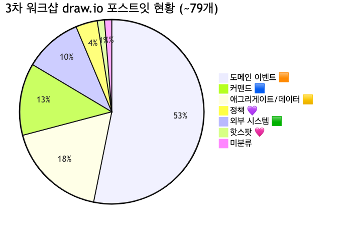

<details>
<summary>📊 원본 Mermaid 코드 보기</summary>

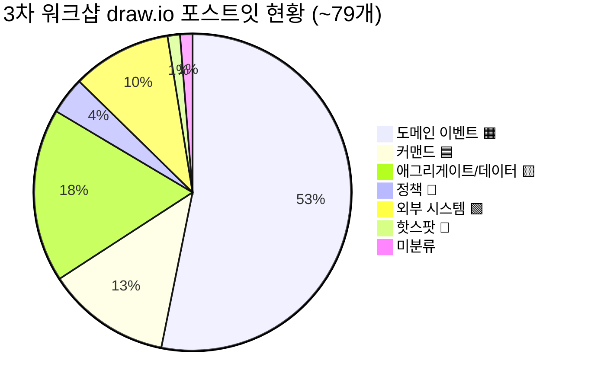

</details>

**주요 문제점:**
- **금색(#FFD700) ~14건에 애그리게이트·데이터 라벨·액터 혼재** — "사용자 옷"(액터), "배치 시스템 Jenkins" x2(외부 시스템), "증분 대상 데이터"·"상품 데이터" 등(데이터 라벨)이 모두 같은 금색
- **이벤트 ~42개 중 UI 이벤트 ~3건** — "상품 상세페이지 진입", "상세화면에서 바로가기 누름" 등은 비즈니스 이벤트가 아닌 UI 네비게이션
- **시제/표현 불일치 ~5건** — "상품 데이터가 (Auto)"(미완성), "검색 결과가 0건이다"(현재형), "상세화면에서 바로가기 누름"(능동형)
- **애그리게이트 재정의 미수행** — 2차 검토 문서의 10개 후보가 반영되지 않음
- **읽기 모델·BC 전혀 미수행** — 이벤트 확장에 시간 소요

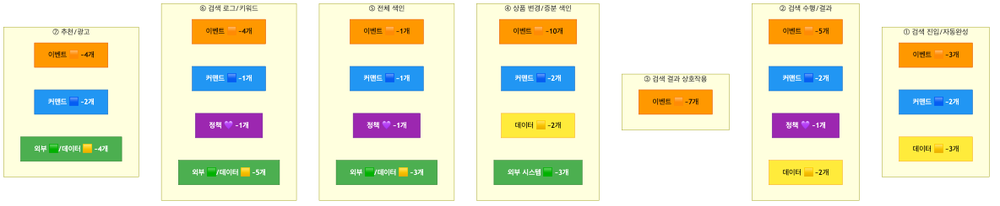

<details>
<summary>📊 원본 Mermaid 코드 보기</summary>

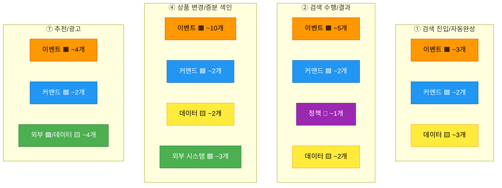

</details>

---

## 3. 준비 문서 대비 달성도

### 3.1 목표 달성 비교표

| 항목 | 2차 검토 문서의 3차 목표 | 실제 수행 결과 | 달성 |
|------|------------------------|---------------|------|
| 2차 오분류 9건 교정 | 사전 반영 | 일부 교정 (핫스팟→외부 시스템 5건 반영), 나머지 미확인 | 🟧 부분 |
| 미수행 영역(③④⑤) 보완 | 이벤트·커맨드 도출 | ✅ ③④⑦ 대폭 확장, 이벤트 14→42개 | ✅ |
| 읽기 모델 6개 후보 | 고객 3개 + 운영자 3개 | **미수행** | ⬜ |
| 애그리게이트 재정의·통합 | 12개 → 10개 확정 | **미수행** (금색 14개 혼재) | ⬜ |
| 바운디드 컨텍스트 경계 설정 | 3~5개 BC 확정 | **미수행** | ⬜ |
| 컨텍스트 맵 초안 | BC 간 관계 정의 | **미수행** | ⬜ |

**분석:** 3차 워크샵은 2차 검토 문서의 Phase 1(미수행 영역 보완)을 **크게 달성**했습니다. 특히 ③결과 상호작용(대체키워드, 0건 처리, 상품 클릭 흐름), ④상품 변경/증분 색인(쿠폰/할인 시간 도래, 배송비코드), ⑦추천/광고(추천 API, 광고 API) 영역이 신규로 상세화된 것은 큰 성과입니다. 반면 Phase 2~4(읽기모델, BC, 컨텍스트맵)는 이벤트 확장에 시간이 소요되어 미수행되었습니다.

### 3.2 Phase별 수행 현황

| Phase | 2차 검토 문서 계획 | 계획 소요 | 실제 수행 | 비고 |
|-------|-------------------|----------|----------|------|
| 오프닝 | 2차 결과 리뷰, 오분류 교정 | 15분 | ✅ 수행 | 핫스팟→외부 시스템 일부 반영 |
| Phase 1 | 미수행 영역 보완 (③④⑤) | 30분 | ✅ 대폭 수행 | ③④⑦ 이벤트 ~28개 신규 도출 |
| Phase 2 | 읽기 모델 도출 (~6개) | 25분 | ⬜ 미수행 | |
| Phase 3 | 바운디드 컨텍스트 설정 | 25분 | ⬜ 미수행 | |
| Phase 4 | 컨텍스트 맵 | 20분 | ⬜ 미수행 | |
| 마무리 | 전체 통합 | 15분 | ⬜ 미수행 | |

### 3.3 7개 흐름 영역 커버리지

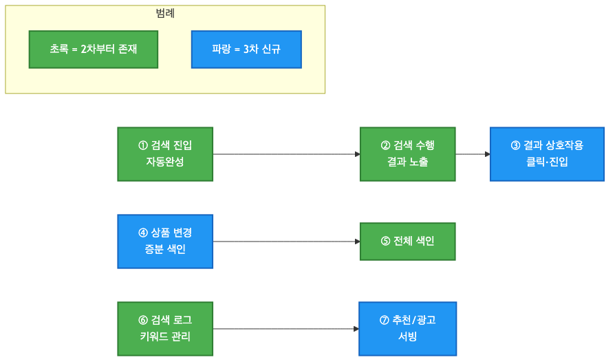

<details>
<summary>📊 원본 Mermaid 코드 보기</summary>

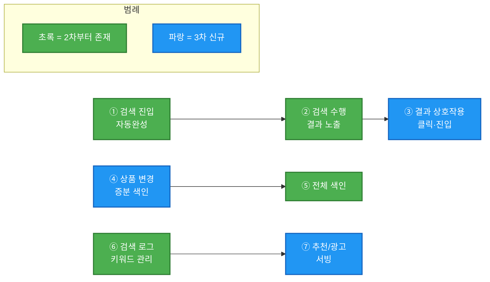

</details>

| 영역 | 2차 상태 | 3차 상태 | 3차 변동 |
|------|---------|---------|---------|
| ① 검색 진입/자동완성 | ✅ | ✅ 유지 | — |
| ② 검색 수행/결과 | ✅ | ✅ 유지 | 재검색/교정 추가 |
| ③ 결과 상호작용 | ⬜ 미수행 | ✅ **신규** | 대체키워드, 0건결과, 클릭, 상세진입 등 ~11개 |
| ④ 상품 변경/증분 색인 | ⬜ 미수행 | ✅ **신규** | 전시목록, 재입고, 쿠폰/할인, 증분색인 등 ~14개 |
| ⑤ 전체 색인 | ✅ | ✅ 유지 | — |
| ⑥ 검색 로그/키워드 | 🟧 부분 | ✅ 확장 | DW/오로라 로그, 자동완성/연관/인기 생성 추가 |
| ⑦ 추천/광고 | ⬜ 미수행 | ✅ **신규** | 추천 API, 광고 API, 요청/노출 ~10개 |

---

## 4. draw.io 색상 오분류 정리

### 4.1 오분류 현황 요약

오분류는 크게 4가지 유형으로 분류됩니다:

1. **금색(🟨 #FFD700) → 외부 시스템(🟩) / 액터(👤):** ~4건 — "배치 시스템 Jenkins" x2(외부 시스템), "사용자 옷"(액터), "인기·추천 검색어"(데이터 라벨 또는 읽기 모델)
2. **금색(🟨 #FFD700) → 데이터 라벨(📝):** ~8건 — "증분 대상 데이터", "상품 데이터", "검색로그정보", "성공검색어 로그데이터", "자동완성 데이터", "검색결과 데이터", "검색로그 데이터", "추천 데이터", "광고 상품" 등
3. **시제/표현 불일치:** ~5건 — "상품 데이터가 (Auto)"(미완성), "검색 결과가 0건이다"(현재형), "상세화면에서 바로가기 누름"(능동형)
4. **UI 이벤트 혼재:** ~3건 — "상품 상세페이지 진입", "상세화면에서 바로가기 누름", "검색리스트에서 상품은 클릭됨"

### 4.2 오분류 상세 및 교정안

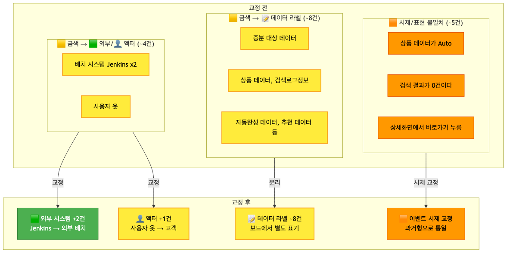

<details>
<summary>📊 원본 Mermaid 코드 보기</summary>

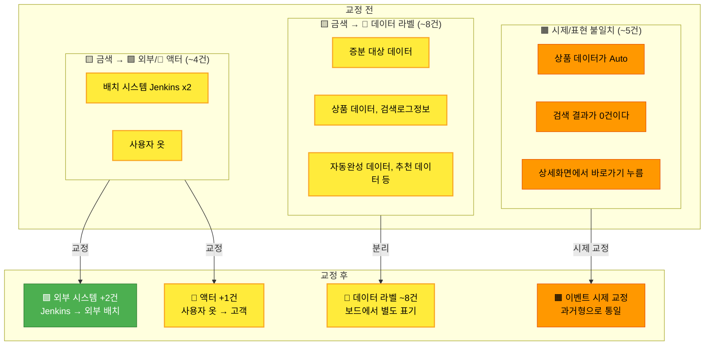

</details>

**유형 1: 금색(🟨) → 외부 시스템(🟩) / 액터(👤) — ~4건**

| # | 요소명 | 현재 분류 | 교정 분류 | 사유 |
|---|--------|----------|----------|------|
| 1 | 배치 시스템 Jenkins (⑤ 전체 색인) | 🟨 애그리게이트 | 🟩 외부 시스템 | Jenkins는 외부 배치 시스템 |
| 2 | 배치 시스템 Jenkins (⑥ 로그 수집) | 🟨 애그리게이트 | 🟩 외부 시스템 | 동일 (중복 — 통합 필요) |
| 3 | 사용자 옷 | 🟨 애그리게이트 | 👤 액터 (고객) | "옷"은 역할 표시, 액터임 |
| 4 | 인기, 추천 검색어 | 🟨 애그리게이트 | 📖 읽기 모델 또는 📝 데이터 라벨 | 검색 결과 화면 데이터 |

**유형 2: 금색(🟨) → 데이터 라벨(📝) — ~8건**

| # | 요소명 | 현재 분류 | 교정 분류 | 사유 |
|---|--------|----------|----------|------|
| 1 | 증분 대상 데이터 | 🟨 애그리게이트 | 📝 데이터 라벨 | "데이터"는 이벤트 스토밍 요소가 아님 |
| 2 | 상품, 위젯 정보, 연관검색 | 🟨 애그리게이트 | 📝 데이터 라벨 | 복합 데이터 설명 |
| 3 | 상품 데이터 (⑤) | 🟨 애그리게이트 | 📝 데이터 라벨 | — |
| 4 | 검색로그정보 (⑥) | 🟨 애그리게이트 | 📝 데이터 라벨 | — |
| 5 | 성공검색어 로그데이터 (⑥) | 🟨 애그리게이트 | 📝 데이터 라벨 | — |
| 6 | 자동완성 데이터 (①) | 🟨 애그리게이트 | 📝 데이터 라벨 | — |
| 7 | 검색결과 데이터 (②) | 🟨 애그리게이트 | 📝 데이터 라벨 | — |
| 8 | 검색로그 데이터 (②) | 🟨 애그리게이트 | 📝 데이터 라벨 | — |
| 9 | 추천 데이터 (⑦) | 🟨 애그리게이트 | 📝 데이터 라벨 | — |
| 10 | 광고 상품 (⑦) | 🟨 애그리게이트 | 📝 데이터 라벨 | — |

**유형 3: 시제/표현 불일치 — ~5건**

| # | draw.io 원본 | 교정 후 | 사유 |
|---|-------------|--------|------|
| 1 | "상품 데이터가 (Auto)" | "상품 데이터가 자동 수집되었다" | 미완성 표현 |
| 2 | "검색 결과가 0건이다" | "검색 결과가 0건으로 반환되었다" | 현재형→과거형 |
| 3 | "상세화면에서 바로가기 누름" | → 🟦 커맨드 또는 제외 (UI 동작) | 능동형/UI 동작 |
| 4 | "추천, 랭킹 키워드를 DB에서 불러온다" | "추천·랭킹 키워드가 로드되었다" | 서술형→이벤트형 |
| 5 | "검색 이력 제외함" | → 🟦 커맨드 "검색 이력 제외하기" | 능동형 → 커맨드 |

**유형 4: UI 이벤트 혼재 — ~3건**

| # | 요소명 | 현재 분류 | 교정 | 사유 |
|---|--------|----------|------|------|
| 1 | 상품 상세페이지 진입 | 🟧 이벤트 | → 제외 또는 🩷 핫스팟 | UI 네비게이션 (검색팀 가이드 TOP 7 #1) |
| 2 | 상세화면에서 바로가기 누름 | 🟧 이벤트 | → 🟦 커맨드 | 사용자 행위 |
| 3 | 검색리스트에서 상품은 클릭됨 | 🟧 이벤트 | → "상품이 선택되었다" (시제 교정) | 비즈니스적 의미 있으나 표현 교정 필요 |

### 4.3 논의 필요 항목

| # | 요소명 | 현재 분류 | 교정 후보 | 논의 사항 |
|---|--------|----------|----------|----------|
| 1 | 전시 API 호출? 이슈 | 🩷 핫스팟 | 🟩 외부? 🟦 커맨드? | 검색팀→전시 호출 vs 전시팀→검색 호출 방향 결정 필요 (2차에서도 미결) |
| 2 | "상품 데이터가 (Auto)" | 🟧 이벤트 | 제거? 교정? | 미완성 표현 — 의도 확인 필요 |
| 3 | "결과가 없어서 추천상품을 보았다" | 🟧 이벤트 | 💜 정책? | "0건→추천 노출"이 자동 정책인지 사용자 행위인지 |
| 4 | 배치 시스템 Jenkins x2 | 🟨 x2 | 🟩 1개로 통합 | 동일 시스템이 2번 등장 |
| 5 | "상품, 위젯 정보, 연관검색" | 🟨 애그리게이트 | 분리? | 복합 데이터 — 개별 애그리게이트로 분리할지 |

### 4.4 교정 후 예상 요소 현황

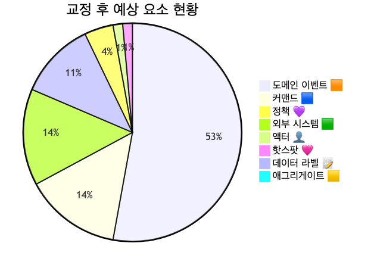

<details>
<summary>📊 원본 Mermaid 코드 보기</summary>

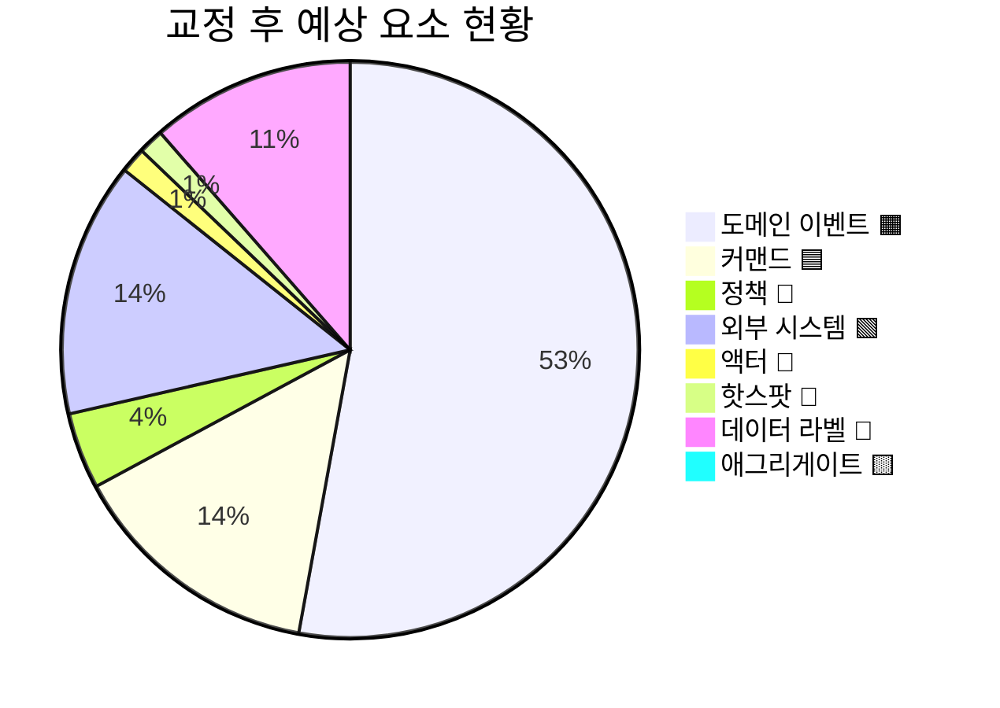

</details>

**교정 전후 수치 비교:**

| 유형 | 교정 전 | 교정 후 | 변동 |
|------|--------|--------|------|
| 이벤트 🟧 | ~42 | ~37 | -5 (UI 제거 -3, 커맨드 전환 -2) |
| 커맨드 🟦 | ~10 | ~12 | +2 (이벤트→커맨드 전환) |
| 정책 💜 | ~3 | ~3 | 유지 (When/Then 구조화 필요) |
| 외부 시스템 🟩 | ~8 | ~10 | +2 (Jenkins x2) |
| 핫스팟 🩷 | ~1 | ~1 | 유지 (전시 API 호출) |
| 액터 👤 | ~0 | ~1 | +1 (사용자 옷→고객) |
| 데이터 라벨 📝 | 0 | ~8 | +8 (🟨에서 분리) |
| 애그리게이트 🟨 | ~14 | 0 | -14 (외부/액터/라벨로 재분류) |

---

## 5. 도메인별 흐름 분석

### 5.1 검색 수행 흐름

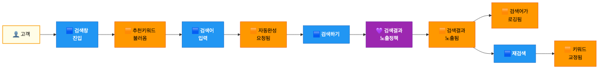

<details>
<summary>📊 원본 Mermaid 코드 보기</summary>

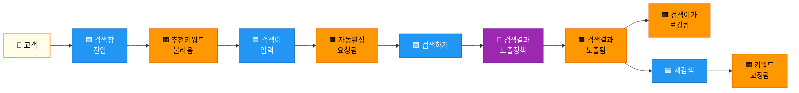

</details>

**흐름 요약:**
1. **검색 진입**: 고객 → 검색창 진입 → 추천·랭킹 키워드 로드
2. **자동완성**: 검색어 입력 → 자동완성 요청 → 자동완성 데이터 반환
3. **검색 수행**: 검색하기 → 노출 정책 적용 → 결과 화면 노출
4. **로깅**: 검색어 로깅
5. **재검색**: 키워드 교정 → 재검색

### 5.2 색인 흐름 (전체 + 증분)

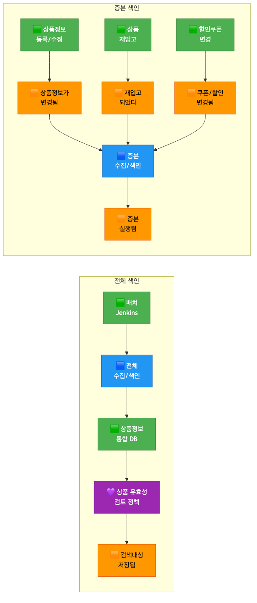

<details>
<summary>📊 원본 Mermaid 코드 보기</summary>

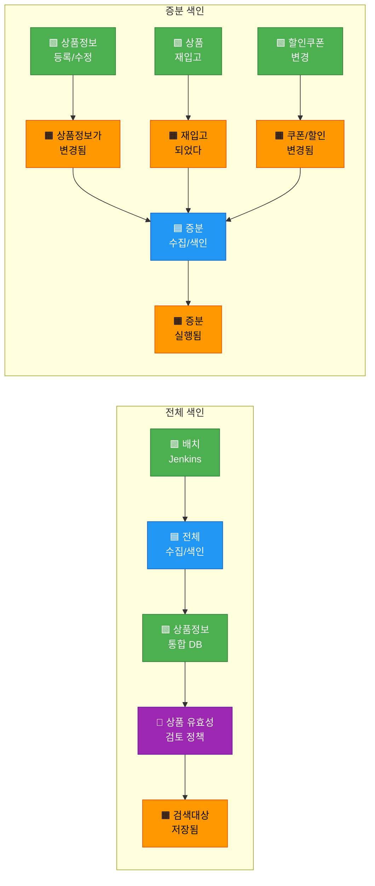

</details>

**흐름 요약:**
1. **전체 색인**: 배치 Jenkins → 전체 수집/색인 → 상품정보 통합 DB → 유효성 검토 정책 → 저장
2. **증분 색인**: 상품정보 변경/재입고/쿠폰 변경(외부 트리거) → 증분 수집/색인 → 증분 실행
3. **시간 트리거**: 할인쿠폰 적용/만료, 배송비코드 적용/만료, 가격 판매시간 도래 → 색인 갱신

### 5.3 검색 품질 & 키워드 관리 흐름

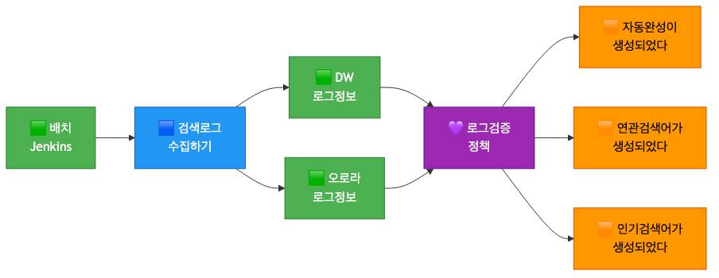

<details>
<summary>📊 원본 Mermaid 코드 보기</summary>

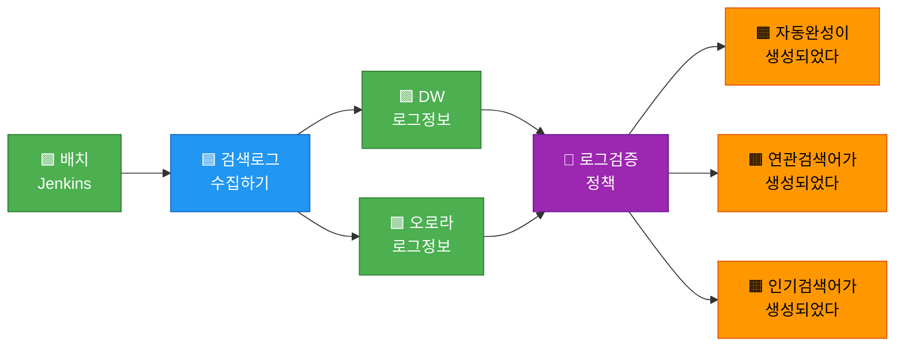

</details>

**흐름 요약:**
1. **로그 수집**: 배치 Jenkins → 검색 로그 수집 → DW 로그 + 오로라 로그
2. **검증/생성**: 로그 검증 정책 → 자동완성·연관검색어·인기검색어 생성
3. **사전 관리**: 동의어/유의어 추가, 부스팅 변경 → 사전 변경됨

### 5.4 외부 시스템 의존성 분석

| 그룹 | 🟩 외부 시스템 | 영역 | 연동 내용 |
|------|--------------|------|----------|
| 배치 | 배치 시스템 Jenkins (x2 → 통합) | ⑤⑥ | 전체 색인 실행, 로그 수집 실행 |
| 상품 | 상품정보 통합 DB, 상품정보 등록/수정, 상품 재입고 | ④⑤ | 상품 데이터 소스, 변경 트리거 |
| 프로모션 | 할인쿠폰 변경 | ④ | 쿠폰/할인 변경 트리거 |
| 로그 | DW 로그정보, 실시간 오로라 로그정보 | ⑥ | 검색 로그 소스 |
| AI/ML | 추천 API, 광고 API | ⑦ | 추천/광고 상품 서빙 |

**교정 후 외부 시스템 총 ~10개** (Jenkins 통합 시 ~9개)

---

## 6. 미완료 항목 정리

### 6.1 미완료 항목 전체 목록

- [ ] 금색 오분류 ~4건 (Jenkins→🟩, 사용자옷→👤) 교정
- [ ] 데이터 라벨 ~8건 보드에서 제거 또는 별도 표기
- [ ] 시제/표현 불일치 ~5건 과거형 교정
- [ ] UI 이벤트 ~3건 제거 또는 커맨드 전환
- [ ] 논의 필요 5건 결정
- [ ] Jenkins 중복 통합
- [ ] 정책 ~3개 → When/Then 구조화 → ~6개 확정 (2차 준비 문서 기준)
- [ ] 애그리게이트 ~10개 재정의 (2차 검토 문서 후보 기준)
- [ ] 읽기 모델 ~6개 후보 도출
- [ ] 바운디드 컨텍스트 ~5개 후보 경계 확정
- [ ] 컨텍스트 맵 초안

### 6.2 영역별 미진행 상세

| 영역 | 이벤트 도출 | 커맨드 도출 | 정책 도출 | 애그리게이트 | 읽기 모델 | BC |
|------|-----------|-----------|----------|------------|----------|-----|
| ① 검색 진입 | ✅ | ✅ | ⬜ | ⬜ | ⬜ | ⬜ |
| ② 검색 수행 | ✅ | ✅ | ✅ | ⬜ | ⬜ | ⬜ |
| ③ 결과 상호작용 | ✅ 신규 | ⬜ | ⬜ | ⬜ | ⬜ | ⬜ |
| ④ 변경/증분 | ✅ 신규 | ✅ | ⬜ | ⬜ | ⬜ | ⬜ |
| ⑤ 전체 색인 | ✅ | ✅ | ✅ | ⬜ | ⬜ | ⬜ |
| ⑥ 로그/키워드 | ✅ 확장 | ✅ | ✅ | ⬜ | ⬜ | ⬜ |
| ⑦ 추천/광고 | ✅ 신규 | ✅ | ⬜ | ⬜ | ⬜ | ⬜ |

### 6.3 애그리게이트·읽기모델·BC 미수행 분석

**미수행 원인:**
- 3차 워크샵이 미수행 영역(③④⑦) 이벤트·커맨드 도출에 집중
- 이벤트가 14→42개로 3배 증가하면서 시간 소요
- 2차 검토 문서의 Phase 2~4(읽기모델, BC, 컨텍스트맵) 미진입

**2차 검토 문서의 애그리게이트 10개 후보 (여전히 유효):**

| # | 🟨 애그리게이트 | 포함 데이터 |
|---|----------------|-----------|
| 1 | 검색 요청 | 검색어, 필터조건, 정렬조건, 페이지 |
| 2 | 검색 결과 | 상품목록, 총건수, 필터옵션, 스폰서상품 |
| 3 | 자동완성 | 후보키워드, 카테고리제안, 인기표시 |
| 4 | 추천 | 추천키워드, 추천상품, 알고리즘유형 |
| 5 | 색인 문서 | 상품ID, 인덱싱상태, 스코어, 최종갱신일 |
| 6 | 상품 원본 | 상품ID, 상품명, 가격, 카테고리, 재고 |
| 7 | 검색 로그 | 검색어, 결과건수, CTR, 세션ID |
| 8 | 사전 | 동의어, 유의어, 금칙어, 대체검색어 |
| 9 | 부스팅 규칙 | 대상상품/키워드, 가중치, 기간 |
| 10 | 인기검색어 | 키워드, 순위, 기간, 변동추이 |

**2차 검토 문서의 읽기 모델 6개 후보 (여전히 유효):**

| # | 📖 읽기 모델 | 대상 사용자 | 구성 데이터 |
|---|-------------|-----------|-----------|
| 1 | 검색결과 뷰 | 👤 고객 | 상품목록, 필터, 정렬, 총건수, 스폰서상품 |
| 2 | 자동완성 뷰 | 👤 고객 | 후보키워드, 카테고리제안, 인기 하이라이트 |
| 3 | 인기검색어 뷰 | 👤 고객 | 실시간순위, 급상승, 시간대별 추이 |
| 4 | 색인 모니터링 뷰 | 🔧 운영자 | 색인진행률, 최근색인시각, 오류건수 |
| 5 | 검색 분석 대시보드 | 🔧 운영자 | 무결과Top키워드, CTR, 전환율 |
| 6 | 사전/부스팅 관리 뷰 | 🔧 운영자 | 동의어목록, 부스팅규칙, 금칙어 |

---

## 7. 4차 워크샵 권장 사항

### 7.1 4차 워크샵 목표 재설정

```
┌─────────────────────────────────────────────────────────────┐
│              4차 워크샵에서 달성할 것                          │
├─────────────────────────────────────────────────────────────┤
│                                                             │
│  ✅ 3차 draw.io 오분류 교정 확인 (사전 반영)               │
│  ✅ 이벤트 정제 (~42개 → ~30개, 데이터라벨/UI 분리)       │
│  ✅ 애그리게이트 재정의 (~10개 확정)                        │
│  ✅ 정책 When/Then 구조화 (~3개 → ~6개)                    │
│  ✅ 읽기 모델 도출 (~6개 후보)                              │
│  ✅ 바운디드 컨텍스트 경계 확정 (~5개)                     │
│                                                             │
└─────────────────────────────────────────────────────────────┘
```

### 7.2 권장 타임라인

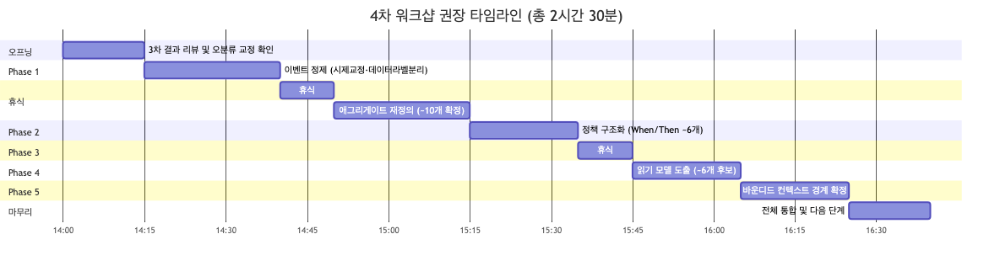

<details>
<summary>📊 원본 Mermaid 코드 보기</summary>

```mermaid
gantt
    title 4차 워크샵 권장 타임라인 (총 2시간 30분)
    dateFormat HH:mm
    axisFormat %H:%M

    section 오프닝
    3차 결과 리뷰 및 오분류 교정 확인    :a1, 14:00, 15m

    section Phase 1
    이벤트 정제 (시제교정·데이터라벨분리)  :a2, after a1, 25m

    section 휴식
    휴식                                  :a3, after a2, 10m

    section Phase 2
    애그리게이트 재정의 (~10개 확정)       :a4, after a3, 25m

    section Phase 3
    정책 구조화 (When/Then ~6개)           :a5, after a4, 20m

    section 휴식
    휴식                                  :a6, after a5, 10m

    section Phase 4
    읽기 모델 도출 (~6개 후보)             :a7, after a6, 20m

    section Phase 5
    바운디드 컨텍스트 경계 확정            :a8, after a7, 20m

    section 마무리
    전체 통합 및 다음 단계                :a9, after a8, 15m
```

</details>

| 시간 | 단계 | 소요 | 핵심 활동 |
|------|------|------|----------|
| 14:00 | 오프닝 | 15분 | 3차 결과 리뷰, 오분류 교정 확인(사전 반영), 논의 5건 거수 결정 |
| 14:15 | Phase 1: 이벤트 정제 | 25분 | 데이터 라벨 ~8건 분리, UI 이벤트 ~3건 제거, 시제 교정 ~5건 → ~30개 목표 |
| 14:40 | 휴식 | 10분 | |
| 14:50 | Phase 2: 애그리게이트 재정의 | 25분 | 2차 검토 문서 10개 후보 기반, 금색 포스트잇 재배치 |
| 15:15 | Phase 3: 정책 구조화 | 20분 | ~3개 → ~6개 When/Then 정의 (노출정책, 유효성, 로그검증, 인기갱신, 자동완성, 시간트리거) |
| 15:35 | 휴식 | 10분 | |
| 15:45 | Phase 4: 읽기 모델 | 20분 | 고객 3개 + 운영자 3개 = ~6개 후보 도출 |
| 16:05 | Phase 5: BC 경계 확정 | 20분 | ~5개 BC 후보(검색수행, 상품색인, 검색품질, 추천/광고, 상품변경) 경계 검증 |
| 16:25 | 마무리 | 15분 | 전체 통합, 컨텍스트 맵 초안, 다음 단계 안내 |
| **16:40** | **종료** | **총 2시간 40분** | |

### 7.3 사전 준비 체크리스트

- [ ] 3차 draw.io 보드에서 금색 Jenkins x2 → 🟩 외부 시스템 교정 + 통합
- [ ] 금색 "사용자 옷" → 👤 액터(고객)로 교정
- [ ] 데이터 라벨 ~8건을 보드에서 회색으로 변경 또는 별도 표기
- [ ] 시제 불일치 ~5건 과거형으로 사전 교정
- [ ] UI 이벤트 ~3건 커맨드 전환 또는 제거 사전 반영
- [ ] 논의 필요 5건에 대해 팀원과 사전 확인 (슬랙 논의)
- [ ] 2차 검토 문서의 애그리게이트 10개 후보를 🟨 포스트잇으로 미리 준비
- [ ] 2차 검토 문서의 읽기 모델 6개 후보를 📖 포스트잇으로 미리 준비
- [ ] "전시 API 호출?" 핫스팟 방향 팀원 사전 투표

### 7.4 퍼실리테이터 유의 사항

3차 워크샵에서 얻은 교훈 4가지:

**1. 금색(#FFD700) 혼용 방지**
> 3차에서 금색 ~14건이 애그리게이트·데이터 라벨·액터에 모두 사용되었습니다.
> 금색은 **🟨 애그리게이트**에만 사용해야 합니다. 데이터 설명은 **📝 회색**, 액터는 **👤 금색(밝은 노란색)**으로 구분합니다.
> 4차에서는 포스트잇 색상 가이드를 오프닝에서 강조하고, draw.io에 색상 프리셋을 사전 설정합니다.

**2. 검색팀 특화: 기술 이벤트 vs 비즈니스 이벤트 구분**
> 3차에서 "상품 데이터가 (Auto)", "증분 실행 됨" 등 기술적 표현이 혼재합니다.
> 검색팀 가이드의 3단계 체크리스트를 적용합니다:
> - "비즈니스적 의미가 있는가?" → 아니면 제외
> - "다른 팀이 알아야 하는가?" → 아니면 내부 처리
> - "사용자가 인지할 수 있는가?" → 아니면 🩷 핫스팟

**3. 이벤트 확장보다 정제·구조화에 집중**
> 3차에서 이벤트가 14→42개로 3배 증가했으나, 정제·구조화는 미수행입니다.
> 4차에서는 **"이벤트 도출은 충분합니다. 오늘은 정제·구조화에 집중합니다"**와 같이 오프닝에서 명확히 안내합니다.
> 새 이벤트 추가 요청이 있으면 **"이 단계에서는 기존 이벤트를 정리합니다. 새 이벤트는 메모해두고 나중에 반영합시다"**로 안내합니다.

**4. BC 경계 설정 시 검색 도메인 특수성 반영**
> 검색 도메인은 **읽기 중심**(CQRS 패턴)이므로, 명령 측(색인)과 조회 측(검색)의 경계가 자연스러운 BC 분리 지점입니다.
> BC 논의 시 **"이 데이터를 쓰는 쪽과 읽는 쪽은 다른 팀/서비스인가?"**라는 질문으로 유도합니다.

### 7.5 도메인별 정제 우선순위

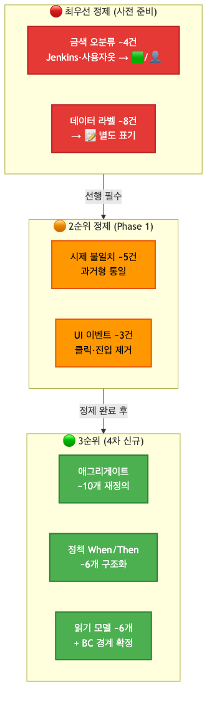

<details>
<summary>📊 원본 Mermaid 코드 보기</summary>

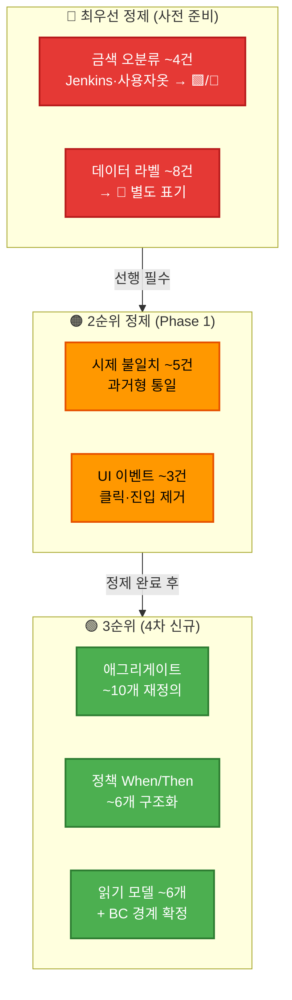

</details>

**우선순위 설명:**
1. **🔴 최우선**: 금색 오분류 교정 + 데이터 라벨 분리 — **사전 준비로 처리**
2. **🟠 2순위**: 시제 교정 + UI 이벤트 제거 — **Phase 1에서 처리**
3. **🟢 3순위**: 애그리게이트·정책 구조화·읽기모델·BC 경계 — **Phase 2~5에서 신규 수행**
