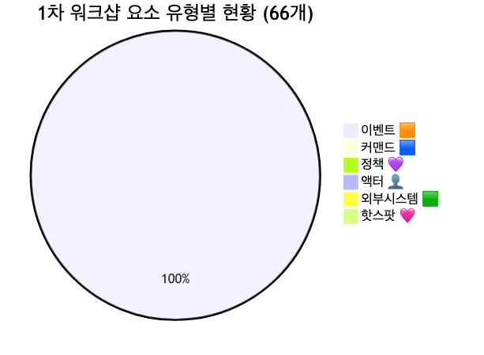
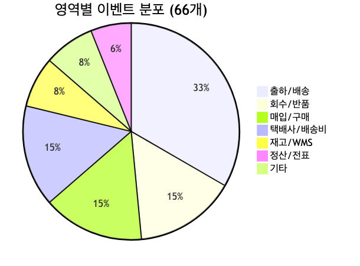
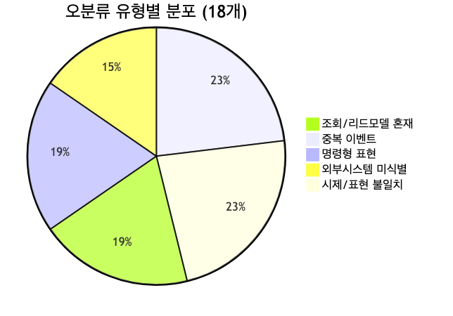
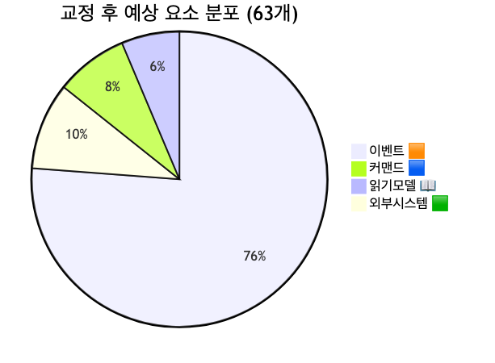
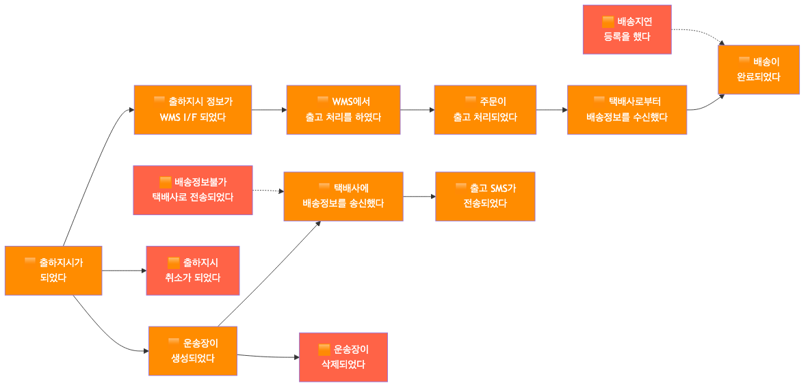
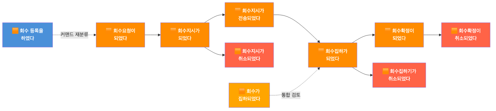
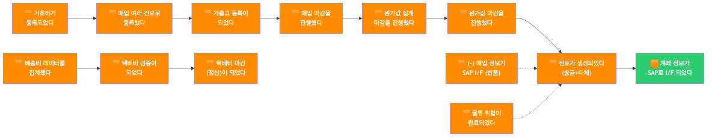
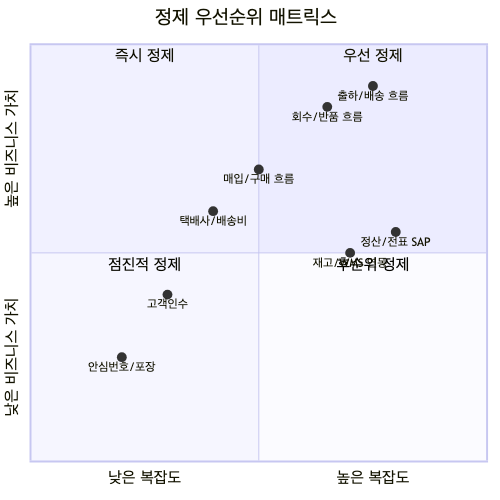
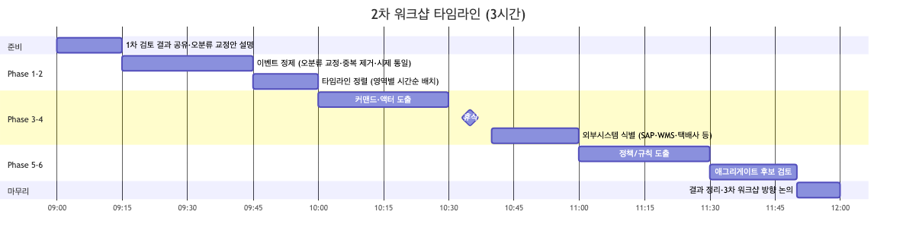

# 물류 시스템 이벤트 스토밍 1차 워크샵 검토 및 보완 사항

## 1. 개요

### 1.1 이 문서의 목적

```
┌─────────────────────────────────────────────────────────────┐
│              이 문서의 3가지 목적                              │
├─────────────────────────────────────────────────────────────┤
│                                                             │
│  ✅ 1차 워크샵 수행 결과를 이벤트 도출 관점에서 분석        │
│  ✅ draw.io 결과물의 오분류 정리 및 교정안 도출             │
│  ✅ 2차 워크샵 방향 및 타임라인 설정                        │
│                                                             │
└─────────────────────────────────────────────────────────────┘
```

### 1.2 워크샵 기본 정보

| 항목 | 내용 |
|------|------|
| 일시 | 2026년 3월 (1차 워크샵) |
| 참석자 | 물류시스템 담당 (협력사/계열사 포함) |
| 수행 범위 | 물류 전 영역 — 매입/구매, 출하/배송, 회수/반품, 택배사/배송비, 재고/WMS, 정산/전표 |
| 산출물 | draw.io 보드 (포스트잇 66개) |
| 수행 방식 특이점 | 1차 워크샵으로 **이벤트 도출(Phase 1)**에만 집중. 커맨드, 정책, 액터, 외부시스템 등의 요소 구분 없이 전체 66개가 🟧 오렌지(이벤트)로만 기록됨 |

### 1.3 참조 문서

| 참조 문서 | 활용 시점 |
|----------|----------|
| [이벤트스토밍_물류시스템_가이드.md](./이벤트스토밍_물류시스템_가이드.md) | 물류 도메인 특수성, 6대 도전과제 참조 |
| [이벤트스토밍_물류시스템_워크샵실행.md](./이벤트스토밍_물류시스템_워크샵실행.md) | 퍼실리테이터 스크립트, 실행 가이드 |
| [이벤트스토밍_물류시스템_서비스간흐름.md](./이벤트스토밍_물류시스템_서비스간흐름.md) | 서비스 간 흐름 참조 |
| [이벤트스토밍_물류시스템_도메인예시.md](./이벤트스토밍_물류시스템_도메인예시.md) | 도메인 이벤트 예시 |
| [이벤트스토밍_시각화_가이드.md](./이벤트스토밍_시각화_가이드.md) | 포스트잇 색상·배치 패턴 |

---

## 2. 수행 결과 요약

### 2.1 실제 수행 범위 및 방식

1차 워크샵에서 실제로 수행된 활동:

1. **매입/구매 영역** — 기초하기 등록, 매입 마감, 가출고, SAP I/F 등 매입 프로세스 도출
2. **출하/배송 영역** — 출하지시, 운송장 생성, 배송정보 송수신, WMS 연동, 출고 처리 등 핵심 물류 프로세스 도출
3. **회수/반품 영역** — 회수요청→회수지시→회수집하→회수확정 라이프사이클 도출
4. **택배사/배송비 영역** — 택배사 추가, 단가 등록/수정, 배송비 집계/검증/마감 도출
5. **재고/WMS 영역** — 재고 확정, 재고이동, WMS 연동 처리 도출
6. **정산/전표 영역** — 전표 생성, 원가 마감, SAP I/F 도출

**수행 방식 특이점:**
- 1차 워크샵으로 **이벤트 도출(Phase 1)**에만 집중하여 커맨드, 정책, 액터, 외부시스템 등은 아직 미구분
- 전체 66개 포스트잇이 모두 🟧 오렌지(이벤트)로 기록됨
- 물류 전 영역을 빠르게 훑어보는 방식으로 진행되어 영역별 깊이는 고르지 않음
- 일부 조회 화면, 명령형 표현, 외부시스템 I/F가 이벤트로 혼재되어 있음

### 2.2 draw.io 분석 결과 (요소 유형별)

| 유형 | 수량 | 비율 | 비고 |
|------|------|------|------|
| 이벤트 🟧 | 66개 | 100% | 전체가 #FF8C00 단일 색상 |
| 커맨드 🟦 | 0개 | 0% | 미도출 |
| 정책 💜 | 0개 | 0% | 미도출 |
| 액터 👤 | 0개 | 0% | 미도출 |
| 외부 시스템 🟩 | 0개 | 0% | SAP, WMS 등 언급되나 별도 색상 미구분 |
| 핫스팟 🩷 | 0개 | 0% | 미도출 |
| 읽기모델 📖 | 0개 | 0% | 조회 이벤트가 일부 혼재 |

> **총 66개 포스트잇, 단일 유형(이벤트)만 존재**



### 2.3 draw.io 분석 결과 (영역별)

| 영역 | 이벤트 수 | 주요 항목 |
|------|----------|----------|
| **출하/배송** | ~22개 | 출하지시, 운송장 생성/등록/삭제, 배송정보 송수신, 출고 SMS, WMS 전송/출고처리, 배송완료, 출고등록, 배송지연, 주문출고처리, 출하예정일 관리 등 |
| **회수/반품** | ~10개 | 회수요청→회수지시→회수집하→회수확정 (정방향+취소 포함), 회수등록 |
| **매입/구매** | ~10개 | 기초하기 등록, 매입 마감(x2), 매입 여러 건 등록, 가출고 등록, 매입 SAP I/F, 협력사 인수등록, 물류 취합 등 |
| **택배사/배송비** | ~10개 | 택배사 추가, 택배단가 등록/수정, 배송비 집계, 택배비 마감/검증, 기타택배비, 배송정보 수신(출고/고객센터) |
| **재고/WMS** | ~5개 | 재고 확정(직매입)(x2), 재고부족취소, FU 재고이동전표, WMS 재고이동 |
| **정산/전표** | ~4개 | 전표 생성(송금+대체), 원가값 집계 마감, 원가값 마감, 계좌정보 SAP I/F |
| **기타** | ~5개 | 안심번호 등록/해지, 분리포장등록, 고객인수 등록, 주문 고객인수 |



---

## 3. 달성도 분석

### 3.1 이벤트 스토밍 Phase별 달성도

1차 워크샵의 특성을 고려하여, 이벤트 스토밍 전체 Phase 대비 달성도를 분석합니다.

| Phase | 목표 | 실제 달성 | 달성률 | 비고 |
|-------|------|----------|--------|------|
| Phase 1: 이벤트 도출 | 도메인 이벤트 60~80개 | 66개 (순수 ~48개) | **60%** | 조회/중복/명령형 18개 제외 시 |
| Phase 2: 타임라인 정렬 | 시간순 배치 | 부분 달성 | **40%** | 영역별 클러스터링은 되었으나 시간순 정렬은 불완전 |
| Phase 3: 커맨드 도출 | 커맨드 30~40개 | 0개 | **0%** | 미수행 |
| Phase 4: 정책/규칙 도출 | 정책 15~20개 | 0개 | **0%** | 미수행 |
| Phase 5: 애그리게이트 | 애그리게이트 8~12개 | 0개 | **0%** | 미수행 |
| Phase 6: 읽기모델 | 읽기모델 5~8개 | 0개 | **0%** | 일부 조회 이벤트가 후보 |
| Phase 7: BC 식별 | BC 5~7개 | 0개 | **0%** | 영역 클러스터링으로 후보 도출 가능 |

### 3.2 영역 커버리지

물류시스템 가이드에서 정의한 6대 서비스 영역 대비 커버리지:

| 서비스 영역 | 커버리지 | 평가 |
|------------|----------|------|
| 출하/배송 관리 | ★★★★☆ | 출하지시~배송완료 라이프사이클 대부분 도출 |
| 회수/반품 관리 | ★★★★☆ | 회수 라이프사이클 정방향+취소 모두 도출 |
| 매입/구매 관리 | ★★★☆☆ | 매입 기본 흐름은 있으나 상세 분기 부족 |
| 택배사/배송비 | ★★★☆☆ | 택배사 관리, 단가, 정산 기본 도출 |
| 재고/WMS | ★★☆☆☆ | 재고 확정, 이동 기본만 — WMS 연동 상세 부족 |
| 정산/전표 | ★★☆☆☆ | 전표 생성, 원가 마감만 — SAP 연동 상세 부족 |


### 3.3 종합 평가

```
┌─────────────────────────────────────────────────────────────┐
│                    1차 워크샵 종합 평가                       │
├─────────────────────────────────────────────────────────────┤
│                                                             │
│  ✅ 잘된 점                                                 │
│  • 물류 전 영역(6개)을 빠짐없이 1회에 훑어본 점             │
│  • 출하/배송, 회수/반품 라이프사이클이 비교적 상세히 도출    │
│  • 이벤트 66개로 1차 워크샵 치고는 충분한 양                │
│                                                             │
│  ⚠️ 보완 필요                                               │
│  • 전체 66개가 단일 색상(이벤트)으로만 기록됨               │
│  • 조회/리드모델(~5개), 중복(~6개), 명령형(~5개) 혼재      │
│  • 외부시스템(SAP, WMS, 택배사 API)이 이벤트로 매몰됨       │
│  • 시제/표현 불일치 ("~했다" vs "~되었다")                   │
│  • 재고/WMS, 정산/전표 영역의 깊이가 부족                   │
│                                                             │
│  📊 순수 비즈니스 이벤트: ~48개 / 전체 66개 (73%)           │
│                                                             │
└─────────────────────────────────────────────────────────────┘
```

---

## 4. 오분류 정리

### 4.1 오분류 유형 분석

draw.io 보드에서 발견된 오분류를 5가지 유형으로 정리합니다.



#### 유형 1: 조회/리드모델을 이벤트로 기록 (~5개)

"조회되었다", "조회하였다" 등의 표현은 상태 변화가 아닌 **데이터 읽기**에 해당하므로 📖 읽기모델로 재분류해야 합니다.

| # | 현재 텍스트 | 색상 | 교정안 | 유형 |
|---|-----------|------|-------|------|
| 1 | 영업비용 리스트업이 조회되었다 | 🟧 | 📖 영업비용 리스트업 (읽기모델) | 읽기모델 |
| 2 | 매입 현황을 조회했다 | 🟧 | 📖 매입 현황 조회 (읽기모델) | 읽기모델 |
| 3 | 배송도착서비스가 조회되었다 (y370) | 🟧 | 📖 배송도착서비스 현황 (읽기모델) | 읽기모델 |
| 4 | 배송도착서비스가 조회되었다 (y680) | 🟧 | 중복 — 위 항목과 병합 | 중복+읽기모델 |
| 5 | 출하지시 부여 대상 주문건을 조회하였다 | 🟧 | 📖 출하지시 대상 주문 목록 (읽기모델) | 읽기모델 |

#### 유형 2: 중복 이벤트 (~3쌍, 6개 → 3개로 통합)

동일하거나 매우 유사한 이벤트가 2번 이상 기록된 경우:

| # | 중복 이벤트 | 위치 | 교정안 |
|---|-----------|------|-------|
| 1 | "매입 마감을 진행했다" (x130) / "매입 마감을 진행했다" (x310) | Row 1 | → 1개로 통합: "매입 마감이 진행되었다" |
| 2 | "배송도착서비스가 조회되었다" (y370) / "배송도착서비스가 조회되었다" (y680) | 분산 | → 읽기모델 1개로 통합 |
| 3 | "재고 확정이 되었다 (직매입)" (y510) / "재고 확정이 되었다 (직매입)" (y810) | 분산 | → 1개로 통합 |

#### 유형 3: 명령형 표현 — 커맨드로 재분류 필요 (~5개)

"~를 했다", "~등록을 했다" 등 **행위자의 직접 행동**을 표현하는 문장은 🟦 커맨드(명령)으로 재분류합니다.

| # | 현재 텍스트 | 교정안 (커맨드) | 대응 이벤트 |
|---|-----------|---------------|------------|
| 1 | 배송지연 등록을 했다 | 🟦 배송지연 등록하기 | 🟧 배송지연이 등록되었다 |
| 2 | 출고등록을 했다 | 🟦 출고 등록하기 | 🟧 출고가 등록되었다 |
| 3 | 고객인수 등록을 했다 | 🟦 고객인수 등록하기 | 🟧 고객인수가 등록되었다 |
| 4 | 회수 등록을 하였다 | 🟦 회수 등록하기 | 🟧 회수가 등록되었다 |
| 5 | 분리포장등록을 했다 | 🟦 분리포장 등록하기 | 🟧 분리포장이 등록되었다 |

#### 유형 4: 외부시스템 I/F 이벤트 — 외부시스템 식별 필요 (~4개)

SAP, WMS, 택배사 API와의 인터페이스가 이벤트로 기록되어 있으나, **외부시스템(🟩)을 별도로 식별**해야 합니다.

| # | 현재 텍스트 | 식별해야 할 외부시스템 |
|---|-----------|---------------------|
| 1 | 계좌 정보가 SAP로 I/F 되었다 (등록) | 🟩 SAP |
| 2 | (-) 매입 정보가 SAP로 I/F 되었다 (반품) | 🟩 SAP |
| 3 | 출하지시 정보가 WMS I/F 되었다 | 🟩 WMS |
| 4 | 택배사로부터 전송정보가 I/F 되었다 | 🟩 택배사 API |

> 이벤트 자체는 유효하나, **외부시스템을 초록색 포스트잇으로 별도 표시**해야 합니다.
> 추가로 식별해야 할 외부시스템: 기간계(주문/상품), GLS, 안심번호 서비스

#### 유형 5: 시제/표현 불일치

이벤트 표현이 통일되지 않은 경우:

| 패턴 | 예시 | 권장 표현 |
|------|------|----------|
| "~를 진행했다" (능동) | 매입 마감을 진행했다, 원가값 집계 마감을 진행했다 | "매입 마감이 완료되었다" (수동/완료) |
| "~이/가 되었다" (수동) ✅ | 출하지시가 되었다, 회수요청이 되었다 | 권장 패턴 |
| "~을 했다" (능동) | 출고등록을 했다, 배송지연 등록을 했다 | 커맨드로 재분류 또는 "~이 등록되었다" |
| "~에 완료되었다" (조사 오류) | 배송에 완료되었다 | "배송이 완료되었다" |

### 4.2 교정 후 예상 현황

교정 후 이벤트 분포:

| 유형 | 교정 전 | 교정 후 | 변화 |
|------|--------|--------|------|
| 이벤트 🟧 | 66개 | ~48개 | -18 (중복 제거, 읽기모델/커맨드 재분류) |
| 커맨드 🟦 | 0개 | ~5개 | +5 (명령형 표현 재분류) |
| 읽기모델 📖 | 0개 | ~4개 | +4 (조회 이벤트 재분류) |
| 외부시스템 🟩 | 0개 | ~6개 | +6 (SAP, WMS, 택배사 API, 기간계, GLS, 안심번호) |
| 중복 제거 | — | -3개 | 3쌍 → 3개로 통합 |
| **합계** | **66개** | **~63개** | 유형 다양화 + 중복 제거 |



---

## 5. 흐름 분석

### 5.1 출하/배송 흐름

물류의 핵심 프로세스인 출하~배송 완료까지의 흐름을 분석합니다.

```
출하지시 → 운송장 생성 → WMS 전송 → WMS 출고처리 →
택배사 배송정보 송신 → 출고 SMS 전송 → 배송정보 수신 → 배송 완료
```

**도출된 이벤트 흐름:**

| 순서 | 이벤트 | 비고 |
|------|--------|------|
| 1 | 출하지시가 되었다 | 시작점 |
| 2 | 출하지시 정보가 WMS I/F 되었다 | WMS 연동 |
| 3 | 운송장이 생성되었다 | |
| 4 | 배송정보불가 택배사로 전송되었다 | 예외 케이스 |
| 5 | 택배사에 배송정보를 송신했다 (배송) | 택배사 연동 |
| 6 | 출고 SMS가 전송되었다 | 알림 |
| 7 | WMS에서 출고 처리를 하였다 | WMS 출고 |
| 8 | 주문이 출고 처리되었다 | 기간계 연동 |
| 9 | 택배사로부터 배송정보를 수신했다 (출고) | 배송추적 |
| 10 | 배송에[이] 완료되었다 | 완료 |

**누락 추정 이벤트:**
- "배송 중 상태가 변경되었다" (배송추적 상태 변경)
- "부분 출고가 처리되었다" (분할 배송)
- "센터 경유가 결정되었다" (센터배송 분기)
- "편의점 배송이 접수되었다" (편의점 배송)



### 5.2 회수/반품 흐름

회수 라이프사이클이 비교적 잘 도출되어 있습니다.

```
회수요청 → 회수지시 → 회수지시 전송 → 회수집하 → 회수확정
                ↓                        ↓          ↓
         회수지시 취소            회수집하 취소   회수확정 취소
```

**도출된 이벤트 흐름:**

| 순서 | 이벤트 | 비고 |
|------|--------|------|
| 1 | 회수요청이 되었다 | 시작점 — 기간계(반품/교환)에서 유입 |
| 2 | 회수 등록을 하였다 | → 🟦 커맨드로 재분류 권장 |
| 3 | 회수지시가 되었다 | |
| 4 | 회수지시가 전송되었다 | 택배사 연동 |
| 5 | 회수집하가 되었다 | |
| 6 | 회수가 집하되었다 | 5번과 유사 — 통합 검토 |
| 7 | 회수확정이 되었다 | 완료 |
| 취소 | 회수지시가 취소되었다 | 취소 분기 |
| 취소 | 회수집하기가 취소되었다 | 취소 분기 |
| 취소 | 회수확정이 취소되었다 | 취소 분기 |

**누락 추정 이벤트:**
- "회수 검수가 완료되었다" (검수 후 양품/불량 판정)
- "반품 입고가 처리되었다" (WMS 반품 입고)
- "교환 출고가 지시되었다" (교환 프로세스)



### 5.3 매입/정산 흐름

매입에서 정산까지의 흐름:

```
기초하기 등록 → 매입 등록 → 매입 마감 → 원가값 집계 →
전표 생성 → SAP I/F → 택배비 검증 → 택배비 마감
```

**도출된 이벤트 흐름:**

| 순서 | 이벤트 | 비고 |
|------|--------|------|
| 1 | 기초하기 등록되었다 | 매입 시작 |
| 2 | 매입 여러 건으로 등록했다 | |
| 3 | 가출고 등록이 되었다 | 가출고 처리 |
| 4 | 매입 마감을 진행했다 | 마감 처리 |
| 5 | 원가값 집계 마감을 진행했다 | 원가 집계 |
| 6 | 원가값 마감을 진행했다 | 원가 확정 |
| 7 | 배송비 데이터를 집계했다 | 배송비 |
| 8 | 택배비 검증이 되었다 | 검증 |
| 9 | 택배비 마감(정산)이 되었다 | 정산 마감 |
| 10 | 전표가 생성되었다 (송금+대체) | SAP 전표 |
| 11 | 계좌 정보가 SAP로 I/F 되었다 | SAP 연동 |
| 12 | (-) 매입 정보가 SAP로 I/F 되었다 (반품) | 반품 매입 |
| 13 | 물류 취합이 완료되었다 | 최종 취합 |

**누락 추정 이벤트:**
- "매입 단가가 확정되었다"
- "정산 데이터가 검증되었다"
- "월 정산이 확정되었다"



---

## 6. 미완료 항목

### 6.1 2차 워크샵에서 수행해야 할 항목

| # | 항목 | 우선순위 | 설명 |
|---|------|---------|------|
| 1 | **이벤트 정제** | 🔴 필수 | 오분류 교정(~18개), 시제 통일, 중복 제거 |
| 2 | **커맨드 도출** | 🔴 필수 | 각 이벤트를 트리거하는 커맨드 30~40개 도출 |
| 3 | **액터 식별** | 🔴 필수 | 물류담당자, WMS 운영자, 택배사, 배치 시스템, 기간계 등 |
| 4 | **외부시스템 식별** | 🔴 필수 | SAP, WMS, 택배사 API, 기간계(OR/IMS), GLS, 안심번호 서비스 |
| 5 | **정책/규칙 도출** | 🟡 권장 | 센터배송 분기, 택배사 배정, 재고 부족 처리 등 비즈니스 규칙 |
| 6 | **타임라인 정렬** | 🟡 권장 | 영역별 이벤트를 시간순으로 재배치 |
| 7 | **누락 이벤트 보충** | 🟡 권장 | 배송추적 상태변경, 검수, 교환출고, 편의점배송 등 |
| 8 | **애그리게이트 후보** | 🟢 선택 | 시간 여유 시 Phase 5 진행 |

### 6.2 애그리게이트 후보 (사전 식별)

현재 이벤트 분석을 기반으로 2차 워크샵에서 확정할 애그리게이트 후보:

| # | 애그리게이트 후보 | 관련 이벤트 | 설명 |
|---|-----------------|------------|------|
| 1 | **출하지시** | 출하지시 생성/취소/WMS전송, 출하예정일 관리 | 출하의 핵심 엔티티 |
| 2 | **운송장** | 운송장 생성/등록/삭제 | 배송 추적의 핵심 |
| 3 | **배송** | 배송정보 송수신, 배송완료, 배송지연, 배송도착서비스 | 배송 라이프사이클 |
| 4 | **회수** | 회수요청/등록/지시/집하/확정 (+취소) | 회수 라이프사이클 |
| 5 | **매입** | 기초하기, 매입등록, 매입마감, 가출고 | 매입 관리 |
| 6 | **택배사** | 택배사 추가, 택배단가 등록/수정 | 택배사 마스터 |
| 7 | **택배비/배송비** | 배송비 집계, 택배비 검증/마감, 기타택배비 | 비용 정산 |
| 8 | **재고** | 재고 확정, 재고부족취소, 재고이동 | 재고 관리 |
| 9 | **전표/정산** | 전표 생성, 원가 마감, SAP I/F | 정산 처리 |

### 6.3 읽기모델 후보

| # | 읽기모델 후보 | 용도 |
|---|-------------|------|
| 1 | 영업비용 리스트업 | 영업비용 현황 조회 |
| 2 | 매입 현황 | 매입 상태/금액 조회 |
| 3 | 배송도착서비스 현황 | 배송 도착 예정 조회 |
| 4 | 출하지시 대상 주문 목록 | 출하 대상 주문 조회 |
| 5 | 배송추적 현황 | 실시간 배송 상태 (누락 — 보충 필요) |
| 6 | 택배비 정산 현황 | 월별 택배비 집계 (누락 — 보충 필요) |

### 6.4 BC(바운디드 컨텍스트) 후보

영역 분석과 애그리게이트 후보를 기반으로 BC 후보를 사전 식별합니다:

| # | BC 후보 | 포함 애그리게이트 | 핵심 이벤트 |
|---|--------|-----------------|------------|
| 1 | **출하/배송 관리** | 출하지시, 운송장, 배송 | 출하지시~배송완료 전 과정 |
| 2 | **회수/반품 관리** | 회수 | 회수요청~회수확정 (+취소) |
| 3 | **매입/구매 관리** | 매입 | 기초하기~매입마감, 가출고 |
| 4 | **택배사/배송비 관리** | 택배사, 택배비/배송비 | 택배사 등록, 단가, 배송비 정산 |
| 5 | **재고/WMS 관리** | 재고 | 재고 확정, 이동, WMS 연동 |
| 6 | **정산/전표 관리** | 전표/정산 | 원가 마감, 전표 생성, SAP I/F |



---

## 7. 2차 워크샵 권장 사항

### 7.1 워크샵 구성

| 항목 | 권장 내용 |
|------|----------|
| **시간** | 3시간 (오전 권장) |
| **참석자** | 물류시스템 담당자 + 기간계(주문/상품) 담당자 1명 |
| **목표** | 이벤트 정제 + 커맨드/액터 도출 + 외부시스템 식별 |
| **핵심 질문** | "이 이벤트를 누가 트리거하는가?" |

### 7.2 타임라인



```
┌─────────────────────────────────────────────────────────────┐
│              2차 워크샵 타임라인 (3시간)                      │
├──────┬──────────────────────────────────────────────────────┤
│ 시간  │ 활동                                                │
├──────┼──────────────────────────────────────────────────────┤
│ 0:00 │ 오프닝: 1차 검토 결과 공유, 오분류 교정안 설명       │
│ 0:15 │ Phase 1: 이벤트 정제 — 오분류 교정, 중복 제거,       │
│      │          시제 통일, 누락 이벤트 보충                  │
│ 0:45 │ Phase 2: 타임라인 정렬 — 영역별 시간순 배치          │
│ 1:00 │ Phase 3: 커맨드·액터 도출                            │
│      │  "이 이벤트는 누가(액터) 무엇을(커맨드) 해서          │
│      │   발생하는가?"                                       │
│ 1:30 │ ── 휴식 10분 ──                                     │
│ 1:40 │ Phase 4: 외부시스템 식별                             │
│      │  SAP, WMS, 택배사 API, 기간계 등을 🟩 초록색으로     │
│ 2:00 │ Phase 5: 정책/규칙 도출                              │
│      │  "이 이벤트 다음에 자동으로 일어나는 것은?"           │
│      │  센터배송 분기, 택배사 배정, 재고부족 처리 등         │
│ 2:30 │ Phase 6: 애그리게이트 후보 검토                      │
│      │  사전 식별된 9개 후보를 참석자와 함께 검증            │
│ 2:50 │ 마무리: 결과 정리, 3차 워크샵 방향 논의              │
│ 3:00 │ 종료                                                 │
└──────┴──────────────────────────────────────────────────────┘
```

### 7.3 퍼실리테이터 핵심 가이드

```
┌─────────────────────────────────────────────────────────────┐
│              2차 워크샵 퍼실리테이터 핵심 가이드              │
├─────────────────────────────────────────────────────────────┤
│                                                             │
│  1️⃣ 색상 구분 교육부터 시작                                  │
│  • 1차에서 전체가 오렌지였으므로, 색상 의미를 명확히 설명    │
│  • 특히 커맨드(🟦)와 이벤트(🟧)의 차이를 강조               │
│  • "~하기"(커맨드) vs "~되었다"(이벤트)                      │
│                                                             │
│  2️⃣ 외부시스템 경계 구분                                     │
│  • "이건 우리(물류) 이벤트인가, WMS/택배사 이벤트인가?"      │
│  • 가이드 문서의 핵심 도전과제 #5 참조                       │
│  • WMS 출고확정 → WMS(외부) 이벤트                          │
│  • 출하지시 생성 → 물류(우리) 이벤트                        │
│                                                             │
│  3️⃣ I/F 이벤트 정리                                         │
│  • "EAI 인터페이스명이 아닌 비즈니스 용어로"                │
│  • "SAP로 I/F 되었다" → "매입 전표가 SAP에 전송되었다"      │
│  • 외부시스템은 🟩 초록색으로 별도 표시                      │
│                                                             │
│  4️⃣ 회수 프로세스 상세화                                     │
│  • 회수집하/회수가 집하되었다 — 유사 이벤트 통합 필요        │
│  • 검수, 반품입고, 교환출고 등 누락 이벤트 보충              │
│                                                             │
└─────────────────────────────────────────────────────────────┘
```

### 7.4 2차 워크샵 목표 수치

| 항목 | 1차 실적 | 2차 목표 | 비고 |
|------|---------|---------|------|
| 순수 이벤트 🟧 | ~48개 | 50~60개 | 정제 + 보충 |
| 커맨드 🟦 | 0개 | 30~40개 | 신규 도출 |
| 정책 💜 | 0개 | 10~15개 | 신규 도출 |
| 액터 👤 | 0개 | 5~8개 | 신규 도출 |
| 외부시스템 🟩 | 0개 | 5~7개 | SAP, WMS, 택배사 등 |
| 읽기모델 📖 | 0개 | 4~6개 | 조회 이벤트 재분류 + 보충 |
| 애그리게이트 🟨 | 0개 | 8~10개 | 후보 검증 |

---

## 부록: 전체 이벤트 목록 (66개)

<details>
<summary>📋 전체 이벤트 목록 (클릭하여 펼치기)</summary>

| # | 이벤트 텍스트 | 영역 | 오분류 |
|---|-------------|------|--------|
| 1 | 기초하기 등록되었다 | 매입 | — |
| 2 | 매입 마감을 진행했다 | 매입 | 중복, 시제 |
| 3 | 매입 여러 건으로 등록했다 | 매입 | 시제 |
| 4 | 매입 마감을 진행했다 | 매입 | 중복 |
| 5 | 택배사로부터 배송정보를 수신했다 (출고) | 택배사 | — |
| 6 | 택배사로부터 배송정보를 수신했다 (고객센터) | 택배사 | — |
| 7 | 회수요청이 되었다 | 회수 | — |
| 8 | 회수지시가 되었다 | 회수 | — |
| 9 | 회수집하가 되었다 | 회수 | — |
| 10 | 회수확정이 되었다 | 회수 | — |
| 11 | 영업비용 리스트업이 조회되었다 | 매입 | 읽기모델 |
| 12 | 출하지시가 되었다 | 출하/배송 | — |
| 13 | 운송장이 생성되었다 | 출하/배송 | — |
| 14 | 배송정보불가 택배사로 전송되었다 | 출하/배송 | — |
| 15 | 출고 SMS가 전송되었다 | 출하/배송 | — |
| 16 | 택배사에 배송정보를 송신했다 (배송) | 출하/배송 | — |
| 17 | 배송에 완료되었다 | 출하/배송 | 조사오류 |
| 18 | 회수지시가 전송되었다 | 회수 | — |
| 19 | 회수확정이 취소되었다 | 회수 | — |
| 20 | 회수지시가 취소되었다 | 회수 | — |
| 21 | 배송지연 등록을 했다 | 출하/배송 | 명령형 |
| 22 | 출하지시 취소가 되었다 | 출하/배송 | — |
| 23 | 운송장이 삭제되었다 | 출하/배송 | — |
| 24 | 계좌 정보가 SAP로 I/F 되었다 (등록) | 정산 | 외부시스템 |
| 25 | 출하지시 정보가 WMS I/F 되었다 | 출하/배송 | 외부시스템 |
| 26 | 택배사에 배송정보를 송신했다 (교환) | 출하/배송 | — |
| 27 | WMS 전송이 되었다 | 출하/배송 | — |
| 28 | 출하지시 부여 대상 주문건을 조회하였다 | 출하/배송 | 읽기모델 |
| 29 | 재고부족취소가 등록 되었다 | 재고 | — |
| 30 | 배송도착서비스가 조회되었다 | 출하/배송 | 읽기모델, 중복 |
| 31 | 안심번호가 해지되었다 | 기타 | — |
| 32 | 배송비 데이터를 집계했다 | 택배사/배송비 | 시제 |
| 33 | 신규 택배사가 추가되었다 | 택배사 | — |
| 34 | 택배단가가 등록되었다 | 택배사 | — |
| 35 | 재고 확정이 되었다 (직매입) | 재고 | 중복 |
| 36 | WMS에서 출고 처리를 하였다 | 출하/배송 | — |
| 37 | WMS로 전송되었다 | 출하/배송 | — |
| 38 | 배송정보를 수신받았다 | 출하/배송 | — |
| 39 | 주문이 출고 처리되었다 | 출하/배송 | — |
| 40 | 회수집하기가 취소되었다 | 회수 | — |
| 41 | 출하 예정일이 관리되었다 | 출하/배송 | — |
| 42 | 매입 현황을 조회했다 | 매입 | 읽기모델 |
| 43 | 출고등록을 했다 | 출하/배송 | 명령형 |
| 44 | 고객인수 등록을 했다 | 기타 | 명령형 |
| 45 | 가출고 등록이 되었다 | 매입 | — |
| 46 | (-) 매입 정보가 SAP로 I/F 되었다 (반품) | 정산 | 외부시스템 |
| 47 | 원가값 집계 마감을 진행했다 | 정산 | 시제 |
| 48 | 회수가 집하되었다 | 회수 | — |
| 49 | 기타택배비가 등록되었다 | 택배사/배송비 | — |
| 50 | 안심번호가 등록되었다 | 기타 | — |
| 51 | 분리포장등록을 했다 | 출하/배송 | 명령형 |
| 52 | 배송도착서비스가 조회되었다 | 출하/배송 | 읽기모델, 중복 |
| 53 | 원가값 마감을 진행했다 | 정산 | 시제 |
| 54 | 운송장이 등록되었다 | 출하/배송 | — |
| 55 | 협력사 인수등록이 등록되었다 | 매입 | — |
| 56 | 회수 등록을 하였다 | 회수 | 명령형 |
| 57 | 전표가 생성되었다 (송금+대체) | 정산 | — |
| 58 | 택배비 마감(정산)이 되었다 | 택배사/배송비 | — |
| 59 | 택배비 단가가 수정되었다 | 택배사/배송비 | — |
| 60 | 택배비 검증이 되었다 | 택배사/배송비 | — |
| 61 | 주문에 고객인수가 되었다 | 기타 | — |
| 62 | 재고 확정이 되었다 (직매입) | 재고 | 중복 |
| 63 | 택배사로부터 전송정보가 I/F 되었다 | 택배사 | 외부시스템 |
| 64 | FU 재고이동전표를 생성했다 | 재고 | 시제 |
| 65 | WMS 재고이동 처리를 진행했다 | 재고 | 시제 |
| 66 | 물류 취합이 완료되었다 | 매입 | — |

</details>
