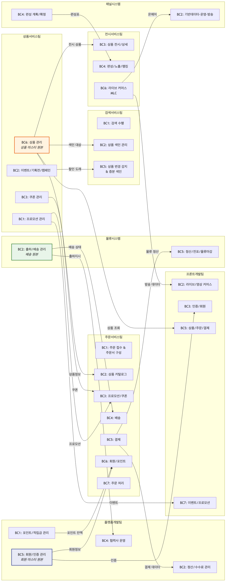
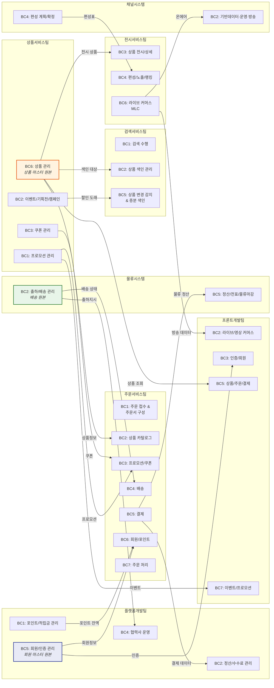

# 이벤트스토밍 부서별 바운디드 컨텍스트(BC) 후보 종합 정리

> **작성일**: 2026-03-27
> **기준**: 각 부서 최종 워크샵 검토 및 BC drawio 파일 기준
> **목적**: 전사 MSA 전환을 위한 부서별 BC 후보 현황 일괄 조망

---

## 1. 전체 현황 요약

| # | 부서 | 최종 차수 | BC 후보 수 | 확정 상태 | 비고 |
|---|------|----------|-----------|----------|------|
| 1 | 검색서비스개발팀 | 3차 | **5개** | 후보 도출 | 4차에서 경계 확정 예정 |
| 2 | 상품서비스개발팀 | 3차 | **6개** | 후보 도출 | 4차에서 통합/분리 검증 |
| 3 | 주문서비스개발팀 | 3차 | **7개** | 후보 도출 | 4차에서 경계 확정 예정 |
| 4 | 플랫폼개발팀 | 3차 | **6개** | 후보 도출 | 4차에서 프리뷰 검증 |
| 5 | 전시서비스개발팀 | 2차 | **7개** | 후보 도출 | 3차에서 검증 예정 |
| 6 | 프론트개발팀 | 2차 | **7개** | 후보 도출 | 3차에서 프리뷰 검증 |
| 7 | 물류시스템 | 1차 | **6개** | 후보 도출 | 2차에서 검증 예정 |
| 8 | 채널시스템(온스타일) | 2차 | **4개** (잠정) | 부분 구조화 | 3차에서 7개 서비스별 재배치 |
| | **합계** | | **48개** | | |

---

## 2. 부서별 BC 후보 상세

---

### 2.1 검색서비스개발팀 (3차, 5개 BC)

검색 도메인은 **읽기 중심(CQRS 패턴)**이므로, 명령 측(색인)과 조회 측(검색)의 경계가 자연스러운 BC 분리 지점.

| BC | 이름 | 포함 기능 |
|----|------|----------|
| BC 1 | **검색 수행** | 검색 진입 · 자동완성 · 검색 수행 · 결과 노출 · 로깅 · 재검색/교정 |
| BC 2 | **상품 색인 관리** | 전체 수집/색인 · 상품 유효성 검증 · 검색 데이터 저장 |
| BC 3 | **검색 품질 & 키워드 관리** | 로그 수집/검증 · 자동완성/연관/인기 검색어 생성 · DW/오로라 |
| BC 4 | **추천/광고 서빙** | 추천상품 요청/노출 · 광고상품 요청/노출 |
| BC 5 | **상품 변경 감지 & 증분 색인** | 전시 목록 · 상품정보 변경 · 쿠폰/할인 시간 도래 · 증분 수집/색인 · 사전/부스팅 |

**주요 외부 의존**: 상품서비스(상품 원본), 전시서비스(전시 목록), 광고 시스템

---

### 2.2 상품서비스개발팀 (3차, 6개 BC)

| BC | 이름 | 포함 기능 |
|----|------|----------|
| BC 1 | **프로모션 관리** | 상품 프로모션 · 카드 프로모션 |
| BC 2 | **이벤트/기획전/캠페인** | 오퍼 · 기획전 · 응모 · 당첨 · 캠페인 프로모션 |
| BC 3 | **쿠폰 관리** | 쿠폰 생성 · 다운로드 · 적용 · 재발행 |
| BC 4 | **브랜드 관리** | 기준정보 · 브랜드 · 대표브랜드 · 세그먼트 |
| BC 5 | **상품 콘텐츠** | Q&A · 리뷰 · 포인트 · 리뷰 복사 |
| BC 6 | **상품 관리** | 상품 등록/승인 · 묶음상품 · 배송비 · 가격 · 제휴사 연동 |

**검증 포인트**: BC 5(상품 콘텐츠)를 BC 6(상품 관리)에 통합할지 여부

---

### 2.3 주문서비스개발팀 (3차, 7개 BC)

| BC | 이름 | 포함 기능 |
|----|------|----------|
| BC 1 | **주문 접수 & 주문서 구성** | 주문 진입 · 주문서 생성 · 임시 주문정보 · 총 결제금액 · 쿠폰적용 · 프로모션 · 배송혜택 · 본인인증 |
| BC 2 | **상품 카탈로그** | 상품 서비스 · 상품정보 조회 · 공급계획 · 배송정보 · 가격 계산 · 상품유형 |
| BC 3 | **프로모션 / 쿠폰** | 상품 프로모션 · 쿠폰 조회 · 사은품 · 멤버쉽 한도 · 임직원 할인 |
| BC 4 | **배송** | 배송지 조회 · 배송 가능여부 · 우편번호 체크 |
| BC 5 | **결제** | 결제 서비스 · 결제수단 조회/관리 · 카드 즉시할인 |
| BC 6 | **회원 / 포인트** | 고객정보 · 외부/내부 포인트 |
| BC 7 | **주문 처리 (인증·검증·확정·후처리)** | 주문 인증 · 주문 검증 · 주문 확정 · 후처리 |

**특이사항**: BC 7은 4개 하위 영역(④인증, ⑤검증, ⑥확정, ⑦후처리)으로 세분화 가능

---

### 2.4 플랫폼개발팀 (3차, 6개 BC)

| BC | 이름 | 포함 기능 |
|----|------|----------|
| BC 1 | **포인트/적립금 관리** | CJ ONE 포인트 · 적립금 · 방송상품 지원금 · 포인트 정책 |
| BC 2 | **정산/수수료 관리** | 주문데이터 인입 · 일마감 집계 · 수수료 계산 · 매출 확정 · SAP 전송 · 광고비 정산 |
| BC 3 | **협력사 온보딩** | 입점신청 · 사업자검증 · 입점승인 · 협력사 정보 등록 · 전자계약 서명/발송 |
| BC 4 | **협력사 운영** | 주문/배송 조회 · 출하지시 · 정산 조회 · 수기매출 · 정보관리 · 담당자 관리 |
| BC 5 | **회원/인증 관리** | 가입 · 로그인 · 본인인증(KCB) · 소셜인증 · 정보수정 · 배송지 · 탈퇴 |
| BC 6 | **고객서비스/멤버십** | 1:1 문의/답변 · 공지사항 · FAQ · 이용약관 · 멤버십 등급 · 포인트 관리 |

**주요 외부 시스템**: SAP, PG사, CJ ONE, KCB, 소셜인증(Naver/Kakao/Apple), 이베이/11번가/쿠팡 등 18개

---

### 2.5 전시서비스개발팀 (2차, 7개 BC)

| BC | 이름 | 포함 기능 |
|----|------|----------|
| BC 1 | **홈/전시 화면 관리** | 템플릿 · 모듈 생성 · 홈탭 · 알림 신청 · 방송알림 |
| BC 2 | **고객 참여** | 브랜드관 · 마이존 · 찜 · 쇼핑찜 · 퍼블릭IP 채널 |
| BC 3 | **상품 전시/상세** | 상품 상세 · PV 수집 · 상품 찜 · 상품평 · KBF · 추천 숏츠 · TV방송 조회 |
| BC 4 | **편성/노출/랭킹 관리** | 편성표 · 상품 상태 정책 · 재고필터링 · 랭킹 · 가격 로드 · 광고 · GNB · 배너 · 추천상품 · 커뮤니티 · 혜택 |
| BC 5 | **콘텐츠/모듈 관리** | VAS 영상 · EC 편성 · 배너 제작 · 전시 테마 · 협력사 승인 · 모듈 12유형 등록 · 편성 세팅/확정 · 영상 인코딩 · 퍼플닷 |
| BC 6 | **라이브 커머스 (MLC)** | 방송 예약 · 시작 · 채팅 · 스트리밍 · AI 답변 · 이벤트 참여 · 종료 · VOD · 클립 · 숏츠 · 하이라이트 |
| BC 7 | **기획전** | 기획전 시작 · 기획전 공유 |

**검증 포인트**: BC 7(기획전)은 기능이 적어 BC 1(홈/전시) 또는 BC 4(편성/노출)에 통합 가능

---

### 2.6 프론트개발팀 (2차, 7개 BC)

| BC | 이름 | 포함 기능 |
|----|------|----------|
| BC 1 | **기획전/검색** | 기획전 상품 · 브랜드 검색 · 검색어 입력 · 정렬 |
| BC 2 | **라이브/영상 커머스** | 라이브 방송 · MLC 채팅/공유/혜택 · 영상 시청 · 위치정보 |
| BC 3 | **인증/회원** | 로그인 · 로그아웃 · 지문인증 · GA · 임프레션 |
| BC 4 | **홈/전시 관리** | 앱 실행 · 홈 메뉴 · 모듈 · 배너 · 광고 · A/B테스트 · 팝업 |
| BC 5 | **상품/주문/결제** | 상품 조회 · 찜 · 쿠폰 · 장바구니 · 구매 · 주문 · 선물하기 |
| BC 6 | **CS/리뷰/알림** | 알림 신청 · 방송 시청 · CJ ONE · 멤버십 · 교환/반품 · 리뷰 |
| BC 7 | **이벤트/프로모션** | 이벤트 응모 · 프로모션 신청 · 특집 |

**특이사항**: 프론트팀 BC는 BFF(Backend For Frontend) 관점으로 도출 — 백엔드 팀 BC와 1:1 매핑이 아닌 화면 단위 그룹핑

---

### 2.7 물류시스템 (1차, 6개 BC)

| BC | 이름 | 포함 애그리게이트 | 핵심 이벤트 |
|----|------|-----------------|------------|
| BC 1 | **매입/구매 관리** | 매입 | 기초하기 · 매입등록 · 매입마감 · 가출고 |
| BC 2 | **출하/배송 관리** | 출하지시, 운송장, 배송 | 출하지시 생성~배송완료 전 과정 |
| BC 3 | **회수/반품 관리** | 회수 | 회수요청 · 등록 · 지시 · 집하 · 확정 (+취소) |
| BC 4 | **택배사/배송비 관리** | 택배사, 택배비/배송비 | 택배사 등록 · 단가 · 배송비 정산 |
| BC 5 | **정산/전표/물류마감** | 전표/정산 | 원가 마감 · 전표 생성 · SAP I/F |
| BC 6 | **재고/WMS 관리** | 재고 | 재고 확정 · 이동 · WMS 연동 |

**주요 외부 시스템**: SAP, WMS, 택배사 API

---

### 2.8 채널시스템 — 온스타일 (2차, 4개 BC 잠정 + 3차 목표 7개)

#### 2차 기준 잠정 BC (4개)

| BC | 이름 | 포함 영역 |
|----|------|----------|
| BC 1 | **실적·비용·제작비** | PGM·매체 영역 — 실적분석 · 제작비 · 인건비 · 변동비 · 시간가치 |
| BC 2 | **기반데이터·운영·방송** | PDSS·온에어·기획 영역 — 기준정보 · 외부업체 · API연동 · 심의 · 라이브 |
| BC 3 | **집계·모니터링** | 판매데이터 · 편성확정 · 인증 |
| BC 4 | **편성 계획/확정** | 편성 서비스 — 편성등록 · 편성정책 · 편성확정 · 주간편성 · 스케줄 · 방송스케줄 |

#### 3차 워크샵 목표 BC (7개 서비스별 재배치)

| # | 서비스 | 목표 BC |
|---|--------|--------|
| 1 | PDSS | 마스터데이터 |
| 2 | 편성 | 편성 계획 |
| 3 | 기획 | 방송 기획 |
| 4 | 온에어 | 실시간 운영 |
| 5 | 타사모니터 | 경쟁사 분석 |
| 6 | 매체 | 매체 정산 ⚠️ Fade out 검토 |
| 7 | PGM | 방송 실적/정산 ⚠️ Fade out 검토 |

**특이사항**: 좌측 영역(BC 1~3)은 1차 이벤트가 서비스별 분류 없이 나열된 상태. 3차에서 7개 서비스별 재배치 필요.

---

## 3. 크로스 부서 BC 관계 (잠정)

부서 간 BC가 유사 도메인을 공유하는 영역이 있으며, MSA 전환 시 **컨텍스트 매핑** 설계가 필요합니다.

### 3.1 부서 간 중복/연관 도메인 매핑

```
┌─────────────────────────────────────────────────────────────────────────────────┐
│                         크로스 부서 도메인 관계도                                   │
├─────────────────────────────────────────────────────────────────────────────────┤
│                                                                                 │
│  [상품]                                                                         │
│   상품서비스팀 BC 6 ──────→ 주문서비스팀 BC 2 (상품 카탈로그)                        │
│   (상품 관리, 원본)          검색서비스팀 BC 2 (상품 색인)                            │
│                              전시서비스팀 BC 3 (상품 전시/상세)                       │
│                              프론트개발팀 BC 5 (상품/주문/결제)                       │
│                                                                                 │
│  [프로모션/쿠폰]                                                                 │
│   상품서비스팀 BC 1,2,3 ───→ 주문서비스팀 BC 3 (프로모션/쿠폰)                       │
│   (프로모션/이벤트/쿠폰)      검색서비스팀 BC 5 (쿠폰/할인 시간 도래)                  │
│                              프론트개발팀 BC 7 (이벤트/프로모션)                      │
│                                                                                 │
│  [회원/인증]                                                                     │
│   플랫폼개발팀 BC 5 ────────→ 주문서비스팀 BC 6 (회원/포인트)                        │
│   (회원/인증 관리, 원본)       프론트개발팀 BC 3 (인증/회원)                          │
│                                                                                 │
│  [결제/정산]                                                                     │
│   주문서비스팀 BC 5 ────────→ 플랫폼개발팀 BC 2 (정산/수수료)                        │
│   (결제)                      물류시스템 BC 5 (정산/전표/물류마감)                     │
│                                                                                 │
│  [배송/물류]                                                                     │
│   물류시스템 BC 2 ──────────→ 주문서비스팀 BC 4 (배송)                               │
│   (출하/배송 관리, 원본)       플랫폼개발팀 BC 4 (협력사 운영 — 출하지시)               │
│                                                                                 │
│  [편성/전시]                                                                     │
│   채널시스템 BC 4 ──────────→ 전시서비스팀 BC 4 (편성/노출/랭킹)                     │
│   (편성 계획/확정)                                                                │
│                                                                                 │
│  [라이브 커머스]                                                                  │
│   전시서비스팀 BC 6 ────────→ 프론트개발팀 BC 2 (라이브/영상 커머스)                   │
│   (라이브 커머스 MLC, 원본)    채널시스템 BC 2 (온에어)                               │
│                                                                                 │
└─────────────────────────────────────────────────────────────────────────────────┘
```

<details>
<summary>📊 크로스 부서 도메인 관계도 (클릭하여 펼치기)</summary>



<details>
<summary>원본 Mermaid 코드 보기</summary>



</details>

</details>

### 3.2 데이터 소유권(Source of Truth) 정리

| 도메인 데이터 | 원본 소유 부서 (Upstream) | 소비 부서 (Downstream) |
|-------------|------------------------|---------------------|
| 상품 마스터 | 상품서비스팀 | 검색, 주문, 전시, 프론트, 물류 |
| 회원/인증 | 플랫폼개발팀 | 주문, 프론트, 전시 |
| 프로모션/쿠폰 | 상품서비스팀 | 주문, 검색, 프론트 |
| 결제 | 주문서비스팀 | 플랫폼(정산) |
| 배송/물류 | 물류시스템 | 주문, 플랫폼(협력사) |
| 편성/스케줄 | 채널시스템 | 전시, 프론트 |
| 포인트/적립금 | 플랫폼개발팀 | 주문, 프론트 |
| 검색 색인 | 검색서비스팀 | 전시, 프론트 |
| 리뷰/Q&A | 상품서비스팀 | 전시, 프론트 |

---

## 4. 워크샵 진행 현황 및 다음 단계

### 4.1 부서별 워크샵 진행 상태

```
부서              1차    2차    3차    4차(예정)
─────────────────────────────────────────────
검색서비스팀       ✅     ✅     ✅     BC 경계 확정
상품서비스팀       ✅     ✅     ✅     BC 통합/분리 검증
주문서비스팀       ✅     ✅     ✅     BC 경계 확정
플랫폼개발팀       ✅     ✅     ✅     BC 프리뷰 검증
전시서비스팀       ✅     ✅     -      BC 검증
프론트개발팀       ✅     ✅     -      BC 프리뷰 검증
물류시스템         ✅     -      -      BC 검증
채널시스템         ✅     ✅     -      7개 서비스별 재배치
```

### 4.2 다음 워크샵 공통 목표

모든 부서의 차기 워크샵에서 공통적으로 수행해야 할 항목:

1. **애그리게이트 확정** — 후보를 검증하고 최종 확정
2. **BC 경계선 확정** — 후보 BC의 통합/분리 결정
3. **컨텍스트 맵 작성** — BC 간 관계 패턴(ACL, 공유 커널, OHS 등) 정의
4. **MSA 전환 우선순위** — 어떤 BC부터 마이크로서비스로 분리할지 우선순위 결정

### 4.3 전사 통합 워크샵 권장 사항

부서별 BC가 확정된 후, **크로스 부서 컨텍스트 매핑 워크샵**을 통해:

- 부서 간 중복 도메인의 데이터 소유권 확정
- Upstream/Downstream 관계 패턴 결정 (Open Host Service, Anti-Corruption Layer 등)
- 공유 커널(Shared Kernel) 영역 식별 (회원, 상품 마스터 등)
- 이벤트 기반 통신 vs 동기 API 호출 결정

---

## 부록: BC drawio 파일 목록

| # | 파일명 | 부서 |
|---|--------|------|
| 1 | `검색서비스개발팀_이벤트스토밍_3차_BC.drawio.xml` | 검색서비스팀 |
| 2 | `상품서비스개발팀_3_BC.drawio.xml` | 상품서비스팀 |
| 3 | `주문서비스개발팀_3회차_BC.drawio.xml` | 주문서비스팀 |
| 4 | `플랫폼개발팀_이벤트스토밍_3차_BC.drawio.xml` | 플랫폼개발팀 |
| 5 | `전시서비스개발팀_이벤트스토밍_2차_BC.drawio.xml` | 전시서비스팀 |
| 6 | `프론트개발팀_이벤트스토밍_2차_BC.drawio.xml` | 프론트개발팀 |
| 7 | `물류시스템_이벤트스토밍_1차_BC.drawio.xml` | 물류시스템 |
| 8 | `온스타일_채널_2차_BC.drawio.xml` | 채널시스템 |
