# 상품서비스개발팀 이벤트 스토밍 3차 워크샵 검토 및 보완 사항

## 1. 개요

### 1.1 이 문서의 목적

```
┌─────────────────────────────────────────────────────────────┐
│              이 문서의 3가지 목적                              │
├─────────────────────────────────────────────────────────────┤
│                                                             │
│  ✅ 3차 워크샵 수행 결과를 준비 문서 대비 분석              │
│  ✅ draw.io 결과물의 색상 오분류 정리 및 교정안 도출        │
│  ✅ 4차 워크샵 방향 및 타임라인 설정                        │
│                                                             │
└─────────────────────────────────────────────────────────────┘
```

### 1.2 워크샵 기본 정보

| 항목 | 내용 |
|------|------|
| 일시 | 2026년 3월 (3차 워크샵) |
| 참석자 | 상품서비스개발팀 |
| 수행 범위 | 7개 영역 — 프로모션(상품/카드), 쿠폰, 이벤트/기획전, 캠페인 프로모션, 상품 등록/승인, 브랜드, 상품 콘텐츠(Q&A/리뷰) |
| 산출물 | draw.io 보드 (포스트잇 ~132개) |
| 수행 방식 특이점 | 준비 문서의 Phase 구조(이벤트 정제→애그리게이트→정책 구조화→읽기모델→BC 프리뷰)를 따르지 않고, **7개 영역 전체를 커맨드 중심으로 대폭 확장**하는 방식으로 진행. 커맨드 33→47개로 증가했으나 정제·구조화는 미수행 |

### 1.3 참조 문서

| 참조 문서 | 활용 시점 |
|----------|----------|
| [이벤트스토밍_상품서비스팀_3차워크샵준비.md](./이벤트스토밍_상품서비스팀_3차워크샵준비.md) | 목표 수치, Phase 구조 — 달성도 비교 기준 |
| [이벤트스토밍_시각화_가이드.md](./이벤트스토밍_시각화_가이드.md) | 포스트잇 색상·배치 패턴 |
| [이벤트스토밍_퀵레퍼런스.md](./이벤트스토밍_퀵레퍼런스.md) | 용어집, 흔한 실수, 빠른 참조 |

---

## 2. 수행 결과 요약

### 2.1 실제 수행 범위 및 방식

3차 워크샵에서 실제로 수행된 활동:

1. **프로모션 영역 유지** — 상품 프로모션(등록→상신→승인→적용), 카드 프로모션(등록→적용) 흐름 유지
2. **캠페인 프로모션 대폭 확장** — 등록→상신→승인→응모→대상자 추출→추첨→오퍼 지급 전체 상세화
3. **상품 등록/승인 커맨드 대폭 확장** — 상품 복사, 묶음상품 등록/수정, 배송비 등록, 상품 가격 등록/승인 신규 도출
4. **외부 연동 영역 신규 추가** — 제휴사/대형제휴사 상품 전송, 공급계획(물류), QC(품질), 품절 처리
5. **상품 콘텐츠 영역 유지** — Q&A 등록/삭제/이관, 리뷰 작성/삭제/신고/포인트 지급/복사

**수행 방식 특이점:**
- 준비 문서의 5개 Phase(이벤트 정제 → 애그리게이트 → 정책 구조화 → 읽기모델 → BC 프리뷰) 구조를 따르지 않음
- 1~2차에서 도출된 이벤트 ~47개를 정제하는 대신, **7개 영역 전체를 커맨드 중심으로 확장**
- 커맨드가 33→47개로 대폭 증가 (상품 등록/승인, 캠페인 프로모션 영역)
- 이벤트는 ~47→~49개로 소폭 증가 (중복/복합 포스트잇 미교정 상태 포함)
- 준비 문서에서 지적한 **쿠폰 중복 6건, 오분류 5건이 그대로 미교정**

### 2.2 draw.io 분석 결과 (7개 영역별 요소)

**① 프로모션 관리 (상품 프로모션 + 카드 프로모션):**

| 유형 | 수량 | 주요 항목 |
|------|------|----------|
| 이벤트 🟧 | ~12개 | 상품 프로모션 등록/상신/승인됨, 가격 할인 적용, 카드할인 프로모션 등록됨, 카드번호를 받고 주문을 완료했다, 체험단 신청 |
| 커맨드 🟦 | ~8개 | 상품프로모션 등록/상신, 프로모션 승인/적용, 카드 프로모션 등록/적용, 이벤트 응모 |
| 정책 💜 | ~4개 | 상품 프로모션 정책, 상품 프로모션 적용 정책, 카드 프로모션 정책, 카드 프로모션 적용 정책 |
| 액터 👤 | 2개 | MD(#FFD700 정상), 마케터(#FFD700 정상) |
| 읽기 모델 📖 | 1개 | 참여한 이벤트 화면 조회(🟩 표기) |

**② 쿠폰 관리:**

| 유형 | 수량 | 주요 항목 |
|------|------|----------|
| 이벤트 🟧 | ~4개 | 쿠폰 생성(3가지 표현 합침), 쿠폰 다운로드(3가지 표현 합침), 쿠폰 적용, 쿠폰 재발행 **(중복 6건 미교정)** |
| 커맨드 🟦 | ~1개 | 쿠폰 등록 |
| 정책 💜 | ~2개 | 할인 쿠폰 정책, 재발행 정책 |
| 외부 시스템 🟩 | 2개 | 주문이 취소됐다(주문), 쿠폰 조회 화면 |
| 액터 👤 | 1개 | MD, 마케터(#FFD700 정상) |

**③ 이벤트/기획전:**

| 유형 | 수량 | 주요 항목 |
|------|------|----------|
| 이벤트 🟧 | ~5개 | 오퍼 등록됨, 이벤트 기획전 등록됨⚠️(금색 오분류), 응모오퍼 등록됨, 이벤트에 당첨되었다, 이벤트 응모 완료됨 |
| 커맨드 🟦 | ~3개 | 오퍼 등록, 이벤트 기획전 등록, 이벤트 응모 |
| 정책 💜 | ~3개 | 오퍼 등록 정책, 이벤트 기획전 등록 정책, 이벤트 당첨 정책 |
| 읽기 모델 📖 | 1개 | 당첨자 조회 화면(🟩 표기) |

**④ 캠페인 프로모션 (3차 대폭 확장):**

| 유형 | 수량 | 주요 항목 |
|------|------|----------|
| 이벤트 🟧 | ~9개 | 캠페인 등록/상신/승인됨, 응모 완료, 대상자 추출 완료, 오퍼 추첨 완료+지급대상 등록(복합), 지급 요청 승인, 오퍼 지급 완료+지급 완료(복합) **(복합 포스트잇 2건)** |
| 커맨드 🟦 | ~5개 | 캠페인 등록/상신/승인, 추첨, 오퍼 지급 상신 |
| 정책 💜 | ~1개 | 캠페인 프로모션 정책 |
| 액터 👤 | 1개 | MD, 마케터(#FFD700 정상) |

**⑤ 상품 등록/승인 (3차 커맨드 대폭 확장):**

| 유형 | 수량 | 주요 항목 |
|------|------|----------|
| 이벤트 🟧 | ~10개 | 상품 등록/수정됨, 합의/승인/상신/반려됨, 전시됨, 품절됨, QC 승인 요청, 제휴사 등록됨, 묶음상품 등록/수정됨, 배송비 등록됨, 상품 가격 등록/승인됨 |
| 커맨드 🟦 | ~12개 | 상품 등록/복사/수정, 합의/승인/상신/반려, 제휴사 상품정보 전송, 대형제휴사 연동, 묶음상품 등록/수정, 배송비 등록, 상품 가격 등록/승인 |
| 정책 💜 | ~4개 | 상품등록 정책(온트러스트/파트너시스템/API), 전시상품정책, EP정책, 대형제휴 정책 |
| 외부 시스템 🟩 | ~5개 | 공급계획(물류), 품질인증 QC(품질), 주문/재고 차감(주문/물류), 제휴사, 대형제휴사 |
| 핫스팟 🩷 | ~2개 | 배송서비스 상품 관리(내일도착/오늘출발 등), 공급계획 직접등록(DB) |
| 액터 ⚠️오분류 | ~4개 | 임직원, 파트너, 파트너 API, 시스템 봇(배치) — 모두 **🟧 오렌지로 잘못 표기** |

**⑥ 브랜드 관리:**

| 유형 | 수량 | 주요 항목 |
|------|------|----------|
| 이벤트 🟧 | ~9개 | 기준정보 등록/수정됨, 임시 브랜드 등록됨, 브랜드 등록, 대표 브랜드 생성/등록, 세그먼트 생성/권한등록/상품등록 |
| 커맨드 🟦 | ~8개 | 기준정보 등록/수정, 브랜드 생성 요청/승인, 대표 브랜드 등록/매핑, 세그먼트 생성/권한생성/상품적용 |
| 액터 ⚠️오분류 | ~1개 | 임직원 옷 — **🟧 오렌지로 잘못 표기** |

**⑦ 상품 콘텐츠 (Q&A, 리뷰):**

| 유형 | 수량 | 주요 항목 |
|------|------|----------|
| 이벤트 🟧 | ~8개 | Q&A 작성/삭제, QNA 전송됨, 리뷰 작성/삭제/신고비활성, 리뷰 복사함, 리뷰 포인트 전송됨 |
| 커맨드 🟦 | ~10개 | Q&A 등록/삭제, QnA 전송, 리뷰 작성/삭제/신고, 리뷰 포인트 지급/전송, 리뷰 복사 |
| 정책 💜 | ~1개 | 상품 Q&A 고객센터 이관 정책 |
| 외부 시스템 🟩 | ~2개 | 회원 시스템(x2) |
| 액터 ⚠️오분류 | ~5개 | 사용자 옷(x2), 시스템 봇(배치), 임직원 옷 — 모두 **🟧 오렌지로 잘못 표기** |
| 오분류 항목 | ~1개 | "리뷰 포인트 지급 대상 조회하기" — 🟧 이벤트로 표기되었으나 실제로는 📖 읽기모델 또는 🟦 커맨드 |

### 2.3 현황 요약 다이어그램

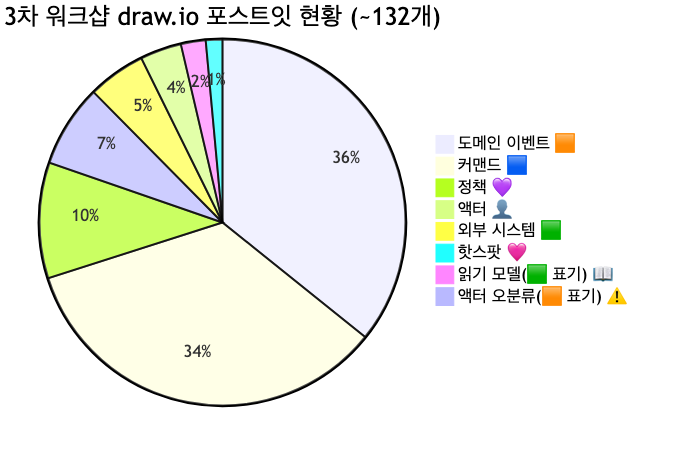

<details>
<summary>📊 원본 Mermaid 코드 보기</summary>

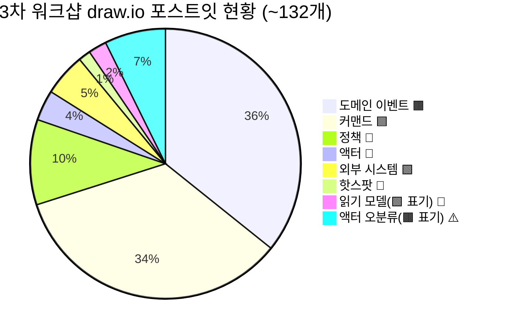

</details>

**주요 문제점:**
- **이벤트 ~49개 중 쿠폰 중복 6건** — 준비 문서에서 지적한 "쿠폰 생성 3가지 표현", "쿠폰 다운로드 3가지 표현"이 하나의 포스트잇에 합쳐져 있으나 미교정
- **복합 포스트잇 2건** — 캠페인 프로모션에서 2개 이벤트가 하나의 포스트잇에 작성됨
- **액터 ~10건이 🟧 오렌지(이벤트 색상)로 잘못 표기** — "임직원 옷", "사용자 옷", "파트너", "파트너 API", "고객", "시스템 봇(배치)" 등
- **금색(#FFD700) 이벤트 오분류 1건** — "이벤트 기획전 등록됨"이 액터 색상으로 표기
- **시제 불일치 지속** — "상품의 브랜드를 등록했다"(과거형 혼재), "리뷰 포인트 지급 대상 조회하기"(명령형)
- **애그리게이트·읽기모델·BC 전혀 미수행** — 이벤트·커맨드 확장에 시간 소요

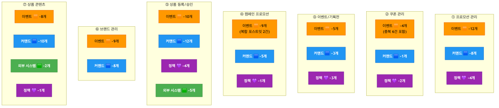

<details>
<summary>📊 원본 Mermaid 코드 보기</summary>

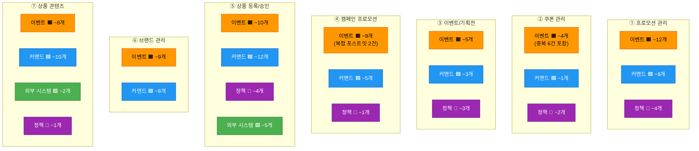

</details>

---

## 3. 준비 문서 대비 달성도

### 3.1 목표 달성 비교표

| 항목 | 3차 준비 문서 목표 | 실제 수행 결과 | 달성 |
|------|-------------------|---------------|------|
| 이벤트 대폭 정제 | ~47개 → ~30개 (중복/오분류 교정) | 정제 대신 커맨드 확장, 중복 6건·오분류 5건 그대로 (~49개) | ⬜ |
| 정책 구조화 | 14개 → ~10개 (When/Then 정의) | ~14개 유지, When/Then 미적용 | ⬜ |
| 애그리게이트 식별 | ~15개 후보 확정 (7개 영역별) | **미수행** | ⬜ |
| 읽기 모델 도출 | ~10개 후보 도출 | 3개 도출 (쿠폰조회, 당첨자조회, 참여이벤트조회 — 🟩로 표기) | ⬜ 부분 |
| BC 프리뷰 | ~6개 BC 후보 검증 | **미수행** | ⬜ |
| 핫스팟 식별/전환 | 식별 + 정책 전환 | 2개 핑크 도출 (배송서비스, 공급계획 DB), 정책 전환 미수행 | ⬜ 부분 |

**분석:** 3차 워크샵은 준비 문서의 Phase 구조를 따르지 않고, **7개 영역 전체를 커맨드 중심으로 확장**하는 방식으로 진행되었습니다. 커맨드가 33→47개로 대폭 증가한 것은 큰 성과이며, 특히 상품 등록/승인 영역(묶음상품, 배송비, 가격 관리)과 캠페인 프로모션 영역(응모→추첨→오퍼 지급)이 상세화되었습니다. 그러나 준비 문서에서 사전 지적한 **쿠폰 중복 6건, 오분류 5건이 그대로 남아있고**, 정제·구조화·상위 레벨 식별(애그리게이트·읽기모델·BC)은 전혀 수행되지 않았습니다.

### 3.2 Phase별 수행 현황

| Phase | 준비 문서 계획 | 계획 소요 | 실제 수행 | 비고 |
|-------|--------------|----------|----------|------|
| 오프닝 | 1~2차 리뷰 & 3차 목표 안내 | 15분 | ✅ 수행 | |
| Phase 1 | 이벤트 대폭 정제 (~47개 → ~30개) | 30분 | ⬜ 미수행 | 정제 대신 커맨드 확장 |
| Phase 2 | 애그리게이트 식별 (~15개) | 35분 | ⬜ 미수행 | |
| Phase 3 | 정책 구조화 (When/Then) | 25분 | ⬜ 미수행 | 정책 14개 이름만 유지 |
| Phase 4 | 읽기 모델 도출 (~10개) | 25분 | ⬜ 부분 수행 | 3개 화면 도출 (🟩 표기) |
| 마무리 | 전체 통합 & BC 프리뷰 | 20분 | ⬜ 미수행 | |

### 3.3 7개 흐름 영역 커버리지

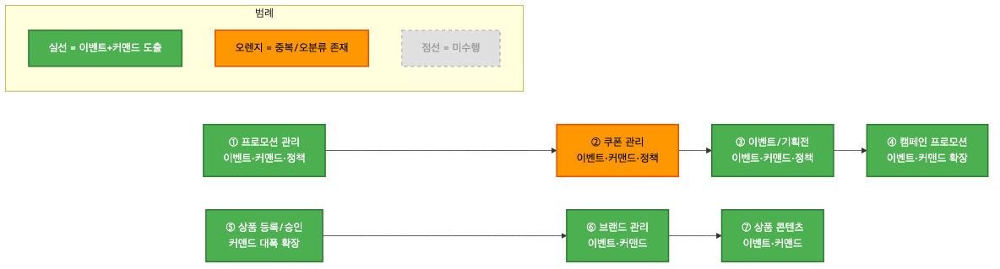

<details>
<summary>📊 원본 Mermaid 코드 보기</summary>

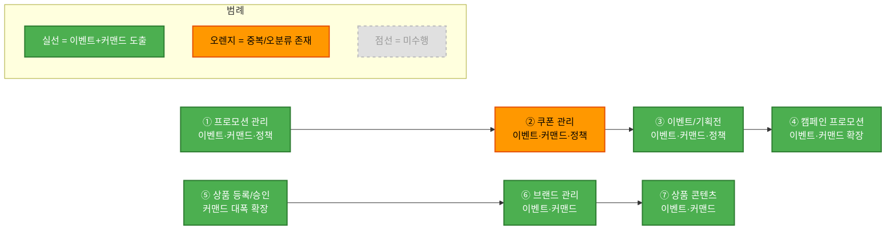

</details>

| 영역 | 상태 | 도출 요소 |
|------|------|----------|
| ① 프로모션 관리 | ✅ 수행 | 상품프로모션(등록→상신→승인→적용), 카드프로모션(등록→적용), 정책 4개 |
| ② 쿠폰 관리 | 🟧 부분 | 쿠폰 생성→다운로드→적용→재발행. **중복 6건 미교정** |
| ③ 이벤트/기획전 | ✅ 수행 | 오퍼 등록, 기획전 등록, 응모→당첨, 정책 3개 |
| ④ 캠페인 프로모션 | ✅ 수행 (확장) | 등록→상신→승인→응모→대상자 추출→추첨→오퍼 지급 상세화 |
| ⑤ 상품 등록/승인 | ✅ 수행 (대폭 확장) | 등록→합의→상신→승인/반려→전시, 묶음상품, 배송비, 가격, 제휴사 전송 |
| ⑥ 브랜드 관리 | ✅ 수행 | 브랜드 생성→승인, 대표브랜드, 세그먼트 생성→권한→상품 적용 |
| ⑦ 상품 콘텐츠 | ✅ 수행 | Q&A 등록/삭제/이관, 리뷰 작성/삭제/신고/포인트 지급/복사 |

---

## 4. draw.io 색상 오분류 정리

### 4.1 오분류 현황 요약

오분류는 크게 5가지 유형으로 분류됩니다:

1. **오렌지(🟧 #FF8C00) → 액터(👤):** ~10건 — "임직원 옷", "사용자 옷", "시스템 봇(배치)", "파트너", "파트너 API", "고객", "임직원" 등이 이벤트 색상(🟧)으로 표기됨
2. **금색(👤 #FFD700) → 이벤트(🟧):** 1건 — "이벤트 기획전 등록됨"이 액터 색상으로 잘못 표기
3. **중복 이벤트 미교정:** 6건 — 쿠폰 영역에서 동일 이벤트가 3가지 표현으로 하나의 포스트잇에 합쳐져 있음 (준비 문서 §2.3.1에서 이미 지적)
4. **복합 포스트잇:** 2건 — 캠페인 프로모션에서 2개 이벤트가 하나의 포스트잇에 작성됨
5. **시제 불일치 및 명명 오류:** ~5건 — 과거형/현재형 혼재, 조회 동작이 이벤트로 분류

### 4.2 오분류 상세 및 교정안

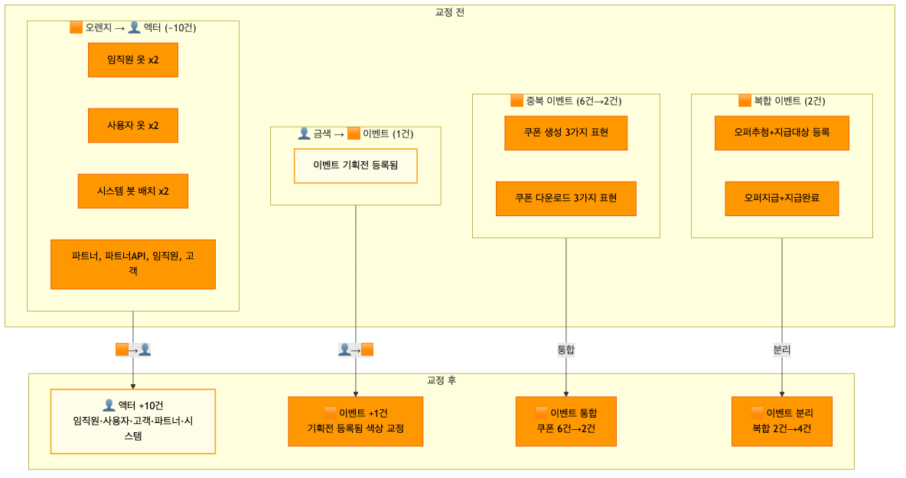

<details>
<summary>📊 원본 Mermaid 코드 보기</summary>

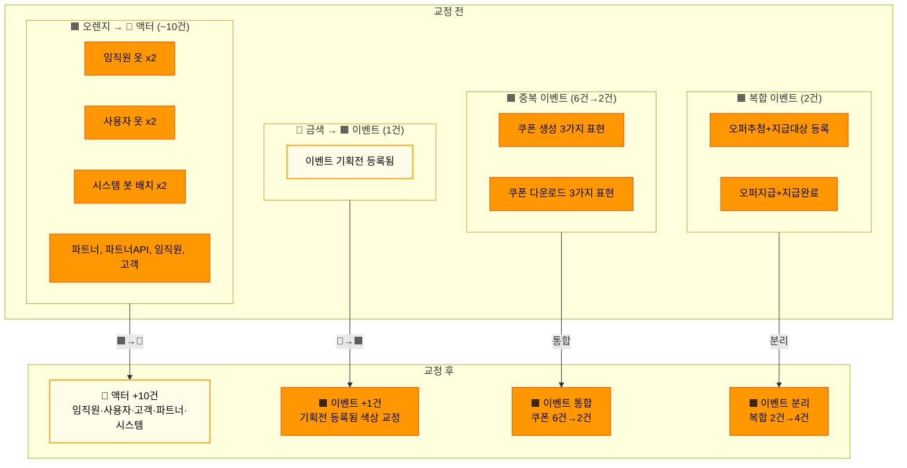

</details>

**유형 1: 오렌지(🟧) → 액터(👤) — ~10건**

| # | 요소명 | 현재 분류 | 교정 분류 | 영역 | 사유 |
|---|--------|----------|----------|------|------|
| 1 | 임직원 옷 | 🟧 이벤트(#FF8C00) | 👤 액터(#FFD700) | ⑥ 브랜드 | "옷"은 역할 표시, 이벤트 아님 |
| 2 | 임직원 옷 | 🟧 이벤트(#FF8C00) | 👤 액터(#FFD700) | ⑦ 콘텐츠 | 동일 |
| 3 | 사용자 옷 | 🟧 이벤트(#FF8C00) | 👤 액터(#FFD700) | ⑦ 콘텐츠(리뷰) | "옷"은 역할 표시, 이벤트 아님 |
| 4 | 사용자 옷 | 🟧 이벤트(#FF8C00) | 👤 액터(#FFD700) | ⑦ 콘텐츠(Q&A) | 동일 |
| 5 | 시스템 봇 (배치) | 🟧 이벤트(#FF8C00) | 👤 액터(#FFD700) 또는 🟩 | ⑦ 콘텐츠(리뷰) | 배치 시스템은 액터 또는 외부 시스템 |
| 6 | 시스템 봇 (배치) | 🟧 이벤트(#FF8C00) | 👤 액터(#FFD700) 또는 🟩 | ⑤ 상품 등록 | 동일 |
| 7 | 임직원 | 🟧 이벤트(#FF8C00) | 👤 액터(#FFD700) | ⑤ 상품 등록 | 역할(액터)인데 이벤트 색상 |
| 8 | 파트너 | 🟧 이벤트(#FF8C00) | 👤 액터(#FFD700) | ⑤ 상품 등록 | 역할(액터)인데 이벤트 색상 |
| 9 | 파트너 API | 🟧 이벤트(#FF8C00) | 👤 액터(#FFD700) 또는 🟩 | ⑤ 상품 등록 | API 채널이므로 외부 시스템 후보 |
| 10 | 고객 | 🟧 이벤트(#FF8C00) | 👤 액터(#FFD700) | ① 프로모션 | 역할(액터)인데 이벤트 색상 |

**유형 2: 금색(👤) → 이벤트(🟧) — 1건**

| # | 요소명 | 현재 분류 | 교정 분류 | 사유 |
|---|--------|----------|----------|------|
| 1 | 이벤트 기획전 등록됨 | 👤 액터(#FFD700) | 🟧 이벤트(#FF8C00) | "~됨" 과거형 = 이벤트인데 액터 색상 사용 |

**유형 3: 중복 이벤트 — 6건 → 2건 통합**

| # | draw.io 원본 (하나의 포스트잇) | 통합 후 | 사유 |
|---|-------------------------------|--------|------|
| 1 | "쿠폰을 생성했다" + "할인쿠폰 등록됨" + "쿠폰이 생성되었다" | → **"쿠폰이 생성되었다"** | 동일 이벤트 3가지 표현 (준비 문서 §2.3.1) |
| 2 | "쿠폰을 다운받았다" + "쿠폰을 지급하였다" + "상품상세 페이지에서 할인쿠폰을 다운로드 했다" | → **"쿠폰이 다운로드되었다"** | 동일 이벤트 3가지 표현 (준비 문서 §2.3.1) |

**유형 4: 복합 포스트잇 — 2건 → 4건 분리**

| # | draw.io 원본 (하나의 포스트잇) | 분리 후 | 사유 |
|---|-------------------------------|--------|------|
| 1 | "캠페인 프로모션 오퍼 추첨 완료됨 오퍼 지급 대상자 등록됨" | → **"오퍼 추첨이 완료되었다"** + **"오퍼 지급 대상자가 등록되었다"** | 2개 이벤트가 1개 포스트잇에 합쳐짐 |
| 2 | "캠페인 프로모션 오퍼 지급 완료됨 오퍼 지급 완료됨" | → **"캠페인 오퍼가 지급되었다"** + **"오퍼 지급이 완료되었다"** | 동일 (중복 가능성도 검토 필요) |

**유형 5: 시제 불일치 및 명명 오류 — ~5건**

| # | draw.io 원본 | 교정 후 | 사유 |
|---|-------------|--------|------|
| 1 | "상품의 브랜드를 등록했다." | "브랜드가 등록되었다" | 능동형→수동 과거형 |
| 2 | "대표 브랜드 생성함." | "대표 브랜드가 생성되었다" | 약식→정식 과거형 |
| 3 | "브랜드 세그먼트 생성함. 등록함." | "브랜드 세그먼트가 생성되었다" | 약식 + 중복 표현 |
| 4 | "리뷰 포인트 지급 대상 조회하기" | → 📖 **읽기 모델** 또는 🟦 **커맨드** | "조회하기"는 이벤트가 아님 |
| 5 | "카드번호를 받고 주문을 완료했다" | → 🟩 **외부 시스템** (주문팀) 또는 🩷 핫스팟 | 상품팀 이벤트가 아닌 주문 도메인 |

### 4.3 논의 필요 항목

워크샵에서 팀원과 함께 결정해야 할 5건:

| # | 요소명 | 현재 분류 | 교정 후보 | 논의 사항 |
|---|--------|----------|----------|----------|
| 1 | "체험단 페이지에서 체험단을 신청했다" | 🟧 이벤트 | 🟧 유지? 또는 ③ 이벤트/기획전 영역으로 이동? | 프로모션 영역에 있으나 체험단은 이벤트/기획전 영역이 적절할 수 있음 |
| 2 | "카드번호를 받고 주문을 완료했다" | 🟧 이벤트 | 🟩 외부 시스템(주문)? 또는 🩷 핫스팟? | 카드 결제 완료는 상품팀 이벤트인지 주문팀 이벤트인지 |
| 3 | "파트너 API" | 🟧 이벤트(오분류) | 👤 액터? 또는 🟩 외부 시스템? | API 채널이 액터인지 외부 시스템인지 |
| 4 | "시스템 봇 (배치)" x2 | 🟧 이벤트(오분류) | 👤 액터? 또는 🟩 외부 시스템? | 배치 시스템이 액터인지 외부 시스템인지 |
| 5 | 캠페인 복합 포스트잇 2번 | 🟧 이벤트 2개 | 통합하여 1개? 또는 분리하여 2개? | "오퍼 지급 완료됨"이 2가지 표현일 수 있음 |

### 4.4 교정 후 예상 요소 현황

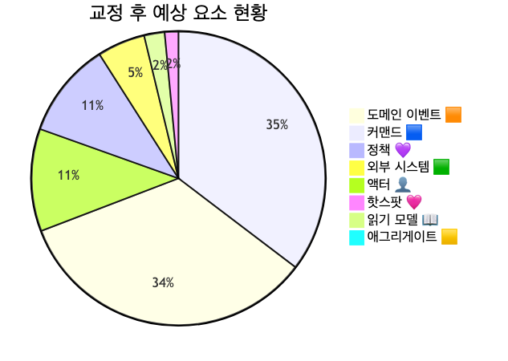

<details>
<summary>📊 원본 Mermaid 코드 보기</summary>

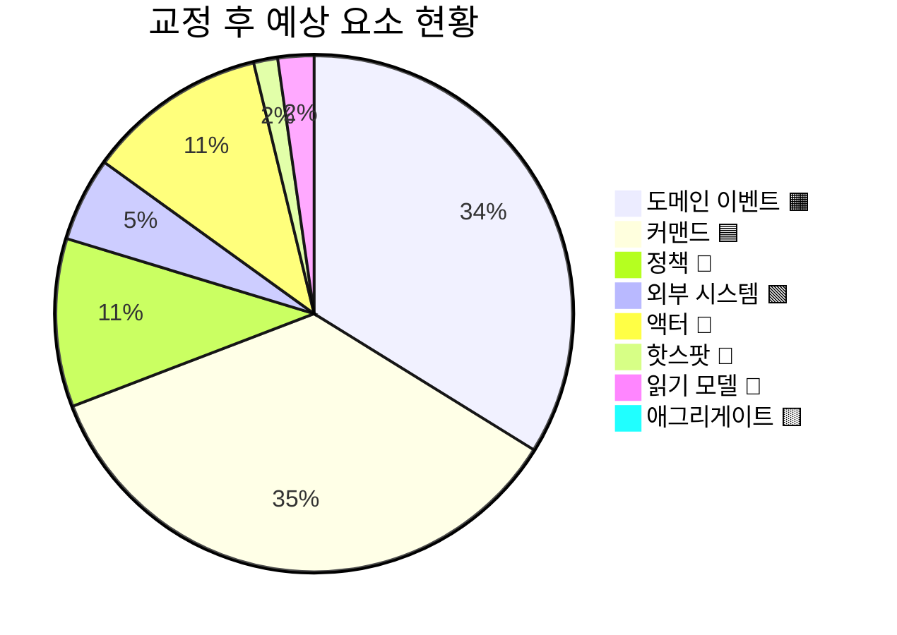

</details>

**교정 전후 수치 비교:**

| 유형 | 교정 전 | 교정 후 | 변동 |
|------|--------|--------|------|
| 이벤트 🟧 | ~49 | ~45 | -4 (중복 통합 -4, 읽기모델 전환 -1, 타도메인 분리 -1, 금색 교정 +1, 복합 분리 +2) |
| 커맨드 🟦 | ~47 | ~47 | 유지 |
| 정책 💜 | ~14 | ~14 | 유지 (When/Then 구조화 필요) |
| 외부 시스템 🟩 | ~7 | ~8 | +1 (타도메인 "카드번호를 받고 주문을 완료했다" 추가) |
| 핫스팟 🩷 | ~2 | ~2 | 유지 |
| 액터 👤 | ~5 | ~15 | +10 (🟧 오분류 전환) |
| 읽기 모델 📖 | ~3 | ~4 | +1 ("리뷰 포인트 지급 대상 조회하기" 전환) |
| 애그리게이트 🟨 | 0 | 0 | 미수행 |

---

## 5. 도메인별 흐름 분석

### 5.1 프로모션/쿠폰/이벤트 흐름

3차에서 4개 하위 영역(상품프로모션, 카드프로모션, 쿠폰, 캠페인 프로모션)의 전체 흐름:

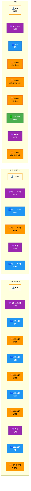

<details>
<summary>📊 원본 Mermaid 코드 보기</summary>

```mermaid
flowchart LR
    subgraph promo["상품 프로모션"]
        U1["👤 MD"]:::actor --> P1["💜 상품 프로모션\n정책"]:::policy
        P1 --> C1["🟦 프로모션\n등록"]:::command
        C1 --> E1["🟧 프로모션\n등록됨"]:::event
        E1 --> C2["🟦 프로모션\n상신"]:::command
        C2 --> E2["🟧 프로모션\n상신됨"]:::event
        E2 --> C3["🟦 프로모션\n승인"]:::command
        C3 --> E3["🟧 프로모션\n승인됨"]:::event
        E3 --> P2["💜 적용\n정책"]:::policy
        P2 --> C4["🟦 프로모션\n적용"]:::command
        C4 --> E4["🟧 가격 할인이\n적용됐다"]:::event
    end

    subgraph card["카드 프로모션"]
        U2["👤 마케터"]:::actor --> P3["💜 카드 프로모션\n정책"]:::policy
        P3 --> C5["🟦 카드 프로모션\n등록"]:::command
        C5 --> E5["🟧 카드 프로모션\n등록됨"]:::event
        E5 --> P4["💜 적용\n정책"]:::policy2
        P4 --> C6["🟦 카드 프로모션\n적용"]:::command
    end

    subgraph coupon["쿠폰"]
        U3["👤 MD\n마케터"]:::actor --> P5["💜 할인 쿠폰\n정책"]:::policy
        P5 --> C7["🟦 쿠폰\n등록"]:::command
        C7 --> E6["🟧 쿠폰이\n생성되었다"]:::event
        E6 --> E7["🟧 쿠폰이\n다운로드되었다"]:::event
        E7 --> E8["🟧 쿠폰이\n적용되었다"]:::event
        E8 --> EX1["🟩 주문 취소\n(주문)"]:::external
        EX1 --> P6["💜 재발행\n정책"]:::policy
        P6 --> E9["🟧 쿠폰이\n재발행되었다"]:::event
    end

    classDef event fill:#FF9800,color:#000,stroke:#E65100
    classDef command fill:#2196F3,color:#fff,stroke:#1565C0
    classDef policy fill:#9C27B0,color:#fff,stroke:#6A1B9A
    classDef policy2 fill:#9C27B0,color:#fff,stroke:#6A1B9A
    classDef external fill:#4CAF50,color:#fff,stroke:#2E7D32
    classDef actor fill:#FFFDE7,color:#000,stroke:#F9A825,stroke-width:2px
```

</details>

**흐름 요약:**
1. **상품 프로모션**: MD → 정책 확인 → 등록 → 상신 → 승인 → 적용 정책 → 가격 할인 적용
2. **카드 프로모션**: 마케터 → 정책 확인 → 등록 → 적용 정책 → 카드 할인 적용
3. **쿠폰**: MD/마케터 → 쿠폰 정책 → 쿠폰 등록 → 다운로드 → 적용 → 주문 취소 시 재발행 정책 → 재발행
4. **캠페인 프로모션**: MD/마케터 → 등록 → 상신 → 승인 → 응모 → 대상자 추출 → 추첨 → 오퍼 지급 상신 → 지급 승인 → 지급 완료

### 5.2 상품 등록/승인 흐름

3차에서 가장 커맨드가 대폭 확장된 영역으로, 3가지 등록 채널과 승인 프로세스, 외부 연동이 상세화되었습니다.


<details>
<summary>📊 원본 Mermaid 코드 보기</summary>

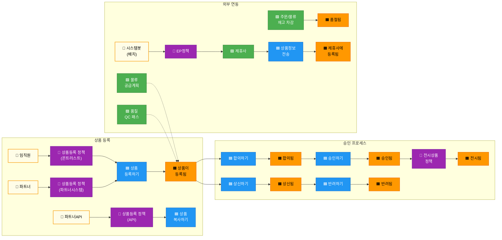

</details>

**흐름 요약:**
1. **등록 채널 3가지**: 온트러스트(임직원), 파트너시스템(파트너), API(파트너 API) — 각각 별도 등록 정책
2. **승인 프로세스 2개 경로**: 합의→승인→전시 / 상신→승인 또는 반려
3. **외부 연동**: 물류(공급계획), 품질(QC 패스), 주문/물류(재고 차감→품절), 제휴사/대형제휴사(EP 정책→상품 전송)
4. **추가 관리**: 상품 복사, 상품 수정, 묶음상품 등록/수정, 배송비 등록, 상품 가격 등록/승인

### 5.3 브랜드/콘텐츠 흐름

브랜드 관리와 상품 콘텐츠(리뷰, Q&A)의 흐름:


<details>
<summary>📊 원본 Mermaid 코드 보기</summary>

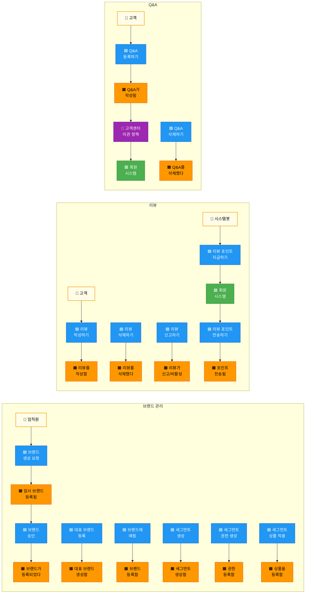

</details>

**흐름 요약:**
1. **브랜드**: 임직원 → 브랜드 생성 요청 → 임시 등록 → 승인 → 브랜드 확정
2. **대표 브랜드/세그먼트**: 대표 브랜드 등록 → 브랜드 매핑 → 세그먼트 생성 → 권한 생성 → 상품 적용
3. **리뷰**: 고객 → 리뷰 작성/삭제/신고, 시스템 봇(배치) → 포인트 지급 → 회원 시스템 → 포인트 전송
4. **Q&A**: 고객 → Q&A 등록 → 고객센터 이관 정책 → 회원 시스템 전송 / Q&A 삭제

### 5.4 외부 시스템 의존성 분석

3차 기준으로 외부 시스템을 그룹핑하면:

| 그룹 | 🟩 외부 시스템 | 영역 | 연동 내용 |
|------|--------------|------|----------|
| 주문 도메인 | 주문이 취소됐다(주문), 주문이 발생/재고 차감(주문/물류) | ②쿠폰, ⑤상품 | 주문 취소 시 쿠폰 재발행, 재고 차감→품절 |
| 물류/품질 | 공급계획(물류), 품질인증 QC(품질) | ⑤상품 | 공급계획 등록, QC 패스 |
| 제휴사 | 제휴사, 대형제휴사 | ⑤상품 | EP 정책에 따른 상품 정보 전송 |
| 회원 | 회원 시스템(x2) | ⑦콘텐츠 | Q&A 이관, 리뷰 포인트 전송 |
| 조회 화면 | 쿠폰 조회 화면, 당첨자 조회 화면, 참여한 이벤트 화면 | ①②③ | 읽기 모델로 재분류 필요 |

**외부 시스템 총 ~7개** (읽기 모델 3개 제외 시 실질 ~4그룹)

---

## 6. 미완료 항목 정리

### 6.1 미완료 항목 전체 목록

- [ ] 오렌지 액터 오분류 ~10건 → 👤 금색(#FFD700)으로 색상 교정
- [ ] 금색 이벤트 오분류 1건 ("이벤트 기획전 등록됨") → 🟧 오렌지로 색상 교정
- [ ] 쿠폰 중복 이벤트 6건 → 2건 통합 (준비 문서에서 이미 지적)
- [ ] 복합 포스트잇 2건 → 4건 분리 (캠페인 프로모션)
- [ ] 시제 불일치 ~5건 과거형 교정
- [ ] 타 도메인 이벤트 분리 ("카드번호를 받고 주문을 완료했다" → 주문팀)
- [ ] 읽기 모델 오분류 1건 ("리뷰 포인트 지급 대상 조회하기" → 📖)
- [ ] 논의 필요 5건 결정
- [ ] 정책 ~14개 → When/Then 구조화 → ~10개 핵심 정책 확정
- [ ] 애그리게이트 ~15개 후보 식별 (7개 영역별)
- [ ] 읽기 모델 ~10개 후보 도출
- [ ] 바운디드 컨텍스트 ~6개 후보 프리뷰

### 6.2 영역별 미진행 상세

| 영역 | 이벤트 도출 | 커맨드 도출 | 정책 도출 | 애그리게이트 | 읽기 모델 | BC 프리뷰 |
|------|-----------|-----------|----------|------------|----------|----------|
| ① 프로모션 관리 | ✅ | ✅ | ✅ | ⬜ | ⬜ | ⬜ |
| ② 쿠폰 관리 | 🟧 중복 | ✅ | ✅ | ⬜ | ⬜ | ⬜ |
| ③ 이벤트/기획전 | ✅ | ✅ | ✅ | ⬜ | ⬜ | ⬜ |
| ④ 캠페인 프로모션 | 🟧 복합 | ✅ 확장 | ✅ | ⬜ | ⬜ | ⬜ |
| ⑤ 상품 등록/승인 | ✅ | ✅ 대폭 확장 | ✅ | ⬜ | ⬜ | ⬜ |
| ⑥ 브랜드 관리 | ✅ | ✅ | ⬜ | ⬜ | ⬜ | ⬜ |
| ⑦ 상품 콘텐츠 | ✅ | ✅ | ✅ 1개 | ⬜ | ⬜ | ⬜ |

### 6.3 애그리게이트·읽기모델·BC 미수행 분석

**미수행 원인:**
- 3차 워크샵이 준비 문서의 Phase 구조를 따르지 않고 **7개 영역 전체의 커맨드 확장**에 집중
- 커맨드가 33→47개로 대폭 확장되면서 시간 소요
- 이벤트 정제가 선행되지 않아 애그리게이트·읽기모델 도출의 전제 조건이 갖춰지지 않음
- 준비 문서에서 지적한 중복 6건, 오분류 5건도 미교정

**영향:**
- 읽기 모델은 바운디드 컨텍스트 경계 설정의 중요 근거 → BC 프리뷰도 함께 미수행
- 4차 워크샵에서 **오분류 교정 → 이벤트 정제 → 애그리게이트 → 정책 구조화 → 읽기모델 → BC 프리뷰**를 순서대로 수행해야 함

**준비 문서의 애그리게이트 15개 후보 (여전히 유효):**

| 영역 | 🟨 애그리게이트 | 포함 데이터 |
|------|----------------|-----------|
| ① 프로모션 | 상품프로모션 | 프로모션ID, 대상상품, 할인율, 상태 |
| ① 프로모션 | 카드프로모션 | 프로모션ID, 카드사, 할인조건 |
| ① 프로모션 | 캠페인프로모션 | 캠페인ID, 대상자, 응모조건, 추첨결과 |
| ② 쿠폰 | 쿠폰 | 쿠폰ID, 유형, 할인금액, 유효기간, 상태 |
| ③ 이벤트 | 이벤트기획전 | 기획전ID, 이벤트명, 기간, 응모조건 |
| ③ 이벤트 | 오퍼 | 오퍼ID, 대상, 혜택, 지급상태 |
| ③ 이벤트 | 응모 | 응모ID, 고객, 이벤트, 응모일시 |
| ④ 상품 | 상품 | 상품ID, 상품명, 가격, 상태 |
| ④ 상품 | 상품승인 | 승인ID, 상품, 승인단계, 상태 |
| ⑤ 브랜드 | 브랜드 | 브랜드ID, 브랜드명, 승인상태 |
| ⑤ 브랜드 | 브랜드세그먼트 | 세그먼트ID, 브랜드, 권한, 상품목록 |
| ⑥ 콘텐츠 | 상품Q&A | Q&A ID, 상품, 고객, 질문, 답변 |
| ⑥ 콘텐츠 | 상품리뷰 | 리뷰ID, 상품, 고객, 내용, 이미지 |
| ⑥ 콘텐츠 | 배송비 | 배송비ID, 배송유형, 금액, 조건 |
| ⑥ 콘텐츠 | 묶음상품 | 묶음ID, 상품목록, 대표이미지 |

**준비 문서의 읽기 모델 10개 후보 (여전히 유효):**

| # | 📖 읽기 모델 | 대상 사용자 | 구성 데이터 |
|---|-------------|-----------|-----------|
| 1 | 프로모션 현황 대시보드 | 🔧 MD/마케터 | 프로모션 진행 현황, 할인 적용 건수 |
| 2 | 캠페인 응모/당첨 현황 | 🔧 MD/마케터 | 응모 현황, 당첨자 목록, 오퍼 지급 상태 |
| 3 | 쿠폰 발행/사용 현황 | 🔧 MD/마케터 | 쿠폰 발행 건수, 다운로드율, 사용율 |
| 4 | 상품 등록 심사 현황 | 🔧 운영자 | 상품 등록 건수, 상신/합의/승인 상태 |
| 5 | 상품 가격 변경 이력 | 🔧 운영자 | 가격 변경 요청, 승인 이력 |
| 6 | 브랜드 관리 현황 | 🔧 운영자 | 브랜드 목록, 세그먼트 현황 |
| 7 | 리뷰/Q&A 관리 뷰 | 🔧 운영자 | 리뷰 현황, 신고 건수, Q&A 미답변 목록 |
| 8 | 제휴사 상품 전송 모니터링 | 🔧 운영자 | 제휴사별 전송 건수, 실패 건수 |
| 9 | 참여 이벤트 조회 화면 | 👤 고객 | 참여한 이벤트 목록, 당첨 여부 |
| 10 | 쿠폰 보관함 | 👤 고객 | 보유 쿠폰 목록, 사용 가능 여부, 유효기간 |

---

## 7. 4차 워크샵 권장 사항

### 7.1 4차 워크샵 목표 재설정

3차에서 미완료된 항목을 반영하여 4차 목표를 재설정합니다:

```
┌─────────────────────────────────────────────────────────────┐
│              4차 워크샵에서 달성할 것                          │
├─────────────────────────────────────────────────────────────┤
│                                                             │
│  ✅ 3차 draw.io 오분류 교정 확인 (사전 반영)               │
│  ✅ 이벤트 정제 (~49개 → ~35개, 중복통합·시제교정)         │
│  ✅ 애그리게이트 식별 (~15개 후보 확정)                     │
│  ✅ 정책 When/Then 구조화 (~14개 → ~10개 핵심)             │
│  ✅ 읽기 모델 도출 (~10개 후보)                             │
│  ✅ 바운디드 컨텍스트 후보 프리뷰 (~6개)                   │
│                                                             │
└─────────────────────────────────────────────────────────────┘
```

### 7.2 권장 타임라인

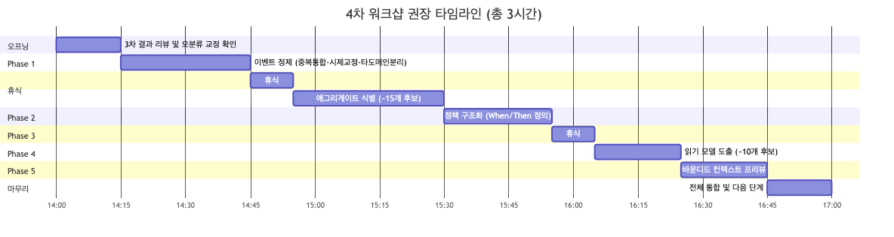

<details>
<summary>📊 원본 Mermaid 코드 보기</summary>

```mermaid
gantt
    title 4차 워크샵 권장 타임라인 (총 3시간)
    dateFormat HH:mm
    axisFormat %H:%M

    section 오프닝
    3차 결과 리뷰 및 오분류 교정 확인    :a1, 14:00, 15m

    section Phase 1
    이벤트 정제 (중복통합·시제교정·타도메인분리)   :a2, after a1, 30m

    section 휴식
    휴식                                  :a3, after a2, 10m

    section Phase 2
    애그리게이트 식별 (~15개 후보)        :a4, after a3, 35m

    section Phase 3
    정책 구조화 (When/Then 정의)          :a5, after a4, 25m

    section 휴식
    휴식                                  :a6, after a5, 10m

    section Phase 4
    읽기 모델 도출 (~10개 후보)           :a7, after a6, 20m

    section Phase 5
    바운디드 컨텍스트 프리뷰              :a8, after a7, 20m

    section 마무리
    전체 통합 및 다음 단계                :a9, after a8, 15m
```

</details>

| 시간 | 단계 | 소요 | 핵심 활동 |
|------|------|------|----------|
| 14:00 | 오프닝 | 15분 | 3차 결과 리뷰, 오분류 교정 확인(사전 반영), 논의 5건 거수 결정 |
| 14:15 | Phase 1: 이벤트 정제 | 30분 | 중복 통합(쿠폰 6→2건), 복합 분리(캠페인 2→4건), 시제 교정 ~5건 → ~35개 목표 |
| 14:45 | 휴식 | 10분 | |
| 14:55 | Phase 2: 애그리게이트 식별 | 35분 | 프로모션 3개, 쿠폰 1개, 이벤트 3개, 상품 2개, 브랜드 2개, 콘텐츠 4개 = ~15개 후보 확정 |
| 15:30 | Phase 3: 정책 구조화 | 25분 | ~14개 정책을 When/Then 정의, ~10개 핵심 정책 확정 |
| 15:55 | 휴식 | 10분 | |
| 16:05 | Phase 4: 읽기 모델 | 20분 | 운영자 8개 + 고객 2개 = ~10개 후보 도출 |
| 16:25 | Phase 5: BC 프리뷰 | 20분 | ~6개 BC 후보(프로모션, 쿠폰, 이벤트, 상품, 브랜드, 콘텐츠) 경계 검증 |
| 16:45 | 마무리 | 15분 | 전체 통합, 다음 단계 안내, 결과 정리 |
| **17:00** | **종료** | **총 3시간** | |

### 7.3 사전 준비 체크리스트

- [ ] 3차 draw.io 보드에서 오렌지 액터 오분류 ~10건 → #FFD700 금색으로 사전 교정
- [ ] 금색 이벤트 오분류 1건 ("이벤트 기획전 등록됨") → #FF8C00 오렌지로 사전 교정
- [ ] 쿠폰 중복 포스트잇 정리: 3가지 표현 합본 → 대표 1개만 남기기 (x2건)
- [ ] 캠페인 복합 포스트잇 분리: 2개 이벤트 → 별도 포스트잇으로 분리 (x2건)
- [ ] 시제 불일치 ~5건 과거형("~되었다")으로 사전 교정
- [ ] 논의 필요 5건에 대해 팀원과 사전 확인 (슬랙 논의)
- [ ] 준비 문서의 애그리게이트 15개 후보를 🟨 포스트잇으로 미리 준비
- [ ] 준비 문서의 읽기 모델 10개 후보를 📖 포스트잇으로 미리 준비
- [ ] 포스트잇 색상 가이드를 벽면에 크게 인쇄하여 부착 (오분류 방지)
- [ ] draw.io에 색상 프리셋 사전 설정 (🟧 #FF8C00, 🟦 #4A90D9, 💜 #9B59B6, 👤 #FFD700, 🟩 #2ECC71, 🩷 #EA6B66)

### 7.4 퍼실리테이터 유의 사항

3차 워크샵에서 얻은 교훈 4가지:

**1. 준비 문서 Phase 구조 준수 유도**
> 3차에서는 준비 문서의 Phase 구조를 따르지 않고 **7개 영역 전체를 커맨드 중심으로 확장**하는 방식으로 진행되었습니다.
> 커맨드 도출은 충분하나 정제·구조화·상위 레벨 식별은 미수행입니다.
> 4차에서는 **"커맨드·이벤트 도출은 이미 충분합니다. 오늘은 정제·구조화·상위 레벨 식별에 집중합니다"**와 같이
> 오프닝에서 명확히 안내하고, Phase 전환 시 "이 Phase에서 N개를 확정했습니다"와 같이 **명시적 전환**을 합니다.

**2. 오렌지(🟧) 색상 오분류 방지**
> 3차에서 액터 ~10건이 🟧 오렌지(이벤트 색상)로 잘못 표기되었습니다.
> 액터는 반드시 **👤 금색(#FFD700)**으로 작성해야 합니다.
> draw.io에서 "임직원 옷", "사용자 옷" 등 역할명은 **이벤트가 아닌 액터**임을 오프닝에서 안내합니다.
> "포스트잇을 붙이기 전에 '이것은 누구(액터)인가? 무슨 일이 일어났나(이벤트)인가?'를 먼저 확인하세요."

**3. 중복/복합 포스트잇 방지**
> 3차에서 쿠폰 영역에 동일 이벤트가 3가지 표현으로 하나의 포스트잇에 합쳐져 있고,
> 캠페인 영역에서 2개 이벤트가 하나의 포스트잇에 작성되었습니다.
> **"포스트잇 하나에는 이벤트 하나만 작성합니다"** 원칙을 Phase 1 시작 시 재확인합니다.
> "같은 의미의 이벤트가 여러 표현으로 있으면 **가장 비즈니스적인 표현 하나**를 선택합니다."

**4. 이벤트 vs 커맨드 vs 액터 구분 교육**
> 3차에서 발견된 혼동 패턴:
> - "임직원 옷" → 이것은 **액터**(역할)이지 이벤트가 아닙니다
> - "리뷰 포인트 지급 대상 조회하기" → 이것은 **커맨드** 또는 **읽기 모델**이지 이벤트가 아닙니다
> - "브랜드 세그먼트 생성함. 등록함." → 약식 표현은 **"~되었다"** 정식 과거형으로 통일
>
> 4차에서 새 포스트잇을 붙일 때:
> - **"이것은 과거에 발생한 사실인가요?"** → 예: 🟧 이벤트
> - **"이것은 누군가에게 내리는 명령인가요?"** → 예: 🟦 커맨드
> - **"이것은 사람이나 시스템 이름인가요?"** → 예: 👤 액터 또는 🟩 외부 시스템

### 7.5 도메인별 정제 우선순위

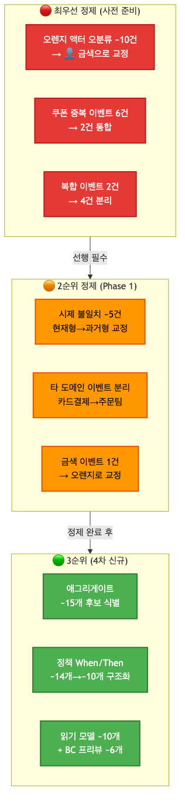

<details>
<summary>📊 원본 Mermaid 코드 보기</summary>

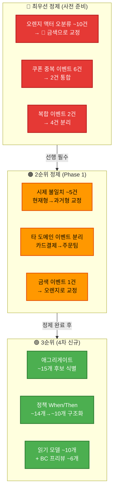

</details>

**우선순위 설명:**
1. **🔴 최우선**: 오렌지 액터 오분류 ~10건 교정 + 쿠폰 중복 통합 + 캠페인 복합 분리 — **사전 준비로 처리**
2. **🟠 2순위**: 시제 교정 ~5건 + 타 도메인 분리 + 금색 이벤트 교정 — **Phase 1에서 처리**
3. **🟢 3순위**: 애그리게이트·정책 구조화·읽기모델·BC 프리뷰 — **Phase 2~5에서 신규 수행**
