# 상품 서비스팀 이벤트 스토밍 3차 워크샵 준비 가이드

## 1. 개요

### 1.1 이 문서의 목적

상품서비스개발팀 이벤트 스토밍 **3차 워크샵**을 진행하는 퍼실리테이터를 위한 실전 가이드입니다.
1~2차에서 도출한 이벤트·커맨드·정책을 기반으로, **대폭 정제 → 애그리게이트 → 정책 구조화 → 읽기 모델 → BC 프리뷰**까지 완성하는 것이 목표입니다.

```
┌─────────────────────────────────────────────────────────────┐
│              3차 워크샵에서 달성할 것                         │
├─────────────────────────────────────────────────────────────┤
│                                                             │
│  ✅ 이벤트 대폭 정제: ~47개 → ~30개 (오분류 교정 포함)     │
│  ✅ 정책 구조화: 14개(이름만) → ~10개(When/Then 정의)       │
│  ✅ 애그리게이트: ~15개 후보 확정 (7개 영역별)              │
│  ✅ 읽기 모델: ~10개 후보 도출                              │
│  ✅ 바운디드 컨텍스트 프리뷰: ~6개 BC 후보 검증             │
│  ✅ 핫스팟 식별 및 정책 전환                                │
│                                                             │
└─────────────────────────────────────────────────────────────┘
```

### 1.2 1~2차 요약 & 3차 목표

**1~2차 완료 사항:**
- 1차: 이벤트 자유 도출 (브레인스토밍)
- 2차: 이벤트·커맨드·정책·액터 도출 (draw.io 정리)

| 항목 | 1~2차 완료 | 3차 목표 |
|------|-----------|---------|
| 이벤트 도출 | ✅ ~47개 (중복 6건, 오분류 5건 포함) | **대폭 정제하여 ~30개** |
| 커맨드 | ✅ ~33개 | 이벤트와 매핑 재정리 |
| 정책 | ✅ ~14개 (이름만) | **When/Then 구조화 → ~10개** |
| 액터 | ✅ MD, 마케터, 고객, 임직원, 파트너 | 유지 |
| 외부 시스템 | ✅ 물류(공급계획), 품질(QC) | 유지 + 추가 식별 |
| 애그리게이트 | ⬜ 미수행 | **~15개 후보 확정** |
| 읽기 모델 | ⬜ 미수행 | **~10개 후보 도출** |
| 핫스팟 | ⬜ 미수행 | **식별 및 정책 전환** |
| 바운디드 컨텍스트 | ⬜ 미수행 | **~6개 BC 프리뷰** |

### 1.3 참조 문서

| 참조 문서 | 활용 시점 |
|----------|----------|
| [이벤트스토밍_상품서비스팀_가이드.md](./이벤트스토밍_상품서비스팀_가이드.md) | 핵심 도전 7가지, 이벤트 판단 기준, 흔한 실수 TOP 8 |
| [이벤트스토밍_상품서비스팀_도메인예시.md](./이벤트스토밍_상품서비스팀_도메인예시.md) | 8개 도메인별 이벤트·커맨드·애그리게이트·정책 예시 |
| [이벤트스토밍_상품서비스팀_워크샵실행.md](./이벤트스토밍_상품서비스팀_워크샵실행.md) | 퍼실리테이터 스크립트, FAQ |

---

## 2. 1~2차 결과 정리 및 재검토

### 2.1 현재 요소 현황 요약


<details>
<summary>📊 원본 Mermaid 코드 보기</summary>

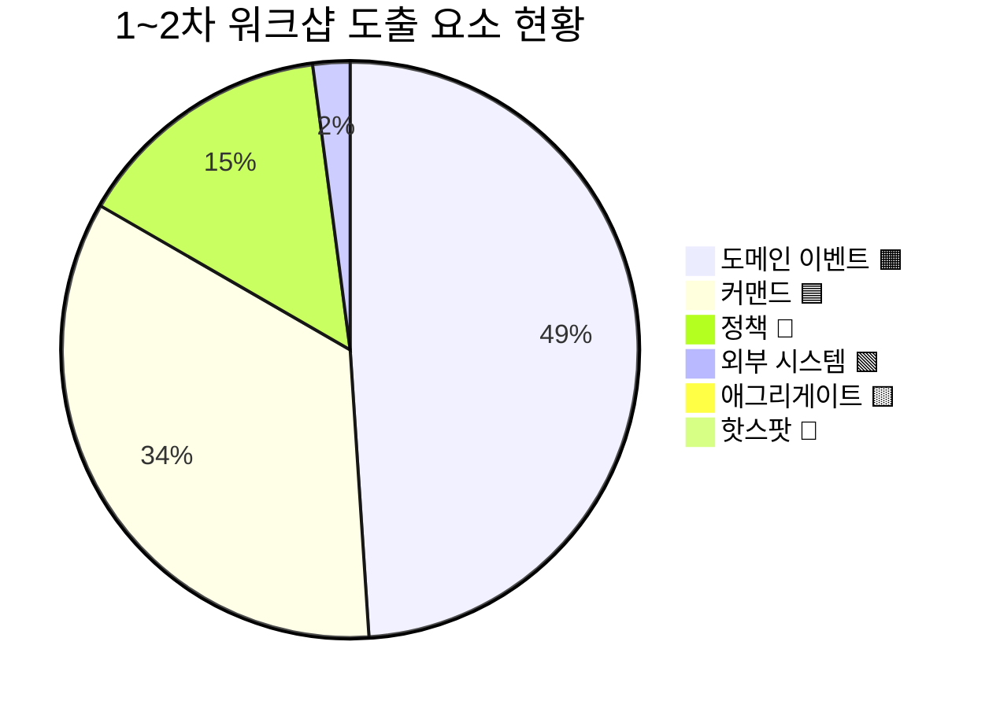

</details>

**현황 분석:**
- 이벤트 ~47개 중 **중복 6건**(쿠폰 영역에 같은 이벤트가 3가지 표현으로 존재), **오분류 5건**(UI 동작, 조회, 타 도메인 이벤트)
- 정책 ~14개가 **이름만 존재**하고 When/Then 구조가 없음 — "상품 프로모션 정책"처럼 라벨만 있는 상태
- 애그리게이트·읽기 모델·핫스팟은 **전혀 미수행** — 3차에서 집중 진행
- 7개 흐름 영역(프로모션, 쿠폰, 이벤트/기획전, 상품 등록, 브랜드, 콘텐츠, 외부 연동)이 식별됨
- draw.io에서 금색(#FFD700)이 이벤트·액터·라벨에 혼용되어 **색상 오분류 교정** 필요

### 2.2 7개 흐름 영역 전체 맵

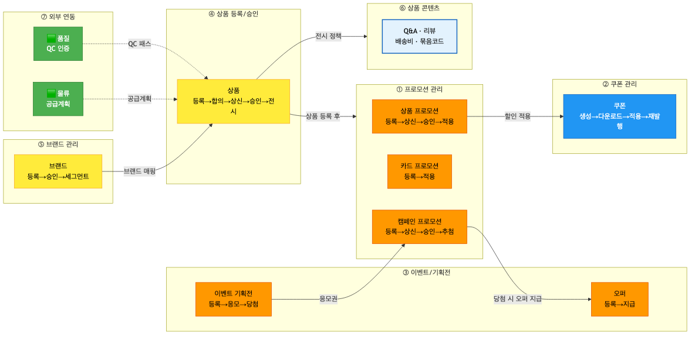

<details>
<summary>📊 원본 Mermaid 코드 보기</summary>

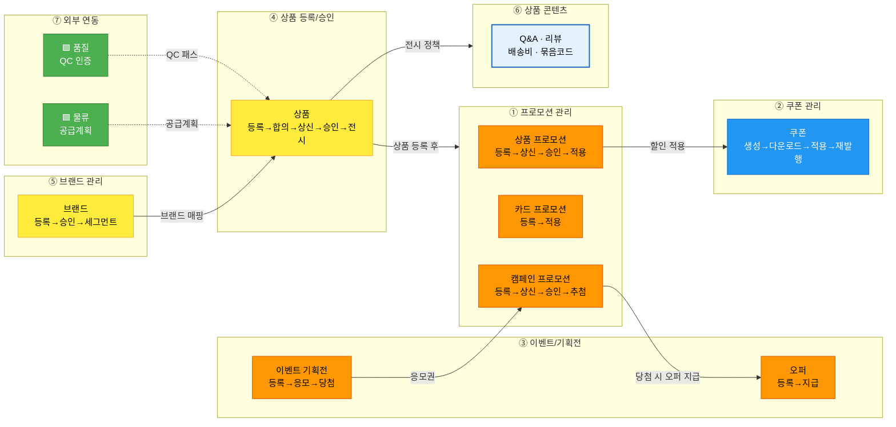

</details>

**영역별 상세:**

| 영역 | 주요 액터 | 이벤트 수 | 핵심 흐름 |
|------|----------|----------|----------|
| ① 프로모션 관리 | MD, 마케터 | ~12개 | 등록→상신→승인→할인 적용 |
| ② 쿠폰 관리 | MD, 마케터, 고객 | ~4개 (중복 제외 후) | 생성→다운로드→적용→재발행 |
| ③ 이벤트/기획전 | MD, 마케터, 고객 | ~5개 | 기획전 등록→응모→당첨→오퍼 지급 |
| ④ 상품 등록/승인 | 임직원, 파트너 | ~6개 | 등록→합의→상신→승인/반려→전시 |
| ⑤ 브랜드 관리 | 임직원 | ~7개 | 브랜드 등록→세그먼트→상품 매핑 |
| ⑥ 상품 콘텐츠 | 고객, 판매자 | ~9개 | Q&A, 리뷰, 배송비, 묶음코드 |
| ⑦ 외부 연동 | 🟩 물류, 품질 | 2개 | 공급계획 등록, QC 패스 |

### 2.3 이벤트 재검토 항목

#### 2.3.1 중복 이벤트 통합 (6건)

| # | draw.io 원본 (중복) | 통합 후 | 사유 |
|---|-------------------|--------|------|
| 1 | "쿠폰을 생성했다" + "할인쿠폰 등록됨" + "쿠폰이 생성되었다" | → **"쿠폰이 생성되었다"** | 동일 이벤트 3가지 표현 |
| 2 | "쿠폰을 다운받았다" + "쿠폰을 지급하였다" + "상품상세 페이지에서 할인쿠폰을 다운로드 했다" | → **"쿠폰이 다운로드되었다"** | 동일 이벤트 3가지 표현 |

#### 2.3.2 오분류 교정 (5건)

| # | draw.io 원본 | 현재 색상 | 교정 | 사유 |
|---|-------------|----------|------|------|
| 1 | "고객이 리뷰를 조회하였다" | 🟧 이벤트 | → 📖 **읽기 모델** | 조회는 상태 변경이 아님 |
| 2 | "묶음코드 필수 정보를 입력하고 묶음코드 대표 이미지를 추가한다" | 🟧 이벤트 | → 🟦 **커맨드** | UI 동작/명령문 |
| 3 | "브랜드 세그먼트 권한 등록함" | 🟦 커맨드 | → 🟧 **이벤트** (과거형 변경) | 명명 교정: "등록되었다" |
| 4 | "카드 할인을 받고 상품을 선물했다" | 🟧 이벤트 | → **분리**: "카드 할인이 적용되었다" + 🩷 핫스팟("선물하기는 주문팀?") | 여러 도메인 혼합 |
| 5 | "상품이 장바구니에 담겼다" | 🟧 이벤트 | → 🟩 **외부 시스템** (주문팀) | 상품팀 이벤트가 아님 |

#### 2.3.3 타 도메인 분리 (3건)

| # | 원본 이벤트 | 처리 | 사유 |
|---|-----------|------|------|
| 1 | "상품이 장바구니에 담겼다" | → 🟩 주문팀 | 장바구니는 주문 도메인 |
| 2 | "주문이 발생하여 재고가 차감되었다" | → 분리: "재고가 차감되었다" (상품팀) + 🟩 "주문이 발생했다" (주문팀) | 복합 이벤트 분리 |
| 3 | "재고가 모두 차감되어 매진되었다" | → **"상품이 품절되었다"** (정책 결과) | 상품 상태 변경으로 재정의 |

#### 2.3.4 제외 대상 (4건)

| # | 원본 | 사유 |
|---|------|------|
| 1 | "입점 전" | 라벨/단계 표시 (이벤트 아님) |
| 2 | "파트너 가입" | 라벨/단계 표시 (이벤트 아님) |
| 3 | "리뷰 이미지가 업로드됨" | 리뷰 등록의 내부 단계 |
| 4 | "상품 전송 완료됨" | 기술적 처리 (비즈니스 이벤트 아님) |

#### 2.3.5 정책 명명 정규화 (14건 → ~10건)

| # | draw.io 원본 | 교정 | 구조화 |
|---|-------------|------|--------|
| 1 | "상품 프로모션 정책" | **프로모션 등록 규칙** | When: 프로모션 등록 시 / Then: 대상 상품 검증 |
| 2 | "상품 프로모션 적용 정책" | **프로모션 할인가 적용** | When: 프로모션 승인 시 / Then: 할인가 자동 적용 |
| 3 | "카드 프로모션 정책" + "카드 프로모션 적용 정책" | → **통합**: 카드 할인 적용 | When: 결제 시 카드 확인 / Then: 할인 자동 적용 |
| 4 | "이벤트 응모 정책" | **응모 자격 검증** | When: 응모 시 / Then: 자격 조건 확인 |
| 5 | "오퍼 등록 정책" | **오퍼 등록 규칙** | When: 오퍼 등록 시 / Then: 대상·기간 검증 |
| 6 | "이벤트 기획전 등록 정책" | **기획전 등록 규칙** | When: 기획전 등록 시 / Then: 기간·상품 검증 |
| 7 | "이벤트 당첨 정책" | **당첨 시 오퍼 자동 지급** | When: 당첨자 확정 시 / Then: 오퍼 자동 지급 |
| 8 | "캠페인 프로모션 정책" | **캠페인 승인 시 대상자 추출** | When: 캠페인 승인 시 / Then: 대상자 자동 추출 |
| 9 | "할인 쿠폰 정책" | **주문취소 시 쿠폰 재발행** | When: 주문 취소 시 / Then: 사용 쿠폰 자동 재발행 |
| 10 | "상품등록 정책(온트러스트)" + "(파트너시스템)" + "(API)" | → **통합**: 채널별 등록 검수 | When: 상품 등록 시 / Then: 채널에 따라 검수 프로세스 적용 |

### 2.4 1~2차→3차 전환 체크리스트

- [ ] 중복 이벤트 6건 통합 처리
- [ ] 오분류 5건 색상 교정
- [ ] 타 도메인 이벤트 3건 분리/재정의
- [ ] 제외 대상 4건 제거
- [ ] 정책 14개 → ~10개 When/Then 구조화
- [ ] 7개 흐름 영역 확인

---

## 3. 3차 워크샵 타임라인

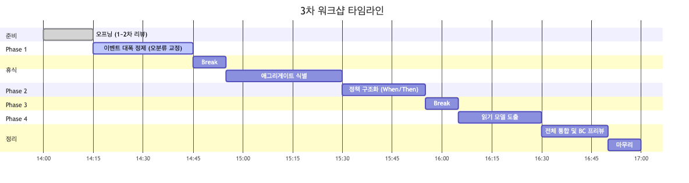

<details>
<summary>📊 원본 Mermaid 코드 보기</summary>

```mermaid
gantt
    title 3차 워크샵 타임라인
    dateFormat HH:mm
    axisFormat %H:%M

    section 준비
    오프닝 (1~2차 리뷰)                :done, 14:00, 15m

    section Phase 1
    이벤트 대폭 정제 (오분류 교정)      :active, 14:15, 30m

    section 휴식
    Break                               :14:45, 10m

    section Phase 2
    애그리게이트 식별                    :14:55, 35m

    section Phase 3
    정책 구조화 (When/Then)             :15:30, 25m

    section 휴식
    Break                               :15:55, 10m

    section Phase 4
    읽기 모델 도출                      :16:05, 25m

    section 정리
    전체 통합 및 BC 프리뷰              :16:30, 20m
    마무리                              :16:50, 10m
```

</details>

| 시간 | 단계 | 소요 | 핵심 활동 | 산출물 |
|------|------|------|----------|--------|
| 14:00 | 오프닝 | 15분 | 1~2차 리뷰, draw.io 오분류 설명 | — |
| 14:15 | Phase 1: 이벤트 대폭 정제 | 30분 | 중복 통합, 오분류 교정, 타 도메인 분리 | 정제된 이벤트 ~30개 |
| 14:45 | 휴식 | 10분 | — | — |
| 14:55 | Phase 2: 애그리게이트 식별 | 35분 | 영역별 애그리게이트 도출 | ~15개 후보 |
| 15:30 | Phase 3: 정책 구조화 | 25분 | 기존 정책 When/Then 정의 + 핫스팟 전환 | ~10개 정책 |
| 15:55 | 휴식 | 10분 | — | — |
| 16:05 | Phase 4: 읽기 모델 도출 | 25분 | 고객/운영자 화면 식별 | ~10개 후보 |
| 16:30 | 전체 통합 & BC 프리뷰 | 20분 | 6개 BC 후보 검증 | BC 프리뷰 |
| 16:50 | 마무리 | 10분 | 다음 단계 안내 | — |
| **17:00** | **종료** | **총 3시간** | | |

> **시간 배분 근거:** 상품서비스팀은 7개 흐름 영역 + 대량 오분류 교정이 필요하므로 3시간 배정.
> Phase 1(정제)에 30분 — draw.io 오분류 교정과 중복 통합이 핵심 작업.
> Phase 3(정책)에 25분 — 기존 14개 정책의 When/Then 구조화에 집중.

---

## 4. Phase 1: 이벤트 대폭 정제 (30분)

### 퍼실리테이터 스크립트

> "1~2차에서 ~47개의 이벤트, ~33개의 커맨드, ~14개의 정책을 도출했습니다. 상당히 많은 작업을 하셨습니다.
> 오늘 첫 단계로, draw.io에서 발견된 **중복 6건, 오분류 5건, 타 도메인 3건, 제외 4건**을 정리하겠습니다.
>
> 특히 쿠폰 영역에서 같은 이벤트가 3가지 표현으로 작성된 게 있습니다.
> '쿠폰을 생성했다', '할인쿠폰 등록됨', '쿠폰이 생성되었다' — 이 셋은 같은 이벤트이니 하나로 통합합니다.
>
> 또한 '고객이 리뷰를 조회하였다'는 이벤트가 아니라 📖 읽기 모델입니다.
> 조회는 상태 변경이 아니니까요. 이런 교정을 빠르게 진행하겠습니다."

### 4.1 draw.io 색상 오분류 교정 가이드

> "draw.io에서 금색(#FFD700)이 이벤트·액터·라벨에 모두 사용되었습니다.
> 이벤트 스토밍에서는 색상이 의미를 갖습니다:
>
> 🟧 오렌지 = **도메인 이벤트** (과거형: ~되었다)
> 🟦 파란색 = **커맨드** (명령형: ~하기)
> 💜 보라색 = **정책** (자동 규칙: ~하면 ~한다)
> 📖 하늘색 = **읽기 모델** (조회 화면)
> 🟩 초록색 = **외부 시스템**
>
> 오늘 교정할 것들을 화면에 띄워놓았으니, 하나씩 빠르게 확인하겠습니다."

### 4.2 정제 처리 요약

**통합 대상 (6건 → 2건):**
1. 쿠폰 생성 3개 → "쿠폰이 생성되었다"
2. 쿠폰 다운로드 3개 → "쿠폰이 다운로드되었다"

**오분류 교정 (5건):**
1. "고객이 리뷰를 조회하였다" → 📖 읽기 모델
2. "묶음코드 필수 정보를 입력하고..." → 🟦 커맨드
3. "브랜드 세그먼트 권한 등록함" → 🟧 "권한이 등록되었다"
4. "카드 할인을 받고 상품을 선물했다" → 분리 (카드 할인 + 🩷 핫스팟)
5. "상품이 장바구니에 담겼다" → 🟩 외부 (주문팀)

**타 도메인 분리 (3건):** 장바구니(주문팀), 재고 차감(분리), 매진(상품 품절로 재정의)

**제외 (4건):** 라벨, 내부 단계, 기술 처리

### 4.3 정제 후 예상 이벤트 목록 (~30개)

| # | 영역 | 이벤트 |
|---|------|--------|
| 1 | ① 프로모션 | 상품 프로모션이 등록되었다 |
| 2 | ① 프로모션 | 상품 프로모션이 상신되었다 |
| 3 | ① 프로모션 | 상품 프로모션이 승인되었다 |
| 4 | ① 프로모션 | 가격 할인이 적용되었다 |
| 5 | ① 프로모션 | 카드 프로모션이 등록되었다 |
| 6 | ① 프로모션 | 카드 할인이 적용되었다 |
| 7 | ① 프로모션 | 캠페인 프로모션이 등록되었다 |
| 8 | ① 프로모션 | 캠페인 프로모션이 승인되었다 |
| 9 | ① 프로모션 | 캠페인 대상자가 추출되었다 |
| 10 | ① 프로모션 | 캠페인 당첨자가 확정되었다 |
| 11 | ② 쿠폰 | 쿠폰이 생성되었다 |
| 12 | ② 쿠폰 | 쿠폰이 다운로드되었다 |
| 13 | ② 쿠폰 | 쿠폰이 적용되었다 |
| 14 | ② 쿠폰 | 쿠폰이 재발행되었다 |
| 15 | ③ 이벤트/기획전 | 이벤트 기획전이 등록되었다 |
| 16 | ③ 이벤트/기획전 | 응모가 완료되었다 |
| 17 | ③ 이벤트/기획전 | 이벤트에 당첨되었다 |
| 18 | ③ 이벤트/기획전 | 오퍼가 등록되었다 |
| 19 | ③ 이벤트/기획전 | 오퍼가 지급되었다 |
| 20 | ④ 상품 등록 | 상품이 등록되었다 |
| 21 | ④ 상품 등록 | 상품이 합의되었다 |
| 22 | ④ 상품 등록 | 상품이 상신되었다 |
| 23 | ④ 상품 등록 | 상품이 승인되었다 |
| 24 | ④ 상품 등록 | 상품이 반려되었다 |
| 25 | ④ 상품 등록 | 상품이 전시되었다 |
| 26 | ⑤ 브랜드 | 브랜드가 등록되었다 |
| 27 | ⑤ 브랜드 | 브랜드가 승인되었다 |
| 28 | ⑤ 브랜드 | 브랜드 세그먼트가 생성되었다 |
| 29 | ⑥ 콘텐츠 | Q&A가 작성되었다 |
| 30 | ⑥ 콘텐츠 | 리뷰가 등록되었다 |

---

## 5. Phase 2: 애그리게이트 식별 (35분)

### 5.1 상품팀 눈높이 설명

> **애그리게이트 = "함께 변하는 데이터 묶음"**
>
> 상품팀에 친숙한 비유로 설명하면:
>
> - **프로모션 하나** = 하나의 애그리게이트입니다. 등록하고, 상신하고, 승인하고, 적용하는 것이 모두 같은 프로모션 데이터를 변경합니다
> - **쿠폰 하나** = 생성, 다운로드, 적용, 재발행이 모두 같은 쿠폰 데이터를 변경합니다
> - "이 커맨드가 변경하는 대상은 무엇인가?" → 그게 애그리게이트입니다

**상품팀 애그리게이트 판단 질문:**
- 질문 1: "이 커맨드가 변경하는 데이터 대상은?"
- 질문 2: "이 데이터가 바뀌면 같이 바뀌어야 하는 건?"
- 질문 3: "트랜잭션 경계는 어디까지인가?"

### 5.2 서비스별 애그리게이트 후보 (~15개)

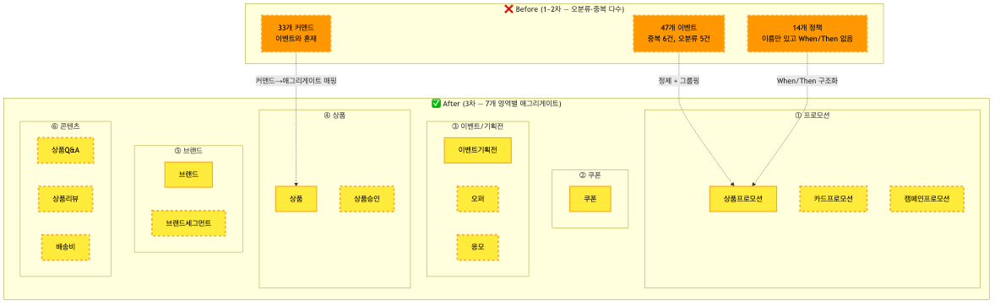

<details>
<summary>📊 원본 Mermaid 코드 보기</summary>

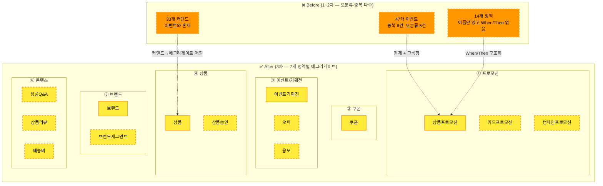

</details>

**애그리게이트 상세:**

| 영역 | 🟨 애그리게이트 | 포함 데이터 | 관련 이벤트 |
|------|----------------|-----------|-----------|
| ① 프로모션 | **상품프로모션** | 프로모션ID, 대상상품, 할인율, 상태 | 등록/상신/승인/적용 |
| ① 프로모션 | **카드프로모션** | 프로모션ID, 카드사, 할인조건 | 등록/적용 |
| ① 프로모션 | **캠페인프로모션** | 캠페인ID, 대상자, 응모조건, 추첨결과 | 등록/승인/추첨/당첨 |
| ② 쿠폰 | **쿠폰** | 쿠폰ID, 유형, 할인금액, 유효기간, 상태 | 생성/다운로드/적용/재발행 |
| ③ 이벤트 | **이벤트기획전** | 기획전ID, 이벤트명, 기간, 응모조건 | 등록/응모/당첨 |
| ③ 이벤트 | **오퍼** | 오퍼ID, 대상, 혜택, 지급상태 | 등록/지급 |
| ③ 이벤트 | **응모** | 응모ID, 고객, 이벤트, 응모일시 | 응모완료/당첨 |
| ④ 상품 | **상품** | 상품ID, 상품명, 가격, 상태 | 등록/전시 |
| ④ 상품 | **상품승인** | 승인ID, 상품, 승인단계, 상태 | 합의/상신/승인/반려 |
| ⑤ 브랜드 | **브랜드** | 브랜드ID, 브랜드명, 승인상태 | 등록/승인 |
| ⑤ 브랜드 | **브랜드세그먼트** | 세그먼트ID, 브랜드, 권한, 상품목록 | 생성/권한등록/상품등록 |
| ⑥ 콘텐츠 | **상품Q&A** | Q&A ID, 상품, 고객, 질문, 답변 | 작성/답변/삭제 |
| ⑥ 콘텐츠 | **상품리뷰** | 리뷰ID, 상품, 고객, 내용, 이미지 | 등록/삭제 |
| ⑥ 콘텐츠 | **배송비** | 배송비ID, 배송유형, 금액, 조건 | 등록 |

### 5.3 흐름 영역별 매핑

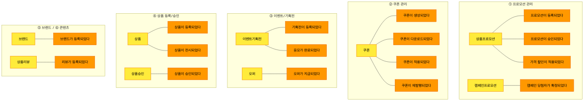

<details>
<summary>📊 원본 Mermaid 코드 보기</summary>

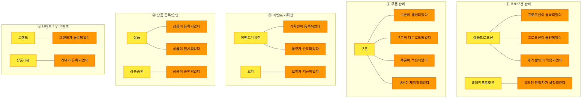

</details>

### 5.4 식별 질문 리스트

| 영역 | 질문 | 기대 답변 |
|------|------|----------|
| ① 프로모션 | "상품 프로모션과 카드 프로모션은 같은 데이터인가요, 다른 데이터인가요?" | 별개 — 상품 할인 vs 카드사 할인 |
| ① 프로모션 | "캠페인은 프로모션과 다른 생명주기를 가지나요?" | 별개 — 응모/추첨/당첨 프로세스 있음 |
| ② 쿠폰 | "쿠폰 생성과 다운로드는 같은 데이터를 변경하나요?" | 같은 쿠폰 애그리게이트, 상태 변경 |
| ③ 이벤트 | "오퍼와 이벤트 기획전은 함께 바뀌나요?" | 별개 — 오퍼는 독립 지급 가능 |
| ④ 상품 | "상품 등록과 상품 승인은 같은 트랜잭션인가요?" | 분리 — 승인은 별도 워크플로우 |
| ⑤ 브랜드 | "브랜드와 브랜드 세그먼트는 같이 변경되나요?" | 별개 — 세그먼트는 독립 생명주기 |

### 5.5 퍼실리테이터 스크립트

> "이제 이벤트들을 '데이터 묶음' 단위로 그룹핑합니다. 🟨 노란색 포스트잇을 사용합니다.
>
> 예시를 들어볼게요. '프로모션 등록하기' 커맨드가 변경하는 대상은? → **상품프로모션** 이죠.
> '프로모션 상신하기', '프로모션 승인하기'도 마찬가지로 같은 **상품프로모션** 데이터를 변경합니다.
>
> 이렇게 '이 커맨드가 변경하는 대상'을 찾으면 됩니다.
> 영역별로 진행합시다. 프로모션 3개, 쿠폰 1개, 이벤트/기획전 3개, 상품 2개, 브랜드 2개, 콘텐츠 3개.
> 영역당 5분씩, 총 35분 안에 ~15개를 확인하겠습니다."

---

## 6. Phase 3: 정책 구조화 (25분)

### 6.1 상품팀 눈높이 설명

> **정책(Policy) = "이벤트가 발생하면 자동으로 실행되는 비즈니스 규칙"**
>
> 상품팀에서 쉽게 볼 수 있는 예시:
>
> - **"프로모션이 승인되면 → 할인가가 자동 적용된다"** — 이것이 정책입니다
> - **"주문이 취소되면 → 사용한 쿠폰이 자동 재발행된다"** — 이것도 정책입니다
> - 2차에서 14개 정책을 도출했지만 "X 정책"이라는 **이름만** 있었습니다
> - 오늘은 각 정책에 **When(언제) / Then(뭘 한다)**를 정의합니다

### 6.2 기존 정책 → 핫스팟 전환

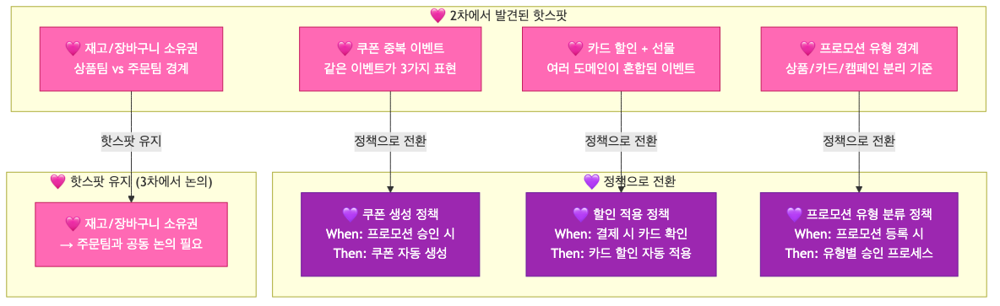

<details>
<summary>📊 원본 Mermaid 코드 보기</summary>

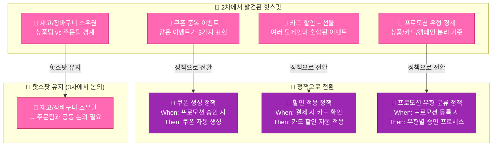

</details>

### 6.3 정책 후보 (~10개, When/Then 구조화)

| # | 영역 | 💜 정책 | When (트리거) | Then (결과) |
|---|------|--------|-------------|-----------|
| 1 | ① 프로모션 | 프로모션 승인 시 할인가 자동 적용 | 프로모션이 승인되었다 | 대상 상품에 할인가 자동 적용 |
| 2 | ① 프로모션 | 프로모션 기간 종료 시 할인 자동 해제 | 프로모션 기간 만료 | 할인가 해제, 원래 판매가 복원 |
| 3 | ① 프로모션 | 캠페인 승인 시 대상자 자동 추출 | 캠페인이 승인되었다 | 조건에 맞는 대상자 자동 추출 |
| 4 | ① 프로모션 | 당첨 시 오퍼 자동 지급 | 당첨자가 확정되었다 | 당첨자에게 오퍼 자동 지급 |
| 5 | ② 쿠폰 | 주문 취소 시 쿠폰 자동 재발행 | 🟩 주문이 취소되었다 | 사용된 쿠폰 자동 재발행 |
| 6 | ② 쿠폰 | 쿠폰 유효기간 만료 시 비활성화 | 유효기간 만료 | 쿠폰 자동 비활성화 |
| 7 | ④ 상품 | 상품 등록 시 검수 자동 요청 | 상품이 등록되었다 | 채널에 따른 검수 프로세스 시작 |
| 8 | ④ 상품 | 상품 승인 시 전시 자동 적용 | 상품이 승인되었다 | 전시상품정책에 따라 전시 적용 |
| 9 | ⑤ 브랜드 | 브랜드 승인 시 세그먼트 생성 가능 | 브랜드가 승인되었다 | 브랜드 세그먼트 생성 허용 |
| 10 | ⑥ 콘텐츠 | 리뷰 등록 시 상품 평점 갱신 | 리뷰가 등록되었다 | 상품 평균 평점 자동 재계산 |

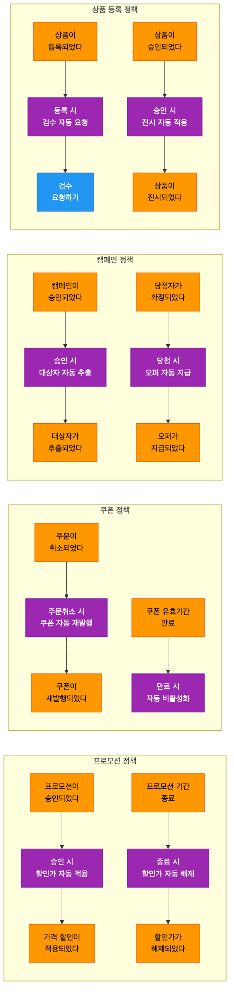

<details>
<summary>📊 원본 Mermaid 코드 보기</summary>

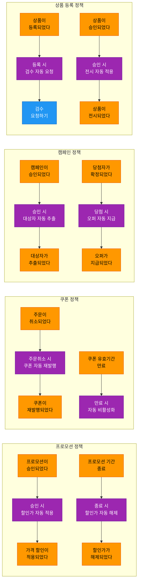

</details>

### 6.4 도출 유도 질문

| # | 영역 | 유도 질문 | 기대 답변 |
|---|------|----------|----------|
| 1 | 프로모션 | "프로모션이 승인되면 자동으로 뭐가 일어나나요?" | 할인가 자동 적용 |
| 2 | 프로모션 | "프로모션 기간이 끝나면 어떻게 되나요? 수동인가요?" | 자동 해제 |
| 3 | 쿠폰 | "주문을 취소하면 쓴 쿠폰은 어떻게 되나요?" | 자동 재발행 |
| 4 | 캠페인 | "캠페인이 승인되면 다음 단계가 자동인가요?" | 대상자 자동 추출 |
| 5 | 상품 | "상품을 등록하면 바로 전시되나요, 검수를 거치나요?" | 채널별 검수 후 전시 |

### 6.5 퍼실리테이터 스크립트

> "2차에서 14개의 정책을 도출했는데, '상품 프로모션 정책'처럼 **이름만** 있었습니다.
> 오늘은 각 정책에 **When(언제 발동하나요) / Then(뭘 하나요)**을 정의합니다.
>
> 예시: '상품 프로모션 적용 정책' →
> **When**: 프로모션이 승인되었다 / **Then**: 대상 상품에 할인가가 자동 적용된다
>
> 이렇게 구체적으로 바꾸면 됩니다. 14개 중 유사한 건 통합하고, ~10개로 정리합시다.
> 또한 2차에서 발견된 이슈들(쿠폰 중복, 도메인 경계 혼란)을 핫스팟 🩷으로 기록합니다."

---

## 7. Phase 4: 읽기 모델 도출 (25분)

### 7.1 상품팀 눈높이 설명

> **읽기 모델 = "사용자가 보는 화면/대시보드"**
>
> 상품팀에서 가장 쉬운 예시:
>
> - **고객이 보는 상품 상세 페이지** = 📖 읽기 모델입니다
> - 상품명, 가격, 할인가, 쿠폰, 리뷰, 재고 상태 — 여러 데이터를 모아서 보여주죠
> - **MD가 보는 프로모션 대시보드** = 📖 읽기 모델입니다
> - 활성 프로모션 수, 할인 적용 상품 수, 매출 영향 — 여러 소스 데이터를 조합
>
> 읽기 모델은 **상태를 변경하지 않습니다**. 조회만 합니다.

### 7.2 읽기 모델 후보 (~10개)


<details>
<summary>📊 원본 Mermaid 코드 보기</summary>

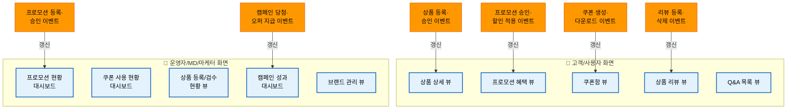

</details>

**읽기 모델 상세:**

| # | 📖 읽기 모델 | 대상 사용자 | 구성 데이터 | 갱신 트리거 |
|---|-------------|-----------|-----------|-----------|
| 1 | **상품 상세 뷰** | 👤 고객 | 상품명, 이미지, 가격, 할인가, 리뷰 요약, 재고 상태 | 상품 승인됨, 가격 변경됨, 할인 적용됨 |
| 2 | **프로모션 혜택 뷰** | 👤 고객 | 적용 가능 프로모션 목록, 할인율, 적용 기간 | 프로모션 승인됨, 할인 적용됨 |
| 3 | **쿠폰함 뷰** | 👤 고객 | 보유 쿠폰 목록, 상태, 유효기간, 사용 조건 | 쿠폰 다운로드됨, 적용됨, 재발행됨 |
| 4 | **상품 리뷰 뷰** | 👤 고객 | 리뷰 목록, 평점, 이미지, 작성자 | 리뷰 등록됨, 삭제됨 |
| 5 | **Q&A 목록 뷰** | 👤 고객 | Q&A 목록, 질문/답변, 작성일 | Q&A 작성됨, 답변됨, 삭제됨 |
| 6 | **프로모션 현황 대시보드** | 🔧 MD/마케터 | 활성 프로모션 수, 대상 상품 수, 할인 적용 현황 | 프로모션 등록/승인/종료됨 |
| 7 | **쿠폰 사용 현황 대시보드** | 🔧 마케터 | 발급 수, 다운로드 수, 사용 수, 사용률 | 쿠폰 생성/다운로드/적용됨 |
| 8 | **상품 등록/검수 현황 뷰** | 🔧 MD/관리자 | 등록 상태별 상품 수, 검수 대기, 반려 현황 | 상품 등록/승인/반려됨 |
| 9 | **캠페인 성과 대시보드** | 🔧 마케터 | 응모 수, 당첨 수, 오퍼 지급 현황, ROI | 응모 완료, 당첨 확정, 오퍼 지급됨 |
| 10 | **브랜드 관리 뷰** | 🔧 관리자 | 브랜드 목록, 승인 상태, 세그먼트 현황 | 브랜드 등록/승인됨, 세그먼트 생성됨 |

### 7.3 읽기모델-이벤트 연결 맵

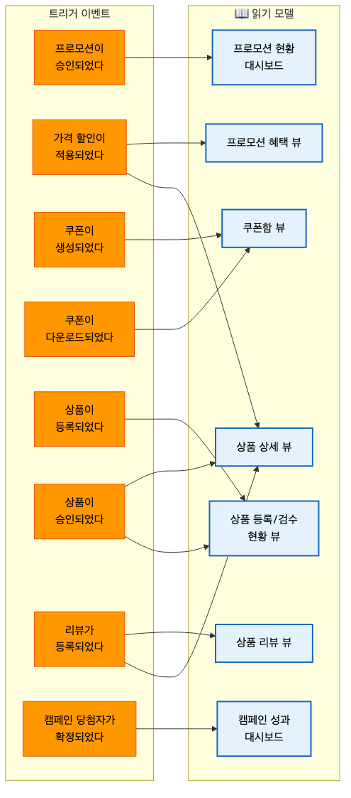

<details>
<summary>📊 원본 Mermaid 코드 보기</summary>

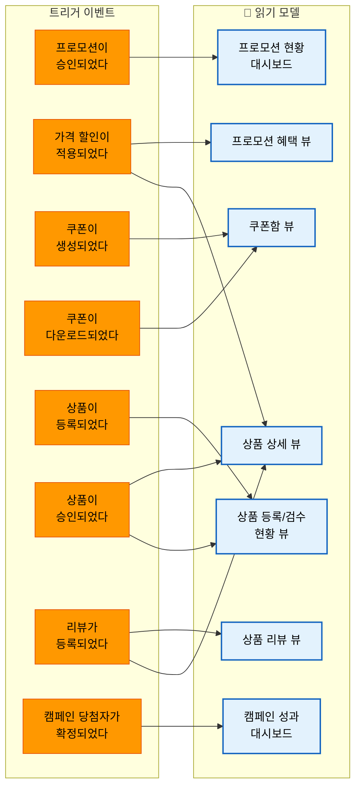

</details>

### 7.4 퍼실리테이터 스크립트

> "마지막으로, '사용자가 보는 화면'을 정리합니다. 📖 하늘색 포스트잇을 사용합니다.
>
> 두 종류로 나눠봅시다:
>
> **고객이 보는 화면** — 상품 상세, 프로모션 혜택, 쿠폰함, 리뷰, Q&A
> **MD/마케터가 보는 화면** — 프로모션 대시보드, 쿠폰 현황, 상품 검수 현황, 캠페인 성과, 브랜드 관리
>
> '고객이 리뷰를 조회하였다'가 아까 이벤트에서 제외되었죠?
> 그게 바로 📖 읽기 모델입니다. 조회는 상태 변경이 아니니까요.
>
> 하나씩 해봅시다. 먼저 상품 상세 페이지.
> 여기에 뭐가 보이나요? 상품명, 가격, 할인가, 리뷰, 재고 상태...
> 📖 하늘색 포스트잇에 '상품 상세 뷰'라고 쓰고, 데이터를 아래에 적어주세요."

---

## 8. 전체 통합 및 정리 (20분)

### 8.1 전체 통합 흐름

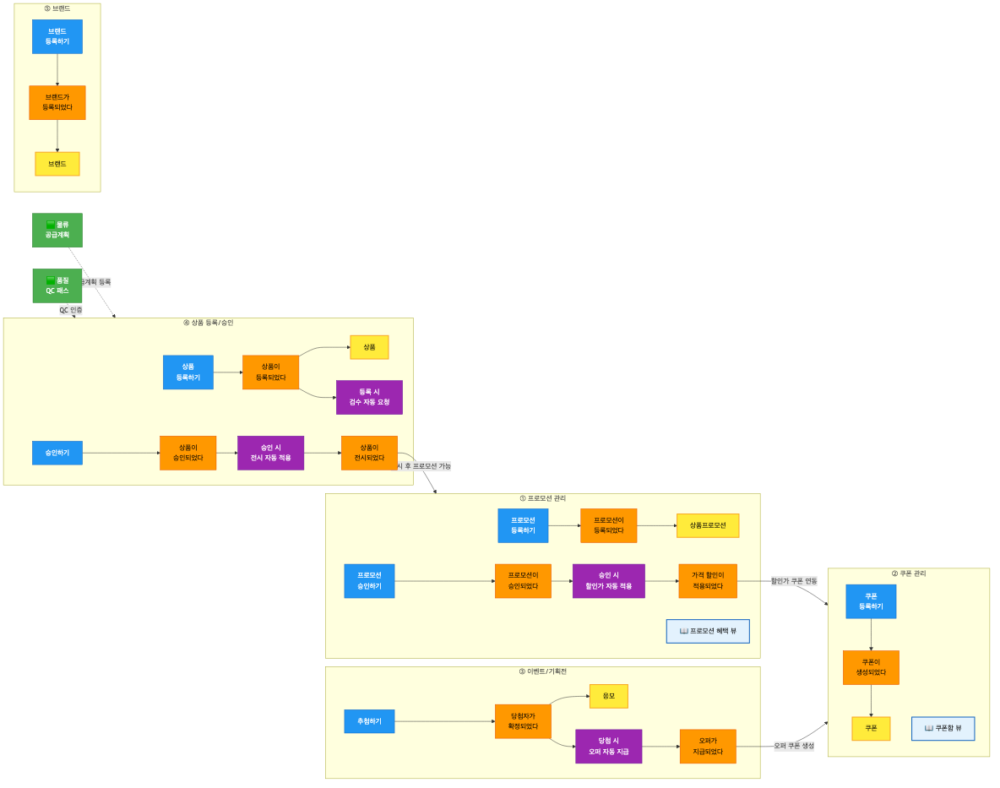

<details>
<summary>📊 원본 Mermaid 코드 보기</summary>

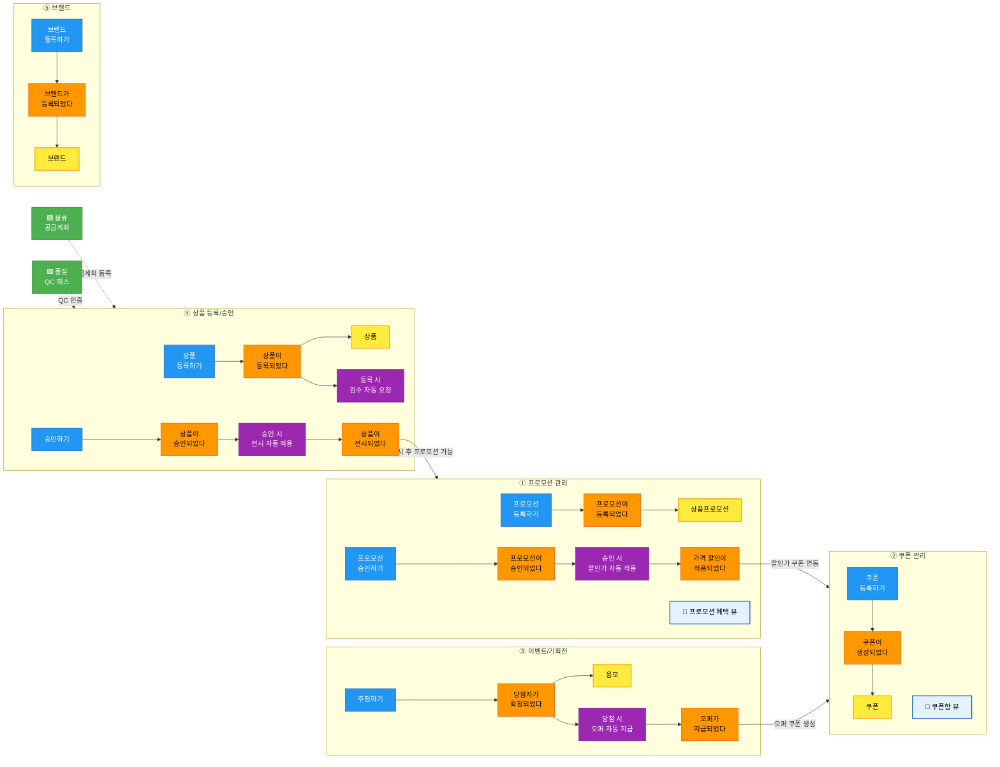

</details>

### 8.2 바운디드 컨텍스트 후보 프리뷰 (~6개)

| # | BC 후보 | 영역 | 애그리게이트 | 독립 배포 | 독립 DB | 판정 |
|---|--------|------|------------|---------|--------|------|
| 1 | **프로모션** | ① | 상품프로모션, 카드프로모션, 캠페인프로모션 | ✅ | ✅ | ✅ 확정 |
| 2 | **쿠폰** | ② | 쿠폰 | ✅ | ✅ | ✅ 확정 |
| 3 | **이벤트/기획전** | ③ | 이벤트기획전, 오퍼, 응모 | ✅ | ✅ | ✅ 확정 |
| 4 | **상품 관리** | ④ | 상품, 상품승인 | ✅ | ✅ | ✅ 확정 |
| 5 | **브랜드** | ⑤ | 브랜드, 브랜드세그먼트 | ✅ | ✅ | ✅ 확정 |
| 6 | **상품 콘텐츠** | ⑥ | 상품Q&A, 상품리뷰, 배송비 | 조건부 | ✅ | ⚠️ 상품 관리에 통합 가능 |

### 8.3 컨텍스트 맵 초안 (Upstream/Downstream)

| Upstream | 관계 패턴 | Downstream | 설명 |
|----------|----------|-----------|------|
| 상품 관리 | **Customer/Supplier** | 프로모션 | 프로모션이 상품 정보를 참조 |
| 프로모션 | **Customer/Supplier** | 쿠폰 | 프로모션 승인 시 쿠폰 생성 |
| 이벤트/기획전 | **Partnership** | 프로모션 | 캠페인 연동 |
| 상품 관리 | **Conformist** | 브랜드 | 상품이 브랜드 정보를 수용 |
| 🟩 주문팀 | **ACL** | 쿠폰 | 주문 취소 시 쿠폰 재발행 |
| 🟩 물류/품질 | **ACL** | 상품 관리 | 공급계획, QC 결과 수신 |

### 8.4 다음 단계 안내

### 성과 체크리스트

- [ ] 이벤트 대폭 정제: ~47개 → ~30개 (중복·오분류·타도메인 처리)
- [ ] 정책 구조화: 14개(이름만) → ~10개(When/Then)
- [ ] 애그리게이트: ~15개 후보 확정
- [ ] 읽기 모델: ~10개 후보 도출
- [ ] 핫스팟 식별 및 정책 전환
- [ ] 바운디드 컨텍스트 ~6개 프리뷰 완료

**4차 워크샵에서 확정할 사항:**

1. BC 경계선 최종 확정 — 6개 BC 유지 or 통합/분리
2. 컨텍스트 맵 확정 — BC 간 관계 패턴
3. 도메인예시 문서와의 갭 분석 — 8개 도메인 중 재고/가격/카테고리/검수 도메인 추가 진행
4. 팀 매핑 — 각 BC를 어느 팀이 담당할지
5. MSA 전환 우선순위 — 어느 BC부터 분리할지

---

## 9. 퍼실리테이터 비상 대응 카드

### 예상 난항 5가지 (상품팀 특화)

| # | 난항 상황 | 대응 방법 |
|---|----------|----------|
| 1 | **"프로모션이 너무 많은 종류예요 (상품/카드/캠페인)"** — 유형 구분 혼란 | **"각 유형의 생명주기가 다릅니다."** 상품 프로모션은 등록→상신→승인, 카드 프로모션은 등록→적용, 캠페인은 응모→추첨까지 있습니다. 생명주기가 다르면 별개의 애그리게이트입니다. |
| 2 | **"쿠폰과 프로모션의 차이가 뭔가요?"** — 개념 혼동 | **"프로모션은 할인 규칙이고, 쿠폰은 할인 수단입니다."** 프로모션이 '20% 할인'이라는 규칙을 정하면, 쿠폰은 그 할인을 고객에게 전달하는 수단입니다. 서로 다른 애그리게이트지만 연결됩니다. |
| 3 | **"재고/가격은 상품팀 거 아닌가요?"** — 도메인 경계 논쟁 | **"데이터를 누가 관리하느냐가 핵심입니다."** 재고 데이터를 상품팀이 관리하면 상품팀 이벤트, 주문팀이 관리하면 주문팀 이벤트. 지금은 🩷 핫스팟으로 표시하고 넘어갑시다. |
| 4 | **"draw.io 정리가 안 돼 있어서 헷갈려요"** — 오분류 혼란 | **"Phase 1에서 교정합니다."** 금색이 이벤트·액터·라벨에 혼용되었는데, 오늘 색상을 정리합니다. 이벤트는 과거형(~되었다), 커맨드는 명령형(~하기)으로 구분하면 됩니다. |
| 5 | **"기술 구현 논의가 시작됨"** (API, 배치 등) | 🩷 핫스팟 포스트잇을 붙이고 넘어감. **"좋은 논점인데, 지금은 비즈니스 흐름에 집중합시다."** |

### 시간 조절 가이드

| 상황 | 조치 |
|------|------|
| Phase 1(정제)이 15분 이내 완료 | Phase 2(애그리게이트)에 남은 시간 배분 |
| Phase 1(정제)이 35분 초과 | 남은 오분류는 퍼실리테이터가 제안 → 빠른 합의 |
| Phase 2(애그리게이트)가 40분 초과 | 콘텐츠 영역(Q&A, 리뷰)은 퍼실리테이터 제안으로 빠르게 처리 |
| Phase 3+4가 시간 부족 | 정책은 핵심 6개만, 읽기모델은 고객 접점 5개만 집중 |
| 전체적으로 15분 이상 초과 | 마무리(8장)를 5분으로 단축, BC 프리뷰는 4차로 이월 |

---

## 10. 결과물 템플릿

### 3차 워크샵 결과 정리 양식

```
# 상품서비스팀 이벤트 스토밍 3차 워크샵 결과

## 일시: 2026년 _월 _일 (_) 14:00 ~ 17:00
## 참석자:

---

## 1. 이벤트 정제 결과
- 정제 전: ~47개
- 정제 후: __개
- 통합: __건, 제외: __건, 재분류: __건, 오분류 교정: __건

## 2. draw.io 오분류 교정 결과
| # | 원본 | 교정 전 색상 | 교정 후 | 비고 |
|---|------|-------------|--------|------|

## 3. 영역별 애그리게이트 (확정 __개)

### ① 프로모션
| # | 애그리게이트 | 포함 이벤트 | 관련 커맨드 |
|---|-------------|-----------|-----------|

### ② 쿠폰
| # | 애그리게이트 | 포함 이벤트 | 관련 커맨드 |
|---|-------------|-----------|-----------|

### ③ 이벤트/기획전
| # | 애그리게이트 | 포함 이벤트 | 관련 커맨드 |
|---|-------------|-----------|-----------|

### ④ 상품 등록/승인
| # | 애그리게이트 | 포함 이벤트 | 관련 커맨드 |
|---|-------------|-----------|-----------|

### ⑤ 브랜드
| # | 애그리게이트 | 포함 이벤트 | 관련 커맨드 |
|---|-------------|-----------|-----------|

### ⑥ 상품 콘텐츠
| # | 애그리게이트 | 포함 이벤트 | 관련 커맨드 |
|---|-------------|-----------|-----------|

## 4. 정책 (확정 __개, When/Then 구조화)
| # | 영역 | 정책 | When (트리거) | Then (결과) |
|---|------|------|-------------|-----------|

## 5. 읽기 모델 (확정 __개)
| # | 읽기 모델 | 대상 사용자 | 구성 데이터 | 갱신 트리거 |
|---|----------|-----------|-----------|-----------|

## 6. 바운디드 컨텍스트 프리뷰
| # | BC 후보 | 영역 | 애그리게이트 | 판정 | 비고 |
|---|--------|------|-----------|------|------|

## 7. 핫스팟 / 미결 사항
| # | 내용 | 관련 영역 | 담당 | 기한 |
|---|------|----------|------|------|

## 8. 다음 단계
- [ ] 결과 draw.io 정리 및 공유
- [ ] 4차 워크샵 일정 확정 (BC 확정 + 컨텍스트 맵)
- [ ] 도메인예시 문서 갭 분석 (재고/가격/카테고리/검수 도메인)
- [ ] 핫스팟 사항 사전 논의
```
