# 이벤트 스토밍 시각화 가이드

## 1. 전체 프로세스 흐름도

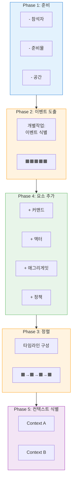

<details>
<summary>📝 원본 텍스트 다이어그램</summary>

```
┌─────────────────────────────────────────────────────────────────────┐
│                    이벤트 스토밍 워크샵 프로세스                    │
└─────────────────────────────────────────────────────────────────────┘

Phase 1: 준비                    Phase 2: 이벤트 도출
┌──────────────┐                ┌──────────────┐
│              │                │              │
│  - 참석자    │                │  개별작업:   │
│  - 준비물    │  ──────────>   │  이벤트 식별 │
│  - 공간      │                │              │
│              │                │ 🟧🟧🟧🟧🟧   │
└──────────────┘                └──────────────┘
                                       │
                                       ▼
Phase 3: 정렬                    Phase 4: 요소 추가
┌──────────────┐                ┌──────────────┐
│              │                │              │
│  타임라인    │  <──────────   │  + 커맨드    │
│  구성        │                │  + 액터      │
│              │                │  + 애그리게잇│
│ 🟧→🟧→🟧→🟧 │                │  + 정책      │
└──────────────┘                └──────────────┘
       │                               │
       └───────────┬───────────────────┘
                   ▼
           Phase 5: 컨텍스트 식별
           ┌──────────────┐
           │              │
           │ ┌──────────┐ │
           │ │Context A │ │
           │ └──────────┘ │
           │              │
           │ ┌──────────┐ │
           │ │Context B │ │
           │ └──────────┘ │
           └──────────────┘
```

</details>

---

## 2. 포스트잇 색상별 사용법

### 전체 컬러 팔레트
```
┌─────────────────────────────────────────────────────────────┐
│                       포스트잇 색상 가이드                  │
├─────────────────────────────────────────────────────────────┤
│                                                             │
│  🟧 오렌지    도메인 이벤트                                │
│             "~되었다" (과거형)                             │
│             예: "주문이 접수되었다"                        │
│                                                             │
│  🟦 파란색    커맨드 (명령)                                │
│             "~하기" (명령형)                               │
│             예: "주문하기"                                 │
│                                                             │
│  🟨 노란색    애그리게잇 (데이터 모델)                     │
│             명사형                                         │
│             예: "주문서", "상품"                           │
│                                                             │
│  🟪 연보라    정책/비즈니스 규칙                           │
│             "만약 ~하면"                                   │
│             예: "재고<10이면 알림"                         │
│                                                             │
│  🟥 빨간색    핫스팟 (문제/이슈)                           │
│             개선 필요 영역                                 │
│             예: "배송 지연 빈발"                           │
│                                                             │
│  🟩 연두색    외부 시스템                                  │
│             타 시스템 연동                                 │
│             예: "PG사 API"                                 │
│                                                             │
│  ⬜ 큰 포스트잇  바운디드 컨텍스트                         │
│             도메인 경계                                    │
│             예: "주문 관리"                                │
│                                                             │
└─────────────────────────────────────────────────────────────┘
```

---

## 3. 이벤트 스토밍 기본 패턴

### Pattern 1: 기본 흐름 (이벤트 → 이벤트)

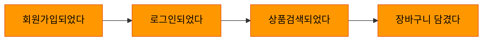

<details>
<summary>📝 원본 텍스트 다이어그램</summary>

```
   시간 흐름 →

🟧          🟧          🟧          🟧
회원가입    →  로그인    →  상품검색  →  장바구니
되었다        되었다       되었다      담겼다
```

</details>

### Pattern 2: 커맨드 추가

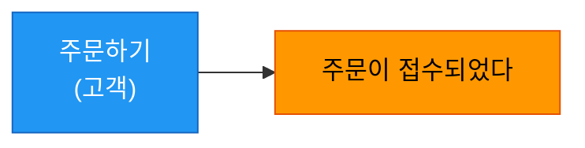

<details>
<summary>📝 원본 텍스트 다이어그램</summary>

```
      🟦           🟧
   [주문하기]  →  주문이
   (고객)        접수되었다
```

</details>

### Pattern 3: 애그리게잇 포함

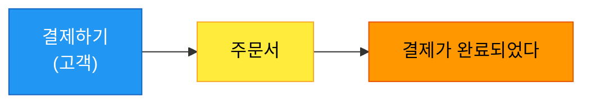

<details>
<summary>📝 원본 텍스트 다이어그램</summary>

```
   🟦        🟨        🟧
[결제하기] → 주문서 → 결제가
(고객)              완료되었다
```

</details>

### Pattern 4: 정책 적용

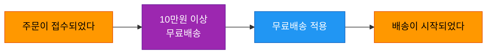

<details>
<summary>📝 원본 텍스트 다이어그램</summary>

```
   🟧              🟪                🟦           🟧
주문이      →   "10만원 이상    →  [무료배송  →  배송이
접수되었다       무료배송"         적용]         시작되었다
```

</details>

### Pattern 5: 외부 시스템 연동

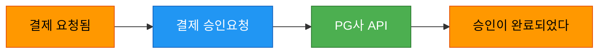

<details>
<summary>📝 원본 텍스트 다이어그램</summary>

```
   🟧          🟦         🟩         🟧
결제        → [결제      PG사      승인이
요청됨        승인요청] → API   →  완료되었다
```

</details>

### Pattern 6: 핫스팟 표시

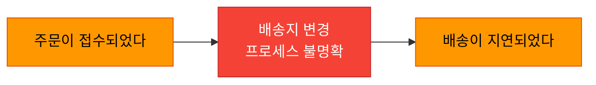

<details>
<summary>📝 원본 텍스트 다이어그램</summary>

```
   🟧              🟥              🟧
주문이      →   "배송지 변경   →  배송이
접수되었다      프로세스 불명확"   지연되었다
```

</details>

---

## 4. 완전한 이벤트 플로우 예시

### E-Commerce 주문 프로세스

#### 전체 여정 개요

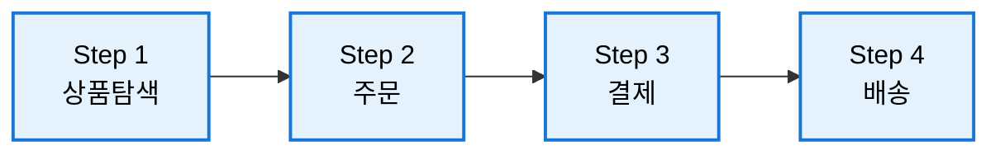

#### Step 1: 상품 탐색

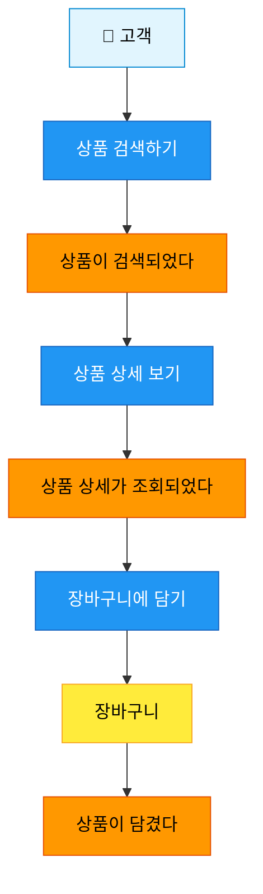

#### Step 2: 주문

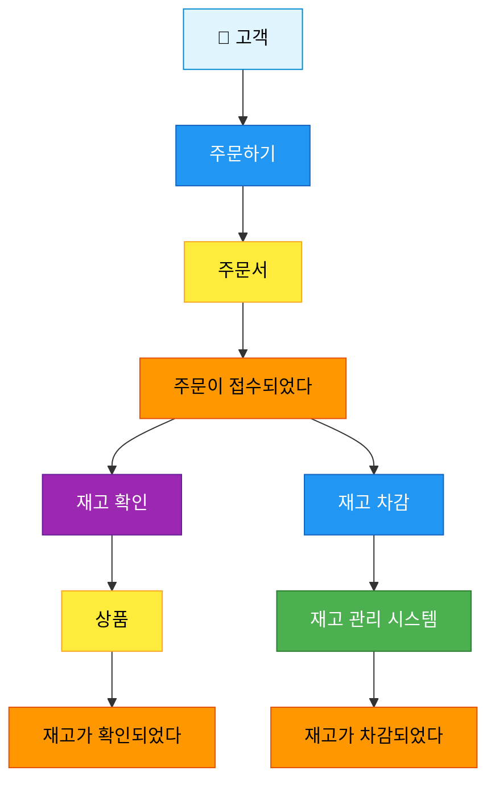

#### Step 3: 결제

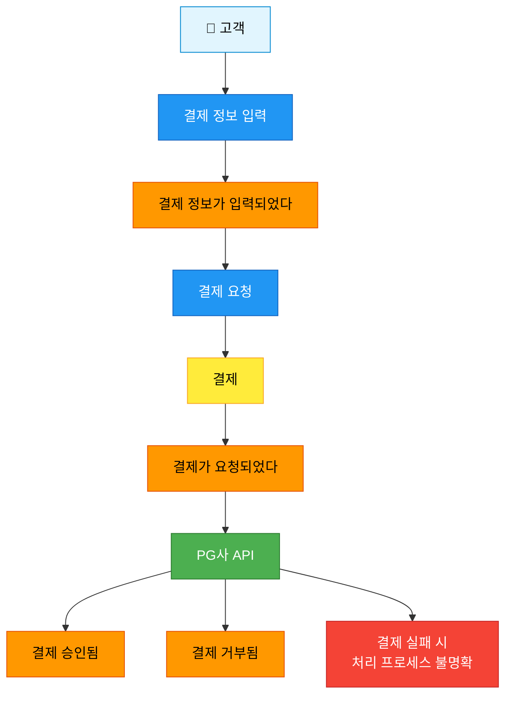

#### Step 4: 배송

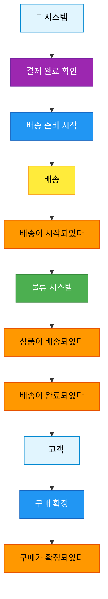

<details>
<summary>📝 원본 텍스트 다이어그램</summary>

```
┌─────────────────────────────────────────────────────────────────────┐
│                         고객 주문 여정                              │
└─────────────────────────────────────────────────────────────────────┘

타임라인: 왼쪽(시작) ──────────────────────────> 오른쪽(종료)

┌──────────┐    ┌──────────┐    ┌──────────┐    ┌──────────┐
│ Step 1   │    │ Step 2   │    │ Step 3   │    │ Step 4   │
│ 상품탐색 │ → │ 주문     │ → │ 결제     │ → │ 배송     │
└──────────┘    └──────────┘    └──────────┘    └──────────┘

Step 1: 상품 탐색
───────────────
[고객] 🧑
   │
   ▼
🟦 상품 검색하기
   │
   ▼
🟧 상품이 검색되었다
   │
   ▼
🟦 상품 상세 보기
   │
   ▼
🟧 상품 상세가 조회되었다
   │
   ▼
🟦 장바구니에 담기
   │
   ▼  🟨
🟧 장바구니 ─ 상품이 담겼다


Step 2: 주문
───────────
[고객] 🧑
   │
   ▼
🟦 주문하기
   │
   ▼  🟨
🟧 주문서 ─ 주문이 접수되었다
   │
   ├──────────────┐
   │              │
   ▼              ▼
🟪 "재고 확인"  🟦 재고 차감
[시스템] 🤖     [시스템] 🤖
   │              │
   ▼  🟨          ▼
🟧 상품 ─ 재고가 확인되었다
                  │
                  ▼
🟩 재고 관리 시스템
                  │
                  ▼
              🟧 재고가 차감되었다


Step 3: 결제
───────────
[고객] 🧑
   │
   ▼
🟦 결제 정보 입력
   │
   ▼
🟧 결제 정보가 입력되었다
   │
   ▼
🟦 결제 요청
   │
   ▼  🟨
🟧 결제 ─ 결제가 요청되었다
   │
   ▼
🟩 PG사 API
   │
   ├─────────┬─────────┐
   ▼         ▼         ▼
🟧 결제    🟧 결제    🟥 결제 실패 시
   승인됨     거부됨     처리 프로세스
                       불명확


Step 4: 배송
───────────
[시스템] 🤖
   │
   ▼
🟪 "결제 완료 확인"
   │
   ▼
🟦 배송 준비 시작
   │
   ▼  🟨
🟧 배송 ─ 배송이 시작되었다
   │
   ▼
🟩 물류 시스템
   │
   ▼
🟧 상품이 배송되었다
   │
   ▼
🟧 배송이 완료되었다
   │
   ▼
[고객] 🧑
🟦 구매 확정
   │
   ▼
🟧 구매가 확정되었다
```

</details>

---

## 5. 바운디드 컨텍스트 시각화

### 컨텍스트 맵 예시

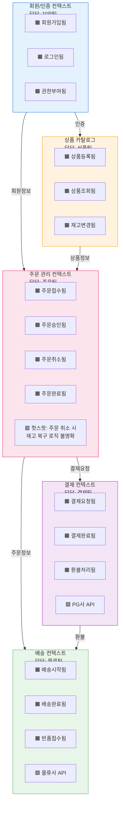

**범례:**
- `────>` : 이벤트/데이터 흐름
- 🟧 : 주요 도메인 이벤트
- 🟩 : 외부 시스템 연동
- 🟥 : 핫스팟 (개선 필요)

<details>
<summary>📝 원본 텍스트 다이어그램</summary>

```
┌────────────────────────────────────────────────────────────────────┐
│                        시스템 전체 컨텍스트 맵                     │
└────────────────────────────────────────────────────────────────────┘

┌──────────────────────┐         ┌──────────────────────┐
│  회원/인증 컨텍스트  │         │ 상품 카탈로그        │
│                      │         │                      │
│  🟧 회원가입됨       │         │  🟧 상품등록됨       │
│  🟧 로그인됨         │────────>│  🟧 상품조회됨       │
│  🟧 권한부여됨       │  인증   │  🟧 재고변경됨       │
│                      │         │                      │
│  담당: 보안팀        │         │  담당: 상품팀        │
└──────────────────────┘         └──────────────────────┘
          │                                 │
          │ 회원정보                        │ 상품정보
          │                                 │
          ▼                                 ▼
┌──────────────────────────────────────────────────────┐
│              주문 관리 컨텍스트                      │
│                                                      │
│  🟧 주문접수됨     🟧 주문승인됨                    │
│  🟧 주문취소됨     🟧 주문완료됨                    │
│                                                      │
│  🟥 핫스팟: 주문 취소 시 재고 복구 로직 불명확      │
│                                                      │
│  담당: 주문팀                                        │
└──────────────────────────────────────────────────────┘
          │                                 │
          │ 주문정보                        │ 결제요청
          │                                 │
          ▼                                 ▼
┌──────────────────────┐         ┌──────────────────────┐
│  배송 컨텍스트       │         │  결제 컨텍스트       │
│                      │         │                      │
│  🟧 배송시작됨       │         │  🟧 결제요청됨       │
│  🟧 배송완료됨       │         │  🟧 결제완료됨       │
│  🟧 반품접수됨       │<────────│  🟧 환불처리됨       │
│                      │  환불   │                      │
│  🟩 물류사 API       │         │  🟩 PG사 API         │
│                      │         │                      │
│  담당: 물류팀        │         │  담당: 결제팀        │
└──────────────────────┘         └──────────────────────┘

범례:
────> : 이벤트/데이터 흐름
🟧 : 주요 도메인 이벤트
🟩 : 외부 시스템 연동
🟥 : 핫스팟 (개선 필요)
```

</details>

---

## 6. 워크샵 공간 레이아웃

### 이상적인 화이트보드 배치
```
                        화이트보드 (3m x 2m)
┌─────────────────────────────────────────────────────────────────┐
│                                                                 │
│  시작                      타임라인                     종료    │
│  ←──────────────────────────────────────────────────────────→  │
│                                                                 │
│  ┌────────┐  ┌────────┐  ┌────────┐  ┌────────┐  ┌────────┐  │
│  │Context │  │Context │  │Context │  │Context │  │Context │  │
│  │   A    │  │   B    │  │   C    │  │   D    │  │   E    │  │
│  │        │  │        │  │        │  │        │  │        │  │
│  │ 🟧🟦🟨 │  │ 🟧🟦🟨 │  │ 🟧🟦🟨 │  │ 🟧🟦🟨 │  │ 🟧🟦🟨 │  │
│  │ 🟧🟦🟨 │  │ 🟧🟦🟨 │  │ 🟧🟦🟨 │  │ 🟧🟦🟨 │  │ 🟧🟦🟨 │  │
│  │ 🟧🟪   │  │ 🟧🟪   │  │ 🟧🟪   │  │ 🟧🟪   │  │ 🟧🟪   │  │
│  │        │  │        │  │        │  │        │  │        │  │
│  └────────┘  └────────┘  └────────┘  └────────┘  └────────┘  │
│                                                                 │
│  핫스팟 영역:                                                   │
│  🟥 문제1  🟥 문제2  🟥 문제3  🟥 문제4                        │
│                                                                 │
└─────────────────────────────────────────────────────────────────┘

          [테이블]                [테이블]
       참석자 4명              참석자 4명

              [테이블]
            참석자 4명

     [준비물 테이블]
   포스트잇, 마커, 다과
```

---

## 7. 단계별 화이트보드 변화

### Phase 1: 이벤트만 있는 상태 (초기)

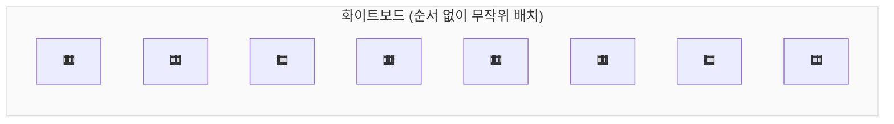

<details>
<summary>📝 원본 텍스트 다이어그램</summary>

```
┌──────────────────────────────────────┐
│                                      │
│  🟧  🟧  🟧  🟧  🟧  🟧  🟧  🟧     │
│     🟧  🟧  🟧  🟧  🟧  🟧          │
│  🟧  🟧  🟧     🟧  🟧  🟧  🟧     │
│     🟧  🟧  🟧  🟧     🟧  🟧     │
│                                      │
│  (순서 없이 무작위 배치)             │
└──────────────────────────────────────┘
```

</details>

### Phase 2: 타임라인 정렬 후

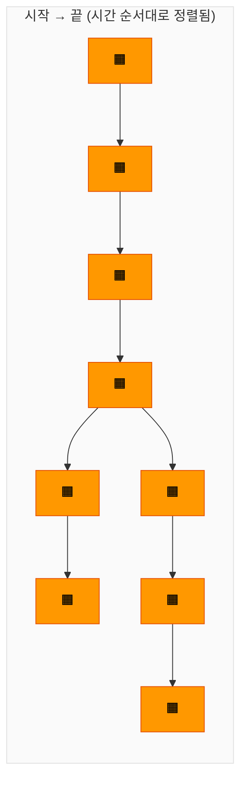

<details>
<summary>📝 원본 텍스트 다이어그램</summary>

```
┌──────────────────────────────────────┐
│  시작 →                     → 끝     │
│                                      │
│  🟧 → 🟧 → 🟧 → 🟧 → 🟧 → 🟧        │
│                    ↓                 │
│                    🟧 → 🟧 → 🟧     │
│                                      │
│  (시간 순서대로 정렬됨)              │
└──────────────────────────────────────┘
```

</details>

### Phase 3: 커맨드/애그리게잇 추가 후

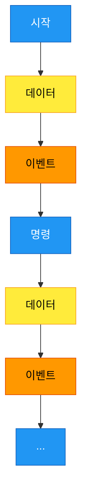

<details>
<summary>📝 원본 텍스트 다이어그램</summary>

```
┌──────────────────────────────────────┐
│                                      │
│     🟦      🟨      🟧               │
│  [시작] → 데이터 → 이벤트            │
│                      ↓               │
│                  🟦  🟨  🟧         │
│               [명령] 데이터 이벤트   │
│                      ↓               │
│                     ...              │
│                                      │
└──────────────────────────────────────┘
```

</details>

### Phase 4: 바운디드 컨텍스트 구분 후 (최종)

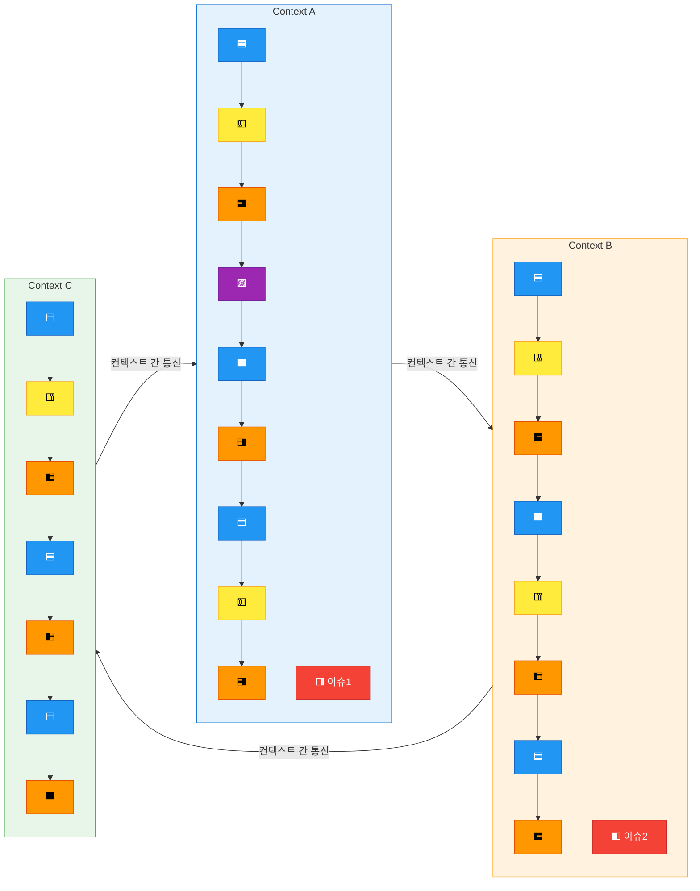

<details>
<summary>📝 원본 텍스트 다이어그램</summary>

```
┌──────────────────────────────────────────────────────┐
│                                                      │
│  ┌─────────────┐  ┌─────────────┐  ┌────────────┐  │
│  │Context A    │  │Context B    │  │Context C   │  │
│  │             │  │             │  │            │  │
│  │ 🟦→🟨→🟧   │  │ 🟦→🟨→🟧   │  │ 🟦→🟨→🟧 │  │
│  │    ↓        │  │    ↓        │  │    ↓       │  │
│  │ 🟪→🟦→🟧   │──│─>🟦→🟨→🟧   │──│─>🟦→🟧   │  │
│  │    ↓        │  │    ↓        │  │    ↓       │  │
│  │ 🟦→🟨→🟧   │  │ 🟦→🟧      │  │ 🟦→🟧    │  │
│  │             │  │             │  │            │  │
│  │ 🟥 이슈1   │  │ 🟥 이슈2   │  │            │  │
│  └─────────────┘  └─────────────┘  └────────────┘  │
│        ↑                  ↓              ↑          │
│        └──────────────────┴──────────────┘          │
│               (컨텍스트 간 통신)                    │
└──────────────────────────────────────────────────────┘
```

</details>

---

## 8. 컨텍스트 간 관계 패턴

### Pattern 1: Customer-Supplier (고객-공급자)

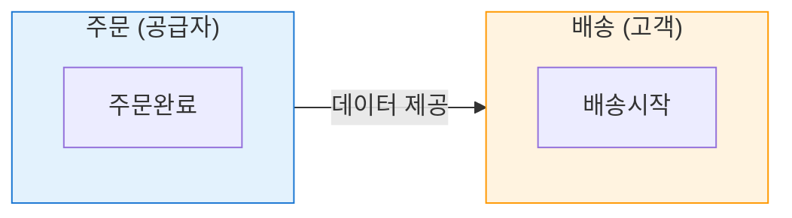

**특징:**
- 주문 컨텍스트가 배송에 필요한 정보 제공
- 명확한 인터페이스 정의 필요

<details>
<summary>📝 원본 텍스트 다이어그램</summary>

```
┌────────────┐          ┌────────────┐
│  주문      │          │  배송      │
│            │          │            │
│  주문완료  │───데이터→│  배송시작  │
│            │   제공   │            │
└────────────┘          └────────────┘
  (공급자)                (고객)

• 주문 컨텍스트가 배송에 필요한 정보 제공
• 명확한 인터페이스 정의 필요
```

</details>

### Pattern 2: Shared Kernel (공유 커널)

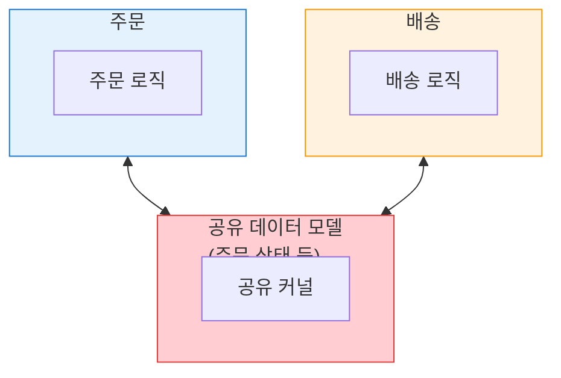

**특징:**
- 두 컨텍스트가 일부 모델 공유
- 변경 시 양쪽 모두 영향받음
- 긴밀한 협업 필요

<details>
<summary>📝 원본 텍스트 다이어그램</summary>

```
┌────────────┐          ┌────────────┐
│  주문      │          │  배송      │
│            │          │            │
│     ┌──────┴──────────┴──────┐    │
│     │   공유 데이터 모델     │    │
│     │   (주문 상태 등)       │    │
│     └────────────────────────┘    │
│            │          │            │
└────────────┘          └────────────┘

• 두 컨텍스트가 일부 모델 공유
• 변경 시 양쪽 모두 영향받음
• 긴밀한 협업 필요
```

</details>

### Pattern 3: Anti-Corruption Layer (부패 방지 계층)

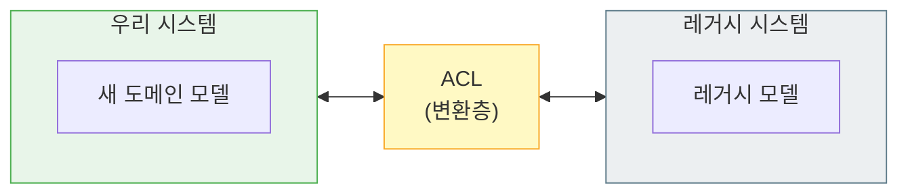

**특징:**
- 레거시 시스템의 복잡도로부터 보호
- 데이터 변환/매핑 수행

<details>
<summary>📝 원본 텍스트 다이어그램</summary>

```
┌────────────┐          ┌────────────┐
│  우리 시스템│          │ 레거시     │
│            │          │ 시스템     │
│            │  ┌─────┐ │            │
│            │←→│ ACL │←→            │
│            │  └─────┘ │            │
│            │  (변환층)│            │
└────────────┘          └────────────┘

• 레거시 시스템의 복잡도로부터 보호
• 데이터 변환/매핑 수행
```

</details>

### Pattern 4: Published Language (공개 언어)

```mermaid
flowchart TB
    subgraph SysA["시스템 A"]
        A1["API 호출"]
    end

    subgraph SysB["시스템 B"]
        B1["API 수신"]
    end

    SysA -->|"JSON API"| SysB

    Schema["공통 스키마 문서<br/>(OpenAPI, GraphQL 등)"]

    SysA -.-> Schema
    SysB -.-> Schema

    style SysA fill:#E3F2FD,stroke:#1976D2
    style SysB fill:#FFF3E0,stroke:#FF9800
    style Schema fill:#F3E5F5,stroke:#9C27B0
```

**특징:**
- 표준화된 통신 방식
- 문서화된 인터페이스

<details>
<summary>📝 원본 텍스트 다이어그램</summary>

```
┌────────────┐          ┌────────────┐
│  시스템 A  │          │  시스템 B  │
│            │  JSON    │            │
│            │───API───→│            │
│            │          │            │
└────────────┘          └────────────┘
        ↓                      ↓
    공통 스키마 문서
    (OpenAPI, GraphQL 등)

• 표준화된 통신 방식
• 문서화된 인터페이스
```

</details>

---

## 9. 실전 예시: 은행 시스템

### 전체 도메인 맵

```mermaid
flowchart TB
    subgraph Customer["고객관리"]
        C1["🟧 고객등록"]
        C2["🟧 KYC완료"]
    end

    subgraph Account["계좌관리"]
        A1["🟧 계좌개설"]
        A2["🟧 한도설정"]
    end

    subgraph Transaction["거래처리"]
        T1["🟧 입금완료"]
        T2["🟧 출금완료"]
        T3["🟧 이체완료"]
    end

    subgraph Loan["대출관리"]
        L1["🟧 대출신청"]
        L2["🟧 심사완료"]
        L3["🟧 대출실행"]
    end

    subgraph Card["카드관리"]
        CD1["🟧 카드발급"]
        CD2["🟧 결제승인"]
    end

    subgraph Notification["알림서비스"]
        N1["🟧 SMS발송"]
        N2["🟧 푸시발송"]
    end

    Customer --> Account
    Account --> Transaction
    Account --> Card
    Transaction --> Notification
    Card --> Loan
    Notification --> Card

    style Customer fill:#E3F2FD,stroke:#1976D2
    style Account fill:#FFF3E0,stroke:#FF9800
    style Transaction fill:#E8F5E9,stroke:#4CAF50
    style Loan fill:#FCE4EC,stroke:#E91E63
    style Card fill:#F3E5F5,stroke:#9C27B0
    style Notification fill:#ECEFF1,stroke:#607D8B
```

**핵심 핫스팟:**
- 🟥 실시간 잔액 동기화 문제
- 🟥 대출-계좌 간 데이터 정합성
- 🟥 카드 결제 시 한도 체크 타이밍

<details>
<summary>📝 원본 텍스트 다이어그램</summary>

```
┌──────────────────────────────────────────────────────────────────┐
│                      은행 MSA 시스템                             │
└──────────────────────────────────────────────────────────────────┘

┌─────────────┐    ┌─────────────┐    ┌─────────────┐
│ 고객관리    │    │ 계좌관리    │    │ 거래처리    │
│             │    │             │    │             │
│ 🟧 고객등록 │───>│ 🟧 계좌개설│───>│ 🟧 입금완료│
│ 🟧 KYC완료  │    │ 🟧 한도설정│    │ 🟧 출금완료│
│             │    │             │    │ 🟧 이체완료│
└─────────────┘    └─────────────┘    └─────────────┘
                            │                  │
                            │                  │
                            ▼                  ▼
┌─────────────┐    ┌─────────────┐    ┌─────────────┐
│ 대출관리    │    │ 카드관리    │    │ 알림서비스  │
│             │    │             │    │             │
│ 🟧 대출신청│<───│ 🟧 카드발급│    │ 🟧 SMS발송 │
│ 🟧 심사완료│    │ 🟧 결제승인│<───│ 🟧 푸시발송│
│ 🟧 대출실행│    │             │    │             │
└─────────────┘    └─────────────┘    └─────────────┘

핵심 핫스팟:
🟥 실시간 잔액 동기화 문제
🟥 대출-계좌 간 데이터 정합성
🟥 카드 결제 시 한도 체크 타이밍
```

</details>

### 상세 흐름: 계좌 이체 프로세스

```mermaid
flowchart TB
    Actor["🧑 고객"]:::actor
    Actor --> C1["이체 요청"]:::command
    C1 --> E1["이체가 요청되었다"]:::event

    E1 --> P1["잔액확인"]:::policy
    E1 --> P2["한도확인"]:::policy
    E1 --> P3["수취인확인"]:::policy

    P1 & P2 & P3 --> C2["출금처리"]:::command
    C2 --> A1["출금계좌"]:::aggregate
    A1 --> E2["출금이 완료되었다"]:::event

    E2 --> C3["입금처리"]:::command
    C3 --> A2["입금계좌"]:::aggregate
    A2 --> E3["입금이 완료되었다"]:::event

    E3 --> E4["이체가 완료되었다"]:::event
    E4 --> P4["이체 완료 알림"]:::policy
    P4 --> X1["알림 서비스"]:::external
    X1 --> E5["알림이 발송되었다"]:::event

    H1["🟥 핫스팟: 중간 실패 시<br/>보상 트랜잭션 처리"]:::hotspot
    H2["🟥 핫스팟: 동시 이체 시<br/>잔액 동시성 문제"]:::hotspot

    classDef actor fill:#E1F5FE,color:#000,stroke:#0288D1
    classDef command fill:#2196F3,color:#fff,stroke:#1565C0
    classDef event fill:#FF9800,color:#000,stroke:#E65100
    classDef aggregate fill:#FFEB3B,color:#000,stroke:#F9A825
    classDef policy fill:#9C27B0,color:#fff,stroke:#6A1B9A
    classDef external fill:#4CAF50,color:#fff,stroke:#2E7D32
    classDef hotspot fill:#F44336,color:#fff,stroke:#C62828
```

<details>
<summary>📝 원본 텍스트 다이어그램</summary>

```
[고객] 🧑
   │
   ▼
🟦 이체 요청
   │
   ▼
🟧 이체가 요청되었다
   │
   ├──────────┬──────────┐
   ▼          ▼          ▼
🟪 잔액확인  🟪 한도확인  🟪 수취인확인
   │          │          │
   └──────────┴──────────┘
             │
             ▼
🟦 [출금처리]
   │
   ▼  🟨
🟧 출금계좌 ─ 출금이 완료되었다
   │
   ▼
🟦 [입금처리]
   │
   ▼  🟨
🟧 입금계좌 ─ 입금이 완료되었다
   │
   ▼
🟧 이체가 완료되었다
   │
   ▼
🟪 "이체 완료 알림"
   │
   ▼
🟩 알림 서비스
   │
   ▼
🟧 알림이 발송되었다

🟥 핫스팟: 중간 실패 시 보상 트랜잭션 처리
🟥 핫스팟: 동시 이체 시 잔액 동시성 문제
```

</details>

---

## 10. 체크리스트 템플릿

### 워크샵 전 체크리스트
```
□ 준비물
  □ 오렌지 포스트잇 (500장+)
  □ 파란색 포스트잇 (200장)
  □ 노란색 포스트잇 (200장)
  □ 연보라색 포스트잇 (100장)
  □ 분홍색 포스트잇 (100장)
  □ 연두색 포스트잇 (50장)
  □ 대형 포스트잇 (20장)
  □ 마커펜 (10개+)
  □ 마스킹 테이프

□ 공간
  □ 넓은 회의실 예약
  □ 화이트보드/벽면 확보 (3m+)
  □ 테이블 배치
  □ 카메라/스마트폰 (사진 촬영용)

□ 참석자
  □ 초대 메일 발송
  □ 사전 자료 공유
  □ 일정 확정

□ 기타
  □ 현재 시스템 자료 준비
  □ 다과 준비
  □ 타이머/시계 준비
```

### 워크샵 중 퍼실리테이터 체크리스트
```
□ Phase별 시간 체크
  □ 오프닝 (30분)
  □ 개념 설명 (30분)
  □ 이벤트 도출 (90분)
  □ 정렬 (75분)
  □ 커맨드/액터 (60분)
  □ 애그리게잇/정책 (60분)
  □ 컨텍스트 (45분)
  □ 정리 (30분)

□ 참여 관리
  □ 모든 참석자 발언 기회 제공
  □ 도미네이팅 방지
  □ 조용한 사람 독려

□ 결과물 관리
  □ 중간 사진 촬영
  □ 핫스팟 기록
  □ 주요 결정사항 메모
```

### 워크샵 후 체크리스트
```
□ 즉시 (당일)
  □ 화이트보드 전체 사진
  □ 각 컨텍스트별 클로즈업
  □ 핫스팟 리스트 정리
  □ 참석자 감사 메일

□ 1주일 이내
  □ 디지털화 (Miro/Mural)
  □ 결과 문서 작성
  □ 전체 공유

□ 2주일 이내
  □ 바운디드 컨텍스트 상세 정의
  □ 마이크로서비스 후보 도출
  □ 기술 스택 검토

□ 1개월 이내
  □ 검증 워크샵 (필요시)
  □ MSA 로드맵 수립
  □ POC 계획
```

---

## 11. 디지털 도구 활용

### Miro 보드 구성 예시
```
┌──────────────────────────────────────────────────────────────┐
│                     Miro Board Layout                        │
├──────────────────────────────────────────────────────────────┤
│                                                              │
│  [프레임 1: 전체 타임라인]                                  │
│  ┌────────────────────────────────────────────────────┐     │
│  │  🟧 → 🟧 → 🟧 → 🟧 → 🟧                          │     │
│  └────────────────────────────────────────────────────┘     │
│                                                              │
│  [프레임 2: 컨텍스트 A]   [프레임 3: 컨텍스트 B]           │
│  ┌──────────────────┐      ┌──────────────────┐            │
│  │  🟦 → 🟨 → 🟧   │      │  🟦 → 🟨 → 🟧   │            │
│  └──────────────────┘      └──────────────────┘            │
│                                                              │
│  [프레임 4: 핫스팟]        [프레임 5: 액션 아이템]         │
│  ┌──────────────────┐      ┌──────────────────┐            │
│  │ 🟥 이슈1        │      │ ☑ TODO 1        │            │
│  │ 🟥 이슈2        │      │ ☑ TODO 2        │            │
│  └──────────────────┘      └──────────────────┘            │
│                                                              │
└──────────────────────────────────────────────────────────────┘
```

### 추천 도구
```
물리적 워크샵:
  - 포스트잇 + 화이트보드 (Best!)
  - 즉각적인 협업
  - 촉각적 경험

온라인 워크샵:
  - Miro (https://miro.com)
    ✓ 실시간 협업
    ✓ 무한 캔버스
    ✓ 템플릿 제공

  - Mural (https://mural.co)
    ✓ 워크샵 특화
    ✓ 타이머 내장

  - EventStorming.com
    ✓ 전문 도구
    ✓ 이벤트 스토밍 전용

디지털화 도구:
  - Lucidchart (다이어그램)
  - Draw.io (무료)
  - PlantUML (코드 기반)
```

---

## 12. 마무리 팁

### 성공적인 이벤트 스토밍을 위한 핵심
```
┌─────────────────────────────────────────────┐
│          ✓ DO (꼭 하세요)                   │
├─────────────────────────────────────────────┤
│ • 안전한 분위기 조성                        │
│ • 모든 의견 존중                            │
│ • 비즈니스 언어 사용                        │
│ • 시각화에 집중                             │
│ • 휴식 시간 엄수                            │
│ • 에너지 레벨 유지                          │
│ • 핫스팟 활용 (논쟁 방지)                   │
└─────────────────────────────────────────────┘

┌─────────────────────────────────────────────┐
│          ✗ DON'T (피하세요)                 │
├─────────────────────────────────────────────┤
│ • 기술 구현 논의                            │
│ • 완벽주의 추구                             │
│ • 정답 강요                                 │
│ • 소수 의견 독점                            │
│ • 시간 무시                                 │
│ • 지루한 진행                               │
│ • 결과물 방치                               │
└─────────────────────────────────────────────┘
```

### 기억할 것
```
"이벤트 스토밍은 완벽한 모델을 만드는 것이 아니라,
 함께 도메인을 이해하는 여정입니다."

"80%의 완성도로 충분합니다.
 나머지 20%는 실제 개발하면서 개선하면 됩니다."

"핫스팟(문제점)을 발견하는 것이
 오히려 워크샵의 가장 큰 성과입니다."
```
