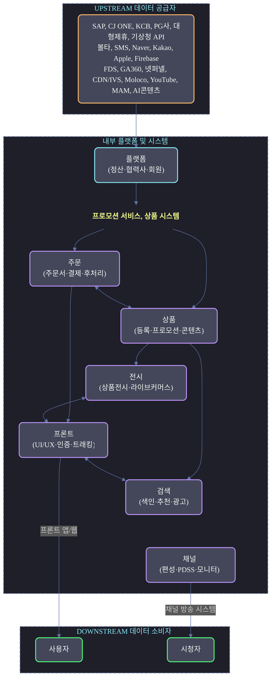
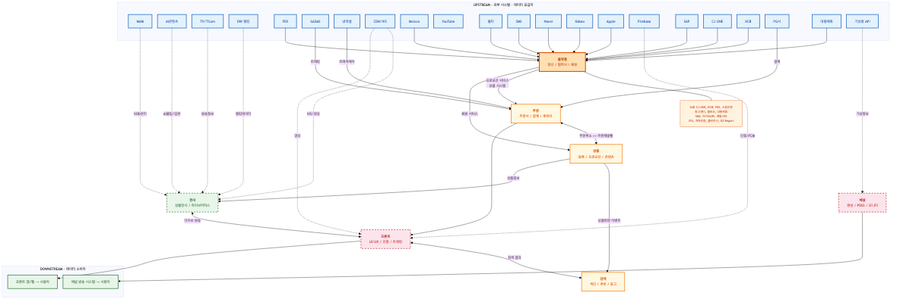

# 외부 시스템 의존성 종합 분석 (Cross-Team External System Dependency Map)

> **작성 기준**: 각 부서별 최종 이벤트 스토밍 워크샵 검토 문서
> **분석 일자**: 2026-03-27
> **방법론 참조**: Alberto Brandolini의 EventStorming, Nick Tune의 Context Mapping, Vaughn Vernon의 Strategic DDD

---

## 1. 분석 개요

### 1.1 목적

이벤트 스토밍 워크샵에서 식별된 **외부 시스템(🟩 Green)** 을 전사적으로 종합하여, MSA 전환 시 서비스 간 의존성과 통합 전략 수립의 기초 자료를 제공한다.

Alberto Brandolini는 이벤트 스토밍에서 외부 시스템을 **"우리가 통제할 수 없지만, 우리 도메인이 의존하는 시스템"** 으로 정의한다. 이는 MSA 경계를 설정할 때 **Anti-Corruption Layer(ACL)** 또는 **Open Host Service(OHS)** 패턴 적용 대상을 결정하는 핵심 입력이 된다.

### 1.2 분석 대상 부서 및 워크샵 차수

| 부서 | 최종 워크샵 | 외부 시스템 식별 현황 | 성숙도 |
|------|-----------|-------------------|--------|
| 플랫폼개발팀 | 3차 | ~30개 (통합 시 ~20그룹) | ●●●●○ |
| 주문서비스팀 | 3차 | 10개 식별 + 5개 후보 | ●●●○○ |
| 검색서비스팀 | 3차 | 8개 식별 + 2개 교정 | ●●●○○ |
| 상품서비스팀 | 3차 | 7개 식별 (실질 4그룹) | ●●○○○ |
| 전시서비스팀 | 2차 | 0개 (추론 후보 9개) | ●○○○○ |
| 프론트개발팀 | 2차 | 0개 (추론 후보 5개) | ●○○○○ |
| 채널시스템 | 2차 | 0개 (교정 후보 6개) | ●○○○○ |

### 1.3 용어 정의

| 용어 | 설명 |
|------|------|
| **External System** | 해당 팀의 도메인 바운더리 밖에 존재하며, API·배치·이벤트로 연동되는 시스템 |
| **Upstream** | 데이터를 제공하는 쪽 (공급자) |
| **Downstream** | 데이터를 소비하는 쪽 (수요자) |
| **ACL (Anti-Corruption Layer)** | 외부 시스템의 모델이 내부 도메인을 오염시키지 않도록 변환하는 계층 |
| **OHS (Open Host Service)** | 다수의 소비자에게 표준 인터페이스를 제공하는 서비스 |

---

## 2. 전사 외부 시스템 인벤토리 (Unified Inventory)

워크샵에서 도출된 모든 외부 시스템을 **기능 카테고리**별로 통합·중복 제거한 결과이다.

### 2.1 카테고리별 외부 시스템 목록

#### A. ERP / 재무 시스템

| # | 외부 시스템 | 기능 | 의존 부서 | 연동 방식 |
|---|-----------|------|----------|----------|
| A1 | **SAP** | 정산 데이터 전송, 세금계산서 | 플랫폼(정산), 플랫폼(협력사) | Batch/API |
| A2 | **e-accounting** | 회계 연동 | 플랫폼(정산) | Batch |
| A3 | **볼타 API (Volta)** | 세금계산서, 회계 처리 | 플랫폼(정산) | API |
| A4 | **이커머스 세금계산서 API** | 전사 세금계산서 스위칭 | 채널시스템(PDSS) | API |

#### B. 인증 / 보안

| # | 외부 시스템 | 기능 | 의존 부서 | 연동 방식 |
|---|-----------|------|----------|----------|
| B1 | **KCB (본인인증)** | 실명 인증 | 플랫폼(회원), 주문(인증) | API |
| B2 | **KMS (Key Management)** | 암호화 키 관리 | 플랫폼(회원) | API |
| B3 | **FDS (Fraud Detection)** | 부정거래 탐지 | 플랫폼(회원), 주문(진입) | API |
| B4 | **Naver 인증** | 소셜 로그인 | 플랫폼(회원), 프론트(인증) | OAuth |
| B5 | **Kakao 인증** | 소셜 로그인 | 플랫폼(회원), 프론트(인증) | OAuth |
| B6 | **Apple 인증** | 소셜 로그인 | 플랫폼(회원) | OAuth |
| B7 | **Firebase** | 인증, Remote Config, FCM | 프론트(인증/트래킹) | SDK |

#### C. 결제 / 포인트

| # | 외부 시스템 | 기능 | 의존 부서 | 연동 방식 |
|---|-----------|------|----------|----------|
| C1 | **CJ ONE** | 포인트 지급/사용, 회원 검증, 멤버십 | 플랫폼(정산·회원), 프론트(멤버십) | API |
| C2 | **결제 서비스 (PG사)** | 결제수단, 카드 즉시할인, 결제 인증 | 주문(정보수집·인증), 프론트(주문) | API |
| C3 | **외부 포인트 서비스** | 외부 제휴 포인트 조회 | 주문(결제계산) | API |
| C4 | **내부 통합 포인트 서비스** | 내부 포인트 통합 조회 | 주문(결제계산) | API |

#### D. 광고 / 분석

| # | 외부 시스템 | 기능 | 의존 부서 | 연동 방식 |
|---|-----------|------|----------|----------|
| D1 | **광고센터** | 광고 관리 | 플랫폼(정산) | API |
| D2 | **몰로코 API (Moloco)** | 광고 크레딧 차감 | 플랫폼(정산) | API |
| D3 | **유튜브 GCP** | 영상 광고 연동 | 플랫폼(정산) | API |
| D4 | **GA360** | 이벤트 트래킹/분석 | 주문(전과정), 프론트(트래킹) | SDK |
| D5 | **EVENT-이벤트 데이터** | 이벤트 데이터 수집 | 주문(전과정) | API |
| D6 | **추천 API** | 추천 상품 서빙 | 검색(추천/광고), 전시(추천모듈) | API |
| D7 | **광고 API** | 광고 상품 서빙 | 검색(추천/광고) | API |
| D8 | **AI 콘텐츠 서비스** | AI 클립 생성, AI 채팅 답변 | 전시(라이브 커머스) | API |

#### E. 대형 제휴 / 파트너

| # | 외부 시스템 | 기능 | 의존 부서 | 연동 방식 |
|---|-----------|------|----------|----------|
| E1 | **대형제휴 API** (이베이·11번가·쿠팡·롯데온·SSG) | 제휴사 대사 | 플랫폼(정산), 상품(제휴) | API/Batch |
| E2 | **OK캐쉬백 / 아시아나 / 애드럭** | 포인트 연동 | 플랫폼(정산) | API |
| E3 | **이커머스 공급업체 API** | 공급업체 정보 조회 | 채널시스템(PDSS) | API |
| E4 | **TCOM 연동 API** | 외부 시스템 연동 | 채널시스템(편성) | API |

#### F. 통신 / 알림

| # | 외부 시스템 | 기능 | 의존 부서 | 연동 방식 |
|---|-----------|------|----------|----------|
| F1 | **SMS 서버** | SMS 발송 | 플랫폼(회원·정산) | API |
| F2 | **카카오 API / 메일서버** | 카카오톡 알림, 이메일 | 플랫폼(회원·정산), 주문(후처리) | API |
| F3 | **알림톡 서비스** | 주문완료 알림 | 주문(후처리) | API |

#### G. 상품 / 물류 / 재고

| # | 외부 시스템 | 기능 | 의존 부서 | 연동 방식 |
|---|-----------|------|----------|----------|
| G1 | **상품 시스템 (상품 서비스)** | 상품 기본정보, 방송정보 조회 | 주문(정보수집), 플랫폼(정산), 전시(상품전시·상세) | API |
| G2 | **상품정보 통합 DB** | 상품 데이터 소스 (색인용) | 검색(전체색인·증분색인) | DB/Batch |
| G3 | **상품정보 등록/수정** | 상품 변경 트리거 | 검색(증분색인) | Event |
| G4 | **상품 재입고** | 재입고 트리거 | 검색(증분색인) | Event |
| G5 | **공급계획 (물류)** | 공급계획 등록 | 상품(등록/승인) | API |
| G6 | **품질인증 QC** | QC 패스 | 상품(등록/승인) | API |
| G7 | **재고 관리 서비스** | 재고 차감·검증 | 주문(검증/생성), 전시(품절확인) | API |
| G8 | **출하지시 API** | 창고 출하 | 플랫폼(협력사) | API |

#### H. 프로모션 / 쿠폰

| # | 외부 시스템 | 기능 | 의존 부서 | 연동 방식 |
|---|-----------|------|----------|----------|
| H1 | **프로모션 서비스** | 프로모션·쿠폰·할인 정보 | 주문(정보수집), 플랫폼(정산·회원), 전시(프로모션노출) | API |
| H2 | **프로모션 배리 시스템** | 프로모션 변형 관리 | 플랫폼(정산) | API |
| H3 | **할인쿠폰 변경** | 쿠폰/할인 변경 트리거 | 검색(증분색인) | Event |

#### I. 인프라 / 기타

| # | 외부 시스템 | 기능 | 의존 부서 | 연동 방식 |
|---|-----------|------|----------|----------|
| I1 | **배치 시스템 Jenkins** | 전체 색인·로그 수집 실행 | 검색(전체색인·로그) | Batch |
| I2 | **DW 로그정보** | 검색 로그 소스 | 검색(키워드관리) | Batch |
| I3 | **실시간 오로라 로그정보** | 실시간 검색 로그 | 검색(키워드관리) | Streaming |
| I4 | **전시-넷퍼넬 (Netfunnel)** | 트래픽 제어(대기열) | 주문(진입) | SDK |
| I5 | **주소 검색 서비스** | 주소 검색 API | 플랫폼(회원) | API |
| I6 | **사업자등록증 CFS** | 문서 이미지 저장 | 플랫폼(협력사) | API |
| I7 | **계좌인증** | 계좌 실명 검증 | 플랫폼(협력사) | API |
| I8 | **OZ Report** | 리포트 출력 | 플랫폼(협력사) | API |
| I9 | **CDN / 영상 서비스 / IVS** | 라이브·VOD 스트리밍, IVS 방송 송출 | 프론트(라이브/영상), 전시(라이브 커머스) | CDN/SDK |
| I10 | **기상청 API** | 기상 정보 수집 | 채널시스템(타사모니터) | API |
| I15 | **MAM (Media Asset Management)** | VOD 업로드/관리, 클립 영상 저장 | 전시(라이브 커머스) | API |
| I16 | **DW 랭킹 데이터** | PV 랭킹, 판매 랭킹 데이터 | 전시(랭킹/노출) | Batch |
| I17 | **TV/TCom 방송 시스템** | TV 편성정보, 방송 종료 이벤트 | 전시(편성연동) | API/Event |
| I11 | **주문 시스템** | 주문가능 수량 조회 | 채널시스템(편성), 상품(쿠폰) | API |
| I12 | **편성정보 API** | 편성 정보 제공 | 채널시스템(편성) | API |
| I13 | **현금영수증 서비스** | 현금영수증 발행 | 주문(후처리) | API |
| I14 | **회원 서비스 (회원 시스템)** | 고객정보·멤버십 조회, Q&A이관, 리뷰포인트 | 주문(정보수집), 상품(콘텐츠) | API |

**전사 외부 시스템 총계: 59개 (중복 통합 시 약 48개 그룹)**
> 전시서비스팀 추가 반영: MAM, AI 콘텐츠 서비스, DW 랭킹 데이터, TV/TCom 방송 시스템 (+4개 신규), 기존 시스템 의존 부서 추가 (상품·추천·재고·프로모션·CDN/IVS)

---

## 3. 부서 × 외부 시스템 의존성 매트릭스 (Dependency Matrix)

> ● = 직접 의존 (API/이벤트 호출), ○ = 간접 의존 또는 후보, △ = 교정 필요

| 카테고리 | 외부 시스템 | 플랫폼 | 주문 | 검색 | 상품 | 전시 | 프론트 | 채널 |
|---------|-----------|:------:|:----:|:----:|:----:|:----:|:------:|:----:|
| **ERP/재무** | SAP | ● | | | | | | |
| | e-accounting | ● | | | | | | |
| | 볼타 API | ● | | | | | | |
| | 이커머스 세금계산서 API | | | | | | | △ |
| **인증/보안** | KCB 본인인증 | ● | ○ | | | | | |
| | KMS | ● | | | | | | |
| | FDS | ● | ● | | | | | |
| | Naver 인증 | ● | | | | | ○ | |
| | Kakao 인증 | ● | | | | | ○ | |
| | Apple 인증 | ● | | | | | | |
| | Firebase | | | | | | ○ | |
| **결제/포인트** | CJ ONE | ● | | | | | ○ | |
| | 결제 서비스 (PG사) | | ● | | | | ○ | |
| | 외부 포인트 서비스 | | ● | | | | | |
| | 내부 통합 포인트 서비스 | | ● | | | | | |
| **광고/분석** | 광고센터 | ● | | | | | | |
| | 몰로코 API | ● | | | | | | |
| | 유튜브 GCP | ● | | | | | | |
| | GA360 | | ● | | | | ○ | |
| | 추천 API | | | ● | | ○ | | |
| | 광고 API | | | ● | | | | |
| | AI 콘텐츠 서비스 | | | | | ○ | | |
| **제휴/파트너** | 대형제휴 API | ● | | | ● | | | |
| | OK캐쉬백/아시아나 | ● | | | | | | |
| | 이커머스 공급업체 API | | | | | | | △ |
| | TCOM 연동 API | | | | | | | △ |
| **통신/알림** | SMS 서버 | ● | | | | | | |
| | 카카오 API / 메일서버 | ● | ○ | | | | | |
| | 알림톡 서비스 | | ○ | | | | | |
| **상품/물류** | 상품 서비스 | ○ | ● | | | ○ | | |
| | 상품정보 통합 DB | | | ● | | | | |
| | 상품정보 등록/수정 | | | ● | | | | |
| | 상품 재입고 | | | ● | | | | |
| | 공급계획 (물류) | | | | ● | | | |
| | 품질인증 QC | | | | ● | | | |
| | 재고 관리 서비스 | | ○ | | | ○ | | |
| | 출하지시 API | ● | | | | | | |
| **프로모션** | 프로모션 서비스 | ● | ● | | | ○ | | |
| | 할인쿠폰 변경 | | | ● | | | | |
| **인프라/기타** | 배치 Jenkins | | | ● | | | | |
| | DW 로그정보 | | | ● | | | | |
| | DW 랭킹 데이터 | | | | | ○ | | |
| | 넷퍼넬 | | ● | | | | | |
| | CDN / 영상 서비스 / IVS | | | | | ○ | ○ | |
| | MAM (영상 관리) | | | | | ○ | | |
| | TV/TCom 방송 시스템 | | | | | ○ | | |
| | 기상청 API | | | | | | | △ |
| | 회원 서비스 | | ● | | ● | | | |
| **의존 시스템 수** | | **~20** | **~10+5후보** | **~10** | **~7** | **~9후보** | **~5후보** | **~6후보** |

---

## 4. 도메인 영역별 외부 시스템 의존도 분석

### 4.1 의존도 히트맵 (Dependency Heatmap)

```
높음 ■■■■■  (15+)    보통 ■■■ (8~14)    낮음 ■■ (3~7)    미식별 □ (0~2)

플랫폼 - 정산         ■■■■■  SAP, e-accounting, 볼타, 광고센터, 몰로코, 유튜브, 대형제휴, 제휴사, CJ ONE...
플랫폼 - 협력사       ■■■    SAP, CFS, 계좌인증, 출하지시, OZ Report
플랫폼 - 회원         ■■■■■  KCB, KMS, FDS, Naver/Kakao/Apple, SMS, CJ ONE, 주소검색...
주문 - 정보수집       ■■■■■  상품, 프로모션, 회원, 결제, 포인트(내부/외부), FDS, GA360, 넷퍼넬
주문 - 인증/생성      □      본인인증, PG사, 재고관리 (후보 - 미식별)
주문 - 후처리         □      알림톡, 현금영수증 (후보 - 미식별)
검색 - 색인           ■■■    상품정보 통합DB, 상품정보 등록/수정, 상품 재입고, Jenkins, 할인쿠폰
검색 - 로그/키워드    ■■     DW 로그, 오로라 로그, Jenkins
검색 - 추천/광고      ■■     추천 API, 광고 API
상품 - 등록/승인      ■■     공급계획, QC, 제휴사, 대형제휴사
상품 - 콘텐츠         ■■     회원 시스템 (x2)
전시 - 라이브커머스   ■■■    CDN/IVS, MAM, AI콘텐츠, TV/TCom, 상품서비스 (후보 - 미식별)
전시 - 상품전시/상세  ■■     상품 서비스, 추천 API, 재고관리, 프로모션, DW 랭킹 (후보 - 미식별)
프론트 - 전체         □      Firebase, GA, PG사, CJ ONE, CDN (후보 - 미식별)
채널 - 전체           □      이커머스API, TCOM, 기상청, 주문시스템, 편성API (후보 - 미식별)
```

### 4.2 의존 방향 분석 (Upstream / Downstream)

```
┌────────────────────────────────────────────────────────────────────────┐
│                         UPSTREAM (데이터 공급자)                        │
│                                                                        │
│   SAP    CJ ONE    KCB     PG사    대형제휴     기상청 API             │
│   볼타    SMS     Naver    Kakao   Apple       Firebase               │
│   FDS    GA360    넷퍼넬   CDN     Moloco      YouTube                │
│                                                                        │
├────────────────────────────────────────────────────────────────────────┤
│                                                                        │
│                    ┌──────────┐                                         │
│                    │  플랫폼  │ ←─ SAP, CJ ONE, KCB, FDS, 소셜인증    │
│                    │  (정산·  │ ←─ 광고센터, 몰로코, 대형제휴          │
│                    │  협력사· │ ←─ SMS, 카카오API, 메일서버            │
│                    │  회원)   │ ←─ CFS, 계좌인증, 출하지시, OZ Report  │
│                    └────┬─────┘                                         │
│                         │ 프로모션 서비스, 상품 시스템                   │
│                         ▼                                               │
│         ┌──────────┐         ┌──────────┐                              │
│         │   주문   │ ←─────→ │   상품   │                              │
│         │ (주문서· │         │ (등록·   │                              │
│         │  결제·   │         │  프로모션·│                              │
│         │  후처리) │         │  콘텐츠) │                              │
│         └────┬─────┘         └────┬─────┘                              │
│              │                    │                                     │
│              ▼                    ▼                                     │
│    ┌──────────┐  ┌──────────┐  ┌──────────┐  ┌──────────┐          │
│    │  프론트  │  │   전시   │  │   검색   │  │   채널   │          │
│    │ (UI/UX· │  │ (상품전시·│  │ (색인·   │  │ (편성·   │          │
│    │  인증·  │  │  라이브  │  │  추천·   │  │  PDSS·   │          │
│    │  트래킹) │  │  커머스) │  │  광고)   │  │  모니터) │          │
│    └──────────┘  └──────────┘  └──────────┘  └──────────┘          │
│                        │ ← 상품, 추천, CDN/IVS, MAM, AI콘텐츠     │
│                                                                        │
├────────────────────────────────────────────────────────────────────────┤
│                       DOWNSTREAM (데이터 소비자)                        │
│                                                                        │
│   프론트 앱/웹 → 사용자    채널 방송 시스템 → 시청자                    │
│                                                                        │
└────────────────────────────────────────────────────────────────────────┘
```







```mermaid
%%{init: {'theme': 'base', 'themeVariables': {'fontSize': '13px'}, 'flowchart': {'nodeSpacing': 20, 'rankSpacing': 45, 'curve': 'basis'}} }%%
flowchart TB

    subgraph UPSTREAM["UPSTREAM  -  외부 시스템 · 데이터 공급자"]
        direction TB
        subgraph UR1[" "]
            direction LR
            SAP["SAP"]
            CJONE["CJ ONE"]
            KCB["KCB"]
            PG["PG사"]
            BIG5["대형제휴"]
            WEATHER["기상청 API"]
        end
        subgraph UR2[" "]
            direction LR
            VOLTA["볼타"]
            SMS["SMS"]
            NAVER["Naver"]
            KAKAO["Kakao"]
            APPLE["Apple"]
            FIREBASE["Firebase"]
        end
        subgraph UR3[" "]
            direction LR
            FDS["FDS"]
            GA360["GA360"]
            NETFUNNEL["넷퍼넬"]
            CDN["CDN/IVS"]
            MOLOCO["Moloco"]
            YOUTUBE["YouTube"]
        end
        subgraph UR4[" "]
            direction LR
            MAM["MAM"]
            AICONTENTS["AI콘텐츠"]
            TVTCOM["TV/TCom"]
            DW_RANK["DW 랭킹"]
        end
    end

    PLAT["<b>플랫폼</b>\n정산 / 협력사 / 회원"]

    PLAT_L["SAP, CJ ONE, KCB, FDS, 소셜인증\n광고센터, 몰로코, 대형제휴\nSMS, 카카오API, 메일서버\nCFS, 계좌인증, 출하지시, OZ Report"]

    subgraph MID_ROW["  "]
        direction LR
        ORD["<b>주문</b>\n주문서 / 결제 / 후처리"]
        PROD["<b>상품</b>\n등록 / 프로모션 / 콘텐츠"]
    end

    subgraph BOT_ROW["  "]
        direction LR
        FRNT["<b>프론트</b>\nUI/UX / 인증 / 트래킹"]
        DISP["<b>전시</b>\n상품전시 / 라이브커머스"]
        SRCH["<b>검색</b>\n색인 / 추천 / 광고"]
        CHAN["<b>채널</b>\n편성 / PDSS / 모니터"]
    end

    subgraph DOWNSTREAM["DOWNSTREAM  -  데이터 소비자"]
        direction LR
        D1["프론트 앱/웹 → 사용자"]
        D2["채널 방송 시스템 → 시청자"]
    end

    %% Upstream → 플랫폼
    SAP & CJONE & KCB & FDS --> PLAT
    VOLTA & NAVER & KAKAO & APPLE --> PLAT
    MOLOCO & BIG5 & SMS --> PLAT

    %% 플랫폼 ← 의존 목록
    PLAT --- PLAT_L

    %% 플랫폼 → 중간 계층
    PLAT -->|"프로모션 서비스\n상품 시스템"| ORD
    PLAT -->|"회원 서비스"| PROD

    %% Upstream → 주문
    PG -->|"결제"| ORD
    GA360 -->|"트래킹"| ORD
    NETFUNNEL -->|"트래픽제어"| ORD

    %% 주문 ↔ 상품
    ORD <-->|"주문취소 ↔ 쿠폰재발행"| PROD

    %% 중간 → 하단
    ORD --> FRNT
    PROD -->|"상품변경 이벤트"| SRCH
    PROD -->|"상품정보"| DISP

    %% Upstream → 전시 (후보 - 점선)
    CDN -.->|"IVS/영상"| DISP
    MAM -.->|"VOD관리"| DISP
    AICONTENTS -.->|"AI클립/답변"| DISP
    TVTCOM -.->|"방송정보"| DISP
    DW_RANK -.->|"랭킹데이터"| DISP

    %% Upstream → 하단 (후보 - 점선)
    FIREBASE -.->|"인증/FCM"| FRNT
    CDN -.->|"영상"| FRNT
    WEATHER -.->|"기상정보"| CHAN

    %% 하단 내부
    FRNT <-->|"검색 결과"| SRCH
    DISP <-->|"라이브 방송"| FRNT

    %% Downstream
    FRNT --> D1
    CHAN --> D2

    %% 스타일
    classDef upNode fill:#E3F2FD,stroke:#1565C0,stroke-width:2px,color:#0D47A1
    classDef platNode fill:#FFE0B2,stroke:#E65100,stroke-width:3px,color:#BF360C
    classDef platLabel fill:#FFF3E0,stroke:#E65100,stroke-width:1px,color:#BF360C,font-size:11px
    classDef ordNode fill:#FFF8E1,stroke:#F57F17,stroke-width:2px,color:#E65100
    classDef dispNode fill:#E8F5E9,stroke:#2E7D32,stroke-width:2px,stroke-dasharray:5 5,color:#1B5E20
    classDef candidateNode fill:#FCE4EC,stroke:#C62828,stroke-width:2px,stroke-dasharray:5 5,color:#B71C1C
    classDef downNode fill:#E8F5E9,stroke:#2E7D32,stroke-width:2px,color:#1B5E20
    classDef invis fill:none,stroke:none

    class SAP,CJONE,KCB,PG,BIG5,WEATHER,VOLTA,SMS,NAVER,KAKAO,APPLE,FIREBASE,FDS,GA360,NETFUNNEL,CDN,MOLOCO,YOUTUBE,MAM,AICONTENTS,TVTCOM,DW_RANK upNode
    class PLAT platNode
    class PLAT_L platLabel
    class ORD,PROD,SRCH ordNode
    class DISP dispNode
    class FRNT,CHAN candidateNode
    class D1,D2 downNode
    class UR1,UR2,UR3,UR4,MID_ROW,BOT_ROW invis
```

> **범례**: 실선 화살표(→) = 확정된 의존(●), 점선 화살표(-.->) = 후보/미확정(○△)
>
> 

---

## 5. 공유 외부 시스템 분석 (Shared Dependencies)

2개 이상의 부서가 동일 외부 시스템에 의존하는 경우, MSA 전환 시 **통합 게이트웨이** 또는 **공유 서비스** 전략이 필요하다.

### 5.1 다부서 공유 외부 시스템

| 외부 시스템 | 의존 부서 (수) | 상세 | 통합 전략 제안 |
|-----------|:-----------:|------|-------------|
| **CJ ONE** | 3 | 플랫폼(포인트·회원), 주문(포인트), 프론트(멤버십) | **OHS**: CJ ONE Gateway 서비스 신설 |
| **FDS** | 2 | 플랫폼(회원), 주문(진입) | **Shared Kernel**: 보안 공통 모듈 |
| **GA360** | 2 | 주문(트래킹), 프론트(분석) | **인프라 계층 분리**: 도메인 외부 처리 |
| **소셜 인증** (Naver·Kakao·Apple) | 2 | 플랫폼(회원), 프론트(인증) | **OHS**: 통합 인증 서비스 (Auth Service) |
| **결제 서비스 (PG사)** | 2 | 주문(결제), 프론트(결제) | **ACL**: 결제 어댑터 서비스 |
| **프로모션 서비스** | 3 | 플랫폼(정산), 주문(정보수집), 전시(프로모션노출) | **OHS**: 프로모션 API Gateway |
| **상품 서비스/시스템** | 4 | 주문(정보조회), 검색(색인), 플랫폼(정산), 전시(상품전시) | **OHS**: 상품 정보 API Hub |
| **회원 서비스** | 2 | 주문(정보조회), 상품(콘텐츠) | **OHS**: 회원 API Gateway |
| **추천 API** | 2 | 검색(추천/광고), 전시(추천모듈) | **OHS**: 추천 서빙 API Gateway |
| **CDN / 영상 / IVS** | 2 | 프론트(라이브/영상), 전시(라이브 커머스) | **ACL**: 미디어 어댑터 서비스 |
| **재고 관리 서비스** | 2 | 주문(검증/생성), 전시(품절확인) | **OHS**: 재고 API + 이벤트 구독 |
| **대형제휴 API** | 2 | 플랫폼(정산), 상품(제휴연동) | **ACL**: 제휴 어댑터 계층 |
| **SMS / 카카오알림** | 2 | 플랫폼(알림), 주문(후처리) | **OHS**: 통합 알림 서비스 (Notification Hub) |

### 5.2 Context Mapping 패턴 권장

Nick Tune의 Context Mapping 분류에 따라, 각 공유 시스템에 적합한 관계 패턴을 제안한다.

```
┌─────────────────────────────────────────────────────────────────────┐
│                    Context Mapping 패턴 적용 가이드                   │
├──────────────────┬──────────────────────────────────────────────────┤
│ 패턴             │ 적용 대상                                        │
├──────────────────┼──────────────────────────────────────────────────┤
│ Open Host        │ CJ ONE, 상품 서비스, 회원 서비스, 프로모션 서비스 │
│ Service (OHS)    │ → 다수 소비자에게 표준 API 제공                   │
├──────────────────┼──────────────────────────────────────────────────┤
│ Anti-Corruption  │ SAP, PG사, 대형제휴 API, 기상청 API, IVS, MAM    │
│ Layer (ACL)      │ → 외부 모델이 내부 도메인 오염 방지               │
├──────────────────┼──────────────────────────────────────────────────┤
│ Shared Kernel    │ FDS, 인증 서비스                                 │
│                  │ → 보안 관련 공통 도메인 모델 공유                  │
├──────────────────┼──────────────────────────────────────────────────┤
│ Published        │ 상품정보 변경, 재입고, 할인쿠폰 변경             │
│ Language (PL)    │ → 이벤트 기반 비동기 통합                        │
├──────────────────┼──────────────────────────────────────────────────┤
│ Conformist       │ GA360, Firebase, 넷퍼넬                          │
│                  │ → 외부 SDK 모델을 그대로 수용 (변경 불가)         │
└──────────────────┴──────────────────────────────────────────────────┘
```

---

## 6. 연동 방식별 분류

### 6.1 동기 (Synchronous) — API / SDK

실시간 응답이 필요한 연동으로, MSA 전환 시 **Circuit Breaker**, **Timeout**, **Fallback** 전략이 필수이다.

| 패턴 | 외부 시스템 | 호출 부서 | 장애 영향도 |
|------|-----------|----------|:----------:|
| REST API | KCB, FDS, PG사, CJ ONE | 플랫폼, 주문 | 🔴 높음 |
| REST API | 상품 서비스, 회원 서비스, 프로모션 서비스 | 주문 | 🔴 높음 |
| REST API | 추천 API, 광고 API | 검색, 전시 | 🟡 보통 |
| REST API | 대형제휴 API (5개사) | 플랫폼, 상품 | 🟡 보통 |
| OAuth 2.0 | Naver, Kakao, Apple 인증 | 플랫폼, 프론트 | 🟡 보통 |
| REST API | 상품 서비스, AI 콘텐츠 서비스, MAM | 전시 | 🟡 보통 |
| SDK/CDN | IVS (라이브 스트리밍) | 전시 | 🟡 보통 |
| SDK | GA360, Firebase, 넷퍼넬 | 주문, 프론트 | 🟢 낮음 |

### 6.2 비동기 (Asynchronous) — Event / Message

도메인 이벤트 기반 연동으로, 최종 일관성(Eventual Consistency)을 수용하는 영역이다.

| 패턴 | 외부 시스템 | 트리거 | 소비 부서 |
|------|-----------|--------|----------|
| Domain Event | 상품정보 등록/수정 | 상품 변경됨 | 검색 (증분 색인) |
| Domain Event | 상품 재입고 | 재입고됨 | 검색 (증분 색인) |
| Domain Event | 할인쿠폰 변경 | 쿠폰 변경됨 | 검색 (증분 색인) |
| Domain Event | 주문 취소 | 주문 취소됨 | 상품 (쿠폰 재발행) |
| Domain Event | TV 방송 종료 | 방송 종료됨 | 전시 (VOD 클립 생성, 다시보기) |
| Domain Event | 상품 품절/입고 | 재고 변경됨 | 전시 (전시 목록 갱신) |
| Time-Triggered | 할인쿠폰 적용/만료 시간 도래 | 스케줄러 | 검색 |
| Notification | SMS, 카카오 알림톡 | 이벤트 완료 후 | 플랫폼, 주문 |

### 6.3 배치 (Batch) — 주기적 대량 처리

| 패턴 | 외부 시스템 | 주기 | 처리 부서 |
|------|-----------|------|----------|
| Batch ETL | SAP 정산 데이터 전송 | 일간 | 플랫폼 (정산) |
| Batch ETL | DW 로그정보 수집 | 일간 | 검색 (키워드) |
| Batch Index | 상품정보 통합 DB → 전체 색인 | 일간 | 검색 (색인) |
| Batch Report | OZ Report 생성 | 수시 | 플랫폼 (협력사) |
| Batch ETL | DW 랭킹 데이터 → PV/판매 랭킹 | 일간 | 전시 (랭킹/노출) |

---

## 7. 리스크 분석 (Risk Assessment)

### 7.1 단일 장애점 (Single Points of Failure)

장애 시 여러 부서에 동시 영향을 미치는 외부 시스템을 식별한다.

| 위험 등급 | 외부 시스템 | 영향 부서 | 장애 시나리오 | 완화 전략 |
|:--------:|-----------|----------|-------------|----------|
| 🔴 Critical | **CJ ONE** | 플랫폼·주문·프론트 (3) | 포인트 사용/적립 불가, 회원 검증 실패 | Circuit Breaker + Fallback (캐시된 회원 등급) |
| 🔴 Critical | **상품 서비스** | 주문·검색·플랫폼·전시 (4) | 주문서 생성 불가, 색인 중단, 전시 데이터 갱신 불가 | 캐시 레이어 + 비동기 재시도 |
| 🔴 Critical | **PG사 (결제)** | 주문·프론트 (2) | 결제 완전 불가 | Multi-PG 전략, Fallback PG |
| 🟡 High | **FDS** | 플랫폼·주문 (2) | 부정거래 탐지 불가 (보안 위험) | Fail-open 정책 (제한적 허용) + 알림 |
| 🟡 High | **SAP** | 플랫폼 (2 도메인) | 정산 지연, 세금계산서 미발행 | 비동기 큐 + 재처리 배치 |
| 🟡 High | **SMS/카카오 알림** | 플랫폼·주문 (2) | 알림 미발송 | 멀티채널 Fallback (SMS↔카카오) |
| 🟡 High | **IVS (라이브 스트리밍)** | 전시 (1) | MLC 라이브 방송 송출 불가 | 백업 스트림 + 자동 전환 |

### 7.2 과밀 호출 구간 (High Fan-out Zones)

특정 비즈니스 흐름에서 다수의 외부 시스템을 동시 호출하는 구간이다.

```
🔴 주문서 생성 시점 — 7+ 병렬 외부 호출
┌─────────────────────────────────────────────────────────────┐
│  주문 생성 Command                                           │
│      ├─→ 상품 서비스        (상품정보 조회)                   │
│      ├─→ 프로모션 서비스    (할인/쿠폰 조회)                  │
│      ├─→ 회원 서비스        (고객정보·멤버십 조회)            │
│      ├─→ 결제 서비스        (카드 즉시할인 조회)              │
│      ├─→ 외부 포인트 서비스  (외부 포인트 조회)               │
│      ├─→ 내부 포인트 서비스  (내부 포인트 조회)               │
│      ├─→ FDS               (부정거래 탐지)                   │
│      ├─→ GA360             (이벤트 트래킹)                   │
│      └─→ 넷퍼넬            (트래픽 제어)                     │
│                                                              │
│  ⚠️ 위험: 1개라도 지연 시 전체 주문 흐름 블로킹               │
│  💡 대책: 필수/선택 분리, Timeout 차등 설정, 비동기 가능 항목 │
│          분리 (GA360, 넷퍼넬은 fire-and-forget)              │
└─────────────────────────────────────────────────────────────┘

🟡 전시 — 라이브 방송 시작 시점 — 5+ 병렬 외부 호출
┌─────────────────────────────────────────────────────────────┐
│  MLC 방송 시작 Event                                          │
│      ├─→ IVS                (영상 송출 시작)                   │
│      ├─→ 상품 서비스        (방송 상품 정보 조회)              │
│      ├─→ 추천 API           (관련 상품 추천)                   │
│      ├─→ 재고 관리 서비스   (재고 확인)                        │
│      └─→ AI 콘텐츠 서비스   (AI 채팅 준비)                     │
│                                                              │
│  ⚠️ 위험: IVS 장애 시 방송 자체 불가, 핫스팟 "IVS 종료 끊김" │
│  💡 대책: 백업 스트림 전환, 상품/추천은 캐시 Fallback          │
└─────────────────────────────────────────────────────────────┘

🟡 검색 증분 색인 — 3개 이벤트 소스 수렴
┌─────────────────────────────────────────────────────────────┐
│  상품정보 등록/수정 ─┐                                       │
│  상품 재입고        ─┼─→ 증분 색인 처리 ─→ Elasticsearch    │
│  할인쿠폰 변경     ─┘                                       │
│                                                              │
│  ⚠️ 위험: 동시 대량 변경 시 색인 큐 적체                     │
│  💡 대책: 이벤트 디바운싱, 큐 기반 처리, 백프레셔             │
└─────────────────────────────────────────────────────────────┘
```

### 7.3 미식별 외부 시스템 갭 (Identification Gaps)

| 부서 | 미식별 영역 | 예상 외부 시스템 | 위험 |
|------|-----------|----------------|------|
| **주문** | ④ 인증, ⑤⑥ 검증/생성, ⑦ 후처리 | 본인인증, PG사, 재고관리, 알림톡, 현금영수증 | 🔴 핵심 결제 흐름 누락 |
| **전시** | 라이브 커머스, 상품 전시 전체 | IVS, MAM, AI콘텐츠, 상품서비스, 추천API, 재고, 프로모션, DW, TV/TCom | 🟡 데이터 소비자로서 광범위한 외부 의존성 |
| **프론트** | 전체 영역 | Firebase, GA, PG사, CJ ONE, CDN | 🟡 클라이언트 의존성 미파악 |
| **채널** | 전체 영역 | 이커머스 API, TCOM, 기상청, 주문시스템, 편성API | 🟡 방송 시스템 연동 불투명 |
| **상품** | 프로모션·브랜드 영역 | 프로모션 시스템, 브랜드 관리 외부 연동 | 🟢 상대적 독립적 |

---

## 8. MSA 전환 시 통합 전략 권장

### 8.1 통합 패턴별 적용 로드맵

Vaughn Vernon의 Strategic DDD 관점에서, 외부 시스템 연동을 3단계로 전환할 것을 권장한다.

```
Phase 1: ACL 구축 (Anti-Corruption Layer)
━━━━━━━━━━━━━━━━━━━━━━━━━━━━━━━━━━━━━━━━
  대상: SAP, PG사, 대형제휴 API, 기상청 API, IVS, MAM
  이유: 외부 모델이 복잡하거나 변경 통제 불가
  구현: 어댑터 패턴 + 내부 도메인 모델 변환

Phase 2: OHS 신설 (Open Host Service)
━━━━━━━━━━━━━━━━━━━━━━━━━━━━━━━━━━━━━━━━
  대상: CJ ONE Gateway, 통합 인증 서비스, 통합 알림 서비스,
        상품 정보 Hub, 프로모션 API Gateway
  이유: 다부서 공유 시스템의 단일 진입점 필요
  구현: API Gateway + Published Language (표준 이벤트 스키마)

Phase 3: Event-Driven 전환
━━━━━━━━━━━━━━━━━━━━━━━━━━━━━━━━━━━━━━━━
  대상: 상품 변경 → 색인, 주문 취소 → 쿠폰, 정산 데이터 전송
  이유: 비동기 처리로 결합도 최소화
  구현: Event Bus (Kafka/RabbitMQ) + Saga 패턴
```

### 8.2 신설 권장 서비스

| 서비스명 | 역할 | 통합 대상 | 소비 부서 |
|---------|------|----------|----------|
| **Auth Gateway** | 통합 인증/인가 | KCB, Naver, Kakao, Apple, Firebase | 플랫폼, 프론트, 주문 |
| **Payment Adapter** | 결제 추상화 | PG사, 포인트 서비스, CJ ONE | 주문, 프론트 |
| **Notification Hub** | 통합 알림 | SMS, 카카오 알림톡, 메일서버, FCM | 전체 부서 |
| **Product Info Hub** | 상품 정보 허브 | 상품 서비스, 상품정보 통합 DB | 주문, 검색, 상품 |
| **Settlement Adapter** | 정산 연동 | SAP, e-accounting, 볼타 | 플랫폼 (정산) |
| **Affiliate Adapter** | 제휴 연동 | 대형제휴 5개사, OK캐쉬백, 아시아나 | 플랫폼, 상품 |
| **Media Adapter** | 미디어 추상화 | IVS, MAM, CDN, AI 콘텐츠 서비스 | 전시 (라이브 커머스) |

---

## 9. 부서별 액션 아이템

### 9.1 4차 워크샵 우선 과제

| 부서 | 필수 액션 | 우선순위 |
|------|----------|:-------:|
| **주문서비스팀** | ④⑤⑥⑦ 영역 외부 시스템 식별 (본인인증, PG사, 재고관리, 알림톡, 현금영수증) | 🔴 |
| **전시서비스팀** | 외부 시스템 후보 9건 확정, 라이브커머스 IVS/MAM/AI 의존성 명확화, 상품·추천·재고 연동 확인 | 🔴 |
| **프론트개발팀** | 전 영역 외부 시스템 도출 (Firebase, GA, PG사, CJ ONE, CDN 확정) | 🔴 |
| **채널시스템** | 이벤트→외부시스템 교정 6건 수행, 추가 외부 시스템 식별 | 🔴 |
| **플랫폼개발팀** | CJ ONE 중복 통합, SAP 인스턴스 통합, 오분류 15건 최종 확정 | 🟡 |
| **검색서비스팀** | Jenkins 중복 통합, "전시 API 호출?" 핫스팟 해소 | 🟡 |
| **상품서비스팀** | 읽기 모델 3건 재분류, 외부 시스템 경계 재정의 | 🟡 |

### 9.2 전사 공통 과제

1. **외부 시스템 네이밍 표준화**: 동일 시스템이 부서마다 다른 이름으로 기록됨 (예: "결제 서비스" vs "PG사", "프로모션 서비스" vs "프로모션 시스템")
2. **연동 방식 표준 정의**: API / Event / Batch 중 어떤 방식으로 연동하는지 각 시스템별 명시
3. **장애 영향도 매핑**: 외부 시스템 장애 시 어떤 비즈니스 프로세스가 중단되는지 매핑
4. **SLA 정의**: 각 외부 시스템별 응답 시간, 가용성 SLA 확인 및 기록

---

## 10. 참고 자료

### 10.1 분석 근거 문서

| 문서 | 부서 | 차수 |
|------|------|------|
| `이벤트스토밍_플랫폼개발팀_3차워크샵검토.md` | 플랫폼개발팀 | 3차 |
| `이벤트스토밍_주문서비스팀_3차워크샵검토.md` | 주문서비스팀 | 3차 |
| `이벤트스토밍_검색서비스팀_3차워크샵검토.md` | 검색서비스팀 | 3차 |
| `이벤트스토밍_상품서비스팀_3차워크샵검토.md` | 상품서비스팀 | 3차 |
| `이벤트스토밍_프론트개발팀_2차워크샵검토.md` | 프론트개발팀 | 2차 |
| `전시서비스개발팀_이벤트스토밍_2차_BC.drawio.xml` | 전시서비스팀 | 2차 (검토 문서 미작성, draw.io 직접 분석) |
| `이벤트스토밍_전시개발팀_가이드.md` | 전시서비스팀 | 가이드 (데이터 소비자 관점) |
| `이벤트스토밍_전시개발팀_도메인예시.md` | 전시서비스팀 | 7개 도메인별 예시 |
| `이벤트스토밍_채널시스템_2차워크샵검토.md` | 채널시스템 | 2차 |

### 10.2 방법론 참조

- **Alberto Brandolini** — *Introducing EventStorming* (2017): 외부 시스템을 🟩 녹색 포스트잇으로 식별하고, 도메인 경계의 "밖에 있지만 우리에게 영향을 주는 것"으로 정의
- **Vaughn Vernon** — *Implementing Domain-Driven Design* (2013): ACL, OHS, Published Language 등 Context Mapping 패턴
- **Nick Tune** — *Architecture Modernization* (2024): 도메인 간 의존성 시각화와 팀 토폴로지 기반 서비스 경계 설정
- **Sam Newman** — *Building Microservices* (2nd ed., 2021): 서비스 간 통합 패턴 (동기/비동기/배치)과 장애 격리 전략
