# 주문 서비스팀 이벤트 스토밍 3차 워크샵 검토 및 보완 사항

## 1. 개요

### 1.1 이 문서의 목적

```
┌─────────────────────────────────────────────────────────────┐
│              이 문서의 3가지 목적                              │
├─────────────────────────────────────────────────────────────┤
│                                                             │
│  ✅ 3차 워크샵 수행 결과를 준비 문서 대비 분석              │
│  ✅ draw.io 결과물의 색상 오분류 정리 및 교정안 도출        │
│  ✅ 4차 워크샵 방향 및 타임라인 설정                        │
│                                                             │
└─────────────────────────────────────────────────────────────┘
```

### 1.2 워크샵 기본 정보

| 항목 | 내용 |
|------|------|
| 일시 | 2026년 3월 (3차 워크샵) |
| 참석자 | 주문서비스개발팀 |
| 수행 범위 | ① 주문 진입 ~ ② 정보 수집 ~ ③ 주문서 구성(부분) + ④ 주문 인증 + ⑤ 주문 검증(대폭 확장) + ⑥ 주문 생성 + ⑦ 후처리(부분) |
| 산출물 | draw.io 보드 (포스트잇 103개) |
| 수행 방식 특이점 | 준비 문서의 Phase 구조(이벤트 정제→애그리게이트→정책→읽기모델)를 따르지 않고, **1~2차 결과를 부서 내부적으로 검토·재정리**하는 방식으로 진행. 새로운 draw.io 보드를 만들어 ①~⑦ 전 영역을 상세화함. 특히 ④⑤⑥⑦ 영역 42개 요소를 신규 추가 |

### 1.3 참조 문서

| 참조 문서 | 활용 시점 |
|----------|----------|
| [이벤트스토밍_주문서비스팀_3차워크샵준비.md](./이벤트스토밍_주문서비스팀_3차워크샵준비.md) | 목표 수치, Phase 구조 — 달성도 비교 기준 |
| [이벤트스토밍_주문서비스팀_가이드.md](./이벤트스토밍_주문서비스팀_가이드.md) | 팀 특화 도전 과제 — 퍼실리테이터 유의 사항 참조 |
| [이벤트스토밍_시각화_가이드.md](./이벤트스토밍_시각화_가이드.md) | 포스트잇 색상·배치 패턴 |

---

## 2. 수행 결과 요약

### 2.1 실제 수행 범위 및 방식

3차 워크샵에서 실제로 수행된 활동:

1. **① 주문 진입 영역** — 고객 → 구매하기 클릭 → 주문서 생성 흐름 도출
2. **② 정보 수집 영역** — 상품정보·배송지·결제수단·쿠폰·프로모션 조회 흐름 상세화 + 임직원 할인 한도조회 추가
3. **③ 주문서 구성 영역 (부분)** — 결제 금액 계산, 계산정보 애그리게이트 도출
4. **④ 주문 인증 영역 (신규)** — 결제 요청, 주문인증 세션/완료/실패, 결제 인증 토큰 흐름 도출
5. **⑤ 주문 검증 영역 (대폭 확장)** — 18개 검증 이벤트 도출 (데이터·비즈니스·재고·회원/결제 검증)
6. **⑥ 주문 생성 영역 (신규)** — 주문/결제정보/주문상품 생성, 재고 차감, 진행상태 기록 흐름
7. **⑦ 후처리 영역 (부분 신규)** — 현금영수증, 알림, 적립금, 선물배송 등 후처리 이벤트 도출

**수행 방식 특이점:**
- 준비 문서의 4개 Phase(이벤트 정제 → 애그리게이트 확정 → 정책 도출 → 읽기모델) 구조를 따르지 않음
- 1~2차에서 도출된 57개 이벤트를 정제하는 대신, **새로운 draw.io 보드**를 만들어 ①~⑦ 영역을 처음부터 재정리
- 결과적으로 기존 57개 이벤트와 별도의 103개 포스트잇이 도출됨 (통합·정제 미수행)
- **전 영역(①~⑦)을 커버하는 방향으로 확장했으나**, 이벤트·애그리게이트·커맨드 분류의 정확도는 낮음

### 2.2 draw.io 분석 결과 (103개 포스트잇)

#### 2.2.1 ①②③ 영역 — 기존 요소 (61개)

| 유형 | 색상 | 수량 | 항목 |
|------|------|------|------|
| 애그리게이트 🟨 | 노랑 `#FFD700` | 19개 | 고객, 주문서 생성, 임시 주문정보 생성, Arg 1. 고객정보 2. 주문 상품정보, 공급계획, 상품기본정보, 방송정보, 배송정보(지정배송/희망배송...), 배송정책 정보, 주문서 상품유형, 계산정보, **상품 정보 조회됨**, 상품 쿠폰 조회, 쇼핑플러스 쿠폰, **고객보유쿠폰 조회**, **배송비쿠폰 조회**, 사은품 조회, **고객 배송지 정보 조회됨**, 공통약관 비회원동의 |
| 이벤트 🟧 | 오렌지 `#FF8C00` | 13개 | 주문서가 생성됨, 프로모션 정보조회됨, **멤버쉽 한도 조회**, **결제 수단 관리**, **보유결제수단 관리**, **보유결제 2**, 카드 즉시할인 조회됨, 고객정보가 조회됨, 총 결제금액 계산됨, 쿠폰적용 결정됨, 프로모션 적용됨, 배송혜택 결정됨, **본인 인증 필요 여부** |
| 커맨드 🟦 | 파랑 `#4A90D9` | 11개 | 구매하기 클릭, 상품 정보 조회하기, 공급계획 조회하기, 상품 프로모션 조회하기, 쿠폰 정보 조회, 기본 배송지 조회 하기, 결제 수단 조회 하기, 카드 즉시할인 조회하기, 결제수단 사용여부, 고객정보 조회, 결제가 계산하기 |
| 외부 시스템 🟩 | 초록 `#2ECC71` | 11개 | 상품 서비스, 보안-FDS, GA360, EVENT-이벤트 데이터, 전시-넷퍼넬, 결제 서비스(×2 중복), 회원 서비스, 프로모션 서비스, 외부 point 서비스, 내부 통합 서비스 point |
| 정책 💜 | 보라 `#9B59B6` | 3개 | Validate 1.상품유효성 2.구매가능수량, 배송 가능여부, 사용가능 결제수단 |
| 핫스팟 🩷 | 핑크 `#FF69B4` | 4개 | 논란! 공급계획+재고, **가격-로켓가=실결제금액**, **배송지 조회 회원**, **배송가능 여부-우편번호체크** |

#### 2.2.2 ④⑤⑥⑦ 영역 — 신규 추가 요소 (42개)

| 유형 | 색상 | 수량 | 항목 |
|------|------|------|------|
| 이벤트 🟧 | 오렌지 `#FF8C00` | 33개 | 결제가 요청됨, 주문인증 세션이 저장됨, 주문인증이 완료됨, 주문인증 시작, 주문이 생성됨, 현금영수증이 발행됨, 주문 기타정보가 등록됨, 결제 정보가 생성됨, 주문상품이 생성됨, 주문 진행상태가 기록됨, 임시 주문 정보 완료, 주문데이터가 검증됨, 본인 인증 검증됨, **주문한도 검증 실패**, 방송상품 구매 여부 검증됨, 주문인증이 실패됨, 할인가격 정합성이 검증됨, 구매수량 정책 검증됨, 사은품 재고가 검증됨, 나눔 배송 정책 검증됨, **부당고객 검증**, **재고가 검증됨**, **임시주문정보 검증**, **임시주문정보 조회**, 결제정보가 검증됨, **회원 유효성 검증**, 주문 금액이 검증됨, 주문상품 정합성 검증됨, **선물 수락시 배송지 입력함**, 주문 인증 요청 거절, 결제 인증 토큰이 생성됨, **알림톡 전송함**, **임직원 할인 한도조회** |
| 애그리게이트 🟨 | 노랑 `#FFD700` | 9개 | **재고가 차감됨**, **주문 기타정보가 저장됨**, **주문이 실패됨**, **주문완료 알림 발송됨**, **기획전/핫딜 정책 검증됨**, **임시주문번호 생성됨**, **적립금이 지급됨**, **여행 상품 정보가 등록됨**, **선물배송이 등록됨** |

**굵은 글씨** 항목은 색상 오분류가 의심되는 요소입니다 (4절에서 상세 분석).

#### 2.2.3 전체 현황 집계 (103개)

| 유형 | 색상 | 기존(①②③) | 신규(④⑤⑥⑦) | 합계 |
|------|------|-----------|-------------|------|
| 애그리게이트 🟨 | 노랑 | 19 | 9 | **28** |
| 도메인 이벤트 🟧 | 오렌지 | 13 | 33 | **46** |
| 커맨드 🟦 | 파랑 | 11 | 0 | **11** |
| 외부 시스템 🟩 | 초록 | 11 | 0 | **11** |
| 정책 💜 | 보라 | 3 | 0 | **3** |
| 핫스팟 🩷 | 핑크 | 4 | 0 | **4** |
| **합계** | | **61** | **42** | **103** |

### 2.3 현황 요약 다이어그램

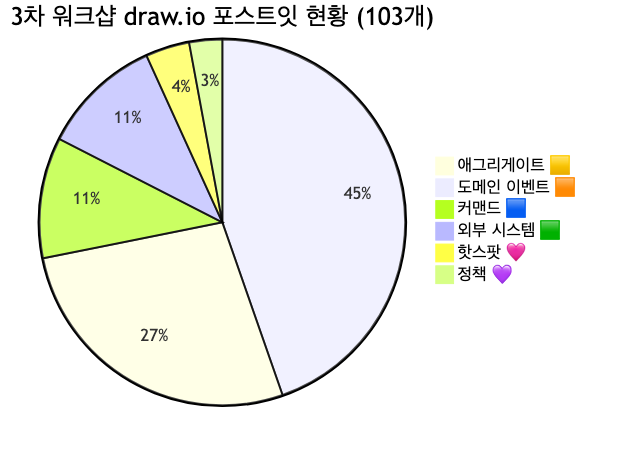

<details>
<summary>📊 원본 Mermaid 코드 보기</summary>

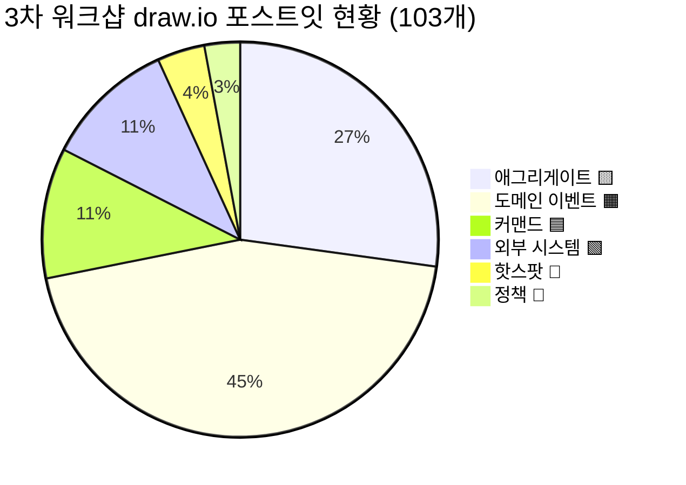

</details>

**주요 문제점:**
- **애그리게이트 28개** — 신규 9개 전부 "~됨" 이벤트 패턴으로 오분류 (이벤트로 교정 필요)
- **이벤트 46개** — 커맨드·정책 패턴 혼재 (약 8건 재검토 필요)
- **커맨드 0개 (신규 영역)** — ④⑤⑥⑦ 영역에서 커맨드가 전혀 도출되지 않음 → 트리거 행위 누락
- **정책 0개 (신규 영역)** — 검증 이벤트 18개 중 상당수가 정책 후보이나 정책(💜)으로 분류되지 않음
- **기존 문제** — 기존 12건 오분류(§4.2 기존 분석 참조) 여전히 미교정

---

## 3. 준비 문서 대비 달성도

### 3.1 목표 달성 비교표

| 항목 | 3차 준비 문서 목표 | 실제 수행 결과 | 달성 |
|------|-------------------|---------------|------|
| 이벤트 정제 | 57개 → ~35개 통합 | 미수행 (새 보드에 46개 도출, 기존 57개 정제 안 함) | ⬜ |
| 애그리게이트 확정 | 12개 → 8개 후보 | 28개 도출 (기존 19 + 신규 9, 오분류 다수, 미정제) | ⬜ |
| 정책 도출 | 0개 → 8개 후보 | 3개 유지 (신규 영역에서 추가 도출 없음) | ⬜ 부분 |
| 읽기 모델 도출 | 0개 → 7개 후보 | **미수행** | ⬜ |
| BC 프리뷰 | 후보 도출 | **미수행** | ⬜ |
| ④⑤⑥⑦ 영역 도출 | (준비 문서에서 미계획) | **42개 요소 신규 도출 (계획 외 성과)** | ✅ 추가 성과 |

**분석:** 3차 워크샵은 준비 문서의 Phase 구조를 따르지 않고, 1~2차 결과를 **내부 검토·재정리**하는 방식으로 진행되었습니다. 계획에 없던 ④⑤⑥⑦ 영역을 42개 요소로 확장한 것은 **의미 있는 추가 성과**이나, 핵심 목표(이벤트 정제·애그리게이트 확정·정책 도출)는 체계적으로 수행되지 않았습니다.

### 3.2 Phase별 수행 현황

| Phase | 준비 문서 계획 | 계획 소요 | 실제 수행 | 비고 |
|-------|--------------|----------|----------|------|
| 오프닝 | 1~2차 리뷰 & 3차 목표 안내 | 10분 | ✅ 수행 | |
| Phase 1 | 이벤트 정제 (57개 → ~35개) | 40분 | ⬜ 미수행 | 기존 이벤트 정제 대신 새 보드에서 재도출 |
| Phase 2 | 애그리게이트 식별 (8개 확정) | 40분 | ⬜ 부분 수행 | 28개 도출했으나 오분류 다수, 비즈니스 재정의 미완 |
| Phase 3 | 정책 도출 (8개 후보) | 30분 | ⬜ 부분 수행 | 3개 명시, 목표 8개 대비 부족 |
| Phase 4 | 읽기 모델 도출 (7개 후보) | 30분 | ⬜ 미수행 | |
| 마무리 | BC 프리뷰 및 통합 | 20분 | ⬜ 미수행 | |
| **(계획 외)** | ④⑤⑥⑦ 영역 도출 | — | ✅ 42개 신규 | 계획에 없던 추가 성과 |

### 3.3 7개 흐름 영역 커버리지

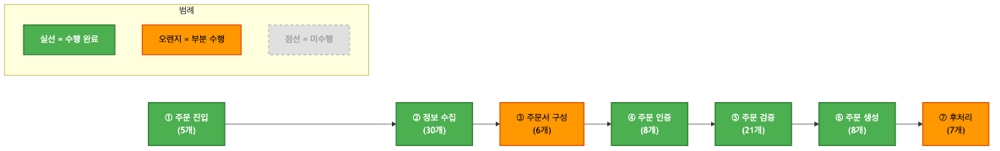

<details>
<summary>📊 원본 Mermaid 코드 보기</summary>

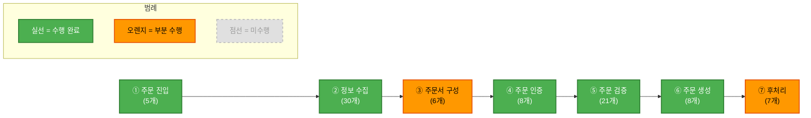

</details>

| 영역 | 상태 | 포스트잇 수 | 도출 요소 |
|------|------|-----------|----------|
| ① 주문 진입 | ✅ 수행 | ~5개 | 고객, 구매하기 클릭, 주문서 생성, 임시 주문정보 생성, 주문서가 생성됨 |
| ② 정보 수집 | ✅ 수행 | ~30개 | 상품정보 조회, 공급계획 조회, 프로모션 조회, 쿠폰 조회, 배송지 조회, 결제수단 조회, 고객정보 조회, 임직원 할인 한도조회 등 다수 |
| ③ 주문서 구성 | 🟧 부분 | ~6개 | 결제가 계산하기, 계산정보, 총 결제금액 계산됨 (쿠폰적용·프로모션적용·배송혜택 결정만 도출) |
| ④ 주문 인증 | ✅ 수행 **(신규)** | ~8개 | 결제가 요청됨, 주문인증 시작/세션/완료/실패, 임시 주문 정보 완료, 주문 인증 요청 거절, 결제 인증 토큰 |
| ⑤ 주문 검증 | ✅ 수행 **(대폭 확장)** | ~21개 | 데이터 검증 4개, 비즈니스 정책 검증 7개, 재고/자원 검증 2개, 회원/결제 검증 5개, 정책 3개 |
| ⑥ 주문 생성 | ✅ 수행 **(신규)** | ~8개 | 주문/결제정보/주문상품 생성, 재고 차감, 진행상태 기록, 기타정보 등록/저장, 주문 실패 |
| ⑦ 후처리 | 🟧 부분 **(신규)** | ~7개 | 현금영수증 발행, 주문완료 알림, 적립금 지급, 알림톡, 여행상품, 선물배송 |

---

## 4. draw.io 색상 오분류 정리

### 4.1 오분류 현황 요약

총 **29건** 오분류가 2가지 그룹으로 분류됩니다:

**A. 기존 영역(①②③) 오분류 — 12건** (5가지 유형)
1. 애그리게이트(🟨) → 이벤트(🟧): "~됨" 과거형 패턴 2건
2. 이벤트(🟧) → 커맨드(🟦): "~조회" 행위 패턴 1건
3. 이벤트(🟧) → 애그리게이트(🟨): "~관리" 데이터 묶음 패턴 2건
4. 핫스팟(🩷) → 정책(💜): 비즈니스 규칙 2건
5. 기타: 액터 오분류 1건, 파라미터 메모 1건, 중복 1건, 읽기모델/커맨드 후보 2건

**B. 신규 영역(④⑤⑥⑦) 오분류 — 17건** (2가지 유형)
1. **애그리게이트(🟨) → 이벤트(🟧): 9건** — 신규 노랑 포스트잇 **9개 전부** "~됨" 이벤트 패턴 오분류
2. **이벤트(🟧) → 커맨드(🟦)/정책(💜): 8건** — "~조회", "~입력함", "~전송함", "~검증" 명사형 패턴

### 4.2 기존 영역 오분류 상세 및 교정안 (12건)

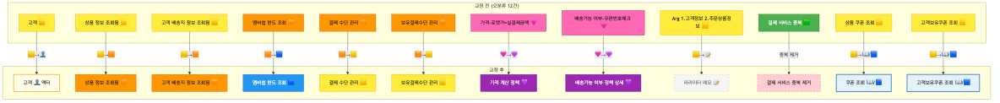

<details>
<summary>📊 원본 Mermaid 코드 보기</summary>

```mermaid
flowchart TB
    classDef aggregate fill:#FFEB3B,color:#000,stroke:#F9A825
    classDef event fill:#FF9800,color:#000,stroke:#E65100
    classDef command fill:#2196F3,color:#fff,stroke:#1565C0
    classDef hotspot fill:#FF69B4,color:#000,stroke:#C2185B
    classDef policy fill:#9C27B0,color:#fff,stroke:#6A1B9A
    classDef external fill:#4CAF50,color:#fff,stroke:#2E7D32
    classDef actor fill:#FFFDE7,color:#000,stroke:#F9A825,stroke-width:2px
    classDef memo fill:#F5F5F5,color:#666,stroke:#BDBDBD,stroke-dasharray:5 5
    classDef readmodel fill:#E3F2FD,color:#000,stroke:#1565C0,stroke-width:2px
    classDef duplicate fill:#FFCDD2,color:#000,stroke:#E57373,stroke-dasharray:5 5

    subgraph BEFORE["교정 전 (오분류 12건)"]
        B1["고객 🟨"]:::aggregate
        B2["상품 정보 조회됨 🟨"]:::aggregate
        B3["고객 배송지 정보 조회됨 🟨"]:::aggregate
        B4["멤버쉽 한도 조회 🟧"]:::event
        B5["결제 수단 관리 🟧"]:::event
        B6["보유결제수단 관리 🟧"]:::event
        B7["가격-로켓가=실결제금액 🩷"]:::hotspot
        B8["배송가능 여부-우편번호체크 🩷"]:::hotspot
        B9["Arg 1.고객정보 2.주문상품정보 🟨"]:::aggregate
        B10["결제 서비스 중복 🟩"]:::external
        B11["상품 쿠폰 조회 🟨"]:::aggregate
        B12["고객보유쿠폰 조회 🟨"]:::aggregate
    end

    subgraph AFTER["교정 후"]
        A1["고객 👤 액터"]:::actor
        A2["상품 정보 조회됨 🟧"]:::event
        A3["고객 배송지 정보 조회됨 🟧"]:::event
        A4["멤버쉽 한도 조회 🟦"]:::command
        A5["결제 수단 관리 🟨"]:::aggregate
        A6["보유결제수단 관리 🟨"]:::aggregate
        A7["가격 계산 정책 💜"]:::policy
        A8["배송가능 여부 정책 상세 💜"]:::policy
        A9["파라미터 메모 📝"]:::memo
        A10["결제 서비스 중복 제거"]:::duplicate
        A11["쿠폰 조회 📖/🟦"]:::readmodel
        A12["고객보유쿠폰 조회 📖/🟦"]:::readmodel
    end

    B1 -->|"🟨→👤"| A1
    B2 -->|"🟨→🟧"| A2
    B3 -->|"🟨→🟧"| A3
    B4 -->|"🟧→🟦"| A4
    B5 -->|"🟧→🟨"| A5
    B6 -->|"🟧→🟨"| A6
    B7 -->|"🩷→💜"| A7
    B8 -->|"🩷→💜"| A8
    B9 -->|"🟨→📝"| A9
    B10 -->|"중복 제거"| A10
    B11 -->|"🟨→📖/🟦"| A11
    B12 -->|"🟨→📖/🟦"| A12
```

</details>

**기존 오분류 12건 상세:**

| # | 요소명 | 현재 분류 | 교정 분류 | 사유 |
|---|--------|----------|----------|------|
| 1 | 고객 | 🟨 애그리게이트 | 👤 액터 | 애그리게이트(데이터 묶음)가 아닌 행위 주체. 이벤트 스토밍에서 커맨드를 발행하는 사용자 역할 |
| 2 | 상품 정보 조회됨 | 🟨 애그리게이트 | 🟧 이벤트 | "~됨" 과거형 패턴 = 이벤트. 상품 서비스로부터 정보를 받은 결과 |
| 3 | 고객 배송지 정보 조회됨 | 🟨 애그리게이트 | 🟧 이벤트 | "~됨" 과거형 패턴 = 이벤트. 배송지 조회 완료를 나타내는 사실 |
| 4 | 멤버쉽 한도 조회 | 🟧 이벤트 | 🟦 커맨드 | "조회"는 조회 행위(커맨드 패턴). 이벤트라면 "멤버쉽 한도가 조회됨"이어야 함 |
| 5 | 결제 수단 관리 | 🟧 이벤트 | 🟨 애그리게이트 | "관리" = 데이터 묶음(애그리게이트 패턴). 결제 수단 정보를 관리하는 도메인 객체 |
| 6 | 보유결제수단 관리 | 🟧 이벤트 | 🟨 애그리게이트 | 동일 사유. 고객이 보유한 결제 수단 정보의 데이터 묶음 |
| 7 | 가격-로켓가=실결제금액 | 🩷 핫스팟 | 💜 정책 | 가격 계산 비즈니스 규칙. "로켓가 = 실결제금액" 공식은 자동 적용되는 정책 |
| 8 | 배송가능 여부-우편번호체크 | 🩷 핫스팟 | 💜 정책 상세 | "배송 가능여부" 정책의 구현 상세. 우편번호 기반 배송 가능 여부 판단 규칙 |
| 9 | Arg 1. 고객정보 2. 주문 상품정보 | 🟨 애그리게이트 | 📝 메모 | 이벤트 스토밍 표준 요소 아님. 주문서 생성 시 필요한 파라미터를 메모한 것 |
| 10 | 결제 서비스 (중복) | 🟩 외부 시스템 | 🟩 중복 제거 | 동일 외부 시스템이 draw.io 보드에 2개 존재. 1개로 통합 필요 |
| 11 | 상품 쿠폰 조회 | 🟨 애그리게이트 | 📖 읽기모델 데이터 또는 🟦 커맨드 | "조회"는 조회 행위. 쿠폰 정보를 읽어오는 것이므로 읽기모델 데이터 혹은 커맨드 |
| 12 | 고객보유쿠폰 조회 | 🟨 애그리게이트 | 📖 읽기모델 데이터 또는 🟦 커맨드 | 동일 사유. 고객이 보유한 쿠폰 목록을 조회하는 행위 |

### 4.3 신규 영역 오분류 상세 및 교정안 (17건)

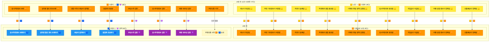

<details>
<summary>📊 원본 Mermaid 코드 보기</summary>

```mermaid
flowchart TB
    classDef aggregate fill:#FFEB3B,color:#000,stroke:#F9A825
    classDef event fill:#FF9800,color:#000,stroke:#E65100
    classDef command fill:#2196F3,color:#fff,stroke:#1565C0
    classDef policy fill:#9C27B0,color:#fff,stroke:#6A1B9A
    classDef discuss fill:#FFF9C4,color:#000,stroke:#F9A825,stroke-dasharray:5 5

    subgraph BEFORE["교정 전 (신규 오분류 17건)"]
        direction TB
        subgraph YB["🟨 노랑 → 🟧 이벤트 (9건)"]
            NB1["재고가 차감됨 🟨"]:::aggregate
            NB2["주문 기타정보가 저장됨 🟨"]:::aggregate
            NB3["주문이 실패됨 🟨"]:::aggregate
            NB4["주문완료 알림 발송됨 🟨"]:::aggregate
            NB5["기획전/핫딜 정책 검증됨 🟨"]:::aggregate
            NB6["임시주문번호 생성됨 🟨"]:::aggregate
            NB7["적립금이 지급됨 🟨"]:::aggregate
            NB8["여행 상품 정보가 등록됨 🟨"]:::aggregate
            NB9["선물배송이 등록됨 🟨"]:::aggregate
        end
        subgraph OB["🟧 오렌지 → 🟦/💜 (8건)"]
            NB10["임시주문정보 조회 🟧"]:::event
            NB11["임직원 할인 한도조회 🟧"]:::event
            NB12["선물 수락시 배송지 입력함 🟧"]:::event
            NB13["알림톡 전송함 🟧"]:::event
            NB14["부당고객 검증 🟧"]:::event
            NB15["임시주문정보 검증 🟧"]:::event
            NB16["회원 유효성 검증 🟧"]:::event
            NB17["주문인증 시작 🟧"]:::event
        end
    end

    subgraph AFTER["교정 후"]
        direction TB
        subgraph YA["🟧 이벤트로 교정 (9건)"]
            NA1["재고가 차감됨 🟧"]:::event
            NA2["주문 기타정보가 저장됨 🟧"]:::event
            NA3["주문이 실패됨 🟧"]:::event
            NA4["주문완료 알림 발송됨 🟧"]:::event
            NA5["기획전/핫딜 정책 검증됨 🟧"]:::event
            NA6["임시주문번호 생성됨 🟧"]:::event
            NA7["적립금이 지급됨 🟧"]:::event
            NA8["여행 상품 정보가 등록됨 🟧"]:::event
            NA9["선물배송이 등록됨 🟧"]:::event
        end
        subgraph OA["🟦 커맨드 / 💜 정책 (8건)"]
            NA10["임시주문정보 조회하기 🟦"]:::command
            NA11["임직원 할인 한도 조회하기 🟦"]:::command
            NA12["배송지 입력하기 🟦"]:::command
            NA13["알림톡 전송하기 🟦"]:::command
            NA14["부당고객 검증 💜"]:::policy
            NA15["임시주문정보 검증 💜"]:::policy
            NA16["회원 유효성 검증 💜"]:::policy
            NA17["주문인증 시작 🟧/🟦 논의"]:::discuss
        end
    end

    NB1 -->|"🟨→🟧"| NA1
    NB2 -->|"🟨→🟧"| NA2
    NB3 -->|"🟨→🟧"| NA3
    NB4 -->|"🟨→🟧"| NA4
    NB5 -->|"🟨→🟧"| NA5
    NB6 -->|"🟨→🟧"| NA6
    NB7 -->|"🟨→🟧"| NA7
    NB8 -->|"🟨→🟧"| NA8
    NB9 -->|"🟨→🟧"| NA9
    NB10 -->|"🟧→🟦"| NA10
    NB11 -->|"🟧→🟦"| NA11
    NB12 -->|"🟧→🟦"| NA12
    NB13 -->|"🟧→🟦"| NA13
    NB14 -->|"🟧→💜"| NA14
    NB15 -->|"🟧→💜"| NA15
    NB16 -->|"🟧→💜"| NA16
    NB17 -->|"논의 필요"| NA17
```

</details>

**신규 오분류 17건 상세:**

**A. 노랑(🟨 애그리게이트) → 오렌지(🟧 이벤트) 교정 — 9건:**

| # | 요소명 | 현재 분류 | 교정 분류 | 사유 |
|---|--------|----------|----------|------|
| 13 | 재고가 차감됨 | 🟨 애그리게이트 | 🟧 이벤트 | "~됨" 과거형 = 이벤트. 재고 차감이라는 사실의 발생 기록 |
| 14 | 주문 기타정보가 저장됨 | 🟨 애그리게이트 | 🟧 이벤트 | "~됨" 과거형 = 이벤트. 기타정보 저장 완료 사실 |
| 15 | 주문이 실패됨 | 🟨 애그리게이트 | 🟧 이벤트 | "~됨" 과거형 = 이벤트. 주문 실패라는 비즈니스 사실 |
| 16 | 주문완료 알림 발송됨 | 🟨 애그리게이트 | 🟧 이벤트 | "~됨" 과거형 = 이벤트. 알림 발송 완료 사실 |
| 17 | 기획전/핫딜 정책 검증됨 | 🟨 애그리게이트 | 🟧 이벤트 | "~됨" 과거형 = 이벤트. 정책 검증 완료 결과 |
| 18 | 임시주문번호 생성됨 | 🟨 애그리게이트 | 🟧 이벤트 | "~됨" 과거형 = 이벤트. 번호 생성 완료 사실 |
| 19 | 적립금이 지급됨 | 🟨 애그리게이트 | 🟧 이벤트 | "~됨" 과거형 = 이벤트. 적립금 지급 완료 사실 |
| 20 | 여행 상품 정보가 등록됨 | 🟨 애그리게이트 | 🟧 이벤트 | "~됨" 과거형 = 이벤트. 여행 상품 등록 완료 사실 |
| 21 | 선물배송이 등록됨 | 🟨 애그리게이트 | 🟧 이벤트 | "~됨" 과거형 = 이벤트. 선물배송 등록 완료 사실 |

**B. 오렌지(🟧 이벤트) → 파랑(🟦 커맨드) / 보라(💜 정책) 교정 — 8건:**

| # | 요소명 | 현재 분류 | 교정 분류 | 사유 |
|---|--------|----------|----------|------|
| 22 | 임시주문정보 조회 | 🟧 이벤트 | 🟦 커맨드 | "조회"는 행위 패턴(커맨드). 이벤트라면 "임시주문정보가 조회됨"이어야 함 |
| 23 | 임직원 할인 한도조회 | 🟧 이벤트 | 🟦 커맨드 | "조회"는 행위 패턴(커맨드). 임직원 할인 한도를 조회하는 행위 |
| 24 | 선물 수락시 배송지 입력함 | 🟧 이벤트 | 🟦 커맨드 | "입력함"은 행위 패턴(커맨드). 이벤트라면 "배송지가 입력됨"이어야 함 |
| 25 | 알림톡 전송함 | 🟧 이벤트 | 🟦 커맨드 | "전송함"은 행위 패턴(커맨드). 이벤트라면 "알림톡이 전송됨"이어야 함 |
| 26 | 부당고객 검증 | 🟧 이벤트 | 💜 정책 | 명사형 "검증"은 비즈니스 규칙(정책 패턴). 부당고객 여부 판단 규칙 |
| 27 | 임시주문정보 검증 | 🟧 이벤트 | 💜 정책 | 명사형 "검증"은 비즈니스 규칙(정책 패턴). 임시주문 데이터 유효성 규칙 |
| 28 | 회원 유효성 검증 | 🟧 이벤트 | 💜 정책 | 명사형 "검증"은 비즈니스 규칙(정책 패턴). 회원 자격 판단 규칙 |
| 29 | 주문인증 시작 | 🟧 이벤트 | 🟧/🟦 논의 | "시작"이 "주문인증이 시작됨"(이벤트)인지 "주문인증을 시작하다"(커맨드)인지 모호 |

### 4.4 논의 필요 항목

기존 논의 5건 + 신규 논의 3건 = **총 8건:**

| # | 요소명 | 현재 분류 | 교정 후보 | 논의 사항 |
|---|--------|----------|----------|----------|
| 1 | 주문서 생성 | 🟨 애그리게이트 | 🟦 커맨드? 또는 🟨 유지? | "생성"이 동사(커맨드)인지 명사(애그리게이트명)인지. "주문서"가 애그리게이트 이름이라면 🟨 유지, "주문서를 생성하다"라면 🟦 커맨드 |
| 2 | 임시 주문정보 생성 | 🟨 애그리게이트 | 🟦 커맨드? 또는 🟧 이벤트? | "임시 주문정보가 생성됨"이면 🟧 이벤트, "임시 주문정보를 생성하다"면 🟦 커맨드, "임시 주문정보"가 데이터 묶음이면 🟨 유지 |
| 3 | 보유결제 2 | 🟧 이벤트 | 불명확 | 의미 파악 필요. "보유결제수단 관리"의 후속 요소인지, 별도 개념인지 팀원 확인 필요 |
| 4 | 본인 인증 필요 여부 | 🟧 이벤트 | 💜 정책? 또는 🟧 유지? | 정책 판단 결과("본인 인증이 필요하다고 판단됨")이면 🟧 이벤트, 판단 규칙 자체이면 💜 정책 |
| 5 | 배송지 조회 회원 | 🩷 핫스팟 | 🟩 외부 시스템? 또는 🩷 유지? | 회원 서비스 연동 관련 이슈. 회원 서비스가 이미 🟩으로 있으므로 중복인지, 별도 핫스팟으로 유지할 것인지 |
| 6 | 주문인증 시작 | 🟧 이벤트 | 🟧/🟦 논의 | **(신규)** "시작"이 이벤트인지 커맨드인지 팀원 확인 필요 |
| 7 | 임시 주문 정보 완료 | 🟧 이벤트 | 🟧 유지? 명칭 교정? | **(신규)** "완료"가 모호. "임시 주문 정보가 완료됨"이면 🟧 유지, 의미 명확화 필요 |
| 8 | 주문한도 검증 실패 | 🟧 이벤트 | 🟧 유지 (명칭 교정) | **(신규)** 이벤트로는 적절하나, "주문한도가 초과됨" 등 과거형으로 명칭 교정 권장 |

### 4.5 교정 후 예상 요소 현황

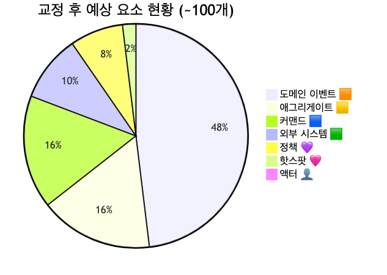

<details>
<summary>📊 원본 Mermaid 코드 보기</summary>

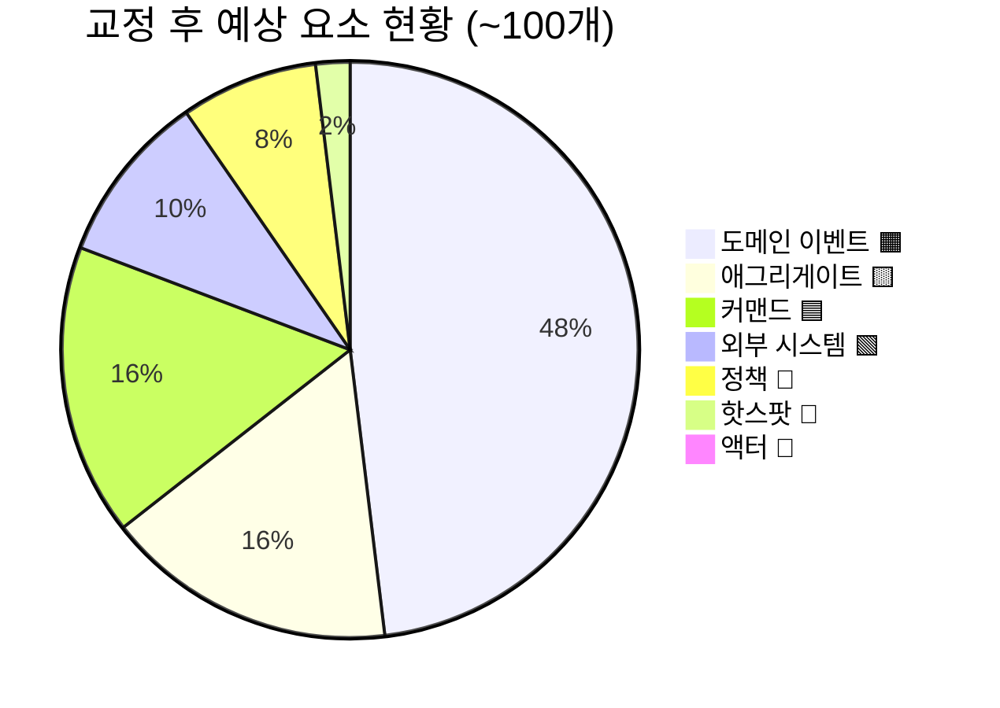

</details>

**교정 전후 수치 비교:**

| 유형 | 교정 전 | 교정 후 | 변동 |
|------|--------|--------|------|
| 애그리게이트 🟨 | 28 | ~17 | -9 (신규 노랑→이벤트) -2 (기존 이벤트·액터) +2 (이벤트→애그리게이트) -1 (메모) -1 (중복 관련) |
| 도메인 이벤트 🟧 | 46 | ~50 | +9 (노랑→이벤트) +2 (기존 노랑→이벤트) -4 (커맨드 전환) -3 (정책 전환) |
| 커맨드 🟦 | 11 | ~17 | +4 (조회/입력/전송 패턴) +1 (멤버쉽 한도 조회) +1~2 (쿠폰 조회 류) |
| 정책 💜 | 3 | ~8 | +3 (신규 검증 명사형) +2 (핫스팟→정책) |
| 외부 시스템 🟩 | 11 | 10 | -1 (결제 서비스 중복 제거) |
| 핫스팟 🩷 | 4 | ~2 | -2 (정책 전환) |
| 액터 👤 | 0 | 1 | +1 (고객) |
| 메모 📝 | 0 | 1 | +1 (파라미터 메모, 보드에서 제거 또는 메모 표기) |
| **합계** | **103** | **~100** | 중복 제거 1건 + 메모 1건 + 논의 결과에 따라 변동 |

**근본 원인 분석 — 색상 오분류 반복 패턴:**
- 신규 노랑 9개 **전부** 오분류 → 팀 내에서 **"~됨" 과거형 이벤트를 노랑(애그리게이트)으로 표기하는 패턴**이 고착화
- 이는 "결과물/산출물"을 애그리게이트(데이터 묶음)로 인식하는 경향에서 기인
- 4차 워크샵 오프닝에서 **"애그리게이트 = 상태가 변하는 데이터 묶음(명사), 이벤트 = 이미 발생한 사실(~됨)"** 구분을 재교육 필요

---

## 5. 흐름 분석

### 5.1 ①②③ 영역 — 주문서 생성 → 정보 수집 흐름 (기존)


<details>
<summary>📊 원본 Mermaid 코드 보기</summary>

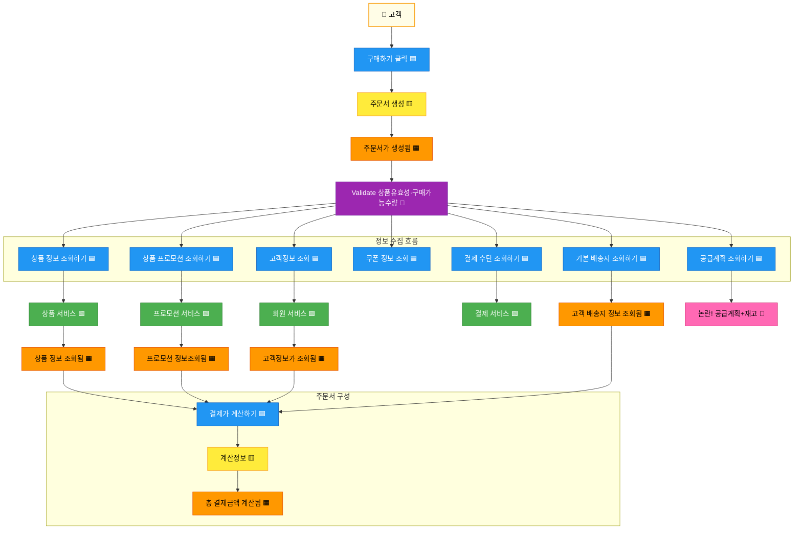

</details>

**흐름 요약:**
1. 👤 고객이 **구매하기 클릭** → 🟨 주문서 생성 → 🟧 주문서가 생성됨
2. 💜 상품유효성·구매가능수량 검증 후 → 7개 병렬 조회 커맨드 발행
3. 🟩 외부 시스템(상품·프로모션·회원·결제 서비스) 호출 → 조회 결과 이벤트 발생
4. 조회 결과를 바탕으로 → 🟦 결제 계산 → 🟨 계산정보 → 🟧 총 결제금액 계산됨

### 5.2 ④ 영역 — 주문 인증 흐름 (신규)

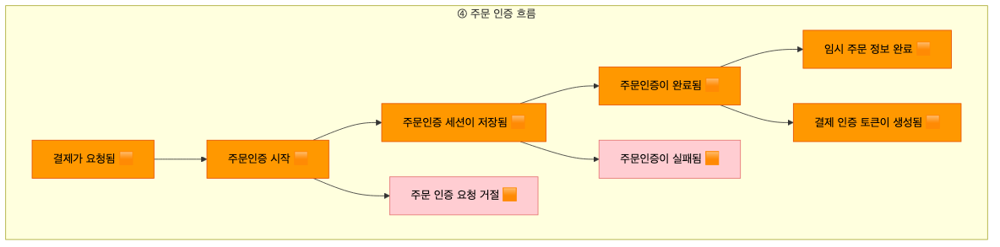

<details>
<summary>📊 원본 Mermaid 코드 보기</summary>

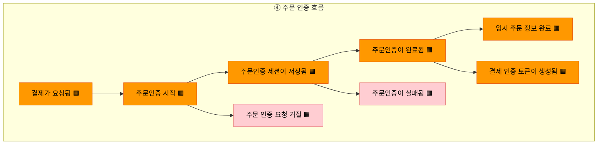

</details>

**흐름 요약:**
1. 🟧 결제가 요청됨 → 주문인증 시작
2. 주문인증 세션이 저장됨 → 분기: 완료 또는 실패
3. 완료 시 → 임시 주문 정보 완료 + 결제 인증 토큰 생성
4. 실패/거절 시 → 주문인증 실패 또는 인증 요청 거절

**누락 요소:**
- 🟦 커맨드가 전혀 없음 — "주문 인증 요청하기", "인증 세션 저장하기" 등의 트리거 행위 미도출
- 🟨 애그리게이트 없음 — "인증 세션" 또는 "결제 인증 토큰" 등의 데이터 묶음 미식별
- 🟩 외부 시스템 없음 — 본인인증 서비스, PG사 등 인증 관련 외부 시스템 미도출

### 5.3 ⑤ 영역 — 주문 검증 흐름 (대폭 확장)

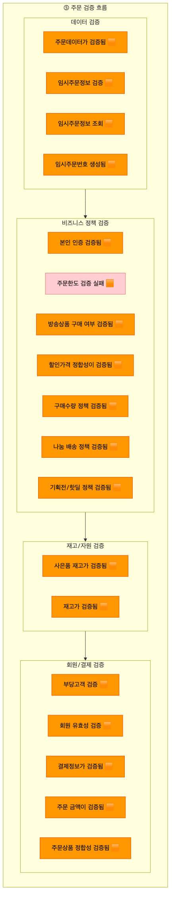

<details>
<summary>📊 원본 Mermaid 코드 보기</summary>

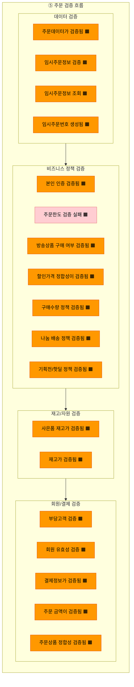

</details>

**흐름 요약 (18개 검증 이벤트, 4개 카테고리):**

| 카테고리 | 검증 항목 | 주요 내용 |
|---------|----------|----------|
| 데이터 검증 | 4개 | 주문데이터 검증, 임시주문정보 검증/조회, 임시주문번호 생성 |
| 비즈니스 정책 검증 | 7개 | 본인인증, 주문한도, 방송상품 구매여부, 할인가격 정합성, 구매수량 정책, 나눔 배송 정책, 기획전/핫딜 정책 |
| 재고/자원 검증 | 2개 | 사은품 재고, 일반 재고 |
| 회원/결제 검증 | 5개 | 부당고객, 회원 유효성, 결제정보, 주문 금액, 주문상품 정합성 |

**분석:**
- **가장 많은 요소가 집중된 영역** (18개) — 주문 도메인의 핵심 비즈니스 로직
- 대부분이 "~검증됨" 이벤트 패턴이나, **검증을 트리거하는 커맨드**와 **검증 규칙(정책)**이 누락
- "부당고객 검증", "임시주문정보 검증", "회원 유효성 검증"은 이벤트보다 **정책(💜)**에 가까움
- 검증 간의 **순서·의존성 관계**가 불명확 — 병렬인지 순차인지 4차에서 결정 필요

### 5.4 ⑥⑦ 영역 — 주문 생성 → 후처리 흐름 (신규)


<details>
<summary>📊 원본 Mermaid 코드 보기</summary>

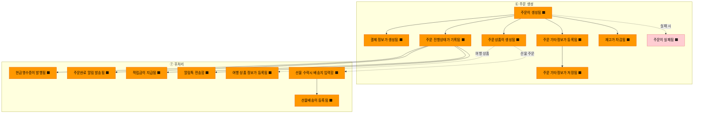

</details>

**흐름 요약:**

**⑥ 주문 생성 (8개):**
1. 주문이 생성됨 → 병렬로 결제 정보·주문상품·진행상태·기타정보 생성
2. 재고가 차감됨 (주문 확정 시)
3. 실패 시 → 주문이 실패됨 (예외 흐름)

**⑦ 후처리 (7개):**
1. 주문 완료 시 → 현금영수증 발행, 알림 발송, 적립금 지급, 알림톡 전송
2. 여행 상품인 경우 → 여행 상품 정보 등록
3. 선물 주문인 경우 → 수락 시 배송지 입력 → 선물배송 등록

**누락 요소:**
- 🟦 커맨드 없음 — "주문 생성하기", "재고 차감하기", "현금영수증 발행하기" 등 트리거 미도출
- 🟨 애그리게이트 없음 — "주문", "결제정보", "주문상품" 등 핵심 데이터 묶음 미식별
- 💜 정책 없음 — 재고 차감 규칙, 현금영수증 발행 조건, 적립금 지급 정책 등 미도출
- 🟩 외부 시스템 없음 — 알림톡 서비스, 현금영수증 발행 서비스 등 미도출

### 5.5 외부 시스템 의존성 분석

3차에서 도출된 10개 외부 시스템(중복 제거 후)의 역할:

| # | 외부 시스템 🟩 | 역할 | 호출 시점 |
|---|---------------|------|----------|
| 1 | 상품 서비스 | 상품 기본정보, 방송정보, 상품유형 조회 | 주문서 생성 직후 |
| 2 | 프로모션 서비스 | 프로모션, 쿠폰, 할인 정보 조회 | 상품 정보 수집 시 |
| 3 | 회원 서비스 | 고객정보, 멤버쉽 한도 조회 | 주문서 생성 직후 |
| 4 | 결제 서비스 | 결제수단, 카드 즉시할인 조회 | 정보 수집 시 |
| 5 | 보안-FDS | 부정거래 탐지 | 주문 진입 시 |
| 6 | GA360 | 이벤트 트래킹 | 전 과정 |
| 7 | EVENT-이벤트 데이터 | 이벤트 데이터 수집 | 전 과정 |
| 8 | 전시-넷퍼넬 | 트래픽 제어(대기열) | 주문 진입 시 |
| 9 | 외부 point 서비스 | 외부 포인트 조회 | 결제 계산 시 |
| 10 | 내부 통합 서비스 point | 내부 포인트 통합 조회 | 결제 계산 시 |

**신규 영역(④⑤⑥⑦)에서 추가로 식별 가능한 외부 시스템 후보:**

| # | 후보 | 근거 | 호출 시점 |
|---|------|------|----------|
| 11 | 본인인증 서비스 | 주문인증, 본인 인증 검증 | ④ 주문 인증 |
| 12 | PG사 (결제 대행) | 결제 인증 토큰 생성, 결제가 요청됨 | ④ 주문 인증 |
| 13 | 알림톡 서비스 | 알림톡 전송, 주문완료 알림 발송 | ⑦ 후처리 |
| 14 | 현금영수증 서비스 | 현금영수증 발행 | ⑦ 후처리 |
| 15 | 재고 관리 서비스 | 재고 차감, 재고 검증, 사은품 재고 검증 | ⑤⑥ 검증/생성 |

**특이 사항:**
- ④⑤⑥⑦ 영역에서 외부 시스템이 **하나도 도출되지 않음** — 인증·결제·알림·재고 관련 외부 연동이 반드시 존재하므로 4차에서 보완 필요
- 주문서 생성 시점에 **7개 이상의 외부 시스템**을 병렬 호출해야 함 → MSA 전환 시 서킷 브레이커, 타임아웃 전략 필수
- 보안-FDS, GA360, 전시-넷퍼넬은 주문 "진입" 시점의 외부 시스템 → 주문 도메인 바깥의 인프라 계층으로 분리 가능

### 5.6 미결 사항 및 결정 필요 항목

4차 워크샵에서 결정이 필요한 항목:

**기존 미결:**
- [ ] **공급계획+재고 핫스팟**: 공급계획과 재고 확인이 별도 외부 시스템인지, 상품 서비스 내부 기능인지 확인
- [ ] **주문서 생성 vs 임시 주문정보 생성 관계**: 두 개가 별도 애그리게이트인지, 하나의 과정(커맨드→이벤트)인지
- [ ] **쿠폰 조회 3종(상품 쿠폰, 쇼핑플러스, 배송비쿠폰) 통합 여부**: 하나의 "쿠폰 조회" 커맨드로 통합할지 개별 유지할지
- [ ] **결제수단 사용여부 커맨드와 사용가능 결제수단 정책 관계**: 커맨드 결과가 정책을 트리거하는지, 동일 개념의 중복인지

**신규 미결:**
- [ ] **검증 이벤트 18개의 순서·의존성**: 병렬 검증인지 순차 검증인지, 실패 시 전체 중단인지 부분 중단인지
- [ ] **"주문 기타정보"의 범위**: "등록됨"과 "저장됨"이 별도 이벤트인지, 동일 행위의 중복 표현인지
- [ ] **여행 상품 / 선물 주문 흐름의 분리**: 일반 주문과 다른 특수 주문 유형을 별도 BC로 분리할지, 주문 BC 내 변형으로 처리할지
- [ ] **알림톡 vs 주문완료 알림**: 별도 이벤트인지, 동일 알림의 중복 표현인지

---

## 6. 미완료 항목 정리

### 6.1 미완료 항목 전체 목록

- [ ] 1~2차 이벤트 57개와 3차 이벤트 55개(교정 후) 간 통합·정제 (중복 확인, 내부 처리 단계 제외)
- [ ] 애그리게이트 28개 → 오분류 교정 후 비즈니스 관점 재정의 (~8개 후보 확정)
- [ ] 정책 3개 → 8개 후보 도출 (신규 검증 영역 3개 + 기존 핫스팟 2개 포함)
- [ ] 읽기 모델 도출 (7개 후보)
- [ ] ④⑤⑥⑦ 영역의 **커맨드·애그리게이트·외부 시스템** 보완 (현재 이벤트만 도출)
- [ ] 바운디드 컨텍스트 후보 프리뷰
- [ ] 오분류 29건 교정 확인 (draw.io 보드 반영)
- [ ] 논의 필요 8건 결정

### 6.2 영역별 미진행 상세

| 영역 | 이벤트 도출 | 커맨드 도출 | 애그리게이트 | 정책 | 읽기 모델 | 외부 시스템 |
|------|-----------|-----------|------------|------|----------|-----------|
| ① 주문 진입 | ✅ | ✅ | ✅ | ⬜ | ⬜ | — |
| ② 정보 수집 | ✅ | ✅ | ✅ 부분 | ⬜ | ⬜ | ✅ |
| ③ 주문서 구성 | ✅ 부분 | ✅ 부분 | ✅ 부분 | ⬜ | ⬜ | — |
| ④ 주문 인증 | ✅ | ⬜ | ⬜ | ⬜ | ⬜ | ⬜ |
| ⑤ 주문 검증 | ✅ | ⬜ | ⬜ | ⬜ 부분 | ⬜ | ⬜ |
| ⑥ 주문 생성 | ✅ | ⬜ | ⬜ | ⬜ | ⬜ | ⬜ |
| ⑦ 후처리 | ✅ 부분 | ⬜ | ⬜ | ⬜ | ⬜ | ⬜ |

**핵심 문제:** ④⑤⑥⑦ 영역은 이벤트만 도출되었고, **커맨드·애그리게이트·정책·외부 시스템이 전혀 없음**. 이벤트 스토밍의 핵심인 "커맨드 → 애그리게이트 → 이벤트 → 정책" 흐름이 완성되지 않았습니다.

### 6.3 읽기 모델·BC 프리뷰 미수행 분석

**미수행 원인:**
- 3차 워크샵이 준비 문서의 Phase 구조를 따르지 않고 내부 검토·재정리에 집중
- ④⑤⑥⑦ 영역을 새로 도출하는 데 시간이 소요되어 읽기 모델·BC 프리뷰까지 진행하지 못함
- 이벤트 정제가 선행되지 않아 읽기 모델 도출의 전제 조건(정제된 이벤트·커맨드·애그리게이트)이 갖춰지지 않음

**영향:**
- 읽기 모델은 바운디드 컨텍스트 경계 설정의 중요 근거 → BC 프리뷰도 함께 미수행
- 4차 워크샵에서 읽기 모델 도출과 BC 프리뷰를 반드시 포함해야 함

**준비 문서의 읽기 모델 7개 후보 (여전히 유효):**

| # | 📖 읽기 모델 | 대상 사용자 | 구성 데이터 |
|---|-------------|-----------|-----------|
| 1 | 주문서 뷰 | 👤 고객 | 상품목록, 수량, 옵션, 배송지, 결제수단, 쿠폰, 총금액 |
| 2 | 배송지 선택 뷰 | 👤 고객 | 기본배송지, 최근배송지, 배송가능여부 |
| 3 | 결제수단 선택 뷰 | 👤 고객 | 보유카드, 간편결제, 포인트잔액, 즉시할인 |
| 4 | 쿠폰·할인 적용 뷰 | 👤 고객 | 적용가능쿠폰, 프로모션할인, 배송비쿠폰 |
| 5 | 주문 요약 확인 뷰 | 👤 고객 | 최종결제금액, 적립예정포인트, 예상배송일 |
| 6 | 주문 현황 모니터링 뷰 | 🔧 운영자 | 실시간주문건수, 결제실패율, 평균주문금액 |
| 7 | 주문 이상 감지 뷰 | 🔧 운영자 | FDS알림, 대량주문감지, 재고부족경고 |

---

## 7. 4차 워크샵 권장 사항

### 7.1 4차 워크샵 목표 재설정

3차에서 ④⑤⑥⑦ 영역의 이벤트를 대폭 확장한 성과를 바탕으로, 4차에서는 **구조화와 정제**에 집중합니다:

```
┌─────────────────────────────────────────────────────────────┐
│              4차 워크샵에서 달성할 것                          │
├─────────────────────────────────────────────────────────────┤
│                                                             │
│  ✅ 3차 draw.io 오분류 29건 교정 확인 + 논의 8건 결정       │
│  ✅ ④⑤⑥⑦ 영역 커맨드·애그리게이트·정책·외부시스템 보완     │
│  ✅ 이벤트 통합·정제 (57+55개 → ~40개 핵심 이벤트)          │
│  ✅ 애그리게이트 확정 (28개 → ~8개 후보)                     │
│  ✅ 정책 도출 보완 (3개 → ~10개 후보)                        │
│  ✅ 읽기 모델 도출 (7개 후보)                                │
│  ✅ 바운디드 컨텍스트 후보 프리뷰                            │
│                                                             │
└─────────────────────────────────────────────────────────────┘
```

### 7.2 권장 타임라인

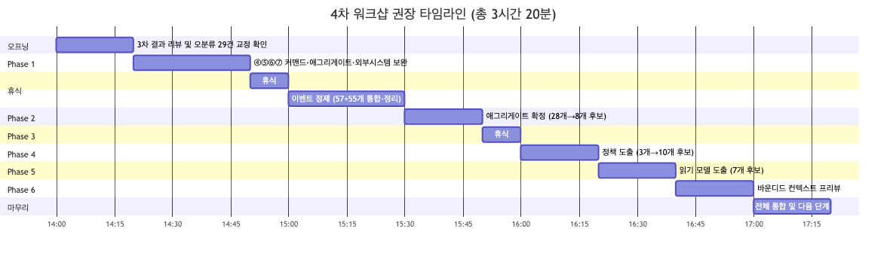

<details>
<summary>📊 원본 Mermaid 코드 보기</summary>

```mermaid
gantt
    title 4차 워크샵 권장 타임라인 (총 3시간 20분)
    dateFormat HH:mm
    axisFormat %H:%M

    section 오프닝
    3차 결과 리뷰 및 오분류 29건 교정 확인    :a1, 14:00, 20m

    section Phase 1
    ④⑤⑥⑦ 커맨드·애그리게이트·외부시스템 보완  :a2, after a1, 30m

    section 휴식
    휴식                                  :a3, after a2, 10m

    section Phase 2
    이벤트 정제 (57+55개 통합·정리)         :a4, after a3, 30m

    section Phase 3
    애그리게이트 확정 (28개→8개 후보)        :a5, after a4, 20m

    section 휴식
    휴식                                  :a6, after a5, 10m

    section Phase 4
    정책 도출 (3개→10개 후보)              :a7, after a6, 20m

    section Phase 5
    읽기 모델 도출 (7개 후보)              :a8, after a7, 20m

    section Phase 6
    바운디드 컨텍스트 프리뷰               :a9, after a8, 20m

    section 마무리
    전체 통합 및 다음 단계                 :a10, after a9, 20m
```

</details>

| 시간 | 단계 | 소요 | 핵심 활동 |
|------|------|------|----------|
| 14:00 | 오프닝 | 20분 | 3차 결과 리뷰, 오분류 29건 교정 확인(사전 반영), 논의 8건 거수 결정 |
| 14:20 | Phase 1: ④⑤⑥⑦ 보완 | 30분 | 신규 영역의 커맨드·애그리게이트·정책·외부시스템 도출 (이벤트만 있는 상태 → 구조 완성) |
| 14:50 | 휴식 | 10분 | |
| 15:00 | Phase 2: 이벤트 정제 | 30분 | 1~2차 57개 + 3차 55개 통합, 중복·내부 처리 단계 제거 → ~40개 목표 |
| 15:30 | Phase 3: 애그리게이트 확정 | 20분 | 교정된 17개 → 비즈니스 관점 재정의·통합 → 8개 후보 확정 |
| 15:50 | 휴식 | 10분 | |
| 16:00 | Phase 4: 정책 도출 | 20분 | 기존 3개 + 교정 5개(핫스팟+검증) + 신규 2~3개 → 10개 후보 |
| 16:20 | Phase 5: 읽기 모델 | 20분 | 고객 접점 5개 + 운영자 접점 2개 = 7개 후보 도출 |
| 16:40 | Phase 6: BC 프리뷰 | 20분 | 애그리게이트 그룹핑, BC 후보 경계선 설정 |
| 17:00 | 마무리 | 20분 | 전체 통합, 결과 정리, 다음 단계 안내 |
| **17:20** | **종료** | **총 3시간 20분** | |

### 7.3 사전 준비 체크리스트

- [ ] 3차 draw.io 보드에 오분류 29건 색상 교정 반영 (사전 수정하여 4차에서 확인만)
- [ ] 논의 필요 8건에 대해 팀원과 사전 확인 (슬랙 논의)
- [ ] 1~2차 이벤트 57개와 3차 이벤트 55개를 하나의 draw.io 보드에 통합 배치
- [ ] ④⑤⑥⑦ 영역에 빈 커맨드(파랑)·애그리게이트(노랑)·정책(보라) 슬롯을 미리 배치
- [ ] 준비 문서의 읽기 모델 7개 후보를 하늘색 📖 포스트잇으로 미리 준비
- [ ] 바운디드 컨텍스트 프리뷰용 큰 포스트잇 준비 (BC 후보별 경계선 표시)
- [ ] 포스트잇 색상 가이드를 벽면에 크게 인쇄하여 부착 (오분류 방지)
- [ ] **특히 "애그리게이트(🟨) = 명사(데이터 묶음)" vs "이벤트(🟧) = ~됨(발생한 사실)" 구분표 준비**

### 7.4 퍼실리테이터 유의 사항

3차 워크샵에서 얻은 교훈 4가지:

**1. 준비 문서 Phase 구조 준수 유도**
> 3차에서는 준비 문서의 Phase 구조를 따르지 않고 자유 형식의 내부 검토·재정리로 진행되었습니다.
> 결과적으로 이벤트 도출은 대폭 확장되었으나, 정제·구조화는 미수행되었습니다.
> 4차에서는 **각 Phase의 목표와 산출물을 오프닝에서 명확히 안내**하고,
> Phase 전환 시 "이 Phase에서 N개를 확정했습니다. 다음으로 넘어가겠습니다"와 같이 **명시적 전환**을 합니다.

**2. 포스트잇 색상 오분류 근본 해결**
> 3차에서 103개 중 29건(약 28%)이 오분류되었으며, 특히 **신규 노랑 9개 전부 오분류**입니다.
> 이는 "결과/산출물"을 애그리게이트로 인식하는 패턴이 고착화된 것입니다.
> 4차 오프닝에서 **"애그리게이트 = '주문', '결제정보' 같은 명사(데이터 묶음)"**, **"이벤트 = '주문이 생성됨' 같은 과거형(사실)"** 구분을 2분 퀴즈로 재교육합니다.
> draw.io 사용 시 색상 팔레트에 7가지 색상을 프리셋으로 준비하여 선택 오류를 줄입니다.

**3. ④⑤⑥⑦ 영역의 구조 완성**
> 3차에서 ④⑤⑥⑦ 영역의 이벤트 42개를 도출한 것은 우수한 성과입니다.
> 그러나 이벤트만 있고 **커맨드(트리거)·애그리게이트(데이터)·정책(규칙)·외부시스템이 없으면** 이벤트 스토밍이 완성되지 않습니다.
> 4차 Phase 1에서 각 이벤트에 대해 **"이 이벤트를 발생시킨 행위(커맨드)는?", "이 이벤트로 상태가 변한 데이터(애그리게이트)는?"** 질문을 반복합니다.

**4. 검증 이벤트의 정책 전환 유도**
> ⑤ 주문 검증 영역에 18개 검증 이벤트가 집중되어 있으나, 대부분이 **검증 결과(이벤트)**와 **검증 규칙(정책)**이 구분되지 않았습니다.
> 4차에서 각 검증 이벤트에 대해 **"이 검증의 규칙(When~Then)은 무엇인가요?"** 질문으로 정책(💜)을 도출합니다.
> 예시: "구매수량 정책 검증됨" → 정책: "When 주문 수량 > 최대 구매 가능 수량 Then 주문 거절"
