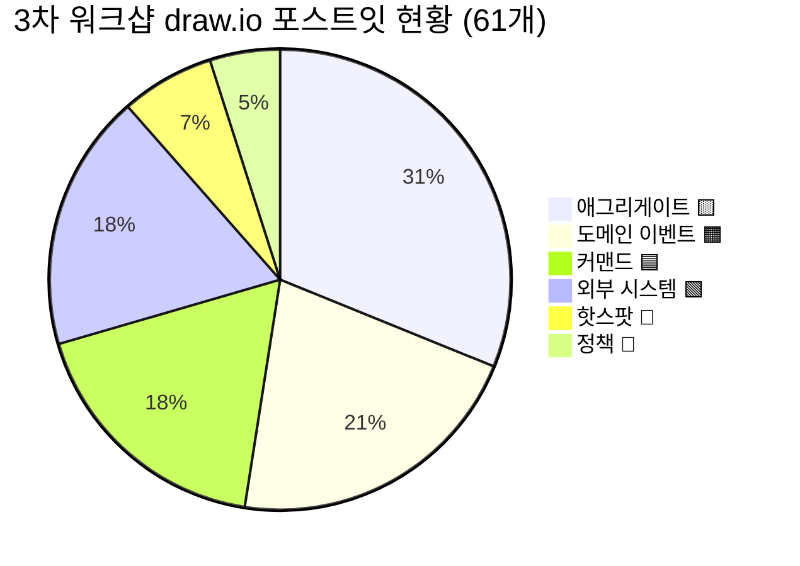
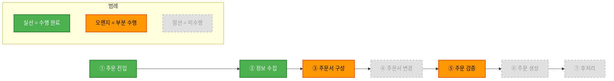
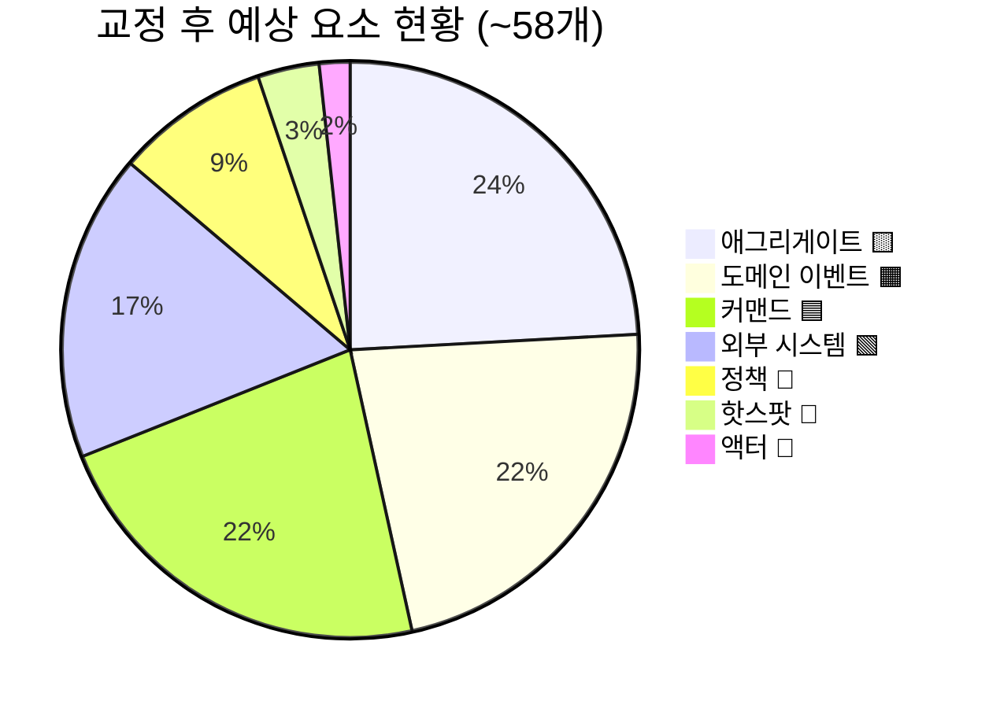
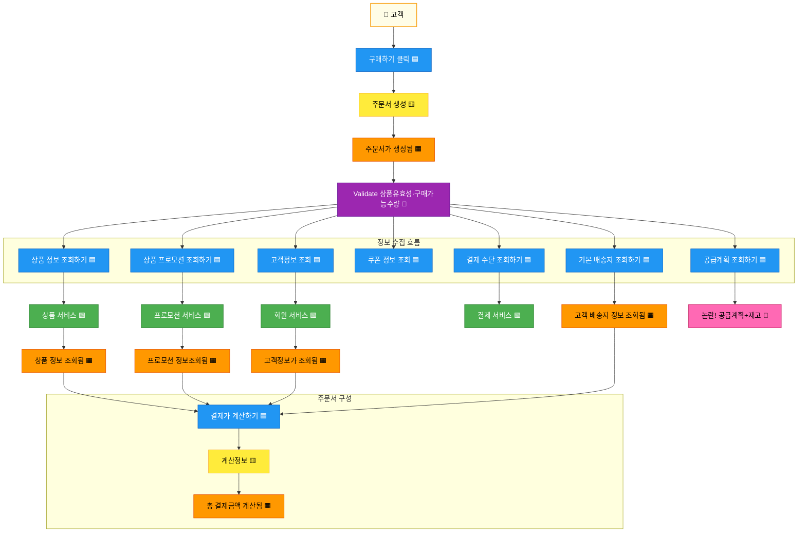

```mermaid
flowchart TB
    classDef aggregate fill:#FFEB3B,color:#000,stroke:#F9A825
    classDef event fill:#FF9800,color:#000,stroke:#E65100
    classDef command fill:#2196F3,color:#fff,stroke:#1565C0
    classDef hotspot fill:#FF69B4,color:#000,stroke:#C2185B
    classDef policy fill:#9C27B0,color:#fff,stroke:#6A1B9A
    classDef external fill:#4CAF50,color:#fff,stroke:#2E7D32
    classDef actor fill:#FFFDE7,color:#000,stroke:#F9A825,stroke-width:2px
    classDef memo fill:#F5F5F5,color:#666,stroke:#BDBDBD,stroke-dasharray:5 5
    classDef readmodel fill:#E3F2FD,color:#000,stroke:#1565C0,stroke-width:2px
    classDef duplicate fill:#FFCDD2,color:#000,stroke:#E57373,stroke-dasharray:5 5

    subgraph BEFORE["교정 전 (오분류 12건)"]
        B1["고객 🟨"]:::aggregate
        B2["상품 정보 조회됨 🟨"]:::aggregate
        B3["고객 배송지 정보 조회됨 🟨"]:::aggregate
        B4["멤버쉽 한도 조회 🟧"]:::event
        B5["결제 수단 관리 🟧"]:::event
        B6["보유결제수단 관리 🟧"]:::event
        B7["가격-로켓가=실결제금액 🩷"]:::hotspot
        B8["배송가능 여부-우편번호체크 🩷"]:::hotspot
        B9["Arg 1.고객정보 2.주문상품정보 🟨"]:::aggregate
        B10["결제 서비스 중복 🟩"]:::external
        B11["상품 쿠폰 조회 🟨"]:::aggregate
        B12["고객보유쿠폰 조회 🟨"]:::aggregate
    end

    subgraph AFTER["교정 후"]
        A1["고객 👤 액터"]:::actor
        A2["상품 정보 조회됨 🟧"]:::event
        A3["고객 배송지 정보 조회됨 🟧"]:::event
        A4["멤버쉽 한도 조회 🟦"]:::command
        A5["결제 수단 관리 🟨"]:::aggregate
        A6["보유결제수단 관리 🟨"]:::aggregate
        A7["가격 계산 정책 💜"]:::policy
        A8["배송가능 여부 정책 상세 💜"]:::policy
        A9["파라미터 메모 📝"]:::memo
        A10["결제 서비스 중복 제거"]:::duplicate
        A11["쿠폰 조회 📖/🟦"]:::readmodel
        A12["고객보유쿠폰 조회 📖/🟦"]:::readmodel
    end

    B1 -->|"🟨→👤"| A1
    B2 -->|"🟨→🟧"| A2
    B3 -->|"🟨→🟧"| A3
    B4 -->|"🟧→🟦"| A4
    B5 -->|"🟧→🟨"| A5
    B6 -->|"🟧→🟨"| A6
    B7 -->|"🩷→💜"| A7
    B8 -->|"🩷→💜"| A8
    B9 -->|"🟨→📝"| A9
    B10 -->|"중복 제거"| A10
    B11 -->|"🟨→📖/🟦"| A11
    B12 -->|"🟨→📖/🟦"| A12
```

# 주문 서비스팀 이벤트 스토밍 3차 워크샵 검토 및 보완 사항

## 1. 개요

### 1.1 이 문서의 목적

```
┌─────────────────────────────────────────────────────────────┐
│              이 문서의 3가지 목적                              │
├─────────────────────────────────────────────────────────────┤
│                                                             │
│  ✅ 3차 워크샵 수행 결과를 준비 문서 대비 분석              │
│  ✅ draw.io 결과물의 색상 오분류 정리 및 교정안 도출        │
│  ✅ 4차 워크샵 방향 및 타임라인 설정                        │
│                                                             │
└─────────────────────────────────────────────────────────────┘
```

### 1.2 워크샵 기본 정보

| 항목 | 내용 |
|------|------|
| 일시 | 2026년 3월 (3차 워크샵) |
| 참석자 | 주문서비스개발팀 |
| 수행 범위 | ① 주문 진입 ~ ② 정보 수집 ~ ③ 주문서 구성(부분) |
| 산출물 | draw.io 보드 (포스트잇 61개) |
| 수행 방식 특이점 | 준비 문서의 Phase 구조(이벤트 정제→애그리게이트→정책→읽기모델)를 따르지 않고, **1~2차 결과를 부서 내부적으로 검토·재정리**하는 방식으로 진행. 새로운 draw.io 보드를 만들어 ①②③ 영역을 상세화함 |

### 1.3 참조 문서

| 참조 문서 | 활용 시점 |
|----------|----------|
| [이벤트스토밍_주문서비스팀_3차워크샵준비.md](./이벤트스토밍_주문서비스팀_3차워크샵준비.md) | 목표 수치, Phase 구조 — 달성도 비교 기준 |
| [이벤트스토밍_주문서비스팀_가이드.md](./이벤트스토밍_주문서비스팀_가이드.md) | 팀 특화 도전 과제 — 퍼실리테이터 유의 사항 참조 |
| [이벤트스토밍_시각화_가이드.md](./이벤트스토밍_시각화_가이드.md) | 포스트잇 색상·배치 패턴 |

---

## 2. 수행 결과 요약

### 2.1 실제 수행 범위 및 방식

3차 워크샵에서 실제로 수행된 활동:

1. **① 주문 진입 영역** — 고객 → 구매하기 클릭 → 주문서 생성 흐름 도출
2. **② 정보 수집 영역** — 상품정보·배송지·결제수단·쿠폰·프로모션 조회 흐름 상세화
3. **③ 주문서 구성 영역 (부분)** — 결제 금액 계산, 계산정보 애그리게이트 도출

**수행 방식 특이점:**
- 준비 문서의 4개 Phase(이벤트 정제 → 애그리게이트 확정 → 정책 도출 → 읽기모델) 구조를 따르지 않음
- 1~2차에서 도출된 57개 이벤트를 정제하는 대신, **새로운 draw.io 보드**를 만들어 ①②③ 영역을 처음부터 재정리
- 결과적으로 기존 57개 이벤트와 별도의 61개 포스트잇이 도출됨 (통합·정제 미수행)

### 2.2 draw.io 분석 결과 (61개 포스트잇)

| 유형 | 색상 | 수량 | 항목 |
|------|------|------|------|
| 애그리게이트 🟨 | 노랑 `#FFD700` | 19개 | 고객, 주문서 생성, 임시 주문정보 생성, Arg 1. 고객정보 2. 주문 상품정보, 공급계획, 상품기본정보, 방송정보, 배송정보(지정배송/희망배송...), 배송정책 정보, 주문서 상품유형, 계산정보, **상품 정보 조회됨**, 상품 쿠폰 조회, 쇼핑플러스 쿠폰, **고객보유쿠폰 조회**, **배송비쿠폰 조회**, 사은품 관리, **고객 배송지 정보 조회됨**, 공통약관 비회원동의 |
| 이벤트 🟧 | 오렌지 `#FF8C00` | 13개 | 주문서가 생성됨, 프로모션 정보조회됨, **멤버쉽 한도 조회**, **결제 수단 관리**, **보유결제수단 관리**, **보유결제 2**, 카드 즉시할인 조회됨, 고객정보가 조회됨, 총 결제금액 계산됨, 쿠폰적용 결정됨, 프로모션 적용됨, 배송혜택 결정됨, **본인 인증 필요 여부** |
| 커맨드 🟦 | 파랑 `#4A90D9` | 11개 | 구매하기 클릭, 상품 정보 조회하기, 공급계획 조회하기, 상품 프로모션 조회하기, 쿠폰 정보 조회, 기본 배송지 조회 하기, 결제 수단 조회 하기, 카드 즉시할인 조회하기, 결제수단 사용여부, 고객정보 조회, 결제가 계산하기 |
| 외부 시스템 🟩 | 초록 `#2ECC71` | 11개 | 상품 서비스, 보안-FDS, GA360, EVENT-이벤트 데이터, 전시-넷퍼넬, 결제 서비스(×2 중복), 회원 서비스, 프로모션 서비스, 외부 point 서비스, 내부 통합 서비스 point |
| 정책 💜 | 보라 `#9B59B6` | 3개 | Validate 1.상품유효성 2.구매가능수량, 배송 가능여부, 사용가능 결제수단 |
| 핫스팟 🩷 | 핑크 `#FF69B4` | 4개 | 논란! 공급계획+재고, **가격-로켓가=실결제금액**, **배송지 조회 회원**, **배송가능 여부-우편번호체크** |

**굵은 글씨** 항목은 색상 오분류가 의심되는 요소입니다 (4.2절에서 상세 분석).

### 2.3 현황 요약 다이어그램


<details>
<summary>📊 원본 Mermaid 코드 보기</summary>



</details>

**주요 문제점:**
- **애그리게이트 19개** — 이벤트(13개)보다 많아 과도한 분류 경고. 오분류 다수 포함 (이벤트 2건, 액터 1건, 메모 1건, 읽기모델/커맨드 2~3건)
- **이벤트 13개 중 오분류 3~4건** — "~조회"(커맨드 패턴), "~관리"(애그리게이트 패턴) 혼재
- **핫스팟 4건 중 2건은 정책** — 가격 계산 규칙, 배송 가능 여부 판단은 비즈니스 규칙(정책)
- **외부 시스템 11개 중 1건 중복** — 결제 서비스 2개 존재

---

## 3. 준비 문서 대비 달성도

### 3.1 목표 달성 비교표

| 항목 | 3차 준비 문서 목표 | 실제 수행 결과 | 달성 |
|------|-------------------|---------------|------|
| 이벤트 정제 | 57개 → ~35개 통합 | 미수행 (새 보드에 13개 도출, 기존 57개 정제 안 함) | ⬜ |
| 애그리게이트 확정 | 12개 → 8개 후보 | 19개 도출 (오분류 다수, 미정제) | ⬜ |
| 정책 도출 | 0개 → 8개 후보 | 3개 도출 (적절하나 목표 미달) | ⬜ 부분 |
| 읽기 모델 도출 | 0개 → 7개 후보 | **미수행** | ⬜ |
| BC 프리뷰 | 후보 도출 | **미수행** | ⬜ |

**분석:** 3차 워크샵은 준비 문서의 Phase 구조를 따르지 않고, 1~2차 결과를 **내부 검토·재정리**하는 방식으로 진행되었습니다. 새로운 draw.io 보드를 만들어 ①②③ 영역을 상세화했으나, 이벤트 정제·애그리게이트 확정·정책 도출은 체계적으로 수행되지 않았습니다.

### 3.2 Phase별 수행 현황

| Phase | 준비 문서 계획 | 계획 소요 | 실제 수행 | 비고 |
|-------|--------------|----------|----------|------|
| 오프닝 | 1~2차 리뷰 & 3차 목표 안내 | 10분 | ✅ 수행 | |
| Phase 1 | 이벤트 정제 (57개 → ~35개) | 40분 | ⬜ 미수행 | 기존 이벤트 정제 대신 새 보드에서 재도출 |
| Phase 2 | 애그리게이트 식별 (8개 확정) | 40분 | ⬜ 부분 수행 | 19개 도출했으나 오분류 다수, 비즈니스 재정의 미완 |
| Phase 3 | 정책 도출 (8개 후보) | 30분 | ⬜ 부분 수행 | 3개 명시, 목표 8개 대비 부족 |
| Phase 4 | 읽기 모델 도출 (7개 후보) | 30분 | ⬜ 미수행 | |
| 마무리 | BC 프리뷰 및 통합 | 20분 | ⬜ 미수행 | |

### 3.3 7개 흐름 영역 커버리지


<details>
<summary>📊 원본 Mermaid 코드 보기</summary>



</details>

| 영역 | 상태 | 도출 요소 |
|------|------|----------|
| ① 주문 진입 | ✅ 수행 | 고객, 구매하기 클릭, 주문서 생성, 임시 주문정보 생성, 주문서가 생성됨 |
| ② 정보 수집 | ✅ 수행 | 상품정보 조회, 공급계획 조회, 프로모션 조회, 쿠폰 조회, 배송지 조회, 결제수단 조회, 고객정보 조회 등 다수 |
| ③ 주문서 구성 | 🟧 부분 | 결제가 계산하기, 계산정보, 총 결제금액 계산됨 (쿠폰적용·프로모션적용·배송혜택 결정만 도출) |
| ④ 주문서 변경 | ⬜ 미수행 | (수량 변경, 옵션 변경, 상품 삭제 등 미논의) |
| ⑤ 주문 검증 | 🟧 부분 | 정책 3개(상품유효성·구매가능수량, 배송가능여부, 사용가능 결제수단) 도출 |
| ⑥ 주문 생성 | ⬜ 미수행 | (주문 확정, 재고 차감, 결제 요청 등 미논의) |
| ⑦ 후처리 | ⬜ 미수행 | (주문 확인 알림, 이력 저장, 외부 연동 등 미논의) |

---

## 4. draw.io 색상 오분류 정리

### 4.1 오분류 현황 요약

오분류 12건은 5가지 유형으로 분류됩니다:

1. **애그리게이트(🟨) → 이벤트(🟧):** "~됨" 과거형 패턴 2건
2. **이벤트(🟧) → 커맨드(🟦):** "~조회" 행위 패턴 1건
3. **이벤트(🟧) → 애그리게이트(🟨):** "~관리" 데이터 묶음 패턴 2건
4. **핫스팟(🩷) → 정책(💜):** 비즈니스 규칙 2건
5. **기타:** 액터 오분류 1건, 파라미터 메모 1건, 중복 1건, 읽기모델/커맨드 후보 2건

### 4.2 오분류 상세 및 교정안


<details>
<summary>📊 원본 Mermaid 코드 보기</summary>



</details>

**오분류 12건 상세:**

| # | 요소명 | 현재 분류 | 교정 분류 | 사유 |
|---|--------|----------|----------|------|
| 1 | 고객 | 🟨 애그리게이트 | 👤 액터 | 애그리게이트(데이터 묶음)가 아닌 행위 주체. 이벤트 스토밍에서 커맨드를 발행하는 사용자 역할 |
| 2 | 상품 정보 조회됨 | 🟨 애그리게이트 | 🟧 이벤트 | "~됨" 과거형 패턴 = 이벤트. 상품 서비스로부터 정보를 받은 결과 |
| 3 | 고객 배송지 정보 조회됨 | 🟨 애그리게이트 | 🟧 이벤트 | "~됨" 과거형 패턴 = 이벤트. 배송지 조회 완료를 나타내는 사실 |
| 4 | 멤버쉽 한도 조회 | 🟧 이벤트 | 🟦 커맨드 | "조회"는 조회 행위(커맨드 패턴). 이벤트라면 "멤버쉽 한도가 조회됨"이어야 함 |
| 5 | 결제 수단 관리 | 🟧 이벤트 | 🟨 애그리게이트 | "관리" = 데이터 묶음(애그리게이트 패턴). 결제 수단 정보를 관리하는 도메인 객체 |
| 6 | 보유결제수단 관리 | 🟧 이벤트 | 🟨 애그리게이트 | 동일 사유. 고객이 보유한 결제 수단 정보의 데이터 묶음 |
| 7 | 가격-로켓가=실결제금액 | 🩷 핫스팟 | 💜 정책 | 가격 계산 비즈니스 규칙. "로켓가 = 실결제금액" 공식은 자동 적용되는 정책 |
| 8 | 배송가능 여부-우편번호체크 | 🩷 핫스팟 | 💜 정책 상세 | "배송 가능여부" 정책의 구현 상세. 우편번호 기반 배송 가능 여부 판단 규칙 |
| 9 | Arg 1. 고객정보 2. 주문 상품정보 | 🟨 애그리게이트 | 📝 메모 | 이벤트 스토밍 표준 요소 아님. 주문서 생성 시 필요한 파라미터를 메모한 것 |
| 10 | 결제 서비스 (중복) | 🟩 외부 시스템 | 🟩 중복 제거 | 동일 외부 시스템이 draw.io 보드에 2개 존재. 1개로 통합 필요 |
| 11 | 상품 쿠폰 조회 | 🟨 애그리게이트 | 📖 읽기모델 데이터 또는 🟦 커맨드 | "조회"는 조회 행위. 쿠폰 정보를 읽어오는 것이므로 읽기모델 데이터 혹은 커맨드 |
| 12 | 고객보유쿠폰 조회 | 🟨 애그리게이트 | 📖 읽기모델 데이터 또는 🟦 커맨드 | 동일 사유. 고객이 보유한 쿠폰 목록을 조회하는 행위 |

### 4.3 논의 필요 항목

워크샵에서 팀원과 함께 결정해야 할 5건:

| # | 요소명 | 현재 분류 | 교정 후보 | 논의 사항 |
|---|--------|----------|----------|----------|
| 1 | 주문서 생성 | 🟨 애그리게이트 | 🟦 커맨드? 또는 🟨 유지? | "생성"이 동사(커맨드)인지 명사(애그리게이트명)인지. "주문서"가 애그리게이트 이름이라면 🟨 유지, "주문서를 생성하다"라면 🟦 커맨드 |
| 2 | 임시 주문정보 생성 | 🟨 애그리게이트 | 🟦 커맨드? 또는 🟧 이벤트? | "임시 주문정보가 생성됨"이면 🟧 이벤트, "임시 주문정보를 생성하다"면 🟦 커맨드, "임시 주문정보"가 데이터 묶음이면 🟨 유지 |
| 3 | 보유결제 2 | 🟧 이벤트 | 불명확 | 의미 파악 필요. "보유결제수단 관리"의 후속 요소인지, 별도 개념인지 팀원 확인 필요 |
| 4 | 본인 인증 필요 여부 | 🟧 이벤트 | 💜 정책? 또는 🟧 유지? | 정책 판단 결과("본인 인증이 필요하다고 판단됨")이면 🟧 이벤트, 판단 규칙 자체이면 💜 정책 |
| 5 | 배송지 조회 회원 | 🩷 핫스팟 | 🟩 외부 시스템? 또는 🩷 유지? | 회원 서비스 연동 관련 이슈. 회원 서비스가 이미 🟩으로 있으므로 중복인지, 별도 핫스팟으로 유지할 것인지 |

### 4.4 교정 후 예상 요소 현황


<details>
<summary>📊 원본 Mermaid 코드 보기</summary>



</details>

**교정 전후 수치 비교:**

| 유형 | 교정 전 | 교정 후 | 변동 |
|------|--------|--------|------|
| 애그리게이트 🟨 | 19 | ~14 | -5 (이벤트 2, 액터 1, 메모 1, 읽기모델/커맨드 2) +2 (이벤트→애그리게이트) |
| 이벤트 🟧 | 13 | ~13 | +2 (애그리게이트→이벤트) -1 (커맨드) -2 (애그리게이트) +1~2 (논의 결과) |
| 커맨드 🟦 | 11 | ~13 | +1 (멤버쉽 한도 조회) +1~2 (쿠폰 조회 류) |
| 정책 💜 | 3 | 5 | +2 (핫스팟→정책) |
| 외부 시스템 🟩 | 11 | 10 | -1 (결제 서비스 중복 제거) |
| 핫스팟 🩷 | 4 | ~2 | -2 (정책 전환) |
| 액터 👤 | 0 | 1 | +1 (고객) |
| 메모 📝 | 0 | 1 | +1 (파라미터 메모, 보드에서 제거 또는 메모 표기) |
| **합계** | **61** | **~58** | 중복 제거 1건 + 메모 1건 + 논의 결과에 따라 변동 |

---

## 5. 주문서 생성 → 상품 정보 조회 흐름 분석

### 5.1 워크샵에서 도출된 흐름

3차 워크샵에서 도출된 **구매하기 진입 → 주문서 생성 → 상품 정보 조회** 흐름을 재구성합니다.


<details>
<summary>📊 원본 Mermaid 코드 보기</summary>



</details>

**흐름 요약:**
1. 👤 고객이 **구매하기 클릭** → 🟨 주문서 생성 → 🟧 주문서가 생성됨
2. 💜 상품유효성·구매가능수량 검증 후 → 7개 병렬 조회 커맨드 발행
3. 🟩 외부 시스템(상품·프로모션·회원·결제 서비스) 호출 → 조회 결과 이벤트 발생
4. 조회 결과를 바탕으로 → 🟦 결제 계산 → 🟨 계산정보 → 🟧 총 결제금액 계산됨

### 5.2 외부 시스템 의존성 분석

3차에서 도출된 10개 외부 시스템(중복 제거 후)의 역할:

| # | 외부 시스템 🟩 | 역할 | 호출 시점 |
|---|---------------|------|----------|
| 1 | 상품 서비스 | 상품 기본정보, 방송정보, 상품유형 조회 | 주문서 생성 직후 |
| 2 | 프로모션 서비스 | 프로모션, 쿠폰, 할인 정보 조회 | 상품 정보 수집 시 |
| 3 | 회원 서비스 | 고객정보, 멤버쉽 한도 조회 | 주문서 생성 직후 |
| 4 | 결제 서비스 | 결제수단, 카드 즉시할인 조회 | 정보 수집 시 |
| 5 | 보안-FDS | 부정거래 탐지 | 주문 진입 시 |
| 6 | GA360 | 이벤트 트래킹 | 전 과정 |
| 7 | EVENT-이벤트 데이터 | 이벤트 데이터 수집 | 전 과정 |
| 8 | 전시-넷퍼넬 | 트래픽 제어(대기열) | 주문 진입 시 |
| 9 | 외부 point 서비스 | 외부 포인트 조회 | 결제 계산 시 |
| 10 | 내부 통합 서비스 point | 내부 포인트 통합 조회 | 결제 계산 시 |

**특이 사항:**
- 주문서 생성 시점에 **7개 이상의 외부 시스템**을 병렬 호출해야 함 → MSA 전환 시 서킷 브레이커, 타임아웃 전략 필수
- 보안-FDS, GA360, 전시-넷퍼넬은 주문 "진입" 시점의 외부 시스템 → 주문 도메인 바깥의 인프라 계층으로 분리 가능
- 외부 point 서비스 / 내부 통합 서비스 point 구분 → 포인트 관련 외부 시스템이 2개로 분리되어 있으며, 통합 전략 논의 필요

### 5.3 미결 사항 및 결정 필요 항목

4차 워크샵에서 결정이 필요한 항목:

- [ ] **공급계획+재고 핫스팟**: 공급계획과 재고 확인이 별도 외부 시스템인지, 상품 서비스 내부 기능인지 확인
- [ ] **주문서 생성 vs 임시 주문정보 생성 관계**: 두 개가 별도 애그리게이트인지, 하나의 과정(커맨드→이벤트)인지
- [ ] **쿠폰 조회 3종(상품 쿠폰, 쇼핑플러스, 배송비쿠폰) 통합 여부**: 하나의 "쿠폰 조회" 커맨드로 통합할지 개별 유지할지
- [ ] **결제수단 사용여부 커맨드와 사용가능 결제수단 정책 관계**: 커맨드 결과가 정책을 트리거하는지, 동일 개념의 중복인지
- [ ] **본인 인증 필요 여부 이벤트의 위치**: 주문서 구성 단계인지, 주문 검증 단계인지

---

## 6. 미완료 항목 정리

### 6.1 미완료 항목 전체 목록

- [ ] 1~2차 이벤트 57개와 3차 이벤트 13개 간 통합·정제 (중복 확인, 내부 처리 단계 제외)
- [ ] 애그리게이트 19개 → 오분류 교정 후 비즈니스 관점 재정의 (~8개 후보 확정)
- [ ] 정책 3개 → 8개 후보 도출 (5개 추가 필요)
- [ ] 읽기 모델 도출 (7개 후보)
- [ ] ④ 주문서 변경, ⑥ 주문 생성, ⑦ 후처리 영역 이벤트·커맨드 도출
- [ ] 바운디드 컨텍스트 후보 프리뷰
- [ ] 오분류 12건 교정 확인 (draw.io 보드 반영)
- [ ] 논의 필요 5건 결정

### 6.2 영역별 미진행 상세

| 영역 | 이벤트 도출 | 커맨드 도출 | 애그리게이트 | 정책 | 읽기 모델 |
|------|-----------|-----------|------------|------|----------|
| ① 주문 진입 | ✅ | ✅ | ✅ | ⬜ | ⬜ |
| ② 정보 수집 | ✅ | ✅ | ✅ 부분 | ⬜ | ⬜ |
| ③ 주문서 구성 | ✅ 부분 | ✅ 부분 | ✅ 부분 | ⬜ | ⬜ |
| ④ 주문서 변경 | ⬜ | ⬜ | ⬜ | ⬜ | ⬜ |
| ⑤ 주문 검증 | ⬜ | ⬜ | ⬜ | ✅ 부분 | ⬜ |
| ⑥ 주문 생성 | ⬜ | ⬜ | ⬜ | ⬜ | ⬜ |
| ⑦ 후처리 | ⬜ | ⬜ | ⬜ | ⬜ | ⬜ |

### 6.3 읽기 모델·BC 프리뷰 미수행 분석

**미수행 원인:**
- 3차 워크샵이 준비 문서의 Phase 구조를 따르지 않고 내부 검토·재정리에 집중
- ①②③ 영역을 새로 정리하는 데 시간이 소요되어 읽기 모델·BC 프리뷰까지 진행하지 못함
- 이벤트 정제가 선행되지 않아 읽기 모델 도출의 전제 조건(정제된 이벤트·커맨드·애그리게이트)이 갖춰지지 않음

**영향:**
- 읽기 모델은 바운디드 컨텍스트 경계 설정의 중요 근거 → BC 프리뷰도 함께 미수행
- 4차 워크샵에서 읽기 모델 도출과 BC 프리뷰를 반드시 포함해야 함

**준비 문서의 읽기 모델 7개 후보 (여전히 유효):**

| # | 📖 읽기 모델 | 대상 사용자 | 구성 데이터 |
|---|-------------|-----------|-----------|
| 1 | 주문서 뷰 | 👤 고객 | 상품목록, 수량, 옵션, 배송지, 결제수단, 쿠폰, 총금액 |
| 2 | 배송지 선택 뷰 | 👤 고객 | 기본배송지, 최근배송지, 배송가능여부 |
| 3 | 결제수단 선택 뷰 | 👤 고객 | 보유카드, 간편결제, 포인트잔액, 즉시할인 |
| 4 | 쿠폰·할인 적용 뷰 | 👤 고객 | 적용가능쿠폰, 프로모션할인, 배송비쿠폰 |
| 5 | 주문 요약 확인 뷰 | 👤 고객 | 최종결제금액, 적립예정포인트, 예상배송일 |
| 6 | 주문 현황 모니터링 뷰 | 🔧 운영자 | 실시간주문건수, 결제실패율, 평균주문금액 |
| 7 | 주문 이상 감지 뷰 | 🔧 운영자 | FDS알림, 대량주문감지, 재고부족경고 |

---

## 7. 4차 워크샵 권장 사항

### 7.1 4차 워크샵 목표 재설정

3차에서 미완료된 항목을 반영하여 4차 목표를 재설정합니다:

```
┌─────────────────────────────────────────────────────────────┐
│              4차 워크샵에서 달성할 것                          │
├─────────────────────────────────────────────────────────────┤
│                                                             │
│  ✅ 3차 draw.io 오분류 12건 교정 확인 + 논의 5건 결정       │
│  ✅ 이벤트 통합·정제 (57+13개 → ~35개)                     │
│  ✅ 애그리게이트 확정 (19개 → 8개 후보)                     │
│  ✅ 정책 도출 보완 (3개 → 8개 후보)                        │
│  ✅ 읽기 모델 도출 (7개 후보)                               │
│  ✅ 바운디드 컨텍스트 후보 프리뷰                           │
│                                                             │
└─────────────────────────────────────────────────────────────┘
```

### 7.2 권장 타임라인

```mermaid
gantt
    title 4차 워크샵 권장 타임라인 (총 2시간 50분)
    dateFormat HH:mm
    axisFormat %H:%M

    section 오프닝
    3차 결과 리뷰 및 오분류 교정 확인    :a1, 14:00, 15m

    section Phase 1
    이벤트 정제 (57+13개 통합·정리)       :a2, after a1, 30m

    section 휴식
    휴식                                  :a3, after a2, 10m

    section Phase 2
    애그리게이트 확정 (19개→8개 후보)     :a4, after a3, 25m

    section Phase 3
    정책 도출 (3개→8개 후보)              :a5, after a4, 20m

    section 휴식
    휴식                                  :a6, after a5, 10m

    section Phase 4
    읽기 모델 도출 (7개 후보)             :a7, after a6, 20m

    section Phase 5
    바운디드 컨텍스트 프리뷰              :a8, after a7, 20m

    section 마무리
    전체 통합 및 다음 단계                :a9, after a8, 20m
```


<details>
<summary>📊 원본 Mermaid 코드 보기</summary>



</details>

| 시간 | 단계 | 소요 | 핵심 활동 |
|------|------|------|----------|
| 14:00 | 오프닝 | 15분 | 3차 결과 리뷰, 오분류 12건 교정 확인(사전 반영), 논의 5건 거수 결정 |
| 14:15 | Phase 1: 이벤트 정제 | 30분 | 1~2차 57개 + 3차 13개 통합, 중복·내부 처리 단계 제거 → ~35개 목표 |
| 14:45 | 휴식 | 10분 | |
| 14:55 | Phase 2: 애그리게이트 확정 | 25분 | 교정된 14개 → 비즈니스 관점 재정의·통합 → 8개 후보 확정 |
| 15:20 | Phase 3: 정책 도출 | 20분 | 기존 3개 + 교정 2개(가격 계산, 배송 가능 여부) + 신규 3개 → 8개 후보 |
| 15:40 | 휴식 | 10분 | |
| 15:50 | Phase 4: 읽기 모델 | 20분 | 고객 접점 5개 + 운영자 접점 2개 = 7개 후보 도출 |
| 16:10 | Phase 5: BC 프리뷰 | 20분 | 애그리게이트 그룹핑, BC 후보 경계선 설정 |
| 16:30 | 마무리 | 20분 | 전체 통합, ④⑥⑦ 미수행 영역 다음 단계 안내, 결과 정리 |
| **16:50** | **종료** | **총 2시간 50분** | |

### 7.3 사전 준비 체크리스트

- [ ] 3차 draw.io 보드에 오분류 12건 색상 교정 반영 (사전 수정하여 4차에서 확인만)
- [ ] 논의 필요 5건에 대해 팀원과 사전 확인 (슬랙 논의)
- [ ] 1~2차 이벤트 57개와 3차 이벤트 13개를 하나의 draw.io 보드에 통합 배치
- [ ] 준비 문서의 읽기 모델 7개 후보를 하늘색 📖 포스트잇으로 미리 준비
- [ ] ④ 주문서 변경, ⑥ 주문 생성, ⑦ 후처리 영역의 예시 이벤트를 참조용으로 준비
- [ ] 바운디드 컨텍스트 프리뷰용 큰 포스트잇 준비 (BC 후보별 경계선 표시)
- [ ] 포스트잇 색상 가이드를 벽면에 크게 인쇄하여 부착 (오분류 방지)

### 7.4 퍼실리테이터 유의 사항

3차 워크샵에서 얻은 교훈 3가지:

**1. 준비 문서 Phase 구조 준수 유도**
> 3차에서는 준비 문서의 Phase 구조를 따르지 않고 자유 형식의 내부 검토·재정리로 진행되었습니다.
> 결과적으로 이벤트 정제·애그리게이트 확정·정책 도출이 체계적으로 수행되지 않았습니다.
> 4차에서는 **각 Phase의 목표와 산출물을 오프닝에서 명확히 안내**하고,
> Phase 전환 시 "이 Phase에서 N개를 확정했습니다. 다음으로 넘어가겠습니다"와 같이 **명시적 전환**을 합니다.

**2. 포스트잇 색상 오분류 방지**
> 3차에서 61개 중 12건(약 20%)이 오분류되었습니다. 특히 **애그리게이트(🟨)에 이벤트·액터·메모가 혼재**된 것이 주요 문제입니다.
> 4차에서는 새 포스트잇을 붙일 때 **"이것은 데이터 묶음(🟨)인가요, 발생한 사실(🟧)인가요?"** 라고 즉시 확인합니다.
> draw.io 사용 시 색상 팔레트에 7가지 색상을 프리셋으로 준비하여 선택 오류를 줄입니다.

**3. 미수행 영역(④⑥⑦)에 대한 시간 확보**
> 3차까지 ①②③ 영역에 집중되어 ④ 주문서 변경, ⑥ 주문 생성, ⑦ 후처리가 전혀 다뤄지지 않았습니다.
> 이 영역들은 주문 도메인의 **핵심 비즈니스 로직**(결제 확정, 재고 차감, 주문 상태 변경)을 포함합니다.
> 4차에서 BC 프리뷰까지 완료하되, ④⑥⑦ 상세는 **5차에서 집중 도출**하도록 로드맵을 안내합니다.
> "구매하기 → 주문서 생성까지는 잘 정리했습니다. 다음은 **주문 확정 이후 흐름**을 다뤄야 합니다."
