# 주문 서비스팀 이벤트 스토밍 3차 워크샵 준비 가이드

## 1. 개요

### 1.1 이 문서의 목적

주문서비스개발팀 이벤트 스토밍 **3차 워크샵**을 진행하는 퍼실리테이터를 위한 실용 가이드입니다.
1~2차에서 도출된 결과물을 분석하고, 3차에서 수행할 **이벤트 정제 → 애그리게이트 확정 → 정책 도출 → 읽기모델 → BC 프리뷰** 단계를 구체적으로 안내합니다.

### 1.2 1~2차 요약 & 3차 목표

**1~2차 완료 사항:**
- 이벤트 도출 + 타임라인 정렬
- 커맨드·액터 초기 식별
- 초기 애그리게이트 라벨링 (대부분 오분류)

**3차 목표:**

```
┌─────────────────────────────────────────────────────────────┐
│              3차 워크샵에서 달성할 것                         │
├─────────────────────────────────────────────────────────────┤
│                                                             │
│  ✅ 이벤트 대폭 정제 (57개 → ~35개)                        │
│  ✅ 오분류 애그리게이트 교정 (12개 라벨 → 8개 후보 확정)     │
│  ✅ 정책 도출 (0개 → 8개 후보)                              │
│  ✅ 읽기 모델 도출 (7개 후보)                               │
│  ✅ 바운디드 컨텍스트 후보 프리뷰                           │
│                                                             │
└─────────────────────────────────────────────────────────────┘
```

| 항목 | 1~2차 완료 | 3차 목표 |
|------|-----------|---------|
| 이벤트 도출 | ✅ 57개 | 정제하여 ~35개로 통합 |
| 타임라인 정렬 | ✅ 7개 흐름 영역 식별 | 유지 |
| 커맨드·액터 식별 | ✅ 커맨드 6개 | 유지 |
| 애그리게이트 | ⬜ 라벨 12개 (10개 오분류) | **8개 후보 확정** |
| 정책 | ⬜ 미시작 (핫스팟 6개만) | **8개 후보 도출** |
| 읽기 모델 | ⬜ 미시작 | **7개 후보 도출** |
| 바운디드 컨텍스트 | ⬜ 미시작 | 후보 프리뷰 (4차에서 확정) |

### 1.3 참조 문서

| 문서 | 용도 |
|------|------|
| [이벤트스토밍_주문서비스팀_가이드.md](./이벤트스토밍_주문서비스팀_가이드.md) | 핵심 도전 7가지, 판단 기준 |
| [이벤트스토밍_주문서비스팀_도메인예시.md](./이벤트스토밍_주문서비스팀_도메인예시.md) | 8개 도메인별 이벤트 예시 |
| [이벤트스토밍_주문서비스팀_워크샵실행.md](./이벤트스토밍_주문서비스팀_워크샵실행.md) | 퍼실리테이터 스크립트 |
| [이벤트스토밍_읽기모델_가이드.md](./이벤트스토밍_읽기모델_가이드.md) | 읽기모델 3단계 프로세스 |
| [이벤트스토밍_시각화_가이드.md](./이벤트스토밍_시각화_가이드.md) | mermaid classDef 패턴 |

---

## 2. 1~2차 결과 정리 및 재검토

### 2.1 현재 요소 현황 요약

1~2차 워크샵에서 도출된 전체 요소를 한눈에 정리합니다.

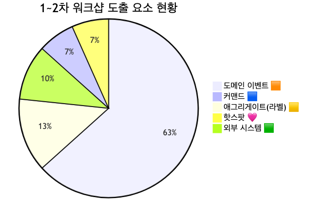

<details>
<summary>📊 원본 Mermaid 코드 보기</summary>

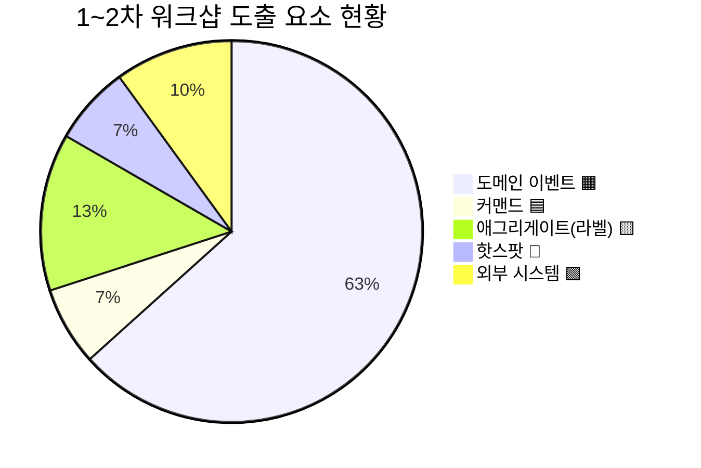

</details>

**주요 문제점:**
- **이벤트 57개** — 내부 처리 단계("~검증됨" 15건), 조회 이벤트("~조회" 7건) 다수 포함
- **애그리게이트(라벨) 12개 중 10개 오분류** — 실제로는 이벤트인 것이 노란 포스트잇으로 잘못 표기
- **핫스팟 6개** — 정책/규칙 후보이나 아직 정책으로 전환되지 않음
- **외부 시스템 9개** — 주문 도메인의 높은 외부 의존성 반영

### 2.2 7개 흐름 영역 전체 맵

1~2차에서 식별한 주문 흐름을 7개 영역으로 구분합니다.

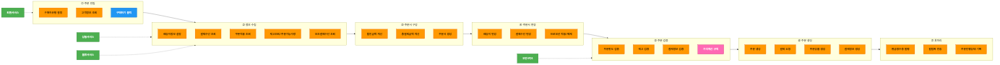

<details>
<summary>📊 원본 Mermaid 코드 보기</summary>

```mermaid
flowchart LR
    classDef event fill:#FF9800,color:#000,stroke:#E65100
    classDef command fill:#2196F3,color:#fff,stroke:#1565C0
    classDef aggregate fill:#FFEB3B,color:#000,stroke:#F9A825
    classDef external fill:#4CAF50,color:#fff,stroke:#2E7D32
    classDef hotspot fill:#FF69B4,color:#fff,stroke:#C2185B

    subgraph A1["① 주문 진입"]
        direction TB
        E1["구매자유형 결정"]:::event
        E2["고객정보 조회"]:::event
        C1["구매하기 클릭"]:::command
    end

    subgraph A2["② 정보 수집"]
        direction TB
        E3["배송지정보 설정"]:::event
        E4["결제수단 조회"]:::event
        E5["쿠폰적용 조회"]:::event
        E6["재고조회/주문가능수량"]:::event
        E7["보조결제수단 조회"]:::event
    end

    subgraph A3["③ 주문서 구성"]
        direction TB
        E8["할인금액 계산"]:::event
        E9["총결제금액 계산"]:::event
        E10["주문서 생성"]:::event
    end

    subgraph A4["④ 주문서 변경"]
        direction TB
        E11["배송지 변경"]:::event
        E12["결제수단 변경"]:::event
        E13["프로모션 적용/해제"]:::event
    end

    subgraph A5["⑤ 주문 검증"]
        direction TB
        E14["주문한도 검증"]:::event
        E15["재고 검증"]:::event
        E16["결제정보 검증"]:::event
        H1["가격계산 규칙"]:::hotspot
    end

    subgraph A6["⑥ 주문 생성"]
        direction TB
        E17["주문 생성"]:::event
        E18["결제 요청"]:::event
        E19["주문상품 생성"]:::event
        E20["결제정보 생성"]:::event
    end

    subgraph A7["⑦ 후처리"]
        direction TB
        E21["현금영수증 발행"]:::event
        E22["알림톡 전송"]:::event
        E23["주문진행상태 기록"]:::event
    end

    A1 --> A2
    A2 --> A3
    A3 --> A4
    A4 --> A5
    A5 --> A6
    A6 --> A7

    EX1["회원서비스"]:::external -.-> A1
    EX2["상품서비스"]:::external -.-> A2
    EX3["물류서비스"]:::external -.-> A2
    EX4["보안-FDS"]:::external -.-> A5
```

</details>

**7개 흐름 영역:**

| # | 영역 | 주요 이벤트 수 | 설명 |
|---|------|-------------|------|
| ① | 주문 진입 | 3개 | 구매 버튼 클릭 → 구매자유형 결정 → 고객정보 조회 |
| ② | 정보 수집 | 12개 | 배송지·결제수단·쿠폰·재고·보조결제 등 조회 |
| ③ | 주문서 구성 | 10개 | 할인계산, 총결제금액, 주문서 생성 |
| ④ | 주문서 변경 | 5개 | 배송지·결제수단·프로모션 변경 |
| ⑤ | 주문 검증 | 15개 | 한도·재고·금액·정합성 등 각종 검증 |
| ⑥ | 주문 생성 | 8개 | 결제 요청, 주문 생성, 주문상품/결제정보 생성 |
| ⑦ | 후처리 | 4개 | 현금영수증, 알림톡, 진행상태 기록 |

### 2.3 이벤트 재검토 항목

3차 워크샵에서 정제할 이벤트를 세 가지 유형으로 분류합니다.

#### 2.3.1 내부 처리 단계 — 제외/통합 대상 (~15건 "검증됨")

"~검증됨"으로 끝나는 이벤트는 **내부 처리 단계**이지 비즈니스 이벤트가 아닙니다. 이들은 **정책**으로 전환하거나 상위 이벤트에 통합합니다.

| 현재 이벤트 | 처리 방향 | 전환 대상 |
|------------|----------|----------|
| 주문한도검증실패 | 💜 정책 전환 | 주문 한도 검증 정책 |
| 방송상품구매여부검증 | 💜 정책 전환 | 구매수량 제한 정책 |
| 주문인증실패 | 통합 → 주문인증 완료/실패 | 주문 인증 애그리게이트 |
| 할인가격정합성검증 | 💜 정책 전환 | 가격 계산 정책 |
| 구매수량정책검증 | 💜 정책 전환 | 구매수량 제한 정책 |
| 사은품재고검증 | 통합 → 재고 검증 | 주문 검증 애그리게이트 |
| 나눔배송정책검증 | 💜 정책 전환 | 배송 가능 여부 정책 |
| 부당고객검증 | 💜 정책 전환 | 부당고객 차단 정책 |
| 재고검증 | 통합 → 재고 확인됨 | 주문 검증 애그리게이트 |
| 임시주문정보검증 | 통합 → 주문데이터 검증됨 | 주문 검증 애그리게이트 |
| 결제정보검증 | 통합 → 결제정보 확인됨 | 주문 검증 애그리게이트 |
| 회원유효성검증 | 외부 시스템 위임 | 회원서비스 연동 |
| 주문금액검증 | 💜 정책 전환 | 가격 계산 정책 |
| 주문상품정합성검증 | 통합 → 주문데이터 검증됨 | 주문 검증 애그리게이트 |
| 본인인증검증 | 통합 → 주문인증 완료 | 주문 인증 애그리게이트 |

#### 2.3.2 조회 이벤트 — 정리 대상 (~7건)

**조회는 이벤트가 아닙니다.** 상태 변경이 없는 조회 행위는 읽기 모델 또는 커맨드로 재분류합니다.

| 현재 이벤트 | 처리 방향 | 전환 대상 |
|------------|----------|----------|
| 고객정보 조회 | 🟦 커맨드 전환 | 고객정보 요청 (이미 존재) |
| 결제수단 조회 | 📖 읽기모델 전환 | 결제수단 선택 뷰 |
| 쿠폰적용 조회 | 📖 읽기모델 전환 | 결제수단 선택 뷰 |
| 보조결제수단 조회 (내부6종) | 📖 읽기모델 전환 | 결제수단 선택 뷰 |
| 보조결제2 (외부4종) | 🟩 외부 시스템 위임 | 외부 포인트 서비스 |
| 임시주문정보조회 | 제외 | 내부 처리 |
| 프로모션결제조건조회 | 📖 읽기모델 전환 | 결제수단 선택 뷰 |

#### 2.3.3 오분류 애그리게이트 → 이벤트/정책 전환 (10건)

노란색(🟨) 포스트잇으로 잘못 붙인 항목들을 올바른 요소로 재분류합니다.

| 현재 (노란색) | 실제 유형 | 재분류 대상 |
|-------------|---------|-----------|
| 공동현관비밀번호등록 | 🟧 이벤트 | 배송지 애그리게이트 하위 이벤트 |
| 재고차감 | 🟧 이벤트 | 주문 생성 후 후처리 이벤트 |
| 주문기타정보저장 | 🟧 이벤트 | 주문 애그리게이트 하위 이벤트 |
| 주문실패 | 🟧 이벤트 | 주문 애그리게이트 하위 이벤트 |
| 주문완료알림발송 | 🟧 이벤트 | 후처리 이벤트 (알림 정책 트리거) |
| 기획전/핫딜정책검증 | 💜 정책 | 가격 계산 정책에 포함 |
| 임시주문번호생성 | 🟧 이벤트 | 주문서 애그리게이트 하위 이벤트 |
| 적립금지급 | 🟧 이벤트 | 후처리 이벤트 |
| 여행상품정보등록 | 🟧 이벤트 | 주문 애그리게이트 하위 이벤트 (특수주문) |
| 선물배송등록 | 🟧 이벤트 | 배송지 애그리게이트 하위 이벤트 (특수주문) |

### 2.4 핫스팟 → 정책 전환 대상 (6건)

현재 핫스팟으로 마킹된 6개 항목은 **불확실한 규칙**이었습니다. 3차에서는 이들을 정책 또는 외부 시스템 연동으로 해소합니다.

| 핫스팟 | 전환 방향 | 대상 |
|--------|---------|------|
| 🩷 배송지조회(회원) | 🟩 외부 연동 | 회원서비스 연동 |
| 🩷 가격계산(고물가=실제결제금액) | 💜 정책 | 가격 계산 정책 |
| 🩷 상품조회(가격/정보) | 🟩 외부 연동 | 상품서비스 연동 |
| 🩷 쿠폰API조회(프로모션) | 💜 정책 | 가격 계산 정책 |
| 🩷 공급계획+재고 | 💜 정책 | 구매수량 제한 정책 |
| 🩷 배송가능여부(우편번호체크) | 💜 정책 | 배송 가능 여부 정책 |

### 2.5 1~2차 → 3차 전환 체크리스트

3차 워크샵 시작 전, 퍼실리테이터가 확인할 사항입니다.

- [ ] draw.io 원본 파일 최신 버전 확인 (1~2차 결과)
- [ ] 이벤트 57개 → 재검토 대상 분류표 출력 (섹션 2.3)
- [ ] 오분류 애그리게이트 10건 교정용 오렌지 포스트잇 준비
- [ ] 핫스팟 6건 → 정책 전환 매핑표 출력 (섹션 2.4)
- [ ] 참석자에게 1~2차 결과 요약 사전 공유 (전일)
- [ ] 화이트보드 또는 Miro/FigJam 템플릿 준비
- [ ] 포스트잇 충분 준비: 🟧 오렌지 (이벤트), 🟨 노란 (애그리게이트), 💜 보라 (정책), 📖 하늘 (읽기모델)

---

## 3. 3차 워크샵 타임라인

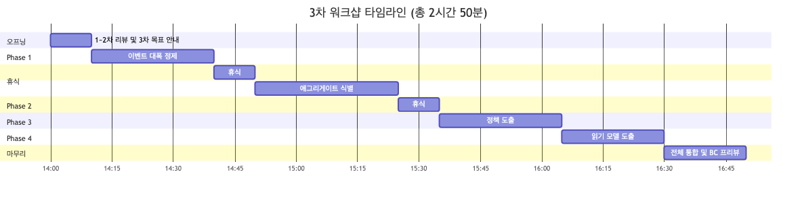

<details>
<summary>📊 원본 Mermaid 코드 보기</summary>

```mermaid
gantt
    title 3차 워크샵 타임라인 (총 2시간 50분)
    dateFormat HH:mm
    axisFormat %H:%M

    section 오프닝
    1~2차 리뷰 및 3차 목표 안내       :a1, 14:00, 10m

    section Phase 1
    이벤트 대폭 정제                   :a2, 14:10, 30m

    section 휴식
    휴식                              :a3, 14:40, 10m

    section Phase 2
    애그리게이트 식별                   :a4, 14:50, 35m

    section 휴식
    휴식                              :a5, 15:25, 10m

    section Phase 3
    정책 도출                          :a6, 15:35, 30m

    section Phase 4
    읽기 모델 도출                     :a7, 16:05, 25m

    section 마무리
    전체 통합 및 BC 프리뷰             :a8, 16:30, 20m
```

</details>

| 시간 | 단계 | 소요 | 핵심 활동 |
|------|------|------|----------|
| 14:00 | 오프닝 | 10분 | 1~2차 리뷰, 3차 목표, 오늘의 규칙 |
| 14:10 | **Phase 1: 이벤트 대폭 정제** | 30분 | 검증 이벤트 통합, 조회 정리, 오분류 교정 |
| 14:40 | 휴식 | 10분 | |
| 14:50 | **Phase 2: 애그리게이트 식별** | 35분 | 8개 후보 확정, 이벤트-애그리게이트 매핑 |
| 15:25 | 휴식 | 10분 | |
| 15:35 | **Phase 3: 정책 도출** | 30분 | 8개 정책 후보 도출, 핫스팟 전환 |
| 16:05 | **Phase 4: 읽기 모델 도출** | 25분 | 7개 읽기모델 후보 도출 |
| 16:30 | 마무리 | 20분 | 전체 통합, BC 프리뷰, 다음 단계 안내 |
| **16:50** | **종료** | **총 2시간 50분** | |

---

## 4. Phase 1: 이벤트 대폭 정제 (30분)

### 퍼실리테이터 스크립트 — 오프닝

> "1~2차에서 57개의 이벤트를 도출했는데, 이 중 상당수가 비즈니스 이벤트가 아니라 **내부 처리 단계**입니다.
> 오늘 첫 단계로 세 가지 기준으로 이벤트를 정제하겠습니다.
>
> **첫째**, '~검증됨'으로 끝나는 15개는 대부분 **정책(자동 규칙)**으로 전환합니다.
> **둘째**, '~조회'로 끝나는 7개는 이벤트가 아니라 **읽기모델이나 커맨드**로 재분류합니다.
> **셋째**, 노란색으로 잘못 붙인 10개를 **오렌지로 교체**합니다.
>
> 한 건당 1분을 넘기지 않겠습니다. 판단이 어려우면 핫스팟으로 마킹하고 넘어갑니다."

### 4.1 검증 이벤트 통합 가이드

**판단 기준:** "이 검증이 실패하면 비즈니스적으로 의미 있는 일이 일어나는가?"

| 판단 | 처리 |
|------|------|
| 실패 시 주문 차단 → 비즈니스 의미 O | 💜 **정책으로 전환** (예: 부당고객 차단 정책) |
| 실패 시 에러 메시지만 → 기술적 검증 | ❌ **제외** (예: 임시주문정보검증) |
| 여러 검증이 같은 결과를 만듦 | 🔗 **통합** (예: 재고검증 + 사은품재고검증 → 재고 확인됨) |

**검증 → 정책 전환 예시:**

```
┌─────────────────────────────────────────────────────────────────┐
│  Before (검증 이벤트 15개)          After (정책 4개 + 이벤트 3개)  │
├─────────────────────────────────────────────────────────────────┤
│                                                                 │
│  주문한도검증실패        ─┐                                      │
│  임직원할인한도관리      ─┤→  💜 주문 한도 검증 정책              │
│  멤버쉽한도조회         ─┘                                      │
│                                                                 │
│  방송상품구매여부검증    ─┐                                      │
│  구매수량정책검증        ─┤→  💜 구매수량 제한 정책               │
│  사은품재고검증         ─┘                                      │
│                                                                 │
│  할인가격정합성검증      ─┐                                      │
│  주문금액검증           ─┤→  💜 가격 계산 정책                   │
│  카드즉시할인조회        ─┘                                      │
│                                                                 │
│  부당고객검증           ─→    💜 부당고객 차단 정책               │
│                                                                 │
│  재고검증 + 사은품재고   ─→   🟧 재고 확인됨 (통합 이벤트)        │
│  임시주문정보검증 등     ─→   🟧 주문데이터 검증됨 (통합 이벤트)   │
│  본인인증검증           ─→   🟧 주문인증 완료 (통합 이벤트)       │
│                                                                 │
└─────────────────────────────────────────────────────────────────┘
```

### 4.2 조회 이벤트 정리 가이드

**핵심 원칙:** 조회(Read)는 상태를 바꾸지 않으므로 도메인 이벤트가 아닙니다.

| 조회 이벤트 | 왜 이벤트가 아닌가 | 전환 |
|------------|-----------------|------|
| 고객정보 조회 | 고객 상태 변경 없음 | 🟦 커맨드 (이미 존재) |
| 결제수단 조회 | 결제 상태 변경 없음 | 📖 결제수단 선택 뷰 |
| 쿠폰적용 조회 | 쿠폰 상태 변경 없음 | 📖 결제수단 선택 뷰 |
| 보조결제수단 조회 | 잔액 확인일 뿐 | 📖 결제수단 선택 뷰 |
| 재고조회/주문가능수량 | 재고 변경 없음 | 📖 주문서 작성 뷰 |
| 프로모션결제조건조회 | 프로모션 상태 변경 없음 | 📖 결제수단 선택 뷰 |
| 임시주문정보조회 | 내부 기술 처리 | ❌ 제외 |

### 4.3 오분류 색상 교정 (노란→오렌지 10건)

> "지금 노란색으로 붙어있는 10개 항목을 확인하겠습니다.
> 이 중 대부분은 '주문 실패', '재고 차감'처럼 **일어난 사건(이벤트)**이지 **데이터 묶음(애그리게이트)**이 아닙니다.
> 오렌지 포스트잇으로 교체하면서 해당 영역의 적절한 위치에 다시 붙여주세요."

| 교정 대상 | 현재 | 교정 후 | 소속 영역 |
|----------|------|--------|----------|
| 공동현관비밀번호등록 | 🟨 | 🟧 이벤트 | ④ 주문서 변경 |
| 재고차감 | 🟨 | 🟧 이벤트 | ⑥ 주문 생성 |
| 주문기타정보저장 | 🟨 | 🟧 이벤트 | ⑥ 주문 생성 |
| 주문실패 | 🟨 | 🟧 이벤트 | ⑥ 주문 생성 |
| 주문완료알림발송 | 🟨 | 🟧 이벤트 | ⑦ 후처리 |
| 기획전/핫딜정책검증 | 🟨 | 💜 정책 | ③ 주문서 구성 |
| 임시주문번호생성 | 🟨 | 🟧 이벤트 | ③ 주문서 구성 |
| 적립금지급 | 🟨 | 🟧 이벤트 | ⑦ 후처리 |
| 여행상품정보등록 | 🟨 | 🟧 이벤트 | ⑥ 주문 생성 |
| 선물배송등록 | 🟨 | 🟧 이벤트 | ⑦ 후처리 |

### 4.4 정제 후 예상 이벤트 목록 (~35개)

| # | 영역 | 정제 후 이벤트 |
|---|------|--------------|
| 1 | ① 주문 진입 | 구매자유형 결정됨 |
| 2 | | 고객정보 확인됨 |
| 3 | ② 정보 수집 | 배송지정보 설정됨 |
| 4 | | 배송가능여부 확인됨 |
| 5 | | 재고/주문가능수량 확인됨 |
| 6 | | 보조결제수단 확인됨 |
| 7 | ③ 주문서 구성 | 주문서 생성됨 |
| 8 | | 임시주문번호 생성됨 |
| 9 | | 할인금액 계산됨 |
| 10 | | 총결제금액 계산됨 |
| 11 | | 주문서결제수단 선택됨 |
| 12 | ④ 주문서 변경 | 배송지 변경됨 |
| 13 | | 배송요청사항 변경됨 |
| 14 | | 결제수단 변경됨 |
| 15 | | 프로모션 적용됨 |
| 16 | | 프로모션 적용해제됨 |
| 17 | | 쿠폰 적용됨 |
| 18 | | 쿠폰 적용거절됨 |
| 19 | | 공동현관비밀번호 등록됨 |
| 20 | ⑤ 주문 검증 | 주문데이터 검증됨 |
| 21 | | 재고 확인됨 |
| 22 | | 주문한도 검증됨 |
| 23 | ⑥ 주문 생성 | 주문인증 시작됨 |
| 24 | | 주문인증 완료됨 |
| 25 | | 주문인증 세션저장됨 |
| 26 | | 결제인증토큰 생성됨 |
| 27 | | 결제 요청됨 |
| 28 | | 결제정보 생성됨 |
| 29 | | 주문 생성됨 |
| 30 | | 주문상품 생성됨 |
| 31 | | 주문기타정보 등록됨 |
| 32 | | 재고 차감됨 |
| 33 | | 주문 실패됨 |
| 34 | ⑦ 후처리 | 주문진행상태 기록됨 |
| 35 | | 현금영수증 발행됨 |
| 36 | | 알림톡 전송됨 |
| 37 | | 주문완료 알림발송됨 |
| 38 | | 적립금 지급됨 |
| 39 | | 선물배송 등록됨 |
| 40 | | 여행상품정보 등록됨 |

> **참고:** 최종 개수는 워크샵 참석자의 합의에 따라 달라질 수 있습니다. 35~40개 범위가 적절합니다.

---

## 5. Phase 2: 애그리게이트 식별 (35분)

### 5.1 주문팀 눈높이 설명

> "애그리게이트를 어렵게 생각하지 마세요. **주문서는 하나의 서류 묶음**이라고 생각하시면 됩니다.
>
> 실제 종이 주문서를 떠올려 보세요:
> - 주문서 한 장에는 상품정보, 가격, 배송지, 결제수단이 적혀 있습니다
> - 이 정보들은 **한꺼번에 바뀌어야 의미가 있습니다** — 배송지만 바꾸고 운임이 안 바뀌면 안 됩니다
> - 그래서 주문서는 하나의 **묶음(애그리게이트)**입니다
>
> 이런 식으로 '함께 바뀌어야 하는 데이터 묶음'을 찾는 것이 애그리게이트 식별입니다."

**애그리게이트 판단 3가지 질문:**
1. "이 데이터들이 **한꺼번에 바뀌어야** 비즈니스 규칙이 유지되나요?"
2. "이 묶음에 **고유 ID**(주문번호, 배송지ID 등)가 있나요?"
3. "이 묶음을 **다른 묶음과 독립적으로** 저장하고 조회할 수 있나요?"

### 5.2 현재 → 정리안 Before/After

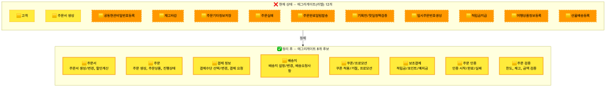

<details>
<summary>📊 원본 Mermaid 코드 보기</summary>

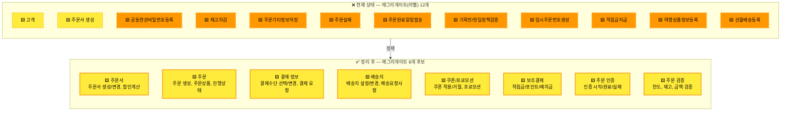

</details>

### 5.3 흐름 영역별 애그리게이트-이벤트 매핑

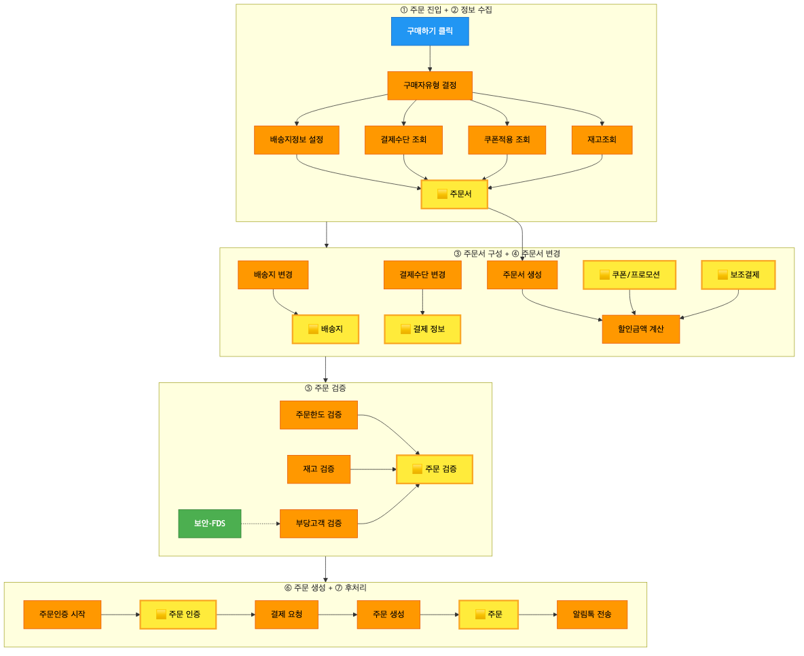

<details>
<summary>📊 원본 Mermaid 코드 보기</summary>

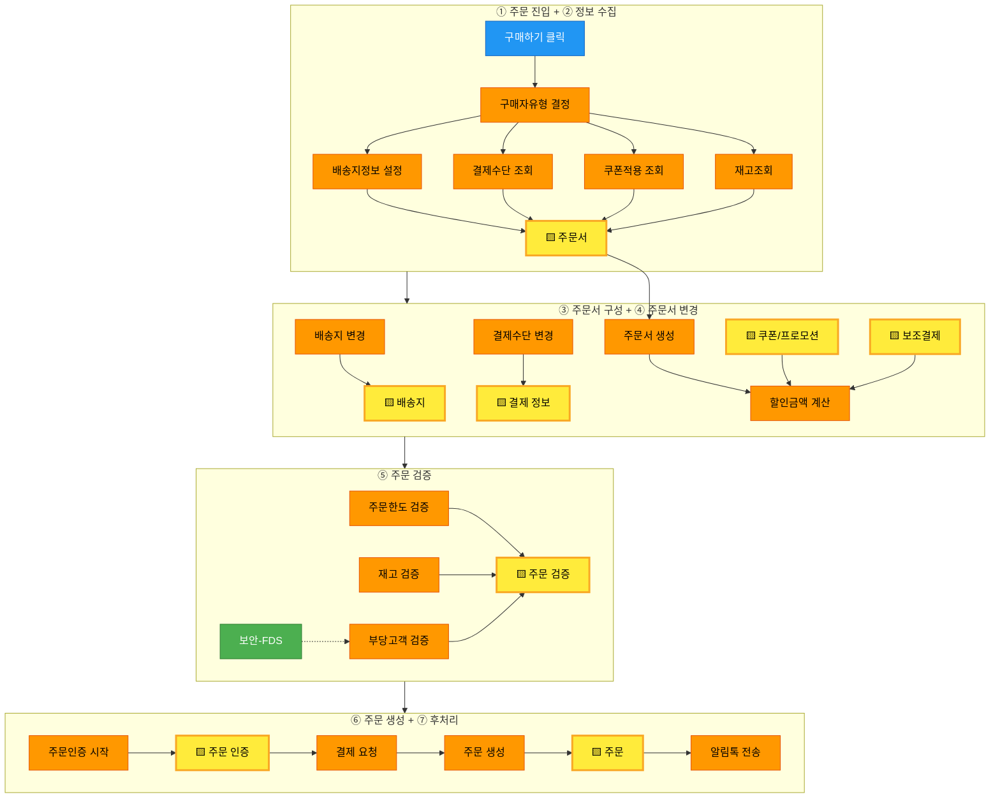

</details>

### 5.4 애그리게이트 후보 8개 상세

| # | 애그리게이트 | 포함 이벤트 핵심 | 고유 ID | 영역 |
|---|-------------|----------------|---------|------|
| 1 | **🟨 주문서** | 주문서 생성/변경, 할인계산, 총결제금액 | 임시주문번호 | ①②③④ |
| 2 | **🟨 주문** | 주문 생성, 주문상품 생성, 주문 진행상태 | 주문번호 | ⑥⑦ |
| 3 | **🟨 결제 정보** | 결제수단 선택/변경, 결제 요청/생성 | 결제ID | ③⑥ |
| 4 | **🟨 배송지** | 배송지 설정/변경, 배송요청사항, 공동현관비번 | 배송지ID | ②④ |
| 5 | **🟨 쿠폰/프로모션** | 쿠폰 적용/거절, 프로모션 적용/해제 | 쿠폰코드 | ③④ |
| 6 | **🟨 보조결제** | 적립금/포인트/예치금 등 보조결제수단 | 보조결제ID | ②③ |
| 7 | **🟨 주문 인증** | 인증 시작/완료/실패, 세션 저장 | 인증세션ID | ⑥ |
| 8 | **🟨 주문 검증** | 한도, 재고, 금액, 정합성 검증 결과 | 검증요청ID | ⑤ |

### 5.5 식별 질문 리스트

| 질문 | 기대 답변 | 관련 애그리게이트 |
|------|---------|----------------|
| "주문서에 상품을 담고 배송지를 바꾸면, 운임도 같이 바뀌나요?" | Yes → 주문서와 배송지가 연관 | 주문서, 배송지 |
| "결제수단을 바꿀 때 할인금액도 재계산되나요?" | Yes → 결제정보와 주문서 연관 | 결제 정보, 주문서 |
| "쿠폰을 적용하면 즉시 할인이 반영되나요, 아니면 결제 시점에?" | 즉시 → 쿠폰은 주문서에 바로 영향 | 쿠폰/프로모션 |
| "보조결제(적립금, 포인트)는 카드결제와 함께 관리되나요?" | No → 별도 애그리게이트 | 보조결제 |
| "주문 인증과 결제 요청은 동시에 일어나나요?" | No → 인증 후 결제 | 주문 인증, 결제 정보 |
| "주문 검증이 실패하면 주문서가 삭제되나요?" | No → 검증 결과만 기록 | 주문 검증 |

### 5.6 퍼실리테이터 스크립트

> "이제 정제된 이벤트들을 **묶음(애그리게이트)**으로 그룹핑하겠습니다.
>
> 방법은 간단합니다. '이 이벤트들이 **같은 서류 묶음** 안에 있나요?'라고 물어보세요.
> 예를 들어:
> - '주문서 생성됨', '할인금액 계산됨', '총결제금액 계산됨'은 모두 **주문서**라는 한 장의 서류에 관한 것입니다
> - '결제수단 선택됨', '결제 요청됨', '결제정보 생성됨'은 모두 **결제 정보**라는 묶음입니다
>
> 각 흐름 영역별로 노란 포스트잇을 붙이면서, 그 아래에 해당 이벤트를 배치해 주세요.
> 8개 후보를 제안하지만, 팀에서 합치거나 나눌 수 있습니다."

---

## 6. Phase 3: 정책 도출 (30분)

### 6.1 주문팀 눈높이 설명

> "정책은 **'자동으로 체크되는 규칙'**입니다.
>
> 여러분이 매일 접하는 예를 들면:
> - 주문 들어올 때 **한도 초과 여부를 자동으로 체크**하죠? → 이게 정책입니다
> - 배송지 입력하면 **우편번호로 배송가능 여부를 자동 판단**하죠? → 이것도 정책입니다
> - 결제 실패하면 **자동으로 롤백하고 재시도 안내**하죠? → 이것도 정책입니다
>
> 핵심은 **'사람이 판단하는 게 아니라 시스템이 자동으로 수행하는 규칙'**입니다.
> 보라색 포스트잇에 적어서 해당 이벤트 옆에 붙여주세요."

### 6.2 정책 후보 8개

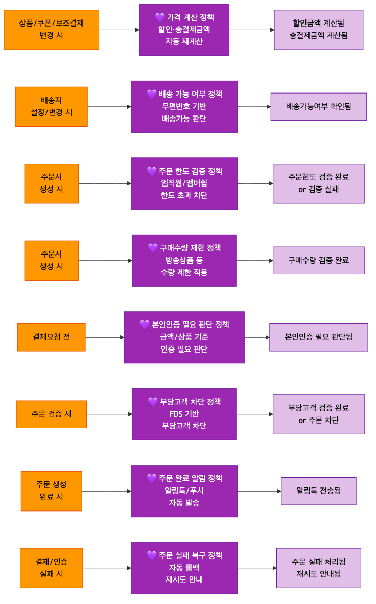

<details>
<summary>📊 원본 Mermaid 코드 보기</summary>

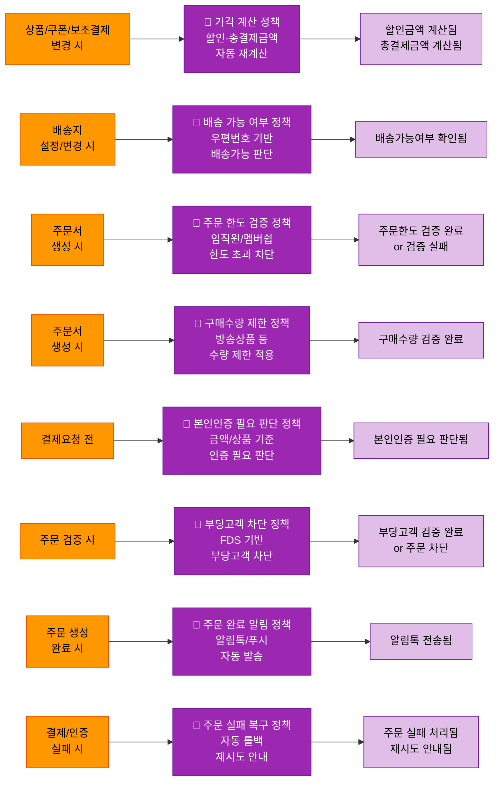

</details>

**정책 후보 상세:**

| # | 정책 | 트리거 이벤트 | 자동 수행 내용 | 결과 이벤트 |
|---|------|-------------|-------------|-----------|
| 1 | 💜 가격 계산 정책 | 상품/쿠폰/보조결제 변경 시 | 할인금액·총결제금액 자동 재계산 | 할인금액 계산됨, 총결제금액 계산됨 |
| 2 | 💜 배송 가능 여부 정책 | 배송지 설정/변경 시 | 우편번호 기반 배송가능 여부 판단 | 배송가능여부 확인됨 |
| 3 | 💜 주문 한도 검증 정책 | 주문서 생성 시 | 임직원/멤버쉽 한도 초과 차단 | 주문한도 검증됨 or 검증 실패 |
| 4 | 💜 구매수량 제한 정책 | 주문서 생성 시 | 방송상품 등 수량 제한 적용 | 구매수량 검증 완료 |
| 5 | 💜 본인인증 필요 판단 정책 | 결제요청 전 | 금액/상품 기준 본인인증 필요 판단 | 본인인증 필요 판단됨 |
| 6 | 💜 부당고객 차단 정책 | 주문 검증 시 | FDS 기반 부당고객 주문 차단 | 부당고객 검증됨 or 주문 차단 |
| 7 | 💜 주문 완료 알림 정책 | 주문 생성 완료 시 | 알림톡/푸시 자동 발송 | 알림톡 전송됨 |
| 8 | 💜 주문 실패 복구 정책 | 결제/인증 실패 시 | 자동 롤백, 재시도 안내 | 주문 실패 처리됨 |

### 6.3 핫스팟 → 정책 전환 맵

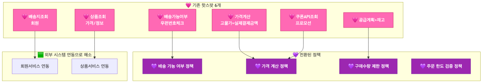

<details>
<summary>📊 원본 Mermaid 코드 보기</summary>

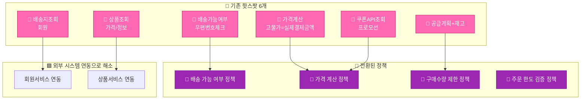

</details>

### 6.4 도출 유도 질문

| 질문 | 기대 답변 | 관련 정책 |
|------|---------|----------|
| "쿠폰을 바꾸면 가격이 자동으로 다시 계산되나요?" | Yes | 💜 가격 계산 정책 |
| "배송지를 섬 지역으로 바꾸면 어떻게 되나요?" | 배송불가 알림 | 💜 배송 가능 여부 정책 |
| "임직원이 한도 초과 주문을 넣으면?" | 자동 차단 | 💜 주문 한도 검증 정책 |
| "TV홈쇼핑 상품을 10개 담으면?" | 수량 제한 알림 | 💜 구매수량 제한 정책 |
| "30만원 이상 결제 시 본인인증이 필요한가요?" | 상황에 따라 | 💜 본인인증 필요 판단 정책 |
| "FDS에서 이상 거래 감지하면?" | 주문 차단 | 💜 부당고객 차단 정책 |
| "주문 완료 후 알림은 자동인가요?" | Yes | 💜 주문 완료 알림 정책 |
| "결제 실패하면 어떤 일이 자동으로 일어나나요?" | 롤백+재시도 | 💜 주문 실패 복구 정책 |

### 6.5 퍼실리테이터 스크립트

> "이제 **자동 규칙(정책)**을 찾겠습니다.
>
> 방법은 간단합니다. 이벤트 사이에 **'자동으로 일어나는 일'**을 찾으세요.
> - '주문서가 생성되면' → **자동으로** 한도를 체크한다 → 이게 정책입니다
> - '결제가 실패하면' → **자동으로** 롤백한다 → 이것도 정책입니다
>
> 1~2차에서 핫스팟으로 남겨둔 6개 중 4개가 정책 후보입니다.
> 나머지 4개는 이벤트 흐름에서 새로 찾겠습니다.
>
> 보라색 포스트잇에 '**~정책**'으로 적어서, 트리거 이벤트와 결과 이벤트 사이에 붙여주세요."

---

## 7. Phase 4: 읽기 모델 도출 (25분)

### 7.1 주문팀 눈높이 설명

> "읽기 모델은 쉽게 말해 **'화면에 보여주는 정보 묶음'**입니다.
>
> 여러분이 매일 보는 주문서 작성 화면을 떠올려 보세요:
> - 상단에 상품정보와 가격이 보이고
> - 중간에 배송지와 결제수단이 보이고
> - 하단에 할인과 총결제금액이 보이죠?
>
> 이 화면이 바로 **'주문서 작성 뷰'**라는 읽기 모델입니다.
> 어떤 이벤트가 일어나면 이 화면이 갱신되는지, 그리고 이 화면을 보고 사용자가 다음에 뭘 하는지를 연결하면 됩니다."

### 7.2 읽기 모델 후보 7개

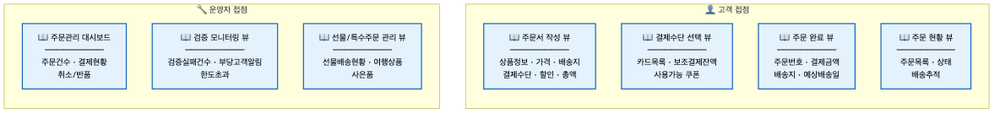

<details>
<summary>📊 원본 Mermaid 코드 보기</summary>

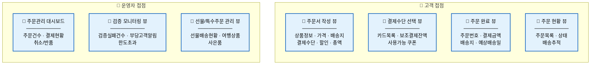

</details>

**읽기 모델 후보 상세:**

| # | 읽기 모델 | 대상 | 구성 데이터 | 갱신 트리거 |
|---|----------|------|-----------|-----------|
| 1 | 📖 주문서 작성 뷰 | 👤 고객 | 상품정보, 가격, 배송지, 결제수단, 할인, 총액 | 주문서 생성/변경 이벤트 |
| 2 | 📖 결제수단 선택 뷰 | 👤 고객 | 카드목록, 보조결제잔액, 사용가능쿠폰 | 결제수단 조회, 보조결제 조회 |
| 3 | 📖 주문 완료 뷰 | 👤 고객 | 주문번호, 결제금액, 배송지, 예상배송일 | 주문 생성, 결제정보 생성 |
| 4 | 📖 주문 현황 뷰 | 👤 고객 | 주문목록, 상태, 배송추적 | 주문 진행상태 기록 |
| 5 | 📖 주문관리 대시보드 | 🔧 운영자 | 주문건수, 결제현황, 취소/반품 | 주문 생성/실패/취소 |
| 6 | 📖 검증 모니터링 뷰 | 🔧 운영자 | 검증실패건수, 부당고객알림, 한도초과 | 검증 실패 이벤트 |
| 7 | 📖 선물/특수주문 관리 뷰 | 🔧 운영자 | 선물배송현황, 여행상품, 사은품 | 선물수락, 여행상품등록 |

### 7.3 3단계 프로세스 (화면 → 데이터 → 트리거)

각 읽기 모델을 도출할 때 아래 3단계를 거칩니다.

**Step 1: 화면 식별** — "이 정보를 보는 사람은 누구인가?"

| 사용자 | 화면 | 목적 |
|--------|------|------|
| 👤 고객 | 주문서 작성 화면 | 상품·가격·배송지·결제수단 확인 |
| 👤 고객 | 결제수단 선택 팝업 | 카드·포인트·쿠폰 선택 |
| 👤 고객 | 주문 완료 페이지 | 주문 확인 |
| 👤 고객 | 마이페이지 주문현황 | 배송 추적 |
| 🔧 운영자 | 주문관리 대시보드 | 주문 현황 모니터링 |
| 🔧 운영자 | 검증 모니터링 화면 | 이상 거래 감시 |
| 🔧 운영자 | 특수주문 관리 화면 | 선물/여행 주문 관리 |

**Step 2: 데이터 구성** — "이 화면에 어떤 데이터가 필요한가?"

> 각 화면에 필요한 데이터를 나열합니다. (상세는 위 테이블 참조)

**Step 3: 트리거 연결** — "어떤 이벤트가 일어나면 이 화면이 갱신되는가?"

> 이벤트와 읽기 모델을 연결합니다. (아래 다이어그램 참조)

### 7.4 읽기모델-이벤트 연결 맵


<details>
<summary>📊 원본 Mermaid 코드 보기</summary>

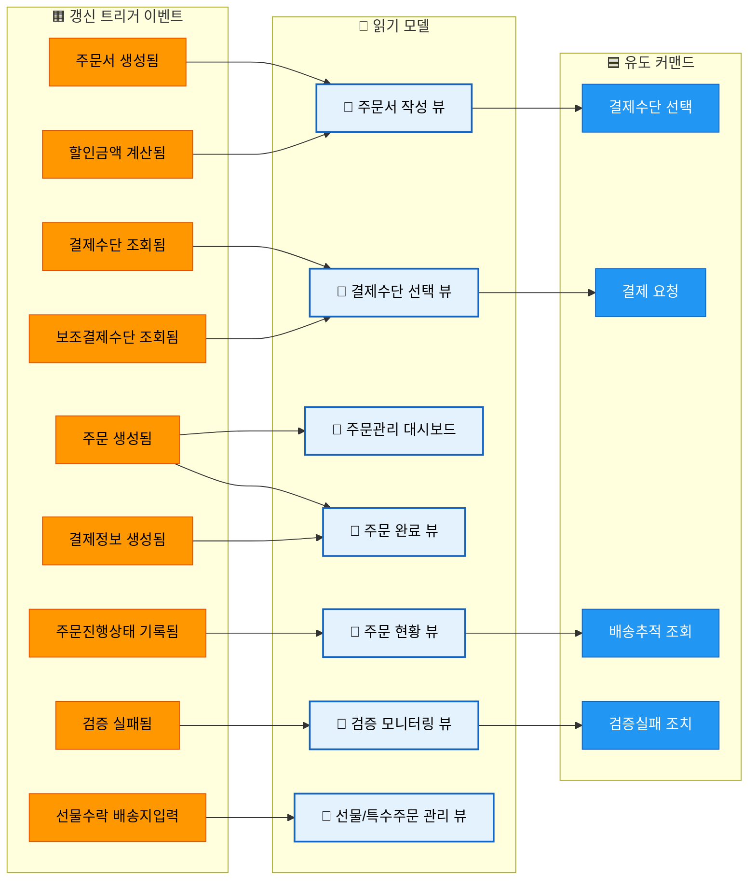

</details>

### 7.5 퍼실리테이터 스크립트

> "마지막으로 **읽기 모델**을 도출하겠습니다.
>
> 간단합니다. 세 가지만 답하면 됩니다:
> 1. **'누가 이 화면을 보나요?'** — 고객인가요, 운영자인가요?
> 2. **'이 화면에 뭐가 보이나요?'** — 어떤 데이터가 표시되나요?
> 3. **'언제 이 화면이 바뀌나요?'** — 어떤 이벤트가 일어나면 갱신되나요?
>
> 주문서 작성 화면을 예로 들면:
> - **누가**: 고객
> - **뭐가**: 상품정보, 가격, 배송지, 결제수단, 할인, 총액
> - **언제**: 주문서가 생성되거나 변경될 때
>
> 하늘색 포스트잇에 적어서 관련 이벤트 옆에 붙여주세요.
> 고객 화면 4개, 운영자 화면 3개를 목표로 합니다."

---

## 8. 전체 통합 및 정리 (20분)

### 8.1 전체 통합 흐름

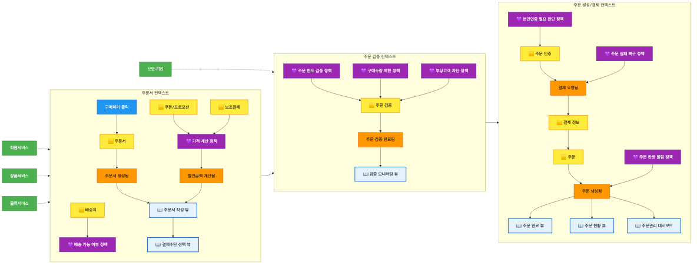

<details>
<summary>📊 원본 Mermaid 코드 보기</summary>

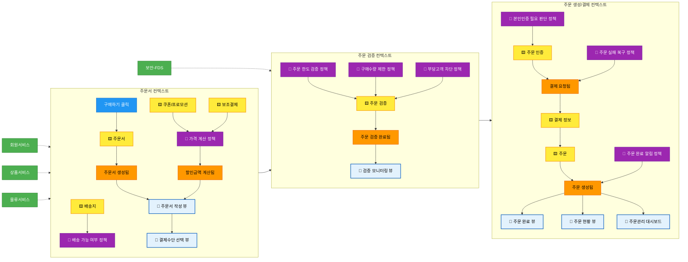

</details>

### 8.2 바운디드 컨텍스트 후보 프리뷰

> **주의:** BC 확정은 4차에서 수행합니다. 3차에서는 후보만 프리뷰합니다.

| BC 후보 | 포함 애그리게이트 | 핵심 정책 | 외부 의존 |
|---------|----------------|---------|----------|
| **주문서 컨텍스트** | 주문서, 배송지, 쿠폰/프로모션, 보조결제 | 가격 계산, 배송 가능 여부 | 회원서비스, 상품서비스, 물류서비스 |
| **주문 검증 컨텍스트** | 주문 검증 | 주문 한도, 구매수량, 부당고객 | 보안-FDS |
| **주문 생성/결제 컨텍스트** | 주문, 결제 정보, 주문 인증 | 본인인증, 알림, 실패 복구 | - |

**BC 경계 판단 기준:**
1. **데이터 소유권** — "이 데이터의 원본(Source of Truth)은 어디인가?"
2. **변경 빈도** — "주문서 변경과 주문 생성은 독립적으로 변경 가능한가?"
3. **팀 경계** — "이 기능을 다른 팀이 독립적으로 배포할 수 있는가?"
4. **트랜잭션 경계** — "이 묶음은 하나의 트랜잭션으로 처리되어야 하는가?"

### 8.3 다음 단계 안내

> "오늘 3차에서 이벤트 정제, 애그리게이트 확정, 정책 도출, 읽기 모델까지 완료했습니다.
>
> **4차 워크샵 목표:**
> - 바운디드 컨텍스트 확정
> - 컨텍스트 간 통신 방식 결정 (동기/비동기)
> - 컨텍스트 맵 작성
> - MSA 전환 우선순위 결정
>
> 오늘 결과물을 draw.io에 반영하여 4차 전에 공유하겠습니다.
> 수고하셨습니다!"

---

## 9. 퍼실리테이터 비상 대응 카드

### 9.1 예상 난항 5가지 & 대응 (주문팀 특화)

| # | 난항 상황 | 대응 전략 | 시간 |
|---|---------|---------|------|
| 1 | **"검증 이벤트가 너무 많아요"** | "검증은 이벤트가 아니라 **정책**입니다. '시스템이 자동으로 체크하는 규칙'을 보라색으로 묶으세요." 15개 검증을 3~4개 정책으로 통합하는 것이 핵심임을 강조 | 5분 |
| 2 | **"외부 시스템 이벤트와 우리 이벤트 구분이 안 돼요"** | "**소유권 판단 기준**: '이 이벤트가 발생했을 때 데이터를 변경하는 건 우리 시스템인가, 외부 시스템인가?' 우리가 변경하면 우리 이벤트, 외부에 요청만 하면 외부 시스템 연동" | 3분 |
| 3 | **"주문서와 주문의 차이가 뭔가요?"** | "**주문서 = 작성 중인 서류** (언제든 수정/취소 가능), **주문 = 확정된 거래** (결제 완료 후 생성). 식당에서 메뉴판에 체크하는 것이 주문서, 주문 버튼 누르면 주문" | 2분 |
| 4 | **"보조결제수단이 너무 다양해요 (적립금, 포인트, 예치금, 상품권...)"** | "모두 **보조결제 애그리게이트**로 묶습니다. 공통점: '주결제(카드) 외에 차감되는 금액'. 개별 수단의 차이는 애그리게이트 내부 속성으로 관리" | 3분 |
| 5 | **"선물/여행 등 특수 주문은 어떻게 하나요?"** | "지금은 **핫스팟으로 마킹**하고 넘어갑니다. 특수 주문은 별도 BC 후보가 될 수 있으며, 4차에서 논의합니다. 오늘은 일반 주문 흐름에 집중합니다" | 2분 |

### 9.2 시간 조절 가이드

| 상황 | 조정 방법 |
|------|---------|
| Phase 1이 30분 초과 | 미합의 항목은 핫스팟 마킹 후 Phase 2로 이동. 검증 이벤트 통합은 퍼실리테이터가 사전 제안안을 보여주고 빠르게 확인 |
| Phase 2에서 애그리게이트 합의 난항 | 8개 후보를 미리 보여주고 "빼고 싶은 것/합치고 싶은 것"만 논의. 새로 추가하는 건 4차로 |
| Phase 3가 빠르게 끝남 | Phase 4에 시간 배분. 읽기 모델을 더 상세하게 논의 |
| 전체 시간 부족 (16:30 넘김) | Phase 4(읽기모델)를 축소하여 후보 목록만 확인 후 마무리. BC 프리뷰는 4차 시작 시 수행 |
| 참석자 에너지 저하 | 15:25 휴식 시 간식 제공. Phase 3부터는 퍼실리테이터 주도로 속도감 있게 진행 |

---

## 10. 결과물 템플릿

3차 워크샵 종료 후 아래 템플릿으로 결과를 정리합니다.

```markdown
# 주문서비스팀 이벤트 스토밍 3차 워크샵 결과

## 일시/참석자
- 일시: YYYY-MM-DD HH:MM ~ HH:MM
- 참석자: (이름 목록)
- 퍼실리테이터: (이름)

## 이벤트 정제 결과
- 정제 전: 57개
- 정제 후: __개
- 제외: __개 (목록)
- 정책 전환: __개 (목록)
- 읽기모델 전환: __개 (목록)

## 애그리게이트 확정
| # | 애그리게이트 | 포함 이벤트 수 | 비고 |
|---|-------------|-------------|------|
| 1 | | | |

## 정책 확정
| # | 정책 | 트리거 | 결과 | 비고 |
|---|------|--------|------|------|
| 1 | | | | |

## 읽기 모델 확정
| # | 읽기 모델 | 대상 | 구성 데이터 | 갱신 트리거 |
|---|----------|------|-----------|-----------|
| 1 | | | | |

## BC 후보 프리뷰
| BC 후보 | 포함 애그리게이트 | 비고 |
|---------|----------------|------|
| | | |

## 핫스팟 (미해결)
| # | 핫스팟 | 논의 내용 | 다음 단계 |
|---|--------|---------|---------|
| | | | |

## 4차 목표
- [ ] 바운디드 컨텍스트 확정
- [ ] 컨텍스트 간 통신 방식 결정
- [ ] 컨텍스트 맵 작성
- [ ] MSA 전환 우선순위 결정
```
