# 채널시스템 이벤트 스토밍 2차 워크샵 검토 및 보완 사항

## 1. 개요

### 1.1 이 문서의 목적

```
┌─────────────────────────────────────────────────────────────┐
│              이 문서의 3가지 목적                              │
├─────────────────────────────────────────────────────────────┤
│                                                             │
│  ✅ 2차 워크샵 수행 결과를 준비 문서 대비 분석              │
│  ✅ draw.io 결과물의 색상 오분류 정리 및 교정안 도출        │
│  ✅ 3차 워크샵 방향 및 타임라인 설정                        │
│                                                             │
└─────────────────────────────────────────────────────────────┘
```

### 1.2 워크샵 기본 정보

| 항목 | 내용 |
|------|------|
| 일시 | 2026년 3월 (2차 워크샵) |
| 참석자 | 채널시스템 개발팀 |
| 수행 범위 | 7개 서비스 — PDSS(기반데이터), 편성, 기획, 온에어, 타사모니터, 매체, PGM실적/정산 |
| 산출물 | draw.io 보드 (포스트잇 ~60개) |
| 수행 방식 특이점 | 준비 문서의 5개 Phase(이벤트 정제→애그리게이트→정책→읽기모델→BC 프리뷰)를 따르지 않고, **좌측에 1차 이벤트를 그대로 나열하고, 우측에 편성 흐름 1건만 구조화**. 7개 서비스 중 편성만 흐름이 시도되었으며, 나머지 6개 서비스는 미분류 상태 |

### 1.3 참조 문서

| 참조 문서 | 활용 시점 |
|----------|----------|
| [이벤트스토밍_채널시스템_2차워크샵준비.md](./이벤트스토밍_채널시스템_2차워크샵준비.md) | 목표 수치, Phase 구조 — 달성도 비교 기준 |
| [이벤트스토밍_채널시스템_가이드.md](./이벤트스토밍_채널시스템_가이드.md) | 7개 서비스별 판단 기준 |
| [이벤트스토밍_채널시스템_도메인예시.md](./이벤트스토밍_채널시스템_도메인예시.md) | 서비스별 이벤트·애그리게이트 예시 |
| [이벤트스토밍_채널시스템_서비스간흐름.md](./이벤트스토밍_채널시스템_서비스간흐름.md) | 서비스 간 이벤트 흐름, 컨텍스트 맵 |
| [이벤트스토밍_시각화_가이드.md](./이벤트스토밍_시각화_가이드.md) | 포스트잇 색상·배치 패턴 |

---

## 2. 수행 결과 요약

### 2.1 실제 수행 범위 및 방식

2차 워크샵에서 실제로 수행된 활동:

1. **1차 이벤트 나열 유지** — 좌측 영역(x=40~860)에 1차에서 도출한 ~48개의 이벤트를 격자 형태로 배치. 서비스별 분류 없이 순서대로 나열
2. **편성 흐름 1건 구조화** — 우측 영역(x=990~2060)에 "사용자(MD) → 편성 등록하기(🟦) → 편성등록정책(💜) → 편성 이벤트 체인" 흐름 1건 시도
3. **나머지 6개 서비스 미진행** — 기획, 온에어, PDSS, 타사모니터, 매체, PGM 서비스의 구조화가 전혀 이루어지지 않음

**수행 방식 특이점:**
- 준비 문서의 5개 Phase(이벤트 정제 → 애그리게이트 → 정책 → 읽기모델 → BC 프리뷰) 구조를 따르지 않음
- 1차 워크샵의 이벤트 ~48개를 **정제 없이 그대로 유지** — 소유권 판단, 내부 단계 제거, 읽기 모델 전환 미수행
- 커맨드 1개, 정책 1개만 도출 — 준비 문서 목표 대비 극히 부족
- **대부분의 포스트잇이 오렌지색(이벤트)으로 통일** — 커맨드, 외부 시스템, 액터, 읽기 모델이 모두 이벤트로 표기됨

### 2.2 draw.io 분석 결과 (영역별 요소)

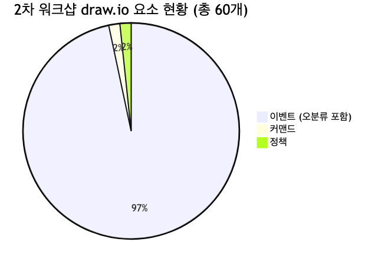

<details>
<summary>원본 Mermaid 코드 보기</summary>

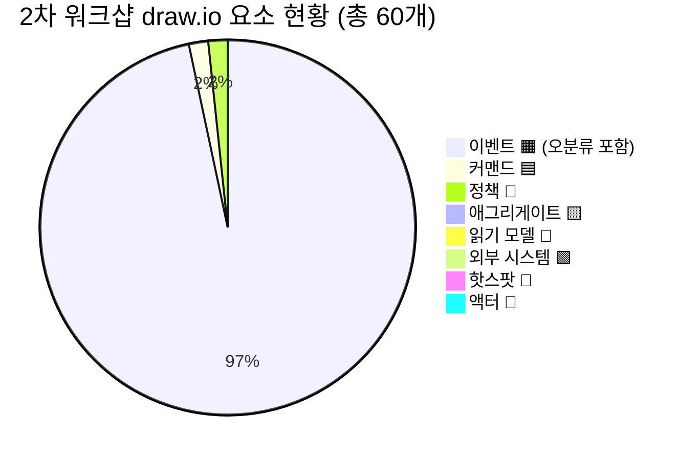

</details>

**① 좌측 이벤트 나열 영역 (x=40~860, y=130~860):**

| 유형 | 수량 | 주요 항목 |
|------|------|----------|
| 이벤트 🟧 | ~48개 | 검색성능 분석, 프로그램 목표 실적, 상품별 조회수 집계, 단품별 데이터 등록, 제작비/예산 등록, 편성 정보 관리, 운영 효율 관리, 세금계산서 API, 공급업체 조회 API, 제작비 등록, 인건비 관리, 모델/출연자 관리, 편성 상품목록, 미술DB 관리, 심의 운영, 변동비 집계, 방송 시간가치, 리포트 변경, 고객구분 변경, API 제공, 배치 실행, 목표관리, 편성 연동, 리포트북 관리, 콜 인입 그래프, 주문가능 수량, 웹사이트 관리, 외부업체 등록, 편성정보 API, 자산번호 등록, 상담원수 관리, 심의 결과, 라이브 방송출력, 녹화예약, 묶음 상품, 기준 정보, 주문 수량 조회, 예비 편성, 결제와 배송, 제작비, 판매데이터 집계, 실시간 판매데이터, 편성정보 확정, 인증 승인, 기상정보 수집, 사용자(MD) |
| 커맨드 🟦 | 0개 | — |
| 정책 💜 | 0개 | — |
| 외부 시스템 🟩 | 0개 | (6건이 이벤트로 오분류) |
| 액터 👤 | 0개 | (1건이 이벤트로 오분류: 사용자(MD)) |

**② 우측 편성 흐름 영역 (x=990~2060, y=180~480):**

| 유형 | 수량 | 주요 항목 |
|------|------|----------|
| 이벤트 🟧 | 10개 | 편성수정 등록됨, 편성 생성됨, 편성 버전 관리, 편성 확정 등록됨, 주간 편성 등록됨, PD/SH/ST 스케줄 관리, 추천상품 관리, 리소스 사용현황, 판매 상품에 방송스케줄 등록됨, 사용자(MD) |
| 커맨드 🟦 | 1개 | 편성 등록하기 |
| 정책 💜 | 1개 | 편성등록정책 |

### 2.3 준비 문서 목표 대비 달성도

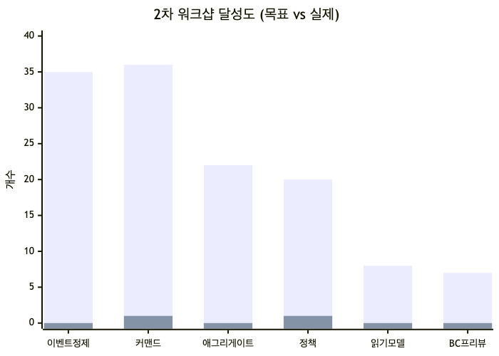

<details>
<summary>원본 Mermaid 코드 보기</summary>

```mermaid
xychart-beta
    title "2차 워크샵 달성도 (목표 vs 실제)"
    x-axis ["이벤트 정제", "커맨드", "애그리게이트", "정책", "읽기모델", "BC프리뷰"]
    y-axis "개수" 0 --> 40
    bar [35, 36, 22, 20, 8, 7]
    bar [0, 1, 0, 1, 0, 0]
```

</details>

| 항목 | 준비 문서 목표 | 실제 달성 | 달성률 | 상태 |
|------|--------------|----------|--------|------|
| 이벤트 정제 | ~46개 → ~35개 | 미수행 (48개 그대로) | 0% | ❌ 미수행 |
| 타임라인 정렬 (방송전/중/후) | 4개 구역 정렬 | 편성 흐름 1건만 | ~15% | ❌ 미흡 |
| 애그리게이트 식별 | ~22개 | 0개 | 0% | ❌ 미수행 |
| 정책 도출 | ~20개 | 1개 | 5% | ❌ 미흡 |
| 읽기 모델 도출 | ~8개 | 0개 | 0% | ❌ 미수행 |
| BC 프리뷰 | 7개 서비스 검증 | 미수행 | 0% | ❌ 미수행 |
| 커맨드·액터 재확인 | ~36개 재확인 | 1개 신규 | 3% | ❌ 미흡 |

**종합 달성률: ~3% (7개 항목 중 0개 완료, 2개 부분 달성)**

---

## 3. 달성도 분석

### 3.1 수행 방식 분석

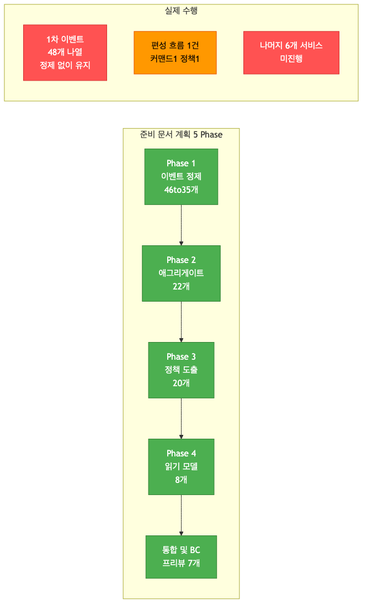

<details>
<summary>원본 Mermaid 코드 보기</summary>

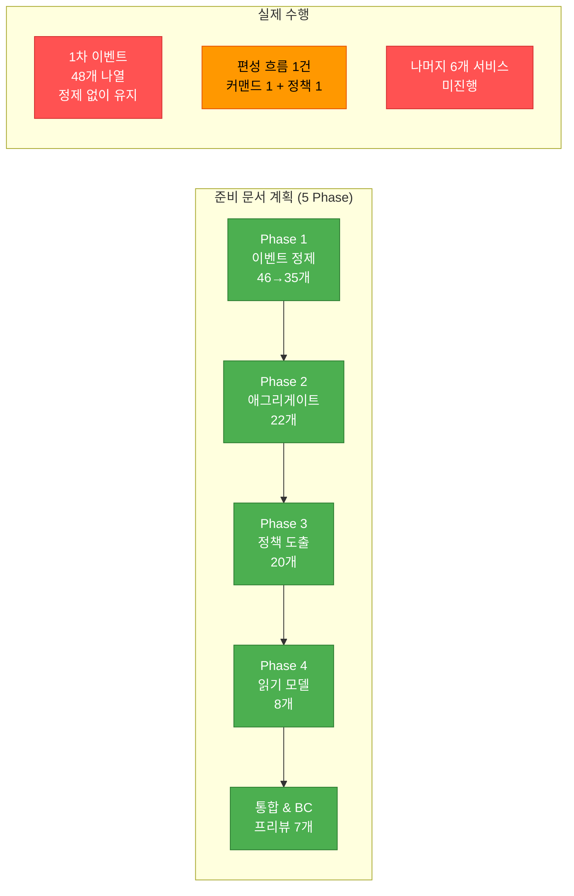

</details>

**핵심 문제 3가지:**

| # | 문제 | 영향 | 원인 추정 |
|---|------|------|----------|
| 1 | **이벤트 정제 미수행** | 48개 원본 이벤트가 정리 없이 유지. 소유권 불명확, 내부 단계/조회 이벤트 미구분 | 7개 서비스 간 소유권 판단이 어려웠을 가능성 |
| 2 | **편성 서비스만 부분 진행** | 1개 서비스만 커맨드→정책→이벤트 체인이 시도됨. 나머지 6개 서비스는 백지 | 편성이 가장 익숙한 영역이라 먼저 시도했으나, 시간 부족으로 나머지 미진행 |
| 3 | **색상 체계 미적용** | 60개 요소 중 58개가 오렌지색. 커맨드/외부시스템/액터/읽기모델 구분 없음 | 이벤트 스토밍 색상 체계 이해 부족 또는 1차 결과물을 그대로 옮겨 놓음 |

### 3.2 서비스별 커버리지

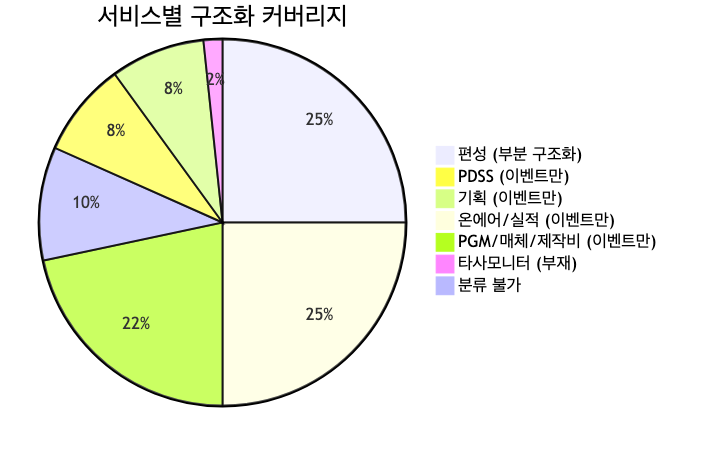

<details>
<summary>원본 Mermaid 코드 보기</summary>

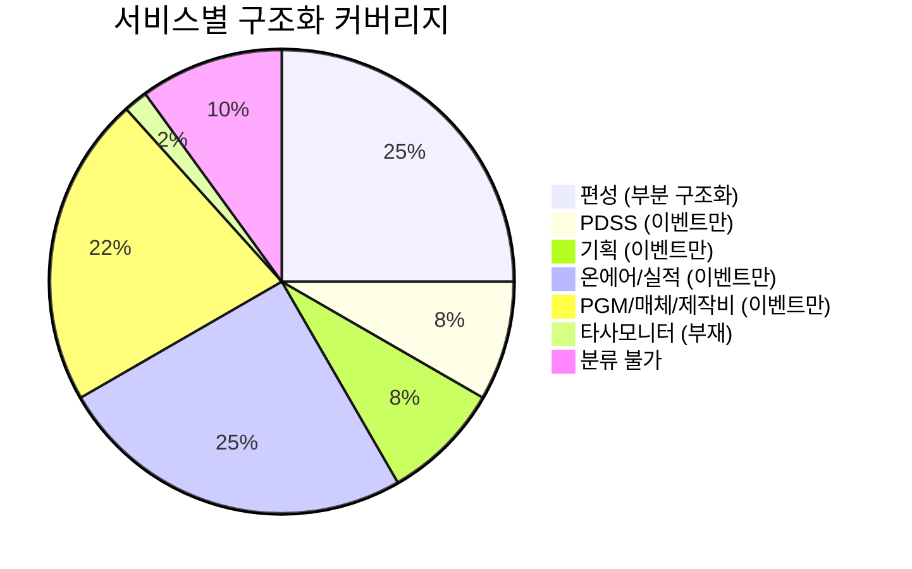

</details>

| 서비스 | 이벤트 수 (추정) | 커맨드 | 정책 | 애그리게이트 | 읽기 모델 | 커버리지 |
|--------|----------------|--------|------|------------|----------|---------|
| 편성 | ~15개 | 1개 | 1개 | 0개 | 0개 | 🟡 20% |
| PDSS | ~5개 | 0개 | 0개 | 0개 | 0개 | 🔴 5% |
| 기획 | ~5개 | 0개 | 0개 | 0개 | 0개 | 🔴 5% |
| 온에어/실적 | ~15개 | 0개 | 0개 | 0개 | 0개 | 🔴 5% |
| PGM/매체/제작비 | ~13개 | 0개 | 0개 | 0개 | 0개 | 🔴 5% |
| 타사모니터 | ~1개 | 0개 | 0개 | 0개 | 0개 | 🔴 0% |

> **참고:** 서비스별 분류는 포스트잇 내용을 기반으로 추정한 것이며, 실제 draw.io에는 서비스별 그룹핑이 없습니다.

---

## 4. 오분류 정리

### 4.1 오분류 유형별 요약

draw.io의 60개 포스트잇 중 **약 30건이 오분류**로 판단됩니다:

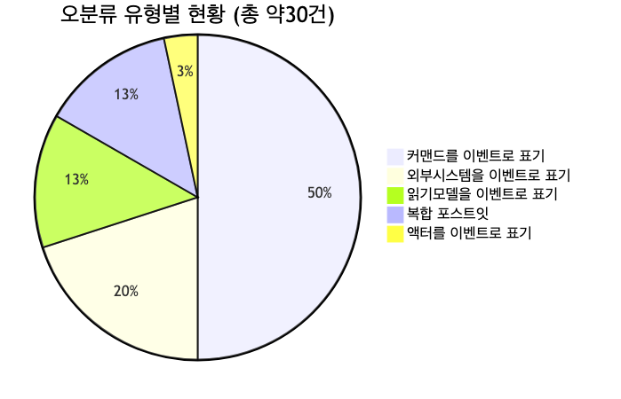

<details>
<summary>원본 Mermaid 코드 보기</summary>

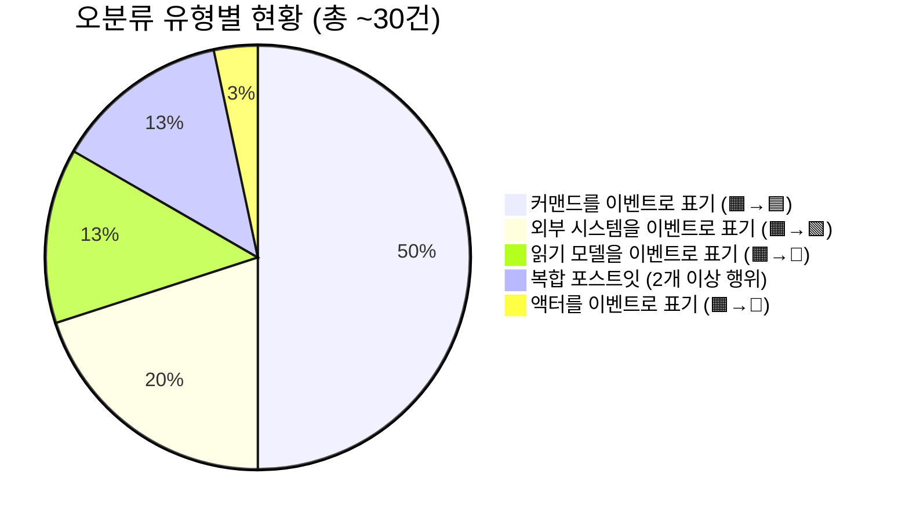

</details>

### 4.2 오분류 상세 (유형별)

#### Type 1: 커맨드를 이벤트로 표기 (🟧→🟦) — 15건

현재 시제("~한다", "~등록함", "~관리")로 작성되어 커맨드에 해당하는 항목들입니다.

| # | 현재 (🟧 이벤트) | 교정 (🟦 커맨드) | 소속 서비스 |
|---|-----------------|----------------|-----------|
| 1 | "단품별 데이터를 등록한다" | 단품 데이터 등록하기 | PDSS |
| 2 | "등록된 편성등록 정보 관리 한다" | 편성등록 정보 관리하기 | 편성 |
| 3 | "운영 효율 관리 기본 항목을 정의한다" | 운영 효율 기본항목 정의하기 | PGM |
| 4 | "방송 편성 상품목록 등록함" | 방송 편성 상품목록 등록하기 | 편성 |
| 5 | "팀별 목표관리를 등록한다" | 팀별 목표 등록하기 | PGM |
| 6 | "대외용 웹사이트를 관리한다" | 대외용 웹사이트 관리하기 | PDSS |
| 7 | "외부업체를 등록 및 교육한다" | 외부업체 등록하기 | PDSS |
| 8 | "상담원수를 관리한다" | 상담원수 관리하기 | 온에어 |
| 9 | "예비 편성 기본 정보 등록한다" | 예비 편성 등록하기 | 편성 |
| 10 | "모델 운영 출연자 정보 관리" | 출연자 정보 관리하기 | 기획 |
| 11 | "인건비 관리 슬롯스트 정보 관리" | 인건비/슬롯 정보 관리하기 | PGM |
| 12 | "편성 버전을 관리함" | 편성 버전 관리하기 | 편성 |
| 13 | "PD, SH, ST 스케줄을 관리함" | PD/SH/ST 스케줄 관리하기 | 편성 |
| 14 | "오늘의 추천상품 관리함 (쿠폰, 적립금, 타임세일)" | 추천상품 관리하기 | 온에어 |
| 15 | "TCOM 방송 자율 심의제 운영" | 심의 운영하기 | 기획 |

#### Type 2: 외부 시스템을 이벤트로 표기 (🟧→🟩) — 6건

API 연동 또는 외부 시스템 인터페이스에 해당하는 항목들입니다.

| # | 현재 (🟧 이벤트) | 교정 (🟩 외부 시스템) | 설명 |
|---|-----------------|-------------------|------|
| 1 | "이커머스팀 전사 세금계산서 스위칭 (API)" | 🟩 이커머스 세금계산서 API | 이커머스팀 제공 API |
| 2 | "이커머스팀 공급업체 정보 조회함 (API)" | 🟩 이커머스 공급업체 API | 이커머스팀 제공 API |
| 3 | "TCOM용으로 API를 제공한다" | 🟩 TCOM 연동 API | TCOM 외부 시스템 |
| 4 | "기상정보 수집함 (예: 기상청 API)" | 🟩 기상청 API | 외부 기상 데이터 |
| 5 | "주문 시스템에서 주문가능 수량을 가져온다" | 🟩 주문 시스템 | 내부 주문 시스템 연동 |
| 6 | "편성정보는 API 제공을 한다" | 🟩 편성정보 API | 타 시스템에 API 제공 |

#### Type 3: 읽기 모델을 이벤트로 표기 (🟧→📖) — 4건

화면 조회/대시보드/리포트에 해당하는 항목들입니다.

| # | 현재 (🟧 이벤트) | 교정 (📖 읽기 모델) | 대상 사용자 |
|---|-----------------|-------------------|-----------|
| 1 | "콜 인입정보를 그래프화하여 보여준다" | 📖 콜 인입현황 대시보드 | 🔧 운영자 |
| 2 | "출력 양식에 맞게 리포트북으로 데이터는 관리된다" | 📖 리포트북 (실적 리포트) | 🔧 운영자 |
| 3 | "리소스 사용현황" | 📖 리소스 사용현황 대시보드 | 🔧 운영자 |
| 4 | "리얼타임 주문 수량 조회함" | 📖 실시간 주문현황 읽기모델 | 👤 방송 PD |

#### Type 4: 복합 포스트잇 (분리 필요) — 4건

하나의 포스트잇에 2개 이상의 행위가 기술된 항목들입니다.

| # | 현재 | 분리안 |
|---|------|--------|
| 1 | "편성이 생성됨 PDSS 편성 등록함" | 🟧 "편성이 생성되었다" + 🟦 "PDSS 편성 등록하기" |
| 2 | "제작 비 오피스텔, 팀별 예산 등록 하였다" | 🟧 "제작비 예산이 등록되었다" + 🟧 "팀별 예산이 등록되었다" |
| 3 | "미술 DB PGM별, 시연예약 이전 등록, 관리한다" | 🟧 "미술DB가 등록되었다" + 🟧 "시연예약이 등록되었다" |
| 4 | "방송 시간대별 상세 가치 시간 리포트 변경 생성함" | 🟧 "시간가치 리포트가 생성되었다" + 🟦 "리포트 변경하기" |

#### Type 5: 액터를 이벤트로 표기 (🟧→👤) — 1건

| # | 현재 (🟧 이벤트) | 교정 (👤 액터) |
|---|-----------------|---------------|
| 1 | "사용자 (MD)" | 👤 MD (상품 기획자) |

### 4.3 교정 후 예상 현황

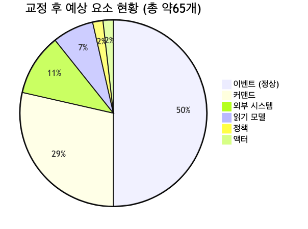

<details>
<summary>원본 Mermaid 코드 보기</summary>

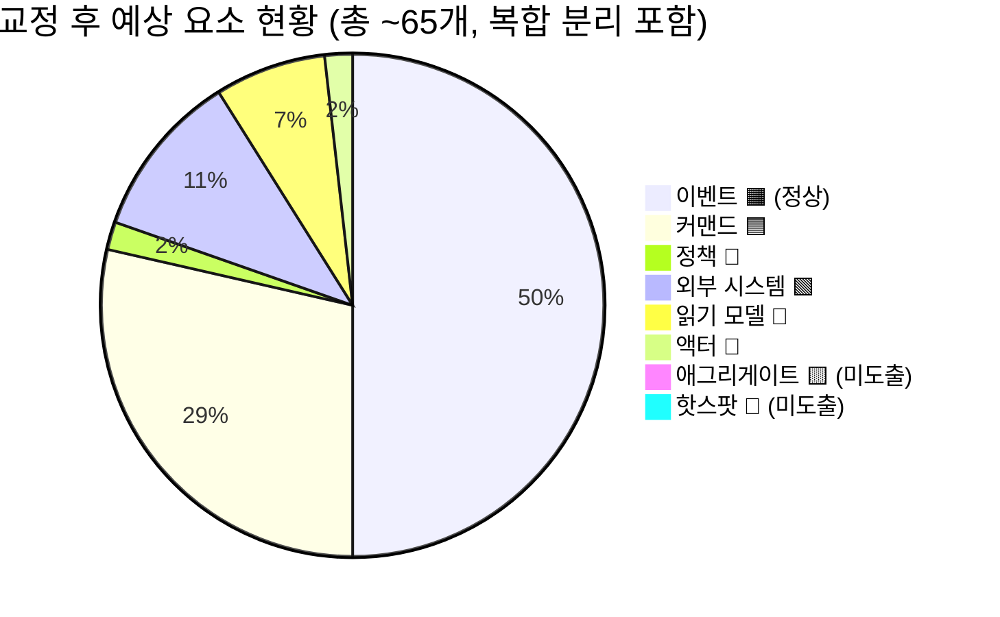

</details>

| 항목 | 교정 전 | 교정 후 |
|------|--------|--------|
| 이벤트 🟧 | 58개 | ~28개 |
| 커맨드 🟦 | 1개 | ~16개 (기존 1 + 오분류 15) |
| 정책 💜 | 1개 | 1개 (변동 없음) |
| 외부 시스템 🟩 | 0개 | 6개 |
| 읽기 모델 📖 | 0개 | 4개 |
| 액터 👤 | 0개 | 1개 |
| 애그리게이트 🟨 | 0개 | 0개 (3차에서 도출 필요) |
| 핫스팟 🩷 | 0개 | 0개 (3차에서 도출 필요) |

---

## 5. 흐름 분석

### 5.1 편성 흐름 (유일하게 구조화된 영역)

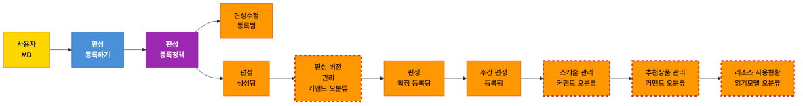

<details>
<summary>원본 Mermaid 코드 보기</summary>

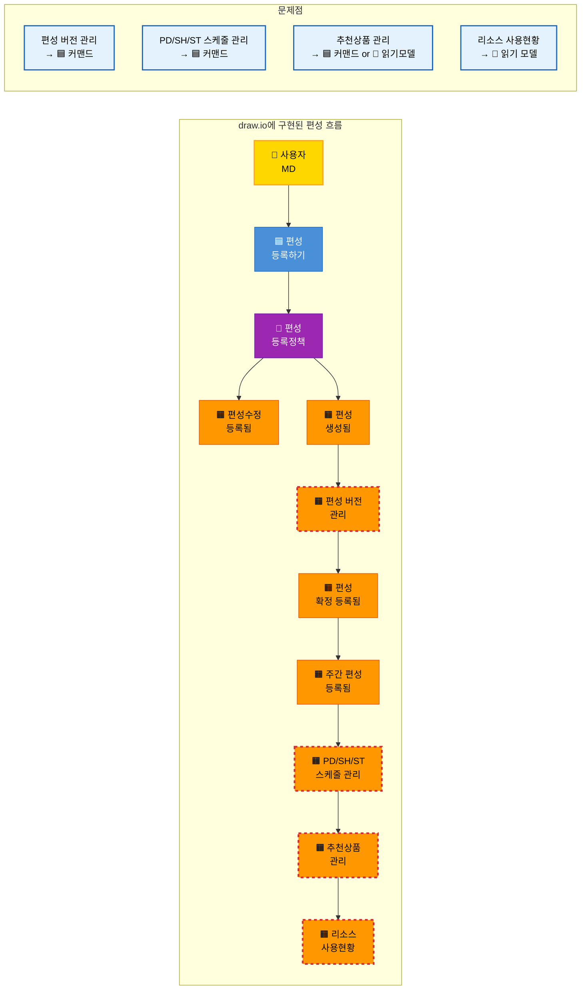

</details>

**편성 흐름 평가:**
- 액터(MD) → 커맨드(편성 등록) → 정책(편성등록정책) → 이벤트 체인의 기본 구조는 올바름
- 그러나 이벤트 체인 후반부(편성 버전 관리, 스케줄 관리, 추천상품 관리, 리소스 사용현황)는 **이벤트가 아닌 커맨드/읽기모델이 혼합**되어 있음
- 편성 확정 이후의 다른 서비스 연동(온에어 읽기모델 생성, PGM/매체 데이터 전달)이 누락됨

### 5.2 서비스별 이벤트 재분류 (준비 문서 기반)

draw.io의 포스트잇 내용을 준비 문서의 7개 서비스에 매핑하면 다음과 같습니다:

| 서비스 | draw.io 포스트잇 (교정 후) | 준비 문서 예상 이벤트 | 갭 |
|--------|--------------------------|--------------------|----|
| **PDSS** | 기준정보 등록, 단품별 데이터 등록, 대외용 웹사이트, 외부업체 등록 | 채널 등록/변경, 프로그램유형 정의, 시간대 정책, 채널 요율 | 핵심 이벤트(채널, 프로그램유형) 부재 |
| **편성** | 편성등록, 편성수정, 편성생성, 편성확정, 주간편성, 예비편성, 편성상품목록, 편성연동, 편성정보확정 | 편성표 생성/확정/마감, 편성항목 배치, 긴급편성 | 내용은 유사하나 정제 필요 |
| **기획** | 모델/출연자 관리, 미술DB 관리, 심의 운영, 심의 결과 | 기획서 작성/승인/반려, 출연자 확정, 방송준비 완료 | 기획서 라이프사이클 부재 |
| **온에어** | 라이브 방송출력, 실시간 판매데이터, 주문수량 조회, 상담원수 관리 | 방송 시작/종료, 상품 교체, 긴급 공지 | 방송 상태 이벤트 부재 |
| **PGM/매체** | 제작비(3건), 변동비 집계, 프로그램 목표 실적, 검색성능 분석, 조회수 집계, 인건비 관리, 목표관리, 방송시간가치 | 방송실적 집계, 정산 완료/확정, 매체비용 산출 | 실적/정산 핵심 이벤트 부재 |
| **타사모니터** | 기상정보 수집(외부시스템) | 타사편성 수집, 비교분석 완료 | 거의 전부 부재 |

### 5.3 준비 문서에서 기대했으나 draw.io에 없는 핵심 이벤트

| # | 서비스 | 누락된 핵심 이벤트 | 중요도 |
|---|--------|------------------|--------|
| 1 | 편성 | "편성표가 마감되었다" | 높음 — 방송 30분 전 변경 마감 정책과 연결 |
| 2 | 편성 | "긴급편성이 적용되었다" | 높음 — 방송 직전 긴급 변경 흐름 |
| 3 | 기획 | "기획서가 승인되었다 / 반려되었다" | 높음 — 기획-편성 연결의 핵심 |
| 4 | 기획 | "방송준비가 완료되었다" | 높음 — 방송 가능 상태 확인 |
| 5 | 온에어 | "방송이 시작되었다 / 종료되었다" | 높음 — 방송 라이프사이클의 핵심 |
| 6 | 온에어 | "방송 중 상품이 교체되었다" | 높음 — 실시간 운영 핵심 |
| 7 | PGM | "방송실적이 집계되었다" | 높음 — 방송 후 정산 시작점 |
| 8 | PGM | "정산이 확정되었다" | 높음 — 정산 프로세스 완료 |
| 9 | 매체 | "매체비용이 정산되었다" | 높음 — 매체 정산 완료 |
| 10 | 타사모니터 | "타사편성정보가 수집되었다" | 중간 — 경쟁사 분석 기반 |

---

## 6. 미완료 항목 정리

### 6.1 미완료 항목 전체 목록

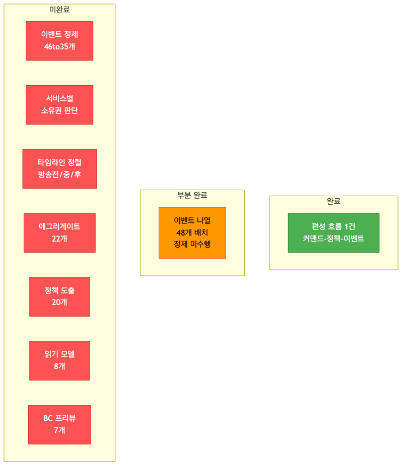

<details>
<summary>원본 Mermaid 코드 보기</summary>

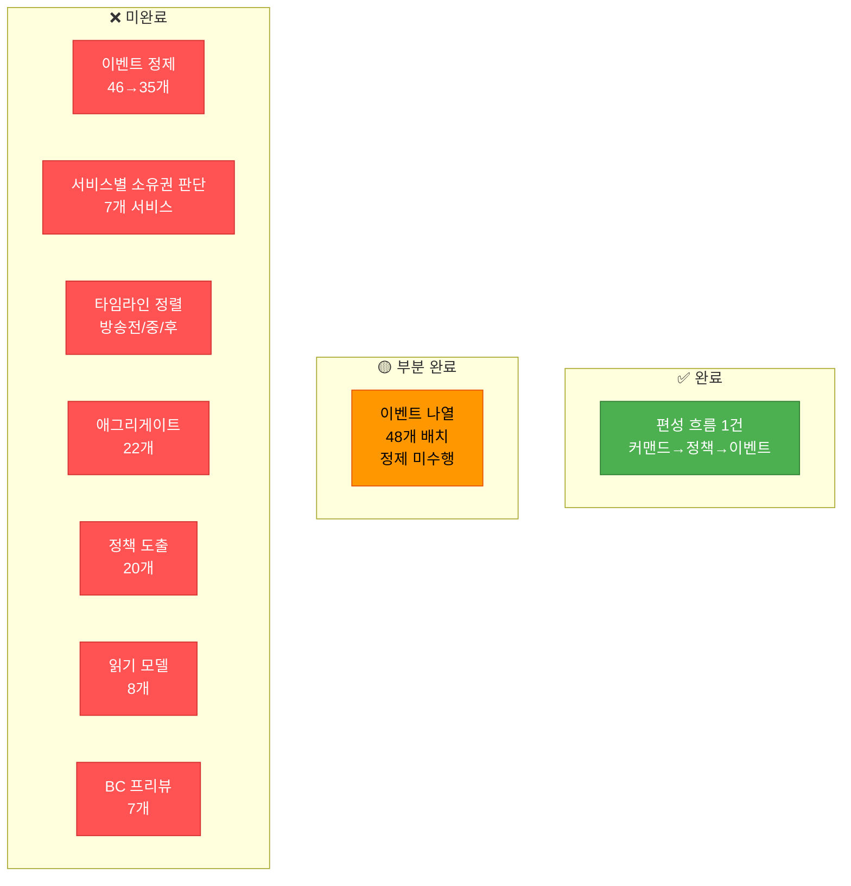

</details>

| # | 항목 | 상태 | 설명 |
|---|------|------|------|
| 1 | 이벤트 정제 (46→35개) | ❌ | 소유권 판단, 내부 단계 제거, 중복 통합 미수행 |
| 2 | 이벤트 재분류 (조회→읽기모델) | ❌ | 온에어 "조회" 이벤트 5건 → 읽기 모델 전환 미수행 |
| 3 | 색상 오분류 교정 (30건) | ❌ | 커맨드 15건, 외부시스템 6건, 읽기모델 4건, 복합 4건, 액터 1건 |
| 4 | 서비스별 소유권 판단 | ❌ | 준비 문서의 소유권 불명확 이벤트 3건 미판정 |
| 5 | 타임라인 정렬 (방송전/중/후) | ❌ | 4개 구역(시간축 무관, 방송전, 방송중, 방송후) 정렬 미수행 |
| 6 | 애그리게이트 식별 (22개) | ❌ | 전혀 도출되지 않음 |
| 7 | 정책 도출 (20개) | ❌ | 1건만 도출 (편성등록정책), 나머지 19건 미도출 |
| 8 | 읽기 모델 도출 (8개) | ❌ | 전혀 도출되지 않음 (온에어 5개 + 운영자 3개) |
| 9 | BC 프리뷰 (7개 서비스) | ❌ | 전혀 수행되지 않음 |
| 10 | Fade out 서비스 논의 (매체/PGM) | ❌ | 매체/PGM 범위 논의 미수행 |

### 6.2 미완료 원인 분석

| 원인 | 영향 범위 | 해결 방안 |
|------|----------|----------|
| 7개 서비스를 한 번에 다루려다 범위 초과 | 전체 | 3차에서 서비스 2~3개씩 나눠 집중 진행 |
| 이벤트 스토밍 색상 체계 이해 부족 | 색상 오분류 30건 | 3차 시작 시 색상 체계 재설명 (5분) |
| 1차 이벤트를 정제 없이 그대로 사용 | 정제 미수행 | 3차 시작 전 퍼실리테이터가 사전 분류안 준비 |
| 편성 외 서비스 담당자의 이벤트 스토밍 경험 부족 | 6개 서비스 미진행 | 서비스별 예시를 미리 보여주며 진행 |

---

## 7. 3차 워크샵 권장사항

### 7.1 3차 워크샵 목표

2차 워크샵 달성률이 매우 낮으므로, 3차에서는 **2차 미완료 항목 + 원래 3차 목표(BC 확정)**를 병행해야 합니다.

```
┌─────────────────────────────────────────────────────────────┐
│              3차 워크샵에서 달성할 것                          │
├─────────────────────────────────────────────────────────────┤
│                                                             │
│  ✅ 색상 오분류 교정 및 이벤트 정제 (~35개)                 │
│  ✅ 서비스별 소유권 확정 + 타임라인 정렬                     │
│  ✅ 애그리게이트: ~22개 후보 확정                            │
│  ✅ 정책: 핵심 ~10개 도출 (서비스당 1~2개)                  │
│  ✅ 읽기 모델: ~8개 확정 (온에어 5개 + 운영자 3개)          │
│  ✅ BC 프리뷰: 7개 서비스 = 7개 BC 검증                     │
│                                                             │
└─────────────────────────────────────────────────────────────┘
```

### 7.2 권장 타임라인

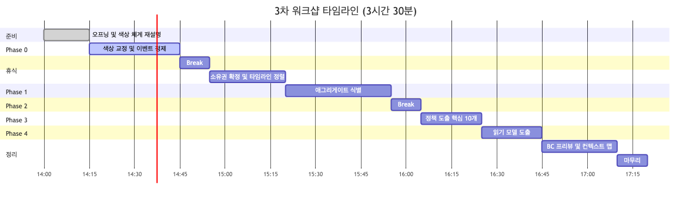

<details>
<summary>원본 Mermaid 코드 보기</summary>

```mermaid
gantt
    title 3차 워크샵 타임라인 (3시간 30분)
    dateFormat HH:mm
    axisFormat %H:%M

    section 준비
    오프닝 및 색상 체계 재설명        :done, 14:00, 15m

    section Phase 0
    색상 교정 및 이벤트 정제          :active, 14:15, 30m

    section 휴식
    Break                           :14:45, 10m

    section Phase 1
    서비스별 소유권 확정 + 타임라인   :14:55, 25m

    section Phase 2
    애그리게이트 식별 (7개 서비스)    :15:20, 35m

    section 휴식
    Break                           :15:55, 10m

    section Phase 3
    정책 도출 (핵심 10개)            :16:05, 20m

    section Phase 4
    읽기 모델 도출 (온에어 중심)      :16:25, 20m

    section 정리
    BC 프리뷰 및 컨텍스트 맵 초안     :16:45, 25m
    마무리                           :17:10, 10m
```

</details>

| 시간 | 단계 | 소요 | 핵심 활동 | 산출물 |
|------|------|------|----------|--------|
| 14:00 | 오프닝 | 15분 | 색상 체계 재설명 (🟧🟦💜🟨📖🟩🩷), 2차 결과 리뷰 | — |
| 14:15 | Phase 0: 색상 교정 + 정제 | 30분 | 오분류 30건 색상 교정, 이벤트 48→35개 정제, 복합 포스트잇 분리 | 교정된 보드 |
| 14:45 | 휴식 | 10분 | — | — |
| 14:55 | Phase 1: 소유권 + 타임라인 | 25분 | 서비스별 이벤트 소유권 확정, 방송전/중/후 타임라인 정렬 | 서비스별 분류된 보드 |
| 15:20 | Phase 2: 애그리게이트 | 35분 | 7개 서비스별 애그리게이트 도출 (서비스당 5분) | ~22개 후보 |
| 15:55 | 휴식 | 10분 | — | — |
| 16:05 | Phase 3: 정책 | 20분 | 핵심 정책 도출 (서비스당 1~2개) | ~10개 후보 |
| 16:25 | Phase 4: 읽기 모델 | 20분 | 온에어 5개 + 운영자 화면 3개 | ~8개 후보 |
| 16:45 | BC 프리뷰 + 정리 | 25분 | 7개 BC 검증, 컨텍스트 맵 초안, Fade out 논의 | BC 프리뷰 |
| 17:10 | 마무리 | 10분 | 다음 단계 안내 | — |
| **17:20** | **종료** | **3시간 20분** | | |

> **시간 증가 사유:** 2차 미완료분(색상 교정 + 이벤트 정제)을 Phase 0으로 추가하여 30분 연장.

### 7.3 퍼실리테이터 사전 준비 사항

3차 워크샵의 효율성을 높이기 위해, **퍼실리테이터가 사전에 준비해야 할 사항**:

| # | 준비 사항 | 목적 | 기한 |
|---|----------|------|------|
| 1 | 오분류 30건에 대한 교정안 프린트 | Phase 0에서 빠르게 교정 진행 | 워크샵 D-3 |
| 2 | 서비스별 이벤트 분류 초안 | Phase 1에서 소유권 논의의 시작점 | 워크샵 D-3 |
| 3 | 색상 체계 설명 1페이지 요약 인쇄 | 오프닝 배포 자료 | 워크샵 D-1 |
| 4 | 준비 문서의 애그리게이트 22개 후보 인쇄 | Phase 2에서 참조 자료 | 워크샵 D-1 |
| 5 | 온에어 읽기모델 5개 예시 인쇄 | Phase 4에서 "방송 제어판" 비유 활용 | 워크샵 D-1 |

### 7.4 정제 우선순위

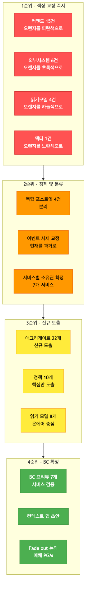

<details>
<summary>원본 Mermaid 코드 보기</summary>

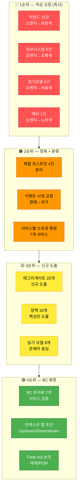

</details>

### 7.5 성공 기준

3차 워크샵 종료 시 아래 항목이 달성되어야 합니다:

- [ ] 색상 오분류 30건 교정 완료
- [ ] 이벤트 48개 → ~35개 정제
- [ ] 서비스별 소유권 확정 (7개 서비스)
- [ ] 방송전/중/후 타임라인 정렬
- [ ] 애그리게이트 ~22개 후보 확정
- [ ] 정책 ~10개 핵심 도출
- [ ] 읽기 모델 ~8개 확정
- [ ] BC 프리뷰 7개 검증
- [ ] Fade out 서비스(매체/PGM) 방향 논의

---

## 부록: draw.io 포스트잇 전수 목록 (60개)

### A. 좌측 이벤트 나열 영역 (48개, x=40~860)

| # | 포스트잇 | 색상 | 위치 (x,y) | 교정 유형 | 소속 서비스 (추정) |
|---|---------|------|-----------|----------|-----------------|
| 1 | 상품별 검색성능을 분석하였다 | 🟧 | (50,130) | 정상 이벤트 | PGM |
| 2 | 프로그램 목표 실적을 하였다 | 🟧 | (50,230) | 정상 이벤트 | PGM |
| 3 | 상품별 조회수를 집계하였다 | 🟧 | (50,330) | 정상 이벤트 | PGM |
| 4 | 단품별 데이터를 등록한다 | 🟧 | (50,430) | 🟦 커맨드 | PDSS |
| 5 | 제작 비 오피스텔, 팀별 예산 등록 하였다 | 🟧 | (50,550) | 복합 분리 | PGM/매체 |
| 6 | 등록된 편성등록 정보 관리 한다 | 🟧 | (40,690) | 🟦 커맨드 | 편성 |
| 7 | 운영 효율 관리 기본 항목을 정의한다 | 🟧 | (160,130) | 🟦 커맨드 | PGM |
| 8 | 이커머스팀 전사 세금계산서 스위칭 (API) | 🟧 | (160,220) | 🟩 외부 시스템 | — |
| 9 | 이커머스팀 공급업체 정보 조회함 (API) | 🟧 | (160,310) | 🟩 외부 시스템 | — |
| 10 | 제작비 전사배부 정보 등록함 | 🟧 | (160,390) | 정상 이벤트 | PGM/매체 |
| 11 | 제작비 계열관리 예산 등록함 | 🟧 | (160,480) | 정상 이벤트 | PGM/매체 |
| 12 | 인건비 관리 슬롯스트 정보 관리 | 🟧 | (160,570) | 🟦 커맨드 | PGM |
| 13 | 모델 운영 출연자 정보 관리 | 🟧 | (160,660) | 🟦 커맨드 | 기획 |
| 14 | 방송 편성 상품목록 등록함 | 🟧 | (150,750) | 🟦 커맨드 | 편성 |
| 15 | 미술 DB PGM별, 시연예약 이전 등록, 관리한다 | 🟧 | (260,130) | 복합 분리 | 기획 |
| 16 | 방송 편성 상품 목록 계획 예상 실적함 | 🟧 | (260,240) | 정상 이벤트 | 편성 |
| 17 | TCOM 방송 자율 심의제 운영 | 🟧 | (260,340) | 🟦 커맨드 | 기획 |
| 18 | 실시간 프로그램별 변동비 집계 관리 | 🟧 | (260,440) | 정상 이벤트 | PGM/매체 |
| 19 | 방송 시간대별 상세 가치 시간 기록 생성 | 🟧 | (260,540) | 정상 이벤트 | PGM |
| 20 | 방송 시간대별 상세 가치 시간 리포트 변경 생성함 | 🟧 | (260,640) | 복합 분리 | PGM |
| 21 | 프로그램 고객구분 다음 변경 처리함 | 🟧 | (260,740) | 정상 이벤트 | PGM |
| 22 | TCOM용으로 API를 제공한다 | 🟧 | (380,130) | 🟩 외부 시스템 | — |
| 23 | 배치는 오전 8시로 실행한다 | 🟧 | (380,230) | 💜 정책 후보 | PGM |
| 24 | 팀별 목표관리를 등록한다 | 🟧 | (380,330) | 🟦 커맨드 | PGM |
| 25 | 팀별 편성정보 CA, RP 연동 배부함 한다 | 🟧 | (380,430) | 정상 이벤트 | 편성 |
| 26 | 출력 양식에 맞게 리포트북으로 데이터는 관리된다 | 🟧 | (380,530) | 📖 읽기 모델 | PGM |
| 27 | 콜 인입정보를 그래프화하여 보여준다 | 🟧 | (380,630) | 📖 읽기 모델 | 온에어 |
| 28 | 주문 시스템에서 주문가능 수량을 가져온다 | 🟧 | (380,730) | 🟩 외부 시스템 | — |
| 29 | 대외용 웹사이트를 관리한다 | 🟧 | (470,130) | 🟦 커맨드 | PDSS |
| 30 | 외부업체를 등록 및 교육한다 | 🟧 | (470,330) | 🟦 커맨드 | PDSS |
| 31 | 편성정보는 API 제공을 한다 | 🟧 | (470,430) | 🟩 외부 시스템 | — |
| 32 | 방송별 자산번호를 등록한다 | 🟧 | (470,530) | 정상 이벤트 | PDSS |
| 33 | 상담원수를 관리한다 | 🟧 | (470,630) | 🟦 커맨드 | 온에어 |
| 34 | 심의 결과 등록함 | 🟧 | (570,130) | 정상 이벤트 | 기획 |
| 35 | 라이브 방송출력정보를 등록함 | 🟧 | (570,230) | 정상 이벤트 | 온에어 |
| 36 | 유료 녹화예약, 처리비 등록함 | 🟧 | (570,330) | 정상 이벤트 | 기획 |
| 37 | 묶음 상품 등록함 | 🟧 | (570,530) | 정상 이벤트 | 편성 |
| 38 | 기준 정보 등록함 | 🟧 | (570,730) | 정상 이벤트 | PDSS |
| 39 | 리얼타임 주문 수량 조회함 | 🟧 | (650,220) | 📖 읽기 모델 | 온에어 |
| 40 | 예비 편성 기본 정보 등록한다 | 🟧 | (650,320) | 🟦 커맨드 | 편성 |
| 41 | 결제와 배송 정보 등록함 | 🟧 | (650,420) | 정상 이벤트 | 온에어 |
| 42 | 제작비 등록함 | 🟧 | (660,720) | 정상 이벤트 | PGM/매체 |
| 43 | 상품별 판매데이터 집계되었다 | 🟧 | (770,260) | 정상 이벤트 | PGM |
| 44 | 실시간 판매데이터 집계되었다 | 🟧 | (750,460) | 정상 이벤트 | PGM |
| 45 | 한 주간 편성정보가 확정되었다 | 🟧 | (750,640) | 정상 이벤트 | 편성 |
| 46 | 인증 시험/승인 완료함 | 🟧 | (740,780) | 정상 이벤트 | PDSS |
| 47 | 사용자 (MD) | 🟧 | (990,190) | 👤 액터 | — |
| 48 | 기상정보 수집함 (예: 기상청 API) | 🟧 | (860,660) | 🟩 외부 시스템 | — |

### B. 우측 편성 흐름 영역 (12개, x=1070~2060)

| # | 포스트잇 | 색상 | 위치 (x,y) | 교정 유형 | 소속 서비스 |
|---|---------|------|-----------|----------|-----------|
| 49 | 편성 등록하기 | 🟦 | (1070,183) | 정상 커맨드 | 편성 |
| 50 | 편성등록정책 | 💜 | (1175,188) | 정상 정책 | 편성 |
| 51 | 편성수정 필요시 편성수정 등록됨 | 🟧 | (1280,183) | 정상 이벤트 | 편성 |
| 52 | 편성이 생성됨 PDSS 편성 등록함 | 🟧 | (1280,278) | 복합 분리 | 편성/PDSS |
| 53 | 편성 버전을 관리함 | 🟧 | (1405,228) | 🟦 커맨드 | 편성 |
| 54 | 편성일이 편성 확정 등록됨 | 🟧 | (1575,243) | 정상 이벤트 | 편성 |
| 55 | 주간 편성 등록됨 | 🟧 | (1735,258) | 정상 이벤트 | 편성 |
| 56 | PD, SH, ST 스케줄을 관리함 | 🟧 | (1875,273) | 🟦 커맨드 | 편성 |
| 57 | 오늘의 추천상품 관리함 (쿠폰, 적립금, 타임세일) | 🟧 | (1885,368) | 🟦 커맨드 | 온에어 |
| 58 | 리소스 사용현황 | 🟧 | (1895,473) | 📖 읽기 모델 | PGM |
| 59 | 판매 상품에 방송스케줄 등록됨 | 🟧 | (2000,283) | 정상 이벤트 | 편성 |
