# 채널 시스템 이벤트 스토밍 2차 워크샵 준비 가이드

## 1. 개요

### 1.1 이 문서의 목적

채널시스템 이벤트 스토밍 **2차 워크샵**을 진행하는 퍼실리테이터를 위한 실전 가이드입니다.
1차에서 도출한 이벤트를 기반으로, **타임라인 정렬 → 애그리게이트 → 정책 → 읽기 모델 → BC 프리뷰**까지 완성하는 것이 목표입니다.

```
┌─────────────────────────────────────────────────────────────┐
│              2차 워크샵에서 달성할 것                         │
├─────────────────────────────────────────────────────────────┤
│                                                             │
│  ✅ 이벤트 정제: ~46개 → ~35개 (소유권 판단 + 통합)        │
│  ✅ 시간축별 타임라인 정렬 (방송전/중/후)                   │
│  ✅ 애그리게이트: ~22개 후보 확정 (7개 서비스별)            │
│  ✅ 정책: ~20개 후보 도출                                   │
│  ✅ 읽기 모델: ~8개 후보 도출 (온에어 5개 + 기타 3개)       │
│  ✅ 바운디드 컨텍스트 프리뷰: 7개 서비스 = 7개 BC 검증      │
│                                                             │
└─────────────────────────────────────────────────────────────┘
```

### 1.2 1차 요약 & 2차 목표

| 항목 | 1차 완료 | 2차 목표 |
|------|---------|---------|
| 이벤트 도출 | ✅ ~46개 (7개 서비스) | 정제하여 ~35개로 통합 |
| 타임라인 정렬 | ⬜ 미수행 | **시간축별(방송전/중/후) 정렬** |
| 커맨드·액터 | ✅ ~36개 | 서비스별 소유권 재확인 |
| 애그리게이트 | ⬜ 미수행 | **~22개 후보 확정** |
| 정책 | ⬜ 미수행 | **~20개 후보 도출** |
| 읽기 모델 | ⬜ 미수행 | **~8개 후보 도출** |
| 바운디드 컨텍스트 | ⬜ 미수행 | **7개 BC 프리뷰** |

### 1.3 참조 문서

| 참조 문서 | 활용 시점 |
|----------|----------|
| [이벤트스토밍_채널시스템_가이드.md](./이벤트스토밍_채널시스템_가이드.md) | 핵심 도전 7가지, 서비스별 판단 기준 |
| [이벤트스토밍_채널시스템_도메인예시.md](./이벤트스토밍_채널시스템_도메인예시.md) | 7개 서비스별 이벤트·커맨드·애그리게이트·정책 예시 |
| [이벤트스토밍_채널시스템_서비스간흐름.md](./이벤트스토밍_채널시스템_서비스간흐름.md) | 서비스 간 이벤트 흐름, 컨텍스트 맵 |
| [이벤트스토밍_채널시스템_워크샵실행.md](./이벤트스토밍_채널시스템_워크샵실행.md) | 퍼실리테이터 스크립트 10개, FAQ |

---

## 2. 1차 결과 정리 및 재검토

### 2.1 현재 요소 현황 요약

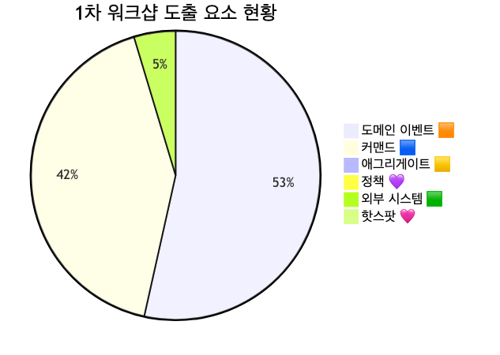

<details>
<summary>📊 원본 Mermaid 코드 보기</summary>

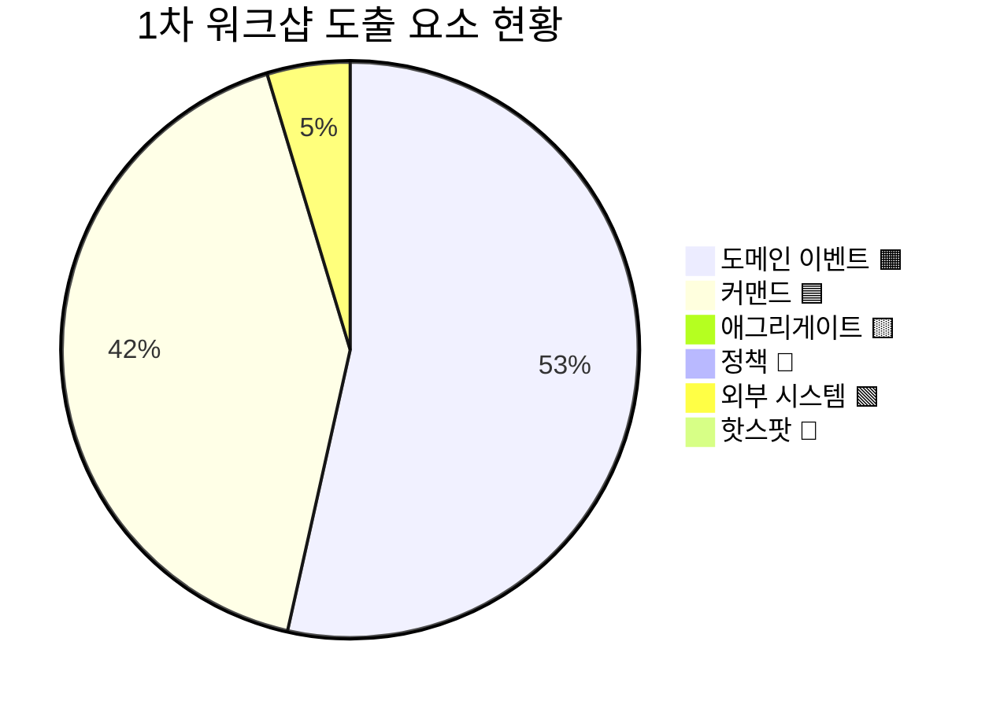

</details>

**현황 분석:**
- 이벤트 ~46개, 커맨드 ~36개를 도출했으나 **서비스 간 소유권이 불명확한 이벤트가 다수**
- 애그리게이트·정책·읽기 모델은 **전혀 미수행** — 2차에서 집중 진행
- 7개 서비스가 **방송 라이프사이클(전/중/후)**에 따라 흩어져 있어 타임라인 정렬이 핵심
- 온에어 서비스는 **Read 위주**로 이벤트보다 읽기 모델이 핵심 역할
- 매체·PGM 서비스의 **Fade out 가능성**이 있어 범위 논의 필요

### 2.2 7개 흐름 영역(방송 라이프사이클) 전체 맵

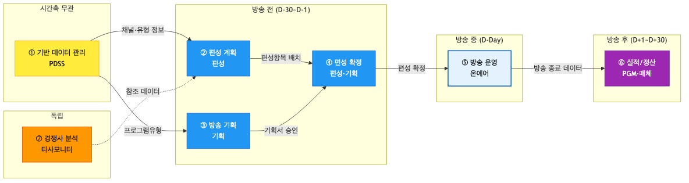

<details>
<summary>📊 원본 Mermaid 코드 보기</summary>

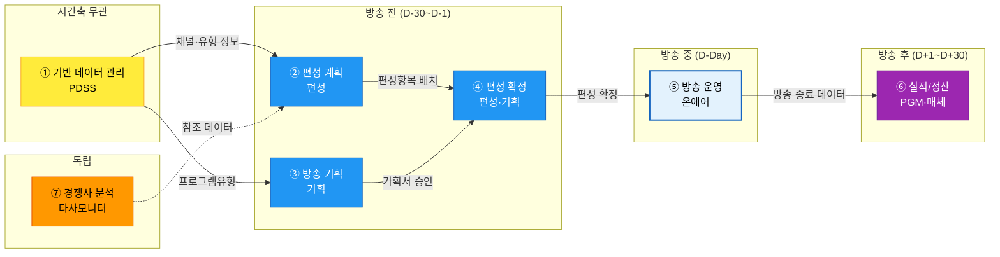

</details>

**영역별 상세:**

| 영역 | 시간축 | 서비스 | 핵심 이벤트 |
|------|--------|--------|-----------|
| ① 기반 데이터 관리 | 무관 | PDSS | 채널 등록/변경, 프로그램유형 정의 |
| ② 편성 계획 | 방송 전 (D-30~D-7) | 편성 | 편성표 생성, 편성항목 배치 |
| ③ 방송 기획 | 방송 전 (D-30~D-7) | 기획 | 기획서 작성, 승인, 출연자 확정 |
| ④ 편성 확정 | 방송 전 (D-7~D-1) | 편성·기획 | 편성표 확정, 긴급편성 |
| ⑤ 방송 운영 | 방송 중 (D-Day) | 온에어 | 방송 시작/종료, 📖 읽기 모델 5개 |
| ⑥ 실적/정산 | 방송 후 (D+1~D+30) | PGM·매체 | 실적 집계, 정산 확정 |
| ⑦ 경쟁사 분석 | 독립 | 타사모니터 | 타사편성 수집, 비교분석 |

### 2.3 이벤트 재검토 항목

#### 2.3.1 서비스 간 소유권 불명확 이벤트

| # | 이벤트 | 소유 후보 A | 소유 후보 B | 판단 기준 |
|---|--------|-----------|-----------|----------|
| 1 | "편성 확정 시 읽기 모델 생성" | 편성 | 온에어 | **데이터 변경 주체** — 편성이 확정을 발행, 온에어가 읽기 모델을 생성. 편성 확정 = 편성 소유, 읽기 모델 생성 = 온에어 소유 |
| 2 | "출연자 변경 후 편성 영향" | 기획 | 편성 | **출연자 데이터 변경** = 기획 소유. **편성 변경 필요** = 편성이 후속 처리 |
| 3 | "방송 종료 후 실적 집계 시작" | 온에어 | PGM | **방송 종료** = 온에어 소유. **실적 집계** = PGM 소유 (정책으로 연결) |

#### 2.3.2 내부 처리 단계 vs 도메인 이벤트 구분

| # | 원본 | 처리 방안 | 사유 |
|---|------|----------|------|
| 1 | "편성표 초안이 작성되었다" | **통합** → "편성표가 생성되었다" | 초안은 내부 단계 |
| 2 | "기획서 임시저장되었다" | **제외** | 비즈니스 이벤트가 아닌 기능적 동작 |
| 3 | "채널정보 조회되었다" | **제외** | 조회는 이벤트가 아님 (상태 변경 없음) |
| 4 | "편성항목 순서가 변경되었다" | **통합** → "편성항목이 배치되었다"에 포함 | 배치의 일부 |

#### 2.3.3 Read 모델로 전환 대상 (온에어 "조회" 이벤트)

| # | 원본 이벤트 | 전환 | 사유 |
|---|-----------|------|------|
| 1 | "편성정보가 조회되었다" | → 📖 편성정보 읽기모델 | 조회 = 읽기 모델 |
| 2 | "실시간 주문현황이 표시되었다" | → 📖 실시간주문현황 읽기모델 | 화면 표시 = 읽기 모델 |
| 3 | "방송상품이 조회되었다" | → 📖 방송상품정보 읽기모델 | 조회 = 읽기 모델 |
| 4 | "재고 현황이 표시되었다" | → 📖 실시간재고 읽기모델 | 화면 표시 = 읽기 모델 |
| 5 | "시청률이 표시되었다" | → 📖 실시간시청률 읽기모델 | 화면 표시 = 읽기 모델 |

### 2.4 1차→2차 전환 체크리스트

- [ ] 소유권 불명확 이벤트 3건 판정 완료
- [ ] 내부 처리 단계 이벤트 4건 통합/제외 처리
- [ ] 온에어 "조회" 이벤트 5건 → 읽기 모델로 전환
- [ ] 서비스별 이벤트 목록 재정리
- [ ] 시간축별(방송전/중/후) 타임라인 정렬

---

## 3. 2차 워크샵 타임라인

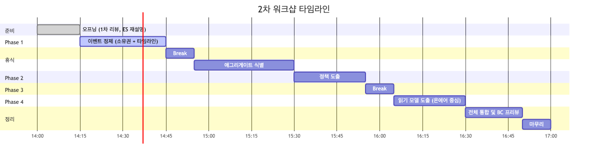

<details>
<summary>📊 원본 Mermaid 코드 보기</summary>

```mermaid
gantt
    title 2차 워크샵 타임라인
    dateFormat HH:mm
    axisFormat %H:%M

    section 준비
    오프닝 (1차 리뷰, ES 재설명)       :done, 14:00, 15m

    section Phase 1
    이벤트 정제 (소유권 + 타임라인)      :active, 14:15, 30m

    section 휴식
    Break                               :14:45, 10m

    section Phase 2
    애그리게이트 식별                    :14:55, 35m

    section Phase 3
    정책 도출                           :15:30, 25m

    section 휴식
    Break                               :15:55, 10m

    section Phase 4
    읽기 모델 도출 (온에어 중심)         :16:05, 25m

    section 정리
    전체 통합 및 BC 프리뷰              :16:30, 20m
    마무리                              :16:50, 10m
```

</details>

| 시간 | 단계 | 소요 | 핵심 활동 | 산출물 |
|------|------|------|----------|--------|
| 14:00 | 오프닝 | 15분 | 1차 리뷰, 이벤트 스토밍 재설명 (협력사 참석자 배려) | — |
| 14:15 | Phase 1: 이벤트 정제 | 30분 | 소유권 판단 + 내부 단계 정리 + 시간축 정렬 | 정제된 이벤트 ~35개 |
| 14:45 | 휴식 | 10분 | — | — |
| 14:55 | Phase 2: 애그리게이트 식별 | 35분 | 서비스별 애그리게이트 도출 | ~22개 후보 |
| 15:30 | Phase 3: 정책 도출 | 25분 | 자동화 규칙 도출 | ~20개 후보 |
| 15:55 | 휴식 | 10분 | — | — |
| 16:05 | Phase 4: 읽기 모델 도출 | 25분 | 온에어 중심 읽기 모델 식별 | ~8개 후보 |
| 16:30 | 전체 통합 & BC 프리뷰 | 20분 | 7개 서비스 = 7개 BC 검증, Fade out 논의 | BC 프리뷰 |
| 16:50 | 마무리 | 10분 | 다음 단계 안내 | — |
| **17:00** | **종료** | **총 3시간** | | |

> **시간 배분 근거:** 채널시스템은 7개 서비스를 다루므로 검색/주문팀(2시간 30분)보다 30분 추가.
> Phase 1(이벤트 정제)에 30분 배정 — 소유권 판단이 채널시스템의 핵심 난제.
> Phase 2(애그리게이트)에 35분 배정 — 7개 서비스별로 진행해야 하므로 추가 시간.

---

## 4. Phase 1: 이벤트 정제 (30분)

### 퍼실리테이터 스크립트 — 오프닝 (협력사 참석자 배려)

> "안녕하세요, 채널시스템 이벤트 스토밍 2차 워크샵을 시작하겠습니다.
> 오늘 처음 참석하시는 분들을 위해 간단히 설명드리겠습니다.
>
> **이벤트 스토밍**은 우리 시스템에서 일어나는 비즈니스 사건을 포스트잇으로 시각화하는 방법입니다.
> 🟧 오렌지 = 사건, 🟦 파란색 = 명령, 🟨 노란색 = 데이터 묶음, 💜 보라색 = 자동 규칙, 📖 하늘색 = 화면/대시보드입니다.
>
> 1차에서 ~46개의 이벤트를 도출했습니다. 오늘은 여기서 시작해서 **애그리게이트, 정책, 읽기 모델**까지 완성하겠습니다.
> 첫 단계로, 7개 서비스 간 **이벤트 소유권**을 명확히 하고 **방송 라이프사이클** 순으로 정렬하겠습니다.
> 총 3시간이며, 중간에 10분씩 2번 쉽니다."

### 4.1 이벤트 소유권 판단 가이드 (서비스별 분류)

> "이벤트 소유권의 원칙은 간단합니다: **'데이터를 변경하는 시스템이 이벤트를 발행한다'**.
> 예를 들어, '편성표가 확정되었다'는 편성 서비스가 소유합니다. 편성 데이터를 변경하니까요.
> 하지만 '편성정보 읽기모델이 생성되었다'는 온에어가 소유합니다. 온에어가 자신의 읽기 모델을 만드니까요.
>
> 지금부터 서비스별로 소유권을 확인하겠습니다. 한 서비스당 2~3분씩만 하겠습니다."

**서비스별 이벤트 소유 원칙:**

| 서비스 | 소유 기준 | 소유 이벤트 예시 |
|--------|----------|----------------|
| PDSS | 채널·유형·시간대·요율 마스터 데이터 변경 | 채널 등록/변경, 프로그램유형 정의 |
| 편성 | 편성표·편성항목 변경 | 편성표 생성/확정, 편성변경, 긴급편성 |
| 기획 | 기획서·출연자 변경 | 기획서 승인/반려, 출연자 확정 |
| 온에어 | 방송 상태 변경 | 방송 시작/종료, 상품 교체 |
| 타사모니터 | 타사 데이터 수집/분석 | 타사편성 수집, 비교분석 완료 |
| 매체 | 매체 실적/비용/정산 변경 | 매체실적 집계, 매체비용 정산 |
| PGM실적/정산 | 방송실적/정산 변경 | 방송실적 집계, 정산 확정 |
| 🟩 내부 시스템 | 상품·주문·전시 변경 (채널 시스템 외부) | 상품가격 변경, 주문 접수 → 🟩 초록 포스트잇 |

### 4.2 시간축별 타임라인 정렬

> "이제 이벤트들을 **방송 라이프사이클** 순서로 정렬하겠습니다.
> 보드에 4개 구역을 만들겠습니다: **시간축 무관(PDSS)**, **방송 전**, **방송 중**, **방송 후**.
> 그리고 **독립**(타사모니터) 영역을 별도로 만들겠습니다.
>
> 각 서비스 담당자가 자기 서비스 이벤트를 해당 구역에 배치해주세요."

### 4.3 정제 후 예상 이벤트 목록 (~35개)

| # | 영역 | 서비스 | 이벤트 |
|---|------|--------|--------|
| 1 | ① 기반 데이터 | PDSS | 채널이 등록되었다 |
| 2 | ① 기반 데이터 | PDSS | 채널정보가 변경되었다 |
| 3 | ① 기반 데이터 | PDSS | 채널이 비활성화되었다 |
| 4 | ① 기반 데이터 | PDSS | 프로그램유형이 정의되었다 |
| 5 | ① 기반 데이터 | PDSS | 시간대 정책이 등록되었다 |
| 6 | ① 기반 데이터 | PDSS | 채널 요율이 설정되었다 |
| 7 | ② 편성 계획 | 편성 | 편성표가 생성되었다 |
| 8 | ② 편성 계획 | 편성 | 편성항목이 배치되었다 |
| 9 | ④ 편성 확정 | 편성 | 편성표가 확정되었다 |
| 10 | ④ 편성 확정 | 편성 | 편성변경이 요청되었다 |
| 11 | ④ 편성 확정 | 편성 | 편성변경이 확정되었다 |
| 12 | ④ 편성 확정 | 편성 | 긴급편성이 적용되었다 |
| 13 | ④ 편성 확정 | 편성 | 편성표가 마감되었다 |
| 14 | ③ 방송 기획 | 기획 | 방송기획서가 작성되었다 |
| 15 | ③ 방송 기획 | 기획 | 기획서가 승인 요청되었다 |
| 16 | ③ 방송 기획 | 기획 | 기획서가 승인되었다 |
| 17 | ③ 방송 기획 | 기획 | 기획서가 반려되었다 |
| 18 | ③ 방송 기획 | 기획 | 출연자가 확정되었다 |
| 19 | ③ 방송 기획 | 기획 | 방송준비가 완료되었다 |
| 20 | ⑤ 방송 운영 | 온에어 | 방송이 시작되었다 |
| 21 | ⑤ 방송 운영 | 온에어 | 방송 중 상품이 교체되었다 |
| 22 | ⑤ 방송 운영 | 온에어 | 방송 중 긴급 공지가 발행되었다 |
| 23 | ⑤ 방송 운영 | 온에어 | 방송이 종료되었다 |
| 24 | ⑤ 방송 운영 | 온에어 | 방송이 연장되었다 |
| 25 | ⑦ 경쟁사 분석 | 타사모니터 | 타사편성정보가 수집되었다 |
| 26 | ⑦ 경쟁사 분석 | 타사모니터 | 타사방송실적이 수집되었다 |
| 27 | ⑦ 경쟁사 분석 | 타사모니터 | 타사편성 비교분석이 완료되었다 |
| 28 | ⑥ 실적/정산 | 매체 | 매체실적이 집계되었다 |
| 29 | ⑥ 실적/정산 | 매체 | 매체비용이 산출되었다 |
| 30 | ⑥ 실적/정산 | 매체 | 매체비용이 정산되었다 |
| 31 | ⑥ 실적/정산 | PGM | 방송실적이 집계되었다 |
| 32 | ⑥ 실적/정산 | PGM | 방송실적 검증이 완료되었다 |
| 33 | ⑥ 실적/정산 | PGM | 정산이 완료되었다 |
| 34 | ⑥ 실적/정산 | PGM | 정산이 확정되었다 |
| 35 | ⑥ 실적/정산 | PGM | 정산 오류가 발견되었다 |

---

## 5. Phase 2: 애그리게이트 식별 (35분)

### 5.1 채널시스템 눈높이 설명

> **애그리게이트 = "함께 변하는 데이터 묶음"**
>
> 채널시스템에 친숙한 비유로 설명하면:
>
> - **편성표 하나** = 하나의 애그리게이트입니다. 편성표 안의 편성항목들은 함께 확정되고, 함께 변경됩니다
> - "이 데이터가 변하면 같이 변해야 하는 데이터가 뭐가 있지?" → 그게 애그리게이트입니다
> - 쉽게 말해, **커맨드(명령) 하나가 변경하는 대상**이 하나의 애그리게이트입니다
>
> 예시: "편성표 확정하기" 커맨드 → 변경 대상 = **편성표** 애그리게이트

**채널시스템 애그리게이트 판단 질문:**
- 질문 1: "이 커맨드가 변경하는 대상은 무엇인가?"
- 질문 2: "이 데이터가 바뀌면 같이 바뀌어야 하는 건?"
- 질문 3: "트랜잭션 경계는 어디까지인가?"
- 질문 4: "이 데이터는 어느 서비스가 소유하는가?"

### 5.2 서비스별 애그리게이트 후보 (~22개)

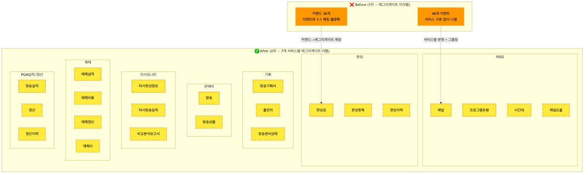

<details>
<summary>📊 원본 Mermaid 코드 보기</summary>

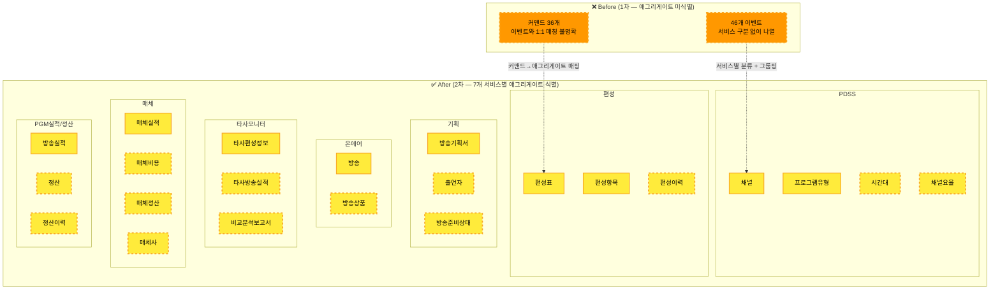

</details>

**서비스별 애그리게이트 상세:**

| 서비스 | 🟨 애그리게이트 | 포함 데이터 | 관련 이벤트 |
|--------|----------------|-----------|-----------|
| PDSS | **채널** | 채널ID, 채널명, 채널유형, 상태 | 채널 등록/변경/비활성화 |
| PDSS | **프로그램유형** | 유형코드, 유형명, 설명 | 프로그램유형 정의/변경 |
| PDSS | **시간대** | 시간대ID, 시작/종료시간, 적용정책 | 시간대 정책 등록/변경 |
| PDSS | **채널요율** | 요율ID, 채널, 시간대, 단가 | 채널 요율 설정/변경 |
| 편성 | **편성표** | 편성표ID, 채널, 방송일, 상태 | 편성표 생성/확정/마감 |
| 편성 | **편성항목** | 항목ID, 시간대, 프로그램, 순서 | 편성항목 배치/취소, 긴급편성 |
| 편성 | **편성이력** | 이력ID, 변경유형, 변경사유, 변경시각 | 편성변경 요청/확정 |
| 기획 | **방송기획서** | 기획서ID, 프로그램명, 상태, 승인자 | 기획서 작성/승인/반려 |
| 기획 | **출연자** | 출연자ID, 이름, 역할, 상태 | 출연자 확정/변경 |
| 기획 | **방송준비상태** | 준비항목, 체크상태, 담당자 | 방송준비 완료 |
| 온에어 | **방송** | 방송ID, 채널, 시작/종료시간, 상태 | 방송 시작/종료/연장 |
| 온에어 | **방송상품** | 방송상품ID, 상품ID, 노출순서, 상태 | 방송 중 상품 교체 |
| 타사모니터 | **타사편성정보** | 수집ID, 대상사, 편성데이터, 수집일 | 타사편성 수집 |
| 타사모니터 | **타사방송실적** | 실적ID, 대상사, 실적데이터, 수집일 | 타사실적 수집 |
| 타사모니터 | **비교분석보고서** | 보고서ID, 분석결과, 생성일 | 비교분석 완료 |
| 매체 | **매체실적** | 실적ID, 채널, 방송일, 방송시간 | 매체실적 집계 |
| 매체 | **매체비용** | 비용ID, 매체사, 금액, 산출기준 | 매체비용 산출 |
| 매체 | **매체정산** | 정산ID, 매체사, 정산금액, 상태 | 매체비용 정산/취소 |
| 매체 | **매체사** | 매체사ID, 매체사명, 정산기준 | 매체사 정보 등록 |
| PGM | **방송실적** | 실적ID, 방송ID, 주문건수, 주문금액 | 방송실적 집계/검증 |
| PGM | **정산** | 정산ID, 방송실적, 정산금액, 상태 | 정산 시작/완료/확정 |
| PGM | **정산이력** | 이력ID, 변경내용, 오류내역 | 정산 오류 발견 |

### 5.3 흐름 영역별 매핑

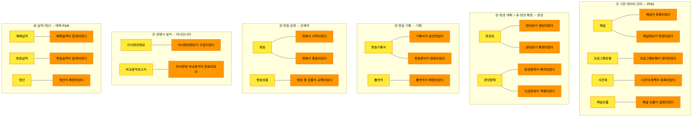

<details>
<summary>📊 원본 Mermaid 코드 보기</summary>

```mermaid
flowchart TB
    subgraph area1["① 기반 데이터 관리 — PDSS"]
        AG1["채널"]:::aggregate
        AG2["프로그램유형"]:::aggregate
        AG3["시간대"]:::aggregate
        AG4["채널요율"]:::aggregate
        E1["채널이 등록되었다"]:::event
        E2["채널정보가 변경되었다"]:::event
        E3["프로그램유형이 정의되었다"]:::event
        E4["시간대 정책이 등록되었다"]:::event
        E5["채널 요율이 설정되었다"]:::event
        AG1 --- E1
        AG1 --- E2
        AG2 --- E3
        AG3 --- E4
        AG4 --- E5
    end

    subgraph area2["② 편성 계획 / ④ 편성 확정 — 편성"]
        AG5["편성표"]:::aggregate
        AG6["편성항목"]:::aggregate
        E6["편성표가 생성되었다"]:::event
        E7["편성항목이 배치되었다"]:::event
        E8["편성표가 확정되었다"]:::event
        E9["긴급편성이 적용되었다"]:::event
        AG5 --- E6
        AG5 --- E8
        AG6 --- E7
        AG6 --- E9
    end

    subgraph area3["③ 방송 기획 — 기획"]
        AG7["방송기획서"]:::aggregate
        AG8["출연자"]:::aggregate
        E10["기획서가 승인되었다"]:::event
        E11["출연자가 확정되었다"]:::event
        E12["방송준비가 완료되었다"]:::event
        AG7 --- E10
        AG8 --- E11
        AG7 --- E12
    end

    subgraph area4["⑤ 방송 운영 — 온에어"]
        AG9["방송"]:::aggregate
        AG10["방송상품"]:::aggregate
        E13["방송이 시작되었다"]:::event
        E14["방송이 종료되었다"]:::event
        E15["방송 중 상품이 교체되었다"]:::event
        AG9 --- E13
        AG9 --- E14
        AG10 --- E15
    end

    subgraph area5["⑦ 경쟁사 분석 — 타사모니터"]
        AG11["타사편성정보"]:::aggregate
        AG12["비교분석보고서"]:::aggregate
        E16["타사편성정보가 수집되었다"]:::event
        E17["타사편성 비교분석이 완료되었다"]:::event
        AG11 --- E16
        AG12 --- E17
    end

    subgraph area6["⑥ 실적/정산 — 매체·PGM"]
        AG13["매체실적"]:::aggregate
        AG14["방송실적"]:::aggregate
        AG15["정산"]:::aggregate
        E18["매체실적이 집계되었다"]:::event
        E19["방송실적이 집계되었다"]:::event
        E20["정산이 확정되었다"]:::event
        AG13 --- E18
        AG14 --- E19
        AG15 --- E20
    end

    classDef event fill:#FF9800,color:#000,stroke:#E65100
    classDef aggregate fill:#FFEB3B,color:#000,stroke:#F9A825,stroke-width:2px
```

</details>

### 5.4 식별 질문 리스트

| 영역 | 질문 | 기대 답변 |
|------|------|----------|
| ① PDSS | "채널 정보와 채널 요율은 항상 함께 바뀌나요, 별도인가요?" | 채널 vs 채널요율 분리 확인 |
| ② 편성 | "편성표와 편성항목은 항상 함께 확정되나요?" | 편성표 vs 편성항목 분리 여부 |
| ③ 기획 | "기획서와 출연자 정보는 같이 바뀌나요?" | 방송기획서 vs 출연자 분리 확인 |
| ⑤ 온에어 | "방송 상태와 방송 중 상품은 같은 트랜잭션인가요?" | 방송 vs 방송상품 분리 확인 |
| ⑥ 매체 | "매체 실적과 매체 비용은 함께 바뀌나요, 순차적인가요?" | 매체실적 vs 매체비용 분리 확인 |
| ⑥ PGM | "방송 실적과 정산은 같은 트랜잭션인가요?" | 방송실적 vs 정산 분리 확인 |
| ⑦ 타사모니터 | "수집 데이터와 분석 보고서는 별도 생명주기인가요?" | 타사편성정보 vs 비교분석보고서 분리 |

### 5.5 퍼실리테이터 스크립트

> "이제 가장 중요한 단계입니다. 이벤트를 '데이터 묶음' 단위로 그룹핑할 건데요,
> 이걸 **애그리게이트**라고 합니다.
>
> 서비스별로 진행합시다. 먼저 PDSS부터.
> '채널 등록하기' 커맨드가 변경하는 대상이 뭔가요? → **채널** 이죠.
> '프로그램유형 정의하기'는? → **프로그램유형** 이죠.
> 이렇게 커맨드가 변경하는 대상을 🟨 노란색 포스트잇에 적어주세요.
>
> PDSS는 4개(채널, 프로그램유형, 시간대, 채널요율), 편성은 3개(편성표, 편성항목, 편성이력)...
> 서비스당 5분씩, 총 35분 안에 ~22개를 확인하겠습니다."

---

## 6. Phase 3: 정책 도출 (25분)

### 6.1 채널시스템 눈높이 설명

> **정책(Policy) = "이벤트가 발생하면 자동으로 실행되는 비즈니스 규칙"**
>
> 채널시스템에서 쉽게 볼 수 있는 예시:
>
> - **"편성표가 확정되면 → 온에어 읽기 모델이 자동 생성된다"** — 이것이 정책입니다
> - 사람이 매번 수동으로 하는 게 아니라, **시스템이 자동으로 반응**하는 규칙
> - 방송 시스템의 **자동 스케줄** (야간 배치, 실적 집계 등)도 정책입니다
>
> 정책을 찾는 핵심 질문: **"이 이벤트가 발생하면, 자동으로 뭔가 일어나나요?"**

### 6.2 정책 후보 (~20개, 서비스별)

| # | 서비스 | 💜 정책 | 트리거 🟧 | When 조건 | Then 결과 |
|---|--------|--------|----------|----------|----------|
| 1 | PDSS | 기본 시간대 정책 자동 생성 | 채널이 등록되었다 | 신규 채널 등록 시 | 기본 시간대 정책 생성 |
| 2 | PDSS | 편성 불가 처리 | 채널이 비활성화되었다 | 채널 비활성 시 | 해당 채널 편성 잠금 |
| 3 | PDSS | 관련 편성항목 검증 | 프로그램유형이 변경되었다 | 유형 변경 시 | 기존 편성항목 검증 |
| 4 | PDSS | 정산 서비스 알림 | 채널 요율이 변경되었다 | 요율 변경 시 | PGM/매체에 알림 |
| 5 | 편성 | 온에어 읽기 모델 자동 생성 | 편성표가 확정되었다 | 편성 확정 시 | 온에어 읽기 모델 생성 |
| 6 | 편성 | 기획서 미승인 편성 불가 | 편성표 확정 시도 | 기획서 미승인 시 | 편성 확정 거부 |
| 7 | 편성 | 방송 30분 전 변경 마감 | 편성변경이 요청되었다 | 방송 시작 30분 이내 | 변경 거부 |
| 8 | 편성 | 편성 확정 후 변경 사유 필수 | 편성변경이 요청되었다 | 편성 확정 이후 | 변경 사유 입력 필수 |
| 9 | 기획 | 편성에 기획 정보 전달 | 기획서가 승인되었다 | 기획서 승인 시 | 편성항목에 기획 연결 |
| 10 | 기획 | 출연자 변경 시 편성팀 승인 | 출연자가 변경되었다 | 편성 확정 이후 | 편성팀 승인 요청 |
| 11 | 기획 | D-3 기획서 승인 마감 | 기획서 승인 요청 | 방송 D-3 이후 | 경고/에스컬레이션 |
| 12 | 기획 | 기획서 반려 시 알림 | 기획서가 반려되었다 | 반려 시 | 기획 담당자에게 알림 |
| 13 | 온에어 | 편성 확정 수신 시 읽기 모델 생성 | 편성표가 확정되었다 (수신) | 편성 확정 이벤트 수신 시 | 읽기 모델 자동 생성 |
| 14 | 온에어 | 방송 종료 시 데이터 전달 | 방송이 종료되었다 | 방송 종료 시 | PGM/매체에 데이터 전달 |
| 15 | 온에어 | 상품 교체 시 알림 | 방송 중 상품이 교체되었다 | 상품 교체 시 | 주문/상품 서비스에 알림 |
| 16 | 온에어 | 장애 시 기존 읽기 모델 운영 | 편성 서비스 장애 감지 | 편성 장애 시 | 기존 읽기 모델 유지 |
| 17 | 타사모니터 | 수집 완료 시 편성팀 참조 제공 | 타사편성정보가 수집되었다 | 수집 완료 시 | 편성팀에 참조 데이터 제공 |
| 18 | 타사모니터 | 수집 실패 시 재시도 | 타사정보 수집이 실패했다 | 수집 실패 시 | 재시도 (최대 3회) |
| 19 | 매체 | 방송 종료 시 매체 비용 산출 | 방송이 종료되었다 (수신) | 방송 종료 이벤트 수신 시 | 매체 비용 산출 시작 |
| 20 | PGM | 24시간 내 1차 실적 집계 | 방송이 종료되었다 (수신) | 방송 종료 후 | 24시간 내 실적 집계 완료 |


<details>
<summary>📊 원본 Mermaid 코드 보기</summary>

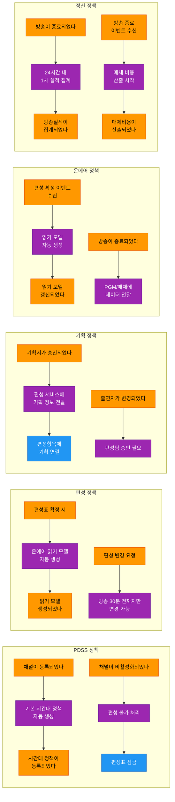

</details>

### 6.3 정책-이벤트 연결 맵

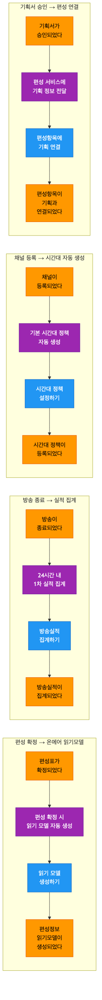

<details>
<summary>📊 원본 Mermaid 코드 보기</summary>

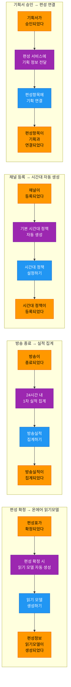

</details>

### 6.4 도출 유도 질문

| # | 서비스 | 유도 질문 | 기대 답변 |
|---|--------|----------|----------|
| 1 | PDSS | "채널이 등록되면 자동으로 뭔가 만들어지나요?" | 기본 시간대 정책 자동 생성 |
| 2 | 편성 | "편성이 확정되면 다른 서비스에서 자동으로 뭔가 일어나나요?" | 온에어 읽기 모델 생성 |
| 3 | 편성 | "편성 변경에 시간 제한이 있나요?" | 방송 30분 전 마감 |
| 4 | 기획 | "기획서가 승인되면 어디에 연결되나요?" | 편성항목에 기획 정보 전달 |
| 5 | 온에어 | "방송이 끝나면 자동으로 뭐가 돌아가나요?" | PGM/매체에 데이터 전달 |
| 6 | 타사모니터 | "수집 실패하면 어떻게 되나요?" | 자동 재시도 (최대 3회) |
| 7 | 매체/PGM | "방송 종료 후 야간에 자동으로 도는 배치가 있나요?" | 실적 집계, 비용 산출 |

### 6.5 퍼실리테이터 스크립트

> "이제 '자동 규칙'을 찾아볼 시간입니다. 💜 보라색 포스트잇을 사용합니다.
>
> 핵심 질문 하나만 기억하세요: **'이 이벤트가 발생하면, 자동으로 뭔가 일어나나요?'**
>
> 예시를 하나 해볼게요. '편성표가 확정되었다' 🟧 이벤트가 발생하면 →
> 자동으로 '온에어 읽기 모델이 생성된다'. 이게 정책입니다.
> 💜 '편성 확정 시 읽기 모델 자동 생성'이라고 적으면 됩니다.
>
> 서비스별로 돌아가며, 각 서비스에서 2~3개씩 찾으면 총 ~20개가 됩니다.
> 서비스당 3분씩, 25분 안에 마치겠습니다."

---

## 7. Phase 4: 읽기 모델 도출 (25분)

### 7.1 채널시스템 눈높이 설명 (온에어 = "방송 제어판" 비유)

> **읽기 모델 = "사용자가 보는 화면/대시보드"**
>
> 채널시스템에서 가장 좋은 예시가 바로 **온에어 서비스**입니다.
>
> - 온에어는 **방송 제어판**입니다. 방송 PD가 방송 중에 보는 화면이죠
> - 이 제어판에는 **편성정보, 상품정보, 주문현황, 재고, 시청률**이 모여 있습니다
> - 온에어가 이 데이터를 직접 소유하나요? 아닙니다. **다른 서비스에서 가져온 것**이죠
> - 이렇게 **여러 소스에서 모아서 보여주는 화면** = 📖 읽기 모델입니다
>
> 온에어의 핵심은 이벤트(Write)가 아니라 **읽기 모델(Read)**입니다.
> 그래서 온에어에 읽기 모델이 5개나 됩니다.

### 7.2 읽기 모델 후보 (~8개)

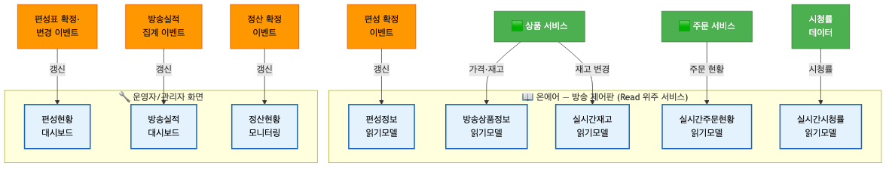

<details>
<summary>📊 원본 Mermaid 코드 보기</summary>

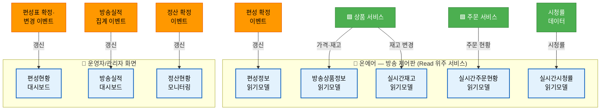

</details>

**읽기 모델 상세:**

| # | 📖 읽기 모델 | 서비스 | 대상 사용자 | 구성 데이터 | 갱신 트리거 |
|---|-------------|--------|-----------|-----------|-----------|
| 1 | **편성정보 읽기모델** | 온에어 | 👤 방송 PD | 편성항목, 시간대, 프로그램, 출연자 | 편성표가 확정되었다, 긴급편성이 적용되었다 |
| 2 | **방송상품정보 읽기모델** | 온에어 | 👤 방송 PD | 상품명, 가격, 할인율, 노출순서 | 🟩 상품가격 변경, 방송 중 상품 교체 |
| 3 | **실시간주문현황 읽기모델** | 온에어 | 👤 방송 PD | 실시간 주문건수, 주문금액, 추이 | 🟩 주문 접수 |
| 4 | **실시간재고 읽기모델** | 온에어 | 👤 방송 PD | 현재 재고, 재고 소진율, 품절 임박 경고 | 🟩 재고 변경 |
| 5 | **실시간시청률 읽기모델** | 온에어 | 👤 방송 PD | 시청률, 시간대별 추이 | 시청률 데이터 갱신 |
| 6 | **편성현황 대시보드** | 편성 | 🔧 편성 담당자 | 채널별 편성 상태, 확정/미확정 현황 | 편성표 확정/변경 이벤트 |
| 7 | **방송실적 대시보드** | PGM | 🔧 운영 담당자 | 방송별 주문건수/금액, 상품별 실적 | 방송실적이 집계되었다 |
| 8 | **정산현황 모니터링** | PGM/매체 | 🔧 정산 담당자 | 정산 진행 상태, 미정산 목록, 오류 현황 | 정산이 확정되었다, 정산 오류 발견 |

### 7.3 3단계 프로세스 (화면→데이터→트리거)

> **읽기 모델을 찾는 3단계:**
>
> - **Step 1**: "사용자(PD/운영자)가 보는 화면이 뭐가 있나요?"
> - **Step 2**: "이 화면에 어떤 정보가 표시되나요?"
> - **Step 3**: "어떤 이벤트가 발생하면 이 화면이 갱신되나요?"

| Step | 온에어 예시 | 편성 예시 |
|------|-----------|----------|
| Step 1: 화면 | 방송 제어판 (방송 PD) | 편성 현황 보드 (편성 담당자) |
| Step 2: 데이터 | 편성정보, 상품, 주문, 재고, 시청률 | 채널별 편성 상태, 확정 현황 |
| Step 3: 트리거 | 편성 확정, 🟩 상품/주문 변경 | 편성표 확정/변경 |

### 7.4 읽기모델-이벤트 연결 맵

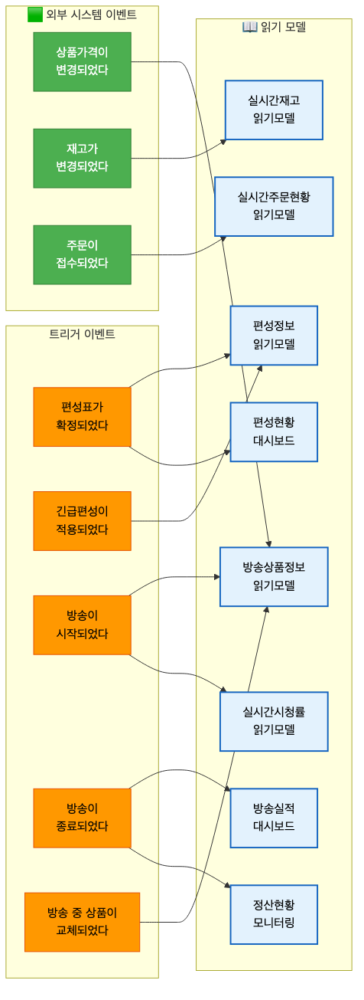

<details>
<summary>📊 원본 Mermaid 코드 보기</summary>

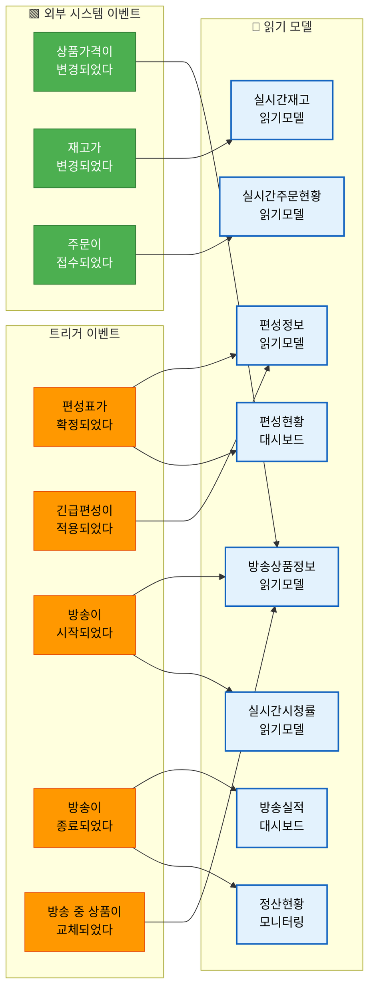

</details>

### 7.5 퍼실리테이터 스크립트

> "마지막으로, '사용자가 보는 화면'을 정리해보겠습니다. 📖 하늘색 포스트잇을 사용합니다.
>
> 온에어 서비스가 가장 좋은 예시입니다. 온에어는 **방송 제어판**이에요.
> 방송 PD가 방송 중에 보는 화면에 뭐가 있나요?
>
> **편성정보**, **상품정보**, **실시간 주문현황**, **재고**, **시청률** — 이 5가지가 읽기 모델입니다.
> 이 데이터를 온에어가 직접 만드나요? 아닙니다. 편성, 상품, 주문 서비스에서 가져온 거죠.
>
> 온에어 5개 + 운영자 화면 3개(편성현황, 방송실적, 정산현황) = 총 8개입니다.
> 📖 하늘색 포스트잇에 '편성정보 읽기모델'이라고 쓰고, 구성 데이터를 아래에 적어주세요.
> 그리고 어떤 이벤트가 이 화면을 갱신하는지 화살표로 연결합시다."

---

## 8. 전체 통합 및 정리 (20분)

### 8.1 전체 통합 흐름

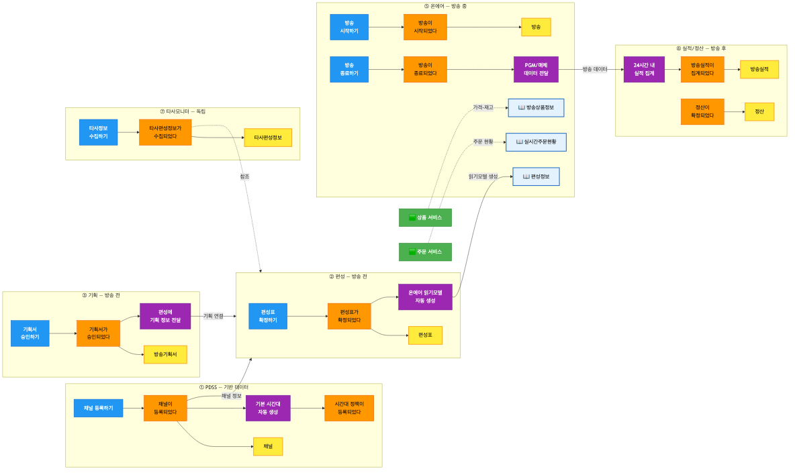

<details>
<summary>📊 원본 Mermaid 코드 보기</summary>

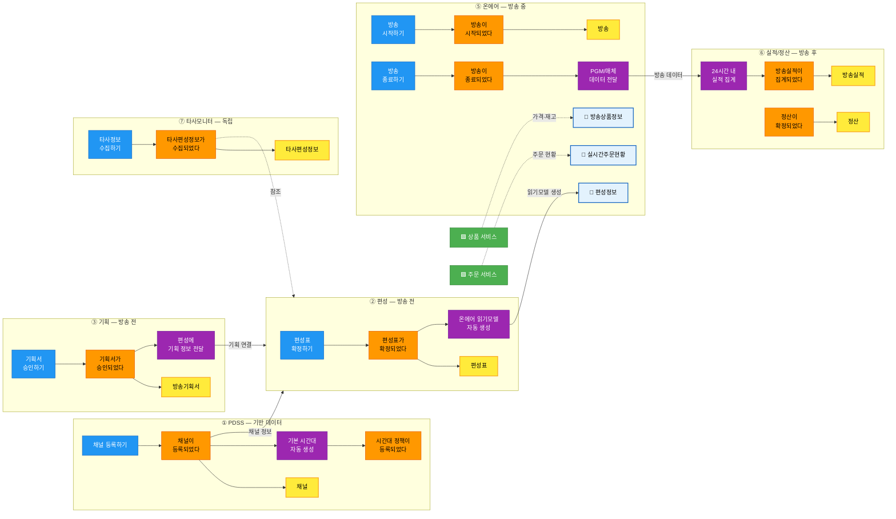

</details>

### 8.2 바운디드 컨텍스트 후보 프리뷰 (7개 서비스 = 7개 BC 검증)

| # | BC 후보 | 서비스 | 독립 배포 | 독립 DB | 독립 팀 | 시간축 | 판정 |
|---|--------|--------|---------|--------|--------|--------|------|
| 1 | **마스터 데이터** | PDSS | ✅ | ✅ | ✅ | 무관 | ✅ 확정 |
| 2 | **편성 계획** | 편성 | ✅ | ✅ | ✅ | 방송 전 | ✅ 확정 |
| 3 | **방송 기획** | 기획 | ✅ | ✅ | ✅ | 방송 전 | ✅ 확정 |
| 4 | **실시간 운영** | 온에어 | ✅ | ✅ | ✅ | 방송 중 | ✅ 확정 |
| 5 | **경쟁사 분석** | 타사모니터 | ✅ | ✅ | 조건부 | 독립 | ✅ 확정 (이관 가능성 🩷) |
| 6 | **매체 정산** | 매체 | 조건부 | ✅ | 조건부 | 방송 후 | ⚠️ Fade out 검토 |
| 7 | **방송 실적/정산** | PGM | ✅ | ✅ | ✅ | 방송 후 | ⚠️ Fade out 검토 |

### 8.3 컨텍스트 맵 초안 (Upstream/Downstream)

| Upstream | 관계 패턴 | Downstream | 설명 |
|----------|----------|-----------|------|
| PDSS | **Conformist** | 편성, 기획, 온에어, 매체, PGM | 하위 서비스가 PDSS 모델을 수용 |
| 편성 ↔ 기획 | **Partnership** | (양방향) | 편성항목↔기획서 양방향 협력 |
| 편성 | **ACL** | 온에어 | 온에어가 자체 읽기 모델로 변환 |
| 온에어 | **Customer/Supplier** | PGM, 매체 | 온에어가 방송 데이터 제공 |
| 타사모니터 | **Separate Ways** | (독립) | 느슨한 결합, 참조만 제공 |
| 🟩 상품/주문 | **ACL** | 온에어 | 내부 시스템 데이터를 읽기 모델로 변환 |

### 8.4 Fade out 서비스(매체/PGM) 범위 논의

> **워크샵에서 논의할 핵심 질문:**

| # | 질문 | 논의 포인트 |
|---|------|-----------|
| 1 | "매체 서비스가 Fade out 되면, 매체 정산 기능은 어디로?" | PGM에 통합? 별도 유지? 🩷 핫스팟 |
| 2 | "PGM 서비스가 축소되면, 핵심 정산 기능의 범위는?" | 방송실적 집계만 유지? 정산까지 유지? |
| 3 | "Fade out 시점은 언제쯤으로 예상하는가?" | 단기 vs 중장기 → MSA 투자 범위 결정 |
| 4 | "Fade out 서비스의 현재 사용자는 누구인가?" | 사용자 영향 범위 파악 |

> 🩷 **결론이 나지 않으면 핫스팟 포스트잇으로 표시**하고 다음 워크샵에서 논의합니다.

### 8.5 다음 단계 안내

### 성과 체크리스트

- [ ] 이벤트 정제: ~46개 → ~35개
- [ ] 시간축별 타임라인 정렬 완료
- [ ] 애그리게이트: ~22개 후보 확정
- [ ] 정책: ~20개 후보 도출
- [ ] 읽기 모델: ~8개 후보 도출 (온에어 5개 + 기타 3개)
- [ ] 바운디드 컨텍스트 7개 프리뷰 완료

**3차 워크샵에서 확정할 사항:**

1. BC 경계선 최종 확정 — 7개 BC 유지 or 통합/분리
2. 컨텍스트 맵 확정 — BC 간 관계 패턴 (Conformist, ACL, Partnership 등)
3. Fade out 서비스 결정 — 매체/PGM 범위 확정
4. 팀 매핑 — 각 BC를 어느 팀이 담당할지
5. MSA 전환 우선순위 — 어느 BC부터 분리할지

---

## 9. 퍼실리테이터 비상 대응 카드

### 예상 난항 5가지 (채널시스템 특화)

| # | 난항 상황 | 대응 방법 |
|---|----------|----------|
| 1 | **"이 이벤트가 편성 거야, 온에어 거야?"** — 서비스 간 소유권 혼란 | **"데이터를 변경하는 쪽이 소유합니다."** 편성 데이터를 바꾸면 편성 소유, 온에어 읽기 모델을 만들면 온에어 소유. 둘 다 맞지만 다른 이벤트입니다. 🩷 핫스팟으로 일단 표시하고 넘어가도 됩니다. |
| 2 | **"온에어는 이벤트가 별로 없는데 정상인가요?"** — Read 위주 서비스 의문 | **"온에어의 핵심은 이벤트가 아니라 읽기 모델입니다."** 방송 제어판처럼, 다른 서비스 데이터를 모아서 보여주는 게 온에어의 역할. 📖 읽기 모델 5개가 온에어의 핵심 가치입니다. |
| 3 | **"매체/PGM이 없어질 수도 있는데 여기서 다룰 필요가 있나요?"** — Fade out 논쟁 | **"현재 존재하는 비즈니스 기능은 이벤트 스토밍 대상입니다."** Fade out 되더라도 그 기능은 어딘가로 이관됩니다. 지금 파악해야 이관 범위를 알 수 있습니다. 🩷 핫스팟에 'Fade out 범위'로 기록합시다. |
| 4 | **"내부 시스템(상품/주문) 이벤트도 같이 써야 하나요?"** — 경계 혼란 | **"내부 시스템 이벤트는 🟩 초록색 포스트잇에 씁니다."** 우리가 발행하는 건 🟧 오렌지, 우리가 수신하는 건 🟩 초록입니다. '데이터를 변경하는 시스템이 이벤트를 발행한다'는 원칙을 적용합니다. |
| 5 | **"애그리게이트가 너무 많아요 (22개)"** — 7개 서비스 × 3~4개 | **"서비스가 7개이니 애그리게이트도 많은 게 정상입니다."** 편성팀은 편성 관련 3개만, 온에어는 2개만 집중하면 됩니다. 전체를 한 번에 다 보려 하지 말고 서비스별로 나눠서 봅시다. |

### 시간 조절 가이드

| 상황 | 조치 |
|------|------|
| Phase 1(이벤트 정제)이 15분 이내 완료 | Phase 2(애그리게이트)에 남은 시간 배분 |
| Phase 2(애그리게이트)가 40분 초과 | 나머지 서비스는 퍼실리테이터가 후보를 제안 → 빠른 합의 |
| Phase 3+4가 시간 부족 | 정책은 핵심 10개만(서비스당 대표 1~2개), 읽기모델은 온에어 5개만 집중 |
| 전체적으로 15분 이상 초과 | 마무리(8장) 시간을 5분으로 단축, Fade out 논의는 3차로 이월 |
| 협력사 참석자가 개념에 어려움 | Phase별 시작 시 1분 추가 설명, 해당 시간은 다음 Phase에서 차감 |

---

## 10. 결과물 템플릿

### 2차 워크샵 결과 정리 양식

```
# 채널시스템 이벤트 스토밍 2차 워크샵 결과

## 일시: 2026년 _월 _일 (_) 14:00 ~ 17:00
## 참석자:

---

## 1. 이벤트 정제 결과
- 정제 전: ~46개
- 정제 후: __개
- 통합: __건, 제외: __건, 재분류(→읽기모델): __건

## 2. 서비스별 애그리게이트 (확정 __개)

### PDSS
| # | 애그리게이트 | 포함 이벤트 | 관련 커맨드 |
|---|-------------|-----------|-----------|

### 편성
| # | 애그리게이트 | 포함 이벤트 | 관련 커맨드 |
|---|-------------|-----------|-----------|

### 기획
| # | 애그리게이트 | 포함 이벤트 | 관련 커맨드 |
|---|-------------|-----------|-----------|

### 온에어
| # | 애그리게이트 | 포함 이벤트 | 관련 커맨드 |
|---|-------------|-----------|-----------|

### 타사모니터
| # | 애그리게이트 | 포함 이벤트 | 관련 커맨드 |
|---|-------------|-----------|-----------|

### 매체
| # | 애그리게이트 | 포함 이벤트 | 관련 커맨드 |
|---|-------------|-----------|-----------|

### PGM실적/정산
| # | 애그리게이트 | 포함 이벤트 | 관련 커맨드 |
|---|-------------|-----------|-----------|

## 3. 정책 (확정 __개)
| # | 서비스 | 정책 | 트리거 이벤트 | When 조건 | Then 결과 |
|---|--------|------|-------------|----------|----------|

## 4. 읽기 모델 (확정 __개)
| # | 읽기 모델 | 서비스 | 대상 사용자 | 구성 데이터 | 갱신 트리거 |
|---|----------|--------|-----------|-----------|-----------|

## 5. 바운디드 컨텍스트 프리뷰
| # | BC 후보 | 서비스 | 판정 | 비고 |
|---|--------|--------|------|------|

## 6. 핫스팟 / 미결 사항
| # | 내용 | 관련 서비스 | 담당 | 기한 |
|---|------|-----------|------|------|

## 7. 다음 단계
- [ ] 결과 draw.io 정리 및 공유
- [ ] 3차 워크샵 일정 확정 (BC 확정 + 컨텍스트 맵)
- [ ] Fade out 서비스(매체/PGM) 범위 사전 논의
- [ ] 핫스팟 사항 사전 논의
```
