# 프론트개발팀 이벤트 스토밍 2차 워크샵 검토 및 보완 사항

## 1. 개요

### 1.1 이 문서의 목적

```
┌─────────────────────────────────────────────────────────────┐
│              이 문서의 3가지 목적                              │
├─────────────────────────────────────────────────────────────┤
│                                                             │
│  ✅ 2차 워크샵 수행 결과를 준비 문서 대비 분석              │
│  ✅ draw.io 결과물의 UI/기술 이벤트 오분류 정리 및 교정안   │
│  ✅ 3차 워크샵 방향 및 타임라인 설정                        │
│                                                             │
└─────────────────────────────────────────────────────────────┘
```

### 1.2 워크샵 기본 정보

| 항목 | 내용 |
|------|------|
| 일시 | 2026년 3월 (2차 워크샵) |
| 참석자 | 프론트개발팀 |
| 수행 범위 | 7개 영역 — 기획전/검색, 라이브/영상, 인증/트래킹, 홈/전시, 상품/주문, CS/리뷰/알림, 이벤트/프로모션 |
| 산출물 | draw.io 보드 (포스트잇 ~77개) |
| 수행 방식 특이점 | **이벤트 자유 도출(브레인스토밍)** 수준에 머물러, 사실상 모든 요소가 🟧 오렌지(이벤트)로 표기됨. 커맨드 2개 외에 정책·핫스팟·외부시스템·애그리게이트가 **전혀 없음**. UI/기술 이벤트가 비즈니스 이벤트와 구분 없이 대량 혼재 |

### 1.3 참조 문서

| 참조 문서 | 활용 시점 |
|----------|----------|
| [이벤트스토밍_프론트개발팀_3차워크샵준비.md](./이벤트스토밍_프론트개발팀_3차워크샵준비.md) | 목표 수치, Phase 구조 — 달성도 비교 기준 |
| [이벤트스토밍_프론트엔드팀_가이드.md](./이벤트스토밍_프론트엔드팀_가이드.md) | UI vs 비즈니스 이벤트 구분, 플랫폼 추상화, TOP 7 실수 |
| [이벤트스토밍_프론트엔드팀_정책분류.md](./이벤트스토밍_프론트엔드팀_정책분류.md) | 3 레이어 분류 체계 (💜/🩷/❌) |

---

## 2. 수행 결과 요약

### 2.1 실제 수행 범위 및 방식

2차 워크샵에서 실제로 수행된 활동:

1. **이벤트 자유 도출** — 7개 영역에서 ~77개 포스트잇을 브레인스토밍 방식으로 도출
2. **커맨드 2개만 식별** — "앱 실행하기", "스크롤 액션"만 🟦 커맨드로 분류
3. **그 외 모든 요소 유형 미수행** — 정책, 핫스팟, 외부 시스템, 애그리게이트, 읽기 모델 전혀 없음

**수행 방식 특이점:**
- 2차 워크샵은 **이벤트 브레인스토밍**에 집중하여, 모든 아이디어를 🟧 오렌지로 붙이는 방식 진행
- **"서버에 알려야 하는가?"** 기준이 적용되지 않아 UI 동작(클릭, 스크롤, 네비게이션)과 기술 처리(Firebase, GA, 보안 API)가 비즈니스 이벤트와 구분 없이 혼재
- 프론트엔드 특성상 **화면 전환·탐색 이벤트**가 전체의 ~25%를 차지

### 2.2 draw.io 분석 결과 (7개 영역별 요소)

**① 기획전/검색 (~12개):**

| 유형 | 수량 | 주요 항목 |
|------|------|----------|
| 이벤트 🟧 | ~12개 | 기획전 상품 목록 확인, 기획전 상세/쿠폰/영상, 브랜드 검색, 검색 결과 확인, 브랜드 찜 등록, 검색어 입력, 검색 버튼 클릭, 정렬 변경 |

**② 라이브/영상 (~9개):**

| 유형 | 수량 | 주요 항목 |
|------|------|----------|
| 이벤트 🟧 | ~9개 | 라이브 방송 시작/참여, 프로모션 영상 시청, 영상 시청 이벤트 응모, 장바구니 담기, MLC 방송 공유/채팅/혜택 참여, 위치정보 변경 |

**③ 인증/트래킹 (~6개):**

| 유형 | 수량 | 주요 항목 |
|------|------|----------|
| 이벤트 🟧 | ~6개 | 로그인, 로그인 페이지 이동, 로그아웃, 지문 로그인 ON/OFF, GA 이벤트 전송, 임프레션 태깅 **(기술 이벤트 2건 혼재)** |

**④ 홈/전시 (~18개):**

| 유형 | 수량 | 주요 항목 |
|------|------|----------|
| 이벤트 🟧 | ~16개 | 동영상/이미지 광고, QR 코드 유입, 지표 유입 UTM, App Info 요청, Firebase Patch, 보안 API 접근, 홈 메뉴 리스트 요청, A/B TEST, 모듈 리스트, 하단 상품 조회, 모듈 매칭, PIP 팝업, 전면 배너 클릭, 스크롤 노출, VIP관 배너, 광고 클릭 **(기술/UI 대량 혼재)** |
| 커맨드 🟦 | 2개 | 앱 실행하기, 스크롤 액션 |

**⑤ 상품/주문 (~16개):**

| 유형 | 수량 | 주요 항목 |
|------|------|----------|
| 이벤트 🟧 | ~16개 | 홈탭 돌아오기, 뒤로가기 종료, 상품 조회, 상품 불러오기 실패, 대기열 생성, 최근 본 상품 추가, 구매하기 클릭, 상품 문의 등록, 쿠폰 다운로드, 브랜드 찜, 상품 찜/취소, 키워드 이벤트 응모, 장바구니 담기, 구매, 주문 요청, 선물하기 |

**⑥ CS/리뷰/알림 (~13개):**

| 유형 | 수량 | 주요 항목 |
|------|------|----------|
| 이벤트 🟧 | ~13개 | 알림 신청 실패/완료, **방송 알림 신청 x2(중복)**, PGM 방송 시청, 팝업 방송 시청, CJ ONE 로그인 기록, 멤버십 포인트/기프트카드, 전화 상담 신청, 교환/반품 신청, 취소/교환/반품/환불 문의, 리뷰 작성 완료, 포토 리뷰 작성 완료 |

**⑦ 이벤트/프로모션 (~3개):**

| 유형 | 수량 | 주요 항목 |
|------|------|----------|
| 이벤트 🟧 | ~3개 | 이벤트 응모 신청 완료, 프로모션 이벤트 신청 완료, 특집 신청 |

### 2.3 현황 요약 다이어그램

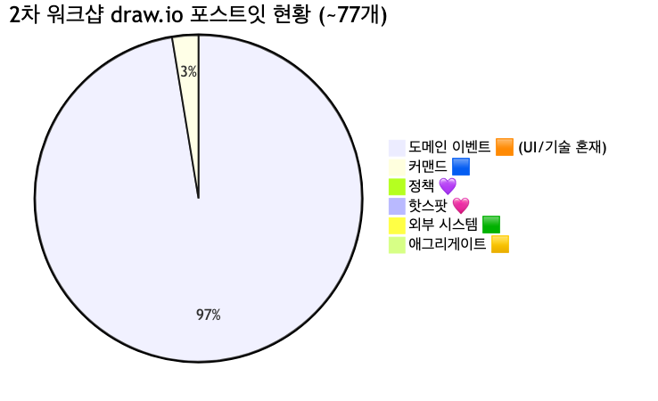

<details>
<summary>📊 원본 Mermaid 코드 보기</summary>

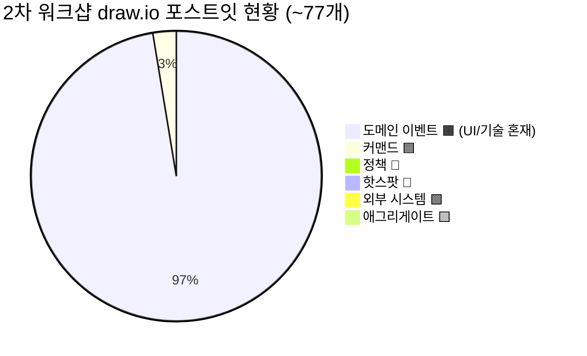

</details>

**주요 문제점:**
- **이벤트 ~75개 중 UI 이벤트 ~20건** — "검색 버튼을 클릭한다", "구매하기 버튼 클릭", "전면 배너/팝업 클릭 선택", "스크롤을 내려 하단 상품이 노출됐다" 등 화면 인터랙션이 이벤트로 분류됨
- **기술 이벤트 ~8건** — "Firebase Patch 진행했다", "보안 API/권한/DB 접근했다", "GA 이벤트가 전송되었다", "임프레션 태깅 정보 보냈다", "App Info 요청 했다" 등 기술 처리가 비즈니스 이벤트로 분류됨
- **데이터 라벨 ~3건** — "지표 유입 - Inflow Cd - UTM - 캠페인 코드", "홈탭 A/B TEST 세팅 확인", "모듈 리스트 매칭"
- **중복 이벤트 1건** — "방송 알림을 신청했다" 동일 표현이 2개 존재
- **시제 불일치 ~10건** — "로그인 한다"(현재형), "검색어를 입력"(명사형), "쿠폰 다운로드"(명사형) 등
- **커맨드 오분류 ~15건** — 행위성 표현("~한다", "~신청", "~등록")이 이벤트로 분류됨
- **정책·핫스팟·외부시스템·애그리게이트·읽기모델 전혀 미수행**

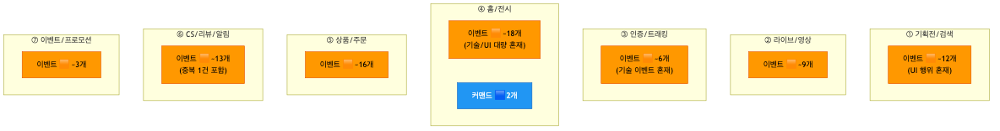

<details>
<summary>📊 원본 Mermaid 코드 보기</summary>

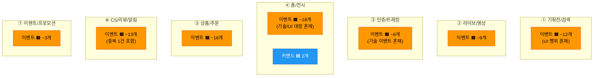

</details>

---

## 3. 준비 문서 대비 달성도

### 3.1 목표 달성 비교표

| 항목 | 3차 준비 문서 목표 | 실제 수행 결과 | 달성 |
|------|-------------------|---------------|------|
| 이벤트 정제 | ~77개 → ~40개 (UI/기술 제거) | 정제 미수행 (~77개 그대로, UI/기술 혼재) | ⬜ |
| 커맨드 도출 | 2개 → ~30개 (역추적) | 2개만 (앱 실행, 스크롤 액션) | ⬜ |
| 정책 도출 | 0 → ~6개 (When/Then) | **미수행** (0개) | ⬜ |
| 애그리게이트 | 0 → ~8개 확정 | **미수행** (0개) | ⬜ |
| 읽기 모델 | 0 → ~8개 도출 | **미수행** (0개) | ⬜ |
| BC 프리뷰 | 0 → ~5개 검증 | **미수행** (0개) | ⬜ |
| 핫스팟/외부시스템 | 식별 | **미수행** (0개) | ⬜ |

**분석:** 2차 워크샵은 **이벤트 자유 도출(브레인스토밍)** 단계에 머물렀습니다. 7개 영역에서 ~77개 포스트잇을 도출한 것은 의미 있는 시작이나, "서버에 알려야 하는가?" 기준이 적용되지 않아 UI/기술 이벤트가 대량 혼재되었고, 이벤트 외의 요소 유형(커맨드, 정책, 애그리게이트 등)은 전혀 식별되지 않았습니다. 3차에서 **UI/기술 이벤트 정제가 최우선 과제**입니다.

### 3.2 Phase별 수행 현황

| Phase | 준비 문서 계획 | 계획 소요 | 실제 수행 | 비고 |
|-------|--------------|----------|----------|------|
| Phase 1 | 이벤트 대폭 정제 (~77→~40) | 35분 | ⬜ 미수행 | 정제 없이 브레인스토밍만 수행 |
| Phase 2 | 커맨드 도출 (~30개) | 25분 | ⬜ 미수행 | 2개만 식별 |
| Phase 3 | 애그리게이트 식별 (~8개) | 25분 | ⬜ 미수행 | |
| Phase 4 | 정책 구조화 + 읽기 모델 | 25분 | ⬜ 미수행 | |
| Phase 5 | BC 프리뷰 (~5개) | 20분 | ⬜ 미수행 | |

### 3.3 7개 영역 커버리지

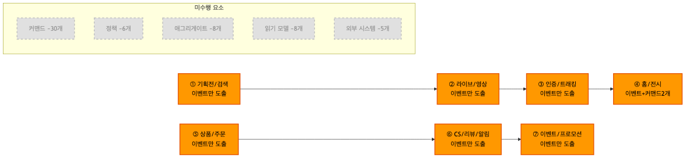

<details>
<summary>📊 원본 Mermaid 코드 보기</summary>

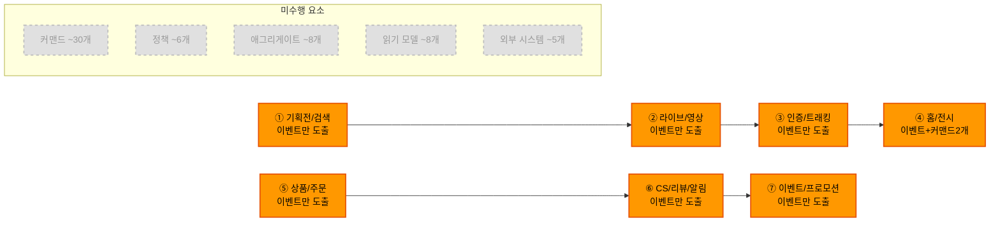

</details>

| 영역 | 상태 | 도출 요소 | 비고 |
|------|------|----------|------|
| ① 기획전/검색 | 🟧 이벤트만 | ~12개 이벤트 | UI 행위(클릭, 정렬) 혼재 |
| ② 라이브/영상 | 🟧 이벤트만 | ~9개 이벤트 | MLC 관련 이벤트 도출 양호 |
| ③ 인증/트래킹 | 🟧 이벤트만 | ~6개 이벤트 | GA/임프레션 기술 이벤트 혼재 |
| ④ 홈/전시 | 🟧 + 🟦 2개 | ~18개 이벤트 + 2 커맨드 | 기술 이벤트(Firebase, API) 대량 혼재 |
| ⑤ 상품/주문 | 🟧 이벤트만 | ~16개 이벤트 | UI 행위(버튼 클릭, 뒤로가기) 혼재 |
| ⑥ CS/리뷰/알림 | 🟧 이벤트만 | ~13개 이벤트 | 중복 1건(방송알림 신청 x2) |
| ⑦ 이벤트/프로모션 | 🟧 이벤트만 | ~3개 이벤트 | 도출 부족 |

---

## 4. draw.io 오분류 정리

### 4.1 오분류 현황 요약

프론트개발팀의 오분류는 다른 팀과 다른 **프론트엔드 특유의 패턴**이 있습니다:

1. **UI 이벤트 혼재 (~20건)**: 화면 인터랙션(클릭, 스크롤, 네비게이션)이 비즈니스 이벤트로 분류됨 — **"서버에 알려야 하는가?" 기준 미적용**
2. **기술 이벤트 혼재 (~8건)**: 기술 인프라 처리(Firebase, GA, 보안 API)가 비즈니스 이벤트로 분류됨
3. **데이터 라벨 혼재 (~3건)**: 데이터 설명/설정이 이벤트로 분류됨
4. **커맨드 오분류 (~15건)**: 행위성 표현("~한다", "~신청", "~등록")이 이벤트로 분류됨 — 🟦 커맨드로 전환 필요
5. **시제 불일치 (~10건)**: 현재형, 명사형이 이벤트(과거형)에 혼재됨
6. **중복 이벤트 (1건)**: "방송 알림을 신청했다" 동일 표현 2개

### 4.2 오분류 상세 및 교정안


<details>
<summary>📊 원본 Mermaid 코드 보기</summary>

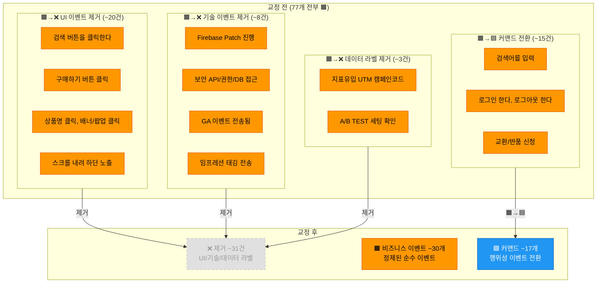

</details>

**유형 1: UI 이벤트 제거 — ~20건**

| # | draw.io 원본 | 사유 |
|---|-------------|------|
| 1 | "검색 버튼을 클릭한다" | 화면 인터랙션 — 서버 통지 불필요 |
| 2 | "구매하기 버튼 클릭" | 버튼 클릭 자체는 이벤트 아님 (결과인 "주문이 요청되었다"가 이벤트) |
| 3 | "상품명 클릭" | UI 네비게이션 |
| 4 | "전면 배너/팝업 클릭 선택" | UI 인터랙션 |
| 5 | "스크롤을 내려 하단 상품이 노출됐다" | UI 동작 (무한스크롤 기술 이벤트) |
| 6 | "상품 상세에서 뒤로가기 홈탭으로 돌아왔다" | 네비게이션 |
| 7 | "상품 상세에서 뒤로가기 종료했다" | 네비게이션 |
| 8 | "로그인에 성공했다 메인으로 돌아왔다" | 네비게이션 (로그인 성공 이벤트와 분리 필요) |
| 9 | "홈탭 VIP관 배너 노출 확인했다" | UI 확인 |
| 10 | "광고 상품/영상을 클릭했다" | UI 클릭 |
| 11~20 | 기획전 영역의 "확인한다" 패턴 다수 | "~확인한다"는 조회(읽기모델)이지 이벤트가 아님 |

**유형 2: 기술 이벤트 제거 — ~8건**

| # | draw.io 원본 | 사유 |
|---|-------------|------|
| 1 | "Firebase Patch 진행했다" | 기술 인프라 처리 |
| 2 | "보안 API / 권한 / DB 접근했다" | 기술 인프라 처리 |
| 3 | "GA 이벤트가 전송되었다" | 분석 트래킹 기술 처리 |
| 4 | "임프레션 태깅 정보 보냈다" | 광고 트래킹 기술 처리 |
| 5 | "App Info 요청 했다" | 기술 API 호출 |
| 6 | "홈 메뉴 리스트 요청 했다" | 기술 API 호출 |
| 7 | "모듈 리스트 요청 했다" | 기술 API 호출 |
| 8 | "클라이언트에서 메인 팝업 노출이 필요하면 PIP 팝업 노출 시도" | 기술/UI 동작 |

**유형 3: 데이터 라벨 제거 — ~3건**

| # | draw.io 원본 | 사유 |
|---|-------------|------|
| 1 | "지표 유입 - Inflow Cd - UTM - 캠페인 코드" | 데이터 설명 (이벤트 아님) |
| 2 | "홈탭 A/B TEST 세팅 확인" | 설정/구성 (이벤트 아님) |
| 3 | "모듈 리스트 매칭" | 기술 처리/데이터 매핑 |

**유형 4: 커맨드 전환 — ~15건**

| # | draw.io 원본 (🟧) | 교정 (🟦) | 사유 |
|---|-------------------|----------|------|
| 1 | "검색어를 입력" | 🟦 검색어 입력하기 | "~를 입력" 행위 패턴 |
| 2 | "상품의 정렬을 변경한다" | 🟦 정렬 변경하기 | "~를 변경한다" 행위 패턴 |
| 3 | "로그인 한다" | 🟦 로그인하기 | "~한다" 행위 패턴 |
| 4 | "로그아웃 한다" | 🟦 로그아웃하기 | "~한다" 행위 패턴 |
| 5 | "지문 로그인 관리 ON/OFF" | 🟦 지문 로그인 설정하기 | 설정 행위 |
| 6 | "전화로 상담을 신청한다" | 🟦 전화 상담 신청하기 | "~를 신청한다" 행위 패턴 |
| 7 | "교환/반품 신청" | 🟦 교환/반품 신청하기 | 명사형 행위 |
| 8 | "쿠폰 다운로드" | 🟦 쿠폰 다운받기 | 명사형 행위 |
| 9 | "상품 문의를 등록 했다" | 🟦 상품 문의 등록하기 | "~등록했다"는 행위+결과 혼합 |
| 10 | "MLC 방송 공유하기" | 🟦 방송 공유하기 | "~하기" 커맨드 패턴 |
| 11 | "MLC 채팅 참여하기" | 🟦 채팅 참여하기 | "~하기" 커맨드 패턴 |
| 12~15 | 기획전 "~확인한다" 패턴 중 행위성 | 🟦 커맨드 | 조회 행위 |

**유형 5: 시제 불일치 — ~10건 (교정 예시)**

| # | draw.io 원본 | 교정 후 | 사유 |
|---|-------------|--------|------|
| 1 | "로그인 한다" | → 🟦 커맨드 전환 | 현재형 |
| 2 | "검색어를 입력" | → 🟦 커맨드 전환 | 명사형 |
| 3 | "알림 신청 완료" | "방송 알림이 신청되었다" | 명사형→과거형 |
| 4 | "쿠폰 다운로드" | → 🟦 커맨드 전환 | 명사형 |
| 5 | "리뷰 작성 완료" | "리뷰가 작성되었다" | 명사형→과거형 |

**유형 6: 중복 이벤트 — 1건**

| # | draw.io 원본 (중복) | 통합 후 |
|---|-------------------|--------|
| 1 | "방송 알림을 신청했다" x2 | → **1개로 통합** |

### 4.3 논의 필요 항목

| # | 요소명 | 현재 | 교정 후보 | 논의 사항 |
|---|--------|------|----------|----------|
| 1 | "유저 위치정보가 변경 되었다" | 🟧 이벤트 | 🟧 유지? 또는 🟩 외부 시스템? | 위치 변경이 프론트 비즈니스 이벤트인지 |
| 2 | "외부 유입 QR 코드" | 🟧 이벤트 | 🟩 외부 시스템? 또는 📝 라벨? | QR 코드 유입이 이벤트인지 데이터 라벨인지 |
| 3 | "대기열을 생성했다" | 🟧 이벤트 | 🟧 유지? 또는 🟩 외부 시스템? | 대기열 시스템이 프론트 도메인인지 |
| 4 | "로그인에 성공했다 메인으로 돌아왔다" | 🟧 이벤트 | 분리: "로그인이 성공되었다" + ❌ 네비게이션 | 2개 이벤트 혼합 |

### 4.4 교정 후 예상 요소 현황

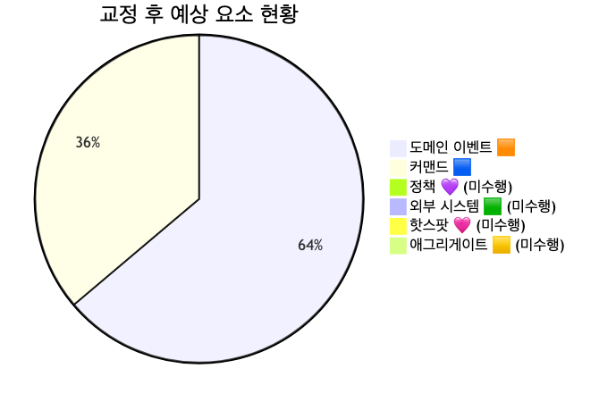

<details>
<summary>📊 원본 Mermaid 코드 보기</summary>

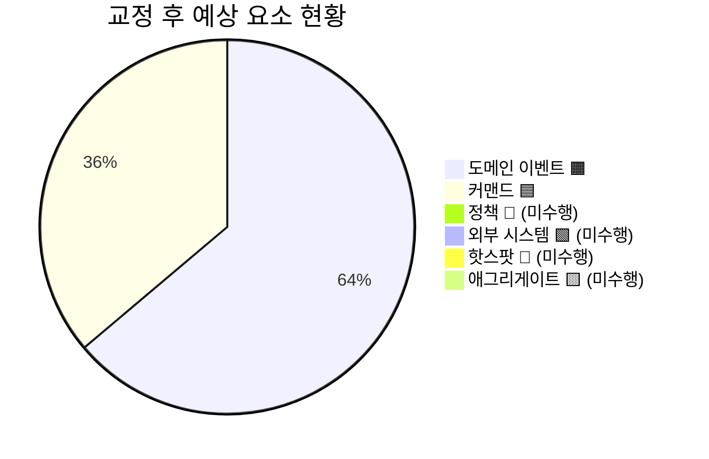

</details>

**교정 전후 수치 비교:**

| 유형 | 교정 전 | 교정 후 | 변동 |
|------|--------|--------|------|
| 이벤트 🟧 | ~75 | ~30 | -45 (UI ~20 + 기술 ~8 + 데이터 ~3 + 커맨드전환 ~15 + 중복 1 제거, 분리 +2) |
| 커맨드 🟦 | 2 | ~17 | +15 (이벤트→커맨드 전환) |
| 정책 💜 | 0 | 0 | 3차에서 도출 필요 |
| 외부 시스템 🟩 | 0 | 0 | 3차에서 식별 필요 |
| 핫스팟 🩷 | 0 | 0 | 3차에서 식별 필요 |
| 애그리게이트 🟨 | 0 | 0 | 3차에서 식별 필요 |

---

## 5. 도메인별 흐름 분석

### 5.1 기획전/검색 흐름

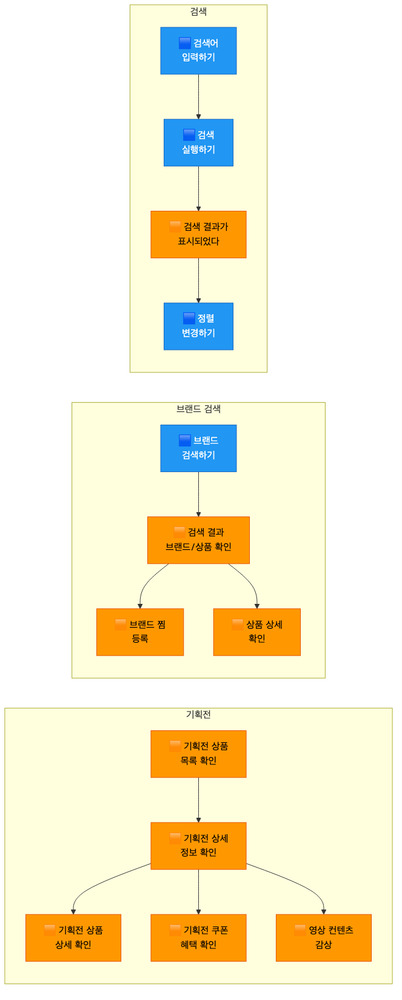

<details>
<summary>📊 원본 Mermaid 코드 보기</summary>

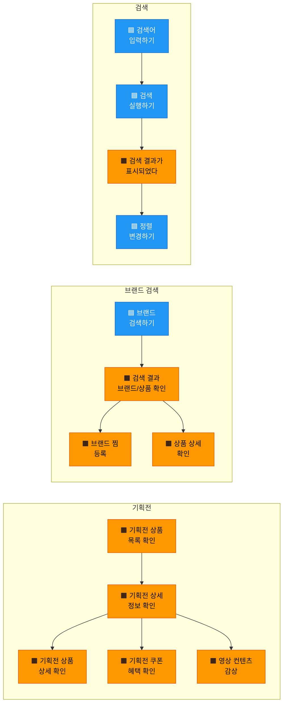

</details>

**흐름 요약:**
1. **기획전**: 상품 목록 확인 → 상세 정보 → 상품 상세/쿠폰/영상 확인
2. **브랜드 검색**: 브랜드 검색 → 결과 확인 → 브랜드 찜 또는 상품 상세
3. **검색**: 검색어 입력 → 검색 실행 → 결과 표시 → 정렬 변경

### 5.2 홈/전시 흐름

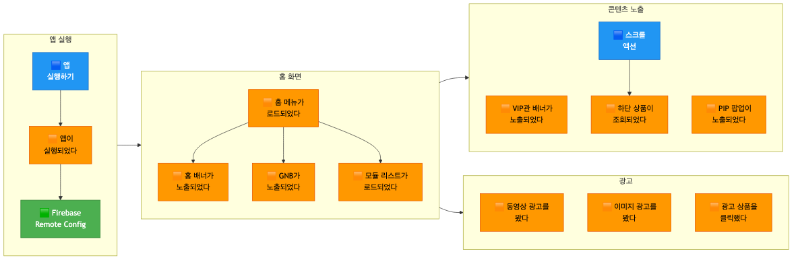

<details>
<summary>📊 원본 Mermaid 코드 보기</summary>

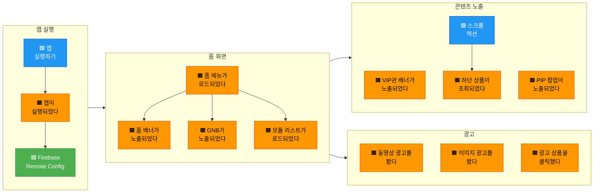

</details>

### 5.3 상품/주문 흐름

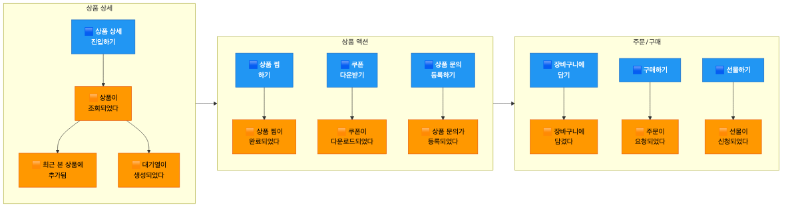

<details>
<summary>📊 원본 Mermaid 코드 보기</summary>

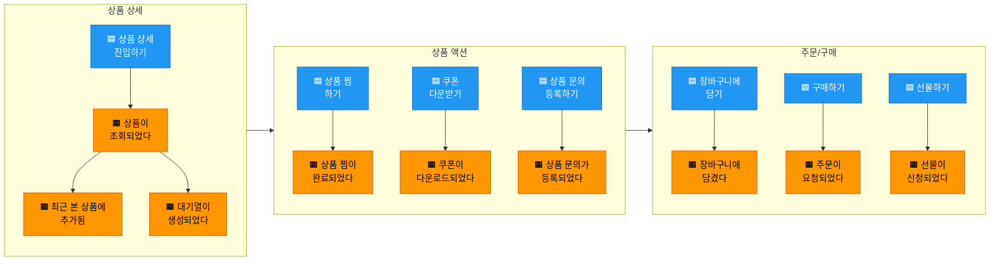

</details>

### 5.4 외부 시스템 의존성 분석

2차에서는 외부 시스템이 전혀 식별되지 않았으나, draw.io 내용으로부터 추론 가능한 후보:

| 그룹 | 🟩 외부 시스템 후보 | 영역 | 연동 내용 |
|------|-------------------|------|----------|
| 인증 | Firebase (인증/Remote Config/FCM) | ③④ | 인증, 설정, 푸시 알림 |
| 분석 | GA/Analytics | ③④ | 이벤트 트래킹, 임프레션 |
| 결제 | PG사 | ⑤ | 결제 처리 |
| 소셜 | CJ ONE, 소셜 인증 | ③⑥ | 소셜 로그인, 멤버십 |
| 미디어 | CDN/영상 서비스 | ② | 라이브 스트리밍, VOD |

---

## 6. 미완료 항목 정리

### 6.1 미완료 항목 전체 목록

- [ ] UI 이벤트 ~20건 제거 (클릭, 스크롤, 네비게이션)
- [ ] 기술 이벤트 ~8건 제거 (Firebase, GA, API)
- [ ] 데이터 라벨 ~3건 제거
- [ ] 커맨드 전환 ~15건 (행위성 이벤트 → 🟦)
- [ ] 시제 불일치 ~10건 교정
- [ ] 중복 이벤트 1건 제거
- [ ] 논의 필요 4건 결정
- [ ] 커맨드 ~30개 도출 (이벤트로부터 역추적)
- [ ] 정책 ~6개 도출 (When/Then)
- [ ] 외부 시스템 ~5개 식별
- [ ] 핫스팟 ~5개 식별
- [ ] 애그리게이트 ~8개 후보 확정
- [ ] 읽기 모델 ~8개 후보 도출
- [ ] 바운디드 컨텍스트 ~5개 후보 프리뷰

### 6.2 영역별 미진행 상세

| 영역 | 이벤트 도출 | 커맨드 | 정책 | 애그리게이트 | 읽기 모델 | BC |
|------|-----------|--------|------|------------|----------|------|
| ① 기획전/검색 | 🟧 UI혼재 | ⬜ | ⬜ | ⬜ | ⬜ | ⬜ |
| ② 라이브/영상 | 🟧 양호 | ⬜ | ⬜ | ⬜ | ⬜ | ⬜ |
| ③ 인증/트래킹 | 🟧 기술혼재 | ⬜ | ⬜ | ⬜ | ⬜ | ⬜ |
| ④ 홈/전시 | 🟧 대량혼재 | 🟦 2개 | ⬜ | ⬜ | ⬜ | ⬜ |
| ⑤ 상품/주문 | 🟧 UI혼재 | ⬜ | ⬜ | ⬜ | ⬜ | ⬜ |
| ⑥ CS/리뷰/알림 | 🟧 중복 | ⬜ | ⬜ | ⬜ | ⬜ | ⬜ |
| ⑦ 이벤트/프로모션 | 🟧 부족 | ⬜ | ⬜ | ⬜ | ⬜ | ⬜ |

### 6.3 애그리게이트·읽기모델 후보 (준비 문서 기반)

**애그리게이트 8개 후보:**

| # | 🟨 애그리게이트 | 영역 | 포함 데이터 |
|---|----------------|------|-----------|
| 1 | 회원인증 | ③ | 회원ID, 인증방식, 세션, 차단상태 |
| 2 | 검색 | ① | 검색어, 필터, 정렬, 결과목록 |
| 3 | 상품 | ⑤ | 상품ID, 상품명, 가격, 상태, 재고 |
| 4 | 장바구니 | ⑤ | 장바구니ID, 상품목록, 수량, 금액 |
| 5 | 주문/결제 | ⑤ | 주문ID, 결제수단, 결제금액, 상태 |
| 6 | 프로모션 | ①⑦ | 프로모션ID, 쿠폰, 이벤트, 응모상태 |
| 7 | 콘텐츠 | ② | 영상ID, 방송ID, 채팅, 댓글 |
| 8 | 고객서비스 | ⑥ | 문의ID, 유형, 리뷰, 교환/반품 |

**읽기 모델 8개 후보:**

| # | 📖 읽기 모델 | 대상 | 구성 데이터 |
|---|-------------|------|-----------|
| 1 | 홈 화면 | 👤 고객 | 배너, 모듈, 추천 상품, GNB |
| 2 | 검색 결과 화면 | 👤 고객 | 검색 결과, 필터, 정렬 옵션 |
| 3 | 상품 상세 화면 | 👤 고객 | 상품 정보, 가격, 리뷰, 쿠폰 |
| 4 | 장바구니 화면 | 👤 고객 | 담긴 상품, 수량, 합계 금액 |
| 5 | 라이브 방송 화면 | 👤 고객 | 방송 영상, 채팅, 상품 목록 |
| 6 | 기획전 화면 | 👤 고객 | 기획전 상품, 혜택, 영상 |
| 7 | 마이페이지 | 👤 고객 | 주문내역, 찜, 쿠폰, 멤버십 |
| 8 | CS 화면 | 👤 고객 | 문의내역, 교환/반품, 리뷰 |

---

## 7. 3차 워크샵 권장 사항

### 7.1 3차 워크샵 목표 재설정

```
┌─────────────────────────────────────────────────────────────┐
│              3차 워크샵에서 달성할 것                          │
├─────────────────────────────────────────────────────────────┤
│                                                             │
│  ✅ 이벤트 대폭 정제 (~77개 → ~30개, UI/기술 제거)         │
│  ✅ 커맨드 도출 (~17개 + 역추적 → ~30개)                    │
│  ✅ 애그리게이트 식별 (~8개 후보 확정)                       │
│  ✅ 정책 도출 (~6개, When/Then 정의)                         │
│  ✅ 읽기 모델 도출 (~8개 후보)                               │
│  ✅ 바운디드 컨텍스트 프리뷰 (~5개 BC 후보)                  │
│                                                             │
└─────────────────────────────────────────────────────────────┘
```

### 7.2 권장 타임라인

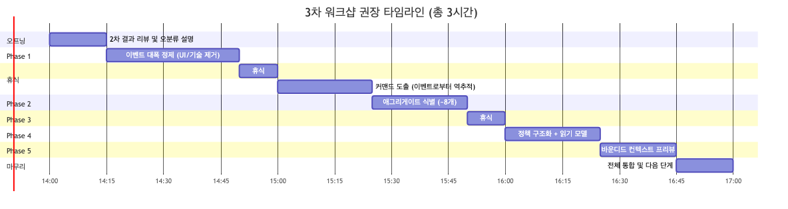

<details>
<summary>📊 원본 Mermaid 코드 보기</summary>

```mermaid
gantt
    title 3차 워크샵 권장 타임라인 (총 3시간)
    dateFormat HH:mm
    axisFormat %H:%M

    section 오프닝
    2차 결과 리뷰 및 오분류 설명           :a1, 14:00, 15m

    section Phase 1
    이벤트 대폭 정제 (UI/기술 제거)        :a2, after a1, 35m

    section 휴식
    휴식                                    :a3, after a2, 10m

    section Phase 2
    커맨드 도출 (이벤트로부터 역추적)       :a4, after a3, 25m

    section Phase 3
    애그리게이트 식별 (~8개)               :a5, after a4, 25m

    section 휴식
    휴식                                    :a6, after a5, 10m

    section Phase 4
    정책 구조화 + 읽기 모델                :a7, after a6, 25m

    section Phase 5
    바운디드 컨텍스트 프리뷰               :a8, after a7, 20m

    section 마무리
    전체 통합 및 다음 단계                  :a9, after a8, 15m
```

</details>

| 시간 | 단계 | 소요 | 핵심 활동 |
|------|------|------|----------|
| 14:00 | 오프닝 | 15분 | 2차 결과 리뷰, "서버에 알려야 하는가?" 기준 안내, UI/기술 이벤트 구분 교육 |
| 14:15 | Phase 1: 이벤트 대폭 정제 | 35분 | UI ~20건 제거, 기술 ~8건 제거, 커맨드 전환 ~15건, 시제 교정 → ~30개 목표 |
| 14:50 | 휴식 | 10분 | |
| 15:00 | Phase 2: 커맨드 도출 | 25분 | 정제된 이벤트로부터 역추적 → ~30개 커맨드 |
| 15:25 | Phase 3: 애그리게이트 식별 | 25분 | 7개 영역별 애그리게이트 → ~8개 후보 |
| 15:50 | 휴식 | 10분 | |
| 16:00 | Phase 4: 정책 + 읽기 모델 | 25분 | 정책 ~6개(When/Then) + 읽기 모델 ~8개 |
| 16:25 | Phase 5: BC 프리뷰 | 20분 | ~5개 BC 후보 경계 검증 |
| 16:45 | 마무리 | 15분 | 전체 통합, 다음 단계 안내 |
| **17:00** | **종료** | **총 3시간** | |

### 7.3 사전 준비 체크리스트

- [ ] draw.io 보드에서 UI 이벤트 ~20건 빨간 배경(제거 대상) 표시
- [ ] 기술 이벤트 ~8건 빨간 배경(제거 대상) 표시
- [ ] 데이터 라벨 ~3건 빨간 배경(제거 대상) 표시
- [ ] 커맨드 전환 대상 ~15건 파란 배경(🟦 전환 대상) 표시
- [ ] 중복 이벤트 1건("방송 알림 신청") 하나 제거
- [ ] 시제 불일치 ~10건 과거형("~되었다")으로 사전 교정
- [ ] 논의 필요 4건에 대해 팀원과 사전 확인 (슬랙 논의)
- [ ] 포스트잇 색상 가이드를 벽면에 크게 인쇄하여 부착
- [ ] "서버에 알려야 하는가?" 판단 기준 안내 자료 준비

### 7.4 퍼실리테이터 유의 사항

2차 워크샵에서 얻은 교훈 4가지:

**1. "서버에 알려야 하는가?" 기준 교육 최우선**
> 프론트엔드팀의 가장 큰 과제는 **UI 이벤트와 비즈니스 이벤트의 구분**입니다.
> "검색 버튼을 클릭한다"는 UI 동작이지 비즈니스 이벤트가 아닙니다.
> "검색이 실행되어 결과가 표시되었다"가 비즈니스 이벤트입니다.
> 오프닝에서 **"이 포스트잇의 내용을 서버에 알려야 하나요?"** 질문을 기준으로 교육합니다.

**2. 기술 이벤트 vs 비즈니스 이벤트 구분**
> "Firebase Patch", "GA 이벤트 전송", "보안 API 접근"은 **기술 인프라 처리**이지 비즈니스 이벤트가 아닙니다.
> **"이것이 비즈니스에 영향을 주는 상태 변경인가?"**라는 질문으로 구분합니다.
> 기술 이벤트는 🟩 외부 시스템으로 재분류하거나 제거합니다.

**3. 이벤트→커맨드 역추적 방법 안내**
> 2차에서 커맨드가 2개뿐입니다. 3차에서는 정제된 이벤트로부터 역추적합니다.
> **"이 이벤트가 발생하려면 누가 어떤 명령을 내렸나요?"** → 그것이 커맨드입니다.
> 예: "상품이 조회되었다" ← "상품 상세 진입하기" (커맨드)

**4. 프론트엔드 특화: 읽기 모델 = 화면**
> 프론트엔드팀에게 읽기 모델은 곧 **화면(UI)**입니다.
> "홈 화면에서 고객이 보는 것은?" → 배너, 모듈, 추천 상품 → 홈 화면 읽기 모델
> 이 접근법으로 ~8개 읽기 모델을 빠르게 도출할 수 있습니다.

### 7.5 도메인별 정제 우선순위

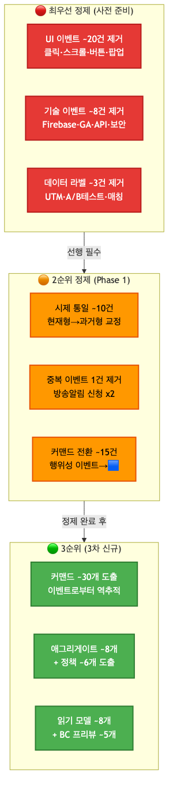

<details>
<summary>📊 원본 Mermaid 코드 보기</summary>

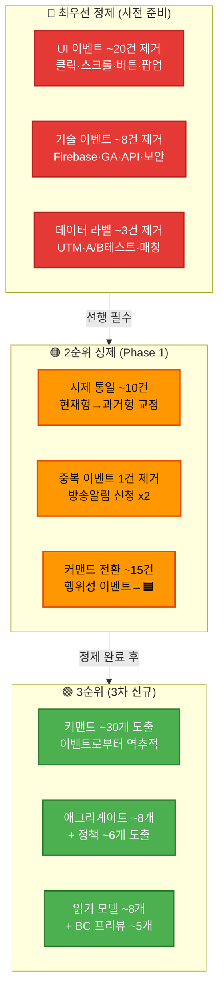

</details>

**우선순위 설명:**
1. **🔴 최우선**: UI 이벤트 ~20건 + 기술 이벤트 ~8건 + 데이터 라벨 ~3건 = **~31건 제거** — **사전 준비로 처리**
2. **🟠 2순위**: 시제 교정 ~10건 + 중복 제거 1건 + 커맨드 전환 ~15건 — **Phase 1에서 처리**
3. **🟢 3순위**: 커맨드·애그리게이트·정책·읽기모델·BC 프리뷰 — **Phase 2~5에서 신규 수행**
