# 프론트 개발팀 이벤트 스토밍 3차 워크샵 준비 가이드

## 1. 개요

### 1.1 이 문서의 목적

프론트개발팀 이벤트 스토밍 **3차 워크샵**을 진행하는 퍼실리테이터를 위한 실전 가이드입니다.
1~2차에서 도출한 이벤트를 기반으로, **대폭 정제 → 애그리게이트 → 정책 구조화 → 읽기 모델 → BC 프리뷰**까지 완성하는 것이 목표입니다.

프론트개발팀은 **8개 비즈니스 흐름 영역**(인증, 검색, 상품, 주문, 프로모션, 영상, 알림, CS)을 담당하며, **UI 이벤트·기술 이벤트가 비즈니스 이벤트에 대량 혼재**된 것이 가장 큰 특징입니다.

```
┌─────────────────────────────────────────────────────────────┐
│              3차 워크샵에서 달성할 것                         │
├─────────────────────────────────────────────────────────────┤
│                                                             │
│  ✅ 이벤트 대폭 정제: ~77개 → ~40개 (UI/기술 이벤트 제거)  │
│  ✅ 커맨드 도출: 2개 → ~30개 (이벤트로부터 역추적)          │
│  ✅ 애그리게이트: ~8개 후보 확정 (영역별)                   │
│  ✅ 정책 구조화: ~6개 (When/Then 정의)                      │
│  ✅ 읽기 모델: ~8개 후보 도출                               │
│  ✅ 바운디드 컨텍스트 프리뷰: ~5개 BC 후보 검증             │
│                                                             │
└─────────────────────────────────────────────────────────────┘
```

### 1.2 1~2차 요약 & 3차 목표

**1~2차 완료 사항:**
- 1차: 이벤트 자유 도출 (브레인스토밍)
- 2차: 이벤트 도출 (draw.io 2개 파일 정리) — UI·기술 이벤트 대량 혼재

| 항목 | 1~2차 완료 | 3차 목표 |
|------|-----------|---------|
| 이벤트 도출 | ✅ ~77개 (UI/기술 이벤트 혼재) | **정제하여 ~40개** |
| 커맨드 | ✅ ~2개 (앱 실행하기, 스크롤 액션) | **~30개 도출 (역추적)** |
| 정책 | ⬜ 0개 | **~6개 도출 (When/Then)** |
| 핫스팟 | ⬜ 0개 | **~5개 식별** |
| 외부 시스템 | ⬜ 0개 | **~5개 식별** |
| 애그리게이트 | ⬜ 0개 | **~8개 후보 확정** |
| 읽기 모델 | ⬜ 0개 | **~8개 후보 도출** |
| 바운디드 컨텍스트 | ⬜ 미수행 | **~5개 BC 프리뷰** |

### 1.3 참조 문서

| 참조 문서 | 활용 시점 |
|----------|----------|
| [이벤트스토밍_프론트엔드팀_가이드.md](./이벤트스토밍_프론트엔드팀_가이드.md) | UI vs 비즈니스 이벤트 구분, 플랫폼 추상화, TOP 7 실수, 퍼실리테이터 스크립트 |
| [이벤트스토밍_프론트엔드팀_정책분류.md](./이벤트스토밍_프론트엔드팀_정책분류.md) | 3 레이어 분류 체계 (💜/🩷/❌), 도메인별 정책 예시 |
| [이벤트스토밍_단계별_실행가이드.md](./이벤트스토밍_단계별_실행가이드.md) | Phase별 진행 방법, 일반 스크립트 |
| [이벤트스토밍_퀵레퍼런스.md](./이벤트스토밍_퀵레퍼런스.md) | 용어집, 흔한 실수, 빠른 참조 |

---

## 2. 1~2차 결과 정리 및 재검토

### 2.1 현재 요소 현황 요약

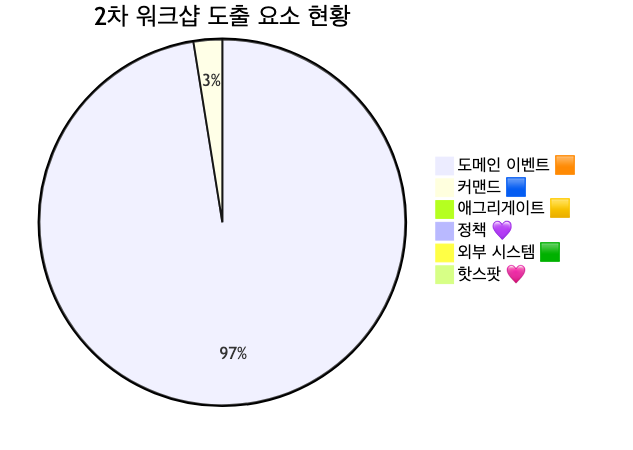

<details>
<summary>📊 원본 Mermaid 코드 보기</summary>

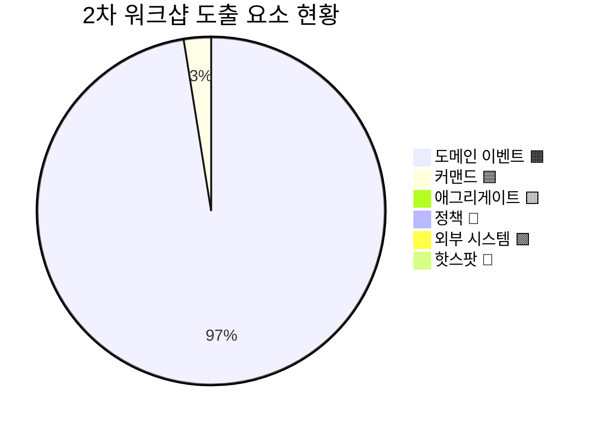

</details>

**현황 분석:**
- 이벤트 ~77개 중 **UI 이벤트 ~20건**, **기술 이벤트 ~8건**, **데이터 라벨 ~5건**이 혼재
- 커맨드는 2개(앱 실행하기, 스크롤 액션)만 도출 — 둘 다 UI 행위로, 비즈니스 커맨드 부재
- 정책·애그리게이트·외부 시스템·핫스팟 모두 **0개** — 3차에서 대폭 보완 필요
- **시제 불일치** — "로그인 한다"(현재형) vs "로그인이 되었다"(과거형) 혼재
- 두 draw.io 파일 간 **중복 이벤트 존재** (예: 상품 조회, 장바구니 담기)

### 2.2 8개 흐름 영역 전체 맵

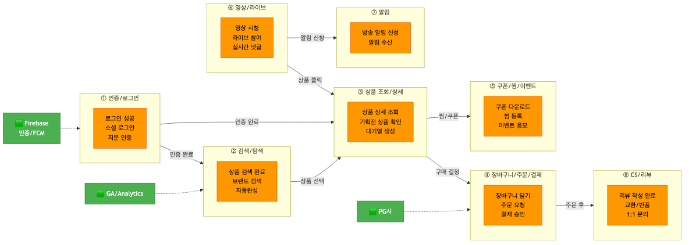

<details>
<summary>📊 원본 Mermaid 코드 보기</summary>

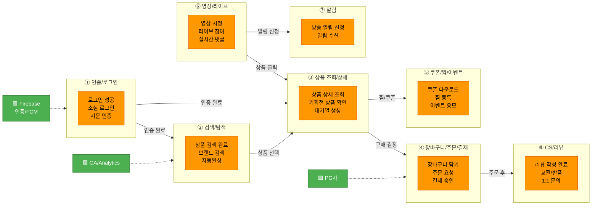

</details>

**영역별 상세:**

| 영역 | 2차 이벤트 수 | 정제 후 목표 | 대표 이벤트 |
|------|-------------|-----------|-----------|
| ① 인증/로그인 | ~10 | ~5 | 로그인 성공, 소셜 로그인, 지문인증, 로그아웃 |
| ② 검색/탐색 | ~8 | ~4 | 상품 검색 완료, 브랜드 검색, 자동완성 |
| ③ 상품 조회/상세 | ~10 | ~6 | 상품 상세 조회, 기획전 상품 확인, 대기열 생성 |
| ④ 장바구니/주문/결제 | ~12 | ~8 | 장바구니 담기, 주문 요청, 결제 승인, 선물하기 |
| ⑤ 쿠폰/찜/이벤트 | ~10 | ~5 | 쿠폰 다운로드, 찜 등록, 이벤트 응모 |
| ⑥ 영상/라이브 | ~8 | ~4 | 영상 시청, 라이브 방송 참여, 실시간 댓글 |
| ⑦ 알림 | ~5 | ~3 | 방송 알림 신청, 알림 수신, 알림 실패 |
| ⑧ CS/리뷰 | ~14 | ~5 | 리뷰 작성 완료, 교환/반품, 1:1 문의, 전화 상담 |

### 2.3 이벤트 재검토 항목

#### 2.3.1 UI 이벤트 제거 (~20건)

draw.io에서 **사용자 UI 행위**로 작성되었으나 **비즈니스 이벤트가 아닌 항목**:

> **판별 기준: "이 행위가 서버에 상태 변경을 알려야 하는가?"** — No이면 UI 이벤트로 제거

| # | draw.io 원본 | 판별 | 처리 |
|---|-------------|------|------|
| 1 | "검색 버튼 클릭" | UI 행위 | → 제거 (비즈니스 이벤트: "상품이 검색되었다") |
| 2 | "스크롤 액션" | UI 행위 | → 제거 |
| 3 | "스크롤을 내려 하단 상품이 노출됐다" | UI 행위 | → 제거 |
| 4 | "배너/팝업 클릭 선택" | UI 행위 | → 제거 |
| 5 | "전면 배너/팝업 클릭 선택" | UI 행위 | → 제거 |
| 6 | "홈탭 이동" / "홈탭 A/B TEST 세팅 확인" | UI 탐색 | → 제거 |
| 7 | "구매하기 버튼 클릭" | UI 행위 | → 제거 (비즈니스 이벤트: "주문이 요청되었다") |
| 8 | "광고 상품/영상 클릭" | UI 행위 | → 제거 |
| 9 | "상품 상세에서 뒤로가기 홈탭으로 돌아옴" | UI 탐색 | → 제거 |
| 10 | "상품 상세에서 뒤로가기 종료" | UI 탐색 | → 제거 |
| 11 | "로그인 성공 후 메인 돌아옴" | UI 탐색 | → 제거 (비즈니스 이벤트: "로그인이 성공했다") |
| 12 | "홈탭 VIP관 배너 노출 확인" | UI 노출 | → 제거 |
| 13 | "오른쪽 하단 팝업 방송 시청" | UI 행위 | → 제거 (비즈니스 이벤트: "라이브 방송에 참여했다") |
| 14 | "모듈 리스트 매칭" | UI 렌더링 | → 제거 |
| 15 | "클라이언트에서 메인 팝업 노출 필요 시 PIP 팝업 노출 시도" | UI 렌더링 | → 제거 |
| 16 | "유저 위치정보 변경" | UI 설정 | → 제거 (또는 비즈니스 이벤트로 재검토) |
| 17 | "MLC 방송 공유" | UI 행위 | → 제거 (또는 "방송이 공유되었다"로 전환 검토) |
| 18 | "PGM 방송 시청" | UI 행위 | → 통합: "영상이 시청되었다" |
| 19 | "프로모션 영상 N초 시청" | UI 행위 | → 통합: "영상이 시청되었다" |
| 20 | "CJ ONE 로그인 기록 확인" | UI 조회 | → 제거 (📖 읽기 모델 후보) |

#### 2.3.2 기술 이벤트 제거 (~8건)

| # | draw.io 원본 | 현재 역할 | 처리 |
|---|-------------|----------|------|
| 1 | "Firebase Patch 진행했다" | 기술 인프라 | → 제거 |
| 2 | "보안 API / 권한 / DB 접근했다" | 기술 인프라 | → 제거 |
| 3 | "GA 이벤트 전송" | 분석 도구 연동 | → 제거 (🟩 외부 시스템으로 분류) |
| 4 | "임프레션 태깅 정보 전송" | 분석 도구 연동 | → 제거 (🟩 외부 시스템으로 분류) |
| 5 | "App Info 요청했다" | 기술 초기화 | → 제거 |
| 6 | "홈 메뉴 리스트 요청했다" | API 호출 | → 제거 (📖 읽기 모델 후보) |
| 7 | "모듈 리스트 요청했다" (x2) | API 호출 | → 제거 |
| 8 | "앱 실행하기" (커맨드) | 기술 행위 | → 제거 (비즈니스 커맨드 아님) |

#### 2.3.3 데이터 라벨 제거 (~5건)

| # | draw.io 원본 | 현재 역할 | 처리 |
|---|-------------|----------|------|
| 1 | "지표 유입 - Inflow Cd - UTM - 캠페인 코드" | 데이터 라벨 | → 제거 |
| 2 | "외부 유입 QR 코드" | 데이터 라벨 | → 제거 |
| 3 | "동영상 광고를 봤다" | 광고 분석 라벨 | → 제거 (🟩 GA/Analytics 외부 시스템) |
| 4 | "이미지 광고를 봤다" | 광고 분석 라벨 | → 제거 (🟩 GA/Analytics 외부 시스템) |
| 5 | "하단 상품 목록이 조회되었다" | 조회 라벨 | → 📖 읽기 모델 후보 |

#### 2.3.4 명명 정규화 및 시제 통일 (~10건)

| # | draw.io 원본 | 교정 후 | 사유 |
|---|-------------|--------|------|
| 1 | "로그인 한다" | "로그인이 성공했다" | 현재형→과거형 |
| 2 | "기획전 상품 목록을 확인한다" | "기획전 상품이 조회되었다" | 현재형→과거형 |
| 3 | "기획전 상세 정보를 확인한다" | 통합: "기획전 상품이 조회되었다" | 중복 통합 |
| 4 | "기획전 상품의 상세를 확인한다" | 통합: "기획전 상품이 조회되었다" | 중복 통합 |
| 5 | "기획전 쿠폰/혜택을 확인한다" | "쿠폰이 다운로드되었다" | 조회→비즈니스 이벤트 |
| 6 | "영상 컨텐츠(기획전)를 감상한다" | "영상이 시청되었다" | 현재형→과거형, 통합 |
| 7 | "브랜드 찜을 했다" | "브랜드가 찜되었다" | 피동형 통일 |
| 8 | "상품 찜/취소했다" | "상품이 찜되었다" / "상품 찜이 취소되었다" | 분리 + 피동형 |
| 9 | "상품을 장바구니에 담았다" | "상품이 장바구니에 담겼다" | 피동형 통일 |
| 10 | "상품을 구매했다" | "결제가 승인되었다" | 구체적 비즈니스 이벤트 |

#### 2.3.5 두 파일 간 중복 제거

| # | 파일 1 | 파일 2 | 통합 후 |
|---|--------|--------|--------|
| 1 | "라이브 방송 상품 장바구니 추가" | "상품을 장바구니에 담았다" | "상품이 장바구니에 담겼다" |
| 2 | "리뷰 작성 완료" + "포토 리뷰 작성 완료" | — | "리뷰가 작성되었다" (포토 여부는 속성) |
| 3 | "영상 시청 이벤트 응모" | "이벤트를 응모했다" | "이벤트에 응모되었다" |
| 4 | "프로모션 이벤트 신청 완료" | "특집을 신청했다" | "프로모션이 신청되었다" |

### 2.4 1~2차→3차 전환 체크리스트

- [ ] UI 이벤트 ~20건 제거
- [ ] 기술 이벤트 ~8건 제거
- [ ] 데이터 라벨 ~5건 제거
- [ ] 명명 정규화 및 시제 통일 ~10건 처리
- [ ] 두 파일 간 중복 제거 ~4건
- [ ] 8개 흐름 영역별 이벤트 재배치
- [ ] 커맨드 ~30개 역추적 도출

---

## 3. 3차 워크샵 타임라인

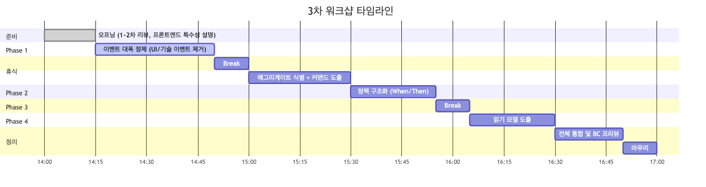

<details>
<summary>📊 원본 Mermaid 코드 보기</summary>

```mermaid
gantt
    title 3차 워크샵 타임라인
    dateFormat HH:mm
    axisFormat %H:%M

    section 준비
    오프닝 (1~2차 리뷰, 프론트엔드 특수성 설명)   :done, 14:00, 15m

    section Phase 1
    이벤트 대폭 정제 (UI/기술 이벤트 제거)         :active, 14:15, 35m

    section 휴식
    Break                                          :14:50, 10m

    section Phase 2
    애그리게이트 식별 + 커맨드 도출                  :15:00, 30m

    section Phase 3
    정책 구조화 (When/Then)                         :15:30, 25m

    section 휴식
    Break                                          :15:55, 10m

    section Phase 4
    읽기 모델 도출                                  :16:05, 25m

    section 정리
    전체 통합 및 BC 프리뷰                          :16:30, 20m
    마무리                                          :16:50, 10m
```

</details>

| 시간 | 단계 | 소요 | 핵심 활동 | 산출물 |
|------|------|------|----------|--------|
| 14:00 | 오프닝 | 15분 | 1~2차 리뷰, 프론트엔드 특수성(UI 이벤트 문제) 설명 | — |
| 14:15 | Phase 1: 이벤트 대폭 정제 | 35분 | UI/기술/라벨 제거, 시제 통일, 중복 제거 | 정제된 이벤트 ~40개 |
| 14:50 | 휴식 | 10분 | — | — |
| 15:00 | Phase 2: 애그리게이트 식별 | 30분 | 영역별 애그리게이트 도출 + 커맨드 역추적 | ~8개 후보, ~30개 커맨드 |
| 15:30 | Phase 3: 정책 구조화 | 25분 | When/Then 정의 + 핫스팟 전환 | ~6개 정책, ~5개 핫스팟 |
| 15:55 | 휴식 | 10분 | — | — |
| 16:05 | Phase 4: 읽기 모델 도출 | 25분 | 고객/운영자 화면 식별 | ~8개 후보 |
| 16:30 | 전체 통합 & BC 프리뷰 | 20분 | 5개 BC 후보 검증, 외부 시스템 식별 | BC 프리뷰 |
| 16:50 | 마무리 | 10분 | 다음 단계 안내 | — |
| **17:00** | **종료** | **총 3시간** | | |

---

## 4. Phase 1: 이벤트 대폭 정제 (35분)

### 퍼실리테이터 스크립트

> "1~2차에서 8개 영역에 걸쳐 **~77개 이벤트**를 도출했습니다. 그런데 이 중 상당수가 비즈니스 이벤트가 아닙니다.
>
> **핵심 질문은 하나입니다: '이 행위가 서버에 상태 변경을 알려야 하는가?'**
>
> '검색 버튼 클릭', '스크롤 액션', '배너 클릭' — 이것들은 **UI 이벤트**입니다. 서버에 상태 변경이 없죠.
> 'Firebase Patch', 'GA 이벤트 전송', '임프레션 태깅' — 이것들은 **기술 이벤트**입니다. 비즈니스 흐름이 아닙니다.
>
> UI 이벤트 ~20건, 기술 이벤트 ~8건, 데이터 라벨 ~5건을 제거하면 **~40개 비즈니스 이벤트**가 남습니다.
> 영역별로 진행합시다. 한 건당 30초를 넘기지 않겠습니다."

### 4.1 UI 이벤트 vs 비즈니스 이벤트 분류 작업

**판별 기준 (프론트엔드팀 가이드 참조):**

| 구분 | UI 이벤트 (제거) | 비즈니스 이벤트 (유지) |
|------|-----------------|---------------------|
| 정의 | 화면 내 사용자 행위 | 서버 상태가 변경되는 행위 |
| 예시 | 버튼 클릭, 스크롤, 탭 이동 | 주문 요청, 결제 승인, 로그인 성공 |
| 판별 | "서버에 알려야 하나?" → No | "서버에 알려야 하나?" → Yes |
| 처리 | 🟧에서 제거 | 🟧 유지 + 시제 통일 |

**영역별 제거 대상:**

| 영역 | 제거 대상 UI/기술 이벤트 | 유지할 비즈니스 이벤트 |
|------|----------------------|---------------------|
| ① 인증 | CJ ONE 로그인 기록 확인, 지문 로그인 관리 | 로그인 성공, 소셜 로그인 완료, 로그아웃, 회원 가입 |
| ② 검색 | 검색 버튼 클릭, 검색어 입력 | 상품 검색 완료, 브랜드 검색, 자동완성 |
| ③ 상품 | 뒤로가기, 배너/팝업 클릭, VIP관 배너 노출, 모듈 리스트 | 상품 상세 조회, 기획전 상품 조회, 대기열 생성 |
| ④ 주문 | 구매하기 버튼 클릭 | 장바구니 담기, 주문 요청, 결제 승인 |
| ⑥ 영상 | PGM 방송 시청, 팝업 방송 시청, MLC 공유 | 영상 시청, 라이브 참여, 라이브 채팅 |

### 4.2 기술 이벤트 제거 작업

> **판별 기준: "이것이 비즈니스 프로세스의 일부인가, 기술 구현 상세인가?"**

| 기술 이벤트 | 처리 | 전환 대상 |
|-----------|------|----------|
| Firebase Patch 진행 | 제거 | 🟩 Firebase (외부 시스템) |
| 보안 API / 권한 / DB 접근 | 제거 | 기술 인프라 |
| GA 이벤트 전송 | 제거 | 🟩 GA/Analytics (외부 시스템) |
| 임프레션 태깅 전송 | 제거 | 🟩 GA/Analytics (외부 시스템) |
| App Info 요청 | 제거 | 기술 초기화 |
| 모듈 리스트 요청 (x2) | 제거 | 📖 읽기 모델 후보 |
| 홈 메뉴 리스트 요청 | 제거 | 📖 읽기 모델 후보 |

### 4.3 시제 통일 및 명명 정규화

**규칙:** 도메인 이벤트는 **과거 피동형**으로 통일 — "~되었다", "~완료되었다"

| 유형 | 잘못된 예 | 올바른 예 |
|------|----------|----------|
| 현재형 | "로그인 한다" | "로그인이 **성공했다**" |
| 능동형 | "상품을 조회했다" | "상품 상세가 **조회되었다**" |
| 행위 서술 | "기획전 상품 목록을 확인한다" | "기획전 상품이 **조회되었다**" |
| 혼합형 | "상품 찜/취소했다" | "상품이 **찜되었다**" / "찜이 **취소되었다**" (분리) |

### 4.4 플랫폼 추상화 (iOS/Android/Web 통합)

> **규칙: 플랫폼별로 다른 UI 이벤트가 있더라도, 비즈니스 이벤트로 추상화하면 하나**

| 플랫폼별 차이 | 추상화된 이벤트 |
|-------------|--------------|
| iOS: Face ID / Android: 지문인증 / Web: 비밀번호 | "로그인이 성공했다" (인증 방식은 속성) |
| iOS: Apple Pay / Android: Google Pay / Web: 카드결제 | "결제가 승인되었다" (결제 수단은 속성) |
| iOS: APNs / Android: FCM | "알림이 발송되었다" (채널은 속성) |

### 4.5 정제 후 예상 이벤트 목록 (~40개)

| # | 영역 | 이벤트 |
|---|------|--------|
| 1 | ① 인증/로그인 | 로그인이 성공했다 |
| 2 | ① 인증/로그인 | 소셜 로그인이 완료되었다 |
| 3 | ① 인증/로그인 | 로그인이 실패했다 |
| 4 | ① 인증/로그인 | 로그아웃 되었다 |
| 5 | ① 인증/로그인 | 회원 가입이 완료되었다 |
| 6 | ② 검색/탐색 | 상품이 검색되었다 |
| 7 | ② 검색/탐색 | 브랜드가 검색되었다 |
| 8 | ② 검색/탐색 | 검색 자동완성이 표시되었다 |
| 9 | ② 검색/탐색 | 검색 결과가 정렬되었다 |
| 10 | ③ 상품 조회 | 상품 상세가 조회되었다 |
| 11 | ③ 상품 조회 | 기획전 상품이 조회되었다 |
| 12 | ③ 상품 조회 | 대기열이 생성되었다 |
| 13 | ③ 상품 조회 | 상품 조회에 실패했다 |
| 14 | ③ 상품 조회 | 최근 본 상품에 추가되었다 |
| 15 | ③ 상품 조회 | 상품 문의가 등록되었다 |
| 16 | ④ 장바구니/주문 | 상품이 장바구니에 담겼다 |
| 17 | ④ 장바구니/주문 | 장바구니 수량이 변경되었다 |
| 18 | ④ 장바구니/주문 | 주문이 요청되었다 |
| 19 | ④ 장바구니/주문 | 결제가 승인되었다 |
| 20 | ④ 장바구니/주문 | 결제가 실패했다 |
| 21 | ④ 장바구니/주문 | 주문이 확정되었다 |
| 22 | ④ 장바구니/주문 | 선물하기가 신청되었다 |
| 23 | ④ 장바구니/주문 | 배송이 시작되었다 |
| 24 | ⑤ 쿠폰/찜 | 쿠폰이 다운로드되었다 |
| 25 | ⑤ 쿠폰/찜 | 쿠폰이 적용되었다 |
| 26 | ⑤ 쿠폰/찜 | 상품이 찜되었다 |
| 27 | ⑤ 쿠폰/찜 | 브랜드가 찜되었다 |
| 28 | ⑤ 쿠폰/찜 | 이벤트에 응모되었다 |
| 29 | ⑤ 쿠폰/찜 | 프로모션이 신청되었다 |
| 30 | ⑥ 영상/라이브 | 영상이 시청되었다 |
| 31 | ⑥ 영상/라이브 | 라이브 방송에 참여했다 |
| 32 | ⑥ 영상/라이브 | 라이브 채팅이 전송되었다 |
| 33 | ⑥ 영상/라이브 | 방송 혜택에 참여했다 |
| 34 | ⑦ 알림 | 방송 알림이 신청되었다 |
| 35 | ⑦ 알림 | 알림이 수신되었다 |
| 36 | ⑦ 알림 | 알림 신청이 실패했다 |
| 37 | ⑧ CS/리뷰 | 리뷰가 작성되었다 |
| 38 | ⑧ CS/리뷰 | 교환/반품이 요청되었다 |
| 39 | ⑧ CS/리뷰 | 1:1 문의가 접수되었다 |
| 40 | ⑧ CS/리뷰 | 전화 상담이 신청되었다 |

---

## 5. Phase 2: 애그리게이트 식별 (30분)

### 5.1 프론트엔드팀 눈높이 설명

> **애그리게이트 = "함께 변하는 데이터 묶음"**
>
> 프론트엔드팀에 친숙한 비유로 설명하면:
>
> - **Redux Store의 slice 하나** = 하나의 애그리게이트와 비슷합니다
> - `cartSlice`에는 장바구니 아이템, 수량, 합계가 들어있고, "담기", "수량 변경", "삭제"가 모두 같은 slice를 변경합니다
> - "이 이벤트가 변경하는 데이터 묶음은 무엇인가?" → 그게 애그리게이트입니다
>
> **한 가지 더:** 프론트에서 API를 호출할 때 **같은 API 엔드포인트 그룹**에 속하는 것들이 보통 같은 애그리게이트입니다
> - `/api/cart/*` → 장바구니 애그리게이트
> - `/api/order/*` → 주문 애그리게이트

### 5.2 도메인별 애그리게이트 후보 (~8개)

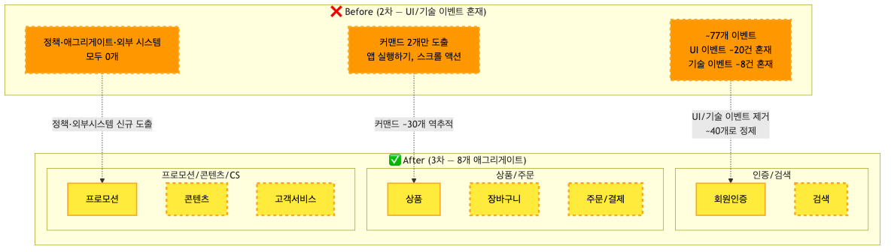

<details>
<summary>📊 원본 Mermaid 코드 보기</summary>

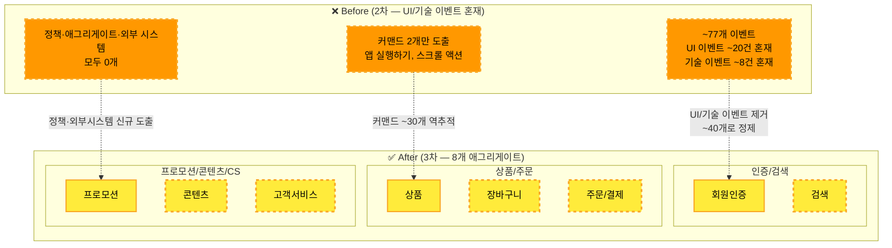

</details>

**애그리게이트 상세:**

| # | 🟨 애그리게이트 | 영역 | 관련 이벤트 | 관련 커맨드 |
|---|----------------|------|-----------|-----------|
| 1 | **회원인증** | ① | 로그인 성공/실패, 소셜 로그인 완료, 로그아웃, 회원 가입 | 로그인하기, 로그아웃하기, 회원가입하기 |
| 2 | **검색** | ② | 상품 검색 완료, 브랜드 검색, 자동완성, 검색 결과 정렬 | 상품 검색하기, 브랜드 검색하기, 검색 결과 정렬하기 |
| 3 | **상품** | ③ | 상품 상세 조회, 기획전 상품 조회, 대기열 생성, 조회 실패, 최근 본 상품 추가, 상품 문의 등록 | 상품 상세 보기, 기획전 보기, 대기열 진입하기, 상품 문의하기 |
| 4 | **장바구니** | ④ | 장바구니 담기, 수량 변경 | 장바구니에 담기, 수량 변경하기, 장바구니에서 제거하기 |
| 5 | **주문/결제** | ④ | 주문 요청, 결제 승인/실패, 주문 확정, 선물하기 신청, 배송 시작 | 주문하기, 결제하기, 선물하기 신청하기 |
| 6 | **프로모션** | ⑤ | 쿠폰 다운로드/적용, 찜 등록(상품/브랜드), 이벤트 응모, 프로모션 신청 | 쿠폰 다운받기, 쿠폰 적용하기, 찜하기, 이벤트 응모하기 |
| 7 | **콘텐츠** | ⑥ | 영상 시청, 라이브 참여, 라이브 채팅, 방송 혜택 참여 | 영상 재생하기, 라이브 입장하기, 채팅 전송하기 |
| 8 | **고객서비스** | ⑧ | 리뷰 작성, 교환/반품 요청, 1:1 문의, 전화 상담 신청 | 리뷰 작성하기, 교환/반품 요청하기, 1:1 문의하기, 전화 상담 신청하기 |

### 5.3 커맨드 도출 (~30개) — 이벤트로부터 역추적

> **역추적 규칙: 모든 비즈니스 이벤트에는 그것을 발생시킨 커맨드가 있다**

| # | 🟦 커맨드 | → | 🟧 이벤트 | 🟨 애그리게이트 |
|---|----------|---|----------|----------------|
| 1 | 로그인하기 | → | 로그인이 성공했다 / 실패했다 | 회원인증 |
| 2 | 소셜 로그인하기 | → | 소셜 로그인이 완료되었다 | 회원인증 |
| 3 | 로그아웃하기 | → | 로그아웃 되었다 | 회원인증 |
| 4 | 회원가입하기 | → | 회원 가입이 완료되었다 | 회원인증 |
| 5 | 상품 검색하기 | → | 상품이 검색되었다 | 검색 |
| 6 | 브랜드 검색하기 | → | 브랜드가 검색되었다 | 검색 |
| 7 | 검색어 입력하기 | → | 검색 자동완성이 표시되었다 | 검색 |
| 8 | 검색 결과 정렬하기 | → | 검색 결과가 정렬되었다 | 검색 |
| 9 | 상품 상세 보기 | → | 상품 상세가 조회되었다 | 상품 |
| 10 | 기획전 보기 | → | 기획전 상품이 조회되었다 | 상품 |
| 11 | 대기열 진입하기 | → | 대기열이 생성되었다 | 상품 |
| 12 | 상품 문의하기 | → | 상품 문의가 등록되었다 | 상품 |
| 13 | 장바구니에 담기 | → | 상품이 장바구니에 담겼다 | 장바구니 |
| 14 | 수량 변경하기 | → | 장바구니 수량이 변경되었다 | 장바구니 |
| 15 | 장바구니에서 제거하기 | → | 장바구니에서 상품이 제거되었다 | 장바구니 |
| 16 | 주문하기 | → | 주문이 요청되었다 | 주문/결제 |
| 17 | 결제하기 | → | 결제가 승인되었다 / 실패했다 | 주문/결제 |
| 18 | 선물하기 신청하기 | → | 선물하기가 신청되었다 | 주문/결제 |
| 19 | 쿠폰 다운받기 | → | 쿠폰이 다운로드되었다 | 프로모션 |
| 20 | 쿠폰 적용하기 | → | 쿠폰이 적용되었다 | 프로모션 |
| 21 | 상품 찜하기 | → | 상품이 찜되었다 | 프로모션 |
| 22 | 브랜드 찜하기 | → | 브랜드가 찜되었다 | 프로모션 |
| 23 | 이벤트 응모하기 | → | 이벤트에 응모되었다 | 프로모션 |
| 24 | 프로모션 신청하기 | → | 프로모션이 신청되었다 | 프로모션 |
| 25 | 영상 재생하기 | → | 영상이 시청되었다 | 콘텐츠 |
| 26 | 라이브 입장하기 | → | 라이브 방송에 참여했다 | 콘텐츠 |
| 27 | 채팅 전송하기 | → | 라이브 채팅이 전송되었다 | 콘텐츠 |
| 28 | 방송 알림 신청하기 | → | 방송 알림이 신청되었다 | 콘텐츠 |
| 29 | 리뷰 작성하기 | → | 리뷰가 작성되었다 | 고객서비스 |
| 30 | 교환/반품 요청하기 | → | 교환/반품이 요청되었다 | 고객서비스 |
| 31 | 1:1 문의하기 | → | 1:1 문의가 접수되었다 | 고객서비스 |
| 32 | 전화 상담 신청하기 | → | 전화 상담이 신청되었다 | 고객서비스 |

### 5.4 흐름 영역별 매핑

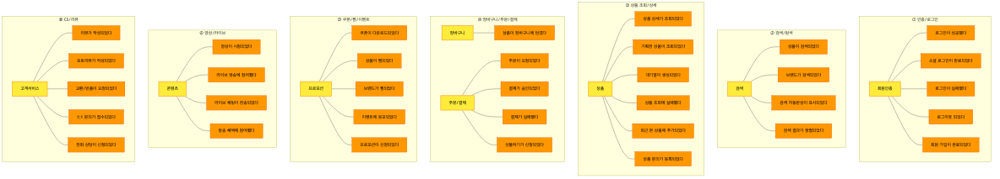

<details>
<summary>📊 원본 Mermaid 코드 보기</summary>

```mermaid
flowchart TB
    subgraph area1["① 인증/로그인"]
        AG1["회원인증"]:::aggregate
        E1["로그인이 성공했다"]:::event
        E2["소셜 로그인이 완료되었다"]:::event
        E3["로그인이 실패했다"]:::event
        E4["로그아웃 되었다"]:::event
        E5["회원 가입이 완료되었다"]:::event
        AG1 --- E1
        AG1 --- E2
        AG1 --- E3
        AG1 --- E4
        AG1 --- E5
    end

    subgraph area2["② 검색/탐색"]
        AG2["검색"]:::aggregate
        E6["상품이 검색되었다"]:::event
        E7["브랜드가 검색되었다"]:::event
        E8["검색 자동완성이 표시되었다"]:::event
        E9["검색 결과가 정렬되었다"]:::event
        AG2 --- E6
        AG2 --- E7
        AG2 --- E8
        AG2 --- E9
    end

    subgraph area3["③ 상품 조회/상세"]
        AG3["상품"]:::aggregate
        E10["상품 상세가 조회되었다"]:::event
        E11["기획전 상품이 조회되었다"]:::event
        E12["대기열이 생성되었다"]:::event
        E13["상품 조회에 실패했다"]:::event
        E14["최근 본 상품에 추가되었다"]:::event
        E15["상품 문의가 등록되었다"]:::event
        AG3 --- E10
        AG3 --- E11
        AG3 --- E12
        AG3 --- E13
        AG3 --- E14
        AG3 --- E15
    end

    subgraph area4["④ 장바구니/주문/결제"]
        AG4["장바구니"]:::aggregate
        AG5["주문/결제"]:::aggregate
        E16["상품이 장바구니에 담겼다"]:::event
        E17["주문이 요청되었다"]:::event
        E18["결제가 승인되었다"]:::event
        E19["결제가 실패했다"]:::event
        E20["선물하기가 신청되었다"]:::event
        AG4 --- E16
        AG5 --- E17
        AG5 --- E18
        AG5 --- E19
        AG5 --- E20
    end

    subgraph area5["⑤ 쿠폰/찜/이벤트"]
        AG6["프로모션"]:::aggregate
        E21["쿠폰이 다운로드되었다"]:::event
        E22["상품이 찜되었다"]:::event
        E23["브랜드가 찜되었다"]:::event
        E24["이벤트에 응모되었다"]:::event
        E25["프로모션이 신청되었다"]:::event
        AG6 --- E21
        AG6 --- E22
        AG6 --- E23
        AG6 --- E24
        AG6 --- E25
    end

    subgraph area6["⑥ 영상/라이브"]
        AG7["콘텐츠"]:::aggregate
        E26["영상이 시청되었다"]:::event
        E27["라이브 방송에 참여했다"]:::event
        E28["라이브 채팅이 전송되었다"]:::event
        E29["방송 혜택에 참여했다"]:::event
        AG7 --- E26
        AG7 --- E27
        AG7 --- E28
        AG7 --- E29
    end

    subgraph area8["⑧ CS/리뷰"]
        AG8["고객서비스"]:::aggregate
        E30["리뷰가 작성되었다"]:::event
        E31["포토리뷰가 작성되었다"]:::event
        E32["교환/반품이 요청되었다"]:::event
        E33["1:1 문의가 접수되었다"]:::event
        E34["전화 상담이 신청되었다"]:::event
        AG8 --- E30
        AG8 --- E31
        AG8 --- E32
        AG8 --- E33
        AG8 --- E34
    end

    classDef event fill:#FF9800,color:#000,stroke:#E65100
    classDef aggregate fill:#FFEB3B,color:#000,stroke:#F9A825,stroke-width:2px
```

</details>

### 5.5 퍼실리테이터 스크립트

> "이벤트 정제가 끝났습니다. 이제 이벤트들을 **'데이터 묶음'으로 그룹핑**합니다. 🟨 노란색 포스트잇을 사용합니다.
>
> 프론트엔드 개발자에게 친숙한 비유: **Redux Store의 slice 하나 = 하나의 애그리게이트**입니다.
> `cartSlice`에 담기·수량변경·삭제가 모두 같은 데이터를 바꾸듯이요.
>
> 총 8개 후보를 제안합니다: 회원인증, 검색, 상품, 장바구니, 주문/결제, 프로모션, 콘텐츠, 고객서비스.
> 영역별로 3~4분씩 진행하겠습니다.
>
> 동시에, 각 이벤트를 **역추적**해서 '그걸 발생시킨 커맨드'를 🟦 파란색으로 붙입니다.
> 예: '상품이 장바구니에 담겼다' ← '장바구니에 담기'"

---

## 6. Phase 3: 정책 구조화 (25분)

### 6.1 프론트엔드팀 3 레이어 체계 설명

> **정책(Policy) = "이벤트가 발생하면 자동으로 실행되는 비즈니스 규칙"**
>
> 프론트엔드팀의 정책은 **3 레이어**로 분류합니다:
>
> | 레이어 | 아이콘 | 기준 | 예시 |
> |--------|--------|------|------|
> | **💜 비즈니스 정책** | 💜 보라 | 순수 비즈니스 규칙. 프론트/백 무관 | "결제 완료 시 주문 자동 확정" |
> | **🩷 프론트 특화 정책** | 🩷 핑크 | 프론트엔드에서 관리하는 규칙 | "로그인 N회 실패 시 차단" |
> | **❌ 제외 대상** | — | UI/UX 규칙, A/B 테스트 | "스크롤 50% 시 추천 표시" |
>
> **핵심:** "이 규칙이 없으면 비즈니스가 중단되는가?" → Yes면 💜, No면 🩷 또는 ❌

### 6.2 핫스팟 식별 및 정책 전환

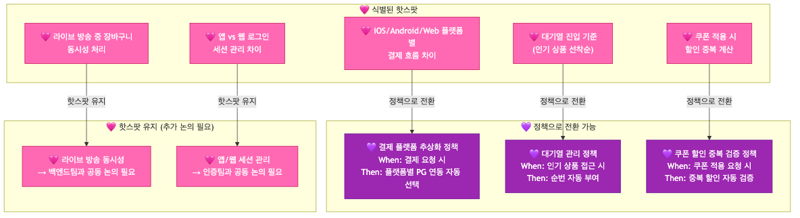

<details>
<summary>📊 원본 Mermaid 코드 보기</summary>

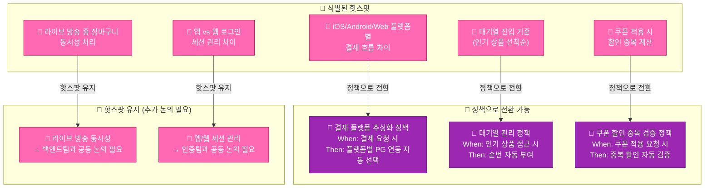

</details>

### 6.3 정책 후보 (~6개, When/Then)

| # | 💜 정책 | When (트리거) | Then (결과) |
|---|--------|-------------|-----------|
| 1 | **로그인 N회 실패 시 차단** | 로그인이 실패했다 (N회 누적) | 계정 로그인 자동 차단 |
| 2 | **재고 부족 시 구매 차단** | 장바구니 담기 요청 | 재고 검증 후 담기 거부 |
| 3 | **결제 완료 시 주문 확정** | 결제가 승인되었다 | 주문 상태 자동 확정 |
| 4 | **쿠폰 중복 사용 방지** | 쿠폰 적용 요청 | 동일 쿠폰 중복 여부 자동 검증 |
| 5 | **이벤트 기반 알림 발송** | 주문 확정 / 배송 시작 | 알림 자동 발송 (FCM/APNs) |
| 6 | **교환/반품 자동 접수** | 교환/반품이 요청되었다 | 접수 완료 + 회수 프로세스 시작 |


<details>
<summary>📊 원본 Mermaid 코드 보기</summary>

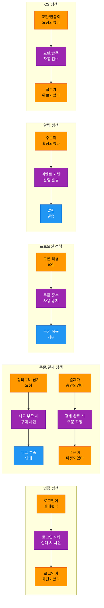

</details>

### 6.4 퍼실리테이터 스크립트

> "이제 **'자동으로 발생하는 비즈니스 규칙'**을 정의합니다. 💜 보라색 포스트잇을 사용합니다.
>
> 프론트엔드팀 3 레이어 체계를 기억해주세요:
> - 💜 **비즈니스 정책** — '결제 완료 시 주문 확정'처럼 비즈니스가 멈추는 규칙
> - 🩷 **핫스팟** — '플랫폼별 결제 흐름 차이'처럼 아직 정의가 안 된 문제
> - ❌ **제외** — 'A/B 테스트', '스크롤 50% 시 추천 표시'처럼 UI/UX 규칙
>
> 각 정책에 **When(언제) / Then(뭘 한다)**을 붙입니다.
> 예: **When** 결제가 승인되었다 / **Then** 주문 상태가 자동으로 확정된다
>
> 6개 후보를 15분 안에 정리하겠습니다."

---

## 7. Phase 4: 읽기 모델 도출 (25분)

### 7.1 프론트엔드팀 눈높이 설명 ("화면이 곧 읽기 모델")

> **읽기 모델 = "사용자가 보는 화면의 데이터 구조"**
>
> 프론트엔드 개발자에게 이것은 **가장 직관적인 개념**입니다:
>
> - **화면 하나 = 읽기 모델 하나** (또는 여러 개)
> - 상품 검색 결과 화면 → 📖 검색 결과 뷰
> - 장바구니 화면 → 📖 장바구니 목록 뷰
> - 마이페이지 주문 내역 → 📖 주문 내역 뷰
>
> **핵심 질문:** "이 화면의 데이터는 어떤 이벤트가 발생했을 때 갱신되는가?"
> 주문 내역 뷰는 "주문이 확정되었다", "배송이 시작되었다" 이벤트가 발생할 때 갱신됩니다.

### 7.2 읽기 모델 후보 (~8개)

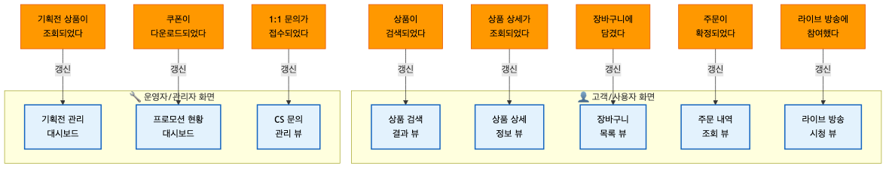

<details>
<summary>📊 원본 Mermaid 코드 보기</summary>

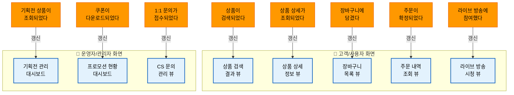

</details>

**읽기 모델 상세:**

| # | 📖 읽기 모델 | 대상 사용자 | 구성 데이터 | 갱신 트리거 |
|---|-------------|-----------|-----------|-----------|
| 1 | **상품 검색 결과 뷰** | 👤 고객 | 검색 결과 목록, 필터 옵션, 정렬 기준, 추천 상품 | 상품 검색 완료, 검색 결과 정렬 |
| 2 | **상품 상세 정보 뷰** | 👤 고객 | 상품 정보, 가격, 재고, 리뷰 수, 평점, 배송 정보 | 상품 상세 조회, 리뷰 작성 |
| 3 | **장바구니 목록 뷰** | 👤 고객 | 장바구니 아이템, 수량, 합계, 적용 쿠폰, 배송비 | 장바구니 담기, 수량 변경 |
| 4 | **주문 내역 조회 뷰** | 👤 고객 | 주문 목록, 상태(결제/배송/완료), 배송 추적 | 주문 확정, 배송 시작 |
| 5 | **라이브 방송 시청 뷰** | 👤 고객 | 방송 화면, 실시간 채팅, 상품 목록, 혜택 정보 | 라이브 참여, 채팅 전송 |
| 6 | **기획전 관리 대시보드** | 🔧 운영자 | 기획전 목록, 참여 상품 수, 조회 수, 전환율 | 기획전 상품 조회 |
| 7 | **프로모션 현황 대시보드** | 🔧 운영자 | 쿠폰 다운로드 수, 이벤트 응모 현황, 찜 통계 | 쿠폰 다운로드, 이벤트 응모 |
| 8 | **CS 문의 관리 뷰** | 🔧 운영자 | 문의 목록, 답변 상태, 교환/반품 처리 현황 | 1:1 문의 접수, 교환/반품 요청 |

### 7.3 읽기모델-이벤트 연결 맵

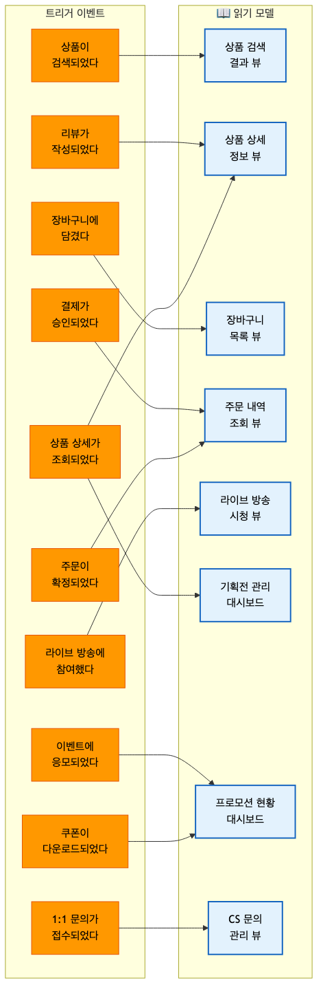

<details>
<summary>📊 원본 Mermaid 코드 보기</summary>

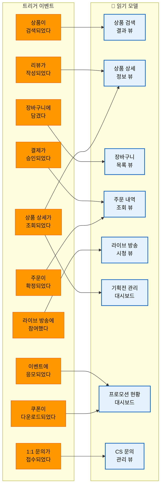

</details>

### 7.4 퍼실리테이터 스크립트

> "마지막으로, '사용자가 보는 화면'을 정리합니다. 📖 하늘색 포스트잇을 사용합니다.
>
> 프론트엔드 개발자에게 이것은 가장 익숙한 개념입니다. **화면 하나 = 읽기 모델 하나**죠.
>
> **👤 고객이 보는 화면** 5개:
> 검색 결과, 상품 상세, 장바구니, 주문 내역, 라이브 시청
>
> **🔧 운영자가 보는 화면** 3개:
> 기획전 관리, 프로모션 현황, CS 문의 관리
>
> 각 읽기 모델에 '어떤 이벤트가 발생했을 때 이 화면이 갱신되는지' 화살표를 연결합니다.
> 총 8개를 10분 안에 정리하겠습니다."

---

## 8. 전체 통합 및 정리

### 8.1 전체 통합 흐름


<details>
<summary>📊 원본 Mermaid 코드 보기</summary>

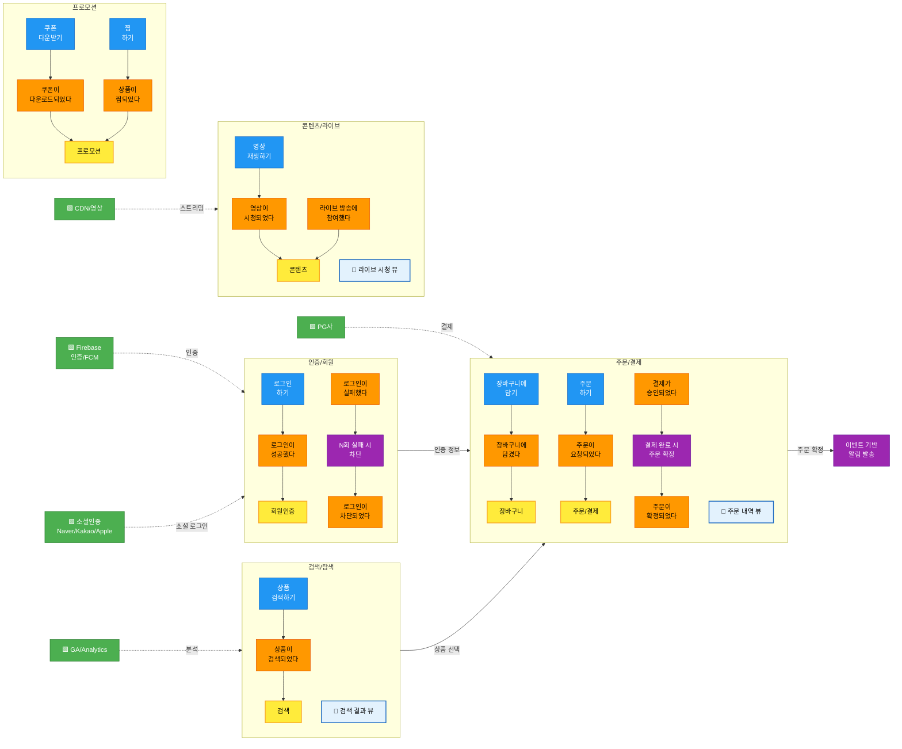

</details>

### 8.2 바운디드 컨텍스트 후보 프리뷰 (~5개)

| # | BC 후보 | 영역 | 애그리게이트 | 독립 배포 | 독립 DB | 판정 |
|---|--------|------|-----------|---------|--------|------|
| 1 | **인증/회원** | ① | 회원인증 | ✅ | ✅ | ✅ 확정 |
| 2 | **검색/탐색** | ② | 검색 | ✅ | ✅ | ✅ 확정 |
| 3 | **주문/결제** | ③④ | 상품, 장바구니, 주문/결제 | ✅ | ✅ | ✅ 확정 |
| 4 | **프로모션** | ⑤ | 프로모션 | ✅ | ✅ | ✅ 확정 |
| 5 | **콘텐츠/라이브** | ⑥⑦ | 콘텐츠 | ✅ | ✅ | ⚠️ 알림 통합 검토 |

> **참고:** 고객서비스(⑧)는 규모에 따라 별도 BC 또는 주문/결제 BC에 통합 가능 — 4차 워크샵에서 확정

### 8.3 외부 시스템 식별 (~5개)

| # | 🟩 외부 시스템 | 연동 대상 BC | 연동 내용 |
|---|--------------|-----------|----------|
| 1 | **Firebase** (인증/RemoteConfig/FCM) | 인증/회원, 알림 | 인증 토큰, 원격 설정, 푸시 알림 |
| 2 | **GA/Analytics** | 검색/탐색 | 사용자 행동 분석, 전환 추적 |
| 3 | **PG사** (결제 게이트웨이) | 주문/결제 | 결제 승인/취소/환불 |
| 4 | **소셜 인증** (Naver/Kakao/Apple) | 인증/회원 | 소셜 로그인, OAuth 토큰 |
| 5 | **CDN/영상 서버** | 콘텐츠/라이브 | 영상 스트리밍, 라이브 방송 인프라 |

### 8.4 다음 단계 안내 + 성과 체크리스트

### 성과 체크리스트

- [ ] 이벤트 대폭 정제: ~77개 → ~40개 (UI/기술/라벨 제거)
- [ ] 커맨드 도출: 2개 → ~30개 (역추적)
- [ ] 애그리게이트: ~8개 후보 확정
- [ ] 정책: ~6개 후보 도출 (When/Then)
- [ ] 핫스팟: ~5개 식별
- [ ] 읽기 모델: ~8개 후보 도출
- [ ] 외부 시스템: ~5개 식별
- [ ] 바운디드 컨텍스트 ~5개 프리뷰 완료

**4차 워크샵에서 확정할 사항:**

1. BC 경계선 최종 확정 — 5개 BC 유지 or 고객서비스 통합
2. 컨텍스트 맵 확정 — 특히 PG 연동, 소셜 인증 패턴
3. 외부 시스템 5개 ACL 설계 방향
4. 팀 매핑 — 각 BC를 어느 팀이 담당할지
5. MSA 전환 우선순위 — 주문/결제 BC 분리 전략 논의

---

## 9. 퍼실리테이터 비상 대응 카드 (프론트엔드 특화 7가지)

| # | 난항 상황 | 대응 방법 |
|---|----------|----------|
| 1 | **"검색 버튼 클릭도 이벤트 아닌가요?"** — UI 이벤트 vs 비즈니스 이벤트 혼란 | **"서버에 상태 변경을 알려야 하는가?"가 기준입니다.** 버튼 클릭은 UI 이벤트이고, 클릭의 결과로 '상품이 검색되었다'가 비즈니스 이벤트입니다. 버튼 클릭 → API 호출 → 서버 상태 변경 → 비즈니스 이벤트. 앞의 두 단계는 프론트 구현 상세입니다. |
| 2 | **"iOS와 Android에서 다른 이벤트가 되나요?"** — 플랫폼별 이벤트 분리 논쟁 | **"비즈니스 관점에서는 하나입니다."** iOS의 Face ID든 Android의 지문인증이든 비즈니스 이벤트는 '로그인이 성공했다'입니다. 인증 방식은 **속성(attribute)**으로 기록합니다. 플랫폼 차이는 프론트 구현 레이어에서 처리합니다. 단, 플랫폼에 따라 **비즈니스 흐름 자체가 달라지는 경우**(예: 앱 전용 QR 스캔 결제)는 분리합니다. **"지금 떠오르는 것 중에, 플랫폼에 따라 비즈니스 흐름이 완전히 달라지는 케이스가 있나요?"**라고 질문을 던져 팀이 직접 식별하도록 유도합니다. |
| 3 | **"GA 이벤트 전송도 중요한 이벤트인데요?"** — 기술 이벤트 제거 저항 | **"GA 이벤트는 '관찰'이지 '비즈니스 흐름'이 아닙니다."** GA/Firebase Analytics는 🟩 외부 시스템으로 분류합니다. 비즈니스 이벤트가 발생한 후 GA에 기록하는 것이지, GA 기록 자체가 비즈니스 프로세스를 진행시키지 않습니다. 즉, `🟧 상품이 검색되었다 → 🟩 GA(관찰/수신)` 형태로, 기존 비즈니스 이벤트의 **downstream**으로만 표기합니다. |
| 4 | **"A/B 테스트 로직은 정책 아닌가요?"** — 정책 범위 혼란 | **"A/B 테스트는 UI/UX 최적화이지 비즈니스 규칙이 아닙니다."** 💜 정책은 '이것이 없으면 비즈니스가 중단되는' 규칙입니다. A/B 테스트가 없어도 주문은 됩니다. 이것은 ❌ 제외 대상입니다. |
| 5 | **"라이브 방송 중 장바구니 동시성은 어떻게 하나요?"** — 기술 구현 논의 진입 | 🩷 핫스팟 포스트잇을 붙이고 넘어감. **"동시성 처리는 구현 단계의 기술 결정입니다."** 지금은 '라이브 방송 중 장바구니 담기'가 비즈니스 이벤트인지만 확인합니다. 동시성은 백엔드팀과 공동 논의가 필요하므로 4차 전 사전 미팅을 잡읍시다. |
| 6 | **"플랫폼별 인증 프로세스를 상세하게 그려야 하지 않나요?"** — 플랫폼별 상세 표현 요구 | **"비즈니스 결과가 같으면 하나입니다."** Face ID, 지문인증, ID/PW 모두 비즈니스 이벤트는 '로그인이 성공했다'입니다. 인증 방식은 이벤트의 **속성(attribute)**으로 기록합니다. 이벤트 스토밍은 비즈니스 흐름을 다루는 것이지 구현 상세를 다루는 것이 아닙니다. |
| 7 | **"앱 실행 프로세스를 상세하게 표현해야 하지 않나요?"** — 앱 초기화 과정 상세화 요구 | **"앱 실행 시 내부적으로 많은 일이 일어나지만, 그건 기술 초기화 과정입니다."** App Info 요청, Firebase Patch, 보안 API 접근, 모듈 리스트 요청 등은 모두 서버 상태를 변경하지 않는 기술 구현 상세입니다. 이벤트 스토밍에서 관심 있는 건 '앱이 실행된 후 어떤 비즈니스가 시작되는가'입니다. **'앱이 실행되었다' 하나면 충분하고**, 이후 자동 로그인(💜 정책)이나 캠페인 쿠폰 발급(💜 정책) 같은 비즈니스 흐름으로 연결합니다. |

### 시간 조절 가이드

| 상황 | 조치 |
|------|------|
| Phase 1(정제)이 25분 이내 완료 | Phase 2(애그리게이트)에 남은 시간 배분 |
| Phase 1에서 UI 이벤트 제거 논쟁 | "서버에 알려야 하는가? 3초 내 판단 안 되면 🩷 핫스팟" |
| Phase 2(애그리게이트)에서 상품/주문 영역이 20분 초과 | 프로모션/콘텐츠는 퍼실리테이터 제안으로 빠르게 처리 |
| Phase 3+4가 시간 부족 | 정책은 핵심 3개(로그인 차단, 주문 확정, 쿠폰 중복)만, 읽기모델은 고객 5개만 집중 |
| 전체적으로 15분 이상 초과 | 마무리(8장)를 5분으로 단축, 외부 시스템 논의는 4차로 이월 |

---

## 10. 결과물 템플릿

### 3차 워크샵 결과 정리 양식

```
# 프론트개발팀 이벤트 스토밍 3차 워크샵 결과

## 일시: 2026년 _월 _일 (_) 14:00 ~ 17:00
## 참석자:

---

## 1. 이벤트 정제 결과
- 정제 전: ~77개
- 정제 후: __개
- UI 이벤트 제거: __건, 기술 이벤트 제거: __건
- 데이터 라벨 제거: __건, 명명 정규화: __건, 중복 제거: __건

## 2. 커맨드 도출 결과
- 도출 전: 2개 (앱 실행하기, 스크롤 액션 → 둘 다 제거)
- 도출 후: __개

## 3. 영역별 이벤트 정제 결과
| # | 영역 | 정제 전 | 정제 후 | 이벤트 목록 |
|---|------|--------|--------|-----------|

## 4. 애그리게이트 (확정 __개)
| # | 애그리게이트 | 영역 | 포함 이벤트 | 관련 커맨드 |
|---|-------------|------|-----------|-----------|

## 5. 정책 (확정 __개, When/Then 구조화)
| # | 정책 | When (트리거) | Then (결과) | 레이어 (💜/🩷) |
|---|------|-------------|-----------|--------------|

## 6. 읽기 모델 (확정 __개)
| # | 읽기 모델 | 대상 사용자 | 구성 데이터 | 갱신 트리거 |
|---|----------|-----------|-----------|-----------|

## 7. 외부 시스템 (확정 __개)
| # | 외부 시스템 | 연동 대상 | 연동 내용 |
|---|-----------|----------|----------|

## 8. 바운디드 컨텍스트 프리뷰
| # | BC 후보 | 영역 | 애그리게이트 | 판정 | 비고 |
|---|--------|------|-----------|------|------|

## 9. 핫스팟 / 미결 사항
| # | 내용 | 관련 영역 | 담당 | 기한 |
|---|------|---------|------|------|

## 10. 다음 단계
- [ ] 결과 draw.io 정리 및 공유
- [ ] 4차 워크샵 일정 확정 (BC 확정 + 컨텍스트 맵)
- [ ] 라이브 방송 동시성 사전 미팅 (백엔드팀)
- [ ] 앱/웹 세션 관리 사전 미팅 (인증팀)
- [ ] 핫스팟 사항 사전 논의
```
