# 플랫폼 개발팀 이벤트 스토밍 3차 워크샵 검토 및 보완 사항

## 1. 개요

### 1.1 이 문서의 목적

```
┌─────────────────────────────────────────────────────────────┐
│              이 문서의 3가지 목적                              │
├─────────────────────────────────────────────────────────────┤
│                                                             │
│  ✅ 3차 워크샵 수행 결과를 준비 문서 대비 분석              │
│  ✅ draw.io 결과물의 색상 오분류 정리 및 교정안 도출        │
│  ✅ 4차 워크샵 방향 및 타임라인 설정                        │
│                                                             │
└─────────────────────────────────────────────────────────────┘
```

### 1.2 워크샵 기본 정보

| 항목 | 내용 |
|------|------|
| 일시 | 2026년 3월 (3차 워크샵) |
| 참석자 | 플랫폼개발팀 |
| 수행 범위 | 3개 도메인 — 정산(CJ ONE/적립금/수수료/광고비), 협력사(입점/계약/주문배송/정산/정보관리), 회원(가입/로그인/CS/멤버십/정보수정/탈퇴/포인트) |
| 산출물 | draw.io 보드 (포스트잇 ~156개) |
| 수행 방식 특이점 | 준비 문서의 Phase 구조(이벤트 정제→애그리게이트→정책→읽기모델)를 따르지 않고, **3개 도메인 전체를 이벤트·커맨드·정책 수준에서 대폭 확장**하는 방식으로 진행. 2차 대비 이벤트·커맨드가 2배 이상 증가했으나 정제·구조화는 미수행 |

### 1.3 참조 문서

| 참조 문서 | 활용 시점 |
|----------|----------|
| [이벤트스토밍_플랫폼개발팀_3차워크샵준비.md](./이벤트스토밍_플랫폼개발팀_3차워크샵준비.md) | 목표 수치, Phase 구조 — 달성도 비교 기준 |
| [이벤트스토밍_시각화_가이드.md](./이벤트스토밍_시각화_가이드.md) | 포스트잇 색상·배치 패턴 |
| [이벤트스토밍_퀵레퍼런스.md](./이벤트스토밍_퀵레퍼런스.md) | 용어집, 흔한 실수, 빠른 참조 |

---

## 2. 수행 결과 요약

### 2.1 실제 수행 범위 및 방식

3차 워크샵에서 실제로 수행된 활동:

1. **정산 도메인 대폭 확장** — CJ ONE/적립금/지원금 포인트 흐름 + 수수료/정산 확정/SAP 전송 + 광고비 크레딧 차감 전체 상세화
2. **협력사 도메인 신규 확장** — 입점신청→계약→주문/배송 조회→정산→정보관리 전 영역 도출
3. **회원 도메인 신규 추가** — 가입·로그인·CS(문의/공지/FAQ)·멤버십·정보수정·탈퇴·배송지·포인트 전 영역 도출

**수행 방식 특이점:**
- 준비 문서의 4개 Phase(이벤트 정제 → 애그리게이트 확정 → 정책 구조화 → 읽기모델) 구조를 따르지 않음
- 1~2차에서 도출된 ~33개 이벤트를 정제하는 대신, **3개 도메인 전체를 처음부터 상세 도출**
- 결과적으로 이벤트·커맨드가 각각 2배 이상 증가 (이벤트 33→~74, 커맨드 22→~58)
- 정책도 13→~24개로 구체화되었으나 When/Then 구조화는 미수행

### 2.2 draw.io 분석 결과 (도메인별 요소)

**정산 도메인 (CJ ONE/적립금/지원금 + 수수료/정산 + 광고비):**

| 유형 | 수량 | 주요 항목 |
|------|------|----------|
| 이벤트 🟧 | ~17개 | CJ ONE 포인트 지급/사용, 적립금 지급/사용, 지원금 지급, 일마감 집계, 회수 확정, 고객인수, 배송비 발생, CPA 매출 발생, 협력사 승인 요청, 정산 확정, SAP 전송, 광고비 크레딧 차감 등 |
| 커맨드 🟦 | ~17개 | CJ ONE 포인트 지급/사용, 포인트 다운로드, 적립금 지급/다운로드/사용, 지원금 지급/사용, 주문데이터 인입, 배치 스케줄링, 매출 확정, 지급금액 확정, 정산데이터 조회, 매출에 따른 광고비 발생, 정산수수료 최종 결정 등 |
| 정책 💜 | ~11개 | 10원 이상 사용가능(잔액 1,000원 이상), 등급별 CJ ONE 포인트, 같은날 같은오더 지급불가, 유효기간 최대 2년, 주문 고객인수 필요, 직/간접 수수료 계산, 고객인수 회수 집계, 광고 계좌 협력사, 광고비 취합상태, 휴·폐업 여부 확인 등 |
| 외부 시스템 🟩 | ~11개 | CJ ONE 전문 시스템(x2), 상품 시스템, 카카오API/메일서버, SAP(x2), 광고센터, 몰로코 API, 볼타 API, e-accounting, 유튜브 GCP, 대형제휴 매체 API, OK캐쉬백/아시아나/애드럭 |
| 핫스팟 🩷 | ~3개 | 수수료 정책 관리 Admin R&R, 주문 상태 값 직접 확인, 포인트 지급 요청 데이터(리뷰) |
| 액터 👤 | ~8개 | 고객(x3), 상담사(x2), 주문시스템(x2), 프로모션시스템, 현업담당자(x3), 온트러스트담당자, 일마감 집계 배치, 프로모션 배리 시스템 |

**협력사 도메인 (입점/계약/주문배송/정산/정보관리):**

| 유형 | 수량 | 주요 항목 |
|------|------|----------|
| 이벤트 🟧 | ~37개 | 사업자번호 체크, 사업자등록증 이미지, 입점신청 완료, 신규 협력사 입점, 협력사 정보, 로그인 정보, 파트너 로그인 완료, 전자계약 발송/조회/서명 정보, 주문 데이터, 배송 데이터, 출하지시 정보, 정액수수료/광고항목/광고계약서/인터넷광고비 정보, 실적 및 공제 데이터, 수기매출정보, 담당자 정보, B2B 브랜드사 정보, 이메일 발송 정보 등 **(데이터 라벨 다수 혼재)** |
| 커맨드 🟦 | ~26개 | 입점신청, 입점신청 정보 입력/수정, 사업자등록증 확인/저장, 입점 승인, 협력사 정보 등록, 파트너 로그인, 계약서 서식 등록, 전자계약 조회/서명/발송, 계약 완료, 협력사 주문/배송/정산/정보 조회, 출하지시 요청, 광고항목 등록, 광고계약서 등록/상신/승인, 입금표 출력, 수기매출 입력/저장, 협력사 정보 수정, 협력사 담당자 추가/수정, 브랜드코드 등록, B2B 브랜드사 정보 입력, 이메일 추출 발송 등 |
| 정책 💜 | ~5개 | 입점 신청 데이터 검증, 고객 점유 인증, 전자 계약 정보 검증, 계좌 정보 일치 확인, 담당자 업적정보 확인 |
| 핫스팟 🩷 | ~8개 | 사업자등록증 계좌인증 CFS, SMS 발송, SAP(x3), SAP 데이터 가져오기, 출하지시 API, OZ Report, 계좌인증 |
| 액터 👤 | ~1개 | 협력사 |

**회원 도메인 (가입/로그인/CS/멤버십/정보수정/탈퇴/포인트):**

| 유형 | 수량 | 주요 항목 |
|------|------|----------|
| 이벤트 🟧 | ~20개 | 회원 가입 완료, 로그인 되었다, 1:1 문의 등록, 1:1 답변 등록, 공지사항 등록/합의/노출, 이용약관 변경, FAQ 변경, 등급 부여, 멤버십 혜택 다운로드, 멤버십 사용 완료, 회원 정보 수정, 회원 탈퇴 요청, 탈퇴 요청 철회, 배송지 등록/수정, 포인트 만료 예정 안내, 포인트 사용, 포인트 만료, 포인트 적립 |
| 커맨드 🟦 | ~15개 | 회원가입, 로그인, 1:1 문의하기, CFS 문의 이미지 저장, 문의 답변 등록, 공지사항 등록, 합의하기, 이용약관 등록, FAQ 등록, 멤버십 등급 부여, 멤버십 다운로드, 멤버십 사용, 회원 정보 수정, 회원 탈퇴, 배송지 관리 |
| 정책 💜 | ~8개 | PW 정책, ID 중복체크, 로그인 다수 실패시 차단, 중복 다운로드 불가, 직접 방문만 가능, 휴대폰 번호 수정시 본인인증, 진행 중인 주문 있으면 불가, 주문 서비스와 동일한 데이터 사용 |
| 핫스팟/외부 🩷 | ~13개 | 본인인증(KCB), CJ ONE 검증, Naver 인증(x2), Kakao 인증(x2), Apple 인증(x2), KMS Key 검증, FDS, SMS 서버, 주소 검색 서비스, CJ ONE API(x2), 프로모션 쿠폰 서비스 |
| 액터 👤 | ~11개 | 고객(x4), 상담사(x2), 업무담당자(x3), 배치시스템 |

### 2.3 현황 요약 다이어그램

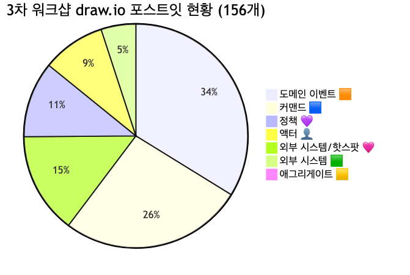

<details>
<summary>📊 원본 Mermaid 코드 보기</summary>

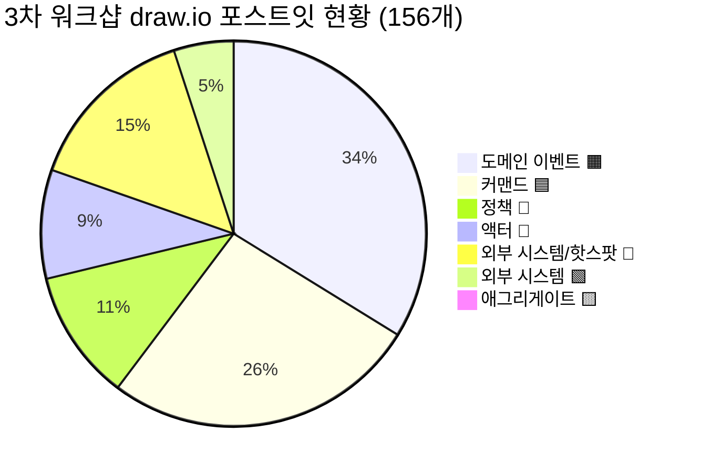

</details>

**주요 문제점:**
- **이벤트 ~74개 중 데이터 라벨 ~22건** — "정보", "데이터" 패턴으로 끝나는 항목이 이벤트로 분류됨 (예: "협력사 정보", "주문 데이터", "배송 데이터")
- **핑크(🩷) ~24건에 외부 시스템과 핫스팟 혼재** — 본인인증(KCB), Naver/Kakao/Apple 인증, CJ ONE API, SAP 등은 🟩 외부 시스템
- **액터(👤) ~20건 중 시스템명 혼재** — 온트러스트, 프로모션 시스템, 일마감 집계 배치 등은 🟩 외부 시스템
- **시제 불일치 지속** — "정산 확정을 한다"(현재형) vs "회원 가입이 완료되었다"(과거형)
- **애그리게이트·읽기모델·BC 전혀 미수행** — 이벤트·커맨드 확장에 시간 소요

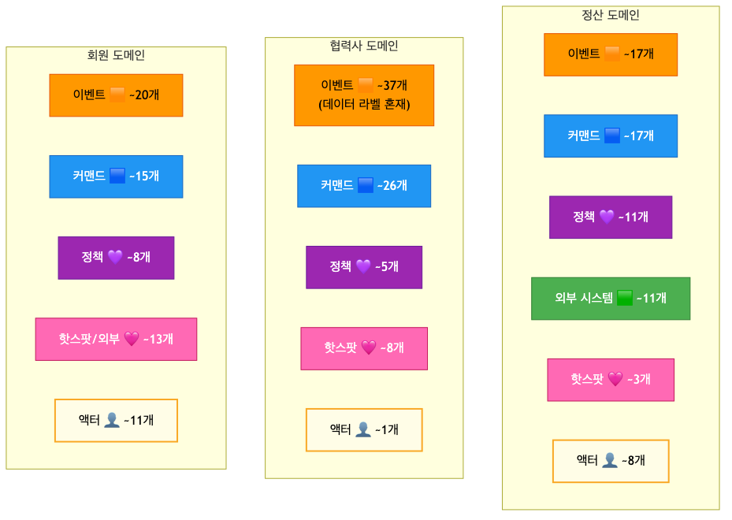

<details>
<summary>📊 원본 Mermaid 코드 보기</summary>

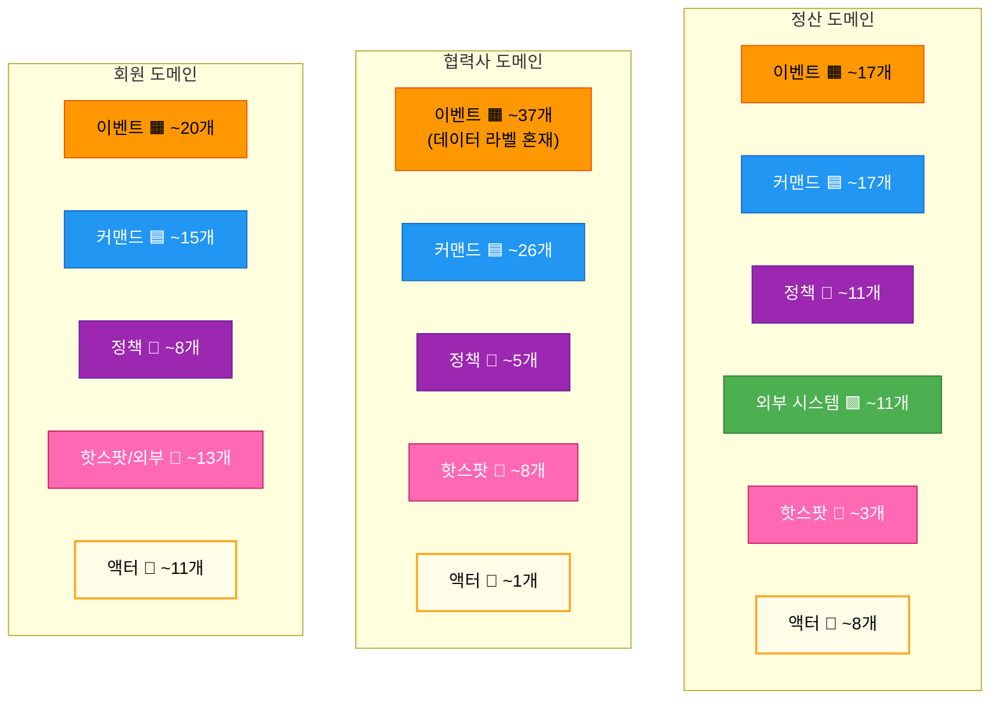

</details>

---

## 3. 준비 문서 대비 달성도

### 3.1 목표 달성 비교표

| 항목 | 3차 준비 문서 목표 | 실제 수행 결과 | 달성 |
|------|-------------------|---------------|------|
| 이벤트 대폭 정제 | ~33개 → ~25개 (라벨·시스템명 분리) | 정제 대신 대폭 확장 (~74개, 데이터 라벨 혼재) | ⬜ |
| 정책 구조화 | 13개 → ~8개 (When/Then 정의) | ~24개로 확장, When/Then 미적용 | ⬜ 부분 |
| 애그리게이트 식별 | ~11개 후보 확정 (3개 도메인별) | **미수행** | ⬜ |
| 읽기 모델 도출 | ~8개 후보 도출 | **미수행** | ⬜ |
| BC 프리뷰 | ~4개 BC 후보 검증 | **미수행** | ⬜ |
| 핫스팟 식별/전환 | 정책 전환 + 추가 식별 | 핫스팟 추가 도출됨, 정책 전환 미수행 | ⬜ 부분 |

**분석:** 3차 워크샵은 준비 문서의 Phase 구조를 따르지 않고, **3개 도메인 전체의 이벤트·커맨드를 대폭 확장**하는 방식으로 진행되었습니다. 특히 협력사 도메인(입점→계약→주문/배송→정산→정보관리)과 회원 도메인(가입→탈퇴)이 새로 상세화된 것은 큰 성과이나, 정제·구조화·상위 레벨 식별(애그리게이트·읽기모델·BC)은 전혀 수행되지 않았습니다.

### 3.2 Phase별 수행 현황

| Phase | 준비 문서 계획 | 계획 소요 | 실제 수행 | 비고 |
|-------|--------------|----------|----------|------|
| 오프닝 | 1~2차 리뷰 & 3차 목표 안내 | 15분 | ✅ 수행 | |
| Phase 1 | 이벤트 대폭 정제 (~33개 → ~25개) | 30분 | ⬜ 미수행 | 정제 대신 3개 도메인 확장 도출 |
| Phase 2 | 애그리게이트 식별 (~11개) | 35분 | ⬜ 미수행 | |
| Phase 3 | 정책 구조화 (When/Then) | 25분 | ⬜ 부분 수행 | 정책 24개 도출했으나 구조화 미완 |
| Phase 4 | 읽기 모델 도출 (~8개) | 25분 | ⬜ 미수행 | |
| 마무리 | 전체 통합 & BC 프리뷰 | 20분 | ⬜ 미수행 | |

### 3.3 6개 흐름 영역 커버리지

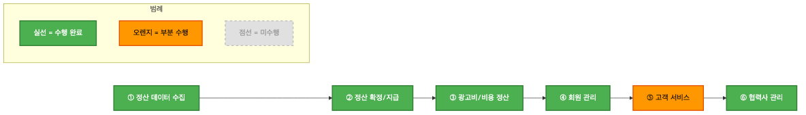

<details>
<summary>📊 원본 Mermaid 코드 보기</summary>

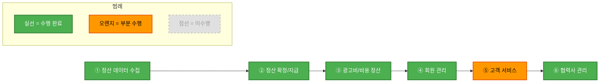

</details>

| 영역 | 상태 | 도출 요소 |
|------|------|----------|
| ① 정산 데이터 수집 | ✅ 수행 | 주문데이터 인입, 배치 스케줄링, 일마감 집계, 수수료 계산, 회수 확정, 고객인수 등 |
| ② 정산 확정/지급 | ✅ 수행 | 매출 확정, 협력사 승인 요청, 정산요청 알림, 정산 확정, 지급금액 확정, SAP 전송 등 |
| ③ 광고비/비용 정산 | ✅ 수행 | CPA 광고비 발생, 크레딧 차감, 정산수수료 최종 결정, 휴·폐업 확인 등 |
| ④ 회원 관리 | ✅ 수행 | 가입, 로그인, 정보수정, 탈퇴, 배송지 관리, 포인트 관련 전 영역 |
| ⑤ 고객 서비스 | 🟧 부분 | 1:1 문의/답변, 공지사항, FAQ, 이용약관 도출. 멤버십은 별도 영역으로 분리됨 |
| ⑥ 협력사 관리 | ✅ 수행 | 입점신청→계약→주문/배송→정산→정보관리 전체 흐름 상세화 |

---

## 4. draw.io 색상 오분류 정리

### 4.1 오분류 현황 요약

오분류는 크게 4가지 유형으로 분류됩니다:

1. **핑크(🩷) → 외부 시스템(🟩):** ~15건 — 본인인증(KCB), Naver/Kakao/Apple 인증, CJ ONE API, KMS, FDS, SMS 서버, 주소 검색, 사업자등록증 CFS, 출하지시 API, OZ Report, 계좌인증, 프로모션 쿠폰, SAP(x3), SAP 데이터 가져오기
2. **오렌지(🟧) → 데이터 라벨(📝):** ~22건 — "정보", "데이터" 패턴 (협력사 정보, 주문 데이터, 배송 데이터, 담당자 정보, 전자계약 조회 정보 등)
3. **금색(👤) → 외부 시스템(🟩):** ~5건 — 온트러스트, 프로모션 시스템, 프로모션 배리 시스템, 일마감 집계 배치, 주문 시스템(일부)
4. **시제 불일치:** ~5건 — "정산 확정을 한다", "협력사 승인 요청을 한다" 등 현재형

### 4.2 오분류 상세 및 교정안

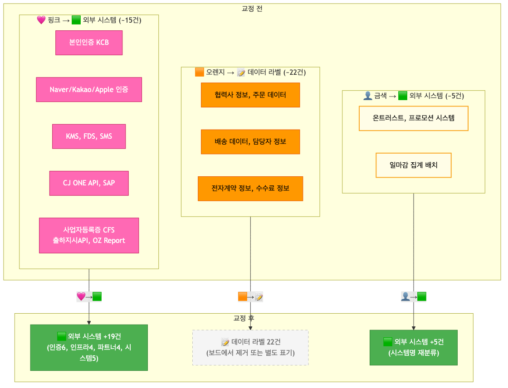

<details>
<summary>📊 원본 Mermaid 코드 보기</summary>

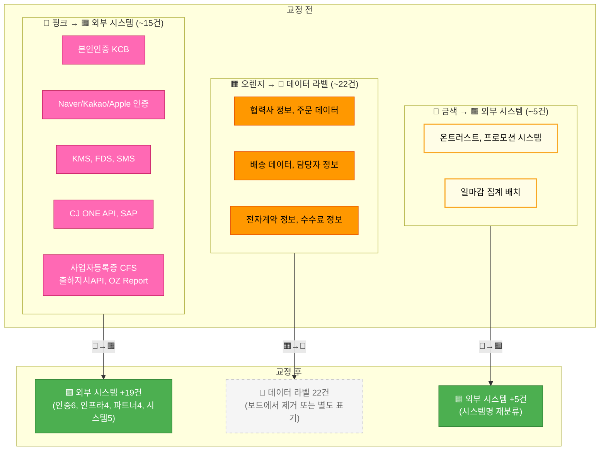

</details>

**유형 1: 핑크(🩷) → 외부 시스템(🟩) — ~15건**

| # | 요소명 | 현재 분류 | 교정 분류 | 사유 |
|---|--------|----------|----------|------|
| 1 | 본인인증 (KCB) | 🩷 핫스팟 | 🟩 외부 시스템 | KCB는 외부 본인인증 서비스 |
| 2 | CJ ONE 검증 | 🩷 핫스팟 | 🟩 외부 시스템 | CJ ONE 회원 검증 API |
| 3 | Naver 인증 (x2) | 🩷 핫스팟 | 🟩 외부 시스템 | 네이버 소셜 로그인 API |
| 4 | Kakao 인증 (x2) | 🩷 핫스팟 | 🟩 외부 시스템 | 카카오 소셜 로그인 API |
| 5 | Apple 인증 (x2) | 🩷 핫스팟 | 🟩 외부 시스템 | Apple 소셜 로그인 API |
| 6 | KMS Key 검증 사용 | 🩷 핫스팟 | 🟩 외부 시스템 | 암호화 키 관리 서비스 |
| 7 | FDS | 🩷 핫스팟 | 🟩 외부 시스템 | 부정거래 탐지 서비스 |
| 8 | SMS 서버/발송 (x2) | 🩷 핫스팟 | 🟩 외부 시스템 | SMS 발송 인프라 |
| 9 | 주소 검색 서비스 | 🩷 핫스팟 | 🟩 외부 시스템 | 주소 검색 API |
| 10 | CJ ONE API (x2) | 🩷 핫스팟 | 🟩 외부 시스템 | CJ ONE 연동 API |
| 11 | 프로모션 쿠폰 서비스 | 🩷 핫스팟 | 🟩 외부 시스템 | 프로모션/쿠폰 서비스 |
| 12 | 사업자등록증 계좌인증 CFS | 🩷 핫스팟 | 🟩 외부 시스템 | 사업자등록증 이미지 저장 서비스 |
| 13 | 출하지시 API | 🩷 핫스팟 | 🟩 외부 시스템 | 출하 지시 연동 API |
| 14 | OZ Report | 🩷 핫스팟 | 🟩 외부 시스템 | 리포트 출력 서비스 |
| 15 | 계좌인증 | 🩷 핫스팟 | 🟩 외부 시스템 | 계좌 실명 인증 서비스 |
| 16 | SAP (x3) | 🩷 핫스팟 | 🟩 외부 시스템 | 정산 ERP 시스템 (정산 도메인의 🟩 SAP과 중복) |
| 17 | SAP 데이터 가져오기 | 🩷 핫스팟 | 🟦 커맨드 | "가져오기"는 조회 행위 |

**유형 2: 오렌지(🟧) → 데이터 라벨(📝) — ~22건**

| # | 요소명 | 현재 분류 | 교정 분류 | 사유 |
|---|--------|----------|----------|------|
| 1 | 협력사 정보 | 🟧 이벤트 | 📝 데이터 라벨 | "정보"는 상태 변경이 아닌 데이터 설명 |
| 2 | 로그인 정보 | 🟧 이벤트 | 📝 데이터 라벨 | 동일 사유 |
| 3 | 전자 계약 조회 정보 | 🟧 이벤트 | 📝 데이터 라벨 | 조회 결과 데이터 |
| 4 | 전자 계약 서명 정보 | 🟧 이벤트 | 📝 데이터 라벨 | 서명 결과 데이터 |
| 5 | 전자계약 정보 | 🟧 이벤트 | 📝 데이터 라벨 | 계약 데이터 |
| 6 | 주문 데이터 | 🟧 이벤트 | 📝 데이터 라벨 | 조회 결과 데이터 |
| 7 | 배송 데이터 | 🟧 이벤트 | 📝 데이터 라벨 | 조회 결과 데이터 |
| 8 | 출하지시 정보 | 🟧 이벤트 | 📝 데이터 라벨 | 출하 데이터 |
| 9 | 정액수수료 입력/정보 | 🟧 이벤트 | 📝 데이터 라벨 | 수수료 데이터 |
| 10 | 광고항목정보 | 🟧 이벤트 | 📝 데이터 라벨 | 광고 데이터 |
| 11 | 인터넷 광고 계약서 정보 | 🟧 이벤트 | 📝 데이터 라벨 | 계약 데이터 |
| 12 | 실적 및 공제 데이터 | 🟧 이벤트 | 📝 데이터 라벨 | 정산 데이터 |
| 13 | 수기매출정보/정보 | 🟧 이벤트 | 📝 데이터 라벨 | 매출 데이터 |
| 14 | 담당자 정보 | 🟧 이벤트 | 📝 데이터 라벨 | 담당자 데이터 |
| 15 | B2B 브랜드사 정보 | 🟧 이벤트 | 📝 데이터 라벨 | 브랜드 데이터 |
| 16 | 이메일 발송 정보 | 🟧 이벤트 | 📝 데이터 라벨 | 발송 데이터 |
| 17 | 협력사 담당자 정보 등록/수정 | 🟧 이벤트 | 📝 데이터 라벨 | 등록/수정 데이터 |
| 18 | 사업자등록증 이미지 | 🟧 이벤트 | 📝 데이터 라벨 | 이미지 데이터 |
| 19 | 인터넷 광고비 입력 | 🟧 이벤트 | 🟦 커맨드 또는 📝 | "입력"은 행위(커맨드 패턴) |
| 20 | 편성 정보 가져오기 | 🟧 이벤트 | 🟦 커맨드 | "가져오기"는 조회 행위 |
| 21 | 채널별 주문 정산 집계 데이터를 조회한다 | 👤 액터(금색) | 📖 읽기 모델 | 조회 화면 = 읽기 모델 |
| 22 | 협력사 실적 조회 | 🟧 이벤트 | 📖 읽기 모델 | 조회 화면 = 읽기 모델 |

**유형 3: 금색(👤) → 외부 시스템(🟩) — ~5건**

| # | 요소명 | 현재 분류 | 교정 분류 | 사유 |
|---|--------|----------|----------|------|
| 1 | 온트러스트 | 👤 액터 | 🟩 외부 시스템 | 온트러스트는 외부 서비스 시스템 |
| 2 | 프로모션 시스템 | 👤 액터 | 🟩 외부 시스템 | 프로모션 관리 시스템 |
| 3 | 프로모션 배리 시스템 | 👤 액터 | 🟩 외부 시스템 | 프로모션 배리에이션 시스템 |
| 4 | 일마감 집계 배치 | 👤 액터(금색) | 🟩 외부 시스템/배치 | 배치 시스템은 외부 시스템 |
| 5 | 주문 시스템 (일부) | 👤 액터 | 🟩 외부 시스템 | 주문 도메인의 시스템 |

**유형 4: 시제 불일치 교정 — ~5건**

| # | draw.io 원본 | 교정 후 | 사유 |
|---|-------------|--------|------|
| 1 | "정산 확정을 한다" | "정산이 확정되었다" | 현재형→과거형 |
| 2 | "협력사 승인 요청을 한다" | "협력사 승인이 요청되었다" | 현재형→과거형 |
| 3 | "정산요청 알림을 보낸다" | "정산요청 알림이 발송되었다" | 현재형→과거형 |
| 4 | "광고비를 크레딧 차감해서 정산한다" | "광고비가 크레딧 차감되었다" | 서술형→이벤트형 |
| 5 | "취소/반품/주문데이터를 일마감 집계한다" | "일마감 집계가 완료되었다" | 서술형→이벤트형 |

### 4.3 논의 필요 항목

워크샵에서 팀원과 함께 결정해야 할 5건:

| # | 요소명 | 현재 분류 | 교정 후보 | 논의 사항 |
|---|--------|----------|----------|----------|
| 1 | "전자 계약 정보를 조회 하였음" | 🟧 이벤트 | 📖 읽기모델? 또는 🟧 유지? | "조회하였음"이 상태 변경 이벤트인지, 단순 조회(읽기모델)인지 |
| 2 | "사업자번호 존재 여부 체크" | 🟧 이벤트 | 💜 정책? 또는 🟧 유지? | 사업자번호 검증이 비즈니스 규칙(정책)인지 이벤트인지 |
| 3 | "수수료 정책 관리 Admin R&R" | 🩷 핫스팟 | 💜 정책? 또는 🩷 유지? | 수수료 관리 주체가 명확해지면 정책으로 전환 가능 |
| 4 | "주문 서비스와 동일한 데이터 사용" | 💜 정책 | 🩷 핫스팟? 또는 📝 메모? | MSA 전환 시 데이터 동기화 이슈 — 핫스팟으로 유지할 수 있음 |
| 5 | CJ ONE 전문 시스템 중복 (🟩 x2) | 🟩 외부 시스템 | 🟩 1개로 통합 | 정산 도메인에 2개 존재, 통합 필요 |

### 4.4 교정 후 예상 요소 현황

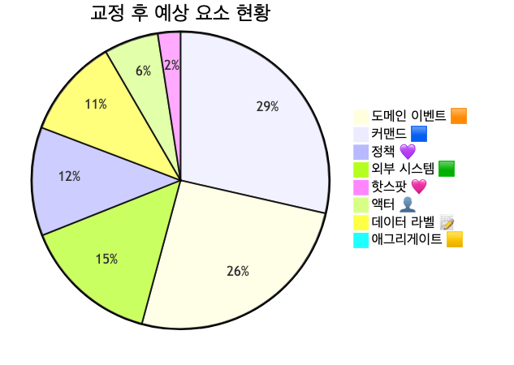

<details>
<summary>📊 원본 Mermaid 코드 보기</summary>

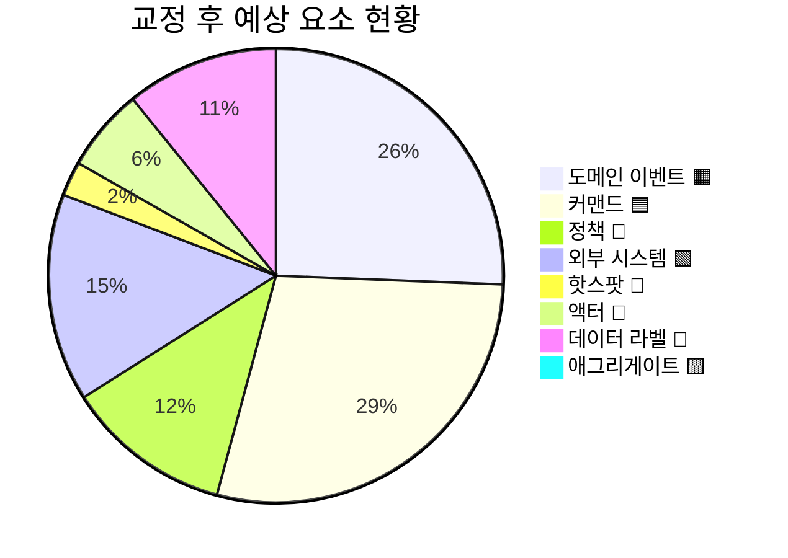

</details>

**교정 전후 수치 비교:**

| 유형 | 교정 전 | 교정 후 | 변동 |
|------|--------|--------|------|
| 이벤트 🟧 | ~74 | ~52 | -22 (데이터 라벨 분리) |
| 커맨드 🟦 | ~58 | ~60 | +2 (SAP 데이터 가져오기, 편성 정보 가져오기) |
| 정책 💜 | ~24 | ~24 | 유지 |
| 외부 시스템 🟩 | ~11 | ~30 | +19 (🩷→🟩 15건, 👤→🟩 5건, 중복 제거 -1) |
| 핫스팟 🩷 | ~32 | ~5 | -27 (외부 시스템 전환) |
| 액터 👤 | ~20 | ~12 | -8 (시스템명 분리, 중복 제거) |
| 데이터 라벨 📝 | 0 | ~22 | +22 (이벤트에서 분리, 보드에서 제거 또는 별도 표기) |
| 애그리게이트 🟨 | 0 | 0 | 미수행 |

---

## 5. 도메인별 흐름 분석

### 5.1 정산 도메인 흐름

3차에서 크게 3개 영역으로 구분된 정산 흐름:

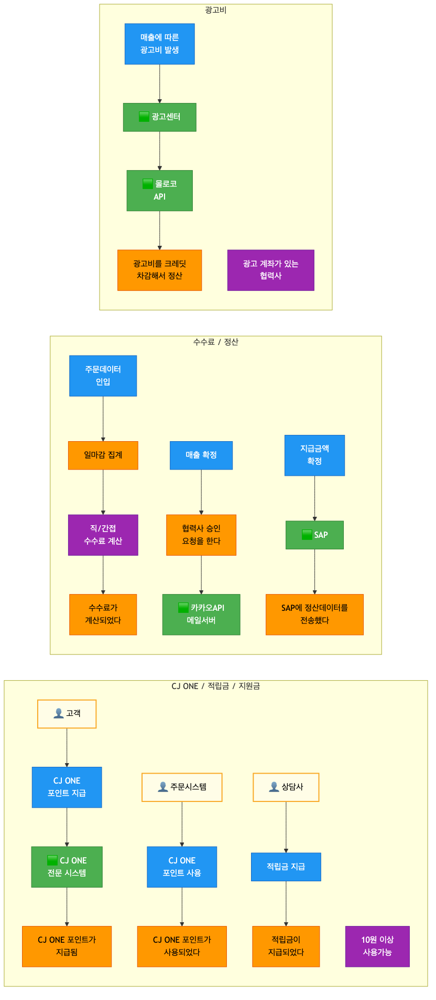

<details>
<summary>📊 원본 Mermaid 코드 보기</summary>

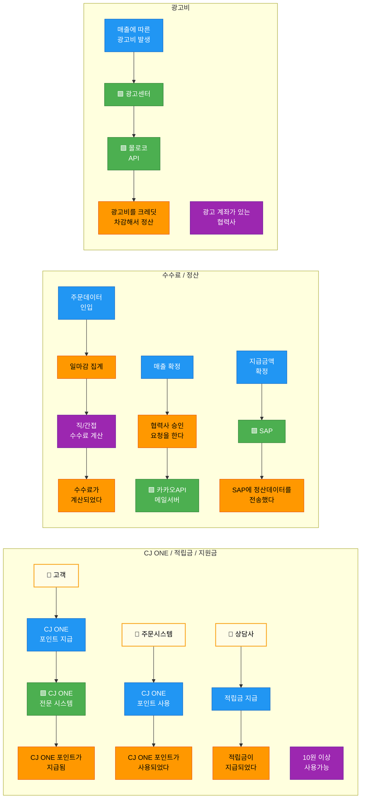

</details>

**흐름 요약:**
1. **CJ ONE/적립금/지원금**: 고객·상담사·주문시스템이 포인트 지급/사용/다운로드 → CJ ONE 전문 시스템 연동 → 포인트 상태 변경 이벤트
2. **수수료/정산**: 주문데이터 인입 → 일마감 집계 → 수수료 계산 → 매출 확정 → 협력사 승인 → 정산 확정 → SAP 전송
3. **광고비**: CPA 광고비 발생 → 광고센터/몰로코 API → 크레딧 차감 정산

### 5.2 협력사 도메인 흐름

3차에서 가장 대폭 확장된 도메인으로, 5개 하위 영역이 도출되었습니다.


<details>
<summary>📊 원본 Mermaid 코드 보기</summary>

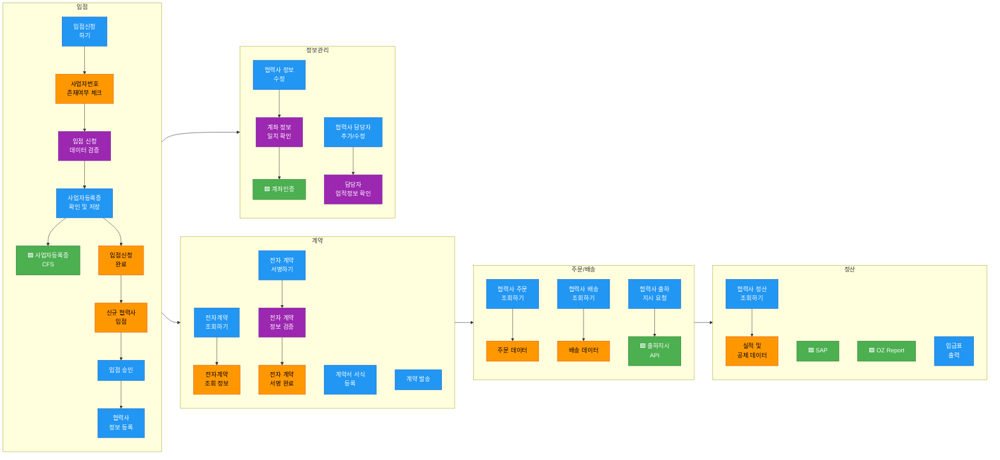

</details>

**흐름 요약:**
1. **입점**: 입점신청 → 사업자등록증 검증(CFS) → 입점 완료 → 입점 승인 → 협력사 정보 등록
2. **계약**: 전자계약 조회 → 계약서 서식 등록 → 계약 발송 → 계약 서명 → 계약 완료
3. **주문/배송**: 협력사 주문 조회 → 배송 조회 → 출하 지시(API)
4. **정산**: 협력사 정산 조회 → 실적/공제 데이터 → SAP → 입금표 출력(OZ Report)
5. **정보관리**: 협력사 정보 수정(계좌인증) → 담당자 관리 → 브랜드 등록

### 5.3 회원 도메인 흐름

3차에서 신규로 전체 도출된 도메인입니다.

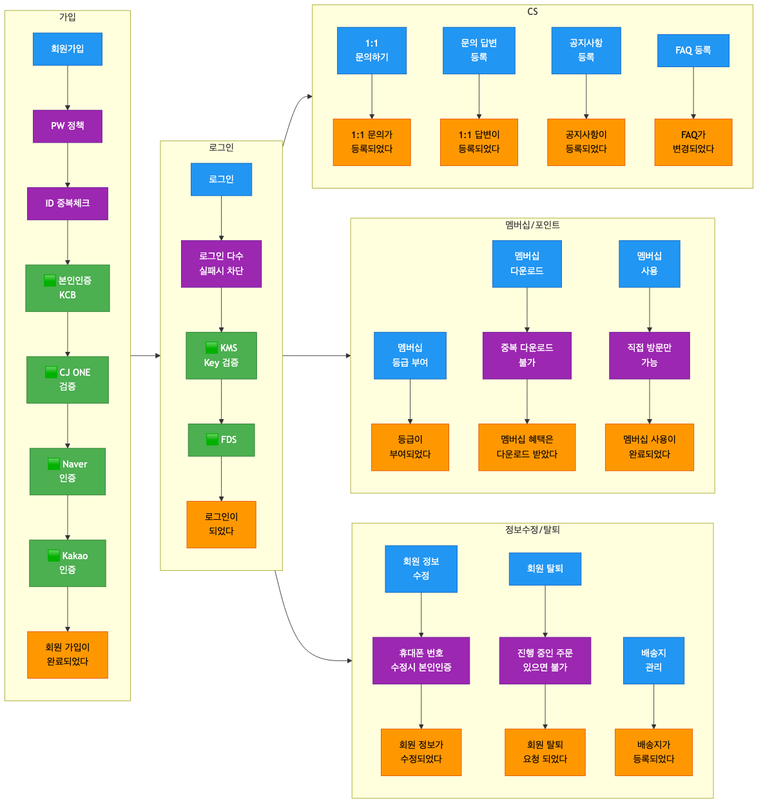

<details>
<summary>📊 원본 Mermaid 코드 보기</summary>

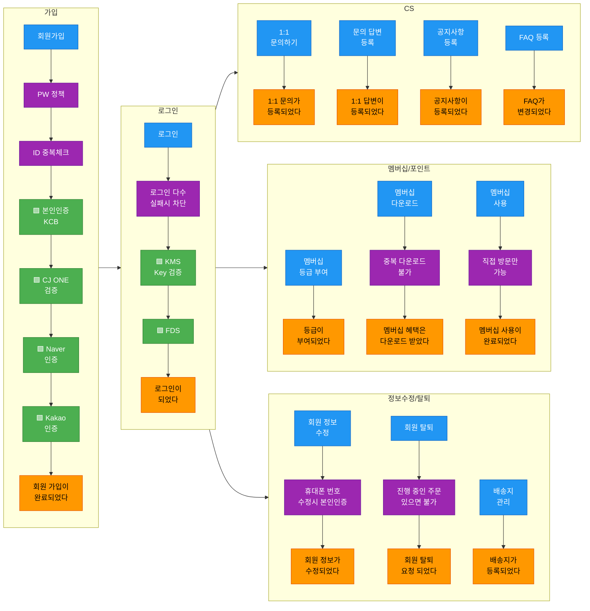

</details>

**흐름 요약:**
1. **가입**: 회원가입 → PW 정책 → ID 중복체크 → 본인인증(KCB) → CJ ONE/소셜 인증 → 가입 완료
2. **로그인**: 로그인 → 차단 정책 → KMS/FDS 검증 → 로그인 완료
3. **CS**: 1:1 문의/답변, 공지사항, FAQ, 이용약관 등록/변경
4. **멤버십/포인트**: 등급 부여, 멤버십 다운로드/사용, 포인트 적립/사용/만료
5. **정보수정/탈퇴**: 정보 수정(본인인증), 탈퇴(주문 진행 확인), 배송지 관리

### 5.4 외부 시스템 의존성 분석

교정 후 기준으로 외부 시스템을 그룹핑하면:

| 그룹 | 🟩 외부 시스템 | 도메인 | 연동 내용 |
|------|--------------|--------|----------|
| ERP/재무 | SAP(정산 🟩 + 협력사 🩷→🟩 통합), e-accounting, 볼타 API | 정산, 협력사 | 정산데이터 전송, 세금계산서, 회계 |
| 포인트/멤버십 | CJ ONE 전문 시스템, CJ ONE API | 정산, 회원 | 포인트 지급/사용, 회원 검증 |
| 인증/보안 | 본인인증(KCB), KMS, FDS | 회원 | 본인인증, 암호화, 부정탐지 |
| 소셜 인증 | Naver, Kakao, Apple | 회원 | 소셜 로그인/회원가입 |
| 광고 | 광고센터, 몰로코 API, 유튜브 GCP | 정산 | 광고비 정산, 크레딧 차감 |
| 제휴 | 대형제휴 API(이베이·11번가·쿠팡·롯데온·SSG), OK캐쉬백/아시아나/애드럭 | 정산 | 제휴사 대사, 포인트 연동 |
| 통신 | SMS 서버, 카카오API/메일서버 | 회원, 정산 | SMS 발송, 카카오톡/메일 알림 |
| 파트너 | 사업자등록증 CFS, 계좌인증, 출하지시 API, OZ Report | 협력사 | 입점 심사, 계좌 검증, 출하, 리포트 |
| 프로모션 | 프로모션 시스템, 프로모션 배리 시스템, 프로모션 쿠폰 서비스 | 정산, 회원 | 프로모션/쿠폰 연동 |
| 기타 | 상품 시스템, 주소 검색 서비스 | 정산, 회원 | 상품 정보, 주소 검색 |

**교정 후 외부 시스템 총 ~30개** (중복 통합 시 ~20개 그룹)

---

## 6. 미완료 항목 정리

### 6.1 미완료 항목 전체 목록

- [ ] 이벤트 정제: ~74개 → 데이터 라벨 ~22건 분리 → 시제 교정 ~5건 → ~52개 이벤트 확정
- [ ] 핑크(🩷) 오분류 ~15건 → 🟩 외부 시스템 교정
- [ ] 금색(👤) 오분류 ~5건 → 🟩 외부 시스템 교정
- [ ] 데이터 라벨 ~22건 보드에서 제거 또는 별도 표기
- [ ] 시제 불일치 ~5건 과거형 교정
- [ ] 애그리게이트 ~11개 후보 식별 (3개 도메인별)
- [ ] 정책 ~24개 → When/Then 구조화 → ~8개 핵심 정책 확정
- [ ] 읽기 모델 ~8개 후보 도출
- [ ] 바운디드 컨텍스트 ~4개 후보 프리뷰
- [ ] 논의 필요 5건 결정
- [ ] 외부 시스템 중복 정리 (CJ ONE 전문 시스템 x2, SAP 중복 등)

### 6.2 영역별 미진행 상세

| 영역 | 이벤트 도출 | 커맨드 도출 | 정책 도출 | 애그리게이트 | 읽기 모델 | BC 프리뷰 |
|------|-----------|-----------|----------|------------|----------|----------|
| ① 정산 수집 | ✅ | ✅ | ✅ | ⬜ | ⬜ | ⬜ |
| ② 정산 확정 | ✅ | ✅ | ✅ | ⬜ | ⬜ | ⬜ |
| ③ 광고비 | ✅ | ✅ | ✅ | ⬜ | ⬜ | ⬜ |
| ④ 회원 관리 | ✅ | ✅ | ✅ | ⬜ | ⬜ | ⬜ |
| ⑤ 고객 서비스 | ✅ 부분 | ✅ 부분 | ⬜ | ⬜ | ⬜ | ⬜ |
| ⑥ 협력사 관리 | ✅ (라벨 혼재) | ✅ | ✅ | ⬜ | ⬜ | ⬜ |

### 6.3 읽기 모델·BC 프리뷰 미수행 분석

**미수행 원인:**
- 3차 워크샵이 준비 문서의 Phase 구조를 따르지 않고 **3개 도메인 전체 확장 도출**에 집중
- 이벤트·커맨드 도출 자체가 2배 이상 확장되면서 시간 소요
- 이벤트 정제가 선행되지 않아 애그리게이트·읽기모델 도출의 전제 조건이 갖춰지지 않음

**영향:**
- 읽기 모델은 바운디드 컨텍스트 경계 설정의 중요 근거 → BC 프리뷰도 함께 미수행
- 4차 워크샵에서 **정제 → 애그리게이트 → 읽기모델 → BC 프리뷰**를 순서대로 수행해야 함

**준비 문서의 애그리게이트 11개 후보 (여전히 유효):**

| 도메인 | 🟨 애그리게이트 | 포함 데이터 |
|--------|----------------|-----------|
| 정산 | 주문정산 | 주문ID, 유형, 집계금액, 집계상태 |
| 정산 | 수수료 | 수수료ID, 직접/간접 구분, 수수료율, 계산금액 |
| 정산 | 매출 | 매출ID, 확정금액, 확정일, 상태 |
| 정산 | 광고비 | 광고비ID, CPA금액, 크레딧잔액, 정산상태 |
| 정산 | 정산지급 | 정산ID, 지급금액, 지급일, SAP전송상태 |
| 회원 | 회원 | 회원ID, 이름, 연락처, 상태, 등급 |
| 회원 | 인증 | 인증ID, 인증방식, 시도횟수, 차단상태 |
| 회원 | 고객문의 | 문의ID, 유형, 내용, 답변상태 |
| 협력사 | 입점신청 | 신청ID, 사업자번호, 심사상태 |
| 협력사 | 전자계약 | 계약ID, 계약서, 서명상태 |
| 협력사 | 협력사 | 협력사ID, 사업자정보, 계좌, 상태 |

**준비 문서의 읽기 모델 8개 후보 (여전히 유효):**

| # | 📖 읽기 모델 | 대상 사용자 | 구성 데이터 |
|---|-------------|-----------|-----------|
| 1 | 정산 현황 대시보드 | 🔧 운영자 | 정산 진행 상태, 확정/미확정 금액, SAP 전송 현황 |
| 2 | 수수료 내역 상세 뷰 | 🔧 운영자 | 협력사별 수수료, 직접/간접 내역 |
| 3 | 회원 현황 대시보드 | 🔧 운영자 | 가입 현황, 활성/휴면/탈퇴 회원 수 |
| 4 | 입점 심사 현황 뷰 | 🔧 운영자 | 입점 신청 목록, 심사 상태 |
| 5 | SAP 대사 모니터링 | 🔧 운영자 | SAP 전송 건수, 대사 결과 |
| 6 | 정산 상세 내역 뷰 | 🔧 협력사 | 정산 금액, 수수료 내역, 지급 일정 |
| 7 | 전자 계약 관리 뷰 | 🔧 협력사 | 계약서 목록, 서명 상태 |
| 8 | 광고비 정산 현황 뷰 | 🔧 협력사 | 광고비 내역, 크레딧 잔액 |

---

## 7. 4차 워크샵 권장 사항

### 7.1 4차 워크샵 목표 재설정

3차에서 미완료된 항목을 반영하여 4차 목표를 재설정합니다:

```
┌─────────────────────────────────────────────────────────────┐
│              4차 워크샵에서 달성할 것                          │
├─────────────────────────────────────────────────────────────┤
│                                                             │
│  ✅ 3차 draw.io 오분류 교정 확인 (사전 반영)               │
│  ✅ 이벤트 정제 (~74개 → ~50개, 데이터 라벨 분리)          │
│  ✅ 애그리게이트 식별 (~11개 후보 확정)                     │
│  ✅ 정책 When/Then 구조화 (~24개 → ~8개 핵심)              │
│  ✅ 읽기 모델 도출 (~8개 후보)                              │
│  ✅ 바운디드 컨텍스트 후보 프리뷰 (~4개)                   │
│                                                             │
└─────────────────────────────────────────────────────────────┘
```

### 7.2 권장 타임라인

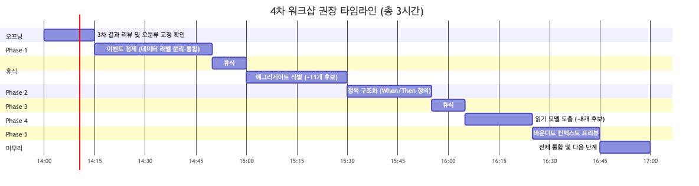

<details>
<summary>📊 원본 Mermaid 코드 보기</summary>

```mermaid
gantt
    title 4차 워크샵 권장 타임라인 (총 3시간)
    dateFormat HH:mm
    axisFormat %H:%M

    section 오프닝
    3차 결과 리뷰 및 오분류 교정 확인    :a1, 14:00, 15m

    section Phase 1
    이벤트 정제 (데이터 라벨 분리·통합)   :a2, after a1, 35m

    section 휴식
    휴식                                  :a3, after a2, 10m

    section Phase 2
    애그리게이트 식별 (~11개 후보)        :a4, after a3, 30m

    section Phase 3
    정책 구조화 (When/Then 정의)          :a5, after a4, 25m

    section 휴식
    휴식                                  :a6, after a5, 10m

    section Phase 4
    읽기 모델 도출 (~8개 후보)            :a7, after a6, 20m

    section Phase 5
    바운디드 컨텍스트 프리뷰              :a8, after a7, 20m

    section 마무리
    전체 통합 및 다음 단계                :a9, after a8, 15m
```

</details>

| 시간 | 단계 | 소요 | 핵심 활동 |
|------|------|------|----------|
| 14:00 | 오프닝 | 15분 | 3차 결과 리뷰, 오분류 교정 확인(사전 반영), 논의 5건 거수 결정 |
| 14:15 | Phase 1: 이벤트 정제 | 35분 | 데이터 라벨 ~22건 분리, 시제 교정 ~5건, 중복 통합 → ~50개 목표 |
| 14:50 | 휴식 | 10분 | |
| 15:00 | Phase 2: 애그리게이트 식별 | 30분 | 정산 5개, 회원 3개, 협력사 3개 = ~11개 후보 확정 |
| 15:30 | Phase 3: 정책 구조화 | 25분 | ~24개 정책을 When/Then 정의, ~8개 핵심 정책 확정 |
| 15:55 | 휴식 | 10분 | |
| 16:05 | Phase 4: 읽기 모델 | 20분 | 운영자 5개 + 협력사 3개 = ~8개 후보 도출 |
| 16:25 | Phase 5: BC 프리뷰 | 20분 | ~4개 BC 후보(정산, 회원, 고객서비스, 협력사) 경계 검증 |
| 16:45 | 마무리 | 15분 | 전체 통합, 다음 단계 안내, 결과 정리 |
| **17:00** | **종료** | **총 3시간** | |

### 7.3 사전 준비 체크리스트

- [ ] 3차 draw.io 보드에 핑크(🩷) → 🟩 교정 ~15건 사전 반영
- [ ] 데이터 라벨(📝) ~22건을 보드에서 제거 또는 회색으로 변경
- [ ] 금색(👤) 시스템명 ~5건을 🟩 외부 시스템으로 사전 교정
- [ ] 시제 불일치 ~5건 과거형으로 사전 교정
- [ ] 논의 필요 5건에 대해 팀원과 사전 확인 (슬랙 논의)
- [ ] 준비 문서의 애그리게이트 11개 후보를 🟨 포스트잇으로 미리 준비
- [ ] 준비 문서의 읽기 모델 8개 후보를 📖 포스트잇으로 미리 준비
- [ ] CJ ONE 전문 시스템 중복(2개), SAP 중복(정산 🟩 + 협력사 🩷) 통합
- [ ] 포스트잇 색상 가이드를 벽면에 크게 인쇄하여 부착 (오분류 방지)

### 7.4 퍼실리테이터 유의 사항

3차 워크샵에서 얻은 교훈 4가지:

**1. 준비 문서 Phase 구조 준수 유도**
> 3차에서는 준비 문서의 Phase 구조를 따르지 않고 **3개 도메인 전체를 확장 도출**하는 방식으로 진행되었습니다.
> 이벤트·커맨드는 충분히 도출되었으나 애그리게이트·읽기모델·BC 프리뷰는 미수행입니다.
> 4차에서는 **"이벤트 도출은 이미 충분합니다. 오늘은 정제·구조화·상위 레벨 식별에 집중합니다"**와 같이
> 오프닝에서 명확히 안내하고, Phase 전환 시 "이 Phase에서 N개를 확정했습니다"와 같이 **명시적 전환**을 합니다.

**2. 핑크(🩷) 색상 오분류 방지**
> 3차에서 핑크(🩷) 24건 중 ~15건이 실제로는 🟩 외부 시스템이었습니다.
> 핑크는 **"해결이 필요한 문제/이슈/논쟁점"**에만 사용해야 합니다.
> 외부 시스템은 반드시 **🟩 초록색**으로 작성하도록 포스트잇 색상 가이드를 오프닝에서 안내합니다.
> draw.io에서는 색상 프리셋을 미리 설정해둡니다.

**3. 데이터 라벨 vs 이벤트 구분 교육**
> 3차에서 이벤트 ~74개 중 ~22건이 "정보", "데이터" 패턴의 데이터 라벨이었습니다.
> 이벤트는 **"~되었다", "~완료되었다"**와 같은 과거형 표현이어야 합니다.
> "협력사 정보", "주문 데이터"는 이벤트가 아닌 데이터 설명입니다.
> 4차에서 새 포스트잇을 붙일 때 **"이것은 과거에 발생한 사실인가요?"**라고 즉시 확인합니다.

**4. 외부 시스템 그룹핑으로 복잡도 관리**
> 교정 후 외부 시스템이 ~30개로 매우 많습니다.
> 9개 그룹(ERP/재무, 포인트, 인증/보안, 소셜, 광고, 제휴, 통신, 파트너, 프로모션)으로 묶어 관리합니다.
> 워크샵에서 외부 시스템 세부 논의가 시작되면 **"외부 시스템 연동 상세는 ACL 설계 시 다룹니다. 지금은 비즈니스 흐름에 집중합시다"**라고 안내합니다.

### 7.5 도메인별 정제 우선순위

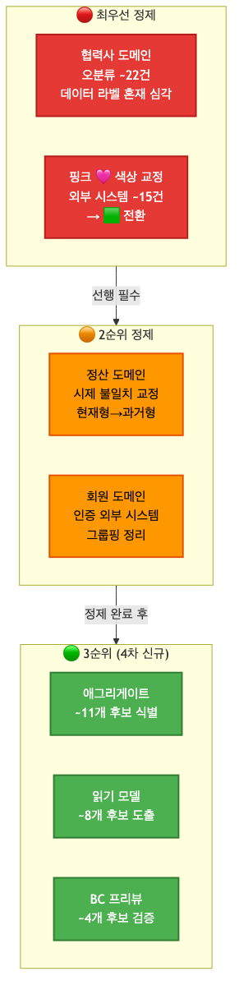

<details>
<summary>📊 원본 Mermaid 코드 보기</summary>

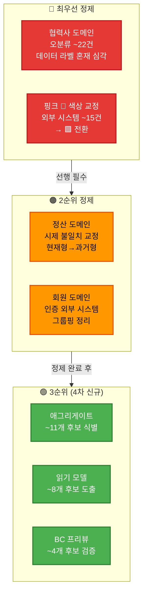

</details>

**우선순위 설명:**
1. **🔴 최우선**: 협력사 도메인의 데이터 라벨 ~22건 분리 + 핑크(🩷) 외부 시스템 ~15건 교정 — **사전 준비로 처리**
2. **🟠 2순위**: 정산 도메인 시제 교정 + 회원 도메인 인증 외부 시스템 정리 — **Phase 1에서 처리**
3. **🟢 3순위**: 애그리게이트·읽기모델·BC 프리뷰 — **Phase 2~5에서 신규 수행**
