# 플랫폼 개발팀 이벤트 스토밍 3차 워크샵 준비 가이드

## 1. 개요

### 1.1 이 문서의 목적

플랫폼개발팀 이벤트 스토밍 **3차 워크샵**을 진행하는 퍼실리테이터를 위한 실전 가이드입니다.
1~2차에서 도출한 이벤트·커맨드·정책을 기반으로, **대폭 정제 → 애그리게이트 → 정책 구조화 → 읽기 모델 → BC 프리뷰**까지 완성하는 것이 목표입니다.

플랫폼개발팀은 **3개 핵심 도메인**(정산, 회원, 협력사/파트너)을 담당하며, **외부 시스템 연동이 18개**로 매우 많은 것이 특징입니다.

```
┌─────────────────────────────────────────────────────────────┐
│              3차 워크샵에서 달성할 것                         │
├─────────────────────────────────────────────────────────────┤
│                                                             │
│  ✅ 이벤트 대폭 정제: ~33개 → ~25개 (라벨·시스템명 분리)   │
│  ✅ 정책 구조화: 13개 → ~8개 (When/Then 정의)              │
│  ✅ 애그리게이트: ~11개 후보 확정 (3개 도메인별)            │
│  ✅ 읽기 모델: ~8개 후보 도출                               │
│  ✅ 바운디드 컨텍스트 프리뷰: ~4개 BC 후보 검증             │
│  ✅ 핫스팟 식별 및 정책 전환                                │
│                                                             │
└─────────────────────────────────────────────────────────────┘
```

### 1.2 1~2차 요약 & 3차 목표

**1~2차 완료 사항:**
- 1차: 이벤트 자유 도출 (브레인스토밍)
- 2차: 이벤트·커맨드·정책·액터·외부 시스템 도출 (draw.io 정리)

| 항목 | 1~2차 완료 | 3차 목표 |
|------|-----------|---------|
| 이벤트 도출 | ✅ ~33개 (라벨·시스템명 10건+ 혼재) | **정제하여 ~25개** |
| 커맨드 | ✅ ~22개 | 이벤트와 매핑 재정리 |
| 정책 | ✅ ~13개 (프로세스 기술과 혼재) | **When/Then 구조화 → ~8개** |
| 핫스팟 | ✅ 3개 | 정책 전환 + 추가 식별 |
| 외부 시스템 | ✅ **18개** (SAP, PG, CJ ONE 등) | 유지 + 🟩 분류 정리 |
| 애그리게이트 | ⬜ 미수행 | **~11개 후보 확정** |
| 읽기 모델 | ⬜ 미수행 | **~8개 후보 도출** |
| 바운디드 컨텍스트 | ⬜ 미수행 | **~4개 BC 프리뷰** |

### 1.3 참조 문서

| 참조 문서 | 활용 시점 |
|----------|----------|
| [이벤트스토밍_단계별_실행가이드.md](./이벤트스토밍_단계별_실행가이드.md) | Phase별 진행 방법, 일반 스크립트 |
| [이벤트스토밍_퀵레퍼런스.md](./이벤트스토밍_퀵레퍼런스.md) | 용어집, 흔한 실수, 빠른 참조 |
| [이벤트스토밍_시각화_가이드.md](./이벤트스토밍_시각화_가이드.md) | 포스트잇 색상 체계, 다이어그램 패턴 |

> **참고:** 플랫폼개발팀은 다른 팀(검색, 주문, 상품 등)과 달리 별도의 가이드·도메인예시·워크샵실행 문서가 아직 없습니다. 이 문서가 3차 워크샵의 주요 참조 자료입니다.

---

## 2. 1~2차 결과 정리 및 재검토

### 2.1 현재 요소 현황 요약

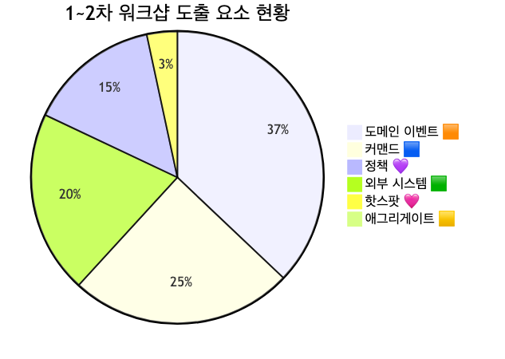

<details>
<summary>📊 원본 Mermaid 코드 보기</summary>

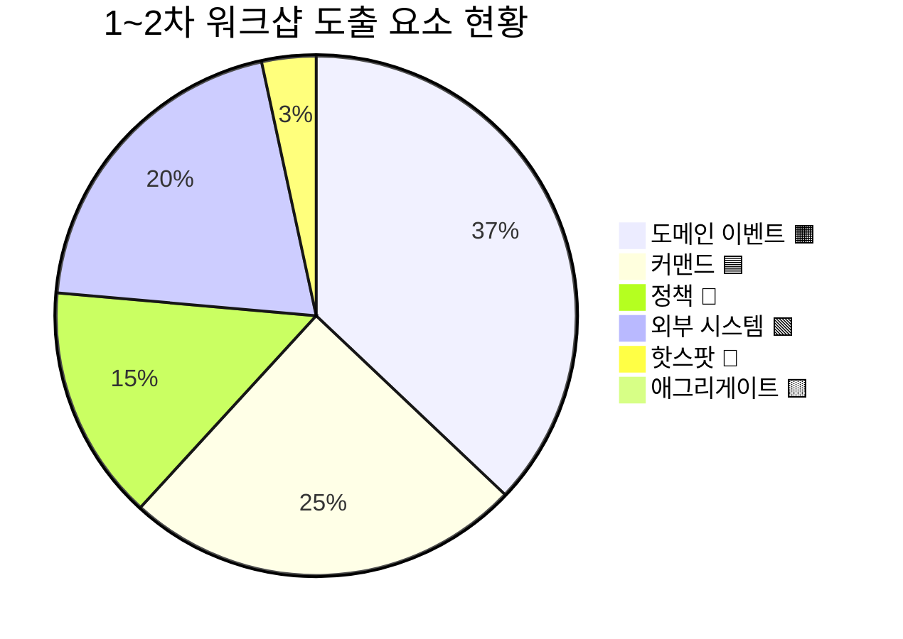

</details>

**현황 분석:**
- 이벤트 ~33개 중 **라벨·시스템명이 이벤트로 혼재** — "온트러스트", "EAI 인터페이스", "광고센터", "주문서" 등이 금색(#FFD700)으로 표현됨
- 정책 ~13개 중 **프로세스 기술**(고객인수 회수 집하 회수확정)과 **조건 설명**(광고비 취합상태)이 혼재
- **외부 시스템이 18개**로 매우 많음 — SAP(x2), PG사, CJ ONE, Naver, Kakao, Apple, KCB, FDS, 몰 로코, 몰타, e-accounting, 튜브 GCP, 대형제휴 API, OK캐쉬백 등
- 3개 도메인(정산, 회원, 협력사)이 draw.io에서 물리적으로 분리되어 있어 영역 구분은 양호
- 일부 이벤트의 **시제가 불일치** — "정산확정을 한다"(현재형), "결제 완료가 되었다"(과거형) 혼재

### 2.2 6개 흐름 영역 전체 맵

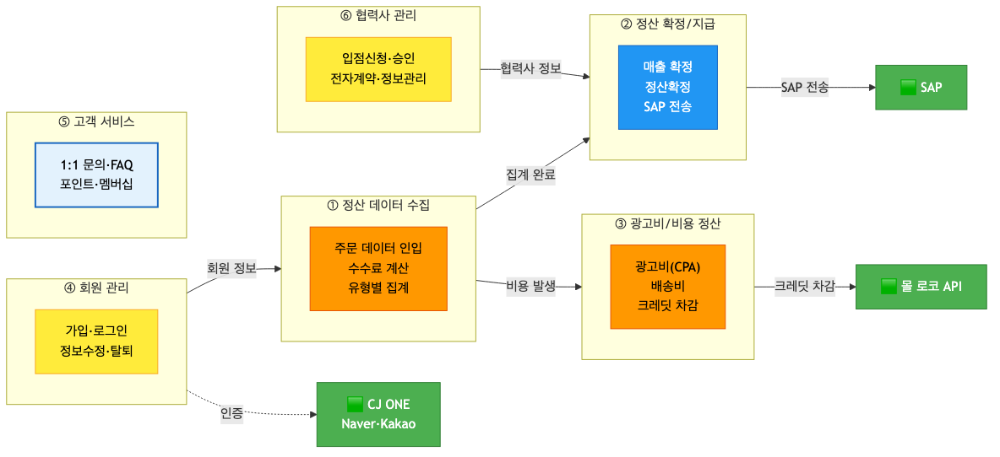

<details>
<summary>📊 원본 Mermaid 코드 보기</summary>

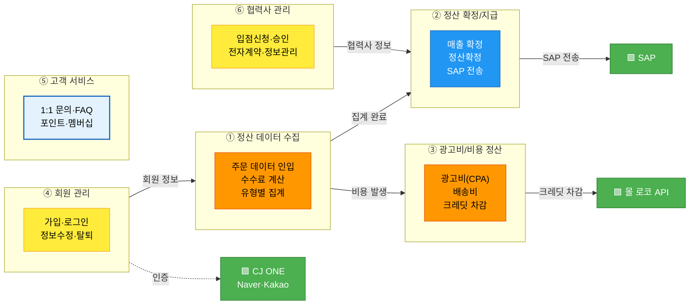

</details>

**영역별 상세:**

| 영역 | 도메인 | 이벤트 수 | 핵심 흐름 | 외부 시스템 |
|------|--------|----------|----------|-----------|
| ① 정산 데이터 수집 | 정산 | ~6개 | 주문인입→수수료계산→유형별집계→일마감 | PG사 |
| ② 정산 확정/지급 | 정산 | ~5개 | 매출확정→협력사승인→정산확정→SAP전송→대사 | SAP, 몰타, 카카오/메일 |
| ③ 광고비/비용 정산 | 정산 | ~4개 | 광고비(CPA)→크레딧차감→정산수수료 최종 | 몰 로코, 대형제휴 API |
| ④ 회원 관리 | 회원 | ~9개 | 가입→로그인→정보수정→탈퇴 | CJ ONE, Naver, Kakao, Apple, KCB, FDS |
| ⑤ 고객 서비스 | 회원 | ~3개 | 1:1 문의, FAQ, 포인트/멤버십 | — |
| ⑥ 협력사 관리 | 협력사 | ~6개 | 입점신청→승인→계약→정보관리 | 사업자등록증 OCR, 계좌인증 |

### 2.3 이벤트 재검토 항목

#### 2.3.1 라벨·시스템명 제거 (10건)

draw.io에서 금색(#FFD700)으로 작성되었으나 **이벤트가 아닌 항목**:

| # | draw.io 원본 | 현재 역할 | 처리 |
|---|-------------|----------|------|
| 1 | "주문서" | 애그리게이트 후보 | → 🟨 애그리게이트로 재분류 |
| 2 | "온트러스트" | 시스템명/액터 | → 제거 (별도 표기) |
| 3 | "취소·교환·반품 신청 온트러스트 상담원" | 액터 + 커맨드 혼합 | → 분리: 액터 "상담원" + 🟦 "취소·교환·반품 접수하기" |
| 4 | "EAI 인터페이스" (x2) | 시스템 연동 라벨 | → 제거 (기술 인프라) |
| 5 | "광고센터" | 시스템명 | → 제거 (🟩 외부 시스템으로 표기) |
| 6 | "or-bat" | 시스템명/배치명 | → 제거 (기술 인프라) |
| 7 | "고객", "상담사" | 액터 | → 별도 액터로 표기 |
| 8 | "ID/PW 찾기" | 커맨드 라벨 | → 🟦 커맨드로 재분류 |
| 9 | "회원관리", "고객 센터" | 시스템/화면 라벨 | → 📖 읽기 모델 후보로 전환 |
| 10 | "포인트", "제휴사 연동", "멤버십" | 도메인 라벨 | → 제거 (애그리게이트 후보로 별도 검토) |

#### 2.3.2 오분류 교정 (8건)

| # | draw.io 원본 | 현재 색상 | 교정 | 사유 |
|---|-------------|----------|------|------|
| 1 | "정산확정을 한다" | 🟧 이벤트 | → **"정산이 확정되었다"** (명명 교정) | 현재형→과거형 |
| 2 | "결제 완료가 되었다 / PG사에서 결제 승인되었다" | 🟧 중복 | → **"결제가 승인되었다"** (통합) | 동일 이벤트 2가지 표현 |
| 3 | "주문/반품/주문데이터를 유형으로 분류 집계했다 / 정산데이터 집계" | 🟧 혼합 | → **"정산데이터가 집계되었다"** (통합) | 설명+이벤트 혼합 |
| 4 | "전자 계약 정보 조회 (계약서, 협력사 정보)" | 🟧 이벤트 | → 📖 **읽기 모델** | 조회는 상태 변경 아님 |
| 5 | "전자 계약 정보 조회 (그리드 리스트)" | 🟧 이벤트 | → 📖 **읽기 모델** | 조회는 상태 변경 아님 |
| 6 | "신규 협력사 인증" | 🟧 이벤트 | → 💜 **정책** 또는 프로세스 | 인증은 검증 절차 |
| 7 | "합격 정보" | 🟧 이벤트 | → **"입점이 승인되었다"** (명명 교정) | 라벨→이벤트 |
| 8 | "출고 지시" | 🟧 이벤트 | → 🟦 **커맨드** "출고 지시하기" | 명령형 |

#### 2.3.3 외부 시스템 정리 (18개 → 6개 그룹)

| 그룹 | 🟩 외부 시스템 | 연동 내용 |
|------|--------------|----------|
| ERP/재무 | SAP, e-accounting, 몰타 API | 정산 데이터 전송, 세금계산서, 회계 |
| 결제 | PG사 | 결제 승인/취소 데이터 |
| 인증/보안 | CJ ONE, Naver, Kakao, Apple, KCB, KMS, FDS | 회원 인증, 본인인증, 부정탐지 |
| 광고 | 몰 로코 API, 튜브 GCP | 광고비 정산, 크레딧 차감 |
| 제휴 | 대형제휴 API(이베이·11번가·쿠팡·롯데온·SSG), OK캐쉬백, 아시아나, 애드럭 | 제휴사 대사, 포인트 연동 |
| 파트너 | 사업자등록증 이미지/OCR, 계좌 인증 | 입점 심사 |

#### 2.3.4 명명 정규화 필요 (5건)

| # | draw.io 원본 | 교정 후 | 사유 |
|---|-------------|--------|------|
| 1 | "정산확정을 한다" | "정산이 확정되었다" | 현재형→과거형 |
| 2 | "재고부족 취소 패널티를 공제 처리한다" | "패널티가 공제되었다" | 서술형→이벤트형 |
| 3 | "SAP과 정산데이터를 주기적으로 대사한다" | "SAP 대사가 완료되었다" | 서술형→이벤트형 |
| 4 | "EP 주문데이터를 제휴사에 제공(연동)했다" | "제휴사에 데이터가 연동되었다" | 기술 설명→이벤트형 |
| 5 | "광고비를 크레딧 차감해서 정산했다" | "광고비가 크레딧 차감되었다" | 서술형→이벤트형 |

### 2.4 1~2차→3차 전환 체크리스트

- [ ] 라벨·시스템명 10건 제거/재분류
- [ ] 오분류 8건 색상 교정
- [ ] 외부 시스템 18개 → 6개 그룹 정리
- [ ] 명명 정규화 5건 처리
- [ ] 정책 13개 → ~8개 When/Then 구조화
- [ ] 6개 흐름 영역 확인

---

## 3. 3차 워크샵 타임라인

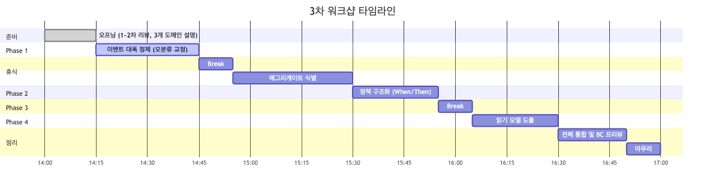

<details>
<summary>📊 원본 Mermaid 코드 보기</summary>

```mermaid
gantt
    title 3차 워크샵 타임라인
    dateFormat HH:mm
    axisFormat %H:%M

    section 준비
    오프닝 (1~2차 리뷰, 3개 도메인 설명)   :done, 14:00, 15m

    section Phase 1
    이벤트 대폭 정제 (오분류 교정)           :active, 14:15, 30m

    section 휴식
    Break                                    :14:45, 10m

    section Phase 2
    애그리게이트 식별                         :14:55, 35m

    section Phase 3
    정책 구조화 (When/Then)                  :15:30, 25m

    section 휴식
    Break                                    :15:55, 10m

    section Phase 4
    읽기 모델 도출                           :16:05, 25m

    section 정리
    전체 통합 및 BC 프리뷰                   :16:30, 20m
    마무리                                   :16:50, 10m
```

</details>

| 시간 | 단계 | 소요 | 핵심 활동 | 산출물 |
|------|------|------|----------|--------|
| 14:00 | 오프닝 | 15분 | 1~2차 리뷰, 3개 도메인(정산·회원·협력사) 영역 설명 | — |
| 14:15 | Phase 1: 이벤트 대폭 정제 | 30분 | 라벨 제거, 오분류 교정, 명명 정규화 | 정제된 이벤트 ~25개 |
| 14:45 | 휴식 | 10분 | — | — |
| 14:55 | Phase 2: 애그리게이트 식별 | 35분 | 도메인별 애그리게이트 도출 | ~11개 후보 |
| 15:30 | Phase 3: 정책 구조화 | 25분 | 기존 정책 When/Then 정의 + 핫스팟 전환 | ~8개 정책 |
| 15:55 | 휴식 | 10분 | — | — |
| 16:05 | Phase 4: 읽기 모델 도출 | 25분 | 운영자/협력사 화면 식별 | ~8개 후보 |
| 16:30 | 전체 통합 & BC 프리뷰 | 20분 | 4개 BC 후보 검증 | BC 프리뷰 |
| 16:50 | 마무리 | 10분 | 다음 단계 안내 | — |
| **17:00** | **종료** | **총 3시간** | | |

---

## 4. Phase 1: 이벤트 대폭 정제 (30분)

### 퍼실리테이터 스크립트

> "1~2차에서 3개 도메인(정산, 회원, 협력사)에 걸쳐 ~33개 이벤트, ~22개 커맨드, ~13개 정책을 도출했습니다.
> 오늘 첫 단계로, draw.io에서 발견된 문제를 정리합니다.
>
> 가장 큰 이슈는 **시스템명·라벨이 이벤트로 혼재**된 것입니다.
> '온트러스트', 'EAI 인터페이스', '광고센터' — 이것들은 이벤트가 아니라 시스템 이름이죠.
> 또한 '정산확정을 한다'처럼 **현재형**으로 쓴 것은 과거형 '정산이 확정되었다'로 교정합니다.
>
> 도메인별로 진행합시다. 정산 15분, 회원 8분, 협력사 7분으로 나누겠습니다."

### 4.1 도메인별 정제 처리

**정산 도메인 정제:**
- 통합: "결제 완료가 되었다" + "PG사에서 결제 승인되었다" → **"결제가 승인되었다"**
- 통합: "주문/반품/주문데이터를 유형으로 분류 집계했다" + "정산데이터 집계" → **"정산데이터가 집계되었다"**
- 명명 교정: "정산확정을 한다" → **"정산이 확정되었다"**
- 라벨 제거: "주문서" → 🟨 애그리게이트, "온트러스트" → 액터, "EAI 인터페이스" → 제거, "광고센터" → 제거, "or-bat" → 제거

**회원 도메인 정제:**
- 라벨 제거: "고객" → 액터, "상담사" → 액터, "ID/PW 찾기" → 🟦 커맨드
- 라벨 → 읽기 모델: "회원관리" → 📖 회원 현황 대시보드, "고객 센터" → 📖 고객센터 화면
- 라벨 → 애그리게이트 후보: "포인트", "멤버십", "제휴사 연동"

**협력사 도메인 정제:**
- 오분류: "전자 계약 정보 조회" (x2) → 📖 읽기 모델
- 오분류: "출고 지시" → 🟦 커맨드
- 명명 교정: "합격 정보" → **"입점이 승인되었다"**

### 4.2 정제 후 예상 이벤트 목록 (~25개)

| # | 영역 | 이벤트 |
|---|------|--------|
| 1 | ① 정산 수집 | 결제가 승인되었다 |
| 2 | ① 정산 수집 | 정산데이터가 집계되었다 |
| 3 | ① 정산 수집 | 일마감 집계가 완료되었다 |
| 4 | ① 정산 수집 | 수수료가 계산되었다 |
| 5 | ① 정산 수집 | 회수가 확정되었다 |
| 6 | ① 정산 수집 | 고객인수가 완료되었다 |
| 7 | ② 정산 확정 | 매출이 확정되었다 |
| 8 | ② 정산 확정 | 협력사 승인이 요청되었다 |
| 9 | ② 정산 확정 | 정산요청 알림이 발송되었다 |
| 10 | ② 정산 확정 | 정산이 확정되었다 |
| 11 | ② 정산 확정 | SAP에 정산데이터가 전송되었다 |
| 12 | ② 정산 확정 | SAP 대사가 완료되었다 |
| 13 | ③ 광고비/비용 | 배송비가 발생했다 |
| 14 | ③ 광고비/비용 | 광고 비용(CPA)이 발생했다 |
| 15 | ③ 광고비/비용 | 광고비가 크레딧 차감되었다 |
| 16 | ③ 광고비/비용 | 패널티가 공제되었다 |
| 17 | ④ 회원 | 회원 가입이 완료되었다 |
| 18 | ④ 회원 | 로그인 되었다 |
| 19 | ④ 회원 | 로그인이 차단되었다 |
| 20 | ④ 회원 | 회원 정보가 수정되었다 |
| 21 | ④ 회원 | 회원 탈퇴가 요청되었다 |
| 22 | ⑤ 고객서비스 | 고객이 1:1 문의했다 |
| 23 | ⑥ 협력사 | 입점 신청이 완료되었다 |
| 24 | ⑥ 협력사 | 입점이 승인되었다 |
| 25 | ⑥ 협력사 | 전자 계약이 서명되었다 |

---

## 5. Phase 2: 애그리게이트 식별 (35분)

### 5.1 플랫폼팀 눈높이 설명

> **애그리게이트 = "함께 변하는 데이터 묶음"**
>
> 플랫폼팀에 친숙한 비유로 설명하면:
>
> - **정산 건 하나** = 하나의 애그리게이트입니다. 주문 집계, 수수료 계산, 매출 확정, 정산 확정이 모두 같은 정산 데이터를 변경합니다
> - **회원 하나** = 가입, 로그인, 정보 수정, 탈퇴가 모두 같은 회원 데이터를 변경합니다
> - "이 커맨드가 변경하는 대상은 무엇인가?" → 그게 애그리게이트입니다

### 5.2 도메인별 애그리게이트 후보 (~11개)

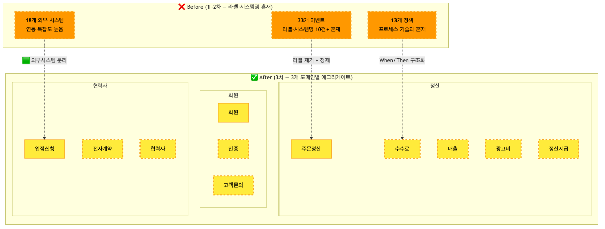

<details>
<summary>📊 원본 Mermaid 코드 보기</summary>

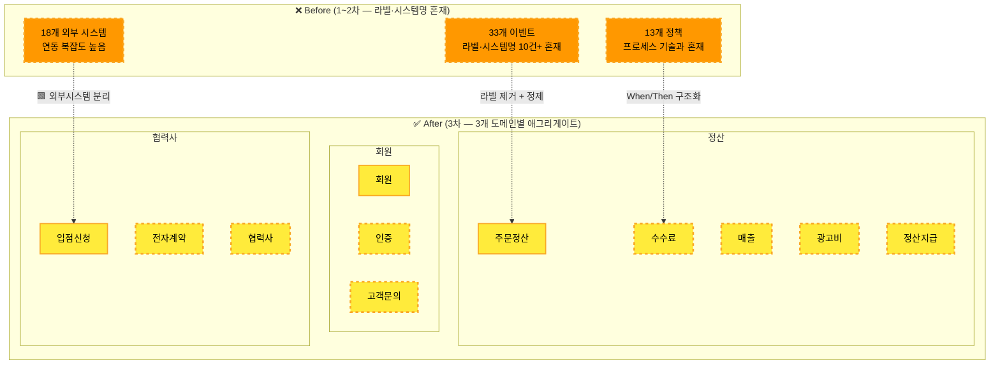

</details>

**애그리게이트 상세:**

| 도메인 | 🟨 애그리게이트 | 포함 데이터 | 관련 이벤트 |
|--------|----------------|-----------|-----------|
| 정산 | **주문정산** | 주문ID, 유형(주문/반품/취소), 집계금액, 집계상태 | 정산데이터 집계, 일마감 집계 |
| 정산 | **수수료** | 수수료ID, 직접/간접 구분, 수수료율, 계산금액 | 수수료 계산 |
| 정산 | **매출** | 매출ID, 확정금액, 확정일, 상태 | 매출 확정, 협력사 승인 요청 |
| 정산 | **광고비** | 광고비ID, CPA금액, 크레딧잔액, 정산상태 | 광고비 발생, 크레딧 차감 |
| 정산 | **정산지급** | 정산ID, 지급금액, 지급일, SAP전송상태 | 정산 확정, SAP 전송, 대사 |
| 회원 | **회원** | 회원ID, 이름, 연락처, 상태, 등급 | 가입 완료, 정보 수정, 탈퇴 요청 |
| 회원 | **인증** | 인증ID, 인증방식, 시도횟수, 차단상태 | 로그인, 로그인 차단 |
| 회원 | **고객문의** | 문의ID, 유형, 내용, 답변상태 | 1:1 문의 |
| 협력사 | **입점신청** | 신청ID, 사업자번호, 심사상태 | 입점 신청 완료, 입점 승인 |
| 협력사 | **전자계약** | 계약ID, 계약서, 서명상태 | 전자 계약 서명 |
| 협력사 | **협력사** | 협력사ID, 사업자정보, 계좌, 상태 | 협력사 정보 수정 |

### 5.3 흐름 영역별 매핑


<details>
<summary>📊 원본 Mermaid 코드 보기</summary>

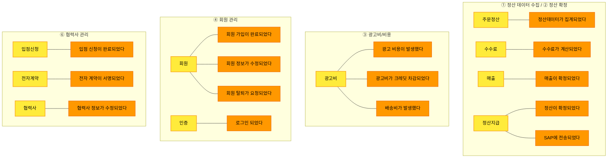

</details>

### 5.4 식별 질문 리스트

| 도메인 | 질문 | 기대 답변 |
|--------|------|----------|
| 정산 | "주문 집계와 수수료 계산은 같은 트랜잭션인가요?" | 별개 — 집계 후 수수료 계산 |
| 정산 | "매출 확정과 정산 확정은 같은 데이터인가요?" | 별개 — 매출은 금액, 정산은 지급 |
| 정산 | "광고비와 일반 정산은 같은 프로세스인가요?" | 별개 — 광고비는 크레딧 차감 방식 |
| 회원 | "로그인과 회원 정보는 같은 데이터인가요?" | 별개 — 인증은 독립 생명주기 |
| 협력사 | "입점 신청과 전자 계약은 같은 데이터인가요?" | 별개 — 신청→승인→계약 순차 |
| 협력사 | "협력사 정보와 입점 신청은 같은 애그리게이트인가요?" | 별개 — 입점은 일회성, 협력사 정보는 지속 |

### 5.5 퍼실리테이터 스크립트

> "이제 이벤트들을 '데이터 묶음'으로 그룹핑합니다. 🟨 노란색 포스트잇을 사용합니다.
>
> 3개 도메인별로 진행합시다.
> 정산은 5개(주문정산, 수수료, 매출, 광고비, 정산지급),
> 회원은 3개(회원, 인증, 고객문의),
> 협력사는 3개(입점신청, 전자계약, 협력사).
>
> 정산 도메인이 가장 복잡하니 15분, 회원 10분, 협력사 10분으로 배분합니다."

---

## 6. Phase 3: 정책 구조화 (25분)

### 6.1 플랫폼팀 눈높이 설명

> **정책(Policy) = "이벤트가 발생하면 자동으로 실행되는 비즈니스 규칙"**
>
> 플랫폼팀 예시:
>
> - **"결제가 승인되면 → 주문 유형별 수수료가 자동 계산된다"** — 정책입니다
> - **"정산이 확정되면 → SAP에 자동 전송된다"** — 정책입니다
> - **"로그인 5회 실패하면 → 로그인이 차단된다"** — 정책입니다
>
> 2차에서 13개 정책을 도출했지만 "직/간접 수수료 계산"처럼 **프로세스 설명**에 가까운 것들이 많습니다.
> 오늘은 각 정책에 **When(언제) / Then(뭘 한다)**을 정의합니다.

### 6.2 기존 정책 → 핫스팟 전환

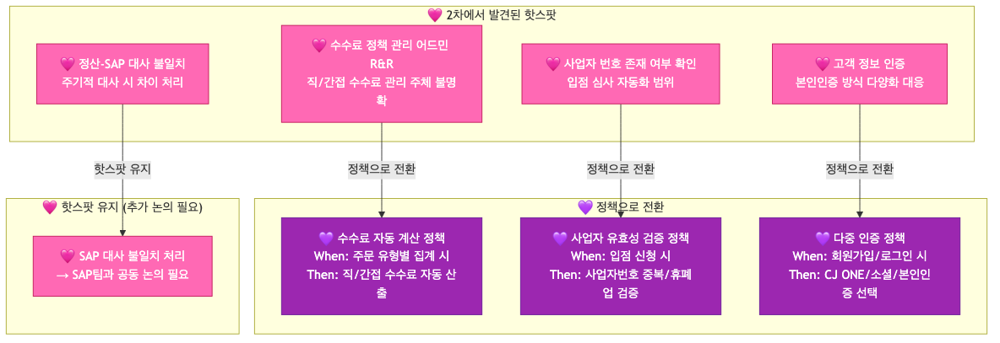

<details>
<summary>📊 원본 Mermaid 코드 보기</summary>

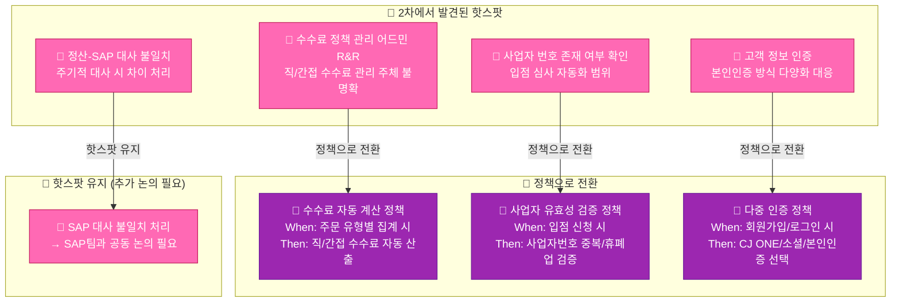

</details>

### 6.3 정책 후보 (~8개, When/Then 구조화)

| # | 도메인 | 💜 정책 | When (트리거) | Then (결과) |
|---|--------|--------|-------------|-----------|
| 1 | 정산 | 주문 유형별 수수료 자동 계산 | 결제가 승인되었다 | 직접/간접 수수료 자동 산출 |
| 2 | 정산 | 매출 확정 시 협력사 알림 | 매출이 확정되었다 | 카카오톡/메일로 정산 요청 알림 발송 |
| 3 | 정산 | 정산 확정 시 SAP 자동 전송 | 정산이 확정되었다 | SAP에 정산데이터 자동 전송 |
| 4 | 정산 | 휴·폐업 협력사 정산 차단 | 정산 지급 전 | 사업자 휴·폐업 여부 자동 확인 |
| 5 | 회원 | 로그인 5회 실패 시 차단 | 로그인 실패 5회 누적 | 로그인 자동 차단 |
| 6 | 회원 | PW 규칙 검증 | 회원가입/PW 변경 시 | PW 복잡도 규칙 자동 검증 |
| 7 | 협력사 | 사업자 유효성 자동 검증 | 입점 신청 시 | 사업자번호 중복/휴폐업 자동 확인 |
| 8 | 협력사 | 전자 계약 서명 완료 시 계약 자동 등록 | 전자 계약이 서명되었다 | 계약 정보 자동 등록 |

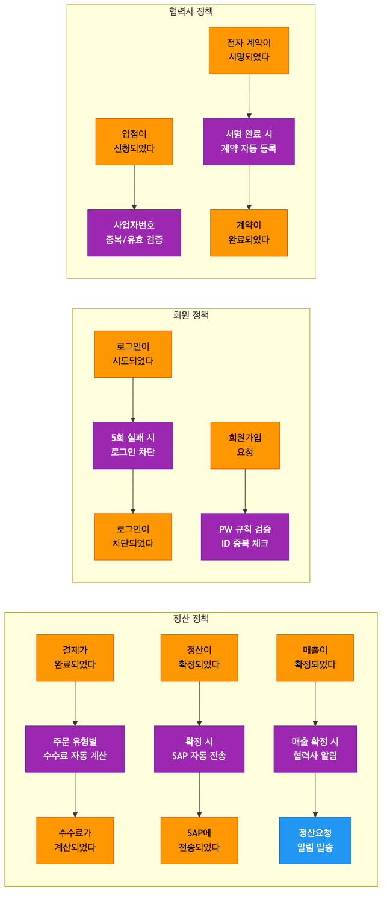

<details>
<summary>📊 원본 Mermaid 코드 보기</summary>

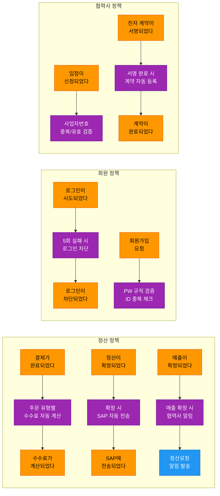

</details>

### 6.4 퍼실리테이터 스크립트

> "2차에서 13개 정책을 도출했는데, '직/간접 수수료 계산'처럼 **프로세스 설명**에 가까운 것이 많았습니다.
> 오늘은 **When(언제) / Then(뭘 한다)**을 붙입니다.
>
> 예시: '직/간접 수수료 계산' →
> **When**: 결제가 승인되었다 / **Then**: 주문 유형별 직접/간접 수수료가 자동 계산된다
>
> 또한 2차에서 핫스팟 🩷으로 표시했던 '수수료 정책 관리 어드민 R&R' 등을 정책으로 전환할 수 있는지 확인합니다."

---

## 7. Phase 4: 읽기 모델 도출 (25분)

### 7.1 플랫폼팀 눈높이 설명

> **읽기 모델 = "사용자가 보는 화면/대시보드"**
>
> 플랫폼팀의 읽기 모델은 **두 가지 사용자**를 위한 것입니다:
>
> - **🔧 내부 운영자** — 정산 현황, 회원 현황, 입점 심사 현황 등
> - **🔧 협력사(파트너)** — 자기 정산 내역, 전자 계약 관리, 광고비 현황 등
>
> draw.io에서 "전자 계약 정보 조회"가 이벤트로 작성되었는데,
> 조회는 상태 변경이 아니므로 📖 읽기 모델입니다.

### 7.2 읽기 모델 후보 (~8개)

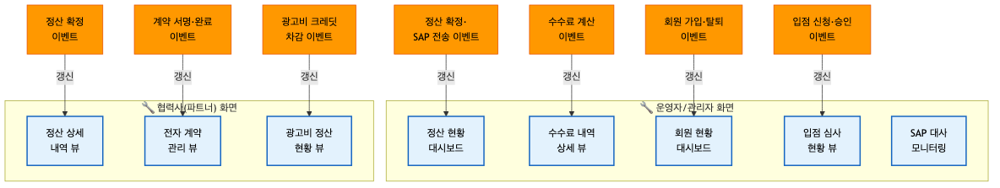

<details>
<summary>📊 원본 Mermaid 코드 보기</summary>

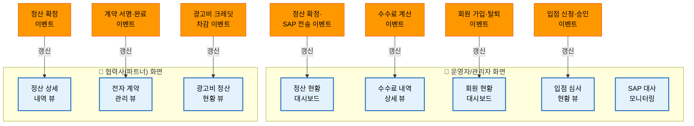

</details>

**읽기 모델 상세:**

| # | 📖 읽기 모델 | 대상 사용자 | 구성 데이터 | 갱신 트리거 |
|---|-------------|-----------|-----------|-----------|
| 1 | **정산 현황 대시보드** | 🔧 운영자 | 정산 진행 상태, 확정/미확정 금액, SAP 전송 현황 | 정산 확정, SAP 전송 |
| 2 | **수수료 내역 상세 뷰** | 🔧 운영자 | 협력사별 수수료, 직접/간접 내역, 계산 기준 | 수수료 계산 |
| 3 | **회원 현황 대시보드** | 🔧 운영자 | 가입 현황, 활성/휴면/탈퇴 회원 수, 인증 방식별 통계 | 가입 완료, 탈퇴 요청 |
| 4 | **입점 심사 현황 뷰** | 🔧 운영자 | 입점 신청 목록, 심사 상태, 사업자 검증 결과 | 입점 신청, 승인 |
| 5 | **SAP 대사 모니터링** | 🔧 운영자 | SAP 전송 건수, 대사 결과, 불일치 건수 | SAP 전송, 대사 완료 |
| 6 | **정산 상세 내역 뷰** | 🔧 협력사 | 정산 금액, 수수료 내역, 지급 일정, 세금계산서 | 정산 확정 |
| 7 | **전자 계약 관리 뷰** | 🔧 협력사 | 계약서 목록, 서명 상태, 계약 조건 | 계약 서명, 계약 완료 |
| 8 | **광고비 정산 현황 뷰** | 🔧 협력사 | 광고비 내역, 크레딧 잔액, 차감 이력 | 광고비 발생, 크레딧 차감 |

### 7.3 읽기모델-이벤트 연결 맵

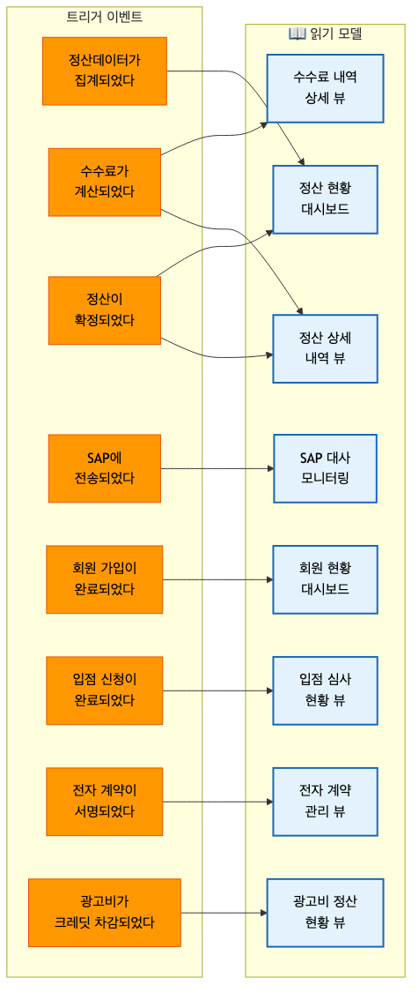

<details>
<summary>📊 원본 Mermaid 코드 보기</summary>

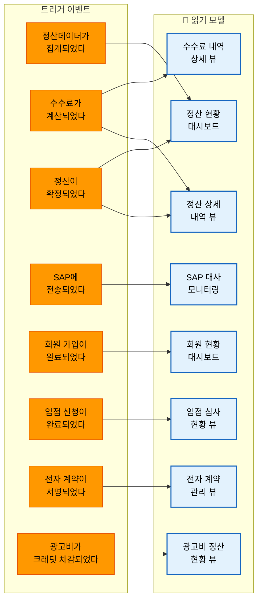

</details>

### 7.4 퍼실리테이터 스크립트

> "마지막으로, '사용자가 보는 화면'을 정리합니다. 📖 하늘색 포스트잇을 사용합니다.
>
> 플랫폼팀은 두 종류의 사용자가 있습니다:
>
> **운영자가 보는 화면** — 정산 대시보드, 수수료 내역, 회원 현황, 입점 심사, SAP 모니터링
> **협력사(파트너)가 보는 화면** — 정산 내역, 전자 계약, 광고비 현황
>
> draw.io에서 '전자 계약 정보 조회'가 이벤트로 있었죠?
> 그게 바로 📖 읽기 모델입니다. 조회는 상태 변경이 아니니까요.
> 총 8개를 정리하겠습니다."

---

## 8. 전체 통합 및 정리 (20분)

### 8.1 전체 통합 흐름

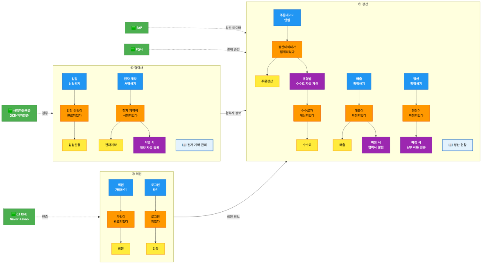

<details>
<summary>📊 원본 Mermaid 코드 보기</summary>

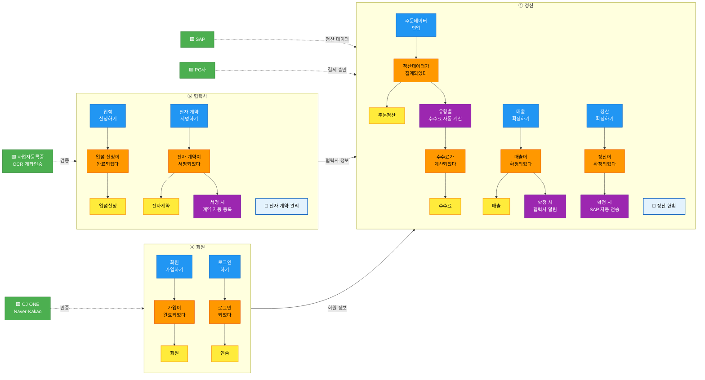

</details>

### 8.2 바운디드 컨텍스트 후보 프리뷰 (~4개)

| # | BC 후보 | 도메인 | 애그리게이트 | 독립 배포 | 독립 DB | 판정 |
|---|--------|--------|-----------|---------|--------|------|
| 1 | **정산** | ①②③ | 주문정산, 수수료, 매출, 광고비, 정산지급 | ✅ | ✅ | ✅ 확정 |
| 2 | **회원** | ④ | 회원, 인증 | ✅ | ✅ | ✅ 확정 |
| 3 | **고객서비스** | ⑤ | 고객문의 | 조건부 | ✅ | ⚠️ 회원에 통합 가능 |
| 4 | **협력사/파트너** | ⑥ | 입점신청, 전자계약, 협력사 | ✅ | ✅ | ✅ 확정 |

### 8.3 컨텍스트 맵 초안 (Upstream/Downstream)

| Upstream | 관계 패턴 | Downstream | 설명 |
|----------|----------|-----------|------|
| 🟩 PG사 | **ACL** | 정산 | 결제 승인/취소 데이터 수신, 자체 모델로 변환 |
| 정산 | **Customer/Supplier** | 🟩 SAP | 정산 확정 데이터를 SAP 형식으로 전송 |
| 협력사 | **Customer/Supplier** | 정산 | 협력사 정보(계좌, 수수료율)를 정산에 제공 |
| 회원 | **Separate Ways** | 정산 | 느슨한 결합 — 회원 정보 참조만 |
| 🟩 CJ ONE / 소셜 | **ACL** | 회원 | 외부 인증을 자체 인증 모델로 변환 |
| 🟩 사업자등록증 OCR | **ACL** | 협력사 | 외부 검증 결과를 입점 심사에 반영 |

### 8.4 플랫폼팀 특수성: 외부 시스템 18개 관리

> **워크샵에서 논의할 핵심 질문:**

| # | 질문 | 논의 포인트 |
|---|------|-----------|
| 1 | "SAP 연동을 정산 BC 내부에 둘 것인가, 별도 어댑터로 분리할 것인가?" | ACL 패턴 적용 범위 |
| 2 | "인증 시스템 6개(CJ ONE, Naver, Kakao, Apple, KCB, FDS)를 어떻게 추상화할 것인가?" | 인증 어댑터 설계 |
| 3 | "제휴사 API 8개(이베이, 11번가, 쿠팡 등)의 대사 로직을 어디에 둘 것인가?" | 정산 BC vs 별도 연동 BC |

### 8.5 다음 단계 안내

### 성과 체크리스트

- [ ] 이벤트 대폭 정제: ~33개 → ~25개 (라벨·오분류·명명 처리)
- [ ] 정책 구조화: 13개 → ~8개 (When/Then)
- [ ] 애그리게이트: ~11개 후보 확정
- [ ] 읽기 모델: ~8개 후보 도출
- [ ] 핫스팟 식별 및 정책 전환
- [ ] 바운디드 컨텍스트 ~4개 프리뷰 완료

**4차 워크샵에서 확정할 사항:**

1. BC 경계선 최종 확정 — 4개 BC 유지 or 고객서비스 통합
2. 컨텍스트 맵 확정 — 특히 SAP/PG 연동 패턴
3. 외부 시스템 18개 ACL 설계 방향
4. 팀 매핑 — 각 BC를 어느 팀이 담당할지
5. MSA 전환 우선순위 — 정산 BC의 복잡도가 높으므로 분리 전략 논의

---

## 9. 퍼실리테이터 비상 대응 카드

### 예상 난항 5가지 (플랫폼팀 특화)

| # | 난항 상황 | 대응 방법 |
|---|----------|----------|
| 1 | **"외부 시스템이 너무 많아요 (18개)"** — 연동 복잡도 혼란 | **"외부 시스템은 🟩 초록색으로 표시하고, 6개 그룹으로 분류합시다."** ERP/재무, 결제, 인증, 광고, 제휴, 파트너로 그룹핑하면 관리 가능합니다. 연동 세부사항은 나중에 ACL 설계 시 다룹니다. |
| 2 | **"정산 프로세스가 너무 길어요 (인입→집계→수수료→매출→정산→SAP)"** — 세분화 논쟁 | **"정산의 각 단계는 독립적인 비즈니스 이벤트입니다."** 집계와 수수료 계산은 다른 트랜잭션이고, 매출 확정과 정산 확정도 별개입니다. 각각의 실패/롤백 시나리오가 다르면 별개의 이벤트입니다. |
| 3 | **"EAI, 배치 등 기술 구현 논의가 시작됨"** | 🩷 핫스팟 포스트잇을 붙이고 넘어감. **"EAI는 연동 방식이고, 지금은 비즈니스 흐름에 집중합시다."** or-bat, EAI 인터페이스 같은 기술 용어는 이벤트 스토밍에서 제외합니다. |
| 4 | **"회원과 고객서비스를 나눠야 하나요?"** — BC 경계 논쟁 | **"독립적으로 배포/운영할 수 있는지가 기준입니다."** 고객 문의가 회원 시스템 없이 동작할 수 있다면 분리, 아니면 통합. 지금은 후보로 표시하고 4차에서 확정합시다. |
| 5 | **"SAP 대사 불일치 처리를 어떻게 해야 하나요?"** — 운영 이슈 | **"현재는 🩷 핫스팟으로 기록합니다."** SAP 대사는 정산 BC의 정책으로 다룰 수 있지만, 불일치 처리 로직은 SAP팀과 공동 논의가 필요합니다. 4차 워크샵 전에 사전 미팅을 잡읍시다. |

### 시간 조절 가이드

| 상황 | 조치 |
|------|------|
| Phase 1(정제)이 20분 이내 완료 | Phase 2(애그리게이트)에 남은 시간 배분 |
| Phase 1(정제) 시 라벨 제거에서 논쟁 | "이벤트인지 아닌지 3초 내 판단 안 되면 🩷 핫스팟" |
| Phase 2(애그리게이트)에서 정산 도메인이 30분 초과 | 회원/협력사는 퍼실리테이터 제안으로 빠르게 처리 |
| Phase 3+4가 시간 부족 | 정책은 정산 3개 + 핵심 2개만, 읽기모델은 운영자 5개만 집중 |
| 전체적으로 15분 이상 초과 | 마무리(8장)를 5분으로 단축, 외부 시스템 논의는 4차로 이월 |

---

## 10. 결과물 템플릿

### 3차 워크샵 결과 정리 양식

```
# 플랫폼개발팀 이벤트 스토밍 3차 워크샵 결과

## 일시: 2026년 _월 _일 (_) 14:00 ~ 17:00
## 참석자:

---

## 1. 이벤트 정제 결과
- 정제 전: ~33개
- 정제 후: __개
- 라벨 제거: __건, 오분류 교정: __건, 명명 정규화: __건

## 2. draw.io 오분류 교정 결과
| # | 원본 | 교정 전 색상 | 교정 후 | 비고 |
|---|------|-------------|--------|------|

## 3. 외부 시스템 정리 (18개 → __개 그룹)
| 그룹 | 🟩 외부 시스템 | 연동 내용 |
|------|--------------|----------|

## 4. 도메인별 애그리게이트 (확정 __개)

### 정산
| # | 애그리게이트 | 포함 이벤트 | 관련 커맨드 |
|---|-------------|-----------|-----------|

### 회원
| # | 애그리게이트 | 포함 이벤트 | 관련 커맨드 |
|---|-------------|-----------|-----------|

### 협력사
| # | 애그리게이트 | 포함 이벤트 | 관련 커맨드 |
|---|-------------|-----------|-----------|

## 5. 정책 (확정 __개, When/Then 구조화)
| # | 도메인 | 정책 | When (트리거) | Then (결과) |
|---|--------|------|-------------|-----------|

## 6. 읽기 모델 (확정 __개)
| # | 읽기 모델 | 대상 사용자 | 구성 데이터 | 갱신 트리거 |
|---|----------|-----------|-----------|-----------|

## 7. 바운디드 컨텍스트 프리뷰
| # | BC 후보 | 도메인 | 애그리게이트 | 판정 | 비고 |
|---|--------|--------|-----------|------|------|

## 8. 핫스팟 / 미결 사항
| # | 내용 | 관련 도메인 | 담당 | 기한 |
|---|------|-----------|------|------|

## 9. 다음 단계
- [ ] 결과 draw.io 정리 및 공유
- [ ] 4차 워크샵 일정 확정 (BC 확정 + 컨텍스트 맵)
- [ ] SAP 대사 불일치 처리 사전 미팅 (SAP팀)
- [ ] 외부 시스템 ACL 설계 방향 논의
- [ ] 핫스팟 사항 사전 논의
```
